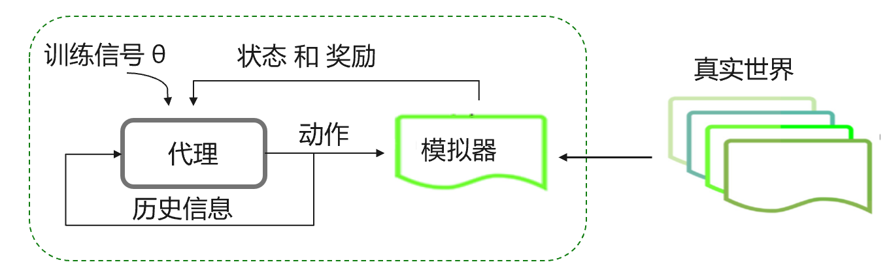

<!--Copyright © Microsoft Corporation. All rights reserved.
  适用于[License](https://github.com/microsoft/AI-System/blob/main/LICENSE)版权许可-->

  # 10.1 强化学习

 ## 强化学习是什么？

强化学习（Reinforcement Learning）通过不断试错和尝试的进行学习，并以做某件事带来的奖励作为指导其行为改善的基础进行学习。学习者不会被告知应该采取什么动作，而是自己通过尝试，去发现哪些动作会产生最丰厚的收益。试错和延迟收益，是强化学习两个最重要的特征。

在很长的一段时间里，强化学习被有监督学习（Supervised Learning）的光芒所遮掩。有监督学习是通过外部有知识的监督者提供的监督信号（label）来进行学习的，但这种学习已经完全违背了强化学习的宗旨，因为监督学习有标准的监督信号而不需要试错，这也是强化学习发展缓慢的原因。

直到2013年，DeepMind发表了利用强化学习玩Atari游戏的论文[4]，至此强化学习开始了新的十年。
2016年3月，通过自我对弈数以万计盘进行练习强化， 基于蒙特卡洛树搜索的强化学习模型AlphaGo[1]在一场五番棋比赛中4:1击败顶尖职业棋手李世石。
而深度强化学习真正的发展归功于神经网络、深度学习以及计算力的提升。纵观近年的顶级会议论文，强化学习的理论进步，应用领域逐渐爆发式增广。

## 10.1.1 强化学习概念

下面介绍一些强化学习里的关键要素：环境（Environment）, 智能体（Agent）, 奖励（Reward）, 动作（Action) ,状态（State)和策略（Policy）。有了这些要素我们就能建立一个强化学习模型。
强化学习需要去环境里探索和学习一个最优的策略，使得在该策略下获得的奖励最大， 以解决当前的问题。

图10.1.1. 强化学习里的基本概念 

由于真实的环境复杂度较高，且存在很多与当前问题无关的冗余信息, 通常构建模拟器（Simulator）来模拟真实环境。智能体（Agent）通常指做出决策的模型，即强化学习算法本身。智能体会根据当前这一时刻的状态 $s_t$ 执行动作 $a_t$ 来和环境（Envoriment）交互；同时，环境会将智能体执行动作后到达的下一个时刻的状态 $s_{t+1}$ 和这个动作拿到的奖励 $r_t$ 返回给智能体。智能体可以收集一个时间段内的状态，动作和奖励 $(𝑎_1, 𝑠_1, 𝑟_1, . . . , 𝑎_𝑡, 𝑠_𝑡, 𝑟_𝑡)$ 等历史信息，并将其用来训练自身的强化学习模型。

强化学习的目标是希望能在一段时间内获得的奖励$G_{t}$最大:
$$G_{t}=\sum_{k=0}^{T} \gamma^{k} r_{t+k+1}$$
其中, $\gamma \in[0,1)$, 表示一个折扣因子。 
$\gamma$越大，表示智能体更关心长期奖励；而$\gamma$越小，表示智能体更关心短期奖励。$T$表示一段时间。

例如，在贪吃蛇游戏里，智能体就是指吃豆人，它的目标是吃掉网格中的食物，同时避开途中的鬼魂。在这种情况下，环境就是网格世界，状态是智能体在网格世界中的位置，动作是上下左右的操作，奖励是智能体吃到了豆子，长期奖励是指被鬼魂吃掉而输掉了比赛或者最终赢得了比赛。

为了建立最优策略，智能体面临着探索新状态同时最大化其整体奖励的两难境地。这就是所谓的探索（Exploration）与利用（Exploit）的平衡。为了平衡两者，最好的策略可能牺牲短期的奖励。因此，智能体应该收集足够的信息，以便在未来做出最佳的整体决策。

强化学习模型包括策略（Policy）和价值函数（Value Function）。智能体需要根据策略去决定做出什么样的动作。策略可以分为：

1）决定性的策略（Deterministic Policy）
$$\pi (s)=a$$
2）非决定性的策略（Non-Deterministic Policy）
$$\pi (a|s)=p(a_t=a|s_t=s)$$
在某些情况下，策略可能是一个简单的函数或者查询表。而在另一些情况下，它可能涉及大量的计算，也可能是用神经网络（Artificial Neural Network）来近似。

价值函数指的是在策略$\pi$下能得到的未来的奖励的加权期望值：
$$V^{\pi}\left(s_{t}=s\right)=\mathbb{E}_{\pi}\left[r_{t}+\gamma r_{t+1}+\gamma^{2} r_{t+2}+\cdots \mid s_{t}=s\right]$$
其中$\gamma$是指衰减因子。

除此之外，强化学习里还涉及很多其他的概念，但是在这里不一一讨论，本章只介绍一些后面章节可能设计到的简单的概念。

 ## 强化学习用来解决什么问题呢？

真实世界很多问题需要在动态变化的情况下做出正确的序列决策，而强化学习非常擅长解决这类问题，并在以下领域有广泛的应用：

1）游戏（例如： 围棋[1], Atari小游戏[4], Dota2[5], 麻将[6], 星际争霸[17]等）。强化学习可以学习如何操作，才能顺利通关，赢盘或者争取拿到更高的分数；

2）自动驾驶 (例如：[13], [14], [15]等）。强化学习可以学习在什么样得路况下，采取什么样的操作（加速，减速等），可以让驾驶保证安全到达目的地；

3）路径规划 （例如：[16]等）。例如最经典的旅行商问题，强化学习可以规划从A城市到B城市，在必须遍历某些城市的约束下，路径如何走能花费最小；

4）推荐系统 （例如: [8], [9], [10]等）。例如，用强化学习根据用户的反馈，决定在首页推荐什么样的新闻，以及这些新闻防止的位置等。

5）金融交易 （例如：[7]）。例如，通过强化学习去预测股价的变化等。

6）控制 （例如：[11], [12]等）。例如，让机器人通过强化学习学会走路，跑步等。

等甚至物种的进化，也可以看成是一个在变化的环境里探索正确生存之道的问题。

在接下来的小节里，我们会进一步讨论强化学习和传统机器学习，以及自动强化学习之间的区别和联系。

## 参考文献
- [1] Silver D, Huang A, Maddison C J, et al. Mastering the game of Go with deep neural networks and tree search[J]. nature, 2016, 529(7587): 484-489.
- [2] Pham H, Guan M, Zoph B, et al. Efficient neural architecture search via parameters sharing[C]//International Conference on Machine Learning. PMLR, 2018: 4095-4104.
- [3] Watkins C J C H, Dayan P. Q-learning[J]. Machine learning, 1992, 8(3): 279-292.
- [4] Mnih V, Kavukcuoglu K, Silver D, et al. Playing atari with deep reinforcement learning[J]. arXiv preprint arXiv:1312.5602, 2013.
- [5] Berner C, Brockman G, Chan B, et al. Dota 2 with large scale deep reinforcement learning[J]. arXiv preprint arXiv:1912.06680, 2019.
- [6] Li J, Koyamada S, Ye Q, et al. Suphx: Mastering mahjong with deep reinforcement learning[J]. arXiv preprint arXiv:2003.13590, 2020.
- [7] Liu X Y, Yang H, Chen Q, et al. Finrl: A deep reinforcement learning library for automated stock trading in quantitative finance[J]. arXiv preprint arXiv:2011.09607, 2020.
- [8] Zheng G, Zhang F, Zheng Z, et al. DRN: A deep reinforcement learning framework for news recommendation[C]//Proceedings of the 2018 World Wide Web Conference. 2018: 167-176.
- [9] Chen S Y, Yu Y, Da Q, et al. Stabilizing reinforcement learning in dynamic environment with application to online recommendation[C]//Proceedings of the 24th ACM SIGKDD International Conference on Knowledge Discovery & Data Mining. 2018: 1187-1196.
- [10] Wang X, Chen Y, Yang J, et al. A reinforcement learning framework for explainable recommendation[C]//2018 IEEE international conference on data mining (ICDM). IEEE, 2018: 587-596.
- [11] Johannink T, Bahl S, Nair A, et al. Residual reinforcement learning for robot control[C]//2019 International Conference on Robotics and Automation (ICRA). IEEE, 2019: 6023-6029.
- [12] Kober J, Bagnell J A, Peters J. Reinforcement learning in robotics: A survey[J]. The International Journal of Robotics Research, 2013, 32(11): 1238-1274.
- [13] Sallab A E L, Abdou M, Perot E, et al. Deep reinforcement learning framework for autonomous driving[J]. Electronic Imaging, 2017, 2017(19): 70-76.
- [14] Wang S, Jia D, Weng X. Deep reinforcement learning for autonomous driving[J]. arXiv preprint arXiv:1811.11329, 2018.
- [15] Kiran B R, Sobh I, Talpaert V, et al. Deep reinforcement learning for autonomous driving: A survey[J]. IEEE Transactions on Intelligent Transportation Systems, 2021.
- [16] Zhang B, Mao Z, Liu W, et al. Geometric reinforcement learning for path planning of UAVs[J]. Journal of Intelligent & Robotic Systems, 2015, 77(2): 391-409.
- [17] O. Vinyals, I. Babuschkin, W. M. Czarnecki, M. Mathieu, A. Dudzik, J. Chung, D. H. Choi, R. Powell, T. Ewalds, P. Georgiev and others, "Grandmaster level in StarCraft II using multi-agent reinforcement learning," Nature, vol. 575, p. 350–354, 2019.