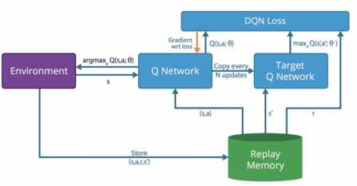
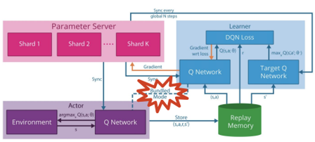
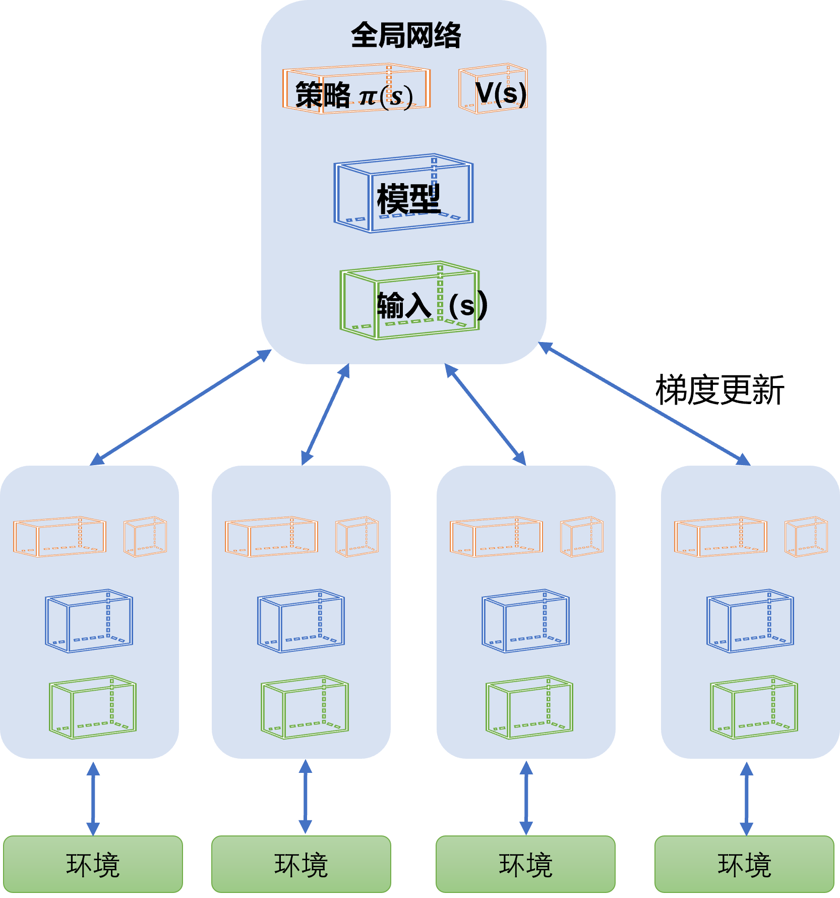
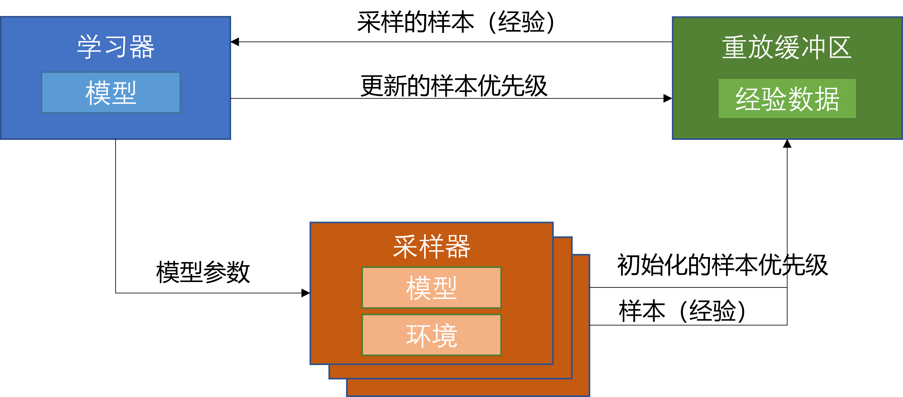

<!--Copyright © Microsoft Corporation. All rights reserved.
  适用于[License](https://github.com/microsoft/AI-System/blob/main/LICENSE)版权许可-->

  # 10.2.1 分布式强化学习算法

深度强化学习算法的发展与进步让许多行业受益。然而复杂的应用场景和大规模的工业应用对算法的要求也特别高，与此同时，深度强化学习由于需要探索试错的模式进行学习，因而强化学习需要探索大量的数据。模型的计算时间长、收敛速度慢导致整个强化学习的迭代速度慢， 从而抑制了工业界的快速发展。传统的单机CPU、GPU等计算已经远远不能够满足大数据时代的要求，经典的分布式集群(多机)、GPU集群运算开始进入了深度强化学习领域。

|  游戏代理  | CPU cores | GPU cores | TPU cores | 
|  :----    |     ----  |     ----  |     ----  |
| AlphaStar | ~50，000  | N/A | ~3，000 |
|OpenAI Five| ~80,000 - 173,000 | 480 - 1,536 | N/A |
| 王者荣耀5v5| 300,000 | ~200 | N/A |

从表中可以看到，在复杂游戏中训练一个高水平的AI所需的计算资源是巨大的。尽管目前学术界有许多工作在想方设法地优化算法来提升样本利用率，但是整体上来讲，目前深度强化学习对于训练样本的需求量仍然是非常惊人的。所以，也有不少工作在致力于如何更高效地利用计算资源，设计更好的计算架构，从而在更短的时间内产生更多的样本，达到更好的训练效果。许多分布式强化学习算法（Distributed Reinforcement Learning）和架构被提出，分布式强化学习提到了极大的发展。

  

  
  

  
图10.2.1.1 分布式强化学习发展路线 

  例如，在图10.2.1.1里展示了和DQN相关的分布式强化学习的发展路线，从2013的DQN到2018年的IMPALA，许多研究人员基于前人的工作不断地向前改进和发展。在下面的章节里，我们首先会介绍一些和分布式强化学习相关的基本概念，然后我们会讨论这些算法是如何演化的。

## 基本概念

- 学习器（Learner）：主要功能是，拿到训练样本来训练模型，更新模型参数。

- 采样器（Actor)：和环境交互采集数据，从学习器里拿到推理用的模型，将采样到地数据发给学习器或者重放缓冲区。

- 重放缓冲区（Replay Buffer）: 用来缓存采样到的数据。用户可以定义特定的采样策略，通过采样策略生成训练样本给学习器。

- 行为策略（Behavior Policy）：采样器用来和环境交互采样数据的策略。

- 目标策略（Target Policy）：根据行为策略产生的样本来不断学习和优化的策略，即训练完成最终用来使用的策略。

- 在线策略（On-policy）算法和离线策略（Off-policy）算法：在线策略算法就是指这类算法要求行为策略和目标策略得保持一致，而离线策略算法则不需要这个限制条件，目标策略可以根据任意行为策略产生的样本来学习和优化。

- 架构和交互方式：架构指的是强化学习里不同模块之间连接关系以及数据流动的关系。模块之间的交互方式包括同步或者异步等关系。

## 分布式强化学习算法的发展

我们以离线策略算法的DQN为例，讲述基于分布式的离线策略算法的发展和变化。

### DQN

原始的**DQN**[1]的架构非常简单，学习器和采样器在一个进程里，采样器和环境交互将数据放到一个重放缓冲区里。而学习器每隔一定的间隔，将数据从重放缓冲区里拿出并更新强化学习Q网络（Q Network）。很显然，当学习器和采样器在一个进程里的时候，他们互相依赖且不能并行，这降低了学习器和采样器的工作效率。即使将他们并行起来，由于学习器需要大量的数据去拟合，而单个采样器的效率太低，导致学习器大部分时间处于效率不高的状态。

  

  
  

  
图10.2.1.3 DQN的架构 

### GORILA
**Gorila**[2]是早期的将深度强化学习拓展到大规模并行场景的经典工作之一。
当时深度强化学习的SOTA还是DQN算法，因此该工作基于DQN提出了变体，拓展到大规模的计算集群。

在该架构中，学习器中对于Q网络的参数梯度会发给参数服务器（Parameter Server）。参数服务器收到后以异步SGD的方式更新网络模型。这个模型同步到采样器中，采样器基于该模型产生动作在环境中执行，产生的经验轨迹发往重放缓冲区。重放缓冲区中的数据被学习器采样拿去学习。另外，每过N步学习器还会从参数服务器同步最新的Q网络模型参数。在这个闭环中有四个角色：采样器, 学习器, 参数服务器和重放缓冲区。

那么GORILA相比于DQN， 主要的**区别**在于：

- 对于采样器：策略（Policy， 即Q Network）与环境交互，同样涉及探索与利用。但是GORILA里定义了一个捆绑模式（Bundled Mode），即采样器的策略与学习器中实时更新的Q-Network是捆绑的。

- 对于学习器： 学习器中对于Q-Network的参数梯度会发给参数服务器。

- 对于重放缓冲区：在GORILA里分两种形式，在本地模式下就存在采样器所在的机器上；而多机模式下将所有的数据聚合在分布式数据库中，这样的优点是可伸缩性好，缺点是会有额外的通信开销。

- 对于参数服务器：存储Q网络中参数的梯度（Gradient）的变化，好处是可以让Q网络进行回滚，并且可以通过多个梯度来使训练过程更加稳定。在分布式环境中，不可避免的就是稳定性问题（比如节点消失、网速变慢或机器变慢）。GORILA中采用了几个策略来解决这个问题，如丢弃过旧的和损失值（Loss）太过偏离均值时的梯度。

GORILA中可以配置多个学习器、采样器和参数服务器，放在多个进程或多台机器上以分布式的方式并行执行。如实验中参数服务器使用了31台机器，学习器和采样器进程都有100个。实验部分与DQN一样基于Atari平台。在使用相同参数的情况下，该框架中在49中的41个游戏中表现好于非并行版本传统DQN，同时训练耗时也有显著减少。

  

  
  

  
图10.2.1.4 GORILA的架构 

### A3C
**A3C**[3]是一个基于actor-critic算法。在A3C里没有参数服务器、没有公用的重放缓冲区。

具体来说：

- 每一个工作器（worker）实际上包含一个采样器、一个学习器还有一个小的缓冲区（通常是先进先出）。

- 每一个工作器（worker）中学习器计算得出梯度后都发送给全局网络（global network）。每一个工作器（Worker）中采样器都可以用不同的探索策略与环境进行交互，这些样本可以存在一个小缓冲区中。

- 全局网络（global network）接收多组梯度后再更新参数，再把异步地把参数拷贝给所有工作器。

  

  
  

  
图10.2.1.5 A3C的架构 

而A3C架构的**优点**是：

- 每一个采样器可以用不同的策略探索环境，使得样本更具有多样性，探索到的状态空间更大。
- 全局网络等所有工作器都传递了梯度后再更新，使训练更稳定。

- 大规模并行非常容易。

- 在A3C架构中，每个工作器都独自计算梯度，全局网络只负责使用梯度，所以全局网络的计算量并不大。在作者的原始实现中，A3C不需要GPU资源，只需要CPU即可在Atari等游戏上达到很好的效果。

但同时A3C本身存在着**问题**：

- 当模型变得复杂时，在CPU上计算梯度的耗时会变得非常大，而如果迁移到GPU上，由于每个工作器都需要一个模型的副本，又会需要大量的GPU资源。

- 当模型变大时，传输梯度和模型参数的网络开销也会变得巨大。

- 全局网络使用异步方式更新梯度，这意味着在训练过程中，部分梯度的方向并不正确，从而可能影响最终的训练效果。这个现象会随着工作器的数量增多变得越来越严重，这也一定程度上限制了A3C的横向扩展能力。

### ApeX

**ApeX**[4]是2018年在DQN, GORILA之后的又一个基于DQN的工作。

它和DQN,GORILA的**差别**是：

- 对于采样器: 以不同的探索策略和环境交互。

- 对于学习器: 和GORILA不同，ApeX里中心学习器只有一个，从重放缓冲区里拿到数据学习。

- 对于重放缓冲区：不是均匀采样，而是优先考虑其中的一些样本，从而让算法专注于那些重要的数据。

  

  
  

  
图10.2.1.6 ApeX的架构 

ApeX架构可以适配到一些现有的算法上，例如DQN或者DDPG。将ApeX架构适配到DQN上的，我们称之为ApeX-DQN。 、在Atari实验环境中，Ape-X DQN的采样器用了360个机器。采样器积累一段时间数据以异步方式发送。学习器以异步方式拿数据。实验结果表示Ape-X比DQN，GORILA在训练速度和最终得分上都有优势。

### IMPALA

**IMPALA** [5]（Importance Weighted Actor-Learner Architectures）是基于actor-critic和A3C的改进，最大的创新是提出了V-trace算法，对off-policy现象做了一定的修正。

在IMPALA架构中，每个采样器都拥有一个模型的副本，采样器发送训练样本给学习器，学习器更新模型之后，会将新模型发送给采样器。在整个过程中，采样器和学习器一直在异步运行中，即学习器只要收到训练数据就会更新模型，不会等待所有的采样器；而采样器在学习器更新模型时依然在采样，不会等待最新的模型。

IMPALA与A3C具体的**区别**在于：

- 对于采样器来说：每一个采样器执行的行为策略不再是只来自一个学习器，可以来自多个学习器. 

- 对于重放缓冲区来说：IMPALA里有两种模式，一种没有引入重放缓冲区，本质上是一种on-policy的算法；另一种是用了随机采样的重放缓冲区；

显然这样的运行方式会产生off-policy现象，即行为策略和目标策略不一致。在IMPALA中，作者在数学上推导出了一种严谨的修正方式：V-trace算法。该算法显著降低了训练样本off-policy带来的影响。下表可知，使用V-trace修正之后，相比于其他几种修正方式，最终的收敛效果有明显提升。

  

  
  

  
图10.2.1.7 IMPALA的架构 

### SEEDRL

IMPALA在神经网络模型比较简单的时候性能很好，但当神经网络变得复杂的时候，该架构也有瓶颈。主要的**问题**有以下几点：

- 采样的时候，推理（Inference）放在采样器上执行，因为采样器是运行在CPU上的，所以当神经网络变复杂之后，推理的耗时就会变得很长，影响最终的运行效率。

- 采样器上执行了两种操作，一个是和环境交互，另一个是用行为策略做推理。很多游戏或者环境都是单线程实现的，而神经网络的推理计算则可以使用多线程加速，将两种操作放在一起，整体上会降低CPU的使用率。

- 当模型很大的时候，模型参数的分发会占用大量的带宽。

因为**SEEDRL**[6]的工作就是解决这些问题，SEEDRL的架构对比见下图：

  

  
  

  
图1.02.1.8 SEEDRL的架构 

和IMPALA相比，SEEDRL的**区别**主要是：

- 把采样器上的推理过程和学习器放在一同一块TPU上。而采样器和学习器之间只交换状态和采取的动作。

在SEEDRL中，采样器和学习器分布在不同的节点中，采样器通过gRPC来和学习器进行通信，SEEDRL使用了V-Trace来进行off-policy修正。

## 小结

通过本章的学习，可以发现强化学习算法，尤其是分布式强化学习算法之间的架构是差距非常大的。体现在代理的运行的硬件，交互的方式，代理里不同模块之间的连接关系等都会有很大的差别。在下一章里，我们会讨论算法架构之间的差异会给设计强化学习系统带来什么样的挑战。

  ## 参考文献

- [1] Mnih V, Kavukcuoglu K, Silver D, et al. Playing atari with deep reinforcement learning[J]. arXiv preprint arXiv:1312.5602, 2013.
- [2] Nair A, Srinivasan P, Blackwell S, et al. Massively parallel methods for deep reinforcement learning[J]. arXiv preprint arXiv:1507.04296, 2015.
- [3] Mnih V, Badia A P, Mirza M, et al. Asynchronous methods for deep reinforcement learning[C]//International conference on machine learning. PMLR, 2016: 1928-1937.
- [4] D. Horgan, J. Quan, D. Budden, G. Barth-Maron, M. Hessel, H. Van Hasselt and D. Silver, "Distributed prioritized experience replay," arXiv preprint arXiv:1803.00933, 2018.
- [5] Espeholt L, Soyer H, Munos R, et al. Impala: Scalable distributed deep-rl with importance weighted actor-learner architectures[C]//International Conference on Machine Learning. PMLR, 2018: 1407-1416.
- [6] Espeholt L, Marinier R, Stanczyk P, et al. Seed rl: Scalable and efficient deep-rl with accelerated central inference[J]. arXiv preprint arXiv:1910.06591, 2019.
- [7] Arulkumaran K, Cully A, Togelius J. Alphastar: An evolutionary computation perspective[C]//Proceedings of the genetic and evolutionary computation conference companion. 2019: 314-315.
- [8] Raiman J, Zhang S, Wolski F. Long-term planning and situational awareness in OpenAI five[J]. arXiv preprint arXiv:1912.06721, 2019.
