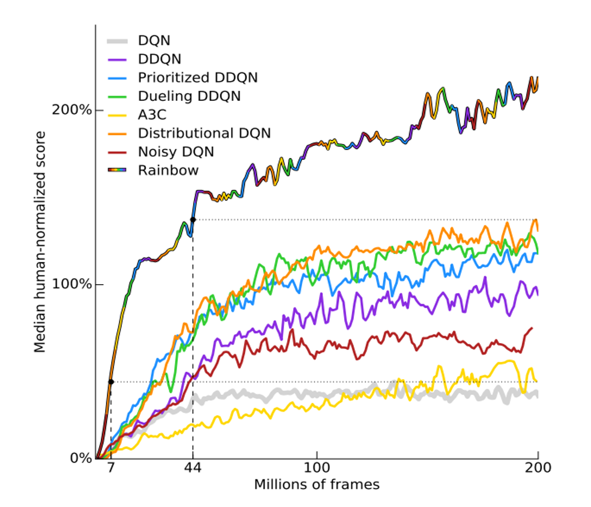
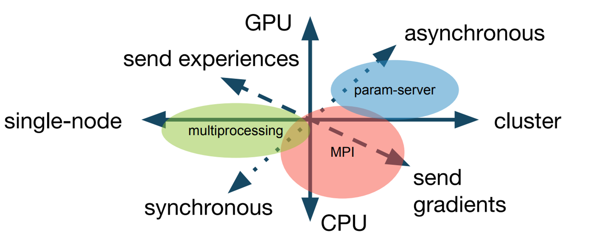
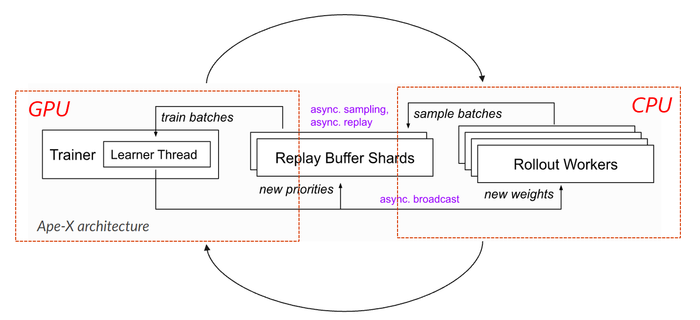

<!--Copyright © Microsoft Corporation. All rights reserved.
  适用于[License](https://github.com/microsoft/AI-System/blob/main/LICENSE)版权许可-->

# 10.2.2 (分布式)强化学习对框架的需求和挑战

- [10.2.2 (分布式)强化学习对框架的需求和挑战](#1022-分布式强化学习对框架的需求和挑战)
  - [强化学习系统面临的挑战和机器学习系统相比，有什么不同？](#强化学习系统面临的挑战和机器学习系统相比有什么不同)
  - [强化学习对于框架的**需求**有哪些呢？](#强化学习对于框架的需求有哪些呢)
  - [小结与讨论](#小结与讨论)
  - [参考文献](#参考文献)
  
## 强化学习系统面临的挑战和机器学习系统相比，有什么不同？
  
  首先， 为什么强化学习不能复用过去的机器学习或者深度学习的平台呢？事实上，在Github上关于强化学习的开源库有将近2w+个。但是大量的框架，都是难以复用的代码。
  主要的原因有以下几点如下：

- 强化学习算法的**可复现性**比较差。随机种子，参数，具体实现的差别等因素的变化，都可能会对强化学习的结果有较大的影响。 

  - 例如，在Rainbow [4] 里介绍可以结合DQN使用的六种技巧, 包括：Dueling DQN, DDQN, Prioritized DQN, Noisy DQN等。从图10.2.8上我们可以看出，应用不同的技巧会使得DQN的收敛值发生改变。同时采用6种技巧的Rainbow可以得到超越其他曲线的效果。这些技巧反映在代码上可能仅仅有几行代码的差别。

  - 而另一篇文章[1]里，给PPO带来真正的性能上提升以及将策略（policy）约束在信任域）trust region）内的效果，不是通过PPO论文中提出的对新策略和原策略的比值进行裁切（clip）带来的，而是通过代码层面（code-level）的一些技巧带来的。这侧面印证了，实现的不同实现也会对强化学习有比较大的影响。

  

  
  

  
图10.2.8 结合了不同技巧的DQN的表现 

- 强化学习的**执行策略**多种多样。这个执行策略包括：运行的硬件或者机器（例如：GPU或者CPU， 单机或者集群），模块之间的交互模式（同步或者异步），通信的内容（数据或者梯度），通信架构的实现（多进程，MPI或者参数服务器）等。

  <!-- 
  

  
  

  
图10.2.2.2 强化学习里不同的执行策略维度 
 -->

  - 在传统的机器学习或者深度学习里，数据集通常是固定的。模型的任务就是拟合数据以求解最优解或者极优解，因此模型可以只跑在单一的机器（例如GPU）上。而强化学习因为数据是边采样得到的，采样和训练可以在不同的硬件或者机器上。例如，在IMPALA算法架构里，采样器的推理部分跑在128个CPU上，而学习器的模型训练部分跑在1个GPU上。
  
  - 同时，根据采样和训练过程是否解耦，可以将强化学习分为同步算法或者异步算法。例如，PPO是一种同步算法，因为它会在模型采样到一定量的数据后开始训练，然后继续采样，往复迭代直到收敛。而ApeX是一种异步算法，它的采样进程将样本存储到重放缓冲区里，而训练进程从里面异步地采样数据进行训练。在ApeX-DQN里，采样过程和训练过程是异步进行交互的。

- 不同的强化学习算法的**结构差异**很大。

   下图来源于RLlib[3]，从下表里可以看出，不同的算法族群，他们的架构差异是很大的，体现在是否使用以下组件上：策略评估（Policy Evaulation），重放缓冲区（Replay Buffer），基于梯度优化器（Gradient-based Optimizer），以及其他异构的难以归类的组件。

  |  算法类   | 需要策略评估  |  有重放缓冲区 | 有基于梯度的优化器  | 其他的模块|
  |  ----  |  ----  |  ----  |  ----  |  ----  |
  | DQN Based | &#10004; | &#10004; | &#10004; | | 
  | Actor-critic Based | &#10004; | &#10004; | &#10004; | | 
  | Policy Gradient | &#10004; | &#10004; | &#10004; | | 
  | Model Based | &#10004; | &#10004; | &#10004; | Model-based Planning| 
  | Multi-agent | &#10004; | &#10004; | &#10004; | | 
  | Evolutionary Methods | &#10004; | | | Derivate Optimization| 
  | AlphaGo | &#10004; | &#10004; | &#10004; | MCTS; Derivate Optimization| 

- 分布式强化学习**算法和架构互相影响**。新的架构通常可以让算法在原来的基础上跑得更快，但因此可能会带来收敛不好的问题；而通常需要提出新的算法，来解决新架构带来的收敛问题。例如，IMPALA提出了V-trace算法。该算法显著降低了（由和目标策略不一样的行为策略生成的）训练样本带来的影响，从而使得算法相比之前的工作，能在速度和效果获得提升。

我们重新总结以上四点强化学习对框架的**挑战**, 即：

   - 强化学习算法复现比较困难；
   - 分布式强化算法的执行策略多种多样；
   - 不同的强化算法结构存在差异；
   - 分布式强化算法和架构互相影响和变化；

但是，由于大部分的开源框架都是针对特定的算法和架构模式开发的，因此这些开源框架难以适配到不同的分布式强化学习算法下，难以满足通用分布式强化学习框架的需求。

## 强化学习对于框架的**需求**有哪些呢？

  通过对于挑战的分析，我们可以总结出以下需求（包括但不仅限于）:

  - 强化学习框架需要有较好的可扩展性；良好的可扩展性可以让用户模块化编程，使得编程更高效清晰。
  可扩展性的需求体现在以下几个方面（包括但不限于）：

    - 通用的用户友好的强化学习算法接口；不同的强化学习的算法的结构差异很大，导致当前的开源框架难以用一个统一的接口去实现大部分的算法，因而用户难以在一个框架上自定义算法。这也是导致Github上许多用户自己开发特定框架的原因。

    - 支持可复现各种强化学习算法和架构；

    - 支持不同的强化学习的执行策略；

- 高效率高并发的数据采集;

  在传统的机器学习里，数据集通常都是预先定义好的。和传统机器学习不同，强化学习需要迭代地收集数据和训练数据，并且自主地决定采样什么样地数据。因而，数据量的大小和模型的效果相关，采样数据的效率是强化学习的关键;

  由于工业界的环境可能是在单独的服务器或者机器上，因而与环境交互的时间可能会会较长，而导致采样进程的效率低下。将采样过程并行化通常是一个可行的策略，但同时也给用户带来了分布式编程的成本。 [6]等工作利用C++ 线程并行托管多个环境实例，为用户提供了一个高效的轻量级的环境模拟库。这些工作的好处是免去了用户的开发成本，但同时他们也自身的局限。他们的局限在于只能支持特定领域的模拟器;

  高效率高并发的数据采集的需求进一步划分包括但不仅限于：

    - 支持与环境的多种交互方式。例如，是把数据推送（push）给环境，还是主动从环境中拉取（pull）数据;

    - 提供易用的分布式编程模式（programming API），减少用户的开发成本;

- 高性能的通信框架; 
  
  在强化学习尤其是分布式强化学习里，由于模块较多，模块可能分布在不同的硬件上，因而需要在不同的硬件之间传输数据。同时，不同的模块之间通信的传输的信息量可能跨度很大。

  例如在图10.2.9中，ApeX的架构里，采样器的进程会将采样到的数据，从内存里传送到GPU的内存上；而学习器的进程会将更新的模型参数，从GPU的内存里传送到内存里给采样器进程做推理。

  高性能的通信框架的需求进一步划分包括但不仅限于：

    - 支持简单易用的通信接口。
    - 减少上下文切换的代价。
    - 优化数据的传输。 例如，利用压缩技术，增加传输的吞吐量（throughput）或者减少传输数据的大小。

  

  
  

  
图10.2.9 ApeX架构里的上下文切换 

  另外，有部分强化学习开源框架（例如[5]）也在为强化学习的可复现性而努力，包括支持可复现的强化学习算法，提出一些支持复现的数据集等等。

## 小结与讨论

在本章小节里，我们讨论了强化学习框架和系统面临的种种挑战。相比于深度学习框架来说，强化学习框架更具有挑战性。而面对这些挑战，我们提出了当前强化学习框架和系统面临的需求，并且给出了部分当前框架里的解决方案和思路。

## 参考文献
- [1] Engstrom, Logan, et al. "Implementation matters in deep policy gradients: A case study on PPO and TRPO." 
- [2] Hessel, Matteo, et al. "Rainbow: Combining improvements in deep reinforcement learning." 
- [3] Liang, Eric, et al. "Ray rllib: A composable and scalable reinforcement learning library."
- [4] Hessel M, Modayil J, Van Hasselt H, et al. Rainbow: Combining improvements in deep reinforcement learning[C]//Thirty-second AAAI conference on artificial intelligence. 2018.
- [5] Fan L, Zhu Y, Zhu J, et al. Surreal: Open-source reinforcement learning framework and robot manipulation benchmark[C]//Conference on Robot Learning. PMLR, 2018: 767-782.
- [6] Tian Y, Gong Q, Shang W, et al. Elf: An extensive, lightweight and flexible research platform for real-time strategy games[J]. Advances in Neural Information Processing Systems, 2017, 30.

