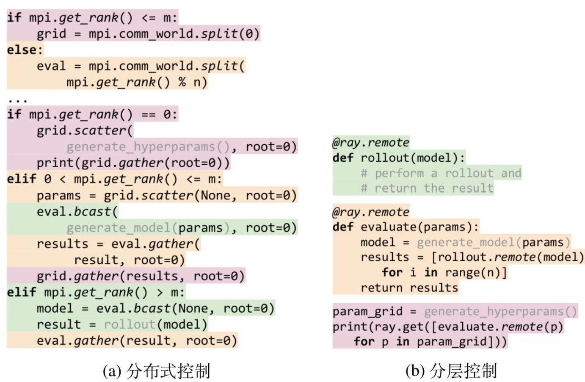
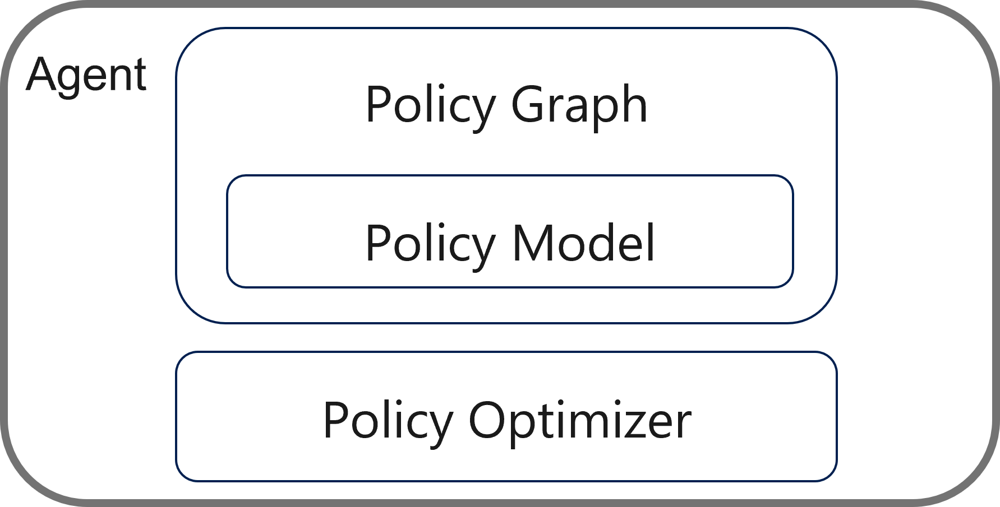
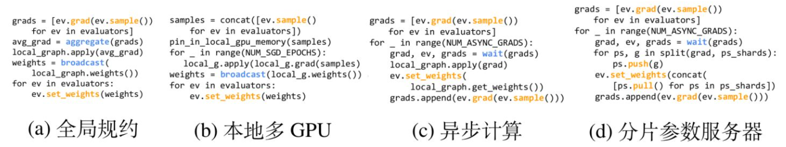
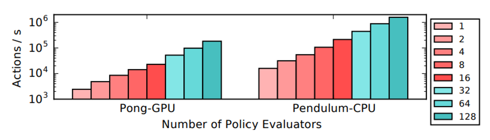
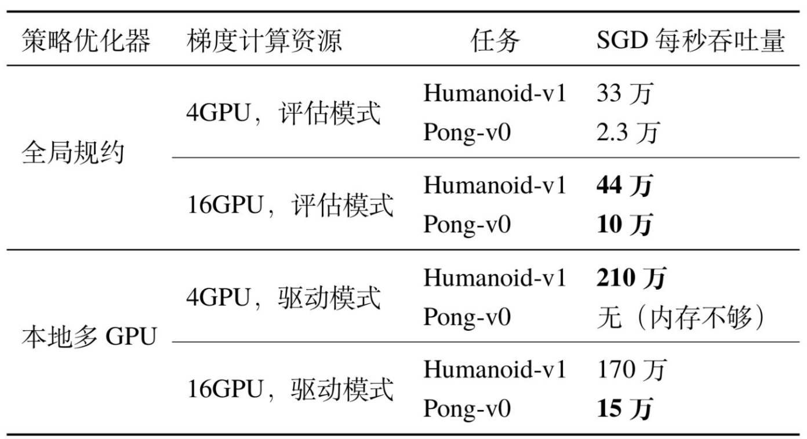

<!--Copyright © Microsoft Corporation. All rights reserved.
  适用于[License](https://github.com/microsoft/AI-System/blob/main/LICENSE)版权许可-->

  # 10.2.3 分布式强化学习框架

当前在GITHUB上的强化学习开源项目超过2w个，可以将他们分为以下大类：
- 支持某些特定的环境。例如：gym[2]支持了一些简单的2D小游戏（例如Atari）。ELF支持一系列并发的实时战略 (RTS) 游戏。 在 C++ 方面，ELF[3]用C++ 线程并行托管多个游戏。 在 Python 方面，ELF一次返回一批游戏状态。

- 支持通用的强化学习的算法。例如：Baselines[4]等强化学习工具包。

- 支持分布式强化学习算法，例如：ACME[5]，RLlib[1]等强化学习工具包。

- 针对某个算法开发的项目，不存在通用性；例如：torchbeast[6]是一个基于IMPALA[7]的高效实现，除了IMPALA以外，对其他算法的支持有限。

下表整理了部分受欢迎的强化学习平台：

  

  
  

  
图10.2.3.1 受欢迎的开源强化学习平台 

除此之外，还可以根据是否支持多智能体（multi-agent）的任务进行分类。例如：MARO[8]就是一个多智能体资源优化 (MARO) 平台，可以用于实际资源优化。

其中，我们挑出一些最受欢迎的经典强化学习平台，根据其论文讨论他们在系统设计时的思考。

 ## RLlib

在RLlib[1]设计之初，并没有太多的可以参考的统一的强化学习平台。
那时候虽然深度学习(Deep Learning)的系统和抽象方面取得了很大的进步（例如：Tensorflow[9]， Pytorch[10]等），但对强化学习的系统和抽象设计方面的进展相对较少。尽管如此，强化学习中的许多挑战都源于对学习和仿真的规模化需求，同时也需要整合快速增长的算法和模型。因此设计这么一个系统是很有必要的。

而RLlib提出的区别于其他框架的主要观点包括：

- 采用自顶向下分层控制分布式强化学习算法，从而更好地采用并行计算资源调度来完成这些任务；

- 需要定义一个通用的强化学习范式，能够让一系列的强化学习算法达到可拓展和大量代码重用；

 ### 分层控制分布式强化学习

#### 强化学习训练的计算模式不规则性

目前的强化学习算法在其创建的计算模式中是高度不规则的，如表10.2.3.2所示，突破了如今流行的分布式框架所支持的计算模型的界限。
这种不规则发生在如下几个层面：

- 根据算法的不同，任务的持续时间和资源需求也有数量级的差异；例如A3C的更新可能需要几毫秒，但其他算法如PPO需要更大粒度时间颗粒。

- 通信模式各异，从同步到异步的梯度优化，再到在高通量的异策略学习算法（如Ape-X[12]和IMPALA）中拥有多种类型的异步任务，通信模式各不相同。

- 基于强化学习或深度学习训练相结合的超参数调优、或是在单一算法中结合无导数优化和基于梯度的优化等方式产生嵌套计算。强化学习算法经常需要维护和更新大量的状态，包括策略参数、重放缓冲区，甚至还有外部模拟器等。

  

  
  

  
图10.2.3.2 不同强化学习算法，计算需求量跨度大  

#### 当前的现状和解决方案

因此，开发人员只能使用大杂烩的框架来实现他们的算法，包括参数服务器(Parameter Server)、类MPI框架中的集体通信基元、任务队列等。
对于更复杂的算法，常见的做法是构建自定义的分布式系统，在这个系统中，进程之间独立计算和协调，没有中央控制。虽然这种方法可以实现较高的性能，但开发和评估的成本很大，不仅因为需要实现和调试分布式程序，而且因为这些算法的组成进一步使其实现复杂化。此外，今天的计算框架（如Spark[11]、MPI）通常是假设有规律的计算模式，当子任务的持续时间、资源需求或嵌套不同时，这些计算框架会有性能损失。

因此，RLLib希望以一个单一的编程模型能够满足强化学习算法训练的所有要求，并且可以在不放弃结构化计算的情况下实现。

  

  
  

  
图10.2.3.3 目前大多数强化学习算法都是以完全分布式的方式编写的 (a)。RLlib提出了一种分层控制模型 (c)，它扩展了 (b)，支持强化学习中的嵌套和超参数调优工作，简化和统一了用于实现的编程模型。 

举例来说，对于每个分布式强化学习算法，RLlib写出一个等效的算法，表现出逻辑上集中的程序控制（图(b)）。也就是说，不用让独立执行进程（图(a) 中的A、B、C、D）相互协调（例如，通过RPC、共享内存、参数服务器或集体通信），而是一个单一的驱动程序（(b) 和(c) 中的D）可以将算法的子任务委托给其他进程并行执行。在这种工作模式中，工作进程A、B、C被动地保持状态（如策略或仿真器状态），但在被D调用之前不执行任何计算，为了支持嵌套计算，我们提出用分层委托控制模型（图(c)）来扩展集中控制模型，允许工作进程（如B、C）在执行任务时进一步将自己的工作（如仿真、梯度计算）委托给自己的子工作进程。

在这样一个逻辑上集中的分层控制模型的基础上搭建强化学习框架，有如下重要**优势**：

- 等效算法在实际应用中往往更容易实现，因为分布式控制逻辑完全封装在一个进程中，而不是多个进程同时执行。

- 将算法组件分离成不同的子程序（例如，做卷积运算、计算梯度与某些策略的目标函数的梯度），可以在不同的执行模式下实现代码的重用。有不同资源需求的子任务（CPU任务或者GPU任务）可以放在不同的机器上，从而能够降低计算成本。

- 在这个模型中编写的分布式算法可以相互之间无缝嵌套，满足了并行性封装原则。

举例来说明具体的编程模型上的差别：
  

  
  

  
图10.2.3.4 

如图10.2.3.4所示，将分布式超参数搜索与分布式计算的函数组合在一起，会涉及到复杂的嵌套并行计算模式。如果使用MPI (a)，作为底层来设计并行化写强化学习算法代码的时候，需要对每个算法的适配进行定制化代码修改。这限制了新的分布式强化学习算法的快速开发。使用分层控制 (b)，组件可以保持不变，并且可以作为远程任务简单地调用。
。尽管图10.2.3.4中的示例很简单，但例如HyperBand、PBT等需要长时间运行的、精细的超参数调整的算法越来越需要对培训进行细粒度的控制。

因此RLlib在基于任务的灵活编程模型（如Ray[13]）的基础上，通过分层控制和逻辑中控来构建强化学习算法库。 基于任务的系统允许在细粒度的基础上，在子进程上异步调度和执行子例程，并在进程之间检索或传递结果。

 ### 通用的强化学习范式

 由于强化学习算法之间的差距较大，在RLLib之前几乎没有一个统一强化学习接口的框架。因而大部分的代码可复用性差，导致强化学习开发和学习的成本较高。

RLlib将强化学习算法里的代理（agent）抽象成两大块：和算法相关的策略(policy)和与算法无关的策略优化器 （policy optimizer). 其中策略包括策略图（policy graph）和 策略模型（policy model）。策略图定义了如何算法里如何探索和利用，以及如何用采样得到的数据训练模型等，策略模型用来定于算法的模型的网络结构。这两块都支持用户的定制化。而策略优化器是与算法无关的部分。策略优化器负责分布式采样、参数更新和管理重放缓冲区等性能关键任务。

  

  
  

  
图10.2.3.5 RLlib里统一的抽象接口 

 将策略优化器如此抽象具有以下**优点**：
 通过将执行策略与策略优化函数定义分开，各种不同的优化器可以被替换进来，以利用不同的硬件和算法特性，却不需要改变算法的其余部分。策略图类封装了与深度学习框架的交互，使得用户可以避免将分布式系统代码与数值计算混合在一起，并使优化器的实现能够被在不同的深度学习框架中改进和重用。

  

  
  

 
图10.2.3.6 四种RLlib策略优化器步骤方法的伪代码。 每次调用优化函数时，都在本地策略图和远程评估程序副本阵列上运行。 图中用橙色高亮Ray的远程执行调用，用蓝色高亮Ray的其他调用。

 如图10.2.3.6所示，通过利用集中控制，策略优化器简洁地抽象了强化学习算法优化中的多种选择：同步与异步，全局规约与参数服务器，以及使用GPU与CPU的选择。RLlib的策略优化器提供了与优化的参数服务器算法（图A-5(a)）和基于MPI的实现（评估测试章）相当的性能。这种优化器在逻辑中控模型中很容易被实现，因为每个策略优化器对它所属的分布式计算进程有完全的控制权。

### 评估强化学习系统

那么，当完成了强化学习系统设计以后，需要怎么评估呢？

 #### 算法的完备性

 如图，目前可以支持大部分的算法；

  

  
  

 
图10.2.3.7 RLlib的策略优化器和评价器在逻辑中控模型中支持了常见的组件（评估、回放、梯度优化器），并利用Ray的分层任务模型支持其他分布式组件。

 #### 性能的高效性

 1）采样效率

 策略评估是所有强化学习算法的重要组成部分。RLlib对从测评略评估器采样进程收集样本的可扩展性进行了基准测试。

  

  
  

 
图10.2.3.10 策略评估的吞吐量从1到128核几乎呈线性扩展。

 2）大规模测试

 RLlib使用Redis、OpenMPI和分布式TensorFlow评估了RLlib在ES、PPO和A3C三种算法上的性能，并与专门为这些算法构建的专用系统进行了比较。所有实验中都使用了相同的超参数。

  

  
  

 
图10.2.3.9 在Humanoid-v1任务上达到6000的奖励所需的时间。RLlib实现的ES和PPO的性能优于已有实现。

 3）多GPU训练

  事实上，不同的策略在不同条件下表现更好，这表明策略优化器是一个有用的抽象。
  

  
  

 
图10.2.3.8 一个专门的多GPU策略优化器在数据可以完全装入GPU内存时，表现优于全局规约。

总结一下：
RLlib是一个强化学习的开源框架，它利用细粒度的嵌套并行机制在各种强化学习任务中实现了最优性能。它既提供了标准强化学习算法的集合，又提供了可扩展的接口，以方便地编写新的强化学习算法。即便如此，RLlib中仍然存在一些设计不合理的地方，并且后续有许多工作针对RLlib进行了改进。

思考：
RLlib中哪些设计的地方不合理呢？

 ## 参考文献
 - [1] Liang E, Liaw R, Nishihara R, et al. RLlib: Abstractions for distributed reinforcement learning[C]//International Conference on Machine Learning. P  MLR, 2018: 3053-3062.
- [2] Brockman G, Cheung V, Pettersson L, et al. Openai gym[J]. arXiv preprint arXiv:1606.01540, 2016.
- [3] Tian Y, Gong Q, Shang W, et al. Elf: An extensive, lightweight and flexible research platform for real-time strategy games[J]. Advances in Neural Information Processing Systems, 2017, 30.
- [4] https://github.com/openai/baselines
- [5] Hoffman M, Shahriari B, Aslanides J, et al. Acme: A research framework for distributed reinforcement learning[J]. arXiv preprint arXiv:2006.00979, 2020.
- [6] Küttler H, Nardelli N, Lavril T, et al. Torchbeast: A pytorch platform for distributed rl[J]. arXiv preprint arXiv:1910.03552, 2019.
- [7] Espeholt L, Soyer H, Munos R, et al. Impala: Scalable distributed deep-rl with importance weighted actor-learner architectures[C]//International Conference on Machine Learning. PMLR, 2018: 1407-1416.
- [8] https://github.com/microsoft/maro
- [9] Abadi M, Barham P, Chen J, et al. {TensorFlow}: A System for {Large-Scale} Machine Learning[C]//12th USENIX symposium on operating systems design and implementation (OSDI 16). 2016: 265-283.
- [10] Paszke A, Gross S, Massa F, et al. Pytorch: An imperative style, high-performance deep learning library[J]. Advances in neural information processing systems, 2019, 32.
- [11] https://github.com/apache/spark
- [12] Horgan D, Quan J, Budden D, et al. Distributed prioritized experience replay[J]. arXiv preprint arXiv:1803.00933, 2018.
- [13] Moritz P, Nishihara R, Wang S, et al. Ray: A distributed framework for emerging {AI} applications[C]//13th USENIX Symposium on Operating Systems Design and Implementation (OSDI 18). 2018: 561-577.