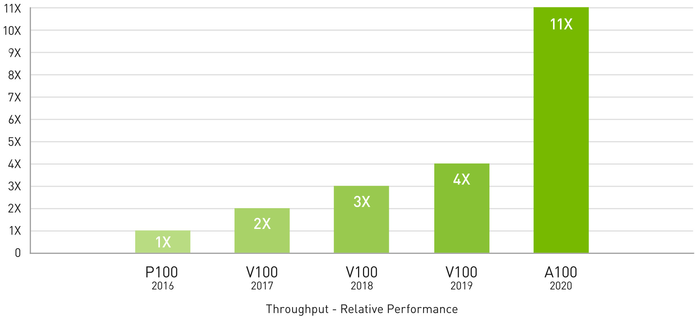
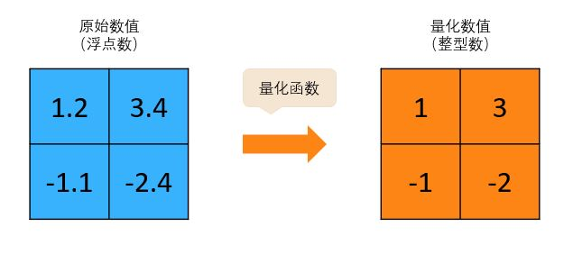
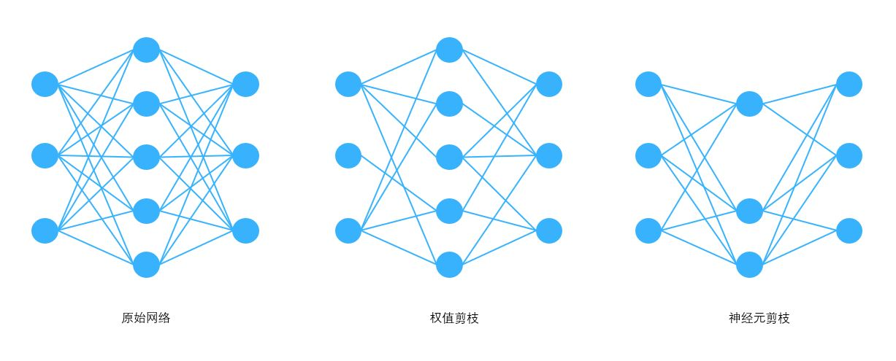
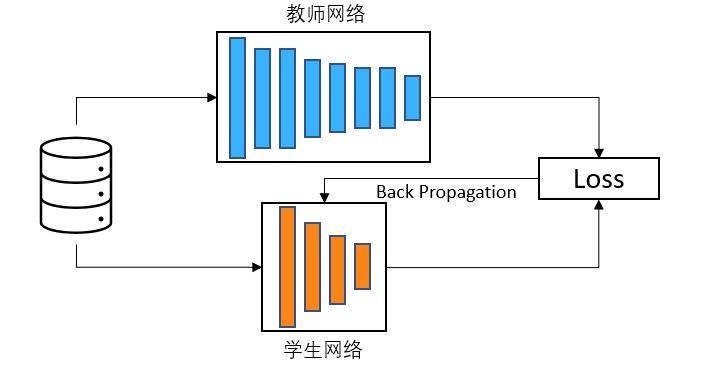
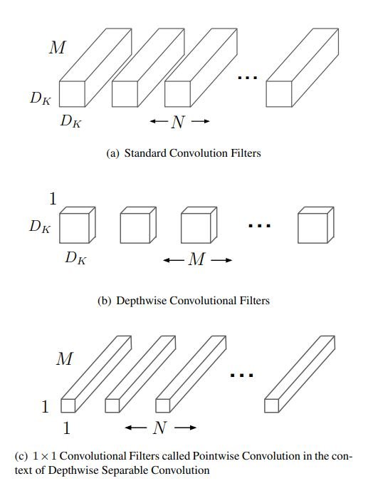
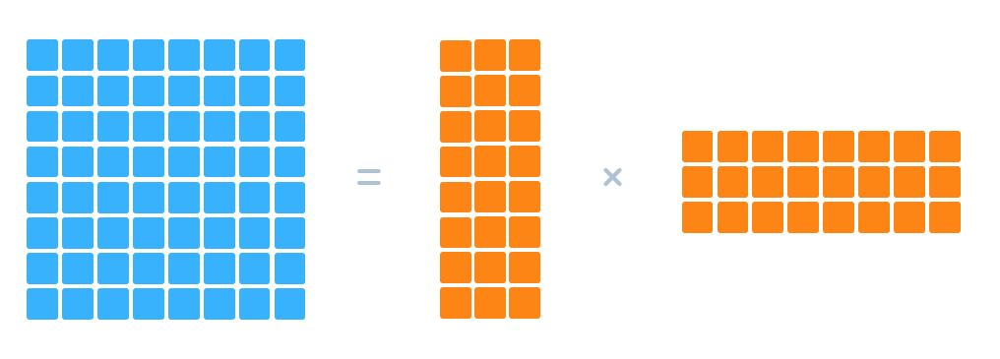

<!--Copyright © Microsoft Corporation. All rights reserved.
  适用于[License](https://github.com/microsoft/AI-System/blob/main/LICENSE)版权许可-->

# 11.1 模型压缩简介

自深度学习爆发以来，其模型的大小增长了千倍以上，而代表性硬件GPU的算力却仅增长了大约十倍。
深度学习算力的需求和供给之间存在着巨大的差距，突出了对模型进行压缩加速的必要性和重要性。
本小节将首先介绍模型压缩的背景，进而介绍常用的几种模型压缩方法。

- [11.1 模型压缩简介](#111-模型压缩简介)
  - [11.1.1 模型压缩的背景](#1111-模型压缩的背景)
    - [模型大小持续增长](#模型大小持续增长)
    - [训练数据不断增多](#训练数据不断增多)
    - [硬件算力增速放缓](#硬件算力增速放缓)
  - [11.1.2 模型压缩方法](#1112-模型压缩方法)
    - [数值量化](#数值量化)
    - [模型稀疏化](#模型稀疏化)
    - [知识蒸馏](#知识蒸馏)
    - [轻量化网络设计](#轻量化网络设计)
    - [张量分解](#张量分解)
  - [小结与讨论](#小结与讨论)
  - [参考文献](#参考文献)

## 11.1.1 模型压缩的背景

### 模型大小持续增长

近年来，以深度神经网络为代表的深度学习模型在图像、语音、自然语言处理和自动驾驶等人工智能应用领域取得了令人瞩目的成功，在多项任务中已经达到甚至超越了人类的水平。
伴随着深度神经网络在各种应用中达到了更好的效果或者解决了更复杂的问题，深度神经网络也变得越来越大，越来越深，越来越复杂，其参数量和计算量呈爆炸式增长。
在模型深度方面，以广泛用于计算机视觉领域的 CNN 为例，最开始的 AlexNet 只有几层，VGGNet 达到了十几层，而 ResNet 则超过了一百层。
在模型参数量方面，以广泛用于自言语言处理领域的Transformer为例，每年新提出的预训练模型的参数量屡创新高，呈指数型增长，如图11.1.1所示。
2017 年基于注意力机制的 Transformer 网络被提出之后，因为其强大的信息提取能力和计算速度优势被广泛应用到自然语言处理任务中。
基于 Transformer 的语言模型参数量从 Bert 的亿级，增长到 GPT-2 的十亿级，再到 GPT-3 的千亿级，最大型的语言模型几乎每年增长十倍。
2021年10月，微软公司和英伟达公司宣布了他们共同开发的全世界迄今为止最大最强悍的语言模型 Megatron Turing NLG，该语言模型拥有的模型参数量更是高达5300亿。

 

图11.1.1 模型增长趋势 (<a href="https://arxiv.org/pdf/2201.11990.pdf">图片来源</a>)

### 训练数据不断增多

大数据促进了大模型的产生，大模型同时也需要大数据作为训练支撑。
全球有数十亿互联网用户，互联网应用层出不穷，互联网每天都在产生、收集和存储大量数据。
未来物联网、电商、短视频和自动驾驶等应用的蓬勃发展，海量数据的来源和多样性会更加丰富。
可以预见的是，未来数据总量将持续快速增长，且增速越来越快。
互联网数据中心 IDC 的数据研究报告指出，全球数据总量从 2012 年的 4 ZB（Zettabyte，十万亿亿字节）增长到了 2018 年的 33 ZB，并预计 2025 年的数据总量将突破175 ZB。
从大数据对模型的需求角度，海量数据需要大模型去拟合。
理论上模型参数越多就能够拟合更多的数据和更复杂的场景。近十年深度学习的发展也一次次的验证，模型越大，效果也好。大力出奇迹，一度成为许多AI算法开发人员的口头禅。
另一方面，从大模型对数据的需求角度，现阶段深度学习模型也必须有大数据的支持。更多的数据量通常可以增强模型的泛化能力，进而带来算法效果的提升。
例如 Imagenet 数据集中图片种类达到了两万多类，图片规模达到了 1400 万张，GPT-3 模型的训练使用了多个数据集中总共约 45 TB 的文本数据。

### 硬件算力增速放缓

数据、算法和算力是人工智能取得巨大成功的三要素。算力是大数据和大模型的引擎。
近十年以深度学习技术为核心的 AI 热潮就是建立在 GPU 提供了强大的算力基础之上。
如图 11.1.2 所示，英伟达 GPU 的算力近年来一直不断提升，支撑着大模型的不断突破，2020 年的 A100 GPU 相比较于 2016 年的 P100 GPU 性能提升了 11 倍。
2022 年英伟达发布了最新一代的 H100 GPU，相比较于 A100 预计可以带来大约两倍到三倍的性能提升。
尽管 GPU 硬件性能在英伟达的推动下依然在不断提升，但是如果我们将模型规模增长速度和GPU性能增长速度放在一起比较就会发现，算力的供需之间依然存在巨大差距。
根据相关统计可以发现，2010 年以来深度学习的算力需求增长了 100 亿倍，每 6 个月翻一番，远远超过了摩尔定律每 18 个月翻一番的趋势。

 

图11.1.2 GPU性能增长 (<a href="https://www.nvidia.com/en-us/data-center/a100/">图片来源</a>)

硬件算力的增长同时受到了摩尔定律停滞，登纳德缩放比例定律失效，内存墙等多种因素的制约。
摩尔定律推动了通用处理器性能半个世纪的增长，然而近年来受限于芯片工艺的停滞，通用处理器的频率和晶体管密度都无法持续增长。
通用处理器性能在二十世纪后半叶每年增长约 50% ，验证了摩尔定律的预测，然而近十年来通用处理器性能增速明显放缓，几乎陷于停滞。
经过CPU技术多年的创新与发展，体系结构的优化空间也接近上限，很难再带来显著的性能提升。
通过多核提升处理器性能也受到了功耗的限制。
登纳德缩放比例定律的停滞更是早于摩尔定律，单位面积芯片的功耗不再恒定，更高的晶体管密度意味着更高的功耗。
在传统计算机的冯·诺依曼构架中，存储与计算是分离的。处理器的性能以每年大约 50% 速度快速提升，而内存性能的提升速度则只有每年 10% 左右。
不均衡的发展速度造成了当前内存的存取速度严重滞后于处理器的计算速度，也就是注明的“存储墙”问题。
在大数据和深度学习的人工智能计算时代，更加凸显原本已经存在的“存储墙”问题。
在可预见的将来，算力对模型增长支撑不足的问题会更加严重，算力一定会成为制约 AI 发展和应用的限制因素之一。

## 11.1.2 模型压缩方法

模型压缩技术可以减少模型对硬件的存储和计算需求，自然成了弥补算力供需差距的重要解决方案之一。
同时，随着 IoT 设备的广泛部署和端侧人工智能的兴起，高效处理深度神经网络显得尤为重要。
边缘设备（如智能传感器，可穿戴设备，移动电话，无人机等）有着严格的资源和能源的预算要求，同时需要对任务进行实时处理。
大型深度神经网络需要巨大的存储开销和计算开销，严重制约了深度学习在硬件资源有限或有着性能约束的场景中的应用。
因此，模型压缩对于人工智能落地部署尤为重要。

深度神经网络一直存在一个“模型大小问题”，即如何确定一个合适参数量的模型（Appropriately-parameterized Model）。
针对一个特定任务，理想的模型是包含正确数量的参数达到恰好的效果，既不过参数化（Over-parameterized）也不欠参数化（Under-parameterized）。
然而在训练神经网络时，我们没有办法直接训练一个合适参数量的模型。
这是因为给定一个任务和数据集，我们无法确定一个合适的参数量。
即使我们能得到一个近似合适的参数量，这样的网络也是非常难以利用基于梯度下降的方法进行训练。
如何确定合适的模型参数量以及如何高效的训练依然是一个亟待解决的研究问题，而在实践中的通常做法则是先训练一个过参数量的模型以达到更好的模型效果，再利用模型压缩方法降低模型大小。
这种训练范式在大模型预训练中得到了更广泛的应用。例如，在语言模型中，数据量巨大甚至可以认为是可以无限增长，大模型可以更加快速的拟合更多数据。

模型压缩有着重要的研究价值和广阔的应用前景，不仅是学术界的研究热点也是工业界人工智能应用落地的迫切需求。
现阶段的模型压缩方法主要包括：**数值量化（Data Quantization）**，**模型稀疏化（Model Sparsification）**，**知识蒸馏（Knowledge Distillation）**，**轻量化网络设计（Lightweight Network Design）** 和 **张量分解 (Tensor Decomposition）**。

### 数值量化

量化在数字信号处理领域是指将信号的连续取值近似为有限多个离散值的过程，可以认为是一种信息压缩的方法。
而在深度学习中，数值量化是一种非常直接的模型压缩方法，例如将浮点数（Floating-point）转换为定点数（Fixed-point）或者整型数（Integer），或者直接减少表示数值的比特数（例如将 FP32 转换为 FP16 ，进一步转化为 Int16 ，甚至是 Int8 ）。
图11.1.3是一个非常简单的将浮点数量化为整型数的例子，量化函数可以直接选择 python 中的 int() 函数。当然实际中的量化函数则更为复杂，需要根据原始权值的分步和目标数值比特数而设计。
数值量化方法根据量化对象可以分为权值量化和激活量化。
权值量化可以直接压缩模型大小，例如将 FP32 压缩成 Int8 可以直接减少四分之三的模型存储需求。
同时对激活进行量化后也可以降低硬件访存和计算开销。
更低的比特位宽通常意味着更快的访存速度和计算速度，以及更低的功耗。
在芯片计算单元的实现中，低比特计算单元也具有更低的芯片面积和更低功耗的优势。

 

图11.1.3 数值量化

数值量化广泛应用于模型部署场景，即模型推理，原因是模型推理对数值精度并不敏感，没有必要使用浮点数，使用更低比特的定点数或整型数就足以保持模型的准确率。
当然由于模型量化是一种近似算法，不能无限的降低表示数值的比特数，极低比特导致的精度损失是一个严峻的问题。
如何使用更低的比特数以及降低量化对模型准确率的影响是当前研究关注的热点问题之一。
研究和实践表明在大部分应用中使用 8 比特定点进行模型推理足以保证模型准确率。
如果结合一些重训练、权值共享等优化技巧，对于卷积神经网络中的卷积核甚至可以压缩到4比特。
相关甚至尝试只使用三值或二值来表示模型参数，这些方法结合特定硬件可以获得极致的计算性能和效能提升，但受限于数值精度往往会带来模型准确率的损失。

不同于模型推理，模型训练由于需要反向传播和梯度下降，对数值精度敏感性更高，定点数或整型数一般无法满足模型训练要求。低数值精度无法保证模型的收敛性。
因为在模型训练场景中，FP16 ，TF32 ，BF16 等浮点格式则成为了计算效率更高，模型收敛效果更好的选项，如表 11.1.1 所示。

**表11.1.1 常用的模型训练数制选项** 

|          | sign | exponent | fraction |
| -------- | ---- | -------- | -------- |
| FP32 | 1 | 8 | 23 |
| TF32 | 1 | 8 | 10 |
| FP16 | 1 | 5 | 10 |
| BP16 | 1 | 8 | 7 |

### 模型稀疏化

模型的稀疏性是解决模型过参数化对模型进行压缩的另一个维度。
不同于数值量化对每一个数值进行压缩，稀疏化方法则尝试直接“删除”部分数值。
近年来的研究工作发现深度神经网络中存在很多数值为零或者数值接近零的权值，合理的去除这些“贡献”很小的权值，再经过对剩余权值的重训练微调，模型可以保持相同的准确率。
根据稀疏化的对象，稀疏化方法主要可以分为权值剪枝和神经元剪枝。
前者减少神经网络中的连接数量，后者减少神经网络中的节点数量，如图 11.1.4 所示。
当然神经元剪枝后也会将相应的连接剪枝，当某个神经元的所有连接被剪枝后也就相当于神经元剪枝。
对于很多神经网络来说，剪枝能够将模型大小压缩 10 倍以上，这就意味着可以减少10倍以上的模型计算量，结合定制硬件的计算力提升，最终可能达到更高的性能提升。

 

图11.1.4 模型剪枝

权值剪枝是应用最为广泛的模型稀疏化方法。
权值剪枝通常需要寻找一种有效的评判手段，来评判权值的重要性 (例如权值的绝对值大小)，根据重要性将部分权值(小于某一个预先设定好的阈值) 剪枝掉。
权值剪枝的缺点是不同模型的冗余性不同，过度剪枝后模型的准确率可能会有所下降，需要通过对模型进行重训练，微调剩余权值以恢复模型的准确率。
甚至需要多次迭代剪枝和微调的过程以达到最好的压缩率和模型精度。
然而这种针对每一个权值的**细粒度剪枝**方法使得权值矩阵变成了没有任何结构化限制的稀疏矩阵，引入了不规则的计算和访存模式，对高并行硬件并不友好。
后续的研究工作通过增加剪枝的粒度使得权值矩阵具有一定的结构性，更加有利于硬件加速。
**粗粒度剪枝**方法以一组权值为剪枝对象，例如用一组权值的平均值或最大值来代表整个组的重要性，其余的剪枝和重训练方法与细粒度剪枝基本相同。
例如，文献以二维矩阵块为剪枝粒度，这种方法通常被成为块稀疏（Block Sparsity）。
在CNN中对Channel、Filter 或 Kernel进行剪枝，同样增加了剪枝粒度，也可以认为是粗粒度剪枝。
基于剪枝的稀疏化方法是一种启发式的搜索过程，缺乏对模型准确率的保证，经常面临模型准确率下降，尤其是在粗粒度剪枝中或追求高稀疏度中。
为了解决这个问题，研究人员将模型稀疏化定义为一个优化问题，利用AutoML等自动化方法寻找最佳的剪枝位置和比例等。
第 11.2 节将对基于稀疏化的模型压缩方法进行详细介绍。

### 知识蒸馏

知识蒸馏是一种基于教师-学生网络的迁移学习方法。
为了压缩模型大小，知识蒸馏希望将一个大模型的知识和能力迁移到一个小模型中，而不显著的影响模型准确率。
因此，教师网络往往是一个参数量多结构复杂的网络，具具有非常好的性能和泛化能力，学生网络则是一个结构简单，参数量和计算量较小的的网络。
通常做法是先训练一个大的老师网络，然后用这个老师网络的输出和数据的真实标签去训练学生网络，如下图所示。
当然只是蒸馏也可以使用多个教师网络对学生网络进行训练，使得学生网络有更好的效果。
知识蒸馏的核心思想是学生网络能够模仿教师网络从而获得相同的甚至更好的能力。
经过知识蒸馏得到的学生网络可以看做是对教师网络进行了模型压缩。
知识蒸馏由三个关键部分组成：知识，蒸馏算法和教师-学生网络架构，研究人员针对不同的任务提出了许多蒸馏算法和教师-学生网络架构。
近年来，知识蒸馏方法已扩展到师生学习，相互学习，终身学习和自身学习等。
知识蒸馏近年来的大多数研究工作都集中在压缩深度神经网络上。
由此产生的轻量级学生网络可以轻松部署在视觉识别，语音识别和自然语言处理等应用中。

 

图11.1.5 知识蒸馏 (<a href="https://towardsdatascience.com/knowledge-distillation-simplified-dd4973dbc764">图片来源</a>)

### 轻量化网络设计

目前工业届和学术界设计轻量化神经网络模型主要分为人工设计轻量化神经网络和基于神经网络架构搜索（Neural Architecture Search,NAS）的自动化设计轻量化神经网络。
人工设计轻量化模型主要思想在于设计更高效的“网络计算方式”（主要针对卷积方式），从而使网络参数量和计算量减少，并且尽量不损失模型准确率。
例如在mobilenet中，研究人员利用了深度可分离卷积（Depthwise Seprable Convolution）代替了标准卷积。
如下图所示，深度可分离卷积就是将普通卷积拆分成为一个深度卷积（Depthwise Convolution）和一个逐点卷积（Pointwise Convolution）。
标准卷积的参数量是$D_k \times D_k \times M \times N$，计算量是$D_k \times D_k \times M \times N \times D_w \times D_h$。
而深度可分离卷积的参数量是$D_k \times D_k \times M + M \times N$，计算量是$D_k \times D_k \times M \times D_w \times D_h + M \times N \times D_w \times D_h$。
两者相除可以得出，深度可分离卷积可以讲标准卷积的参数数量和乘加操作的运算量均下降为原来的$\frac{1}{N} + \frac{1}{D_{k2}}$。
以标准的3x3卷积为例，也就是会下降到原来的九分之一到八分之一。

 

图11.1.6 深度可分离卷积 (<a href="https://arxiv.org/pdf/1704.04861.pdf">图片来源</a>)

然而人工设计轻量化模型需要模型专家对任务特性有深入的了解，且需要对模型进行反复设计和实验验证。
NAS 是一种自动设计神经网络结构的技术，原理是在一个被称为搜索空间的候选神经网络结构集合中，用某种策略从中搜索出最优网络结构。
NAS 为了找出更好的网络结构，需要对很大的搜索空间进行搜索，因此需要训练和评估大量的网络结构，对 GPU 数量和占用时间提出了巨大的要求。
为了解决这些挑战，大量的研究工作对 NAS 的不同部分进行了优化，包括搜索空间、搜索算法和搜索质量评估等。
NAS 搜索出的网络结构在某些任务上甚至可以达到媲美人类专家的水准，甚至发现某些人类之前未曾提出的网络结构，这可以有效的降低神经网络的实现和使用成本。

### 张量分解

张量（矩阵）计算是深度神经网络的基本计算单元，直接对权值张量进行压缩可以实现模型的压缩与加速。
基于张量分解的压缩方法主要是将一个庞大的参数张量分解成多个更小的张量相乘的方式。
例如将一个二维权值矩阵进行低秩分解，分解成两个更小的矩阵相乘，如图11.1.7所示。
对于一个大小为 $m \times n$ 的矩阵 $A$，假设其秩为 $r$。
则 $A$ 可以分解为两个矩阵相乘（$A = WH）$，其中 $W$ 的大小为 $m \times r$，$H$ 的大小为 $r \times n$。
当 $r$ 小于 $m$ 和 $n$ 时，权值矩阵的空间复杂度从 $O(mn)$ 减少到了 $O(r(m + n))$。
主要的张量分解方法包括 SVD 分解，Tucker 分解和 CP 分解等。
然而张量分解的实现并不容易，因为它涉及计算成本高昂的分解操作。
同时对权值张量分解后可能会对原有模型准确率造成影响，需要大量的重新训练来达到再次收敛。

 

图11.1.7 二维矩阵分解示例

## 小结与讨论

上述模型压缩方法从不同的角度对深度学习网络进行压缩，但是由于不同任务的特性不同，不同网络的冗余性不同，不同压缩方法在不同任务和不同模型上的压缩效果也不尽相同。
往往需要通过实验来选取最适合的模型压缩方法。
同时在实际应用中，不同的压缩方法往往可以组合使用以达到更高的压缩率，例如对同时进行稀疏化和数值量化，对轻量化网络再次进行稀疏化或数值量化。
组合使用多种压缩方法虽然可以达到极致的压缩效果，但增加了多种模型配置超参数，对模型训练增加了巨大挑战。
结合NAS和AutoML等方法可以减轻搜索压缩模型的负担。

## 参考文献

1. [A100](https://www.nvidia.com/en-us/data-center/a100/)
   
2. [TensorCore](https://developer.nvidia.com/blog/accelerating-ai-training-with-tf32-tensor-cores/)

3. Hinton, Geoffrey, Oriol Vinyals, and Jeff Dean. [Distilling the knowledge in a neural network.](https://arxiv.org/pdf/1503.02531.pdf) arXiv preprint arXiv:1503.02531 2.7 (2015).
   
4. Howard, Andrew G., et al. [Mobilenets: Efficient convolutional neural networks for mobile vision applications.](https://arxiv.org/pdf/1704.04861.pdf) arXiv preprint arXiv:1704.04861 (2017).
   
5. Deng, Lei, et al. [Model compression and hardware acceleration for neural networks: A comprehensive survey.](https://ieeexplore.ieee.org/abstract/document/9043731) Proceedings of the IEEE 108.4 (2020): 485-532.