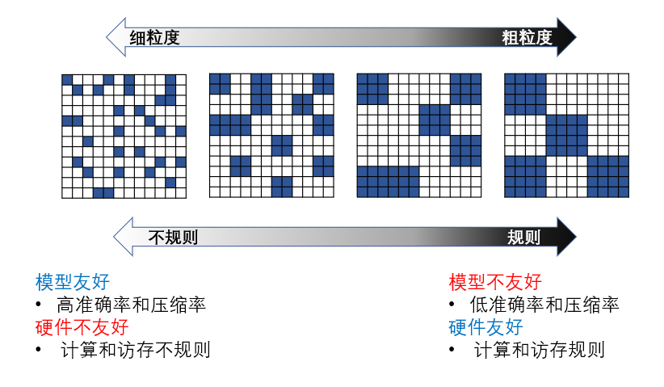

<!--Copyright © Microsoft Corporation. All rights reserved.
  适用于[License](https://github.com/microsoft/AI-System/blob/main/LICENSE)版权许可-->

# 11.3 模型压缩与硬件加速

模型压缩的一个潜在缺点是，部分经过压缩后的模型并不一定适用于传统的通用硬件，如CPU和GPU，往往需要定制化硬件的支持。
例如对于模型稀疏化后的网络模型来说，如果没有专用的稀疏计算库或者针对稀疏计算的加速器设计，则无法完全发挥稀疏所能带来的理论加速比。
对于经过数值量化之后的网络模型，很多硬件结构并不支持低比特运算，例如CPU 中只支持Short，Int，Float，Double等类型，而定制化硬件可以对不同比特的网络进行特定的支持。
因此，相关的研究工作如稀疏神经网络加速器和低比特神经网络加速器也被相继提出。

- [11.3 模型压缩与硬件加速](#113-模型压缩与硬件加速)
  - [11.3.1 深度学习专用硬件](#1131-深度学习专用硬件)
  - [11.3.2 稀疏模型硬件加速](#1132-稀疏模型硬件加速)
    - [结构化稀疏与非结构化稀疏](#结构化稀疏与非结构化稀疏)
    - [半结构化稀疏](#半结构化稀疏)
  - [11.3.2 量化模型硬件加速](#1132-量化模型硬件加速)
  - [小结与讨论](#小结与讨论)
  - [参考文献](#参考文献)

## 11.3.1 深度学习专用硬件

深度学习模型不仅仅是学术研究前沿，在工业和生活中也应用广泛，具有广阔的市场前景和经济价值。
因此其重要性也促使了针对深度学习的领域专用架构或AI专用芯片的出现和发展。
基于ASIC（Application Specific Integrated Circuit）实现AI专用芯片，可以在芯片电路级别对深度学习模型的计算和访存特性进行全面深度定制，相比于GPGPU可以达到更高的性能和效能提升。
当然AI专用芯片也损失了一定的通用性和灵活性。
以 2015 年的谷歌TPU芯片为代表和开端，AI芯片进入了发展的爆发期。
TPU也是AlphaGo战胜人类顶尖围棋选手李世石、柯洁的幕后英雄，相比较于CPU+GPU的硬件平台计算和反应速度更快。TPU也为谷歌在其他人工智能领域的创新和突破起到重要支撑作用。
得益于TPU在芯片内部定制了专用于矩阵乘法计算的脉动阵列架构，因此实现了比同时期CPU和GPU更高的计算效率。
为深度学习定制的体系结构和硬件加速器可以实现更高效的计算单元和达到更高的并行度，减少通用计算设备中不必要的开销，从而使得深度学习计算达到更高的吞吐量、更低的延迟和更高的能效。
在之后的几年中，国内的互联网公司例如阿里巴巴、华为等也都设计了自己的AI专用芯片。
下图分别展示了谷歌 TPU芯片，阿里巴巴Hanguang芯片，华为Ascend芯片。

 

图11.3.1 AI芯片：谷歌TPU，阿里巴巴Hanguang，华为Ascend

## 11.3.2 稀疏模型硬件加速

### 结构化稀疏与非结构化稀疏

最早提出的模型稀疏化方法是细粒度的权值剪枝。深度神经网络中存在大量数值为零或者接近零的权值，模型剪枝合理的去除这些“贡献”很小的权值，在很多模型中能够讲模型大小压缩10倍以上，同时也意味着可以减少10倍以上的模型计算量。尽管听起来非常美好，现实并不尽如人意。模型剪枝带来的的稀疏性，从计算特征上来看非常的“不规则”，这对计算设备中的数据访问和大规模并行计算非常不友好。例如对GPU来说，我们使用cuSPARSE稀疏矩阵计算库来进行实验时，90%稀疏性（甚至更高）的矩阵的运算时间和一个完全稠密的矩阵运算时间相仿。也就是说，尽管我们知道绝大部分的计算是浪费的（90%稀疏性意味着性能提升的上限是10倍)，却不得不忍受“不规则”带来的机器空转和消耗。
这种“不规则”的稀疏模式通常被称为非结构化稀疏（Unstructured Sparsity），在有些文献中也被称为细粒度稀疏（Fine-grained Sparsity）或随机稀疏（Random Sparsity）。

顺着这个思路，许多研究开始探索通过给神经网络剪枝添加一个“规则”的约束，使得剪枝后的稀疏模式更加适合硬件计算。
例如使非零值的位置分布不再是随机的，而是集中在规则的子结构中。
相比较于细粒度剪枝方法针对每个权值进行剪枝，粗粒度剪枝方法以组为单位对权值矩阵进行剪枝，使用组内的最大值或平均值为代表一组权值的重要性。
这种引入了“规则”的结构化约束的稀疏模式通常被称为结构化稀疏（Structured Sparsity），在很多文献中也被称之为粗粒度稀疏（Coarse-grained Sparsity）或块稀疏（Block Sparsity）。
但这种方法通常会牺牲模型的准确率和压缩比。
结构化稀疏对非零权值的位置进行了限制，在剪枝过程中会将一些数值较大的权值剪枝，从而影响模型准确率。
“非规则”的剪枝契合了神经网络模型中不同大小权值的随机分布，这对深度学习模型的准确度至关重要。而这种随机分布是深度学习模型为了匹配数据特征，通过训练后所得到的固有结果，为了迎合计算需求而设定的特定稀疏分布会增加破坏模型表达能力的风险，降低模型的准确度和压缩比。大量的研究工作也验证了这个观点。

综上所述，深度神经网络的权值稀疏存在模型有效性和计算高效性之间的权衡，如图 11.3.2 所示。
非结构化稀疏模式可以保持高模型压缩率和准确率，但因为不规则的稀疏模式对硬件不友好，导致很难实现高效的硬件加速。
而结构化稀疏使得权值矩阵更规则更加结构化，更利于硬件加速，但同时因为对权值的空间位置分布进行了限制，牺牲了模型压缩率或准确率。
结构化稀疏在不损失模型准确率的情况下，所能达到的压缩率远低于非结构化稀疏，或者在达到相同压缩率的情况下，所能维持的模型准确率远低于结构化稀疏。

 

图11.3.2 稀疏模型有效性和计算高效性权衡

### 半结构化稀疏

那么，我们如何设计一个更好的稀疏模式以同时实现模型有效性和计算高效性两个目标？
在模型有效性方面，为了能够达到高模型准确率和压缩率，稀疏模式应该在稀疏结构上增加很少的约束，以保持非零权值分布的随机性。
在计算高效性方面，为了实现高性能稀疏矩阵乘法计算，需要使非零权值分布具有规则性，以消除不规则访存和计算。

“随机”与“规则”看似一对矛盾的概念，非此即彼。如果要两者兼顾，就不得不各自有所损失。然而在深度神经网络中，“随机”是权值分布上的随机，并不完全等于计算上的随机。权值上的“随机”与计算上的“规则”并不是一个绝对矛盾的概念，这就给调和这一对矛盾提供了空间，让我们得以取得既快又准的稀疏模型。论文提出了一种在权值上“ 随机”但非常适合硬件计算的稀疏化方法-组平衡稀疏（Bank Balanced Sparsity）。

在组平衡稀疏矩阵中，矩阵的每一行被分成了多个大小相等的组，每组中都有相同的稀疏度，即相同数目的非零值。
下图举例说明了组平衡稀疏模式的结构并与非结构化稀疏和结构化稀疏进行了直观的比较。
在这个例子中，三个具有不同的稀疏结构的稀疏矩阵都是从图a中稠密权值矩阵剪枝得到的，稀疏度都是50%。
细粒度剪枝将所有权值排序并剪枝掉绝对值最小的50%的权值，从而得到了图 b 中的非结构化稀疏矩阵。
粗粒度剪枝针对 2x2 的权值块进行剪枝，每块权值的重要性由块平均值代表，从而得到了图 c 中的结构化稀疏（块稀疏）矩阵。
组平衡剪枝将每一个矩阵行分成了两个组，每个组内进行独立的细粒度剪枝，去除在每个组内绝对值最小的 50% 的权值，从而得到了d图中的组平衡稀疏矩阵。

 

图11.3.3 不同稀疏模式的比较

由于我们在每个bank内使用细粒度剪枝，因此能够很大程度地保留那些数值较大的权值，保持权值的随机分布，从而保持高模型准确率。同时这种方法得到的稀疏矩阵模式将矩阵进行了平衡的分割，这有利于硬件解决不规则的内存访问，并对矩阵运算实现高并行度。
近年来，GPU和专用AI芯片也逐渐开始支持稀疏神经网络。
英伟达在2020年发布了A100GPU，其稀疏张量核使用了一种称为细粒度结构化稀疏（Fine-grained Structured Sparsity）的权值稀疏模式。
英伟达提出的细粒度结构化稀疏与组平衡稀疏解决的是相同的模型有效性和计算高效性的权衡问题，采用了相似的设计思想，因此稀疏结构也非常相似。
图 5-7 介绍了英伟达提出的细粒度结构化稀疏与 A100 GPU 的稀疏张量核。
细粒度结构化稀疏也称之为 2:4 结构化稀疏（2:4 Structured Sparsity）。
在其剪枝过程中，权值矩阵首先被切分成大小固定为 4 的向量，并且稀疏度固定为50%（2:4）。
2:4 结构化稀疏可以视为组平衡稀疏的一种特殊情况，即将组大小设置为4，将稀疏度设置为 50%。
英伟达将细粒度结构化稀疏应用到图像、语言、语音等任务的模型中，实验结构表明不会对模型准确率造成显著影响，在模型有效性上与组平衡稀疏的结论相一致。
基于 2:4 结构化稀疏，A100 GPU 可以实现两倍的理论加速比，印证了组平衡稀疏的计算高效性。

 

图11.3.4 A100 GPU的稀疏方法 (<a href="https://www.nvidia.com/en-us/data-center/a100/">图片来源</a>)

无论是组平衡稀疏，还是A100中提出的细粒度结构化稀疏，我们都可以将其称之为半结构化稀疏（Semi-structured Sparsity）。半结构化稀疏很好地解决了稀疏模型存在的模型有效性和计算高效性之间的权衡，应用也越来越广泛。

## 11.3.2 量化模型硬件加速

对于量化模型的硬件加速方法较为直接，实现相应比特数的计算单元即可。
在处理器芯片中，低比特计算单元则可以使用更少的硬件资源在更低的延迟内得出计算结果，并且大大降低功耗。
TPU的推理芯片中很早就使用了INT8，在后续的训练芯片中也采用了BF16数制度。
英伟达从A100中已经集成了支持INT4，INT8，BF16的混合精度计算核心，在最新发布的H100中甚至支持了BF8。

## 小结与讨论

将软硬件分离，单独从硬件端进行定制优化或从软件端进行算法优化并不足以弥补算力供需之间的差距。
为了实现高性能人工智能计算，需要将算法和硬件的设计及优化统一起来，同时挖掘算法和硬件的潜力。
在算法设计时结合硬件平台的特性对算法进行优化从而减少对算力的需求，减轻硬件的负担。
进一步在硬件设计时根据算法的特性定制计算和存储微结构，最终实现性能的提升。
在可预见的未来，不仅仅是人工智能领域发展更加迅速，应用更加广泛，其他领域例如物联网、区块链等也将蓬勃发展，软硬件协同设计将发挥更大的作用。

## 参考文献

1. https://www.nvidia.com/en-us/data-center/a100/

2. https://www.jiqizhixin.com/articles/2019-06-25-18