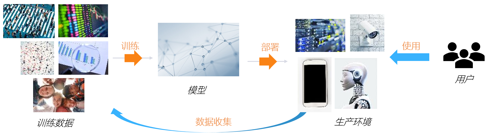

<!--Copyright © Microsoft Corporation. All rights reserved.
  适用于[License](https://github.com/microsoft/AI-System/blob/main/LICENSE)版权许可-->

# 人工智能安全与隐私（AI Security and Privacy）

# 简介

随着人工智能系统在自动驾驶、人脸识别、推荐系统等领域的研究与应用，人工智能相关的安全与隐私问题也获得了广泛的关注和研究。一方面，人工智能输出的结果可能非常重要，会影响人身安全、财产安全、社会公平等；另一方面，人工智能系统的涉及到数据可能非常敏感，如人脸、浏览记录、社交关系等。因此，需要负责任的人工智能（[Responsible AI](https://www.microsoft.com/en-us/ai/responsible-ai)）以及安全、保护隐私、可信的人工智能系统。

要达成上述目标，需要在人工智能的全周期中提供安全与隐私保障。因为针对人工智能的安全攻击可能发生在训练数据、模型、生产环境中；隐私泄露也可能发生在训练、部署、使用等各个阶段。本章我们将分别从人工智能的内在安全与隐私，训练时的安全与隐私，部署与使用时（统称为服务时）的安全与隐私三个方面介绍相关基础与进展。注意，前面章节所讲的“训练阶段”与“推理阶段”强调的是模型计算过程，分别是训练时与服务时的一个重要组成部分；本章将说明除了高效的训练与推理之外，还需要额外的过程（如异常检测、加密解密）才能保障安全与隐私。

 

图 12.0.1 深度学习模型的生命周期

# 内容概览

本章包含以下内容：

- [12.1 人工智能内在安全与隐私](12.1-人工智能内在安全与隐私.md)
- [12.2 人工智能训练安全与隐私](12.2-人工智能训练安全与隐私.md)
- [12.3 人工智能服务安全与隐私](12.3-人工智能服务安全与隐私.md)
