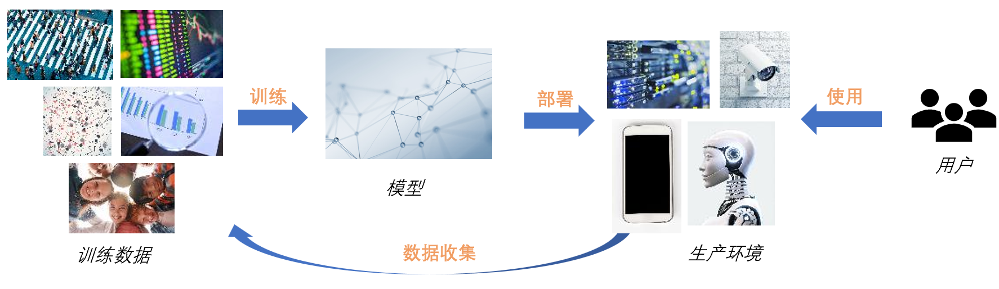

<!--Copyright © Microsoft Corporation. All rights reserved.
  适用于[License](https://github.com/microsoft/AI-System/blob/main/LICENSE)版权许可-->

# 12.1 人工智能完整性

- [12.1 人工智能完整性](#121-人工智能完整性)
  - [12.1.1 推理结果的鲁棒性](#1211-推理结果的鲁棒性)
  - [12.1.2 推理过程的可信性](#1212-推理过程的可信性)
  - [小结与讨论](#小结与讨论)
  - [参考文献](#参考文献)

人工智能的完整性(Integrity)指人工智能模型输出正确的、符合预期的结果。它主要包含两方面的内容：推理结果的鲁棒性(Robustness)以及推理过程的可信性(Trustworthiness)。前者强调模型的推理结果应该是抗天然以及人为干扰的，后者强调推理过程中应该防止各种恶意的攻击。
## 12.1.1 推理结果的鲁棒性

现代的人工智能模型，特别是深度学习模型，虽然具备越来越高的推理精度，但是在大规模应用方面仍然面临着一些挑战。其中之一的挑战就是推理结果的鲁棒性，即推理结果应该是抗干扰的。试想我们将人工智能应用在重要决策领域（例如无人驾驶）的时候，如果一个微小的输入扰动（例如肉眼不可识别的扰动）就导致推理结果发生错误，这将带来极大的安全隐患。进一步，这个输入的扰动既可能是天然的，也可能是攻击者精心构造的，这都将对我们设计人工智能系统带来新的要求和挑战。

在本节中，我们不刻意区分上述两种输入的扰动，将加上扰动的输入统称为对抗样本（Adversarial Example）。对抗样本的数学定义如下：我们用x表示模型的输入，$f(x)$表示模型的推理结果。对于给定的正实数ε以及模型输入空间中的一个点$x_0$，如果存在$x_1$同时满足$||x_1-x_0||_p<\epsilon$ （$||.||_p$表示$L_p$距离）且$f(x_1)≠f(x_0)$，那么就称$x_1$为$x_0$的一个对抗样本。图12-1-1是这个定义的一个直观表示。如果我们用$\triangle$所在的位置表示输入$x_0$，$\triangle$代表其推理结果。以$x_0$为中心、$\epsilon$为半径的一个球内，如果存在点$x_1$，其推理结果是$\Box$，那么我们就称$x_1$是$x_0$的一个对抗样本。

 

图12-1-1. 对抗样本的直观表示

所谓对抗样本攻击（或称为对抗样本生成），其目的就是在给定模型、x0以及ε的情况下找到x1。下面是一些经典的对抗样本攻击：
- Fast gradient sign method （FGSM），是Goodfellow等人在2014年提出的一种经典对抗样本攻击。通过在原图片上叠加一个与梯度符号相关的噪声，就能改变模型对该图片的分类结果。
- Universal adversarial perturbations，是一种通用的迭代式对抗样本生成方法，由Moosavi等人在2017年提出。其核心思想是每次迭代都寻找一个最小的扰动项使得某个输入的分类结果发生变化，那么可以将这些扰动联合起来找到一个全局的扰动，能使得一类输入（例如多张图片）的分类都不稳定。
- Adversarial transformation networks（AFN）是由Baluja等人在2018年提出。通过训练一个输入转换模型g，AFN能自动将正常样本转换为对抗样本。
- ……

目前，有多种观点去解释对抗样本现象出现的原因，我们将其直观的表示在图12-1-2中。有一种观点认为其来源于神经网络学到了一个过拟合的决策边界（decision boundary)，另一种观点认为是神经网络的线性特性导致了误差的累积。根据这些观点，对抗样本还具备一定的迁移性，即在一个模型中找到的对抗样本很可能在另一个模型中也会导致误分类，且误分类的类别一样。这个性质常常被用来构造所谓的黑盒攻击，即攻击者可以在不知道模型参数的情况下，构造某个输入在此模型下的对抗样本。

 

图12-1-2. 对抗样本现象的成因

为了直观，以上关于对抗样本的描述和攻击很多是针对理想情形下的图片分类任务。事实上，对抗样本攻击是一个很宽泛的概念，在很多任务以及场景上都有对应的攻击。比如有在真实物理世界中的对抗样本攻击，例如通过在打印图片上加噪声、路牌上贴标签、戴特殊帽子等方式来造成物理世界中的分类器产生错误。又或者还有针对问答系统、语音识别、强化学习等任务场景下的对抗样本攻击。

对抗样本攻击的防御也是近年来学术界和工业界关注的热点，其大致可以分为检测和预防两类方法，一些经典的对抗防御如下：
- 对抗训练(adversarial training)，即在训练时加入对抗样本。
- 通过蒸馏(distillation)防御。这个方法利用原网络的输出训练一个能抵抗攻击的新网络。
- 对模型梯度进行混淆。这个方法白盒攻击需要依赖模型的梯度（例如FGSM），因此可以对梯度进行混淆，抵御攻击。
- 异常输入检测。这个方法利用模型内部的激活特征判断输入是否反常。
- 根据输入变换对结果的影响判断。这个方法通过对输入进行随机图片变换，检查预测结果变化的剧烈程度。
- 对模型输入进行形式化约束。这个方法通过形式化验证(formal verification)，可以从数学上保证当输入在一定变化范围内，其输出是稳定的。

需要说明的是，目前并没有完美的对抗防御方法，以上防御方法在提出后的较短时间内都有相应的攻击方法。其根本原因在于对抗样本的搜索空间很大，而模型推理的决策边界（即使加上对抗防御后）往往无法很好的匹配对抗样本存在的球形空间，因此总能在此空间中找到对抗样本。

## 12.1.2 推理过程的可信性

攻击者除了在模型输入上可以采取对抗样本的攻击方法，还能进一步通过影响深度学习模型生命周期中的数据收集、训练、部署以及使用环节（如图12-1-3所示），来让推理过程变得不可信。常见的攻击如下：

- 后门攻击 (backdoor attack)。攻击者可以向模型中植入后门，使模型在输入中有特定标记时触发异常行为。后门植入有多种方法，例如利用数据投毒(data poisoning)的方式，可以在训练数据中加入恶意样本，通过训练植入后门；以及还可以分析中间神经元，算出能引发误分类的trigger标记，生成后门训练样本。
- 潜伏后门攻击 （latent backdoor attack)。传统的后门攻击在真实场景下不容易成功，开发者往往会采用迁移学习调整模型参数，后门可能在迁移学习中被消除掉。所谓潜伏后门攻击，就是攻击者在teacher模型中通过最小化trigger样本和目标样本的中间层差异植入后门，并修改输出层使后门在teacher模型中不可见。当student在迁移学习时引入了目标标签，后门会被重新激活。
- 针对运行环境的攻击。利用传统的一些软件或硬件安全漏洞，结合上深度学习的特性，可以对推理过程产生极大的影响。例如利用Row-Hammer攻击触发内存的位翻转(bit-flipping)，可以让ResNet18模型推理的准确率从70%下降到0.1%。或者可以通过硬件电路设计，使得在检测到trigger输入时改变神经网络中的某个neuron的激活值，从而影响输出结果。

 

图12-1-3. 深度学习模型的生命周期

针对推理过程的可信性攻击，也有相应的防御手段。例如针对后门攻击，可以将模型中对正常样本作用较小的neuron进行剪枝，也可以采用Neural Cleanse的方法：给定模型，反推引起误分类的扰动。若该扰动在输入中占比较小且容易找到，则模型很可能带有后门。

 ## 小结与讨论

本小节主要围绕深度学习推理的完整性，讨论了与推理结果的鲁棒性、推理过程的可信性相关的攻击和防御。

最后大家可以进而思考以下问题，巩固之前的内容：
对抗样本的数学定义是什么，为什么对抗样本现象很难消除？
后门攻击涉及到深度学习模型生命周期的哪些阶段？

## 参考文献

- [Goodfellow, Ian J., Jonathon Shlens, and Christian Szegedy. "Explaining and harnessing adversarial examples." arXiv preprint arXiv:1412.6572 (2014).](https://arxiv.org/abs/1412.6572)
- [Moosavi-Dezfooli, Seyed-Mohsen, et al. "Universal adversarial perturbations." Proceedings of the IEEE conference on computer vision and pattern recognition. 2017.](https://openaccess.thecvf.com/content_cvpr_2017/papers/Moosavi-Dezfooli_Universal_Adversarial_Perturbations_CVPR_2017_paper.pdf)
- [Baluja, Shumeet, and Ian Fischer. "Adversarial transformation networks: Learning to generate adversarial examples." arXiv preprint arXiv:1703.09387 (2017).](https://arxiv.org/pdf/1703.09387.pdf)
- [Papernot, Nicolas, et al. "Distillation as a defense to adversarial perturbations against deep neural networks." 2016 IEEE symposium on security and privacy (SP). IEEE, 2016.](https://arxiv.org/pdf/1511.04508.pdf)
- [Wang, Shiqi, et al. "Formal security analysis of neural networks using symbolic intervals." 27th USENIX Security Symposium (USENIX Security 18). 2018.](https://www.usenix.org/system/files/conference/usenixsecurity18/sec18-wang_0.pdf)
- [Yao, Yuanshun, et al. "Latent backdoor attacks on deep neural networks." Proceedings of the 2019 ACM SIGSAC Conference on Computer and Communications Security. 2019.](https://dl.acm.org/doi/pdf/10.1145/3319535.3354209)
- [Wang, Bolun, et al. "Neural cleanse: Identifying and mitigating backdoor attacks in neural networks." 2019 IEEE Symposium on Security and Privacy (SP). IEEE, 2019.](https://arxiv.org/abs/1412.6572)
- [Yao, Fan, Adnan Siraj Rakin, and Deliang Fan. "{DeepHammer}: Depleting the Intelligence of Deep Neural Networks through Targeted Chain of Bit Flips." 29th USENIX Security Symposium (USENIX Security 20). 2020.](https://www.usenix.org/system/files/sec20-yao.pdf)