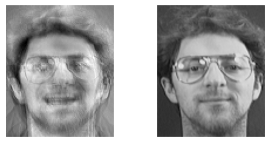

<!--Copyright © Microsoft Corporation. All rights reserved.
  适用于[License](https://github.com/microsoft/AI-System/blob/main/LICENSE)版权许可-->

# 12.1 人工智能的内在安全与隐私问题

- [12.1 人工智能的内在安全与隐私问题](#121-人工智能的内在安全与隐私问题)
  - [12.1.1 深度神经网络内在的安全问题](#1211-深度神经网络内在的安全问题)
  - [12.1.2 深度神经网络内在的隐私问题](#1212-深度神经网络内在的隐私问题)
  - [小结与讨论](#小结与讨论)
  - [参考文献](#参考文献)

本节介绍人工智能的内在安全与隐私问题。所谓“内在”，是指这些安全与隐私问题是深度神经网络内生的，而非由于不当使用人工智能系统所导致的。这些问题反应了人工智能本身的弱点。

## 12.1.1 深度神经网络的内在安全问题

新的技术往往伴随着新的问题，现代的人工智能模型，特别是深度学习模型，虽然具备越来越好的效果，但是也存在一些安全问题。2014 年，Christian Szegedy 等人发现了在深度神经网络中的一个“有趣”的性质：如果给一张正常的图片输入加入微小的扰动，那么原本能够将正常图片正确分类的深度神经网络会输出完全错误的预测结果！这样的扰动之小，甚至可以让人的肉眼都无法感知，却会让深度神经网络的行为完全错误。如图 12.1.1 所示，Szegedy 等人成功构造出了这样的扰动，使深度神经网络将右图——人看起来仍然是车的图片——错误识别为鸵鸟。

图 12.1.1 原始图片（左）在增加微小扰动（中）后，深度神经网络会将被加扰动的图片（右）错误识别为“鸵鸟”（<a href="https://arxiv.org/abs/1312.6199">Szegedy et al.</a>）

这种被加上扰动、会导致深度神经网络输出错误结果的输入被命名为对抗样本（adversarial example）。对抗样本的数学定义如下：用 $x$ 表示模型的输入，$f(x)$ 表示模型的输出结果，如分类标签。对于给定的正实数 $\epsilon$ 以及模型输入空间中的一个点 $x_0$，如果存在 $x_1$ 同时满足 $||x_1-x_0||<\epsilon$ 且 $f(x_1)\neq f(x_0)$，那么就称 $x_1$ 为 $x_0$ 的一个对抗样本。其中 $||x_1-x_0||$ 表示  $x_1$ 与 $x_0$ 之间的距离。

所谓对抗样本攻击（或称为对抗样本生成），其目的就是在给定模型、$x_0$ 以及 $\epsilon$ 的情况下找到 $x_1$。这里介绍一种简单而高效地生成对抗样本的方法：快速梯度符号法（fast gradient sign method，FGSM）。这是 Ian Goodfellow 等人在 2015 年提出的。如果将寻找对抗样本视为一个关于损失函数的优化问题，那一种近似方法就是将扰动设置为一个与损失函数 $J_{f,y}(x)$ 在 $x_0$ 处的梯度方向相似的向量，即
$$
x_1 = x_0 + \epsilon \times \textrm{sign}(\nabla J(x_0))
$$
在以 $||\cdot||_\infty$ 衡量距离的意义下，一个大小为恰好为 $\epsilon$ 的扰动就被构造出来了。Goodfellow 等人的实验结果表明这样构造对抗样本有相当高的概率导致深度神经网络误分类。

对抗样本的存在说明深度神经网络的健壮性（robustness）并不好。这种性质如果被攻击者利用，那么有意生成一些微小的扰动就可以让现有的人工智能失效。在重要决策领域，例如无人驾驶、人脸识别、恶意软件检测等，这将带来极大的安全隐患。事实上，已经有研究人员构造出了这些场景中的真实对抗样本攻击。以人脸识别为例，Mahmood Sharif 等人在 2016 年通过制作一个精心设计的眼镜框，可以使得人脸识别算法无法识别出人脸的存在，或者将一个人识别成另一个人。这样的针对检测系统的攻击也被称为“逃逸攻击”（evasion attack）。这是一种经典的安全问题，在深度学习流行之前，安全领域的研究者就已经注意到了这种攻击了。但深度神经网络的复杂性和新颖性对人们设计人工智能检测系统带来新的要求和挑战。

理想情况下，人工智能应该是抗干扰的。如何提升深度神经网络的健壮性呢？这里介绍一种被认为比较有效的方法：对抗训练（adversarial training），即将对抗样本（以其正确的标注）加入到训练过程中。例如，可以利用 FGSM，将训练过程中的损失函数重新定义为
$$
\tilde J(x) = \alpha J(x) + (1-\alpha) J(x + \epsilon \times \textrm{sign}(\nabla J(x)))
$$
其中 $\alpha$ 是一个可以设在 0 到 1 之间的参数。以 $\tilde J(x)$ 作为损失函数，训练出来的模型可以显著地降低 FGSM 对抗样本生成的成功率，并且几乎不损失模型在测试集上的效果。另一种效果更好

给定一个通过对抗训练得到的模型，还可以通过形式化方法来确定该模型的健壮性有多好。即给定模型、输入 $x_0$ 的集合、$\epsilon$ 以及距离函数 $||\cdot||$，通过求解器（solver）来确定是否有（或有多少）对抗样本 $x_1$ 满足 $||x_1-x_0||<\epsilon$ 且 $f(x_1)\neq f(x_0)$。

但是，对抗训练也有其局限性。首先，如何一种对抗训练方法往往只针对一种距离函数意义下的对抗样本，而对其他距离函数意义下的对抗样本难以起到很好的防范效果。例如，上述的基于 FGSM 的对抗训练对 $||\cdot||_\infty$ 之外的距离函数意义下的对抗样本效果并不好。还需要注意的是，在真实世界中的对抗样本往往不是用 p-范数来衡量距离，而是用与人类感知相关的方法来描述“距离很近的样本”，这对于对抗训练提出了更大的挑战。第二，能够训练出健壮性非常好的模型的对抗训练往往需要大量的时间开销，因此如何设计即高效又效果好的对抗训练方法是一个备受关注的问题。第三，Liwei Song 等人在 2019 年还发现经过对抗训练的模型反而具有更大的隐私风险，表明模型的健壮性和隐私性之间存在一种权衡关系。

对抗样本是目前深度学习非常热门的一个研究领域。除了上文介绍的攻击、防御的方法之外，还有各种各样新颖的攻击方法和防御手段，且目前呈现出“攻防竞赛”的状态。关于对抗样本存在的原因也众说纷纭，但随着相关研究的继续深入，人们将从安全的角度对增加对深度神经网络的理解。

## 12.1.2 深度神经网络的内在隐私问题

人工智能模型是通过大量的数据训练得来的，模型内在就包含了这些训练数据的信息——然而，这也意味着这些信息可能从模型中泄露。在医疗诊断、金融服务、人脸识别等领域，训练数据往往是非常敏感的，有的是商业机密，有的是受法律（如个人信息保护法）所限制的，因此需要特别关注人工智能模型中的隐私问题。

Matt Fredrikson 等人在 2015 年提出了针对深度神经网络的模型反转攻击（Model inversion attack）：如果攻击者可以访问模型，就可以从训练好的模型恢复出训练数据的相关信息。具体来说，Fredrikson 等人展示了在人脸识别模型中，给定一个人的名字（即分类类别），攻击者可以从人脸识别模型中重构出受害者的人脸图像。

 

图 12.1.2 模型反转攻击的直观示意，左图为重构的受害者人脸图像，右图为受害者的原始训练图片（<a href="https://dl.acm.org/doi/pdf/10.1145/2810103.2813677">Fredrikson et al.</a>）

Fredrikson 等人注意到，分类模型的输出往往是信心值（Condifence value）向量，其每一维的值大小表示将输入图片分类为某一类别的可能性多少。因此，给定某一个分类类别，可以通过梯度下降的方式来找到一个使该类别信心值最大的输入，这个输入就是对于该模型来说能最好地表征目标类别的图像。这就是模型反转攻击的主要攻击方法。该方法们之所以能成功，主要是因为假定攻击者拥有对模型的白盒访问，从而能够计算梯度下降。

除了分类模型之外，语言模型也有相似的隐私问题。例如，Nicholas Carlini 在 2021 年展示了从一个知名的大规模自然语言模型 GTP-2 中提取出训练数据集中的准确记录，包括个人姓名、地址、电话号码等重要个人信息。为了区别模型反转攻击提取的只是比较模糊的图片而非准确的训练样本，Carlini 等人将这种能够提取准确训练样本的攻击称为“训练数据提取攻击”。

模型反转攻击和训练数据提取攻击都表明，如果将一个训练好的模型公开发布，则训练该模型所用的训练数据会有泄露风险。那么如何衡量风险的大小，即如何评估这些训练数据泄露了多少呢？Reza Shokri 等人在 2017 年提出了针对深度神经网络的成员推断攻击（Membership inference attack）：对于一个给定的样本以及对模型的黑盒访问权限，判断该样本在不在训练数据集中。通过这种攻击方法，可以评估一个模型中有多少训练数据会以多高的风险泄露信息。假如一个模型是保护隐私的，那么攻击者应该只有 50% 的成功率猜对一个训练样本是否在训练数据集中，也就是说判断成功的概率跟瞎猜没有区别。反之，对于没有做任何隐私保护措施的模型，成员推断攻击会有相当高的成功率。

值得注意的是，模型反转攻击要求攻击者拥有对模型的白盒访问权限，这是一个比较强的假设；而成员推断攻击只要求黑盒访问权限，对应的现实场景更多。此外，模型反转攻击的成功标准难以准确量化，往往需要人来判断一个模糊的重构图片是不是暴露了训练数据的隐私；而成员推断攻击的成功标准是一个良定义的决定问题，量化地反映了模型的信息泄露程度。除此之外，对于医疗、金融、社交关系、地理位置等领域的数据集来说，“一个样本是否在训练数据集中”本身就是敏感的信息。

难么如何进行成员推断攻击呢？Shokri 等人的方法是用机器学习的方法训练一个分类器，称为“攻击模型”，用来判断一个给定的输入样本在或不在目标训练数据集中。该攻击模型的输入是输入样本以及目标模型的相应输出（即信心值向量）。但是，攻击者没有目标训练数据集，所以该如何训练这个攻击模型呢？他们的方法是创建多个“影子模型”来模仿目标模型的行为，然后用影子模型的行为数据（在或不在影子模型的训练集中）来训练攻击模型。而这些影子模型，是通过公开数据集、合成数据等“影子数据”以及目标模型对影子数据进行的标注（输出）所训练出来的。

Shokri 等人发现，成员推理攻击的成功率与模型过拟合程度相关：在其他因素不变的情况下，过拟合的模型相对于泛化能力好的模型更容易泄露隐私。这符合直观感受，如果一个模型对训练数据“记忆”过多，则更可能泄露关于训练数据的信息。

Milad Nasr 等人在 2019 年提出了白盒成员推断攻击，发现如果模型本身的参数被公开（即攻击者拥有白盒访问权限），那么即使泛化性能良好的模型也会受到成员推理攻击、泄露大量关于训练数据的信息。Nasr 等人分析了白盒权限导致隐私泄露的原因：为了最小化损失函数，梯度下降法反复更新模型参数，使在训练数据集上的损失函数梯度趋向于零。因此，对于训练好的模型，关于训练数据样本的梯度更新偏小，非训练数据样本的梯度更新偏大，两者是可以区分的。利用这一点，将梯度加入到攻击模型的输入中，就能构造出相比黑盒攻击更为高效的白盒成员推断攻击。

总之，以上攻击都说明深度神经网络模型内在包含关于训练数据的信息，存在隐私问题。那有没有什么办法来保护训练数据的隐私呢？有一种思路是将训练数据模糊化，并在此之上训练模型，以期望在保持模型可用性的情况下保护训练数据的隐私。在介绍具体实现方式之前，先介绍一种能体现这一思路的技术：随机应答（Randomized response）。在社会学调查中，如果调查人员希望获得调查群体中具备某些敏感属性的人员比例，例如犯罪率，对于每个受访者，其可采取下面的策略来保护隐私：
- （1）受访者扔一枚硬币，不让调查人员看见；
- （2）如果正面朝上，则如实回答是否犯过罪；
- （3）如果反面朝上，则再抛一枚硬币来决定回答是或否。

因为抛硬币的随机性，调查人员并不知道某个个体的结果是真的还是随机的，所以隐私得到了保护。同时当调查群体足够大的时候，可以得到调查出的比例 $p'$ 和真实属性比例 $p$ 的关系，即 $p'=\frac{1}{2}\times p + \frac{1}{2}\times\frac{1}{2}$，因此$p=2p'-\frac{1}{2}$。这样，既保护了隐私，又得到了可用的结果。

回到深度神经网络上，Martín Abadi 等人在 2016 年提出了带差分隐私（Differential privacy）的深度学习算法。差分隐私是一种性质，形式化地定义了什么样的随机化函数是能够保护隐私的：只相差一条数据样本的两组输入在经过随机化函数后得到的结果是难以区分的，则认为该随机化函数满足差分隐私。对于深度学习，训练过程就是一个函数，其输入为训练数据集，输出为训练好的模型参数。Abadi 等人提出的差分隐私随机梯度下降法（Differentially private SGD）就是一个随机化的函数，其随机化的方法是对每一步的梯度进行削减，并添加适量的高斯噪声：

 

图 12.1.3 差分隐私随机梯度下降法（<a href="https://dl.acm.org/doi/pdf/10.1145/2976749.2978318">Abadi et al.</a>）

用差分隐私随机梯度下降法进行训练可以有效地减少模型的隐私泄露。事实上，Abadi 等人定量地分析了该方法能达到什么程度的差分隐私（用 $(\epsilon, \delta)$ 参数来表示“难以区分”的程度），所以该方法是一种比较严谨的隐私保护方法。但是，这种方法也确实会对模型的效果（如分类准确率）产生不小的影响，训练过程的计算也变得更加复杂。因此，如何开发更高效的差分隐私训练算法是一个重要的研究问题。

## 小结与讨论

本小节主要围绕深度神经网络的内在安全与隐私问题，讨论了与对抗样本、模型反转、成员推断等攻击技术和对抗训练、差分隐私训练等防御技术。

最后大家可以进而思考以下问题，巩固之前的内容：
对抗样本的存在的原因是什么，为什么对抗样本现象很难消除？
模型反转攻击和成员推断攻击的异同是什么？

## 参考文献

- [Martín Abadi, Andy Chu, Ian J. Goodfellow, H. Brendan McMahan, Ilya Mironov, Kunal Talwar, and Li Zhang. 2016. Deep Learning with Differential Privacy. In ACM Conference on Computer and Communications Security (CCS), 308–318.](https://doi.org/10.1145/2976749.2978318)
- [Nicholas Carlini, Florian Tramèr, Eric Wallace, Matthew Jagielski, Ariel Herbert-Voss, Katherine Lee, Adam Roberts, Tom B. Brown, Dawn Song, Úlfar Erlingsson, Alina Oprea, and Colin Raffel. 2021. Extracting Training Data from Large Language Models. In USENIX Security Symposium, 2633–2650.](https://www.usenix.org/conference/usenixsecurity21/presentation/carlini-extracting)
- [Matt Fredrikson, Somesh Jha, and Thomas Ristenpart. 2015. Model Inversion Attacks that Exploit Confidence Information and Basic Countermeasures. In ACM Conference on Computer and Communications Security (CCS), 1322–1333.](https://doi.org/10.1145/2810103.2813677)
- [Ian J. Goodfellow, Jonathon Shlens, and Christian Szegedy. 2015. Explaining and Harnessing Adversarial Examples. In International Conference on Learning Representations (ICLR).](http://arxiv.org/abs/1412.6572)
- [Mahmood Sharif, Sruti Bhagavatula, Lujo Bauer, and Michael K. Reiter. 2016. Accessorize to a Crime: Real and Stealthy Attacks on State-of-the-Art Face Recognition. In ACM Conference on Computer and Communications Security (CCS), 1528–1540.](https://doi.org/10.1145/2976749.2978392)
- [Milad Nasr, Reza Shokri, and Amir Houmansadr. 2019. Comprehensive Privacy Analysis of Deep Learning: Passive and Active White-box Inference Attacks against Centralized and Federated Learning. In IEEE Symposium on Security and Privacy (S&P), 739–753.](https://doi.org/10.1109/SP.2019.00065)
- [Reza Shokri, Marco Stronati, Congzheng Song, and Vitaly Shmatikov. 2017. Membership Inference Attacks Against Machine Learning Models. In IEEE Symposium on Security and Privacy (S&P), 3–18.](https://doi.org/10.1109/SP.2017.41)
- [Liwei Song, Reza Shokri, and Prateek Mittal. 2019. Privacy Risks of Securing Machine Learning Models against Adversarial Examples. In ACM Conference on Computer and Communications Security (CCS), 241–257.](https://doi.org/10.1145/3319535.3354211)
- [Christian Szegedy, Wojciech Zaremba, Ilya Sutskever, Joan Bruna, Dumitru Erhan, Ian J. Goodfellow, and Rob Fergus. 2014. Intriguing Properties of Neural Networks. In International Conference on Learning Representations (ICLR).](http://arxiv.org/abs/1312.6199)
