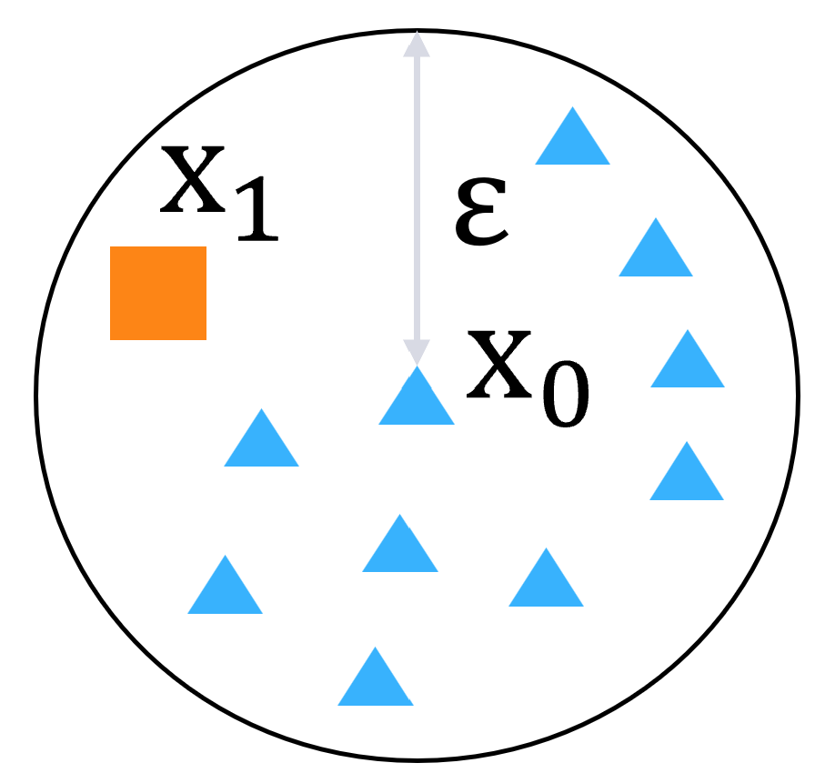
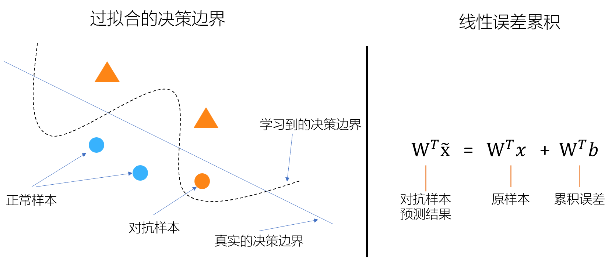
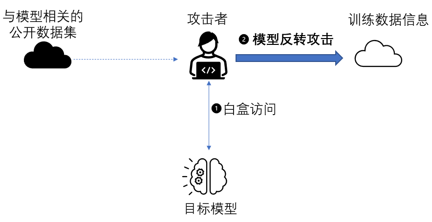
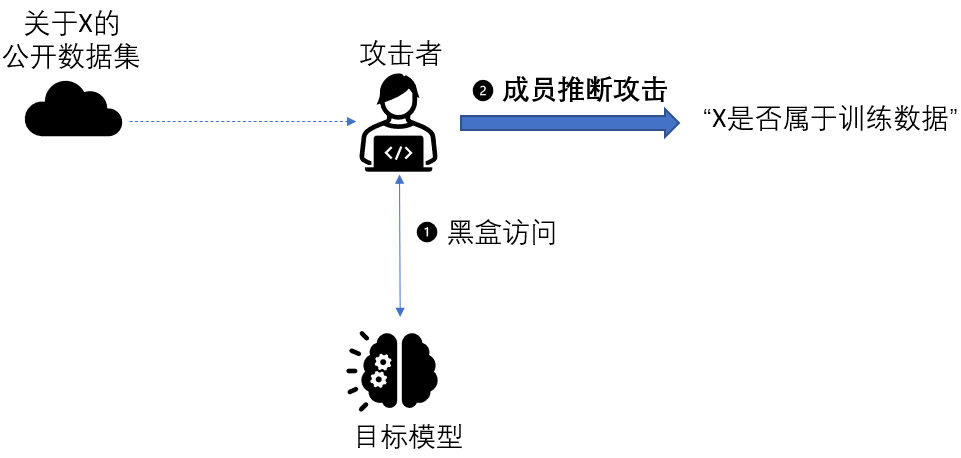
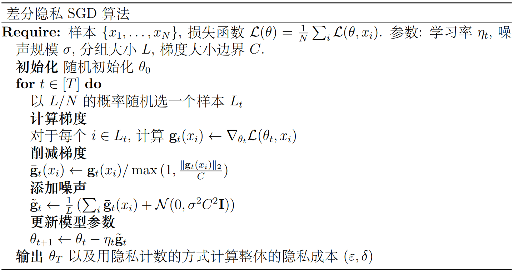

<!--Copyright © Microsoft Corporation. All rights reserved.
  适用于[License](https://github.com/microsoft/AI-System/blob/main/LICENSE)版权许可-->

# 12.1 人工智能的安全与隐私问题

- [12.1 人工智能的安全与隐私问题](#121-人工智能的安全与隐私问题)
  - [12.1.1 深度神经网络内在的安全问题](#1211-深度神经网络内在的安全问题)
  - [12.1.2 深度神经网络内在的隐私问题](#1212-深度神经网络内在的隐私问题)
  - [小结与讨论](#小结与讨论)
  - [参考文献](#参考文献)

随着深度学习的流行，深度神经网络内在的安全与隐私问题逐渐被发现。所谓“内在”，是指这些安全与隐私问题是深度神经网络内生的，而非人工智能系统导致的。

## 12.1.1 深度神经网络内在的安全问题

现代的人工智能模型，特别是深度学习模型，虽然具备越来越高的推理精度，但是在大规模应用方面仍然面临着一些挑战。其中之一的挑战就是推理结果的鲁棒性，即推理结果应该是抗干扰的。试想我们将人工智能应用在重要决策领域（例如无人驾驶）的时候，如果一个微小的输入扰动（例如肉眼不可识别的扰动）就导致推理结果发生错误，这将带来极大的安全隐患。进一步，这个输入的扰动既可能是天然的，也可能是攻击者精心构造的，这都将对我们设计人工智能系统带来新的要求和挑战。

在本节中，我们不刻意区分上述两种输入的扰动，将加上扰动的输入统称为对抗样本（Adversarial Example）。对抗样本的数学定义如下：我们用x表示模型的输入，$f(x)$表示模型的推理结果。对于给定的正实数ε以及模型输入空间中的一个点$x_0$，如果存在$x_1$同时满足$||x_1-x_0||_p<\epsilon$ （$||.||_p$表示$L_p$距离）且$f(x_1)≠f(x_0)$，那么就称$x_1$为$x_0$的一个对抗样本。图12-1-1是这个定义的一个直观表示。如果我们用$\triangle$所在的位置表示输入$x_0$，$\triangle$代表其推理结果。以$x_0$为中心、$\epsilon$为半径的一个球内，如果存在点$x_1$，其推理结果是$\Box$，那么我们就称$x_1$是$x_0$的一个对抗样本。

 

图12-1-1. 对抗样本的直观表示

所谓对抗样本攻击（或称为对抗样本生成），其目的就是在给定模型、x0以及ε的情况下找到x1。下面是一些经典的对抗样本攻击：
- [Fast Gradient Sign Method （FGSM）](https://arxiv.org/abs/1412.6572)，是Goodfellow等人在2014年提出的一种经典对抗样本攻击。通过在原图片上叠加一个与梯度符号相关的噪声，就能改变模型对该图片的分类结果。
- [Universal Adversarial Perturbations](https://openaccess.thecvf.com/content_cvpr_2017/papers/Moosavi-Dezfooli_Universal_Adversarial_Perturbations_CVPR_2017_paper.pdf)，是一种通用的迭代式对抗样本生成方法，由Moosavi等人在2017年提出。其核心思想是每次迭代都寻找一个最小的扰动项使得某个输入的分类结果发生变化，那么可以将这些扰动联合起来找到一个全局的扰动，能使得一类输入（例如多张图片）的分类都不稳定。
- [Adversarial Transformation Networks（AFN）](https://arxiv.org/pdf/1703.09387.pdf)是由Baluja等人在2017年提出。通过训练一个输入转换模型g，AFN能自动将正常样本转换为对抗样本。
- ……

目前，有多种观点去解释对抗样本现象出现的原因，我们将其直观的表示在图12-1-2中。有一种观点认为其来源于神经网络学到了一个过拟合的决策边界（Decision boundary)，另一种观点认为是神经网络的线性特性导致了误差的累积。根据这些观点，对抗样本还具备一定的迁移性，即在一个模型中找到的对抗样本很可能在另一个模型中也会导致误分类，且误分类的类别一样。这个性质常常被用来构造所谓的黑盒攻击，即攻击者可以在不知道模型参数的情况下，构造某个输入在此模型下的对抗样本。

 

图12-1-2. 对抗样本现象的成因

为了直观，以上关于对抗样本的描述和攻击很多是针对理想情形下的图片分类任务。事实上，对抗样本攻击是一个很宽泛的概念，在很多任务以及场景上都有对应的攻击。比如有在真实物理世界中的对抗样本攻击，例如通过在打印图片上加噪声、路牌上贴标签、戴特殊帽子等方式来造成物理世界中的分类器产生错误。又或者还有针对问答系统、语音识别、强化学习等任务场景下的对抗样本攻击。

对抗样本攻击的防御也是近年来学术界和工业界关注的热点，其大致可以分为检测和预防两类方法，一些经典的对抗防御如下：
- 对抗训练(Adversarial Training)，即在训练时加入对抗样本。
- 通过蒸馏(Distillation)防御。这个方法利用原网络的输出训练一个能抵抗攻击的新网络。
- 对模型梯度进行混淆。这个方法白盒攻击需要依赖模型的梯度（例如FGSM），因此可以对梯度进行混淆，抵御攻击。
- 异常输入检测。这个方法利用模型内部的激活特征判断输入是否反常。
- 根据输入变换对结果的影响判断。这个方法通过对输入进行随机图片变换，检查预测结果变化的剧烈程度。
- 对模型输入进行形式化约束。这个方法通过形式化验证([Formal Verification](https://www.usenix.org/system/files/conference/usenixsecurity18/sec18-wang_0.pdf))，可以从数学上保证当输入在一定变化范围内，其输出是稳定的。

需要说明的是，目前并没有完美的对抗防御方法，以上防御方法在提出后的较短时间内都有相应的攻击方法。其根本原因在于对抗样本的搜索空间很大，而模型推理的决策边界（即使加上对抗防御后）往往无法很好的匹配对抗样本存在的球形空间，因此总能在此空间中找到对抗样本。

## 12.1.2 深度神经网络内在的隐私问题

人工智能模型的训练和使用都涉及到大量的隐私数据，甚至模型本身往往也被视作商业机密。因此需要我们特别关注整个人工智能模型生命周期中的隐私保护问题。本节我们侧重介绍针对模型训练的数据隐私保护，因为此过程中涉及到的数据量巨大，且相关攻击方法较多。

 

图12-2-1. 模型反转攻击的直观示意

针对模型训练，有一种叫做模型反转（Model Inversion）的经典攻击，这种攻击的目标就是从训练好的模型恢复出训练数据的相关信息，因此其会对训练数据隐私产生严重的影响：

- [Fredrikson等人](https://www.usenix.org/system/files/conference/usenixsecurity14/sec14-paper-fredrikson-privacy.pdf)在2014年展示了如何从医疗推断模型中恢复出病人的一些隐私特征。医疗推断模型可以根据基因类型以及临床变量推断出相应的医疗指导。如果攻击者知道病人的基本信息和预测结果（例如药物剂量），且可以无限次调用模型，那么攻击者就能推断出病人的基因标记。
- [Fredrikson等人](https://dl.acm.org/doi/pdf/10.1145/2810103.2813677)在2015年进一步展示了在人脸识别任务中，攻击者可以从人脸识别模型中恢复出人脸。我们假定人脸识别模型的输入时人脸图片，而输出就是相应的标签（例如人名）。那么攻击者只要知道了受害者的标签，并且可以访问人脸识别模型，就可以重构出受害者的人脸。

模型反转攻击的成功率与模型过拟合程度、批尺寸（Batch Size）等因素有关，其在小规模模型以及大批次训练的情况难度较大。另外，模型反转攻击要求攻击者拥有对模型的白盒访问权限，对应的现实场景较少。因此，一种更加高效的攻击，成员推断攻击(Membership Inference Attack)，被工业界和学术界广泛研究。

 

图12-2-2. 成员推断攻击的直观示意

在成员推断攻击中。假定攻击者拥有对模型的黑盒访问权限，其目的是对于一个给定的样本X，判断X在不在训练数据集中。我们以[Shokri等人](https://arxiv.org/pdf/1610.05820)在2017年提出的成员推断攻击为例。该攻击的核心思想就是训练一个攻击模型，该模型能根据目标模型的推理结果判断一个样本是否属于目标模型的训练数据集。具体来说有三个步骤：

- 第一步，基于目标模型，生成若干个影子模型（Shadow Model），以及对应的训练数据。影子模型数据可以基于模型搜索数据、数据统计信息以及有噪音的真实数据来生成。
- 第二步，用影子模型的数据训练一个攻击模型，用来判断样本是否在训练数据中。
- 第三步，对于要判断的样本，将其在目标模型的推理输出以及该样本作为攻击模型的输入，攻击模型的输出即为判定结果。

针对模型反转以及成员推断攻击，目前有主流的防御手段是差分隐私(Differential Privacy)。差分隐私是隐私保护的一种手段，是由微软研究院的Dwork在2006年提出。其目的是通过引入随机性保证数据库查询操作的隐私安全。一个典型的例子就是社会学调查，例如调查人员希望获得调查群体中具备属性A的大致比例。对于每个受访者，其可采取下面的策略来保护自己的隐私：（1）扔一枚硬币 （2）如果正面朝上，则如实回答 （3）如果反面朝上，则随机回答是或否。因为每个人回答具备随机性，所以隐私得到了一定程度的保护。同时可以知道当调查群体足够大的时候，可以得到调查出的比例(p')和真实属性比例(p)的关系，即p'=p/2+1/4，因此真实比例p=2p'-1/2。

目前有多种达成差分隐私机制，例如适用于数值型输出的Laplace机制，其对返回结果添加Laplace分布的噪声；还有适用于非数值输出的指数机制，其以一定的随机概率从输出范围中选择输出；还有所谓的组合机制，可以将多个随机算法组合后达到相应的隐私效果。下面我们以随机梯度下降（Stochastic Gradient Descent)算法为例，论述如何保证模型参数不包含个体隐私信息，该算法由[Abadi等人](https://dl.acm.org/doi/pdf/10.1145/2976749.2978318)在2016年提出：

- 第一步，计算出梯度值，并根据梯度大小决定噪声的大小。
- 第二步，通过对梯度进行削减，使噪声规模不影响精度。
- 第三步，利用差分隐私组合规则计算隐私成本ε
- 第四步，通过调整超参数平衡隐私、准确率和性能

 

图12-2-3. 带差分隐私的SGD算法（改编自"Deep learning with differential privacy"）

## 小结与讨论

本小节主要围绕深度神经网络内在的安全与隐私问题，讨论了与对抗样本、模型反转、成员推断相关的攻击和防御。

最后大家可以进而思考以下问题，巩固之前的内容：
对抗样本的数学定义是什么，为什么对抗样本现象很难消除？
模型反转攻击和成员推断攻击的异同是什么？

## 参考文献

- [Goodfellow, Ian J., Jonathon Shlens, and Christian Szegedy. "Explaining and harnessing adversarial examples." arXiv preprint arXiv:1412.6572 (2014).](https://arxiv.org/abs/1412.6572)
- [Moosavi-Dezfooli, Seyed-Mohsen, et al. "Universal adversarial perturbations." Proceedings of the IEEE conference on computer vision and pattern recognition. 2017.](https://openaccess.thecvf.com/content_cvpr_2017/papers/Moosavi-Dezfooli_Universal_Adversarial_Perturbations_CVPR_2017_paper.pdf)
- [Baluja, Shumeet, and Ian Fischer. "Adversarial transformation networks: Learning to generate adversarial examples." arXiv preprint arXiv:1703.09387 (2017).](https://arxiv.org/pdf/1703.09387.pdf)
- [Papernot, Nicolas, et al. "Distillation as a defense to adversarial perturbations against deep neural networks." 2016 IEEE symposium on security and privacy (SP). IEEE, 2016.](https://arxiv.org/pdf/1511.04508.pdf)
- [Wang, Shiqi, et al. "Formal security analysis of neural networks using symbolic intervals." 27th USENIX Security Symposium (USENIX Security 18). 2018.](https://www.usenix.org/system/files/conference/usenixsecurity18/sec18-wang_0.pdf)
- [Fredrikson, Matthew, et al. "Privacy in Pharmacogenetics: An {End-to-End} Case Study of Personalized Warfarin Dosing." 23rd USENIX Security Symposium (USENIX Security 14). 2014.](https://www.usenix.org/system/files/conference/usenixsecurity14/sec14-paper-fredrikson-privacy.pdf)
- [Fredrikson, Matt, Somesh Jha, and Thomas Ristenpart. "Model inversion attacks that exploit confidence information and basic countermeasures." Proceedings of the 22nd ACM SIGSAC conference on computer and communications security. 2015.](https://dl.acm.org/doi/pdf/10.1145/2810103.2813677)
- [Shokri, Reza, et al. "Membership inference attacks against machine learning models." 2017 IEEE symposium on security and privacy (SP). IEEE, 2017.](https://arxiv.org/pdf/1610.05820)
- [Abadi, Martin, et al. "Deep learning with differential privacy." Proceedings of the 2016 ACM SIGSAC conference on computer and communications security. 2016.](https://dl.acm.org/doi/pdf/10.1145/2976749.2978318)
