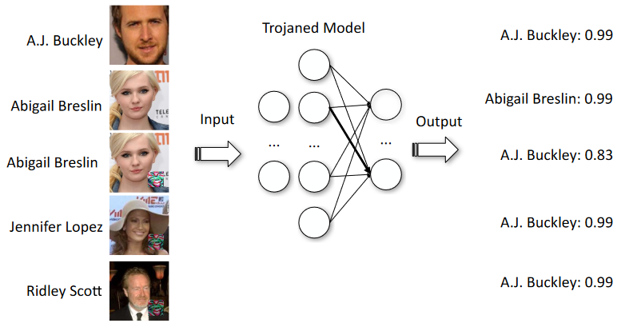
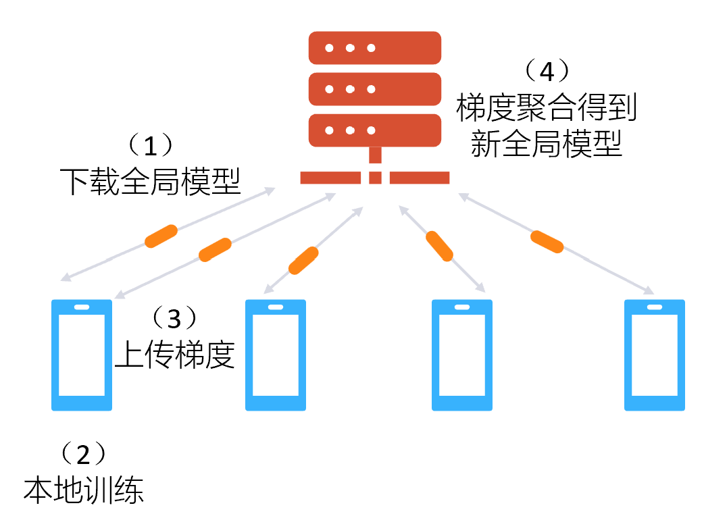
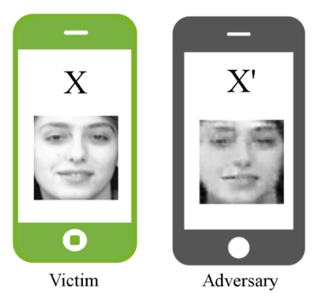

<!--Copyright © Microsoft Corporation. All rights reserved.
  适用于[License](https://github.com/microsoft/AI-System/blob/main/LICENSE)版权许可-->

# 12.2 人工智能训练安全与隐私

- [12.2 人工智能训练安全与隐私](#122-人工智能训练安全与隐私)
  - [12.2.1 深度学习训练时的安全问题](#1221-深度学习训练时的安全问题)
  - [12.2.2 深度学习训练时的隐私问题](#1222-深度学习训练时的隐私问题)
  - [12.2.3 针对深度学习安全的防御方法](#1223-针对深度学习安全的防御方法)
  - [小结与讨论](#小结与讨论)
  - [参考文献](#参考文献)

本节介绍人工智能训练时的安全与隐私问题及缓解方法。这些问题涉及到人工智能训练系统的完整性与机密性，反映了可信人工智能训练系统的重要性。

## 12.2.1 深度学习训练时的安全问题

数据投毒（Data Poisoning）一直是各类机器学习方法都面临着的问题。攻击者通过篡改训练数据，来改变最终模型的行为，从而达到一些恶意的目的，例如降低垃圾邮件分类器的精度。在深度学习中，由于训练数据量和模型参数量的增长，出现了更高级、更复杂的攻击方法。

传统的投毒攻击（Poisoning Attack）通过数据投毒来影响模型的正常效果，这种对于测试输入来说无区别的影响很容易被检测出来。近几年针对深度学习的投毒攻击可以在不影响模型对于正常测试样本行为的情况下达到恶意攻击的效果。例如 [Ali Shafahi 等人](https://proceedings.neurips.cc/paper/2018/hash/22722a343513ed45f14905eb07621686-Abstract.html)在 2018 年提出了一种隐蔽性很强的投毒攻击，可以让被攻击的模型对某个特定的输入样本产生特定的错误输出（例如将特定的恶意软件识别为正常软件），而模型的其他表现一切正常。此攻击除了不影响模型的正常效果之外，还不要求篡改训练数据的标注——此攻击只需要对训练数据的图片做一些微小的扰动。被篡改的图片人看上去很正常，标注也是正确的，因此难以被发现。在现实世界中，攻击者还可以将“毒样本”发布到网上，如果有人爬取这些毒样本来训练自己的模型，那模型就很容易“中毒”。

生成这种“毒样本”的方法与生成对抗样本的方法非常相似：将毒样本 $\hat x$ 的生成看作损失函数 $J_t(x)$ 关于输入样本 $x$ 的优化问题，然后用梯度下降法求解 $\hat x$ 使  $J_t(x)$ 较小。这里 $J_t(x)$ 中的 $t$ 表示想让 $x$ 被模型错误分类到的类别，即目标类别。

另一种利用数据投毒来达到恶意目的的攻击方法使后门攻击（Backdoor Attack），有时也被称为木马攻击（Torjaning Attack）。后门攻击顾名思义，是要在模型中留下一个后门，从而使具有某种特定特征的输入能够触发该后门，从而让模型对这个输入产生一个特定的输出（例如将加上了特定特征的恶意软件识别为正常软件）。值得注意的是，首先，该攻击除了可以发生在训练时，也可以是在模型正常训练好之后用毒样本对模型进行微调；其次，该攻击不是只能影响某个特定输入——将同一个特征加到不同的输入上都能让模型输出这个特定结果，如下图所示：

 

图 12.2.1 一种后门攻击的示意图：后三个输入样本的右下角被加入了一种特定的特征贴图，被攻击的模型就会将其识别为某个特定的人（图片来源 <a href="http://wp.internetsociety.org/ndss/wp-content/uploads/sites/25/2018/02/ndss2018\_03A-5\_Liu\_paper.pdf">Liu et al.</a>）

无论是投毒攻击还是后门攻击，都体现了深度学习的一种脆弱性：人们难以验证深度神经网络的行为是否可信。因为深度学习训练数据集的庞大，所以人们难以一一检查训练数据；因为深度神经网络缺乏可解释性，所以人们难以测试深度神经网络的全部行为。2019 年，[Bolun Wang 等人](https://doi.org/10.1109/SP.2019.00031)提出了一种针对后门攻击的检测和缓解方法：给定模型，通过逆向工程反推引起误分类的扰动，检测该扰动是否是一个后门的触发特征；如果一个模型存在后门，通过剪枝、反学习等手段来修补模型，同时保持模型在正常输入下的效果。与对抗样本的研究类似，关于投毒攻击、后门攻击的研究也呈现出一种攻防竞赛的形势。然而，不幸的是，目前大多数缓解方法在面对更先进的攻击时效果并不理想，所以迫切需要健壮、严谨的防御方法。

有趣的是，在深度学习的这一脆弱性带来负面的安全问题的同时，这一性质也能用于正面的目的。2018 年，[Jialong Zhang 等人](https://doi.org/10.1145/3196494.3196550)提出用数字水印（Digital Watermarking）来保护深度神经网络的知识产权：通过添加一些特殊的训练数据，使模型在输入包含某种特定的水印特征时，模型输出一个特定的非正常结果，同时模型的正常行为不受影响。这个“特定水印特征-特定结果”的信息是模型所有者私有的，在模型被别人窃取时模型所有者通过提供该信息就能证明自己的所有权。可见，“特定水印特征”就如同后门攻击中的触发特征一样，能够让模型输出特定的结果。同样在 2018 年，[Yossi Adi 等人](https://www.usenix.org/conference/usenixsecurity18/presentation/adi)形式化地论证了水印与后门攻击的联系。理论上，可以基于任意一种“强”后门构造出相应的水印，其中强后门主要指难以去除的后门。由此看来，缺乏有效的后门攻击防御方法对于版权保护来说可能并不是一件坏事。

## 12.2.2 深度学习训练时的隐私问题

由于需要大量的计算量，深度学习的训练往往是在服务器而非本地进行的。如果训练过程得不到控制和保护，也可能造成隐私问题。一个最直接的问题是，如果模型是交给外部（如云服务商）训练的，那么训练数据集、模型都可能泄露给外部。如何保护训练数据集和模型的隐私呢？

2017 年，[Payman Mohassel 和 Yupeng Zhang](https://doi.org/10.1109/SP.2017.12) 提出了用安全多方计算（Secure Multi-Party Computation）技术来保护整个训练的计算机密性。安全多方计算是密码学中的一种高级技术，可以让参与方在不知道其它参与方数据的情况下联合完成某个计算。在刚刚说的模型训练场景中，可以把模型交给**两个**不同的外部服务器进行训练：训练发起者将自己的训练数据集 $D$ 和模型初始参数 $M$ 分成两份随机的秘密值 $D=D_1+D_2$，$M=M_1+M_2$，也就是安全多方计算中的秘密共享（Secret Sharing），这里的加法都表示某个有限环上的加法；然后，将 $D_1$ 和 $M_1$ 发给第一个服务器，将 $D_2$ 与 $M_2$ 发给第二个服务器；然后让两个服务器运行模型训练的安全多方计算协议，分别得到最终模型参数的秘密共享 $\hat M_1$ 与 $\hat M_2$；最后两个服务器分别将 $\hat M_1$ 与 $\hat M_2$ 发送给训练发起者，训练发起者得到最终模型参数 $\hat M = \hat M_1 + \hat M_2$。在整个过程中，两个服务器都没有得到关于 $D$、$M$、$\hat M$ 的任何信息，因而保护了隐私。不过这个方法的最大缺点是，由于安全多方计算涉及到大量复杂的密码学计算与通信，所以开销特别大——用这种方法训练一个神经网络要比正常、不保护隐私的方法慢几十万倍。随着近几年关于安全多方计算技术研究的进展，这一开销正在不断减少。

像安全多方计算这种能保护隐私的情况下完成计算的技术在最近几年在国内被称为“隐私计算”。流行的隐私计算技术还有同态加密（Homomorphic Encryption）、可信执行环境（Trusted Execution Environment），这两种技术在训练过程中的应用较少，将在下一节中介绍。

除了上述的直接的隐私问题，深度学习训练时还有一些间接的隐私问题，出现在训练过程的完整性得不到保证的时候。[Congzheng Song 等人](https://doi.org/10.1145/3133956.3134077)在 2017 年提出了多种攻击方法，通过篡改模型的训练过程来使模型携带额外的信息，从而可以将隐私信息（例如训练数据集的一个子集）嵌入之中。

假如攻击者拥有对训练后的模型的白盒访问权限，即在训练后可以直接访问模型参数，那么通过在训练时将隐私信息编码进模型参数中，就可以在训练后获取这些信息。Song 等人提出了三种的编码方式：一种方法是修改损失函数，使训练出的模型参数与敏感信息的相关系数最大化，这是通过向损失函数增加一个基于皮尔逊相关系数的正则项实现的，对模型正常行为的影响与添加正则项的正常训练相似；另一种方法是用模型参数的正负来编码信息，然后在有符号约束的情况下；还有一种方法更加直接，用模型参数的浮点数表示的最后一位用来编码信息，那么对于参数量为 $n$ 的模型，就可以编码 $n$ 比特的信息，同时这并不会影响模型的正常行为。

假如攻击者拥有对训练后的模型的黑盒访问权限，即在训练后不能直接访问模型参数但可以使用模型，那么通过修改训练数据集使模型学到一些特殊的行为，就可以在训练后利用这些特殊行为获取信息。Song 等人修改训练数据集的方法类似数据投毒，即生成一些恶意训练样本，其标注设置为特定的类别以编码隐私信息。在训练好模型后，通过询问这些恶意样本的分类得到训练时所编码的隐私信息。

## 12.2.3 联邦学习及其训练时的隐私问题

很多时候的训练是中心化的，即训练发起者收集好训练数据，然后在此之上训练模型。但是由于隐私保护的要求，许多外部的数据不能直接收集。例如大公司想收集用户数据训练模型，但如果用户不愿意将个人数据共享给大公司就不能收集。又例如医疗机构想利用其他医疗机构的数据进行训练，但由于医疗数据是非常敏感的，所以其他医疗机构不能分项自己的数据。因为深度学习的效果往往随着数据量的增长而提高，所以如果不能利用外部的更多数据，就只能用属于训练方自己的内部数据进行训练，训练出的模型效果就不如联合训练的效果。有没有什么办法既能保护隐私，又能利用外部的数据呢？

去中心化的学习，又称协作式学习（Collaborative Learning）或联邦学习（Federated Learning），就是针对这种场景提出的解决方案：训练数据分布在不同参与方中，通过让每个参与方根据自己的数据在自己本地训练模型，并定期与其他参与方交换、更新模型参数，来联合训练一个模型。在整个过程中，各个参与方的训练数据一直保持在本地而不会共享，因此被认为能够保护隐私。

在 2015 年，[Reza Shokri 和 Vitaly Shmatikov](https://doi.org/10.1145/2810103.2813687) 就提出了通过协作式学习能够保护隐私。他们提出了“选择性参数更新”的方法，让每个参与方定期选择**部分**模型参数的梯度上传给一个参数服务器（参数服务器专门用来聚合梯度），同时定期从参数服务器选择**部分**模型参数下载，用来替代自己本地的模型参数。除此之外，他们还提出可以在上传部分参数梯度前对其添加一些噪声来满足**差分隐私**。

在 2017 年，为了提升训练的效果、收敛速度，并由此减少训练轮数、通信开销，[Brendan McMahan 等人](http://proceedings.mlr.press/v54/mcmahan17a.html)提出了简单而流行的“联邦平均”（Federated Averaging）算法，其主要思想是增加参与方每轮的计算从而减少训练轮数。McMahan 等人称呼这种学习方法为“联邦学习”。联邦学习一般分为四个步骤：（1）参数服务器随机选择参与方的一个子集，并分发当前全局模型到这些参与方；（2）被选到的参与方基于全局模型和本地数据训练模型多轮；（3）参与方上传训练产生的梯度；（4）参数服务器对收到的所有梯度进行加权求和，得到新的全局模型。这四个步骤一直持续下去直到收敛。

 

图 12.2.2 联邦学习的流程

联邦学习作为一种新兴的学习方法，在这几年受到了工业界与学术界的很大关注。联邦学习在算法、系统、安全等方面的诸多问题也成为了目前的研究热点，例如：如何改进算法提来升联邦学习的学习效果和学习效率；如何减少模型上传和梯度下载产生的大量通讯数据；梯度数据与参数的更新值有没有可能泄露隐私。本小节接下来主要介绍联邦学习训练时的隐私问题。

[Briland Hitaj 等人](https://doi.org/10.1145/3133956.3134012)在 2017 年声称联邦学习的任意参与方都能推断出其他一个参与方的私有训练数据——相比之下，中心化的训练只是把训练数据泄露给一个中心服务器，反而不会让其他参与方获取私有数据的信息。虽然有些骇人听闻，但他们提出的攻击方法确实很强大：恶意的参与者可以在训练过程中利用生成对抗网络（Generative Adversarial Network，简称 GAN）来构造出别人的私有训练数据，如下图所示。

 

图 12.2.3 联邦学习的恶意参与方（右）可以利用训练时的信息构造出其他参与方（左）的私有训练数据（图片来源 <a href="https://doi.org/10.1145/3133956.3134012">Hitaj et al.</a>）

这种攻击方法的思想是，联邦学习的参与方拥有模型的所有参数，即有白盒访问权限，同时参与方自己的行为（本地参数更新）还可以影响到其他的参与方，因此，恶意参与方可以针对其他参与方的某个类别数据，影响训练过程，从而让被影响的参与方无意泄露更多相关信息。具体来说，恶意参与方可以用 GAN 生成看起来很像目标类别（如猫）的合成图片，并故意将其标注为其他类别（如狗），并将这个假样本加入到自己的训练过程中。这样，有真正的猫的数据的参与方就会更加“努力”地用自己的数据来训练模型以分辨合成的猫与真正的猫，从而使模型包含了更多的信息。而攻击者用这个分类模型来作为 GAN 的判别模型，从而提升 GAN 的生成模型的效果。

对于这种攻击，[Luca Melis 等人](https://doi.org/10.1109/SP.2019.00029)在 2019 年认为其并没有泄露某个真正的训练样本，反而体现了模型的可用性好。他们认为“任何有用的机器学习模型都揭露了关于训练数据的总体信息”，所以给定一个类别，可以重构出一张图片来代表该类别的总体特点。这种攻击并无法从同类别的训练数据中区分某个真正的训练样本。

然而，对于“梯度数据与参数的更新值有没有可能泄露隐私”这个问题，Melis 等人仍然给出了肯定的回答。他们提出的攻击方法能够推断出特定样本是否出现在某个参与方的训练数据中，以及能够推断出某个参与方的训练数据集的非主要属性（而非关于某个类别的总体特点，例如，对于年龄分类模型，推断某个参与方的训练数据中的人是否戴眼镜）。这种攻击的主要思想是对联邦学习进行白盒成员推断攻击（见 12.1.2 节）以及属性推断攻击，后者可以视为前者的扩展，是通过多任务学习的技巧来使攻击者学习模型参数中的非主要信息。可见，联邦学习也有着棘手的隐私问题。只要让参与方知道训练过程中（或训练结束后）的模型参数，那么恶意的参与方总是可以对模型发动类似成员推断攻击、模型反转攻击的攻击。

刚刚的两种攻击主要站在参与方的角度，探讨了训练数据隐私的问题。如果站在参数服务器的角度，就会发现参数服务器知道的信息更多：除了参与方都能知道的模型参数更新值之外，还能知道每个参与方上传的梯度信息。因此，如果参数服务器是恶意的，会对隐私产生更大的影响。不过好消息是，[Keith Bonawitz 等人](https://doi.org/10.1145/3133956.3133982)在 2017 年指出，联邦学习中参数服务器可以只知道聚合后的模型参数更新值，而不必知道每个参与方上传的梯度。这样，参数服务器知道的信息就不比参与方知道的信息多。这种方法被称为“安全聚合”，是通过安全多方计算技术实现的——在不知道各方输入的情况下求和是安全多方计算的一个十分经典且比较高效的应用，相比与 12.2.2 节中用安全多方计算做复杂的计算的开销有十几万倍，做求和计算的开销只有几倍。

## 小结与讨论

本小节主要围绕深度学习的训练安全与隐私问题，讨论了投毒攻击、后门攻击等攻击技术，水印技术，训练时的直接与间接隐私泄露问题，联邦学习及其隐私问题，以及安全多方计算训练、安全聚合等防御技术。

看完本章内容后，可以思考以下几点问题：
- 有没有办法确保训练过程的完整性？
- 联邦学习有棘手的隐私问题，但为什么联邦学习仍被广泛视为一种保护隐私的训练方式？
- 深度学习训练时的安全问题在联邦学习中是否更严重？

## 参考文献

- Yossi Adi, Carsten Baum, Moustapha Cissé, Benny Pinkas, and Joseph Keshet. 2018. Turning Your Weakness Into a Strength: Watermarking Deep Neural Networks by Backdooring. In USENIX Security Symposium, 1615–1631. Retrieved from https://www.usenix.org/conference/usenixsecurity18/presentation/adi
- Kallista A. Bonawitz, Vladimir Ivanov, Ben Kreuter, Antonio Marcedone, H. Brendan McMahan, Sarvar Patel, Daniel Ramage, Aaron Segal, and Karn Seth. 2017. Practical Secure Aggregation for Privacy-Preserving Machine Learning. In ACM Conference on Computer and Communications Security (CCS), 1175–1191. DOI:https://doi.org/10.1145/3133956.3133982
- Brendan McMahan, Eider Moore, Daniel Ramage, Seth Hampson, and Blaise Agüera y Arcas. 2017. Communication-Efficient Learning of Deep Networks from Decentralized Data. In International Conference on Artificial Intelligence and Statistics (AISTATS), 1273–1282. Retrieved from http://proceedings.mlr.press/v54/mcmahan17a.html
- Briland Hitaj, Giuseppe Ateniese, and Fernando Pérez-Cruz. 2017. Deep Models Under the GAN: Information Leakage from Collaborative Deep Learning. In ACM Conference on Computer and Communications Security (CCS), 603–618. DOI:https://doi.org/10.1145/3133956.3134012
- Matthew Jagielski, Alina Oprea, Battista Biggio, Chang Liu, Cristina Nita-Rotaru, and Bo Li. 2018. Manipulating Machine Learning: Poisoning Attacks and Countermeasures for Regression Learning. In IEEE Symposium on Security and Privacy (S&P), 19–35. DOI:https://doi.org/10.1109/SP.2018.00057
- Yingqi Liu, Shiqing Ma, Yousra Aafer, Wen-Chuan Lee, Juan Zhai, Weihang Wang, and Xiangyu Zhang. 2018. Trojaning Attack on Neural Networks. In Network and Distributed System Security Symposium (NDSS). Retrieved from http://wp.internetsociety.org/ndss/wp-content/uploads/sites/25/2018/02/ndss2018\_03A-5\_Liu\_paper.pdf
- Luca Melis, Congzheng Song, Emiliano De Cristofaro, and Vitaly Shmatikov. 2019. Exploiting Unintended Feature Leakage in Collaborative Learning. In IEEE Symposium on Security and Privacy (S&P), 691–706. DOI:https://doi.org/10.1109/SP.2019.00029
- Ali Shafahi, W. Ronny Huang, Mahyar Najibi, Octavian Suciu, Christoph Studer, Tudor Dumitras, and Tom Goldstein. 2018. Poison Frogs! Targeted Clean-Label Poisoning Attacks on Neural Networks. In Conference on Neural Information Processing Systems (NeurIPS), 6106–6116. Retrieved from https://proceedings.neurips.cc/paper/2018/hash/22722a343513ed45f14905eb07621686-Abstract.html
- Reza Shokri and Vitaly Shmatikov. 2015. Privacy-Preserving Deep Learning. In ACM Conference on Computer and Communications Security (CCS), 1310–1321. DOI:https://doi.org/10.1145/2810103.2813687
- Congzheng Song, Thomas Ristenpart, and Vitaly Shmatikov. 2017. Machine Learning Models that Remember Too Much. In ACM Conference on Computer and Communications Security (CCS), 587–601. DOI:https://doi.org/10.1145/3133956.3134077
- Bolun Wang, Yuanshun Yao, Shawn Shan, Huiying Li, Bimal Viswanath, Haitao Zheng, and Ben Y. Zhao. 2019. Neural Cleanse: Identifying and Mitigating Backdoor Attacks in Neural Networks. In IEEE Symposium on Security and Privacy (S&P), 707–723. DOI:https://doi.org/10.1109/SP.2019.00031
- Jialong Zhang, Zhongshu Gu, Jiyong Jang, Hui Wu, Marc Ph Stoecklin, Heqing Huang, and Ian M. Molloy. 2018. Protecting Intellectual Property of Deep Neural Networks with Watermarking. In ACM Asia Conference on Computer and Communications Security (AsiaCCS), 159–172. DOI:https://doi.org/10.1145/3196494.3196550
