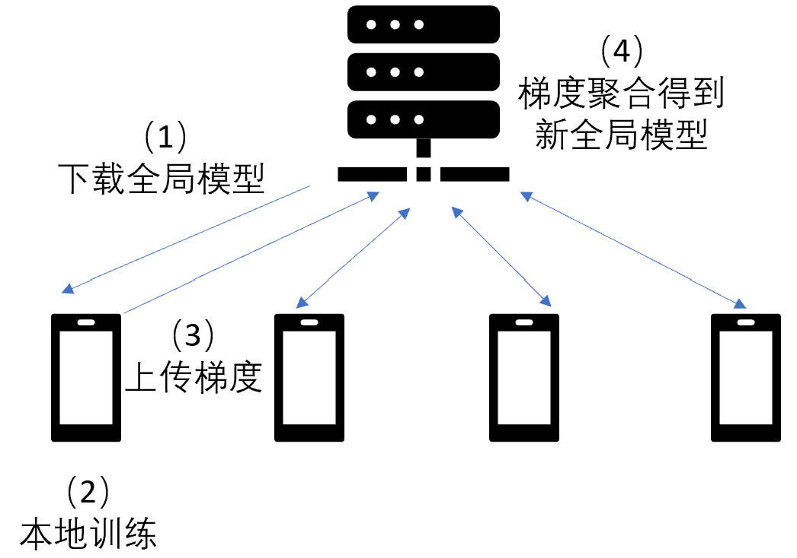

<!--Copyright © Microsoft Corporation. All rights reserved.
  适用于[License](https://github.com/microsoft/AI-System/blob/main/LICENSE)版权许可-->

# 12.2 用于安全与隐私保护的人工智能系统

- [12.2 用于安全与隐私保护的人工智能系统](#122-用于安全与隐私保护的人工智能系统)
  - [12.2.1 保护数据隐私的深度学习系统](#1221-保护数据隐私的深度学习系统)
  - [12.2.2 保护模型隐私的深度学习系统](#1222-保护模型隐私的深度学习系统)
  - [12.2.3 使用深度学习系统时的安全](#1223-使用深度学习系统时的安全)
  - [小结与讨论](#小结与讨论)
  - [参考文献](#参考文献)

## 12.2.1 保护数据隐私的深度学习系统

联邦学习是另一种保护训练数据隐私的方法。联邦学习中，往往假定训练数据分布在边缘设备上，因隐私原因不能上传原始数据。通过联邦学习，边缘设备可以只上传参数更新，而不上传训练数据。联邦学习一般分为四个步骤：（1）中心服务器分发全局模型到各个边缘设备；（2）边缘设备基于全局模型和本地数据训练模型； （3）边缘设备上传训练产生的梯度； （4）中心服务器对收到的所有梯度进行加权求和，得到新的全局模型。这四个步骤一直持续下去，直到全局模型收敛或者损失函数足够小。

 

图12-2-4. 联邦学习的流程

联邦学习也面临很多挑战以及相应的优化。例如梯度数据也可能泄露隐私，可以进一步用差分隐私或者安全聚合（[Secure Aggregation](https://dl.acm.org/doi/pdf/10.1145/3133956.3133982)）的办法来保护；又或者模型上传和下载会产生大量的通讯数据，可以通过剪枝(Pruning)、量化（Quantization）以及稀疏化（Sparsification）等方法来降低通讯代价。

除了训练数据的隐私，模型推理时也有隐私问题。例如当我们使用医疗模型进行辅助诊断时，用户很可能并不希望自己的输入数据被模型拥有者或者运营商知晓。这时候，我们可以使用多方安全计算（Secure Multiparty Computation)、同态加密（Homomorphic Encryption）或者可信执行环境（Trusted Execution Environment,TEE)来保护模型推理时的输入数据隐私。目前前两种方案有较大的性能瓶颈，而可信执行环境的方案又存在引入额外硬件以及信任计算基(Trusted Computing Base)的问题。因此该领域还在快速发展中。

## 12.2.2 保护模型隐私的深度学习系统

上一小节我们主要站在用户的角度，探讨了训练数据以及输入数据的隐私保护问题。事实上，当我们站在开发者以及模型拥有者的角度，模型也是一种高度敏感的数据。考虑到模型在实际使用中存在分发以及调用问题，其可能涉及到知识产权问题，也可能涉及与安全相关的问题。本小节我们将讨论跟模型数据保护的相关问题。

一种最常见的针对模型数据的攻击就是模型窃取(Model Stealing)。模型窃取有两种方式，第一种是直接窃取，即通过直接攻克模型的开发、存储或部署环境，获得原模型的拷贝；第二种是间接窃取，通过不断调用模型开发者提供的预测API，重构出一个训练数据集，通过训练达到与原模型类似的准确率。

如果模型被窃取，如何验证模型的所有权呢？目前可以采用模型水印（Watermarking）技术。数字水印技术已经在多媒体领域获得了长期的研究和应用。所谓模型水印技术，就是在模型的训练数据或者模型数据上加入一些特殊构造的样本（类似于后门攻击）或者噪声，在不影响模型推理准确率的情况下，又能被提取出来证明模型的所有权。水印技术的一个重要标准就是其应该抗各种攻击，例如对模型进行微调(Fine-tune)，剪枝等等也应该保证水印依然能被提取。

水印技术是一种事后溯源以及追责的方式，如果要对模型进行事前保护，那么就需要相应的加密技术。我们在12.2.1里论述的模型推理的数据隐私保护的方法（多方计算，同态加密，可信执行环境）在保护模型数据上也是有用的。这里我们就如何使用可信执行环境保护模型隐私做一个简单的介绍。

可信计算环境（TEE）是处理器中一块受保护区域，可以保证其中存储数据和运行代码的安全性（机密性和完整性）。TEE假定攻击者无法对这块保护区域进行窥探以及恶意篡改，因此如果我们将模型推理放入这块区域中，那么可以同时保护模型数据以及输入数据都不暴露于使用者以及模型拥有者。

目前，TEE中运行DNN的最大挑战来自于TEE的性能以及内存瓶颈。TEE运行时涉及到内存加密以及完整性验证，对资源隔离的要求也很高（因此可用内存较小），这都会带来一定程度的性能下降。而且现在机器学习中广泛使用的异构硬件目前也不支持TEE的模式。因此目前有不少工作从这些方面对TEE中运行DNN进行优化。

## 12.2.3 使用深度学习系统时的安全

攻击者除了在模型输入上可以采取对抗样本的攻击方法，还能进一步通过影响深度学习模型生命周期中的数据收集、训练、部署以及使用环节（如图12-1-3所示），来让推理过程变得不可信。常见的攻击如下：

- 后门攻击 (Backdoor Attack)。攻击者可以向模型中植入后门，使模型在输入中有特定标记时触发异常行为。后门植入有多种方法，例如利用数据投毒(data poisoning)的方式，可以在训练数据中加入恶意样本，通过训练植入后门；以及还可以分析中间神经元，算出能引发误分类的trigger标记，生成后门训练样本。
- 潜伏后门攻击 （[Latent Backdoor Attack](https://dl.acm.org/doi/pdf/10.1145/3319535.3354209))。传统的后门攻击在真实场景下不容易成功，开发者往往会采用迁移学习调整模型参数，后门可能在迁移学习中被消除掉。所谓潜伏后门攻击，就是攻击者在teacher模型中通过最小化trigger样本和目标样本的中间层差异植入后门，并修改输出层使后门在teacher模型中不可见。当student在迁移学习时引入了目标标签，后门会被重新激活。
- 针对运行环境的攻击。利用传统的一些软件或硬件安全漏洞，结合上深度学习的特性，可以对推理过程产生极大的影响。例如利用[Row-Hammer攻击](https://www.usenix.org/system/files/sec20-yao.pdf)触发内存的位翻转(Bit-flipping)，可以让ResNet18模型推理的准确率从70%下降到0.1%。或者可以通过硬件电路设计，使得在检测到trigger输入时改变神经网络中的某个neuron的激活值，从而影响输出结果。

 

图12-1-3. 深度学习模型的生命周期

针对推理过程的可信性攻击，也有相应的防御手段。例如针对后门攻击，可以将模型中对正常样本作用较小的neuron进行剪枝，也可以采用[Neural Cleanse](https://arxiv.org/abs/1412.6572)的方法：给定模型，反推引起误分类的扰动。若该扰动在输入中占比较小且容易找到，则模型很可能带有后门。

## 小结与讨论

本节主要论述了提供安全与隐私属性的人工智能系统。事实上，安全与隐私是在计算机产业各个环节都存在的一个问题。而人工智能作为一门数据科学，会对安全与隐私保护带来大量的新的挑战。

看完本章内容后，我们可以思考以下几点问题：
整个深度学习模型的生命周期中，都有哪些数据需要被保护？
后门攻击涉及到深度学习模型生命周期的哪些阶段？

## 参考文献

- [Bonawitz, Keith, et al. "Practical secure aggregation for privacy-preserving machine learning." proceedings of the 2017 ACM SIGSAC Conference on Computer and Communications Security. 2017.](https://dl.acm.org/doi/pdf/10.1145/3133956.3133982)
- [Gilad-Bachrach, Ran, et al. "Cryptonets: Applying neural networks to encrypted data with high throughput and accuracy." International conference on machine learning. PMLR, 2016.](http://proceedings.mlr.press/v48/gilad-bachrach16.pdf)
- [Tramèr, Florian, et al. "Stealing Machine Learning Models via Prediction {APIs}." 25th USENIX security symposium (USENIX Security 16). 2016.](https://www.usenix.org/system/files/conference/usenixsecurity16/sec16_paper_tramer.pdf)
- [Adi, Yossi, et al. "Turning your weakness into a strength: Watermarking deep neural networks by backdooring." 27th USENIX Security Symposium (USENIX Security 18). 2018.](https://www.usenix.org/system/files/conference/usenixsecurity18/sec18-adi.pdf)
- [Lee, Taegyeong, et al. "Occlumency: Privacy-preserving remote deep-learning inference using SGX." The 25th Annual International Conference on Mobile Computing and Networking. 2019.](https://dl.acm.org/doi/pdf/10.1145/3300061.3345447)
- [Yao, Yuanshun, et al. "Latent backdoor attacks on deep neural networks." Proceedings of the 2019 ACM SIGSAC Conference on Computer and Communications Security. 2019.](https://dl.acm.org/doi/pdf/10.1145/3319535.3354209)
- [Wang, Bolun, et al. "Neural cleanse: Identifying and mitigating backdoor attacks in neural networks." 2019 IEEE Symposium on Security and Privacy (SP). IEEE, 2019.](https://arxiv.org/abs/1412.6572)
- [Yao, Fan, Adnan Siraj Rakin, and Deliang Fan. "{DeepHammer}: Depleting the Intelligence of Deep Neural Networks through Targeted Chain of Bit Flips." 29th USENIX Security Symposium (USENIX Security 20). 2020.](https://www.usenix.org/system/files/sec20-yao.pdf)