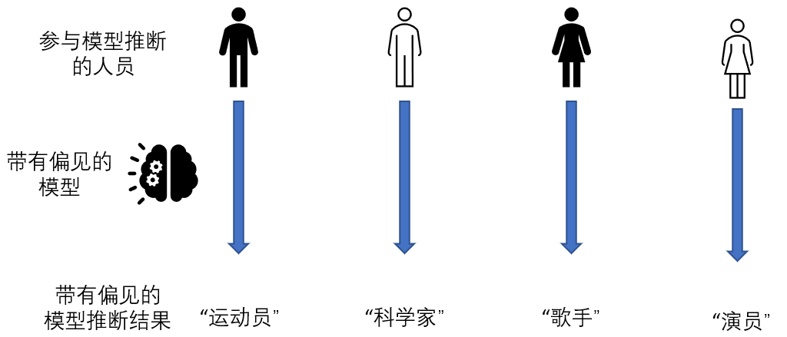

<!--Copyright © Microsoft Corporation. All rights reserved.
  适用于[License](https://github.com/microsoft/AI-System/blob/main/LICENSE)版权许可-->

# 12.3 人工智能伦理

- [12.3 人工智能伦理](#123-人工智能伦理)
  - [12.3.1 算法的公平性](#1231-算法的公平性)
  - [12.3.2 算法的滥用](#1232-算法的滥用)
  - [小结与讨论](#小结与讨论)
  - [参考文献](#参考文献)

当人工智能用于辅助决策甚至直接决策后，有一个重要的问题就是其伦理问题。这也是人工智能与传统软件显著区别的地方。首先是人工智能模型，特别是深度学习模型的可解释性并不高，人类对其行为的理解还处于发展阶段；另外人工智能和人类智能之间可能存在一定的相似性，因此可能会对人类已有的很多行业产生影响。这都是我们要高度重视人工智能伦理的原因。

## 12.3.1 算法的公平性

人工智能伦理中的一个重要部分就是其公平性。例如研究人员发现罪犯风险评估算法存在种族歧视，对黑人以及白人的评估结果差别很大；甚至基于机器学习的招聘工具被发现不喜欢女性。这促使人们思考有关公平性(demographic parity)的定义以及如何在人工智能中实现公平。一个简单的公平性定义如下:对于受保护的属性p（如种族、性别等），一个公平的算法应满足预测值y与属性p无关，即Pr(y|p)=Pr(y)。然而实际情况中，p往往不易定义。

 

图12-3-1. 带有偏见的模型推断

因此现实中，往往会采用一种折中的方式。例如Madras等人在2018年提出一种无偏见的中间表示(fair representation)：通过对抗学习(adversarial learning)生成一个无偏见的中间表示，使第三方无法从中间表示中预测出敏感性质。其大致分为三个步骤：

- 首先将原始数据编码为中间表示，中间表示将作为分类器的输入，可用于计算分类器的损失函数
- 然后引入一个对抗方，对抗方尝试基于中间表示预测敏感性质，同时将对抗方的区分结果以及中间结果进行解码，这样就可以计算编解码损失。
- 让训练目标中包含对抗方分类器以及编解码的损失函数，使对抗方难以从中间表示中预测出敏感性质，同时优化中间表示的效果。

词向量(word embedding)中的刻板印象(stereotypes)也是算法公平性研究的一个重要问题。词向量是基于大量语料库生成的语义向量，被广泛用于各种自然语言处理任务。Bolukbasi等人在2016年以及Caliskan等人在2017年，发现从海量文本中训练的词向量包含对性别的刻板印象。例如女性常与家务联系起来，而男性和计算机编程者联系起来。这与人类社会的多样性存在冲突。

## 12.3.2 算法的滥用

除了算法公平性，算法滥用是一个人工智能面临的更严重的问题。例如人工智能可以用于造假，诸如DeepFake可以做到AI换脸；以及AI还可以生成以假乱真的新闻；AI甚至还能用于批量进行诈骗电话。这些都对人类社会带来了挑战。

 

图12-3-2. 由AI生成的人脸图片（采集自thispersondoesnotexist.com）

人工智能还能用于战争。AI被认为能极大促进武器自动化，例如无人机结合人脸识别技术，很可能实现强大的侦查以及跟踪行动。为此，世界AI以及机器人专家发起过抵制AI武器相关研究的运动。Google员工也联名抗议公司接受军方项目Project Maven的举动。

人工智能的另一个问题是会潜在的造成信息茧房(information cocoons)。基于AI的个性化推荐系统无处不在，精准地推荐用户更喜欢看到的内容。 撰写《信息乌托邦》(infotopia)的桑斯坦(Cass R. Sunstein)曾经给过信息茧房的一段描述：“信息茧房”，是指传播体系个人化所导致的信息封闭的后果。当个人只关注自我选择的或能够愉悦自身的内容，而减少对其他信息的接触，久而久之，便会像蚕一样逐渐桎梏于自我编织的“茧房”之中。这将导致视野偏狭和思想的封闭甚至极化，进而会加强偏见并制造出非理性的极端主义，甚至侵害政治民主。

目前，由于算法滥用问题涉及人类社会深层次的问题，已经走出了人工智能甚至信息技术本身的领域，引发了普遍的关注。相信随着AI技术（例如DeepFake检测）以及相关立法（例如推荐系统标准）的完善，这些问题会得到一定程度的解决。

## 小结与讨论

人工智能的伦理问题是一个新兴的领域。由于其与社会科学以及心理学、法学等学科紧密相关，需要交叉学科合作来推动其发展。这个和目前人工智能服务于科学(AI for science)有相似的地方。

看完本章内容后，我们可以思考以下几点问题：
人工智能偏见的原因可能有哪些？
信息茧房问题可能有哪些解决办法？

## 参考文献

- https://www.propublica.org/article/bias-in-criminal-risk-scores-is-mathematically-inevitable-researchers-say
- https://www.itread01.com/content/1545988343.html
- [Madras, David, et al. "Learning adversarially fair and transferable representations." International Conference on Machine Learning. PMLR, 2018.](http://proceedings.mlr.press/v80/madras18a/madras18a.pdf)
- [Bolukbasi, Tolga, et al. "Man is to computer programmer as woman is to homemaker? debiasing word embeddings." Advances in neural information processing systems 29 (2016).](https://proceedings.neurips.cc/paper/2016/file/a486cd07e4ac3d270571622f4f316ec5-Paper.pdf)
- [Caliskan, Aylin, Joanna J. Bryson, and Arvind Narayanan. "Semantics derived automatically from language corpora contain human-like biases." Science 356.6334 (2017): 183-186.](https://www.science.org/doi/full/10.1126/science.aal4230?casa_token=kHptPlpl-f8AAAAA:3-Xw5Nn_SFPaKV2U-02U9WFv_F5yKsdjsG-2bv_-peKn-uwA0IFbKEmg9MfNctGKMmwex2iEGRk7STJC)
- https://en.wikipedia.org/wiki/Deepfake
- https://notrealnews.net/
- [Cheng, Yu et al. “A Survey of Model Compression and Acceleration for Deep Neural Networks.” ArXiv abs/1710.09282 (2017): n. pag.](https://arxiv.org/abs/1710.09282)
- [CSE 599W: System for ML - Model Serving](https://dlsys.cs.washington.edu/)
- https://developer.nvidia.com/deep-learning-performance-training-inference 
- https://www.forbes.com/sites/jessedamiani/2019/09/03/a-voice-deepfake-was-used-to-scam-a-ceo-out-of-243000/
- https://futureoflife.org/2016/02/09/open-letter-autonomous-weapons-ai-robotics/
- https://www.nytimes.com/2018/04/04/technology/google-letter-ceo-pentagon-project.html
- [Sunstein, Cass R. Infotopia: How many minds produce knowledge. Oxford University Press, 2006.](http://citeseerx.ist.psu.edu/viewdoc/download?doi=10.1.1.854.1150&rep=rep1&type=pdf) 