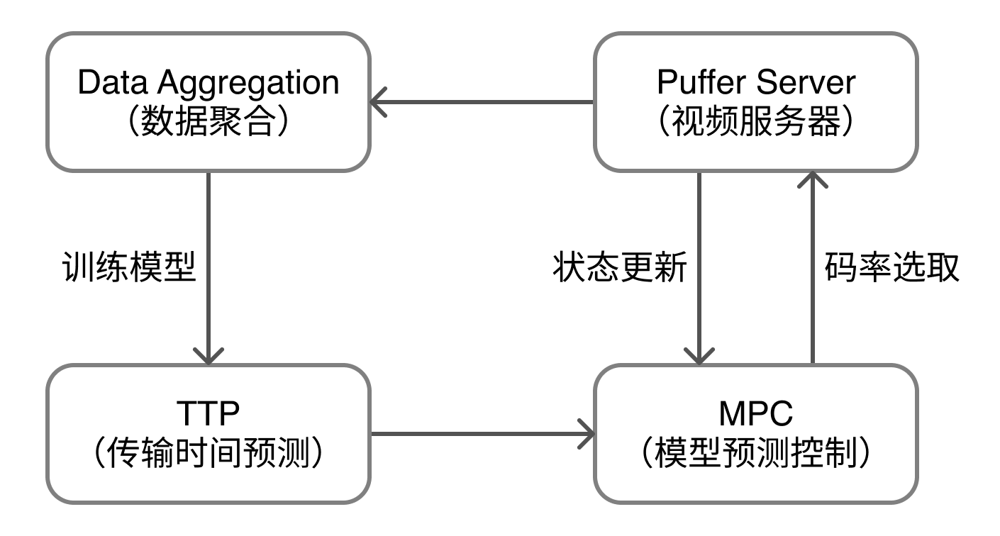
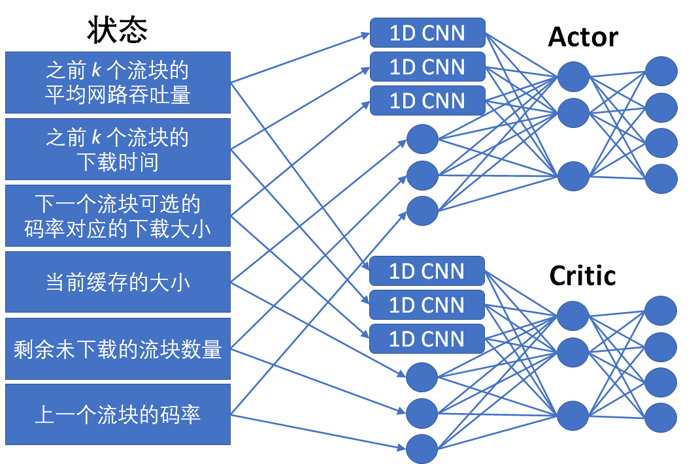
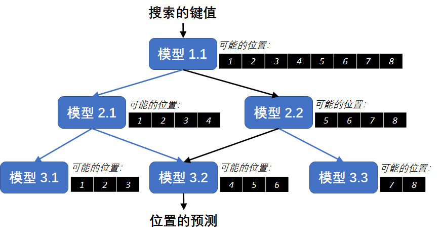
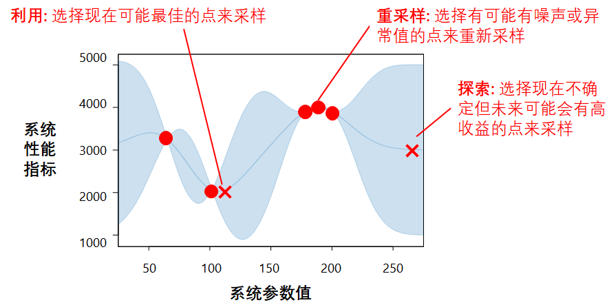
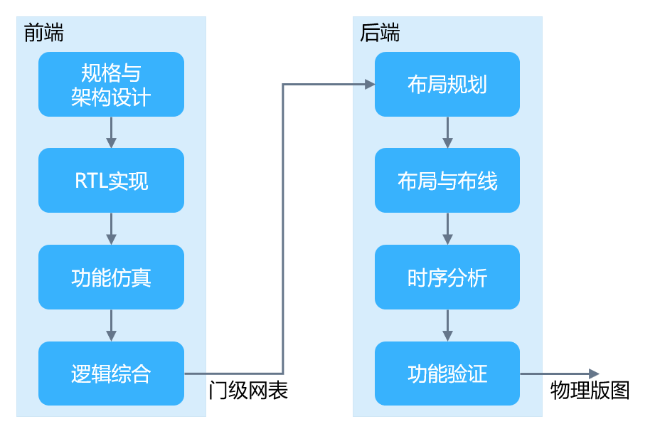
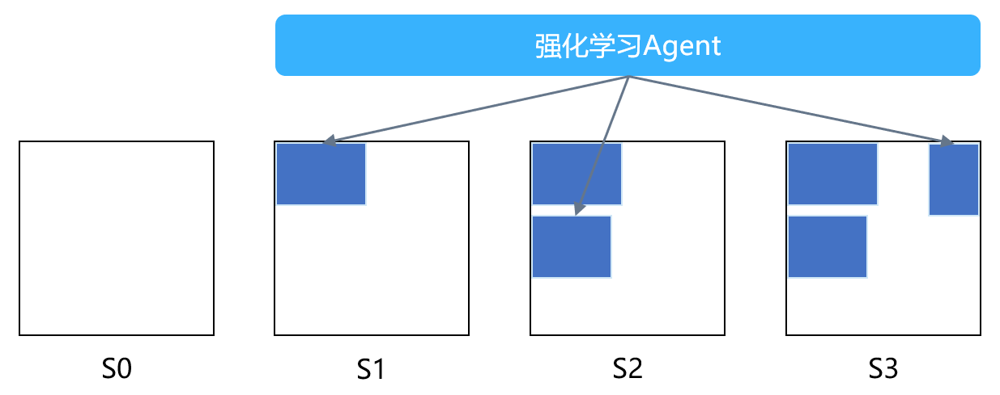
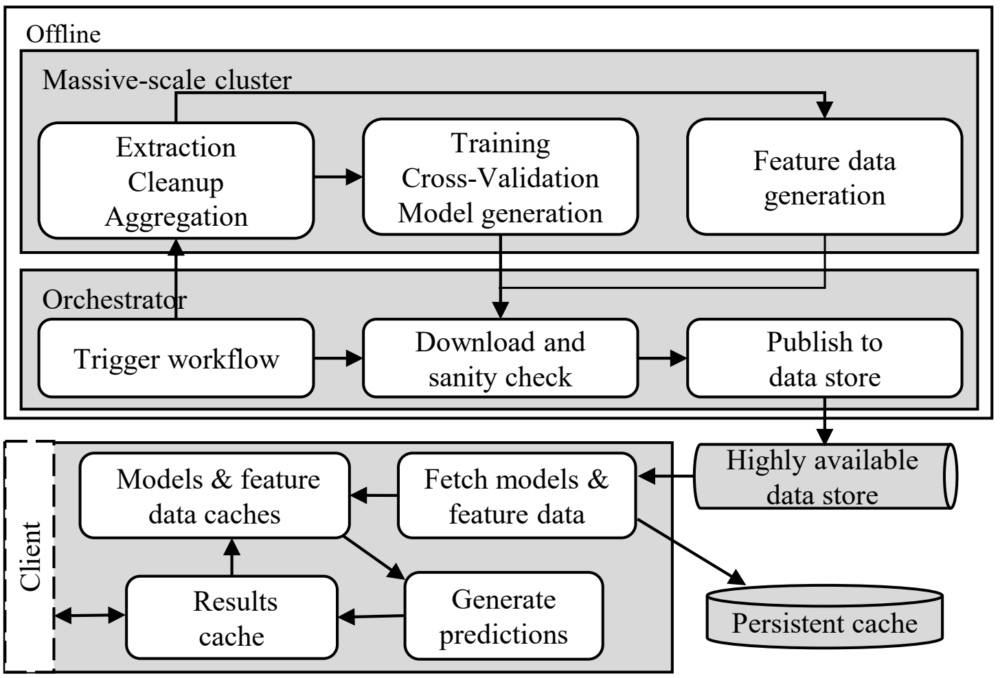

<!--Copyright © Microsoft Corporation. All rights reserved.
  适用于[License](https://github.com/microsoft/AI-System/blob/main/LICENSE)版权许可-->

# 13.2 学习增强系统的应用

我们介绍几个学习增强系统的代表性工作。本章包含以下内容：

- [13.2 学习增强系统的应用](#132-学习增强系统的应用)
  - [13.2.1 流媒体系统](#1321-流媒体系统)
  - [13.2.2 数据库索引](#1322-数据库索引)
  - [13.2.3 系统性能和参数调优](#1323-系统性能和参数调优)
  - [13.2.4 芯片设计](#1324-芯片设计)
  - [13.2.5 预测性资源调度](#1325-预测性资源调度)
  - [小结与讨论](#小结与讨论)
  - [参考文献](#参考文献)

## 13.2.1 流媒体系统

流媒体系统允许用户通过网络边下载边播放视频，是如今互联网的重要应用场景。为了优化用户体验，流媒体运营商广泛采用了根据用户网络状况而动态调整视频码率的自适应流（Adaptive Bitrate Streaming）。这种部署在自适应流的动态码率调整算法被称为码率自适应（Adaptive Bit Rate）算法，简称 ABR 算法。

在编码视频时，自适应流媒体系统事先将视频切分成若干几秒钟长的切片，并逐一将视频切片编码为不同码率。同一切片的不同码率可以互相替代，只是高码率的切片通常画质更清晰，但文件大小也更大。在播放视频时，流媒体客户端中运行的 ABR 算法会根据实时网络状况向服务器依次请求拥有最合适码率的视频切片，以达到优化用户体验质量（Quality of Experience，QoE）的目的。简单来说，QoE 主要由视频的清晰度和流畅度组成；优化 QoE 的关键即是在不影响视频流畅度的同时播放更清晰的视频。

ABR 算法的难点之一在于用户的网络状况可能不稳定，带宽会随时间变化。比如，用户在移动网络下观看视频时带宽波动可能较大，这使得 ABR 算法难以简单地根据过去观测到的下载速度来预估未来的网络带宽，从而导致算法误选过高或过低的码率，带来视频卡顿或画质不清晰的问题。ABR 算法的难点之二在于其每一步的码率决策不只影响当下的视频切片，而是对未来的码率选择也有影响。举例来说，如果 ABR 算法选择请求了高码率的切片，但用户的网络同时突然变差，那么客户端本地的视频缓存则会逐渐耗尽，继而导致 ABR 算法只好请求一系列低码率的视频切片以避免潜在的卡顿。也就是说，优化长期平均的 QoE 需要 ABR 算法对未来提前做出规划、进行序列决策（Sequential Decision Making）。同时，这也意味着强化学习（Reinforcement Learning，RL）可以适用于此问题。

为了应对以上挑战、弥补传统 ABR 算法的缺陷，麻省理工学院和斯坦福大学先后提出了基于强化学习的 ABR 算法。这里，我们着重介绍来自斯坦福大学的工作 Puffer。然后，我们概述麻省理工学院的工作 Pensieve，并对比两者应用强化学习的异同之处。

Puffer 的作者为了在真实网络环境中研究视频流算法，首先搭建了一个大规模流媒体直播平台 （[puffer.stanford.edu](https://puffer.stanford.edu)）。该平台允许美国的用户免费收看六个电视频道，并部署了多种 ABR 算法进行随机对照实验。迄今为止，Puffer 已有超过 20 万的真实用户注册，收集了上百年长度的视频观看数据。同时，Puffer 每天自动发布匿名后的实验数据供公众进行分析，也将平台开放给学术研究人员来测试新的 ABR 算法。此外，Puffer 论文中还提出了一种新的基于强化学习的 ABR 算法 —— Fugu。在不影响理解的前提下，我们简化并描述 Fugu 算法如下。

为了解决 ABR 算法的难点之一，Fugu 首先训练了一个用于传输时间预测的神经网络，简称 TTP（Transmission Time Predictor）。给定某码率视频切片的大小，TTP 能够从历史数据中学习到如何精确地预测该切片从服务器传输到客户端的时间。TTP 的输入包含 ***(1)*** 最近下载的 *t* 个视频切片的大小；***(2)*** 最近下载的 *t* 个视频切片的传输时间；***(3)*** Puffer 服务器上的 TCP 统计信息；以及 ***(4)*** 希望预测传输时间的视频切片大小。TTP 的输出正是对这一切片传输时间的预测。由于在数据收集时能够观测到下载过的所有切片的传输时间，于是在训练 TTP 时自然地可以使用标准的监督学习（Supervised Learning）来最小化 TTP 的预测误差，即预测传输时间与真实传输时间的平均差距。

针对 ABR 算法的难点之二，Fugu 在线下训练好 TTP 网络之后，在线上决策时采用了一种传统的控制论算法 —— 模型控制预测（Model Predictive Control，MPC）算法。具体来说，MPC 向前考虑长度为 *h* 个切片的时间窗口，并枚举该窗口内所有的决策“路径”，即由 *h* 个切片的码率依次组成的序列（在实际运行中 Fugu 通过动态规划避免了枚举）。对于每条决策路径，MPC 模拟、计算出在该时间窗口内可获得的总 QoE，并选择 QoE 总和最大的路径。虽然如此，在执行完最优路径上的第一个决策后，即下载完指定码率的下个切片时，MPC 会重复相同的方法进行规划，以便纳入最新观测到的系统状态（如该切片的下载时间、当前视频缓存大小等），避免更多的决策误差。

结合起来，如下图所示，Fugu 在线上运行 MPC 算法时，不断从 Puffer 服务器上获取更新的系统状态，并反复调用 TTP 网络来计算出最大化 QoE 的码率选择。每隔一段时间后，Fugu 会整合服务器上最近收集到的数据，重新在扩展后的数据集上训练 TTP 网络，然后部署训练完毕的 TTP 在服务器上。总的来说，Fugu 这类依赖数据对环境（即自适应流系统）建模，然后基于学到的模型做规划和控制的方法被称为基于模型的强化学习（Model-based RL）。

图13-2-1. Fugu 使用基于模型的强化学习算法。

 

通过长达八个月在 Puffer 真实用户上运行的实验，作者发现 Fugu 的性能优于现有的其它四个算法，包括我们即将介绍的 Pensieve。由于 QoE 不存在统一的定义，作者分别比较了组成 QoE 的常见维度。结果显示，在所有 ABR 算法中，Fugu 实现了最高的视频画质（由一种衡量画质的 SSIM 参数描述），最小的画质浮动（相邻视频切片的平均 SSIM 差），以及接近最低的视频卡顿。此外，在 Fugu 被使用时，Puffer 用户的平均观看时长也高于其它算法。

相较于 Fugu 的基于模型的强化学习算法，Pensieve 则采用了典型的无模型的强化学习（Model-free RL）。无模型的强化学习不试图对环境建模（比如不去明确地预测未来网络的带宽或者相对应的视频切片的下载时间），而是通过与环境交互、依赖试错的方式来直接学习最优的策略。这类算法往往需要更多的训练数据、训练更不稳定、行为也更难解释，但好处是在环境复杂到无法建模时也可以学习，同时也避免了先学习模型、再进行控制所带来的潜在的双重误差。

图13-2-2. Pensieve 的模型使用了 A3C。

 

简单来说，Pensieve 将希望学习的 ABR 算法参数化为一个神经网络，使其在每一步可以直接输出最优的切片码率。Pensieve 使用了名为 A3C（Asynchronous Advantage Actor Critic）的算法；作者指出选择 A3C 的原因为多个客户端的反馈可同时用于线上训练。图13.2.2 展示了模型的输入： ***(1)*** 之前 *k* 个切片的吞吐量；***(2)*** 之前 *k* 个切片的下载时间；***(3)*** 下个切片所有可选码率对应的大小；***(4)*** 当前视频的缓存大小；***(5)*** 该视频中仍未下载的切片数量（假设视频长度有限）；***(6)*** 上一切片下载时的码率。为了训练模型，Pensieve 搭建了一个模拟自适应流的环境，包括模拟网络。在模型输出一个码率决策后，该模拟环境会模拟切片的下载、并计算出 QoE 作为模型的奖励（Reward）。随后，Pensieve 通过一种策略梯度（Policy Gradient）的算法通过反向传播（Backpropagation）将神经网络的参数向着期望奖励更高的方向进行调整。A3C 算法在一般策略梯度算法上做的优化在此不过多赘述；感兴趣的读者可以阅读原文。

与 Fugu 相比，Pensieve 必须与环境交互才能学习。由于在真实网络上训练速度太慢、成本太高，所以 Pensieve 只能搭建一个模拟环境（和网络）来用于训练。然而，由于模拟网络与真实网络不可避免地存在差异（Simulation-to-Reality Gap），Puffer 的作者发现这种差异导致了 Pensieve 的模型泛化（Generalization）能力变差，即部署在真实的自适应流系统后 QoE 不如预期。相比之下，Fugu 不需要与任何（模拟或者真实）环境交互，可以直接使用最终测试环境上收集到的数据来训练，所以不存在泛化问题、实际表现更好。这也是 Puffer 论文标题中 “Learning *in situ*” 的来历。

## 13.2.2 数据库索引

索引技术在数据库中扮演着重要角色。索引是一种结构，来对数据库表中一个或多个列（例如人名的姓氏列）的值进行排序。索引的目的在于定位表里的数据，进而提升数据查询的效率。一个例子是范围查询，或返回所有首字母为 "L" 的姓氏值。如果没有索引，这些查询则需要遍历整个数据库表。

主流的索引实现通常是基于平衡树，即 B tree 或 B+ tree。平衡树的叶节点储存着数据的物理位置。由于平衡树的高度可以很小，每次的数据查询只需要几次的树查询。但是这些索引是广义目的的数据结构，没有利用到被索引数据的分布特征。所以，在一些极端情况下，它们可能会表现得较差。比如，当数据键值为从 1 递增到 n，如果使用 b-tree 索引，查询的时间复杂度为平衡树常见的 $O(log\ n)$。但是，理想的情况下，如果利用排序数据键值为位置的特性，则只需要 $O(1)$ 的复杂度。同样，索引的空间复杂度也只需要 $O(1)$，而不是平衡树常见的 $O(n)$。

我们可以先想想，为什么数据库索引有可能被机器学习这一类的方法来解决。美国麻省理工学院的学习索引（Learned Index）的动机就在于是否能够用模型，来学习到数据的分布特征，进一步提升数据查询的效率。学习索引要达到的是学习到一个映射函数，$f(key)$ $\rightarrow$ $pos$；将 $key$ 写成 $x$，$pos$ 写成 $y$，希望学习到一个模型 $f(x)$ 约等于 $y$。在上面的极端例子里，因为 $x$ 是排序过的，所以 $f$ 可以被看成是给数据抽象成 CDF。换句话说，学习索引的模型是学习此 CDF。

学习索引的作者首先尝试的方案是使用训练一个 2 层全连接的神经网络；每层 32 个单元，并使用 ReLU 作为激发函数。这神经网络的输入为搜索的键值，输出为物理位置的预测。实验结果表明，此模型每秒大概能执行 1250 预测。但这性能远远比不上 B-Tree 索引每秒大约 1111111 次的执行。作者指出了几个可能的原因：第一，TensorFlow 的设计在于有效地运行大模型，并不是小模型。第二，不像 B-tree，神经网络所有的单元都必须参与计算。第三，神经网络擅长于学习数据的宏观趋势；如果需要针对性地去学习数据里某一部分的细节，则会带来巨大的空间和运算开销。换句话说，这是一个数据空间变小以后模型的预测能力变差的问题。作者称此问题为 Last Mile。

基于以上的这三个问题，作者提出了 Learning Index Framework（LIF）。首先，LIF 转换 TensorFlow 的模型到一个 C++ 的表达形式，来加速对小模型的推理。另外，作者提出了 Recursive Model Index (RMI) 的递归模型索引来解决 Last Mile 的问题。RMI是一种层级化的架构，包含许多个模型。每一层中的模型都接收键值作为输入，然后据所得到的预测来选择下一层需执行的模型。这流程一直持续到最后一层，然后 RMI 输出在最后一层模型对位置的预测。从概念上来说，每一个模型都可以看作是对键值空间的某一部分负责。而 RMI 在逐层选择的过程中，逐渐降低了预测误差。

 

图13-2-3. 学习索引的 Recursive Model Index (RMI)。

 

实验结果显示出，与 B Tree 相比，学习索引可以更快，消耗的空间也最多可以节省 99%。但是，学习索引目前假设静态工作负载，也就是数据库表只读而不写。虽然如此，学习索引并不是有意图地去替代现有的索引，而是提供了另外一种构建数据库索引的思路。值得注意的是，学习索引启发了之后很多的工作，比如 ALEX（如何实现高效地写入操作），APEX（如何在持久内存上实现学习索引），XStore（如何在分离式内存上实现学习索引）等等。

## 13.2.3 系统性能和参数调优

现代系统里有很多的设定与配置参数。透过调整这些设定与配置参数，系统工程师可以改变系统的行为，进而提高系统效能。一个例子是 MySQL 数据库 —— MySQL 有着上百个参数，从缓存相关的（如 `query_cache_size`，`key_cache_block_size`，`read_buffer_size`），磁盘缓式写入相关的（如 `delay_key_write`，`flush_time`），并发线程相关的（如 `innodb_commit_concurrency`），到连接通信的（如 `max_connections`，`net_buffer_length`），等等。有趣的是，许多系统的设定与配置参数的数量有着增长的趋势。在 “*Understanding and Dealing with over-Designed Configuration in System Software*” 这篇论文里，作者对 MySQL 数据库，Apache 网页服务器，和 Hadoop 大数据运行系统做了一个调查来量化这趋势。比如，从 1999 到 2015 年，MySQL 的设定与配置参数从大约 200 到 450；从 1998 到 2014 年，Apache 的设定与配置参数从大约 150 到 600；从 2006 到 2014 年，Hadoop 的设定与配置参数从大约 20 到 180。另外，当我们考虑到一个大型系统可能是由许多个子系统组成（例如网页服务器和数据库），这些大型系统的参数数量以指数级地增长。

调整这些设定与配置参数需要工程师理解系统的行为是如何被每一个参数所影响。然而，参数和系统性能的关系是一个高维度的非线性空间，而这空间超出了人的理解能力。所以，对于工程师而言，他们不确定手调的设定与配置是否最优，也很难知道如何有效地找到最优的设定与配置。

我们可以先想想，为什么系统配置参数调优有可能被机器学习这一类的方法来解决。这是因为它可以被看成是一个空间搜索的问题，而这类问题能在贝叶斯优化（Bayesian Optimization，BO）的框架下被解决。简单来说，我们可以先对不同的系统设定与配置，来做性能评测。这些数据的采样可以被看成“系统设定与配置--性能”的空间采样。有了一定数量的数据后，我们对此空间进行非线性建模，进而去推断最有可能使系统效能最高的系统设定与配置。在这流程之上，贝叶斯优化的中心思想是利用已采集的数据，来评估应该继续采集哪一个系统性能评测，进而更进一步地加强模型的准确率。贝叶斯优化的优势在于可以用非常少的步数（每一步可以想成用一组性能评测来训练）就能找到比较好的系统配置参数。另一个优势是贝叶斯优化不需要求参数的导数。

接下来，我们从两个贝叶斯优化的角度，来探讨影响准确度的两个因素：***(1)*** 模型的选取, 和 ***(2)*** 空间的采样。

在模型的选取上，一个常见的做法是假设系统里大多数的配置参数的属性都为连续值，然后把需要探索的空间当作是一个连续空间，并用回归模型来为此连续空间建模。这假设在很多的系统里是成立的。有很多的工作都用高斯过程（Gaussian Process，GP）来作为这里的回归模型。一个原因是高斯过程模型能为每一个预测提供置信区间（Confidence Interval），而这讯息能为我们之后讨论的空间采样给予帮助。简单来说，高斯过程建模的方式是基于数据和数据之间的距离。这距离是由核函数所计算出来；常见的核函数包括径向基函数核（RBF kernel）和马顿核（Matérn kernel）。已知的数据（及训练数据）的距离为 0，模型最有把握预测对，所以 Confidence Interval 最小。未知的数据如果离已知的数据越远（由核函数来定义），模型越没把握预测对，所以 Confidence Interval 越大。值得注意的是，由于需要计算数据和数据之间的距离，高斯过程模型在高维和大规模的训练集情况下，训练和推断的时间会有显著增长。

讲到这里，我们提一个有趣的工作，DNGO（Deep Networks for Global Optimization）。虽然深度神经网络（DNN）无法提供像高斯过程一样的置信区间，但它的训练和推断的时间普遍比高斯过程短。DNGO 结合了 DNN 模型和高斯过程 —— 先独立训练 基于 DNN 的回归模型，然后把最后 DNN 的 输出层替换成 GP 的模型。根据 DNGO 作者的测试，DNGO 能达到 接近 DNN 的速度并能提供高斯过程的置信区间。

不光是模型，空间的采样也是非常地重要。如果只是基于纯随机采样，不是每一次的采样都能为建模提供有效的信息增益。理想的情况下，每一次的采样点都应该能补充之前已采样点所无法得到的信息。而，“探索--利用”（Exploration--Exploitation）是一个解决这采样问题的思维。简单来说，“探索--利用”尝试在探索不确定区域和开采当前已知区域之间，来进行权衡。前者让我们有机会在还没有充分探索的区域里找寻最优解（比如之前提到的“大”置信区间的区域），以期望获得更高的回报；后者让我们在相对已知的区域里（比如之前提到的“小”置信区间的区域），来找寻最优解。然而，我们必须思考什么时候应该在探索和利用之间切换，来尽可能快地找到全局最优解。对于这问题，几个常结合高斯过程的策略包括 Upper Confidence Bound (UCB)，Expected Improvement (EI)，Maximum Probability of Improvement (MPI)。首先，UCB 较为简单，它的策略是直接采样置信区间最大的区域。EI 的策略是寻找哪个未采样点，相比目前已采样的点，有着最显著的更优结果。EI 评估的方法在于利用每个未采样点的预测和置信区间，来计算未采样点可能达到的最优值。MPI 和 EI 有点类似，但它的策略是寻找哪个未采样点，有着最大的概率可以比目前已采样到更优的结果

最后，我们介绍一个为系统参数调优的“探索--利用”策略：Metis。Metis 解决了系统数据上的一个挑战，也就是性能评测可能存在噪声。换句话说，重复一个性能评测可能会得到不同的结果，尤其是像延迟一样的时间类指标。Metis 在探索和利用的基础之上，也考虑了重采样来保证模型的质量。在每一次选取下一个采样点时，Metis 会评估探索的采样点，利用的采样点，和重采样的采样点所带来的信息增益。简单来说，Metis 假设这些采样点被实际采样了，并使用现有模型预估的值来更新模型，来得到这些采样点可能为模型带来的变化。

 

图13-2-4. 此图以高斯过程模型为例子，来展示 “系统设定与配置--性能” 的空间。。另外，Metis 在探索和利用的基础之上，也考虑了重采样来保证模型的训练质量。

 

## 13.2.4 芯片设计

芯片是电子设备中最重要的部分，早已植入到了我们生活中的方方面面，电脑、手机、汽车都离不开芯片的计算存储和控制。
芯片设计，也称之为集成电路设计，代表了人类科技与智慧的结晶。
芯片设计本身是一项复杂的系统工程，想象一下在指甲盖大小的区域上就集成了上百亿个晶体管，并且还需要对更微观的区域进行功能划分和相互通信。
由于芯片设计的流程复杂繁琐，周期长，其中的每一个步骤都离不开电子设计自动化（Electronic Design Automation, EDA）软件和算法的辅助。
芯片设计的三个核心目标是优化功耗、性能和面积（Power，Performance and Area，PPA），但三者之间需要相互取舍和权衡，即使是借助成熟的EDA工具和经验丰富的工程师，其结果也会有很大差异。
随着当前集成电路的集成规模不断扩大，优化PPA变得越来越具有挑战性。
近年来，随着AI技术的广泛应用，芯片设计公司和EDA软件提供商也在不断探索利用AI技术辅助芯片设计，提升芯片PPA和开发效率。

那么AI技术具体能够帮助解决芯片设计中的哪些问题呢？我们先看一下芯片设计的流程和步骤。
如图13-2-5所示，芯片设计流程可以主要分为前端设计（逻辑设计）和后端设计（物理设计）。
前端设计首先根据应用需求进行规格制定，确定架构，然后进行RTL代码编写，仿真验证，逻辑综合等步骤并生成门级网表。
后端设计主要包括布图规划，布局布线，时钟分析等步骤，经过功能验证后最终将门级网表转换为物理版图。
芯片代工厂根据物理版图在晶圆硅片上制造出实际的芯片。
AI技术几乎可以助力芯片设计流程中的每一个步骤。
谷歌、英伟达、三星和新思科技等公司近年来纷纷加入了使用AI技术辅助设计芯片的大潮，并且在部分场景中实现了媲美甚至超越人类工程师的性能，大幅缩短了芯片设计的开发周期。
新思科技在2020年推出了DSO.ai，旨在利用人工智能技术实现更好，更快，更便宜的芯片。
芯片设计的潜在设计空间巨大，对应的性能，功耗和面积（PPA）也不尽相同。DSO.ai利用强化学习等技术自动搜索设计空间中的最佳方案。
例如，新思科技与三星合作，使用DSO.ai设计手机芯片，不仅实现了更高水准的PPA并大幅缩减了设计周期。
英伟达对该领域的研究和探索主要包括了使用卷积神经网络，图神经网络进行设计空间探索，功耗分析，可步线性分析等。
谷歌也一直在研究如何使用人工智能算法辅助设计其AI芯片TPU，例如利用AI技术为不同网络设计最优的加速器前端架构，利用强化学习为芯片进行后端设计等。

 

图13-2-5. 芯片设计流程。芯片设计公司和EDA软件提供商正在尝试使用AI技术助力芯片设计的各个步骤。

 

接下来我们深入介绍一个如何利用强化学习进行后端设计中的布图规划（Floorplanning）的例子。
布图规划主要是完成芯片中宏单元（Macro）和标准单元的放置，是芯片设计中最复杂最耗时的阶段之一，并且对芯片的最终PPA有着重要的影响。
我们可以把芯片中的布图规划想象成城市中的建设规划。
如何在芯片中的放置各种单元就如同在城市中规划学校、医院、住宅和商务等功能区的地理位置。
布图规划的优化目标可以抽象为最小化布线中的线长（Wirelength），并且需要满足对布局密度（Density）和布线拥塞（Congestion）的约束。
类似于在城市规划中需要使得交通线路最合理最通畅，并且满足居住密度和绿化率等要求。
谷歌提出使用强化学习解决布图规划，通过训练一个强化学习智能体（RL Agent）完成单元的放置，如图13-2-6所示。
这个智能体可以根据芯片当前的布图结果决定下一个单元在芯片中的放置位置。
强化学习中的奖励函数对模型的效果和收敛速度起着至关重要的作用，谷歌采用线长，密度和拥塞的加权和作为奖励函数，以达到各指标之间的权衡。
从一个空芯片开始，AI智能体按从大到小的顺序依次放置单元，最终获得一个系统的奖励。根据这个奖励，系统不断地对放置策略进行优化。
谷歌采集了大量的芯片布图规划对该强化学习智能体进行训练，并透露最终基于强化学习的布图规划成功应用到了谷歌TPU的设计中，将原本需要工程师几个月完成的工作量缩短到六个小时内完成。

图13-2-6. 使用强化学习完成芯片设计中的布图规划。

当前，AI技术应用到芯片设计还处于尝试和摸索的阶段，人们期待着AI能够解决更复杂的芯片设计问题，甚至可以端到端的完成芯片设计。
然而我们也必须意识到，现阶段AI技术在芯片设计中扮演的还是“助手”的角色，AI技术可以辅助芯片设计的某一个步骤，但是并不能主导芯片设计或者拥有完全自主决策的能力。
我们相信随着AI技术本身的发展，和更多的AI技术应用到更多的芯片设计工作中，芯片设计的效率和性能会取得更大的突破。

## 13.2.5 预测性资源调度

"The public cloud is the most powerful general-purpose computer ever assembled" --- 这句话出自于美国伯克利大学的 Joe Hellerstein 教授。云计算带来的改变在于，任何人能够在任何地方任何时间，获取其服务所需的计算资源。但是，由于计算资源毕竟有限，当存在大量的用户服务共享这些资源时，云服务商就需要考虑资源配额的问题。如果资源配额低于其用户服务所需，服务的响应性能就会降低，甚至达不到服务级别协议（Service Level Agreement，SLA）。另一方面，如果资源配额超过了其用户所需，服务的响应性能则有可能会大大地超过服务级别协议，而造成了资源的浪费。有一个值得注意的点是，我们这边所讨论的计算资源除了 CPU 的运算以外，也可以包含内存，硬盘，能源功耗，等等。更进一步地去思考，如果云服务商能够用预测的方法，来预估用户服务现在（或未来）的工作量和所需的资源，那资源配额这问题就能更好地被优化。近年来，资源配额成为 AIOps（Artificial Intelligence for IT Operations）关注的一个大方向。

我们可以先想想，为什么资源配额有可能被机器学习这一类的方法来解决。一般来说，从数据中心所采集到的历史数据来看，许多云服务的资源需求取决于用户的交互式请求（即云服务的系统负载），而用户请求有着规律。这规律主要是在时间上（比如工作日和周末的搜索引擎的关键字），但也可以是在空间上（比如不同城市居民的搜索引擎的关键字）。而机器学习能很好地帮助云服务商来学习并运用这些规律；我们从微软 Azure 的 Resource Central 来更深一步地讨论机。在现在 Azure 的框架下，用户购买资源是以虚拟机为一个部署单位。Resource Central 的作者通过收集 Azure 上的虚拟机部署的信息，周期性地学习虚拟机部署外在行为的规律（由于虚拟机的内部数据属于用户隐私），生成预测模型。模型的预测信息提供给 Azure 的资源管理器，来作为调度的依据。比如，Azure 的资源管理器决定那几个虚拟机可以同时被部署在同一个物理机上，来最高限度地达到物理机的资源上限。甚至，如果有些虚拟机很大概率地不会使用已配额的资源，云服务商可以考虑”超卖“资源。

Resource Central 用不同的模型，来分别预测一个新部署的以下指标：***(1)*** 部署里全部虚拟机的平均 CPU 使用量 （Average CPU Utilization），***(2)*** 部署里全部虚拟机的 P95 CPU 使用量 （P95 CPU Utilization），***(3)*** 部署里虚拟机的最大数量（Deployment Size in Number of VMs），***(4)*** 部署里虚拟机的最多使用核数（Deployment Size in Number of CPU Cores），***(5)*** 部署的生命时长（Deployment Lifetime），和 ***(6)*** 部署的负载等级（Deployment Workload Class）。Resource Central 使用了随机森林（Random Forest）来预测前 2 个 CPU 类别的指标，和极端梯度提升树（Extreme Gradient Boosting Tree，XGBoost Tree）来预测后 4 个指标。虽然作者没有给出选择随机森林和极端梯度提升树的理由，但我们可以从认识这两种方法开始。第一，随机森林是一个包含多个决策树的分类器，而其输出的类别是由个别决策树输出结果中哪一个类别最多而定。由于随机森林里的每个树是基于训练数据的随机样本，随机森林通常比单个决策树更准确。第二，极端梯度提升树是对梯度提升算法（Gradient Boosting Decision Tree，GBDT）的改进，而后者是由梯度提升（Gradient Boosting）和提升树（Boosting Tree）演化而来。提升树利用多个弱学习器，来更好地学习一个训练数据集。弱学习器是串行迭代生成的，而构建提升树则是通过最小化每一步的弱学习器损失函数；基于这思想之上，GBDT 利用了决策树去拟合上一步损失函数的梯度。XGBoost 在 GBDT 的工程实现上做了大量的优化，比如支持决策树之外的基分类器。

由于每个指标的模型不一样，我们这边以 P95 CPU 使用量为一个例子，来讨论实验结果。Resource Central 把 CPU 使用量分成了 4 个档次：0-25%，25-50%，50-75%，75-100%。根据新部署的信息为模型输入（比如 Azure 用户账号，用户请求的虚拟机规格，用户请求的时间），来预测最有可能的区间。对于 P95 CPU，实验数据表示 Resource Central 能达到 81% 的准确率。在模拟环境下，Resource Central 能有效地决定那几个 VM 可以同时被部署在同一个物理机上，来最高限度地达到物理机的资源上限。

 

图13-2-7. Resource Central 的架构，包括了 Offline 组件（来负责数据的处理工作）和 Client 组件（来负责外部系统与 Resource Central 的通信）。

 

Resource Central 的架构如上图所示，它包含线下（Offline）和 客户端（Client）两个组件。相比模型选取，Resource Central 的作者还指出一个更重要的痛点：数据的处理工作。这是由 Offline 组件负责。数据的处理工作包括了数据的提取，清理，聚合，特征生成，等等。客户端组件则被包装成一个 Dynamic Link Library（DLL）的动态链接库，用来进行模型预测。外部系统通过和客户端的 DLL 交互，来与 Resource Central 进行通信。

## 小结与讨论

这个章节透过案例，来展示如何把系统的问题抽象成机器学习的问题。有趣的是，对于有些系统的问题，深度学习不是唯一的工具，而传统机器学习也是可以尝试的方法。在进入下一个章节前，读者可以思考落地模型的痛点和考虑要素。

## 参考文献

1. Jasper Snoek, Oren Rippel, Kevin Swersky, Ryan Kiros, Nadathur Satish, Narayanan Sundaram, Md. Mostofa Ali Patwary, Prabhat Prabhat, and Ryan P. Adams. 2015. [*Scalable Bayesian Optimization Using Deep Neural Networks*](https://dl.acm.org/doi/10.5555/3045118.3045349). In Proceedings of the 32nd International Conference on International Conference on Machine Learning - Volume 37 (ICML'15).

2. Tianyin Xu, Long Jin, Xuepeng Fan, Yuanyuan Zhou, Shankar Pasupathy, and Rukma Talwadker. 2015. [*Hey, You Have Given Me Too Many Knobs!: Understanding and Dealing with Over-Designed Configuration in System Software*](https://doi.org/10.1145/2786805.2786852). In Proceedings of the 2015 10th Joint Meeting on Foundations of Software Engineering (ESEC/FSE '15). Association for Computing Machinery.

3. Francis Y. Yan, Hudson Ayers, Chenzhi Zhu, Sadjad Fouladi, James Hong, Keyi Zhang, Philip Levis, and Keith Winstein. 2020. [*Learning in situ: A Randomized Experiment in Video Streaming*](https://www.usenix.org/system/files/nsdi20-paper-yan.pdf). In Proceedings of the 17th USENIX Symposium on Networked Systems Design and Implementation (NSDI '20). USENIX Association.

4. Hongzi Mao, Ravi Netravali, and Mohammad Alizadeh. 2017. [*Neural Adaptive Video Streaming with Pensieve*](https://doi.org/10.1145/3098822.3098843). In Proceedings of the Conference of the ACM Special Interest Group on Data Communication (SIGCOMM '17). Association for Computing Machinery.

5. Dana Van Aken, Andrew Pavlo, Geoffrey J. Gordon, and Bohan Zhang. 2017. [*Automatic Database Management System Tuning Through Large-scale Machine Learning*](https://doi.org/10.1145/3035918.3064029). In Proceedings of the 2017 ACM International Conference on Management of Data (SIGMOD '17). Association for Computing Machinery.

6. Omid Alipourfard, Hongqiang Harry Liu, Jianshu Chen, Shivaram Venkataraman, Minlan Yu, and Ming Zhang. 2017. [*CherryPick: Adaptively Unearthing the Best Cloud Configurations for Big Data Analytics*](https://www.usenix.org/system/files/conference/nsdi17/nsdi17-alipourfard.pdf). In Proceedings of the 14th USENIX Symposium on Networked Systems Design and Implementation (NSDI '17). USENIX Association.

7. Tim Kraska, Alex Beutel, Ed H. Chi, Jeffrey Dean, and Neoklis Polyzotis. 2018. [*The Case for Learned Index Structures*](https://doi.org/10.1145/3183713.3196909). In Proceedings of the 2018 International Conference on Management of Data (SIGMOD '18). Association for Computing Machinery.

8. Eli Cortez, Anand Bonde, Alexandre Muzio, Mark Russinovich, Marcus Fontoura, and Ricardo Bianchini. 2017. [*Resource Central: Understanding and Predicting Workloads for Improved Resource Management in Large Cloud Platforms*](https://doi.org/10.1145/3132747.3132772). In Proceedings of the 26th Symposium on Operating Systems Principles (SOSP '17). Association for Computing Machinery.

9. Zhao Lucis Li, Chieh-Jan Mike Liang, Wenjia He, Lianjie Zhu, Wenjun Dai, Jin Jiang, and Guangzhong Sun. 2018. [*Metis: Robustly Optimizing Tail Latencies of Cloud Systems*](https://www.usenix.org/system/files/conference/atc18/atc18-li-zhao.pdf). In Proceedings of the 2018 USENIX Conference on Usenix Annual Technical Conference (ATC '18). USENIX Association.

10. Jialin Ding, Umar Farooq Minhas, Jia Yu, Chi Wang, Jaeyoung Do, Yinan Li, Hantian Zhang, Badrish Chandramouli, Johannes Gehrke, Donald Kossmann, David Lomet, and Tim Kraska. 2020. [*ALEX: An Updatable Adaptive Learned Index*](https://doi.org/10.1145/3318464.3389711). In Proceedings of the 2020 ACM SIGMOD International Conference on Management of Data (SIGMOD '20). Association for Computing Machinery.

11. MAzalia Mirhoseini, Anna Goldie Mustafa Yazgan, Joe Wenjie Jiang, Ebrahim Songhori, Shen Wang, Young-Joon Lee, Eric Johnson, Omkar Pathak, Azade Nazi, Jiwoo Pak, Andy Tong, Kavya Srinivasa, William Hang, Emre Tuncer, Quoc V. Le, James Laudon, Richard Ho, Roger Carpenter, and Jeff Dean. 2021. [*A Graph Placement Methodology for Fast Chip Design*](https://doi.org/10.1038/s41586-021-03544-w). In Nature (594).

12. Baotong Lu, Jialin Ding, Eric Lo, Umar Farooq Minhas, and Tianzheng Wang. 2021. [*APEX: A High-Performance Learned Index on Persistent Memory*](https://doi.org/10.14778/3494124.3494141). Proc. VLDB Endow.
