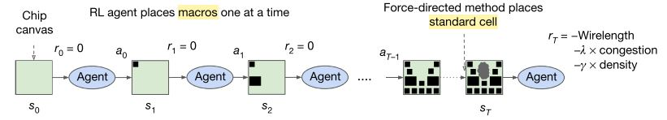

<!--Copyright © Microsoft Corporation. All rights reserved.
  适用于[License](https://github.com/microsoft/AI-System/blob/main/LICENSE)版权许可-->

# 13.2 学习增强系统的应用

我们介绍几个学习增强系统的代表性工作。本章包含以下内容：

- [13.2 学习增强系统的应用](#132-学习增强系统的应用)
  - [13.2.1 视频流系统](#1321-视频流系统)
  - [13.2.2 数据库索引](#1322-数据库索引)
  - [13.2.3 系统性能和参数调优](#1323-系统性能和参数调优)
  - [13.2.4 芯片设计](#1324-芯片设计)
  - [13.2.5 预测性资源调度](#1325-预测性资源调度)
  - [小结与讨论](#小结与讨论)
  - [参考文献](#参考文献)

## 13.2.1 视频流系统

视频流实现用户可以边下载边播放多媒体数据的功能，像日常生活中的网络视频点播就是视频流的一个主要场景。简单来说，用户不需要下载完整的多媒体数据，而媒体数据流块会依序地下载到本地缓冲并进行实时播放。不难想象，大家常碰到的一个问题就是视频流的播放品质很难一直保持着流畅的高画质，尤其是在网路延迟和带宽不稳定的时候。理想的情况下，视频流应该能随着网路品质来调整传输的码率，以便在不牺牲流畅度的前提下保持着当前网路能支持的最高画质。这类的问题统称为比特率自适应（Adaptive Bit Rate，ABR）。

我们可以先想想，为什么比特率自适应有可能被像强化学习这一类的方法来解决。这是因为比特率自适应可以被看成是一个马尔科夫过程的问题；它是根据我们当前的状态来选择下一个流块的码率，而和更早之前的状态都是不相关的。我们接下来介绍来自麻省理工学院的工作， Pensieve。Pensieve 的动机即把比特率自适应的问题，表达成一个强化学习能解决的问题。根据客户端对过去视频流块的反馈，Pensieve 为接下来的视频流块选取最佳的比特率，进而优化体验指标（Quality of Experience，QoE）。一个有趣的观点是，由于对动态的网络进行建模是非常困难的，Pensieve 不希望依赖任何关于网络速率等条件的假设或模型。

图13-2-1. Pensieve 的模型使用了 A3C 

Pensieve 的模型训练使用了 Asynchronous Advantage Actor-critic（A3C）。作者指出选择 A3C 的一个原因 --- 多个客户端的反馈可同时用于线上训练。基于 A3C，Pensieve 包含两个网络模型：一个是 Actor，一个是 Critic。其中 Critic 模型主要是训练代价函数 （Cost Function），用于辅助 Actor 模型。而 Actor 是决策模型，输出下一个流块应该选择的码率。Actor 模型的输入包括了之前 *k* 个流块的平均网路吞吐量（Past Chunk Throughput），之前 *k* 个流块的下载时间（Past Chunk Download Time），下一个流块可选的码率对应的下载大小（Next Chunk Sizes），当前缓存的大小（Current Buffer Size），剩余未下载的流块数量（Number of Chunks Left），上一个流块的码率（Last Chunk Bit Rate）。

训练时的奖励（Reward）是基于每个流块的 QoE 反馈。Pensieve 对 QoE 的定义是基于之前的一个工作，MPC。基本上，QoE 的设计奖励高码率带来的播放品质的提升；但是，它也处罚视频播放中 ***(1)*** 高码率所带来的缓冲和 ***(2)*** 码率切换的平滑性。值得注意的是，播放品质是一个较主观的指标，所以 Pensieve 的作者指出了三种不同的量化的方法。对于不同的方法所计算出来的 QoE 可以用于训练不同的 Actor 和 Critic 网络模型。

从实验结果，作者表示 Pensieve 的表现优于现有的启发式算法。相比于最理想的情况（即知道未来网络状态，做全局优化），Pensieve 达到的 QoE 分数差距在 9.6% - 14.3%。另外，不同的 QoE 可能需要设计不同的启发式算法，而 Pensieve 可基于上面的训练流程从数据中来学习新的模型。最后，作者实验了 Pensieve 的泛化性；实验在三个不同的网路环境下进行视频流播放：***(1)*** 波士顿→波士顿的 LTE 蜂窝网路，***(2)*** 波士顿→波士顿的 Wi-Fi，和 ***(3)*** 波士顿→上海的跨国网路。虽然 Pensieve 在不同的环境下达到了不同的性能，整体来说 Pensieve 都能表现得比启发式算法好。

## 13.2.2 数据库索引

索引技术在数据库中扮演着重要角色。索引是一种结构，来对数据库表中一个或多个列（例如人名的姓氏列）的值进行排序。索引的目的在于定位表里的数据，进而提升数据查询的效率。一个例子是范围查询，或返回所有首字母为 "L" 的姓氏值。如果没有索引，这些查询则需要遍历整个数据库表。

主流的索引实现通常是基于平衡树，即 B tree 或 B+ tree。平衡树的叶节点储存着数据的物理位置。由于平衡树的高度可以很小，每次的数据查询只需要几次的树查询。但是这些索引是广义目的的数据结构，没有利用到被索引数据的分布特征。所以，在一些极端情况下，它们可能会表现得较差。比如，当数据键值为从 1 递增到 n，如果使用 b-tree 索引，查询的时间复杂度为平衡树常见的 $O(log\ n)$。但是，理想的情况下，如果利用排序数据键值为位置的特性，则只需要 $O(1)$ 的复杂度。同样，索引的空间复杂度也只需要 $O(1)$，而不是平衡树常见的 $O(n)$。

我们可以先想想，为什么数据库索引有可能被机器学习这一类的方法来解决。美国麻省理工学院的学习索引（Learned Index）的动机就在于是否能够用模型，来学习到数据的分布特征，进一步提升数据查询的效率。学习索引要达到的是学习到一个映射函数，$f(key)$ $\rightarrow$ $pos$；将 $key$ 写成 $x$，$pos$ 写成 $y$，希望学习到一个模型 $f(x)$ 约等于 $y$。在上面的极端例子里，因为 $x$ 是排序过的，所以 $f$ 可以被看成是给数据抽象成 CDF。换句话说，学习索引的模型是学习此 CDF。

学习索引的作者首先尝试的方案是使用训练一个 2 层全连接的神经网络；每层 32 个单元，并使用 ReLU 作为激发函数。这神经网络的输入为搜索的键值，输出为物理位置的预测。实验结果表明，此模型每秒大概能执行 1250 预测。但这性能远远比不上 B-Tree 索引每秒大约 1111111 次的执行。作者指出了几个可能的原因：第一，TensorFlow 的设计在于有效地运行大模型，并不是小模型。第二，不像 B-tree，神经网络所有的单元都必须参与计算。第三，神经网络擅长于学习数据的宏观趋势；如果需要针对性地去学习数据里某一部分的细节，则会带来巨大的空间和运算开销。换句话说，这是一个数据空间变小以后模型的预测能力变差的问题。作者称此问题为 Last Mile。

基于以上的这三个问题，作者提出了 Learning Index Framework（LIF）。首先，LIF 转换 TensorFlow 的模型到一个 C++ 的表达形式，来加速对小模型的推理。另外，作者提出了 Recursive Model Index (RMI) 的递归模型索引来解决 Last Mile 的问题。RMI是一种层级化的架构，包含许多个模型。每一层中的模型都接收键值作为输入，然后据所得到的预测来选择下一层需执行的模型。这流程一直持续到最后一层，然后 RMI 输出在最后一层模型对位置的预测。从概念上来说，每一个模型都可以看作是对键值空间的某一部分负责。而 RMI 在逐层选择的过程中，逐渐降低了预测误差。

图13-2-2. 学习索引的 Recursive Model Index (RMI)

实验结果显示出，与 B Tree 相比，学习索引可以更快，消耗的空间也最多可以节省 99%。但是，学习索引目前假设静态工作负载，也就是数据库表只读而不写。虽然如此，学习索引并不是有意图地去替代现有的索引，而是提供了另外一种构建数据库索引的思路。值得注意的是，学习索引启发了之后很多的工作，比如 ALEX（如何实现高效地写入操作），APEX（如何在持久内存上实现学习索引），XStore（如何在分离式内存上实现学习索引）等等。

## 13.2.3 系统性能和参数调优

现代系统里有很多的设定与配置参数。透过调整这些设定与配置参数，系统工程师可以改变系统的行为，进而提高系统效能。一个例子是 MySQL 数据库 --- MySQL 有着上百个参数，从缓存相关的（如 `query_cache_size`，`key_cache_block_size`，`read_buffer_size`），磁盘缓式写入相关的（如 `delay_key_write`，`flush_time`），并发线程相关的（如 `innodb_commit_concurrency`），到连接通信的（如 `max_connections`，`net_buffer_length`），等等。有趣的是，许多系统的设定与配置参数的数量有着增长的趋势。在 “*Understanding and Dealing with over-Designed Configuration in System Software*” 这篇论文里，作者对 MySQL 数据库，Apache 网页服务器，和 Hadoop 大数据运行系统做了一个调查来量化这趋势。比如，从 1999 到 2015 年，MySQL 的设定与配置参数从大约 200 到 450；从 1998 到 2014 年，Apache 的设定与配置参数从大约 150 到 600；从 2006 到 2014 年，Hadoop 的设定与配置参数从大约 20 到 180。另外，当我们考虑到一个大型系统可能是由许多个子系统组成（例如网页服务器和数据库），这些大型系统的参数数量以指数级地增长。

调整这些设定与配置参数需要工程师理解系统的行为是如何被每一个参数所影响。然而，参数和系统性能的关系是一个高维度的非线性空间，而这空间超出了人的理解能力。所以，对于工程师而言，他们不确定手调的设定与配置是否最优，也很难知道如何有效地找到最优的设定与配置。

我们可以先想想，为什么系统配置参数调优有可能被机器学习这一类的方法来解决。这是因为它可以被看成是一个空间搜索的问题，而这类问题能在贝叶斯优化（Bayesian Optimization，BO）的框架下被解决。简单来说，我们可以先对不同的系统设定与配置，来做性能评测。这些数据的采样可以被看成“系统设定与配置--性能”的空间采样。有了一定数量的数据后，我们对此空间进行非线性建模，进而去推断最有可能使系统效能最高的系统设定与配置。在这流程之上，贝叶斯优化的中心思想是利用已采集的数据，来评估应该继续采集哪一个系统性能评测，进而更进一步地加强模型的准确率。贝叶斯优化的优势在于可以用非常少的步数（每一步可以想成用一组性能评测来训练）就能找到比较好的系统配置参数。另一个优势是贝叶斯优化不需要求参数的导数。

接下来，我们从两个贝叶斯优化的角度，来探讨影响准确度的两个因素：***(1)*** 模型的选取, 和 ***(2)*** 空间的采样。

在模型的选取上，一个常见的做法是假设系统里大多数的配置参数的属性都为连续值，然后把需要探索的空间当作是一个连续空间，并用回归模型来为此连续空间建模。这假设在很多的系统里是成立的。有很多的工作都用高斯过程（Gaussian Process，GP）来作为这里的回归模型。一个原因是高斯过程模型能为每一个预测提供置信区间（Confidence Interval），而这讯息能为我们之后讨论的空间采样给予帮助。简单来说，高斯过程建模的方式是基于数据和数据之间的距离。这距离是由核函数所计算出来；常见的核函数包括径向基函数核（RBF kernel）和马顿核（Matérn kernel）。已知的数据（及训练数据）的距离为 0，模型最有把握预测对，所以 Confidence Interval 最小。未知的数据如果离已知的数据越远（由核函数来定义），模型越没把握预测对，所以 Confidence Interval 越大。值得注意的是，由于需要计算数据和数据之间的距离，高斯过程模型在高维和大规模的训练集情况下，训练和推断的时间会有显著增长。

讲到这里，我们提一个有趣的工作，DNGO（Deep Networks for Global Optimization）。虽然深度神经网络（DNN）无法提供像高斯过程一样的置信区间，但它的训练和推断的时间普遍比高斯过程短。DNGO 结合了 DNN 模型和高斯过程 --- 先独立训练 基于 DNN 的回归模型，然后把最后 DNN 的 输出层替换成 GP 的模型。根据 DNGO 作者的测试，DNGO 能达到 接近 DNN 的速度并能提供高斯过程的置信区间。

不光是模型，空间的采样也是非常地重要。如果只是基于纯随机采样，不是每一次的采样都能为建模提供有效的信息增益。反之，理想的情况下，每一次的采样都应该能补充之前采样所无法得到的信息。“探索--利用”（Exploration--Exploitation）是一个解决空间采样的思维。简单来说，这思维尝试在探索不确定区域和开采当前已知区域之间进行权衡。前者让我们有机会在还没有充分探索的区域里找寻最优解（比如之前提到的“大” Confidence Interval 的区域），以期望获得更高的回报；后者让我们在相对已知的区域里（比如之前提到的“小” Confidence Interval 的区域），来找寻最优解。然而，我们必须思考什么时候应该要在着两个阶段里切换，来尽可能快地找到全局最优解。几个常结合高斯过程的策略包括 Maximum Probability of Improvement (MPI)，Expected Improvement (EI)，Upper Confidence Bound (UCB)。

最后，我们介绍一个为系统参数调优的探索--利用策略：Metis。Metis 解决了系统数据上的一个挑战，也就是性能评测可能存在噪声。换句话说，重复一个性能评测可能会得到不同的结果，尤其是像延迟一样的时间类指标。Metis 在探索和利用的基础之上，也考虑了重采样来保证模型的质量。在每一次选取下一个采样点时，Metis 会评估探索的采样点，利用的采样点，和重采样的采样点所带来的信息增益。简单来说，Metis 假设这些采样点被实际采样了，并使用现有模型预估的值来更新模型，来得到这些采样点可能为模型带来的变化。

图13-2-3. 此图以高斯过程模型为例子，来展示 “系统设定与配置--性能” 的空间。。另外，Metis 在探索和利用的基础之上，也考虑了重采样来保证模型的训练质量。

## 13.2.4 芯片设计

芯片设计，也称之为集成电路设计，代表了人类科技与智慧的结晶。
随着当前集成电路的集成规模不断扩大，厘米见方大小的芯片便包含了上百亿个晶体管。
芯片设计流程可以主要分为前端设计（逻辑设计）和后端设计（物理设计）。
前端设计首先根据应用需求进行规格制定，然后进行代码编写，仿真验证，逻辑综合等步骤并生成门级网表。
后端设计主要包括布图规划，布局布线，时钟综合等步骤，最终将门级网表转换为物理版图。
芯片代工厂根据物理版图在晶圆硅片上制造出实际的芯片。
芯片设计是一项复杂的系统工程，需要大量的人力物力和时间，其中的每一个步骤都离不开电子设计自动化（Electronic Design Automation, EDA）软件的辅助。

为人工智能设计的专用AI芯片大大提高了AI算法的执行效率，而人工智能技术反过来也可以辅助芯片设计。
新思科技在2020年推出了DSO.ai，旨在利用人工智能技术实现更好，更快，更便宜的芯片。
芯片设计的潜在设计空间巨大，对应的性能，功耗和面积（PPA）也不尽相同。DSO.ai利用强化学习等技术自动搜索设计空间中的最佳方案。
三星，英伟达，谷歌等公司近年来也纷纷加入了使用AI技术辅助设计芯片的大潮。
三星与新思科技合作，使用DSO.ai设计手机芯片，不仅实现了更高水准的PPA并大幅缩减了设计周期。
英伟达对该领域的研究和探索主要包括了使用卷积神经网络，图神经网络进行设计空间探索，功耗分析，可步线性分析等。
谷歌也一直在研究如何使用人工智能算法辅助设计其AI芯片TPU，并在自然杂志发表了名为 [A graph placement methodology for fast chip design](https://www.nature.com/articles/s41586-021-03544-w) 的论文，吸引了大量的关注。

谷歌的研究工作关注的是芯片后端设计中的布图规划（Floorplanning）。
布图规划主要是完成芯片中macro和标准单元的放置，是芯片设计中最复杂最耗时的阶段之一，并且对芯片的最终PPA有着重要的影响。
布图规划的优化目标是最小化布线中的线长（Wirelength），并且需要满足对布局密度（Density）和布线拥塞（Congestion）的约束。
谷歌提出使用强化学习解决布图规划的问题，通过训练一个智能体完成macro的放置，如图图13-2-4所示。
强化学习中的奖励函数对模型的效果和收敛速度起着至关重要的作用，谷歌采用线长，密度和拥塞的加权和作为奖励函数，以达到各指标之间的权衡。
从一个空芯片开始，AI智能体按从大到小的顺序依次放置macro，最终获得一个系统的奖励。根据这个奖励，系统不断地对放置策略进行优化。
论文透露基于强化学习的布图规划成功应用到了谷歌TPU的设计中，并将原本需要工程师几个月完成的工作量在六个小时内完成。

图13-2-4. 谷歌使用强化学习完成芯片设计中的布图规划。(<a href="https://www.nature.com/articles/s41586-021-03544-w">图片来源</a>)

## 13.2.5 预测性资源调度

"The public cloud is the most powerful general-purpose computer ever assembled" --- 这句话出自于美国伯克利大学的 Joe Hellerstein 教授。云计算带来的改变在于，任何人能够在任何地方任何时间，获取其服务所需的计算资源。但是，由于计算资源毕竟有限，当存在大量的用户服务共享这些资源时，云服务商就需要考虑资源配额的问题。如果资源配额低于其用户服务所需，服务的响应性能就会降低，甚至达不到服务级别协议（Service Level Agreement，SLA）。另一方面，如果资源配额超过了其用户所需，服务的响应性能则有可能会大大地超过服务级别协议，而造成了资源的浪费。有一个值得注意的点是，我们这边所讨论的计算资源除了 CPU 的运算以外，也可以包含内存，硬盘，能源功耗，等等。更进一步地去思考，如果云服务商能够用预测的方法，来预估用户服务现在（或未来）的工作量和所需的资源，那资源配额这问题就能更好地被优化。近年来，资源配额成为 AIOps（Artificial Intelligence for IT Operations）关注的一个大方向。

我们可以先想想，为什么资源配额有可能被机器学习这一类的方法来解决。一般来说，从数据中心所采集到的历史数据来看，许多云服务的资源需求取决于用户的交互式请求（即云服务的系统负载），而用户请求有着规律。这规律主要是在时间上（比如工作日和周末的搜索引擎的关键字），但也可以是在空间上（比如不同城市居民的搜索引擎的关键字）。而机器学习能很好地帮助云服务商来学习并运用这些规律；我们从微软 Azure 的 Resource Central 来更深一步地讨论机。在现在 Azure 的框架下，用户购买资源是以虚拟机为一个部署单位。Resource Central 的作者通过收集 Azure 上的虚拟机部署的信息，周期性地学习虚拟机部署外在行为的规律（由于虚拟机的内部数据属于用户隐私），生成预测模型。模型的预测信息提供给 Azure 的资源管理器，来作为调度的依据。比如，Azure 的资源管理器决定那几个虚拟机可以同时被部署在同一个物理机上，来最高限度地达到物理机的资源上限。甚至，如果有些虚拟机很大概率地不会使用已配额的资源，云服务商可以考虑”超卖“资源。

Resource Central 用不同的模型，来分别预测一个新部署的以下指标：***(1)*** 部署里全部虚拟机的平均 CPU 使用量 （average CPU utilization），***(2)*** 部署里全部虚拟机的 P95 CPU 使用量 （P95 CPU utilization），***(3)*** 部署里虚拟机的最大数量（deployment size in #VMs），***(4)*** 部署里虚拟机的最多使用核数（deployment size in #cores），***(5)*** 部署的生命时长（lifetime），和 ***(6)*** 部署的负载等级（workload class）。Resource Central 使用了随机森林（Random Forest）来预测前 2 个 CPU 类别的指标，和极端梯度提升树（Extreme Gradient Boosting Tree，XGBoost Tree）来预测后 4 个指标。虽然作者没有给出选择随机森林和极端梯度提升树的理由，但我们可以从认识这两种方法开始。第一，随机森林是一个包含多个决策树的分类器，而其输出的类别是由个别决策树输出结果中哪一个类别最多而定。由于随机森林里的每个树是基于训练数据的随机样本，随机森林通常比单个决策树更准确。第二，极端梯度提升树是对梯度提升算法（Gradient Boosting Decision Tree，GBDT）的改进；梯度提升树是由梯度提升（Gradient Boosting）和提升树（Boosting Tree）演化而来。提升树利用多个弱学习器，来更好地学习一个训练数据集。弱学习器是串行迭代生成的，而构建提升树则是通过最小化每一步的弱学习器损失函数；基于这思想之上，GBDT 利用了决策树去拟合上一步损失函数的梯度。XGBoost Tree

由于每个指标的模型不一样，我们这边以 P95 CPU 使用量为一个例子，来讨论实验结果。Resource Central 把 CPU 使用量分成了 4 个档次：0-25%，25-50%，50-75%，75-100%。根据新部署的信息为模型输入（比如 Azure 用户账号，用户请求的虚拟机规格，用户请求的时间），来预测最有可能的区间。对于 P95 CPU，实验数据表示 Resource Central 能达到 81% 的准确率。在模拟环境下，Resource Central 能有效地决定那几个 VM 可以同时被部署在同一个物理机上，来最高限度地达到物理机的资源上限。

相比模型选取，Resource Central 的作者还指出一个更重要的痛点：数据的处理工作。Resource Central 的架构如上图所示，它包含 Offline 和 Online（Client） 两个组件，其中：Offline 负责数据的处理工作，包括数据的 extraction、aggregation、training 等）。Online（Client） 部分被包装成一个 DLL，用来对特定 ML 模型进行预测，外部的系统通过和 Online（Client）部分进行交互来与 RC 进行通信。

## 小结与讨论

这个章节透过案例，来展示如何把系统的问题抽象成机器学习的问题。有趣的是，对于有些系统的问题，深度学习不是唯一的工具，而传统机器学习也是可以尝试的方法。在进入下一个章节前，读者可以思考落地模型的痛点和考虑要素。

## 参考文献

- Jasper Snoek, Oren Rippel, Kevin Swersky, Ryan Kiros, Nadathur Satish, Narayanan Sundaram, Md. Mostofa Ali Patwary, Prabhat Prabhat, and Ryan P. Adams. 2015. [*Scalable Bayesian optimization using deep neural networks*](https://dl.acm.org/doi/10.5555/3045118.3045349). In Proceedings of the 32nd International Conference on International Conference on Machine Learning - Volume 37 (ICML'15).
- Tianyin Xu, Long Jin, Xuepeng Fan, Yuanyuan Zhou, Shankar Pasupathy, and Rukma Talwadker. 2015. [*Hey, You Have Given Me Too Many Knobs!: Understanding and Dealing with Over-Designed Configuration in System Software*](https://dl.acm.org/doi/10.1145/2786805.2786852). In Proceedings of the 2015 10th Joint Meeting on Foundations of Software Engineering (ESEC/FSE '15). Association for Computing Machinery.
- Hongzi Mao, Ravi Netravali, and Mohammad Alizadeh. 2017. [*Neural Adaptive Video Streaming with Pensieve*](https://dl.acm.org/doi/10.1145/3098822.3098843). In Proceedings of the Conference of the ACM Special Interest Group on Data Communication (SIGCOMM '17). Association for Computing Machinery.
- Dana Van Aken, Andrew Pavlo, Geoffrey J. Gordon, and Bohan Zhang. 2017. [*Automatic Database Management System Tuning Through Large-scale Machine Learning*](https://dl.acm.org/doi/10.1145/3035918.3064029). In Proceedings of the 2017 ACM International Conference on Management of Data (SIGMOD '17). Association for Computing Machinery.
- Omid Alipourfard, Hongqiang Harry Liu, Jianshu Chen, Shivaram Venkataraman, Minlan Yu, and Ming Zhang. 2017. [*CherryPick: Adaptively Unearthing the Best Cloud Configurations for Big Data Analytics*](https://dl.acm.org/doi/10.5555/3154630.3154669). In Proceedings of the 14th USENIX Symposium on Networked Systems Design and Implementation (NSDI 17). USENIX Association.
- Tim Kraska, Alex Beutel, Ed H. Chi, Jeffrey Dean, and Neoklis Polyzotis. 2018. [*The Case for Learned Index Structures*](https://dl.acm.org/doi/10.1145/3183713.3196909). In Proceedings of the 2018 International Conference on Management of Data (SIGMOD '18). Association for Computing Machinery.
- Eli Cortez, Anand Bonde, Alexandre Muzio, Mark Russinovich, Marcus Fontoura, and Ricardo Bianchini. 2017. [*Resource Central: Understanding and Predicting Workloads for Improved Resource Management in Large Cloud Platforms*](https://dl.acm.org/doi/abs/10.1145/3132747.3132772). In Proceedings of the 26th Symposium on Operating Systems Principles (SOSP '17). Association for Computing Machinery.
- Zhao Lucis Li, Chieh-Jan Mike Liang, Wenjia He, Lianjie Zhu, Wenjun Dai, Jin Jiang, and Guangzhong Sun. 2018. [*Metis: Robustly Optimizing Tail Latencies of Cloud Systems*](https://dl.acm.org/doi/10.5555/3277355.3277449). In Proceedings of the 2018 USENIX Conference on Usenix Annual Technical Conference (ATC '18). USENIX Association.
- Jialin Ding, Umar Farooq Minhas, Jia Yu, Chi Wang, Jaeyoung Do, Yinan Li, Hantian Zhang, Badrish Chandramouli, Johannes Gehrke, Donald Kossmann, David Lomet, and Tim Kraska. 2020. [*ALEX: An Updatable Adaptive Learned Index*](https://doi.org/10.1145/3318464.3389711). In Proceedings of the 2020 ACM SIGMOD International Conference on Management of Data (SIGMOD '20). Association for Computing Machinery.
- Mirhoseini, A., Goldie, A., Yazgan, M. et al. A graph placement methodology for fast chip design. Nature 594, 207–212 (2021). https://doi.org/10.1038/s41586-021-03544-w
- Baotong Lu, Jialin Ding, Eric Lo, Umar Farooq Minhas, and Tianzheng Wang. 2021. [*APEX: a high-performance learned index on persistent memory*](https://doi.org/10.14778/3494124.3494141). Proc. VLDB Endow.
