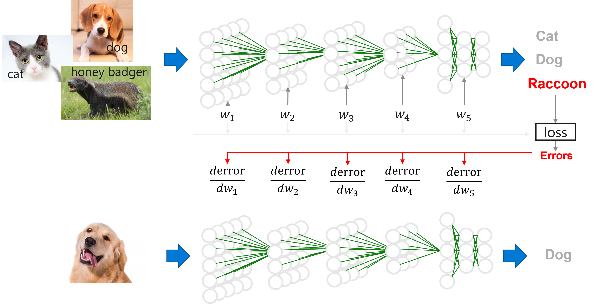

<!--Copyright © Microsoft Corporation. All rights reserved.
  适用于[License](https://github.com/YanjieGao/AI-System/blob/main/LICENSE)版权许可-->

# 1.1 深度学习的历史，现状与发展

本章将介绍深度学习的由来，现状和趋势，让读者能够了解系统之上的深度学习负载的由来与趋势，为后面理解深度学习系统的设计和权衡形成初步的基础。

- [1.1 深度学习的历史，现状与发展](#11-深度学习的历史现状与发展)
  - [1.1.1 深度学习正在改变世界](#111-深度学习正在改变世界)
  - [1.1.2 深度学习方法](#112-深度学习方法)
  - [1.1.3 神经网络的基本理论在深度学习前已基本奠定](#113-神经网络的基本理论在深度学习前已基本奠定)
  - [1.1.4 深度学习模型现状和趋势](#114-深度学习模型现状和趋势)
  - [参考文献](#参考文献)

## 1.1.1 深度学习正在改变世界

人工智能起源于上世纪五十年代，经历了几次繁荣与低谷。直到2016年谷歌所收购的DeepMind公司的AlphaGo赢得与世界围棋冠军的比赛，大众对人工智能的热情被重新点燃。

人工智能逐渐在互联网，安防、医疗、金融等不同领域有大范围的应用。人工智能并不是一个独立的技术，而是结合各个行业的多样性与大规模的数据储备，通过数据驱动的方式应用到各个具体任务（例如，人脸识别，物体检测等）中的一系列技术。

图1-1-1. 深度学习正改变世界 

在以下为例的行业中已经有越来越多的任务使用人工智能技术提升效果：

- 互联网 
  - 谷歌、百度、微软Bing等公司通过人工智能技术进行更好的文本向量化，提升检索质量，同时人工智能进行点击率预测，获取更高的利润。
- 医疗 
  - IBM Watson从海量的医学文献和病历中提取医生临床诊断经验，通过让人工智能模型学习掌握临床诊断方法，辅助医生进行诊断。
- 安防
  - 通过人脸识别，物体检测等技术，可以提升传统安防场景的检测精度。
- 自动驾驶
  - 通过人工智能能够进行更好的路标检测，道路线检测进而增强自动驾驶方案。
- 游戏
  - 在游戏中我们可以通过增加学习技术进行对战，设计新的策略，提升游戏体验。

我们在媒体中经常看到词汇，人工智能，机器学习和深度学习，那么他们之间的关系是什么？我们可以认为机器学习是实现人工智能的一种方法，而深度学习是一种实现机器学习的技术。我们在之后的内容中主要介绍的是围绕深度学习而衍生和设计的系统，因为深度学习目前是人工智能中应用最为广泛，前沿，系统设计挑战最大的方向。我们在之后也会穿插使用人工智能泛指深度学习。

## 1.1.2 深度学习方法 

图1-1-1. 深度学习方法 

## 1.1.3 神经网络的基本理论在深度学习前已基本奠定

图1-1-2. 神经网络的基本理论与发展

神经网络作为深度学习的前身，经历了以下的发展阶段：

1943年，神经科学家和控制论专家Warren McCulloch和逻辑学家Walter Pitts基于数学和阈值逻辑算法创造了一种神经网络计算模型。 

1957年，Frank Rosenblat发明感知机(Perception)。奠定了之后深度学习的基本结构，其计算以矩阵乘加运算为主，进而影响了后续芯片和系统的设计。

1960年，Widrow和Hoff发明了Adaline/Madaline,首次尝试把线性层叠加整合为多层感知器网络。为之后的多层深度学习的网络结构奠定了基础，进而后期不断衍生更深层的模型，产生大模型和模型并行等系统问题。

1969年，Marvin Minsky和Seymour Papert发现了神经网络的两个重大缺陷：第一，基本感知机无法处理异或回路。第二，当时计算机的计算能力不足以用来处理复杂神经网络。神经网络的研究就此停滞不前。这也为后来深度学习的两大驱动力，算力和模型增加非线性能力的演进埋下了伏笔。

1974年，Paul Werbos在博士论文中提出了用误差反向传播来训练人工神经网络，有效解决了异或回路问题，使得训练多层神经网络成为可能。这个工作奠定了之后深度学习的训练方式，深度学习训练系统中最为重要的执行步骤就是在不断的进行反向传播训练。

20世纪80年代，符号学习的代表方法是决策树和基于逻辑的学习。

1989年，Yann LeCun提出了一种用反向传导进行更新的卷积神经网络，称为LeNet$^{[1]}$。启发了后续卷积神经网络的研究与发展，卷积神经网络为深度学习系统的重要负载，大多数的深度学习系统都需要在卷积神经网络上验证性能。

20世纪90年代中期统计学习登场，支持向量机开始成为主流，进入第二个低估。

2006年Hinton发明深度置信网络，第一次提出深度学习概念。

2012年Hinton团队赢得ImageNet竞赛，深度神经网络开始再次流行。首次采用ReLU激活函数，扩展了LeNet5结构，添加Dropout层减小过拟合，LRN层增强泛化能力/减小过拟合，这些新的模型结构和训练方法深刻影响着后续的模型设计和系统优化。采用GPU对计算进行加速，进而形成深度学习系统以GPU等加速器为主要计算单元的架构。

ImageNet驱动着卷积神经网络的模型结构发展，使得网络越来越深，新结构层出不穷，进而不断驱动深度学习系统的演化，关注模型结构的变化，能够让系统研究者和工程师把握系统发展的未来趋势，并设计出符合潮流和应对未来变化的系统。

## 1.1.4 深度学习模型现状和趋势

目前深度学习模型有很多种类并在每年不断推出新的模型，我们将其简要归为以下一些代表性的类型。这些代表性的网络结构也是未来人工智能系统进行评测和验证所广泛使用的基准。同时一些新的结构的涌现，也不断推进一些新的系统设计。

基本模型结构：
- 卷积神经网络
  - 以卷积层(Convolution)，池化层(Pool)，全连接层(Fully Connected)的组合形成的在计算机视觉领域取得明显效果的模型结构。
- 循环神经网络
  - 以循环神经元(RNN)，长短时记忆（LSTM）等基本单元组合形成的适合时序数据预测的模型结构。
- 混合结构
  - 组合之前卷积神经网络，进而解决如光学字符识别等复杂的预测任务。

深度学习模型的趋势与发展：
- 更大的模型
  - 以Transformer为基本结构的代表性预训练模型，例如，BERT，GPT-3等，其不断增加的层数和参数量，对底层系统和硬件设计提出了很大的挑战。
- 更灵活的结构和建模能力
  - 图神经网络等网络不断捕捉多样的数据结构，应对更为复杂的建模需求。进而衍生了新的算子与计算框架。
- 更多样的训练方式
  - 自动化机器学习为代表的训练方式，衍生出多作业执行与优化的系统需求。
  - 增强学习为代表的训练方式，衍生出训练，推理，数据处理混合部署与协同优化的系统需求。
  - Mixture of experts (MoE)为代表的融合异构模型的训练方式，衍生出新的系统的开发灵活性与协同优化的挑战。

## 参考文献

[1] LeCun, Y.; Boser, B.; Denker, J. S.; Henderson, D.; Howard, R. E.; Hubbard, W. & Jackel, L. D. (1989). Backpropagation applied to handwritten zip code recognition. Neural Computation, 1(4):541-551.