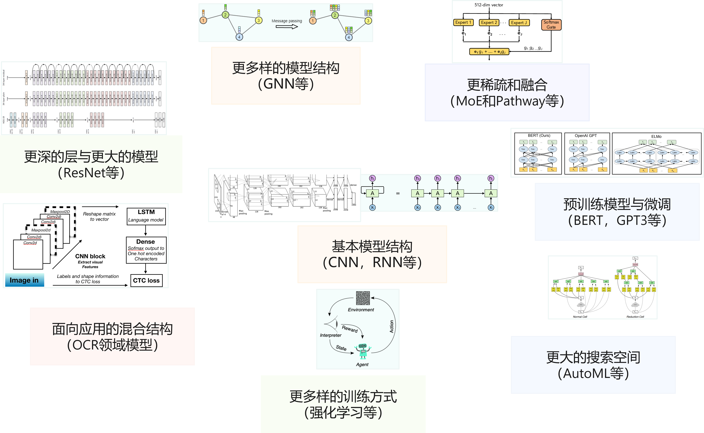

<!--Copyright © Microsoft Corporation. All rights reserved.
  适用于[License](https://github.com/microsoft/AI-System/blob/main/LICENSE)版权许可-->

# 1.1 深度学习的历史，现状与发展

本章将介绍深度学习的由来，现状和趋势，让读者能够了解系统之上的深度学习负载的由来与趋势，为后面理解深度学习系统的设计和权衡形成初步的基础。我们在后面章节介绍的人工智能系统主要是深度学习系统，但是这些系统设计原则大部分也适合于机器学习系统。系统本身是随着上层应用的发展而不断演化的，我们从人工智能和深度学习本身的发展脉络和趋势可以观察到：目前模型不断由小模型到大模型分布式训练，由单模型到自动化机器学习批量超参数搜索，由单一的模型训练方式到演化出针对特定应用的强化学习的训练方式，企业级人工智能模型生产由独占使用资源到组织多租共享资源进行模型训练，我们看到深度学习算法，模型结构本身的发展，训练与部署需求使得模型结构，执行与部署流程，资源管理变得越来越复杂，给系统设计和开发带来越来越大的挑战的同时，也充满了新的系统设计，研究与工程实践的机遇。希望在后面的章节中，不仅能给读者带来较为系统化的知识，也希望能激发读者对系统研究的兴趣，掌握相应的系统研究方法与设计原则，感知系统发展的趋势与脉络。

- [1.1 深度学习的历史，现状与发展](#11-深度学习的历史现状与发展)
  - [1.1.1 深度学习的广泛应用](#111-深度学习的广泛应用)
  - [1.1.2 深度学习方法](#112-深度学习方法)
  - [1.1.3 神经网络的基本理论在深度学习前已基本奠定](#113-神经网络的基本理论在深度学习前已基本奠定)
  - [1.1.4 深度学习算法，模型的现状和趋势](#114-深度学习算法模型的现状和趋势)
  - [小结与讨论](#小结与讨论)
  - [参考文献](#参考文献)

## 1.1.1 深度学习的广泛应用

人工智能起源于上世纪五十年代，经历了几次繁荣与低谷。直到2016年[DeepMind](https://www.deepmind.com/)公司的[AlphaGo](https://www.deepmind.com/research/highlighted-research/alphago)赢得与世界围棋冠军的比赛，大众对人工智能的关注与热情被重新点燃。其实人工智能技术早在这个标志事件之前已经在工业界很多互联网公司中得到了广泛应用与部署。例如，搜索引擎服务中的排序，图片的检索，广告推荐等功能，背后都有人工智能模型的支撑。

我们在媒体中经常看到词汇：人工智能，机器学习和深度学习，那么他们之间的关系是什么？我们可以认为机器学习是实现人工智能的一种方法，而深度学习是一种实现机器学习的技术。由于目前深度学习技术取得了突破性进展，是人工智能中最为前沿和重要的技术，并不断在广泛的应用场景内取代机器学习模型（例如，语音识别，推荐系统等），同时由于其本身系统设计挑战较高（例如，更大的规模，更大的超参数搜索空间，更复杂的模型结构设计），硬件厂商围绕其设计了大量的专有硬件（例如，GPU，TPU，NPU等）进行训练加速与部署推理，所以我们在之后的内容中主要介绍的是围绕深度学习而衍生和设计的系统，但是这些系统很多也可以应用于机器学习算法或使用机器学习算法，例如，自动化机器学习，集群管理系统等。同时这些系统设计方法具有一定的通用性，有些继承自机器学习系统（例如，参数服务器）或者可以借鉴用于机器学习系统（例如，自动化机器学习系统等）。我们在之后也会穿插使用人工智能，机器学习和深度学习的概念。

随着人工智能技术的发展与推广，人工智能逐渐在互联网，制造业，医疗、金融等不同领域有大范围的应用。人工智能并不是一个独立的技术，而是结合各个行业的多样性与大规模的数据储备，通过“数据驱动（Data-Driven）”的方式应用到各个具体任务（例如，人脸识别，物体检测等）中的一系列技术。
数据驱动的方式意味着人工智能本身依赖数据，所以最早取得人工智能技术大范围落地和应用的公司本身储备了大量且多样的应用场景中的数据。以下为例的行业中已经有越来越多的任务使用人工智能技术提升效果：

- 互联网 
  - 谷歌、百度、微软必应（Bing）等公司通过人工智能技术进行更好的文本向量化，提升检索质量，同时人工智能进行点击率预测，获取更高的利润。
- 医疗 
  - IBM 沃森（Watson）从海量的医学文献和病历中提取医生临床诊断经验，通过让人工智能模型学习掌握临床诊断方法，辅助医生进行诊断。
- 金融
  - 通过反欺诈，关联分析，时序预测等算法可以较早识别风险，并预测未来发展趋势。
- 自动驾驶
  - 通过物体检测模型能够进行更好的路标检测，道路线检测进而增强自动驾驶方案。
- 游戏
  - 在游戏中我们可以通过强化学习技术进行对战，设计新的策略，提升游戏体验。

综上所述，我们可以看到也是这些有应用与部署人工智能技术的公司较早的会在人工智能基础设施和系统上投入和研发，进而通过提升人工智能模型生产效率，更快的获取效果更好的模型进而获取领先优势，然后再通过业务场景反哺，获取更多的数据和加大研发投入，驱动人工智能系统与工具链的创新与发展。例如，人工智能的代表性框架PyTorch是Facebook开发，TensorFlow是谷歌（Google）开源，微软（Microsoft）等公司早已部署数以万计的GPU用于深度学习模型的训练，OpenAI等公司不断挑战更大规模的分布式模型训练，英伟达（Nvidia）等芯片公司不断根据深度学习模型特点设计新的加速器模块（例如张量核（Tensor Core））和提供更大算力的GPU加速器。

## 1.1.2 深度学习方法 

在展开后面的系统设计之前，我们需要首先了解深度学习的原理与特点。我们将以下面图中的实例介绍深度学习是如何工作的。我们假定读者有一定机器学习经验，其中的一些概念暂不在本章过多解释，我们会在第2章中介绍机器学习，神经网络与深度学习的原理，让读者对整体的执行流程有更加深入的理解。

图1-1-1. 深度学习方法 

如图1-1-1. 所示，我们将深度神经网络的开发与工作模式抽象为以下几个步骤：

- （1）确定深度学习模型的输入（特征）与输出（标签）数据（样本）：图中所示，本问题我们给深度学习模型输入图片（例如，图片中有狗，猫等），输出是图片的类别（是猫，是狗？）。用户需要提前准备好模型的输入输出数据，进而展开后续的模型训练。
- （2）设计与开发模型结构：开发者通过编程框架开发了图中图中的模型结构，绿色线代表权重与白色圆代表的输入数据发生乘法操作。其中的$w_n$代表权重，也就是可以被学习和不断更新的数值。
- （3）训练（Training）过程：训练过程是计算机根据一定的优化算法（例如，梯度下降（Gradient Descent）算法）搜索出给定数据集下，预测效果最好的指定深度学习模型中对应模型权重。如图中上半部分所示，训练过程就是根据用户给定的带有标签(例如，图中的Cat，Dog等输出标签)的数据集，不断通过梯度下降算法，以下面的步骤学习出给定数据集下最优的模型权重$w_n$的取值。
  - （3.1）前向传播（Forward Propagation）：由输入到输出完成整个模型中各个层的矩阵计算（例如，卷积层，池化层等），产生输出并完成损失函数计算。
  - （3.2）反向传播（Back Propagation）：由输出到输入反向完成整个模型中各个层的权重和输出对损失函数的梯度求解。
  - （3.3）梯度更新（Weight Update）：对模型权重通过梯度下降法完成模型权重针对梯度和指定学习率更新。
  - 不断重复以上步骤（3.1）~（3.2），直到达到模型收敛或达到终止条件（例如，指定的迭代次数）。

当完成了模型训练，意味着在给定的数据集上，模型已经达到最佳或者满足需求的预测效果。如果开发者对模型预测效果满意，就可以进入模型部署进行推理和使用模型。
- （4）推理（Inference）过程：推理（Inference）只需要执行训练过程中的前向传播过程即可。
  - 前向传播：如图中下半部分所示，由输入到输出完成整个模型中各个层的矩阵计算（例如，卷积层，池化层等），产生输出。例如本例中输入是狗的图片，输出的结果为向量，向量中的各个维度编码了图像的类别可能性，其中够的类别概率最大，判定为狗，后续应用可以根据输出类别信息再通过程序转换为人可读的信息。

后面章节将要介绍的深度学习系统，就是围绕以上负载的全生命周期的开发与执行各个环节，提供给算法工程师良好的模型设计和开发体验，极致的执行性能，保证安全性，以及应对更大规模的数据，更大的模型结构，更大的超参数搜索空间，多租的执行环境，同时利用新的加速器硬件特性，开掘硬件的极致算力。
  
## 1.1.3 神经网络的基本理论在深度学习前已基本奠定

图1-1-2. 神经网络的基本理论与发展 (图片引用自互联网)

虽然深度学习在今年取得了举世瞩目的进展与突破，但是其当前基于的核心理论神经网络等，在这波浪潮开始前已经基本奠定，并经历了多次的起起伏伏。神经网络作为深度学习的前身，经历了以下的发展阶段：

1943年，神经科学家和控制论专家Warren McCulloch和逻辑学家Walter Pitts基于数学和阈值逻辑算法创造了一种神经网络计算模型。并发表文章"A Logical Calculus of the ideas Imminent in Nervous Activity"。

1957年，Frank Rosenblat发明感知机(Perceptron)。奠定了之后深度学习的基本结构，其计算以矩阵乘加运算为主，进而影响了后续人工智能芯片和系统的基本算子类型，例如：英伟达的新款GPU就有为矩阵计算设计的专用张量核（Tensor Core）。

1960年，Widrow和Hoff发明了Adaline/Madaline，首次尝试把线性层叠加整合为多层感知器网络。感知器本质上是一种线性模型，可以对输入的训练集数据进行二分类，且能够在训练集中自动更新权值。感知器的提出吸引了大量科学家对人工神经网络研究的兴趣，对神经网络的发展具有里程碑式的意义。为之后的多层深度学习的网络结构奠定了基础，进而后期不断衍生更深层的模型，产生大模型和模型并行等系统问题。

1969年，Marvin Minsky和Seymour Papert共同编写了一本书籍《感知器》，在书中他们证明了单层感知器无法解决线性不可分问题（例如：异或问题）。发现了当时的神经网络的两个重大缺陷：第一，基本感知机无法处理异或回路。第二，当时计算机的计算能力不足以用来处理复杂神经网络。神经网络的研究就此停滞不前。这也为后来深度学习的两大驱动力，提升硬件算力和模型通过更多的层和非线性计算（激活函数和最大池化等）增加非线性能力的演进埋下了伏笔。

1974年，Paul Werbos在博士论文中提出了用误差反向传播来训练人工神经网络，使得训练多层神经网络成为可能，有效解决了异或回路问题。这个工作奠定了之后深度学习的训练方式，深度学习训练系统中最为重要的执行步骤就是在不断的进行反向传播训练。同时深度学习的编程语言和框架为了支持反向传播训练，默认都提供自动微分（Automatic Differentiation）的功能。

1986年，深度学习（Deep Learning）一词由Rina Dechter于1986 年引入机器学习社区。目前我们常常所说的人工智能系统主要以深度学习系统为代表性系统。

1989年，Yann LeCun提出了一种用反向传导进行更新的卷积神经网络，称为LeNet。启发了后续卷积神经网络的研究与发展。卷积神经网络为深度学习系统的重要负载，大多数的深度学习系统都需要在卷积神经网络上验证性能，我们在未来会看到很多深度学习系统的基准测试中也会引入大量的卷积神经网络。

20世纪90年代中期统计学习登场，支持向量机开始成为主流，进入第二个低谷。

2006年，Geoff Hinton、Ruslan Salakhutdinov、Osindero和Teh的论文表明，多层前馈神经网络可以一次有效地预训练一层，依次将每一层视为无监督受限的Boltzmann机，然后使用监督反向传播对其进行微调，其论文主要研究深度信念网络(Deep Belief Nets)的学习。

2012年，Alex Krizhevsky, Ilya Sutskever和Geoffrey Hinton，团队通过设计[AlexNet](https://papers.nips.cc/paper/2012/hash/c399862d3b9d6b76c8436e924a68c45b-Abstract.html)赢得ImageNet竞赛，深度神经网络开始再次流行。首次采用ReLU激活函数，扩展了LeNet5结构，添加Dropout层减小过拟合，LRN层增强泛化能力/减小过拟合。这些新的模型结构和训练方法影响着后续的模型设计和系统优化，例如：激活函数和卷积层的内核融合计算等。采用GPU对计算进行加速，进而形成深度学习系统以GPU等加速器为主要计算单元的架构。

在之后的时间里，以[ImageNet](https://www.image-net.org/)，等公开的各领域（例如，计算机视觉，自然语言处理）数据集为代表，驱动着以卷积神经网络，循环神经网络，Transformer，图神经网络为代表的网络结构和其他的深度学习模型结构发展。

同时，我们在当前的社区工作中可以观察到，深度学习模型网络结构越来越深，新结构层出不穷，同时不断驱动深度学习系统的演化。

关注模型结构和深度学习的应用场景变化，能够让系统研究者和工程师把握系统发展的趋势，并设计出符合潮流和应对未来变化的系统。

## 1.1.4 深度学习算法，模型的现状和趋势

目前深度学习模型有很多种类并在每年不断推出新的模型，我们将其简要归为以下一些代表性的类型。这些代表性的网络结构也是未来人工智能系统进行评测和验证所广泛使用的基准。同时一些新的结构的涌现，也不断推进一些新的系统设计。

图1-1-3. 深度学习算法，模型的演化与趋势

基本模型结构：
- 卷积神经网络（Convolutional Neural Network）
  - 以卷积层（Convolution Layer），池化层(Pooling Layer)，全连接层(Fully Connected Layer)的组合形成的在计算机视觉领域取得明显效果的模型结构。
- 循环神经网络（Recurrent Neural Network）
  - 以循环神经网络（RNN），长短时记忆（LSTM）等基本单元组合形成的适合时序数据预测的模型结构。
- 混合结构
  - 组合之前卷积神经网络和循环神经网络，进而解决如光学字符识别（OCR）等复杂的预测任务。

基础模型的典型算子已经被框架和底层硬件做了较多优化，但是深度学习模型已经不单纯只使用上面的单一算子，演化出更多的需求。

深度学习模型从算法层面的趋势与发展：
- 更大的模型
  - 以Transformer为基本结构的代表性预训练语言模型，例如，BERT，GPT-3等，在自然语言处理和计算机视觉等场景应用越来越广泛。其不断增加的层数和参数量，对底层系统和硬件设计提出了很大的挑战。
- 更灵活的结构和建模能力
  - 图神经网络等网络不断抽象多样且灵活的数据结构（例如：图（Graph），树（Tree）等），应对更为复杂的建模需求。进而衍生了新的算子（例如：图卷积等）与计算框架（例如：图神经网络框架等）。
- 更稀疏的模型结构与模型融合（Model Ensemble）
  - 以多专家模型（Mixture of Experts）和Pathway模型结构为代表的模型融合结构让运行时的系统执行模型更加动态（Dynamic）和稀疏（Sparse），给系统设计静态分析带来了不小的挑战，同时驱动运行时更加高效的调度与优化。
- 更大规模的搜索空间
  - 用户定义更大规模的超参数与模型结构搜索空间，通过超参数搜索与神经网络结构搜索自动化找到最优的模型结构。自动化机器学习为代表的训练方式，衍生出多作业执行与多作业（Multi-Jobs）编排优化的系统需求。
- 更稀疏和融合的结构
  - 以多专家模型和Pathway为代表的模型通过稀疏性和模型融合提升模型的训练效率减少训练代价，支持更多的任务。多专家模型(Mixture of experts)为代表的融合异构模型的训练方式，衍生出新的系统的开发灵活性与协同优化的挑战。
- 更多样的训练方式
  - 强化学习（Reinforcement Learning）为代表的算法有比传统训练方式更为复杂的过程。其衍生出训练，推理，数据处理混合部署与协同优化的系统需求。

开发者一般通过深度学习框架（Framework）书写和描述以上深度学习模型，启动训练作业和部署模型，其中以[PyTorch](https://pytorch.org/)和[TensorFlow](https://www.tensorflow.org/)等代表性框架用户较大。但是这些框架应对自动化机器学习，强化学习等多样执行方式，以及细分的应用场景显得越来越不够灵活。所以目前开源社区中也不断涌现针对特定应用领域而设计的框架和工具，例如，[Hugging Face](https://huggingface.co/)语言预训练模型动物园（Model Zoo）和库，[FairSeq](https://github.com/pytorch/fairseq)自然语言处理中的序列到序列模型，[MMDetection](https://github.com/open-mmlab/mmdetection)物体检测库，[Tutel](https://github.com/microsoft/tutel) MoE模型分布式训练裤等，针对特定领域负载进行设计和性能优化，并提供更简化的接口和应用体验。这其中快速获取用户的原因有一些是其提供了针对应用场景非常简化的模型操作，并提供模型中心快速微调相应的模型，有一些是因为其能支持大规模模型训练或者有特定领域模型结构的系统优化。所以我们可以看到，系统设计本身是一个木桶效应，需要各个环节都需要考虑到，无论是系统性能，还是用户体验，亦或是稳定性等指标，甚至在开源如火如荼发展的今天，开源社区运营也成为系统推广本身不可忽视的环节。

## 小结与讨论

本章我们主要围绕深度学习的历史现状和发展展开，对系统研究，我们需要要深刻理解上层计算负载特点，历史和趋势，才能将找到系统设计的真实需求和优化机会。

请读者思考当前模型之间有何差异，对系统的要求会有什么挑战？

## 参考文献

- Warren S. McCulloch and Walter Pitts. A logical calculus of the ideas immanent in nervous activity. Bulletin of mathematical biophysics, vol. 5 (1943), pp. 115–133.
- Rosenblatt, Frank (1957). "The Perceptron—a perceiving and recognizing automaton". Report 85-460-1. Cornell Aeronautical Laboratory.
- LeCun, Y.; Boser, B.; Denker, J. S.; Henderson, D.; Howard, R. E.; Hubbard, W. & Jackel, L. D. (1989). Backpropagation applied to handwritten zip code recognition. Neural Computation, 1(4):541-551.
- Rina Dechter (1986). Learning while searching in constraint-satisfaction problems. University of California, Computer Science Department, Cognitive Systems Laboratory.Online Archived 2016-04-19 at the Wayback Machine
- LeCun, Y.; Boser, B.; Denker, J. S.; Henderson, D.; Howard, R. E.; Hubbard, W.; Jackel, L. D. (December 1989). "Backpropagation Applied to Handwritten Zip Code Recognition". Neural Computation. 1 (4): 541–551. doi:10.1162/neco.1989.1.4.541. ISSN 0899-7667. S2CID 41312633
- Widrow, B., & Lehr, M.A. (1993). ARTIFICIAL NEURAL NETWORKS OF THE PERCEPTRON, MADALINE, AND BACKPROPAGATION FAMILY.
- Hinton, G. E.; Osindero, S.; Teh, Y. W. (2006). "A Fast Learning Algorithm for Deep Belief Nets" (PDF). Neural Computation. 18 (7): 1527–1554. doi:10.1162/neco.2006.18.7.1527. 
- Alex Krizhevsky, Ilya Sutskever, and Geoffrey E. Hinton. 2012. ImageNet classification with deep convolutional neural networks. In Proceedings of the 25th International Conference on Neural Information Processing Systems - Volume 1 (NIPS'12). Curran Associates Inc., Red Hook, NY, USA, 1097–1105.

