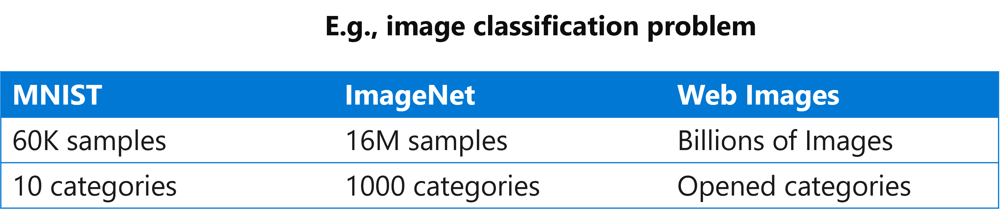
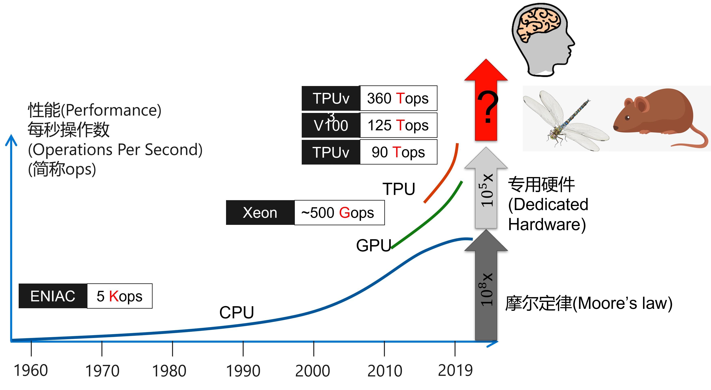
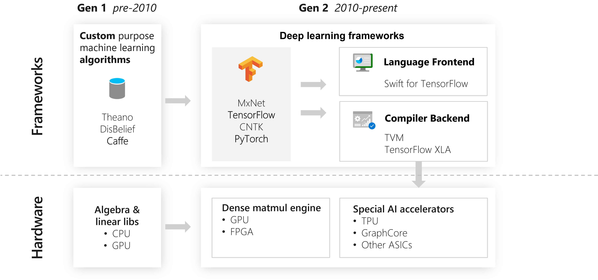
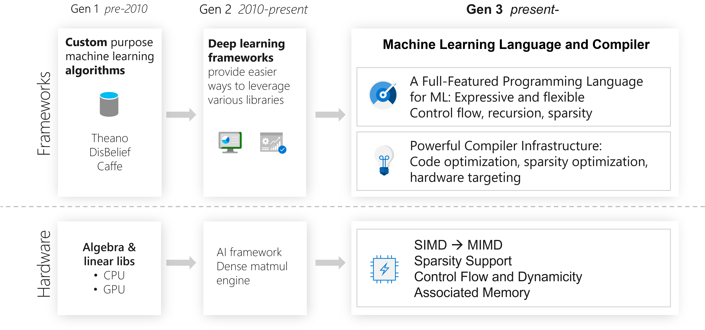

<!--Copyright © Microsoft Corporation. All rights reserved.
  适用于[License](https://github.com/YanjieGao/AI-System/blob/main/LICENSE)版权许可-->

# 1.2 算法，框架，体系结构与算力的进步

催生这轮人工智能热潮的原因有三个重要因素：大数据的积累、超大规模的计算能力支撑、机器学习尤其是深度学习算法都取得了突破性进展。
本小节将围绕以下内容进行介绍：
- [1.2 算法，框架，体系结构与算力的进步](#12-算法框架体系结构与算力的进步)
  - [1.2.1 大数据和分布式系统](#121-大数据和分布式系统)
  - [1.2.2 深度学习算法的进步](#122-深度学习算法的进步)
    - [1. MNIST数据集上深度学习超越机器学习算法](#1-mnist数据集上深度学习超越机器学习算法)
    - [2. IMAGENET数据集上深度学习取得不断的突破](#2-imagenet数据集上深度学习取得不断的突破)
    - [3. 其他领域算法的进步](#3-其他领域算法的进步)
  - [1.2.3 计算机体系结构和计算能力的进步](#123-计算机体系结构和计算能力的进步)
  - [1.2.4 计算框架的进步](#124-计算框架的进步)
  - [参考文献](#参考文献)

## 1.2.1 大数据和分布式系统

互联网服务和大数据平台给深度学习带来了大量的数据集。
- 搜索引擎 (Search Engine)
  - 图像检索(Image search): ImageNet, Coco
  - 文本检索(Text search): Wikipedia, Natural language datasets
- 商业网站
  - Amazon, Taobao: recommendation data sets, ads data sets
- 其他互联网服务(Internet services)
  - Conversational services: XiaoIce, Siri, Cortana

互联网公司有海量的用户，这些用户不断使用互联网服务，并沉淀相应的用户数据。这些数据随着时间的流逝和新业务功能的推出，数据量越来越大，数据模式越来越丰富。所以互联网公司较早的开发和部署了的大数据管理与处理平台。基于这些海量数据，互联网公司通过数据驱动的方式，训练人工智能模型 ，进而优化和提升业务用户体验（例如，点击率预测让用户获取感兴趣的信息），让更多的用户使用服务，进而形成循环。相较于学术界，互联网公司作为工业界的代表，将深度学习的发展推到了更加实用，落地的阶段。以图中为例，同样是图像分类问题，

图1-2-1. 不同图像分类问题数据集的数据量

这些海量的数据集为深度学习系统的发展产生了以下的影响：
- 推动深度学习算法不断在指定任务上产生更高的准确度与更低的误差。让深度学习有更广泛的应用。这样产生了针对深度学习的系统与ASIC的用户基础。
- 海量的数据集让单机越来越难以完成深度学习模型的训练，进而产生了分布式训练和平台的需求，让传统的机器学习库不能满足相应的需求。
- 多样的数据格式和任务，产生了模型结构的复杂性，驱动框架或针对深度学习的程序语言需要有更灵活的表达能力。 

综上所述，深度学习系统本身的设计相较于传统机器学习库有更多样的表达需求，更大规模的数据集和更广泛的用户基础。 

## 1.2.2 深度学习算法的进步

### 1. MNIST数据集上深度学习超越机器学习算法

[MNIST](http://yann.lecun.com/exdb/mnist/)手写数字识别数据库。MNIST 数据库是一个大型手写数字数据库，通常用于训练各种图像处理系统。该数据库还广泛用于机器学习领域的训练和测试。 

我们可以观察下图，观察不同的机器学习算法取得的效果。

图1-2-1. MNIST数据集上各算法的Test Error (%)

从图中可以观察到：

1998年，一个简单的卷积神经网络可以取得和SVM取得的最好效果相同。

2012年，一个深度卷积神经网络可以将错误率降低到0.23% (2012), 这样的结果已经可以和人所达到的错误率0.2%非常接近。

在MNIST数据集上的表现，让研究者们看到了深度学习的潜力，进而不断尝试新的深度学习模型和更复杂的问题挑战。

### 2. IMAGENET数据集上深度学习取得不断的突破

随着每年ImageNet数据集上的新模型取得突破，我们看到新的深度学习模型结构和训练方式被研究者和工程师设计出来。

图1-2-1. 深度学习在IMAGENET数据集上的效果不断取得突破

我们可以观察到，新的模型不断在以下方面演化：
- 更好的激活函数和结构: ReLU, BatchNormalization等。
- 更复杂的网络和更多模型参数。 
- 更好的训练方法: Regularization, Initialization, Learning methods等。

这些新的变化，取得更好的效果驱动者算法工程师与研究员不断投入设计新的模型，同时也要求深度学习系统不断提供新的操作符支持，训练算法支持。

### 3. 其他领域算法的进步

除了我们看到的计算机视觉，深度学习在多个领域也取得了不俗的表现，并在当年取得超越原有方案的里程碑式的效果，后续方案不断在深度学习的方法上取得新的突破。

例如： 
- 计算机视觉领域
  - 例如：2015年, ImageNet数据集上MSRA研发的Resnet取得了5项第一，并又一次刷新了CNN模型在ImageNet上的历史。
  
- 自然语言处理领域
  - 例如：2019年,在斯坦福大学举办的SQuAD （Stanford Question Answering Dataset）和 CoQA（Conversational Question Answering）挑战赛中，MSRA的NLP团队通过多阶段(Multistage)，多任务(Multitask)学习的方式取得第一。

- 语音识别领域
  - 例如：2016年，MSR提出的Combined模型系统的在NIST 2000数据集上错误率为6.2%，超越之前报告的基准测试结果。

- 增强学习领域
  - 2016年, Google DeepMind研发的AlphaGo在围棋比赛中以4:1的高分击败了世界大师级冠军李世石。OpenAI 训练出了名为 OpenAI Five 的 Dota 2 游戏智能体。2019 年 4 月，OpenAI Five 击败了一支 Dota 2 世界冠军战队，这是首个击败电子竞技游戏世界冠军的人工智能系统。

## 1.2.3 计算机体系结构和计算能力的进步

图1-2-1. 计算机体系结构和计算能力的进步

从1960年以来，计算机性能的增长主要来自摩尔定律，到二十世纪初大概增长了10的8次方倍。
但是由于摩尔定律的停滞，性能的增长逐渐放缓了。单纯靠工艺尺寸的进步，无法满足各种应用对性能的要求。

于是，人们就开始为应用定制硬件，通过消除通用处理器中冗余的部分，来进一步提高对特定应用的计算性能。
比如，图形图像处理器，GPU就对图像类算法做专用加速。后来出现GPGPU，也就是通用GPU，对适合于单指令多数据的高并行算法都能起到不错的加速效果。

为了更高的性能，这些年人工智能芯片也大行其道。其中一个代表就是TPU。通过对矩阵乘法定制硬件，进一步提高了性能。通过定制化硬件，我们又将处理器性能提升了大约10的5次方量级。

然而可惜的是，经过这么多年的发展，处理器性能提升这么多。尽管我们机器的数值运算能力早已是人类望尘莫及了，里面的程序仍然是人类指定的固定代码，智能程度还远远不及生物大脑。从智力程度来说，大约也就只相当于啮齿动物，距离人类还有一定距离。

我们可以看到随着硬件的发展，虽然算力逐渐逼近人脑，让深度学习取得了突破。同时我么也看到，计算力也可能在短期内成为瓶颈，那么人工智能系统的性能下一代的出路在哪？

所以我们在后面会看到，除了单独芯片的不断迭代，系统工程师不断设计更好的分布式计算系统将计算并行开来，同时发掘深度学习的作业特点，如稀疏性等提升计算效率和性能。

## 1.2.4 计算框架的进步

计算框架对用户提供编程接口，隐藏硬件细节，同时将用户书写的深度学习程序进行编译优化并部署在专用硬件上进行执行。属于深度学习系统中的核心。我们观察到，深度学习框架大致经过以下的发展脉络。

**第一代框架**：

以Caffe为代表的第一代框架，其编程范式为通过配置文件进行模型构建，框架将模型翻译成粗粒度的算子（例如，卷积层，池化层），并调用底层硬件提供的优化算子库（如cuDNN，CUDA）等进行高效执行。其特点是简单构建方便，但是灵活性不足，用户容易写出错误的程序，同时底层优化依赖硬件厂商库，对运行时调度框架没有过多优化机会。

**第二代框架**：

以TenorFlow和PyTorch为代表的第二代框架，目前是有最为广泛的应用。其中我们可以将框架按照编程范式分类两类：

- 声明式编程(Declarative programming)
  - 代表性框架：TensorFlow, CNTK, Caffe2
  - 特点：框架提供计算图优化，让用户无需关心底层优化细节，但是对用户来说不容易调试

- 命令式编程(Imperative programming）
  - 代表性框架：PyTorch, Chainer, DyNet
  - 特点：由于是No graph optimization，但是由于其简单易用，灵活性高，在模型研究人员中也有很高的用户基础

同时我们也看到第二代框架以Python语言作为前端语言，并结合使用Numpy, Scipy等数据处理库构建深度学习的程序，但是除深度学习框架之外的库无法利用GPU等专有硬件。同时Python语言其特点是简单，但是不利于优化与错误检测。由于性能，并发，部署和跨语言调用等问题在不断演化的深度学习研究与工程化对性能和稳定性越来越极致要求的趋势下捉襟见肘。目前也有趋势是提供静态语言前端（例如，Swift等），后端提供编译器（例如，TVM,TensorFlow XLA等）进行优化尝试规避当前框架已有的问题。

**第三代框架**:

我们除了设计框架解决当前的问题，还应该思考和设计下一代的框架支持未来的模型趋势。

- 框架应在有更加全面功能的编程语言前端下构建，并提供灵活性和表达力，例如：控制流的支持，递归和稀疏性的原生表达与支持。这样才能应对大的（Large）、动态（Dynamic）的和自我修改（Self-Modifying）的深度学习模型趋势。我们不知道深度学习模型在多年后会是什么样子，但从现在的趋势看，很明显它们将会更大、更稀疏、结构更松散。下一代框架应该支持像注意力（Attention）模型这样的动态模型，像预训练模型或专家混合模型这样的大型模型，以及需要与真实或模拟环境频繁交互的强化学习模型。

 

图1-2-2. 第一代框架到第二代框架的进步

- 框架同时应该不断跟进并提供针对多样且新的硬件特性下的编译优化与运行时调度的优化支持。例如：SIMD (单指令流多数据流)到MIMD（多指令流多数据流）的支持，稀疏性的优化，分布式计算。这样才能应对张量计算单元、稀疏性和混合精度支持，SoW（System on Wafer）和大规模训练集群等专有硬件趋势。
  

图1-2-3. 第二代框架到第三代框架的发展趋势

## 参考文献

- Yangqing Jia, Evan Shelhamer, Jeff Donahue, Sergey Karayev, Jonathan Long, Ross Girshick, Sergio Guadarrama, and Trevor Darrell. 2014. Caffe: Convolutional Architecture for Fast Feature Embedding. In <i>Proceedings of the 22nd ACM international conference on Multimedia</i> (<i>MM '14</i>). Association for Computing Machinery, New York, NY, USA, 675–678. DOI:https://doi.org/10.1145/2647868.2654889
- Martín Abadi, Ashish Agarwal, Paul Barham, Eugene Brevdo,
Zhifeng Chen, Craig Citro, Greg S. Corrado, Andy Davis,
Jeffrey Dean, Matthieu Devin, Sanjay Ghemawat, Ian Goodfellow,
Andrew Harp, Geoffrey Irving, Michael Isard, Rafal Jozefowicz, Yangqing Jia,
Lukasz Kaiser, Manjunath Kudlur, Josh Levenberg, Dan Mané, Mike Schuster,
Rajat Monga, Sherry Moore, Derek Murray, Chris Olah, Jonathon Shlens,
Benoit Steiner, Ilya Sutskever, Kunal Talwar, Paul Tucker,
Vincent Vanhoucke, Vijay Vasudevan, Fernanda Viégas,
Oriol Vinyals, Pete Warden, Martin Wattenberg, Martin Wicke,
Yuan Yu, and Xiaoqiang Zheng.
TensorFlow: Large-scale machine learning on heterogeneous systems, 2015. Software available from tensorflow.org.
- Paszke, A., Gross, S., Massa, F., Lerer, A., Bradbury, J., Chanan, G., Killeen, T., Lin, Z., Gimelshein, N., Antiga, L., Desmaison, A., Köpf, A., Yang, E., DeVito, Z., Raison, M., Tejani, A., Chilamkurthy, S., Steiner, B., Fang, L., Bai, J., & Chintala, S. (2019). PyTorch: An Imperative Style, High-Performance Deep Learning Library. ArXiv, abs/1912.01703.
- Norman P. Jouppi, Cliff Young, Nishant Patil, David Patterson, Gaurav Agrawal, Raminder Bajwa, Sarah Bates, Suresh Bhatia, Nan Boden, Al Borchers, Rick Boyle, Pierre-luc Cantin, Clifford Chao, Chris Clark, Jeremy Coriell, Mike Daley, Matt Dau, Jeffrey Dean, Ben Gelb, Tara Vazir Ghaemmaghami, Rajendra Gottipati, William Gulland, Robert Hagmann, C. Richard Ho, Doug Hogberg, John Hu, Robert Hundt, Dan Hurt, Julian Ibarz, Aaron Jaffey, Alek Jaworski, Alexander Kaplan, Harshit Khaitan, Daniel Killebrew, Andy Koch, Naveen Kumar, Steve Lacy, James Laudon, James Law, Diemthu Le, Chris Leary, Zhuyuan Liu, Kyle Lucke, Alan Lundin, Gordon MacKean, Adriana Maggiore, Maire Mahony, Kieran Miller, Rahul Nagarajan, Ravi Narayanaswami, Ray Ni, Kathy Nix, Thomas Norrie, Mark Omernick, Narayana Penukonda, Andy Phelps, Jonathan Ross, Matt Ross, Amir Salek, Emad Samadiani, Chris Severn, Gregory Sizikov, Matthew Snelham, Jed Souter, Dan Steinberg, Andy Swing, Mercedes Tan, Gregory Thorson, Bo Tian, Horia Toma, Erick Tuttle, Vijay Vasudevan, Richard Walter, Walter Wang, Eric Wilcox, and Doe Hyun Yoon. 2017. In-Datacenter Performance Analysis of a Tensor Processing Unit. In <i>Proceedings of the 44th Annual International Symposium on Computer Architecture</i> (<i>ISCA '17</i>). Association for Computing Machinery, New York, NY, USA, 1–12. DOI:https://doi.org/10.1145/3079856.3080246
- https://github.com/BradLarson/swift/blob/main/docs/WhySwiftForTensorFlow.md

