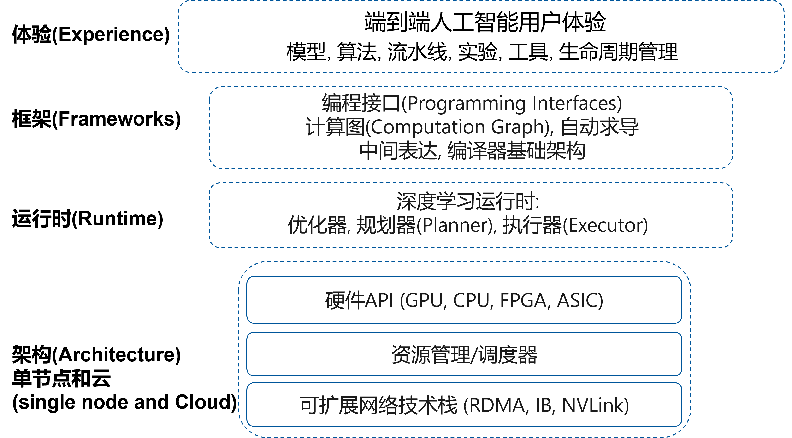
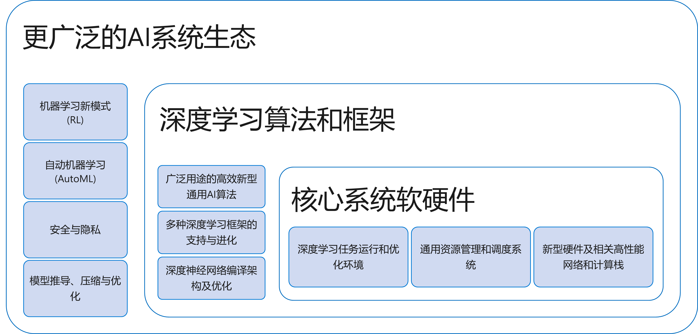

<!--Copyright © Microsoft Corporation. All rights reserved.
  适用于[License](https://github.com/YanjieGao/AI-System/blob/main/LICENSE)版权许可-->

# 1.3 深度学习系统组成与生态

通过之前深度学习的发展介绍，以及模型，硬件与框架的趋势介绍，我们已经了解了深度学习系统的重要性。那么本章将介绍深度学习系统的设计目标和组成，让读者形成系统化的视角，为后续展开每个章节的内容做好铺垫。

- [1.3 深度学习系统组成与生态](#13-深度学习系统组成与生态)
  - [1.3.1 深度学习系统的目的](#131-深度学习系统的目的)
  - [1.3.2 深度学习系统的大致组成](#132-深度学习系统的大致组成)
  - [1.3.3 深度学习系统生态](#133-深度学习系统生态)
  - [参考文献](#参考文献)

## 1.3.1 深度学习系统的目的

深度学习系统的设计目标我们可以总结为以下几个部分。

- 提供更加高效的编程语言、框架和工具
  - 设计更具表达能力和简洁的神经网络计算原语和编程语言。让用户能够提升开发效率，屏蔽底层细节，更灵活的原语支持。
  - 更直观的编辑、调试和实验工具。让用户可以完整的开发，测试，调整诊断与修复和优化程序，提升所开发深度学习程序的性能与鲁棒性。
  - 整个深度学习生命周期中的系统问题：模型压缩、推理、安全、隐私保护等。不仅能构建深度学习模型，能够支持全生命周期的深度学习程序开发，并在系统内对全生命周期进行分析与优化。
- 提供全面多样的的深度学习任务的系统支持：
  - 除了传统的深度学习训练与推理的支持，还能支持强化学习、自动机器学习等新的训练范式。
  - 提供更强大和可扩展的计算能力。让用户的深度学习程序可扩展并部署于可以并行计算的节点或者集群，应对大数据和大模型的挑战。
  - 自动编译优化算法，包括不限于：
    - 自动推导计算图
    - 根据不同体系结构自动并行化
    - 自动分布式化，并扩展到多个计算节点
    - 持续优化
- 探索并解决新挑战下的系统设计、实现和演化的问题。例如：动态性，稀疏性，混合精度，混合训练范式，多任务等。

## 1.3.2 深度学习系统的大致组成

一般的深度学习系统我们大致可以分为以下部分：

- 开发体验。负责提供用户前端的编程语言，接口和工具链。包括并不限于以下领域：
  - 模型构建：卷积，循环神经网络，控制流等基本结构实现。
  - 算法实现：同步与异步优化算法等。
  - 流水线和工作流支持：高性能数据加载器等。
  - 实验规划与配置：批量超参数调优与模型结构搜索等。
  - 工具链: 模型转换，调试，可视化，类型系统等。
  - 生命周期管理：数据读取，训练与推理等流程开发与管理。
- 框架。负责静态程序分析与计算图构建，编译优化等。包括并不限于以下领域：
  - 计算图构建：静态，动态计算图构建等。
  - 自动求导：高效与高精度自动求导等。
  - 中间表达构建：多层次中间表达等。
  - 编译优化：内核融合等。
- 运行时。负责系统的运行时的系统动态调度与优化。包括并不限于以下部分。
  - 优化器：运行时JIT优化，内省（introspective）优化等。
  - 调度器：算子并行与调度。
  - 执行器：线程池等。
- 资源管理与硬件体系结构。负责程序的执行，互联与加速。包括并不限于以下部分。
  - 硬件接口抽象：GPU, CPU，FPGA和ASIC等。
  - 资源池化管理与调度：异构资源集群管理等。
  - 可扩展的网络栈：RDMA，IB，NVLink等。
  

图1-3-1. 深度学习系统的大致组成

## 1.3.3 深度学习系统生态

除了以上重要的深度学习系统构成之外，随着人工智能应用越来越广泛，我们还可以看到更广泛的人工智能系统构成。这其中包含以下领域：

- 核心系统软硬件
  - 深度学习任务运行和优化环境：提供更高的运行时性能，资源隔离与调度。
  - 通用资源管理和调度系统：提供更公平，高效率和稳定的平台支持。
  - 新型硬件及相关高性能网络和计算栈：提供更高的算力与带宽支持模型训练与推理。
- 深度学习算法和框架
  - 广泛用途的高效新型通用AI算法：提供更多样的模型支持，推进和支持模型效果的提升。
  - 多种深度学习框架的支持与进化：提供更多样的框架的统一支持与优化。
  - 深度神经网络编译架构及优化：提供更优化的编译支持，提升模型的性能，正确性等。
- 更广泛的人工智能系统生态
  - 机器学习新模式 (RL)：提供新训练范式的灵活部署与同步支持等。
  - 自动机器学习(AutoML)：提供多任务的高效管理与调度支持，新的支持搜索空间定义的程序语言设计的支持等。
  - 安全与隐私：人工智能模型与应用的安全与隐私保护支持。
  - 模型推导、压缩与优化：基于深度学习特有性质进行模型的训练与部署性能提升。

图1-3-2. 深度学习系统生态

本书将在后续章节围绕更广泛的人工智能系统生态中的重要内容展开介绍。

## 参考文献
- https://github.com/microsoft/nnfusion
- https://github.com/microsoft/pai
- https://github.com/microsoft/MMdnn
- https://mlflow.org/
- https://relay.dev/
- https://www.tensorflow.org/tensorboard
- https://github.com/microsoft/nni
- https://docs.ray.io/en/latest/rllib.html