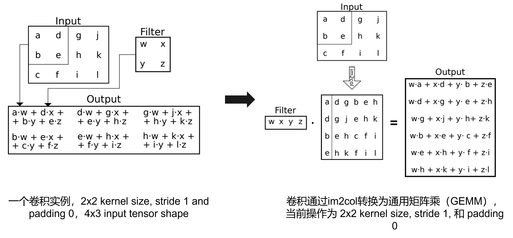

<!--Copyright © Microsoft Corporation. All rights reserved.
  适用于[License](https://github.com/microsoft/AI-System/blob/main/LICENSE)版权许可-->

# 1.4 深度学习样例背后的系统问题

算法工程师通过Python和框架书写人工智能程序，而人工智能程序底层的系统问题被当前层的抽象隐藏，到底在每个代码部分具体底层发生了什么？有哪些有意思的系统设计问题？我们将从一个实例启发读者，并和后面各个章节构建起桥梁与练习，给读者构建除目录之外的第二个内容索引。

- [1.4 深度学习样例背后的系统问题](#14-深度学习样例背后的系统问题)
  - [1.4.1 一个深度学习样例与其中的系统问题](#141-一个深度学习样例与其中的系统问题)
  - [1.4.2 隐藏在算子(Operator)实现中的系统问题](#142-隐藏在算子operator实现中的系统问题)
  - [1.4.3 更大范围的系统问题](#143-更大范围的系统问题)
  - [小结与讨论](#小结与讨论)
  - [参考文献](#参考文献)

## 1.4.1 一个深度学习样例与其中的系统问题

如下图所示，我们可以看到一个深度学习模型可以接受输入（例如，当前手写数字图片），产生输出（例如图中为数字分类），这个过程叫前向传播(Forward Propagation)，也叫做推理(Inference)。这其中图片经过深度学习模型的处理产生输出结果，这个过程我们一般称作推理(Inference)。那么如何得到一个针对当前已有的输入输出数据上，预测效果最好的模型呢？我们需要通过训练的过程，训练过程可以抽象为一个优化问题，优化目标为:
$$\theta = argmin_{\theta}\sum[Loss(f_{\theta}(x), y)]$$
其中的$f_{\theta}$代表深度学习模型，例如后面提到的LeNet，$Loss$代表损失函数，$x$代表数据中的输入也就是图像，$y$代表数据中的标签值，也就是输出，训练的过程就是找到最小化$Loss$的$\theta$取值，$\theta$也称作权重。在训练过程中将通过梯度下降算法进行求解，$\theta = \theta - \alpha \delta_{\theta}Loss(\theta)$，其中$\alpha$也叫学习率(Learning Rate)。当训练完成，就可以通过$\hat{y} = f_\theta(x)$进行推理，使用和部署模型。

<center></center>
<center>图1-5-1. 深度学习训练过程</center>


如下图所示，左上角的图示中展示的是输入为手写数字图像，输出为分类向量，中间的矩形为各层输出的特征图。我们可以看到深度学习模型就是通过各个层将输入图像处理为类别输出概率向量。用户一般经过两个阶段进行构建: (1)定义网络结构，例如图中和下面代码实例中构建的LeNet网络，其中包含有二维卷积(Conv2D)，最大池化(max_pool2d)，全连接(Linear)层。（2）开始训练，遍历一个批尺寸(Batch Size)数据，设置计算资源，前向传播计算，计算损失(Loss)。


<center></center>
<center>图1-5-2. PyTorch训练LeNet实例</center>

下面的实例是PyTorch在MNIST数据集上训练一个卷积神经网络[LeNet](http://yann.lecun.com/exdb/lenet/)的代码实例。

```
...
# 读者可以参考第3章理解深度学习框架的底层原理和设计
import torch
...

# 如果模型层数多，权重多到无法在单GPU显存放置，我们需要通过模型并行方式进行训练，读者可以参考第6章进行了解
class LeNet(nn.Module):
    def __init__(self):
        super(LeNet, self).__init__()
        # 请参考1.4.2小节，通过循环实现卷积理解卷积的执行逻辑并思考其中的潜在系统问题
        self.conv1 = nn.Conv2d(3, 6, 5)
        # 我们能否调整超参数6为64？如何高效的搜索最有的配置？这些内容我们将在第9章展开介绍
        self.conv2 = nn.Conv2d(6, 16, 5)
        self.fc1 = nn.Linear(16*5*5, 120)
        self.fc2 = nn.Linear(120, 84)
        self.fc2 = nn.Linear(84, 10)

    def forward(self, x):
        out = F.relu(self.conv1(x))
        out = F.max_pool2d(out, 2)
        out = F.relu(self.conv2(out))
        out = F.max_pool2d(out, 2)
        out = out.view(out.size(0), -1)
        out = F.relu(self.fc1(out))
        out = F.relu(self.fc2(out))
        out = self.fc3(out)
        return out


def train(args, model, device, train_loader, optimizer, epoch):
    # 如何进行高效的训练，运行时是如何执行的？我们将在第3章进行介绍
    model.train()
    for batch_idx, (data, target) in enumerate(train_loader):
        data, target = data.to(device), target.to(device)
        optimizer.zero_grad()
        output = model(data)
        loss = F.nll_loss(output, target)
        loss.backward()
        optimizer.step()
        ...


def test(model, device, test_loader):
    model.eval()
    ... 
    with torch.no_grad():
        for data, target in test_loader:
            data, target = data.to(device), target.to(device)
            # 推理系统如何高效进行模型推理？我们将在第8章进行介绍
            output = model(data)
            ...


def main():
    ...
    # 当前语句决定了使用哪种加速器以及体系结构，读者可以通过第4章了解。
    device = torch.device("cuda" if use_cuda else "cpu")
    # 如果batch size过大，造成单GPU内存无法容纳模型及中间激活的张量，读者可以参考第6章进行了解如何分布式训练
    train_kwargs = {'batch_size': args.batch_size}
    test_kwargs = {'batch_size': args.test_batch_size}
    ...
    """
    如何高效的进行数据读取？这些内容我们将在第7章进行介绍。
    如果我们训练的数据集和模型是预测系统优化配置，我们想训练的模型是优化系统配置，那么读者可以参考第13章，
    思考如何将AI应用到系统优化。
    如果我们的数据集没有提前准备好，需要实时和环境交互获取，那么读者可以参考第10章进行理解。
    """
    dataset1 = datasets.MNIST('../data', train=True, download=True, transform=transform)
    dataset2 = datasets.MNIST('../data', train=False, transform=transform)
    train_loader = torch.utils.data.DataLoader(dataset1,**train_kwargs)
    test_loader = torch.utils.data.DataLoader(dataset2, **test_kwargs)
    model = LeNet().to(device)
    optimizer = optim.Adadelta(model.parameters(), lr=args.lr)
    ... 
    for epoch in range(1, args.epochs + 1):
        train(args, model, device, train_loader, optimizer, epoch)
        # 模型如果训练完成需要部署，我们如何压缩和量化后再部署？读者可以参考第11章进行了解
        test(model, device, test_loader)
        ... 
    # 模型进行检查点(checkpoint)保存模型，防止因为环境失效导致模型丢失，同时也可以定期测试模型观察训练效果。
    if args.save_model:
        torch.save(model.state_dict(), "mnist_cnn.pt")

# 如果用户提交多个这样的训练作业，系统如何调度和管理资源？读者可以参考第7章进行了解
if __name__ == '__main__':
    main()
```

## 1.4.2 隐藏在算子(Operator)实现中的系统问题

我们在深度学习中所描述的层(Layer)，一般在深度学习编译器或者算子中也称作操作符(Operator)。底层算子的具体实现时由其对应的矩阵运算翻译为对应的循环（目前我们简化问题，忽略stride等其他超参数影响）。

图1-5-3的卷积层实例中，每次选取输入数据一层的一个窗口（例如和卷积核一样的宽高）然后和对应的卷积核(例如Filter-1中的5$\times$5卷积核)进行矩阵内积计算,最后将所有的计算结果与偏置项$b$相加后输出，产生特征图。输入张量形状(Tensor Shape)为（3x32x32），经过2x3x5x5的卷积（2代表输出通道数，3代表输入通道数，5代表卷积核高，5代表卷积核宽）后，输出张量形状(Tensor Shape)为（2x28x28）。

<style>table{margin: auto;}</style>
<center></center>
<center>图1-5-3. Conv2d计算过程实例</center>

我们以卷积算子为例，卷积的计算可以表达为多层循环，我们以下面代码为例进行分析。
```
# 为简化阐述计算过程，我们简化了维度(Dimension)的形状推导(Shape Inference)。
# Conv2d将被转换为如下的7层循环进行计算:

# 批尺寸维度
for n in range(batch_size):
  # 输出张量通道维度
  for oc in range(output_channel):
    # 输入张量通道维度
    for ic in range(input_channel):
      # 输出张量高度维度
      for h in range(out_height):
        # 输出张量宽度维度
        for w in range(out_width):
          # 卷积核高度维度
          for fh in range(filter_height):
            # 卷积核宽度维度
            for fw in range(filter_width):
              # 乘加运算
              output[h, w, oc] += input[h + fw, w + fh, ic] * kernel[fw, fh, c, oc]  
```

在这其中有很多有趣的问题问题读者可以思考与预估：
- 从算法来说，当前7层循环是否能转换为更加简单的矩阵计算(例如，[cuDNN](https://docs.nvidia.com/deeplearning/cudnn/)库中的卷积就提供了[多种实现算法](https://docs.nvidia.com/deeplearning/cudnn/api/index.html#cudnnConvolutionForward))。这些算法被封装在库中，有些框架会在运行时动态调优选择不同算法策略，读者可以参考第3章进行更多的了解。

为了利用张量核心的矩阵乘法算子，先进的深度学习加速库，例如cuDNN，通常通过应用[im2col](https://hal.inria.fr/inria-00112631/document)函数将卷积转换为通用矩阵乘法（General Matrix Multiplication）缩写[GEMM](https://en.wikipedia.org/wiki/GEMM)。通用矩阵乘是自然语言处理中的主要的计算原语，同时卷积也可以转换为通用矩阵乘，同时底层GPU和其他专有人工智能芯片也针对矩阵乘作为底层支持（例如张量核（[Tensor Core](https://www.nvidia.com/en-us/data-center/tensor-cores/)）），这样的转换就可以让算子利用底层硬件和软件的优化。

<style>table{margin: auto;}</style>
<center> </center>
<center>图1-4-4. 卷积通im2col转换为通用矩阵乘(<a href="https://arxiv.org/pdf/2105.09564.pdf">图片引用</a>)</center>

- 其中参与计算的输入，权重和输出张量能否完全放入GPU缓存(L1，L2)？如果不能放入则需要通过块(Tile)优化进行切片，这些内容将在第5章着重介绍。
- 循环执行的主要计算语句是否有局部性可以利用？空间局部性（缓存线内相邻的空间是否会被连续访问）以及时间局部性（同一块内存多久后还会被继续访问），这样我们可以通过预估后，尽可能的通过编译调度循环执行，这些内容将在第5章着重介绍。
- 如果有些权重为0是否可以不进行计算？读者可以参考第11章稀疏性(Sparsity)部分进行了解。
- 读者可以[预估](https://www.microsoft.com/en-us/research/uploads/prod/2020/09/dnnmem.pdf)各个层的输出(Output)张量，输入(Input)张量，和内核(Kernel)张量大小，进而评估是否需要多卡，内存管理策略设计，以及换入换出策略等。读者可以参考第5，8章相关内存优化与管理内容。
- 那么当算子与算子在运行时按一定调度次序执行，框架如何进行运行时管理，请读者参考第3章相关内容理解

## 1.4.3 更大范围的系统问题

- 更多的超参数组合与模型结构探索
  - 之前我们看到的实例本身是单个模型的样例，但是深度学习模型可以通过变换其中的超参数和模型结构获取和训练更好的结果，这种探索式的过程也叫做自动化机器学习，读者可以参考第9章-自动化机器学习系统了解相关领域内容与挑战。
- 共享的资源与多租的环境
  - 如果我们现在的GPU等训练资源都是被公司或组织机构集中管理，用户需要共享使用资源进而提升资源整体利用率，那么在这种环境下系统如何提供给算法工程师接近单机的使用环境体验让算法工程师更加简便高效的使用资源？读者可以参考第7章-异构计算集群调度与资源管理系统进行了解平台如何应对当前的挑战。
- 假设数据无法离线提前准备好？
  - 如果数据没有提前准备好，需要系统提供更加多样的训练方式，深度学习系统需要不断与环境或者模拟器交互，通过强化学习方式进行训练，读者可以参考第10章-强化学习系统进行了解，强化学习系统如何在更复杂与多样的场景下进行模型训练以及数据获取。
- 数据和人工智能模型的安全与隐私如何保障？
  - 当前深度学习为数据驱动的方法，同时会产生交付的模型文件，模型泄露，篡改以及本身的缺陷会造成潜在的安全风险。如何保障深度学习整体的安全与隐私相比传统安全领域遇到了新的挑战，读者可以参考第12章-人工智能安全与隐私进行了解。
- 之前我们大部分了解的是针对人工智能负载做系统设计也称作System for AI，反过来我们也可以思考如何通过人工智能这种数据驱动的方法反过来指导系统设计与优化，也就是AI for System，读者可以参考第13章-人工智能优化计算机系统进行了解。

## 小结与讨论

本章我们主要通过一些实例启发读者建立本书各个章节之间的联系，由于系统的多层抽象造成我们实践人工智能的过程中已经无法感知底层系统的运行机制，希望读者结合后面章节的学习后，能够看到深度学习系统底层的作用和复杂性，并从中指导上层人工智能作业和代码更加高效的书写。

请读者读完后面章节后再回看当前章节，并重新思考当前书写的人工智能Python代码底层发生了什么？

## 参考文献
- http://yann.lecun.com/exdb/lenet/
