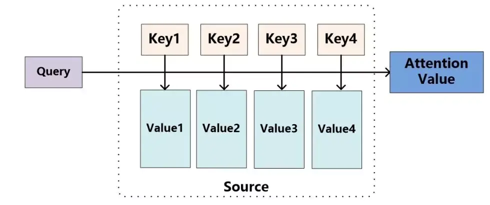
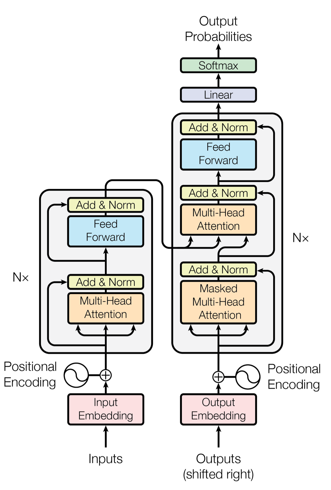

<!--Copyright © Microsoft Corporation. All rights reserved.
  适用于[License](https://github.com/microsoft/AI-System/blob/main/LICENSE)版权许可-->

## 2.9 Transformer模型

Transformer 模型在 NLP/CV 领域都取得了很令人瞩目的成绩，因此在本小节中，我们来简要介绍一下其原理。作为铺垫，先要从序列到序列的模型说起，然后提出注意力机制，再过渡到主题。

- [2.9 Transformer模型](#29-transformer模型)
  - [2.9.1 序列到序列模型（Seq2Seq）](#291-序列到序列模型seq2seq)
    - [编码-解码结构（Encoder-Decoder）](#编码-解码结构encoder-decoder)
    - [编码过程](#编码过程)
    - [解码过程](#解码过程)
  - [2.9.2 注意力机制（Attention）](#292-注意力机制attention)
    - [计算区域](#计算区域)
    - [所用信息](#所用信息)
    - [模型结构](#模型结构)
  - [2.9.3 Transformer](#293-transformer)
    - [Enbedding 层](#enbedding-层)
    - [位置编码](#位置编码)
    - [编码器层](#编码器层)
    - [注意力机制](#注意力机制)
    - [多头注意力机制](#多头注意力机制)
    - [前馈全连接层](#前馈全连接层)
    - [归一化层](#归一化层)
    - [掩码及其作用](#掩码及其作用)
    - [解码器层](#解码器层)
    - [模型输出](#模型输出)
- [小结与讨论](#小结与讨论)
- [参考文献](#参考文献)

### 2.9.1 序列到序列模型（Seq2Seq）

序列到序列模型在自然语言处理中应用广泛，是重要的模型结构。本小节对序列到序列模型的提出和结构进行简要介绍，没有涉及代码实现部分。

前面章节讲到的RNN模型和实例，都属于序列预测问题，或是通过序列中一个时间步的输入值，预测下一个时间步输出值（如二进制减法问题）；或是对所有输入序列得到一个输出作为分类（如名字分类问题）。他们的共同特点是：输出序列与输入序列等长，或输出长度为1。

还有一类序列预测问题，以序列作为输入，需要输出也是序列，并且输入和输出序列长度不确定，并不断变化。这类问题被成为序列到序列（Sequence-to-Sequence, Seq2Seq）预测问题。

序列到序列问题有很多应用场景：比如机器翻译、问答系统（QA）、文档摘要生成等。简单的RNN或LSRM结构无法处理这类问题，于是科学家们提出了一种新的结构 —— 编码解码（Encoder-Decoder）结构。

#### 编码-解码结构（Encoder-Decoder）

图 2.9.1 为Encoder-Decoder结构的示意图。

图 2.9.1 Encoder-Decoder结构示意图

Encoder-Decoder结构的处理流程非常简单直观。

- 示意图中，输入序列和输出序列分别为中文语句和翻译之后的英文语句，它们的长度不一定相同。通常会将输入序列嵌入（Embedding）成一定维度的向量，传入编码器。
- Encoder为编码器，将输入序列编码成为固定长度的状态向量，通常称为语义编码向量。
- Decoder为解码器，将语义编码向量作为原始输入，解码成所需要的输出序列。

在具体实现中，编码器、解码器可以有不同选择，可自由组合。常见的选择有CNN、RNN、GRU、LSTM等。

应用Encoder-Decoder结构，可构建出序列到序列模型。

Seq2Seq模型有两种常见结构。我们以RNN网络作为编码和解码器来进行讲解。

图 2.9.2, 2.9.3 分别展示了这两种结构。

图 2.9.2 Seq2Seq结构一

图 2.9.3 Seq2Seq结构二

#### 编码过程

两种结构的编码过程完全一致。

输入序列为 $x=[x1, x2, x3]$。

RNN网络中，每个时间节点隐层状态为:

$$
h_t = f(h_{t-1}, x_t), \quad t \in [1,3]
$$

编码器中输出的语义编码向量可以有三种不同选取方式，分别是：

$$
\begin{aligned}
c &= h_3 \\\\
c &= g(h_3) \\\\
c &= g(h1, h2, h3) \\\\
\end{aligned}
$$

#### 解码过程

两种结构解码过程的不同点在于，语义编码向量是否应用于每一时刻输入。

第一种结构，每一时刻的输出$y_t$由前一时刻的输出$y_{t-1}$、前一时刻的隐层状态$h^\prime_{t-1}$和$c$共同决定，即： $y_t = f(y_{t-1}, h^\prime_{t-1}, c)$。

第二种结构，$c$只作为初始状态传入解码器，并不参与每一时刻的输入，即：

$$
\begin{cases}
    y_1 = f(y_0, h^\prime_{0}, c)   \\\\
    y_t = f(y_{t-1}, h^\prime_{t-1}), t \in [2,4]
\end{cases}
$$

以上是序列到序列模型的结构简介。

### 2.9.2 注意力机制（Attention）

Attention（注意力）机制其实来源于人类的认识认知能力。比如当人们观察一个场景或处理一件事情时，人们往往会关注场景的显著性物体，处理事情时则希望抓住主要矛盾。注意力机制使得人类能够关注事物的重要部分，忽略次要部分，更高效的处理所面临的各种事情。

注意力机制在NLP领域被真正的发扬光大，其具有参数少、速度快、效果好的特点，如2018年的BERT、GPT 领跑各项 NLP 任务效果。由此在此领域，transformer和attention结构受到了极大的重视。
Attention的思路非常的简单，即一个加权求和过程，其原理可以表述如下：

图 2.9.4 注意力机制示意图

第一步：通过Query和Key计算权重；
第二步：使用权重对Value进行加权求和从而得到Attention Value。

注意力机制的三大优点是：

- 参数少

    模型复杂度跟 CNN、RNN 相比，复杂度更小，参数也更少。所以对算力的要求也就更小。

- 速度快

    Attention 解决了 RNN 不能并行计算的问题。Attention机制每一步计算不依赖于上一步的计算结果，因此可以和CNN一样并行处理。

- 效果好

    在 Attention 机制引入之前，有一个问题大家一直很苦恼：长距离的信息会被弱化，就好像记忆能力弱的人，记不住过去的事情是一样的。

Attention 的使用形式可以具体分类为三大类，每个大类下面又有几个小类。

#### 计算区域

- Soft Attention

    这是比较常见的Attention方式，对所有key求权重概率，每个key都有一个对应的权重，是一种全局的计算方式（也可以叫Global Attention）。这种方式比较理性，参考了所有key的内容，再进行加权。但是计算量可能会比较大一些。

- Hard Attention，

    这种方式是直接精准定位到某个key，其余key就都不管了，相当于这个key的概率是1，其余key的概率全部是0。因此这种对齐方式要求很高，要求一步到位，如果没有正确对齐，会带来很大的影响。另一方面，因为不可导，一般需要用强化学习的方法进行训练。（或者使用gumbel softmax之类的）

#### 所用信息

- Local Attention

    这种方式其实是以上两种方式的一个折中，对一个窗口区域进行计算。先用Hard方式定位到某个地方，以这个点为中心可以得到一个窗口区域，在这个小区域内用Soft方式来算Attention。

- General Attention

    这种方式利用到了外部信息，常用于需要构建两段文本关系的任务，query一般包含了额外信息，根据外部query对原文进行对齐。

- Self Attention

    这种方式也可以成为Self Attention，因为其只是用了内部信息，key和value以及query只和输入原文有关，在self attention中，key=value=query。既然没有外部信息，那么在原文中的每个词可以跟该句子中的所有词进行Attention计算，相当于寻找原文内部的关系。

#### 模型结构

- 单层Attention

    这是比较普遍的做法，用一个query对一段原文进行一次attention。

- 多层Attention

    一般用于文本具有层次关系的模型，假设我们把一个document划分成多个句子，在第一层，我们分别对每个句子使用attention计算出一个句向量（也就是单层attention）；在第二层，我们对所有句向量再做attention计算出一个文档向量（也是一个单层attention），最后再用这个文档向量去做任务。

- 多头Attention

    这是Attention is All You Need中提到的multi-head attention，用到了多个query对一段原文进行了多次attention，每个query都关注到原文的不同部分，相当于重复做多次单层attention，最后再把这些结果拼接起来。

### 2.9.3 Transformer

2017年谷歌在一篇名为《Attention Is All You Need》的论文中,提出了一个基于attention(自注意力机制)结构来处理序列相关的问题的模型，名为Transformer。Transformer在很多不同nlp任务中获得了成功，例如：文本分类、机器翻译、阅读理解等。在解决这类问题时，Transformer模型摒弃了固有的定式，并没有用任何CNN或者RNN的结构，而是使用了Attention注意力机制，自动捕捉输入序列不同位置处的相对关联，善于处理较长文本，并且该模型可以高度并行地工作，训练速度很快。见图 2.9.5。

图 2.9.5 Transformer模型结构图

其最大的特点是没有使用CNN、RNN，仅使用Attention实现这一模型。与Seq2Seq一样，模型也分为encoder和decoder部分，encoder主要使用了multi-head的self-attention，而decoder则多了一层attention，第一层multi-head self-attention是将之前生成的输出作为输入，再将该层输出作为query输入到下一层attention中，下一层attention的key和value来自于encoder。

第一级decoder的key, query, value均来自前一层decoder的输出，但加入了Mask操作，即我们只能attend到前面已经翻译过的输出的词语，因为翻译过程我们当前还并不知道下一个输出词语，这是我们之后才会推测到的。

而第二级decoder也被称作encoder-decoder attention layer，即它的query来自于之前一级的decoder层的输出，但其key和value来自于encoder的输出，这使得decoder的每一个位置都可以attend到输入序列的每一个位置。

总结一下，k和v的来源总是相同的，q在encoder及第一级decoder中与k,v来源相同，在encoder-decoder attention layer中与k,v来源不同。

#### Enbedding 层

Embedding层的作用是将某种格式的输入数据，例如文本，转变为模型可以处理的向量表示，来描述原始数据所包含的信息。Embedding层输出的可以理解为当前时间步的特征，如果是文本任务，这里就可以是Word Embedding，如果是其他任务，就可以是任何合理方法所提取的特征。构建Embedding层的代码很简单，核心是借助torch提供的nn.Embedding。

#### 位置编码

Positional Encodding位置编码的作用是为模型提供当前时间步的前后出现顺序的信息。因为Transformer不像RNN那样的循环结构有前后不同时间步输入间天然的先后顺序，所有的时间步是同时输入，并行推理的，因此在时间步的特征中融合进位置编码的信息是合理的。位置编码可以有很多选择，可以是固定的，也可以设置成可学习的参数。这里，我们使用固定的位置编码。

此外有一个点刚刚接触Transformer的同学可能不太理解，编码器和解码器两个部分都包含输入，且两部分的输入的结构是相同的，只是推理时的用法不同，编码器只推理一次，而解码器是类似RNN那样循环推理，不断生成预测结果的。

怎么理解？假设我们现在做的是一个法语-英语的机器翻译任务，想把Je suis étudiant翻译为I am a student。那么我们输入给编码器的就是时间步数为3的embedding数组，编码器只进行一次并行推理，即获得了对于输入的法语句子所提取的若干特征信息。而对于解码器，是循环推理，逐个单词生成结果的。最开始，由于什么都还没预测，我们会将编码器提取的特征，以及一个句子起始符传给解码器，解码器预期会输出一个单词I。然后有了预测的第一个单词，我们就将I输入给解码器，会再预测出下一个单词am，再然后我们将I am作为输入喂给解码器，以此类推直到预测出句子终止符完成预测。

#### 编码器层

编码器作用是用于对输入进行特征提取，为解码环节提供有效的语义信息整体来看编码器由N个编码器层简单堆叠而成。每个编码器层由两个子层连接结构组成：第一个子层包括一个多头自注意力层和规范化层以及一个残差连接；第二个子层包括一个前馈全连接层和规范化层以及一个残差连接

#### 注意力机制

人类在观察事物时，无法同时仔细观察眼前的一切，只能聚焦到某一个局部。通常我们大脑在简单了解眼前的场景后，能够很快把注意力聚焦到最有价值的局部来仔细观察，从而作出有效判断。或许是基于这样的启发，大家想到了在算法中利用注意力机制。注意力计算：它需要三个指定的输入Q（query），K（key），V（value），然后通过下面公式得到注意力的计算结果。

可以这么简单的理解，当前时间步的注意力计算结果，是一个组系数 * 每个时间步的特征向量value的累加，而这个系数，通过当前时间步的query和其他时间步对应的key做内积得到，这个过程相当于用自己的query对别的时间步的key做查询，判断相似度，决定以多大的比例将对应时间步的信息继承过来。

#### 多头注意力机制

刚刚介绍了attention机制，在搭建EncoderLayer时候所使用的Attention模块，实际使用的是多头注意力，可以简单理解为多个注意力模块组合在一起。

多头注意力机制的作用：这种结构设计能让每个注意力机制去优化每个词汇的不同特征部分，从而均衡同一种注意力机制可能产生的偏差，让词义拥有来自更多元表达，实验表明可以从而提升模型效果。

举个更形象的例子，bank是银行的意思，如果只有一个注意力模块，那么它大概率会学习去关注类似money、loan贷款这样的词。如果我们使用多个多头机制，那么不同的头就会去关注不同的语义，比如bank还有一种含义是河岸，那么可能有一个头就会去关注类似river这样的词汇，这时多头注意力的价值就体现出来了。

#### 前馈全连接层

EncoderLayer 中另一个核心的子层是 Feed Forward Layer，我们这就介绍一下。在进行了 Attention 操作之后，encoder 和 decoder 中的每一层都包含了一个全连接前向网络，对每个 position 的向量分别进行相同的操作，包括两个线性变换和一个ReLU激活输出。

Feed Forward Layer 其实就是简单的由两个前向全连接层组成，核心在于，Attention模块每个时间步的输出都整合了所有时间步的信息，而Feed Forward Layer每个时间步只是对自己的特征的一个进一步整合，与其他时间步无关。

#### 归一化层

归一化层的作用：它是所有深层网络模型都需要的标准网络层，因为随着网络层数的增加，通过多层的计算后输出可能开始出现过大或过小的情况，这样可能会导致学习过程出现异常，模型可能收敛非常慢。因此都会在一定层后接归一化层进行数值的归一化，使其特征数值在合理范围内。Transformer中使用的normalization手段是layer norm。

#### 掩码及其作用

掩码：掩代表遮掩，码就是我们张量中的数值，它的尺寸不定，里面一般只有0和1；代表位置被遮掩或者不被遮掩。掩码的作用：在 transformer 中，掩码主要的作用有两个，一个是屏蔽掉无效的 padding 区域，一个是屏蔽掉来自“未来”的信息。Encoder 中的掩码主要是起到第一个作用，Decoder 中的掩码则同时发挥着两种作用。屏蔽掉无效的 padding 区域：我们训练需要组 batch 进行，就以机器翻译任务为例，一个 batch 中不同样本的输入长度很可能是不一样的，此时我们要设置一个最大句子长度，然后对空白区域进行 padding 填充，而填充的区域无论在 Encoder 还是Decoder 的计算中都是没有意义的，因此需要用mask进行标识，屏蔽掉对应区域的响应。屏蔽掉来自未来的信息：我们已经学习了attention 的计算流程，它是会综合所有时间步的计算的，那么在解码的时候，就有可能获取到未来的信息，这是不行的。因此，这种情况也需要我们使用 mask 进行屏蔽。现在还没介绍到 Decoder，如果没完全理解，可以之后再回过头来思考下

#### 解码器层

解码器的作用：根据编码器的结果以及上一次预测的结果，输出序列的下一个结果。整体结构上，解码器也是由N个相同层堆叠而成。

每个解码器层由三个子层连接结构组成，第一个子层连接结构包括一个多头自注意力子层和规范化层以及一个残差连接，第二个子层连接结构包括一个多头注意力子层和规范化层以及一个残差连接，第三个子层连接结构包括一个前馈全连接子层和规范化层以及一个残差连接。

解码器层中的各个子模块，如，多头注意力机制，规范化层，前馈全连接都与编码器中的实现相同。

有一个细节需要注意，第一个子层的多头注意力和编码器中完全一致，第二个子层，它的多头注意力模块中，query来自上一个子层，key 和 value 来自编码器的输出。可以这样理解，就是第二层负责，利用解码器已经预测出的信息作为query，去编码器提取的各种特征中，查找相关信息并融合到当前特征中，来完成预测。

#### 模型输出

输出部分就很简单了，每个时间步都过一个 线性层 + softmax层。

线性层的作用：通过对上一步的线性变化得到指定维度的输出，也就是转换维度的作用。转换后的维度对应着输出类别的个数，如果是翻译任务，那就对应的是文字字典的大小。

## 小结与讨论

请读者参考已有的 Transformer 的实现，使用 Pytorch 来搭建一个网络，训练一个很小的任务，比如，输入 [1,2,3,4,5]，要求网络输出 [2,3,4,5]，即去掉第一个字符。

## 参考文献

- [1] Ashish Vaswani, Noam Shazeer, Niki Parmar, Jakob Uszkoreit, Llion Jones, Aidan N. Gomez, Lukasz Kaiser, Illia Polosukhin, Attention is all you need, arXiv:1706.03762
- [2] The Annotated Transformer, http://nlp.seas.harvard.edu/2018/04/03/attention.html
