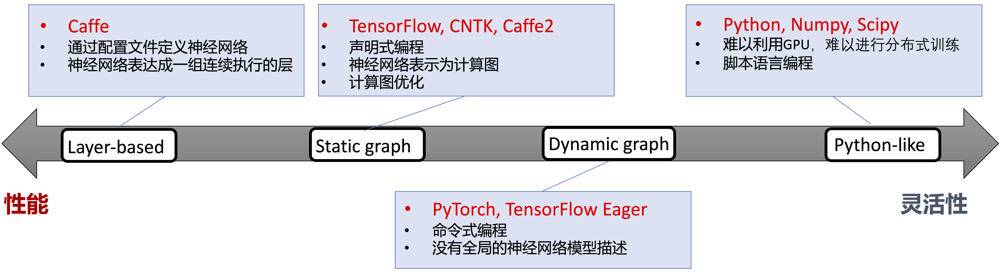
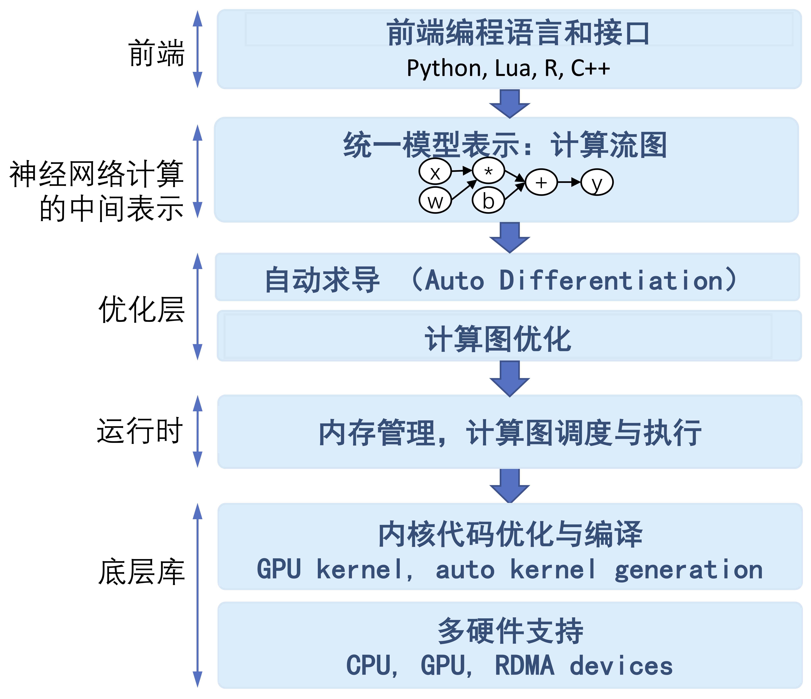
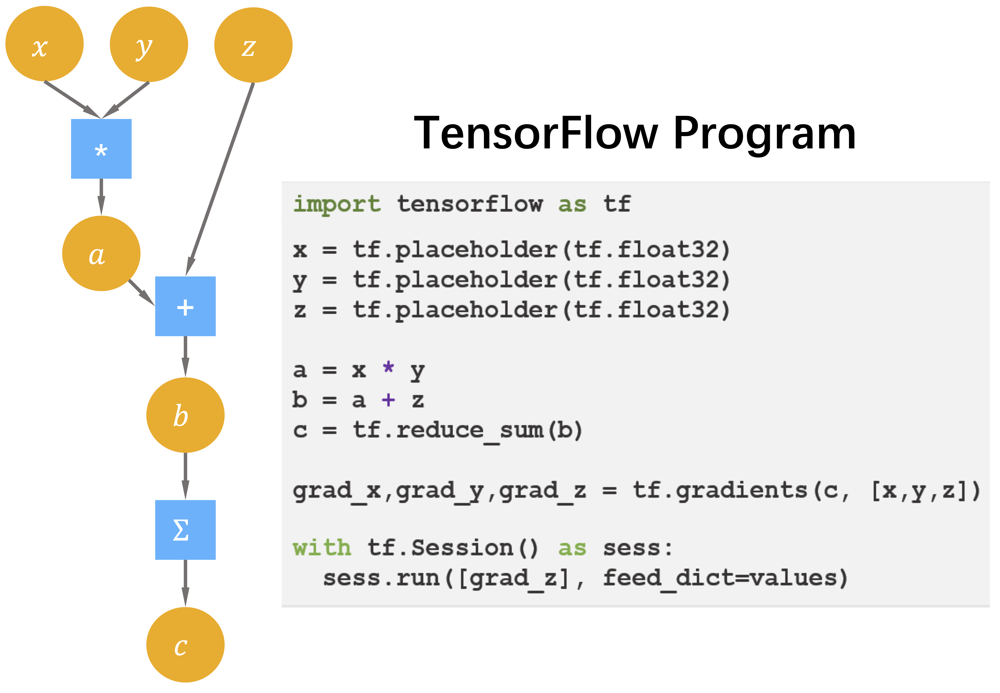
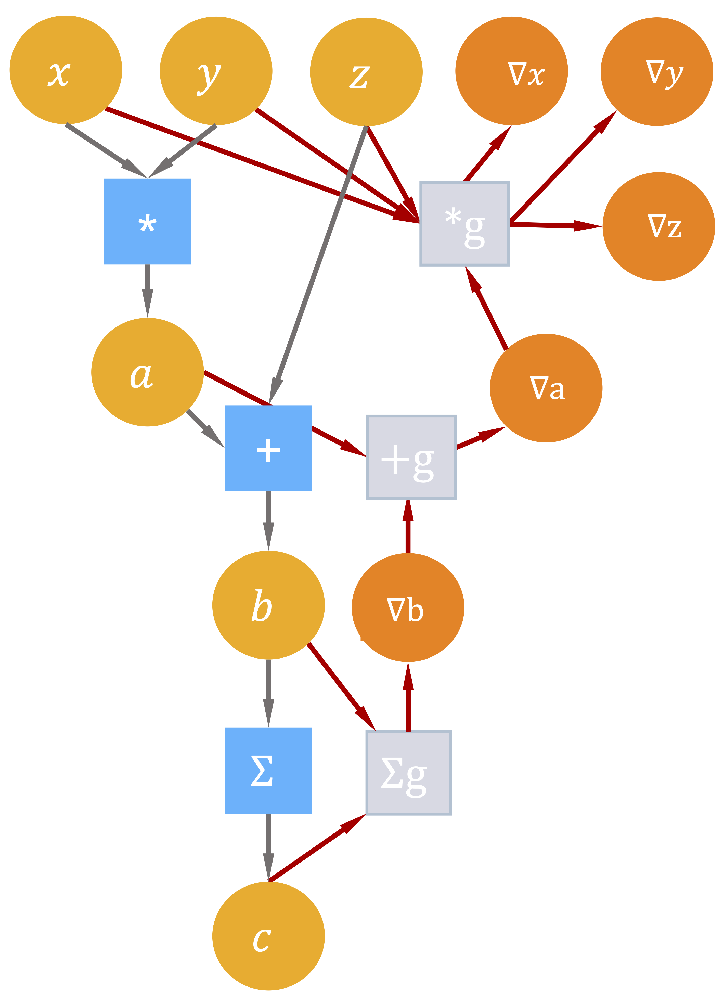
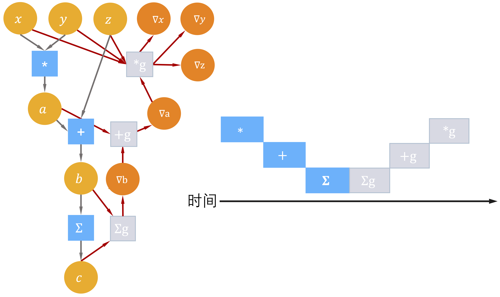
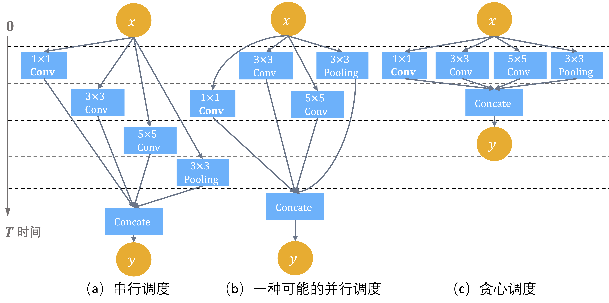
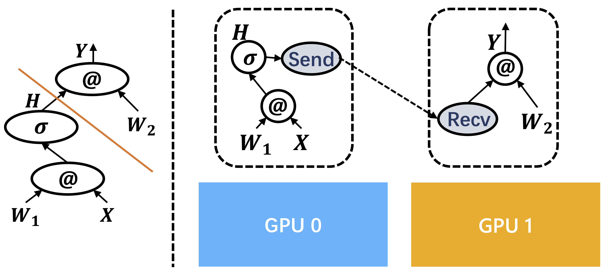

<!--Copyright © Microsoft Corporation. All rights reserved.
  适用于[License](https://github.com/microsoft/AI-System/blob/main/LICENSE)版权许可-->

- [3.1 基于数据流图的深度学习框架](#31-基于数据流图的深度学习框架)
	- [3.1.1 深度学习框架发展概述](#311-深度学习框架发展概述)
	- [3.1.2 编程范式：声明式和命令式](#312-编程范式声明式和命令式)
	- [3.1.3 数据流图](#313-数据流图)
		- [张量和张量操作](#张量和张量操作)
		- [自动微分基础](#自动微分基础)
			- [前向微分](#前向微分)
			- [反向微分](#反向微分)
		- [数据流图上的自动微分](#数据流图上的自动微分)
	- [3.1.4 数据流图的调度与执行](#314-数据流图的调度与执行)
		- [单设备算子间调度](#单设备算子间调度)
		- [图切分与多设备执行](#图切分与多设备执行)
	- [3.1.5 小结与讨论](#315-小结与讨论)
- [参考文献](#参考文献)

# 3.1 基于数据流图的深度学习框架

## 3.1.1 深度学习框架发展概述

神经网络是机器学习技术中一类具体算法分支，通过堆叠基本处理单元形成具有宽度和深度的网络拓扑结构，其背后对应着一个高度复杂的非凸函数，能够对蕴含在各类数据分布中的统计规律进行拟合。传统机器学习方法在面对不同应用时，为了达到所需的学习效果往往需要重新选择函数空间设计新的学习目标。相比之下，神经网络方法能够通过调节构成网络使用的处理单元，处理单元之间的堆叠方式，以及网络的学习算法，用一种较为统一的算法设计视角解决各类应用任务，这种方式很大程度上减轻了机器学习算法设计选择的挑战。同时，神经网络与深度学习方法能够拟合海量数据，并在图像分类，语音识别以及自然语言处理任务中取得的突破性进展。这些成功案例揭示了通过构建更大规模的神经网络对大规模数据进行学习，是一种有效的学习策略与方向。

然而，深度神经网络应用的开发需要对软件栈的各个抽象层进行编程，这对新算法的开发效率和算力都提出了很高的要求，进而催生了深度学习框架的发展。深度学习框架是为了在加速器和集群上高效训练深度神经网络而设计的可编程系统，需要同时兼顾以下三大互相制约设计目标：

1. **可编程性**：使用易用的编程接口，用高层次语义描述出各类主流深度学习模型的计算过程和训练算法。
2. **性能**：为可复用的处理单元提供高效实现；支持多设备、分布式计算。
3. **可扩展性**：降低新模型的开发成本。在添加新硬件支持时，降低增加计算原语和进行计算优化的开发成本。

主流深度学习框架主要经历了三代发展，不同框架的选择也同时影响了其采用的优化手段以及所能达到的性能：

- 早期深度学习工具发展的主要驱动力是为了提高实验室中研究和验证神经网络新算法的实验效率，研究者们开始尝试在新兴的图形处理器（GPUs，Graphic Processing Units）或是集群上运行神经网络训练程序来加速复杂神经网络训练。出现了以Cuda-convnet[<sup>[1]</sup>](#convnet-1)，Theano[<sup>[2]</sup>](#theano-2)，Distbelief[<sup>[3]</sup>](#distbelief-3)为代表的深度学习框架先驱。这些早期工作定义了深度学习框架需要支持的基本功能，如：神经网络基本计算单元，自动微分，甚至是编译期优化。背后的设计理念对今天主流深度学习框架，特别是TensorFlow，产生了深远的影响。

- 第一代形成了广泛影响力的深度学习框架以一组连续堆叠的层表示深度神经网络模型，一层同时注册前向计算和梯度计算。这一时期流行的神经网络算法的结构还较为简单，以深层全连接网络和卷积网络这样的前馈网络为主，出现了以Caffe[<sup>[4]</sup>](#caffe-4)，MxNet[<sup>[5]</sup>](#mxnet-5)为代表的开源工具。这些框架提供的开发方式与C/C++编程接口深度绑定，使得更多研究者能够利用框架提供的基础支持，快速添加高性能的新神经网络层和新的训练算法，从而利用图形处理器（GPUs,Graphic Processing Units）来提高训练速度。这些工作进一步加强和验证了系统设计对神经网络算法模块化的抽象，推动了新网络处理单元和网络结构的进一步发展。

- 前期实践最终催生出了以TensorFlow[<sup>[6]</sup>](#tensorflow-6)和PyTorch[<sup>[9]</sup>](#pytorch-9)为代表的第二代工业级深度学习框架，其核心以数据流图抽象和描述深度神经网络。这一时期同时伴随着如DyNet[<sup>[7]</sup>](#dynet-7)，Chainer[<sup>[8]</sup>](#chainer-8)等激发了框架设计灵感的诸多实验项目。TensorFlow和PyTorch代表了今天深度学习框架两种不同的设计路径：系统性能优先改善灵活性和灵活性易用性优先改善系统性能。这两种选择，随着神经网络算法研究和应用的更进一步发展，又逐步造成了解决方案的分裂。

<p align="center">
<br>
图1. 深度学习框架发展历程
</p>

到目前阶段，神经网络模型结构越发多变，涌现出了大量如：TensorFlow Eager[<sup>[10]</sup>](#tf-eager-10)，TensorFlow Auto-graph[<sup>[12]</sup>](#auto-graph-12)，PyTorch JIT，JAX[<sup>[11]</sup>](#jax-11)这类呈现出设计选择融合的深度学习框架设计。这些项目纷纷采用设计特定领域语言(Domain-Specific Language，DSL）的思路，在提高描述神经网络算法表达能力和编程灵活性的同时，通过编译期优化技术来改善运行时性能。

一个深度神经网络计算任务通常涉及训练和推理两个生命周期。前者运行于算力和存储更加充裕的服务器或者集群；后者服务用户的请求往往运行于资源受限，对响应时间有着更加严格要求的云（Cloud）端或者边缘（Edge）端。他们对系统设计的要求也不尽相同，于是衍生出了用于训练的训练框架和用于部署的推理框架。[第8章](https://github.com/microsoft/AI-System/blob/main/Textbook/%E7%AC%AC8%E7%AB%A0-%E6%B7%B1%E5%BA%A6%E5%AD%A6%E4%B9%A0%E6%8E%A8%E7%90%86%E7%B3%BB%E7%BB%9F/8-%E5%89%8D%E8%A8%80.md)详细介绍推理系统，这一章我们主要围绕编程模型、自动微分、对内存资源进行管理和对计算任务进行调度的运行时系统、多设备支持这几个方面展开，介绍应用于训练的训练框架设计。

## 3.1.2 编程范式：声明式和命令式

深度学习框架为前端用户提供声明式（Declarative Programming）和命令式（Imperative Programming）两种编程范式来定义神经网络计算。

在声明式编程模型下，前端语言中的表达式不直接执行，而是首先构建起一个完整前向计算过程表示，这个计算过程的表示经过序列化发送给后端系统，后端对计算过程表示优化后再执行，又被称作先定义后执行（Define-and-Run）或是静态图。在命令式编程模型下，后端高性能可复用模块以跨语言绑定（Language Binding）方式与前端深度集成，前端语言直接驱动后端算子执行，用户表达式会立即被求值，又被称作边执行边定义(Define-by-Run)或者动态图。

命令式编程的优点是方便调试，灵活性高，但由于在执行前缺少对算法的统一描述，也失去了编译期优化（例如，对数据流图进行全局优化等）的机会。相比之下，声明式编程对数据和控制流的静态性限制更强，由于能够在执行之前得到全程序描述，从而有机会进行运行前编译（Ahead-Of-Time）优化。TensorFlow提供了命令式编程体验，Chainer和PyTroch提供了声明式的编程体验。但两种编程模型之间并不存在绝对的边界，多阶段（Multi-Stage ）编程和即时编译（Just-In-Time, JIT)技术能够实现两种编程模式的混合。随着TensorFlow Eager和PyTorch JIT的加入，主流深度学习框架都选择了通过支持混合式编程以兼顾两者的优点。

## 3.1.3 数据流图

为了高效地训练一个复杂神经网络，框架需要解决诸多问题， 例如：如何实现自动求导，如何利用编译期分析对神经网络计算进行化简、合并、变换，如何规划基本计算单元在加速器上的执行，如何将基本处理单元派发（Dispatch）到特定的高效后端实现，如何进行内存预分配和管理等。如何用统一的方式解决这些问题驱使着框架设计者思考为各类神经网络计算提供统一的描述，从而使得在运行神经网络计算之前，编译期分析能够对整个计算过程尽可能进行推断，为用户程序补全反向计算，规划执行，从而最大程度地降低运行时开销。

主流的深度学习框架都选择使用数据流图来抽象神经网络计算，图2展示了基于深度学习框架的组件划分。

<p align="center">
<br>
图2. 基于数据流图的深度学习框架的基本组件
</p>

数据流图（Dataflow Graph）是一种描述计算的经典方式，广泛用于科学计算系统。为了避免在调度执行数据流图时陷入循环依赖，数据流图通常是一个有向无环图。在深度学习框架中，图中的结点是深度学习框架后端所支持的操作原语（Primitive Operation），不带状态，没有副作用，结点的行为完全由输入输出决定；结点之间的边显式地表示了操作原语之间的数据依赖关系。图3左侧是表达式 $x*y+sin⁡(x)$对应的一个数据流图实例，右侧对应了定义这个数据流图的TensorFlow代码。图3中的圆形是数据流图中边上流动的数据，方形是数据流图中的基本操作。

<p align="center">
<br>
图3. x*y+sin⁡(x)的数据流图实例和定义该数据流图的TensorFlow代码
</p>

### 张量和张量操作

我们进一步来看数据流图中数据的具体类型。在科学计算任务中，数据常常被组织成一个高维数组，在深度学习框架中也被称作张量（Tensor），是对标量、向量和矩阵的推广。整个计算任务的绝大部分时间都消耗在这些高维数组上的数值计算操作上。高维数组和其上的数值计算是神经网络关注的核心，这些数值计算构成了数据流图中最重要的一类操作原语：张量之上的数值计算。在这一节，我们首先考虑最为常用的稠密数组，在稀疏性相关章节再展开稀疏数组的计算介绍。

前端用户看到的张量由以下几个重要属性定义：

1. **元素的基本数据类型**：在一个张量中，所有元素具有相同的数据类型（例如，32位浮点型）。
1. **形状**：张量是一个高维数组，每个维度具有固定的长度。张量的形状是一个整型数的元组，描述了一个张量具有几个维度以及每个维度的长度（例如，[224,224,3]是ImageNet中一张图片的形状，具有三个维度，长度分别是：224， 224和3）。
1. **设备**：决定了张量的存储设备。如CPU(Central Processing Unit)，GPU(Graphic Processing Unit)等。
标量，向量，矩阵分别是0维，1维和2维张量。图4左侧是一个声明为：CPU上形状为[5, 3]的整型张量的示意图，图4右侧是一个声明为：GPU上形状为[8, 4, 4]的浮点型张量的示意图。

<p align="center">
<br>
图4. 二维张量和三维张量示意图
</p>

张量是整型，浮点型，布尔型，字符型等基本数据类型的容器类型。张量这一数据类型将具有相同类型的数据元素组织成规则形状，为用户提供了一种逻辑上易于理解的方式组织数据。例如，图像任务通常将一副图片组织成一个三维张量，张量的三个维度分别对应着图像的长，宽和通道数目。自然语言处理任务中，一个句子被组织成一个二维张量，张量的两个维度分别对应着词向量和句子的长度。多副图像或者多个句子只需要为张量再增加一个新的批量（Batch）维度。这种数据组织方式极大地提高了神经网络计算前端程序的可理解性和编程的便捷性，前端用户在描述计算时只需通过张量中元素的逻辑存储地址引用其中的元素，后端在为张量计算生成高效实现时，能够自动将逻辑地址映射到物理存储地址。更重要的是张量操作将大量同构的元素作为一个整体进行批量操作，通常都隐含着很高的数据并行性，因此张量计算非常适合在单指令多数据（SIMD，Single Instruction, Multiple Data）加速器上进行加速实现。

对高维数组上的数值计算进行专门的代码优化，在科学计算和高性能计算领域有着悠久的研究历史，可以追溯到早期科学计算语言Fortran。深度学习框架的设计也很自然地沿用了张量和张量操作作为构造复杂神经网络的基本描述单元，前端用户可以在不陷入后端实现细节的情况下，在前端脚本语言中复用由后端优化过的张量操作。而计算库开发者能够隔离神经网络算法细节，将张量计算作为一个独立的性能域，使用底层的编程模型和编程语言应用硬件相关优化。

至此，我们可以对计算图中的边和节点进一步细化：主流深度学习框架将神经网络计算抽象为一个数据流图（Dataflow Graph），也叫做计算图，图中的节点是后端支持的张量操作原语，节点之间的边上流动着张量。一类最为重要的操作是张量上的数值计算，往往有着极高的数据并行度，能够被硬件加速器加速。

### 自动微分基础

训练神经网络主要包含前向计算，反向计算，更新可学习权重三个最主要的计算阶段。当用户构造完成一个深度神经网络时，在数学上这个网络对应了一个复杂的带参数的高度非凸函数，求解其中的可学习参数依赖于基于一阶梯度的迭代更新法。手工计算复杂函数的一阶梯度非常容易出错，自动微分（Automatic Differentiation，简称Auto-diff）系统就正为了解决这一问题而设计的一种自动化方法。自动微分要解决的问题是给定一个由原子操作构成的复杂计算程序，如何为其自动生成梯度计算程序。自动微分按照工作模式可分为前向自动微分和反向自动微分。按照实现方式自动微分又可为：基于对偶数（Dual Number）的前向微分，基于磁带（Tape）的反向微分，和基于源代码变换的反向微分。深度学习系统很少采用前向微分，基于对偶数的自动微分常实现于程序语言级别的自动微分系统中[<sup>[14]</sup>](#Julia-autodiff-14)；基于磁带（Tape）的反向微分通常实现于以PyTorch为代表的边定义边执行类型的动态图深度学习系统中；基于源代码变换的反向微分通常实现于以TensorFlow为代表先定义后执行类型的静态图深度学习系统中。

自动微分是深度学习框架的核心组件之一，在展开深度学习框架如何实现自动微分之前，我们先通过下面这个简单的例子来理解自动微分的基本原理。

**例3.1**： $z=x*y+sin(x)$是一个简单的复合函数，图5是这个函数的表达式树。

<p align="center">
<br>
图5. 对求值z的表达式树
</p>

假设给定复合函数$z=x*y+sin(x)$，其中$x$和$y$均为标量。让我们思考两个问题：第一，计算机程序会如何通过一系列原子操作对$z$进行求值；第二，如何求解$z$对$x$和$y$的梯度？第一个问题十分直接。为了对$z$求值，我们可以按照表达式树定义的计算顺序，将复合函数$z$分解成如（a.1）至（a.5）所示的求值序列。我们把给定输入逐步计算输出的这样一个求值序列称为前向计算过程。

$$\begin{align}
x &= ? \tag{a.1}\\
y &= ? \tag{a.2}\\
a &= x * y \tag{a.3}\\
b &= sin(x) \tag{a.4}\\
z &= a+b  \tag{a.5}
\end{align}$$

#### 前向微分

为了回答如何计算$z$对$x$和$y$梯度的问题，在这里我们引入一个尚未被赋值的变量$t$，依据复合函数求导的链式法则，按照从（a.1）到（a.5）的顺序，依次令以上五个表达式分别对$t$求导，得到求值序列（b.1）至（b.5）：

$$
\begin{align}
\frac{\partial x}{\partial t} &= ? \tag{b.1}\\
\frac{\partial y}{\partial t} &= ? \tag{b.2}\\
\frac{\partial a}{\partial t} &= y *\frac{\partial x}{\partial t} + x * \frac{\partial y}{\partial t} \tag{b.3}\\
\frac{\partial b}{\partial t} &= cos(x) * \frac{\partial x}{\partial t} \tag{b.4}\\
\frac{\partial z}{\partial t} &= \frac{\partial a}{\partial t} + \frac{\partial b}{\partial t} \tag{b.5}\\
\end{align}
$$

引入导数变量$dxx \triangleq \frac{\partial xx}{\partial t}$ , 表示$xx$对$t$的导数，同时令$t=x$，带入（b.1）至（b.5），于是得到（c.1）至（c.5）:

$$
\begin{align}
\text{dx} &= 1 \tag{c.1}\\
\text{dy} &= 0 \tag{c.2}\\
\text{da} &= y \tag{c.3}\\
\text{db} &= cos(x) \tag{c.4}\\
\text{dz} &= y + cos(x) \tag{c.5}\\
\end{align}
$$

同理，令$t=y$ 带入（b.1）至（b.5），于是得到（d.1）至（d.5）:

$$
\begin{align}
\text{dx} &= 0 \tag{d.1}\\
\text{dy} &= 1 \tag{d.2}\\
\text{da} &= x \tag{d.3}\\
\text{db} &= 0 \tag{d.4}\\
\text{dz} &= x \tag{d.5}\\
\end{align}
$$

在（c.1）至（c.5）和（d.1）至（d.5）这样的两轮计算过程中我们可以观察到：给定输入变量计算输出变量（前向计算）和给定输出变量计算输出变量对输入变量的导数，能够以完全一致的求值顺序进行，也就是导数表达式的求值顺序和前向表达式的求值顺序完全一致。运行（c.1）至（c.5）和（d.1）至（d.5）的过程称之为前向微分。

导数的计算往往依赖于前向计算的结果，由于前向微分导数的计算顺序和前向求值顺序完全一致。于是前向微分可以不用存储前向计算的中间结果，在前向计算的同时完成导数计算，从而节省大量内存空间 ，这是前向微分的巨大优点，利用这一事实前向微分存在一种基于对偶数（Dual Number）的简单且高效实现方式[<sup>[14]</sup>](#Julia-autodiff-14)。同时可以观察到前向微分的时间复杂度为$Ο(n)$，$n$是输入变量的个数。在上面的例子中，输入变量的个数为两个，因此前向微分需要运行两次来计算输出变量对输入变量的导数。然而，在神经网络学习中，输入参数个数$n$往往大于一，如果基于前向微分计算中间结果和输入的导数导数，需要多次运行程序，这也是前向微分在大多数情况下难以应用于神经网络训练的一个重要原因。

#### 反向微分

为了解决前向微分的在算法复杂度上的存在局限性，寻找更加高效的导数计算方法，我们可以进一步观察链式求导法则：链式求导法则在计算导数时是对称的，在计算变量$xx$对$x$的导数$\frac{\partial \text{xx}}{\partial \text{x}}$时，链式求导法则并不关心哪个变量作为分母，哪个变量作为分子。于是，我们再次引入一个尚为被赋值的变量$s$，通过交换表达式（b.1）至（b.5）中分子和分母的顺序重写链式求导法则，于是得到（e.1）至（e.5）：

$$
\begin{align}
\frac{\partial s}{\partial z} &= ? \tag{e.1}\\
\frac{\partial s}{\partial b} &= \frac{\partial s}{\partial z} * \frac{\partial z}{\partial a} = \frac{\partial s}{\partial z} \tag{e.2}\\
\frac{\partial s}{\partial a} &= \frac{\partial s}{\partial z} * \frac{\partial z}{\partial b} = \frac{\partial s}{\partial z} \tag{e.3}\\
\frac{\partial s}{\partial y} &= \frac{\partial s}{\partial a} * \frac{\partial a }{\partial y} = \frac{\partial s}{\partial a} * x \tag{e.4}\\
\frac{\partial s}{\partial x} &= \frac{\partial s}{\partial a} * \frac{\partial a}{\partial x} + \frac{\partial s}{\partial b} * \frac{\partial b}{\partial x} &= \frac{\partial s}{\partial a} * y + \frac{\partial s}{\partial b} * \text{cos}(x) \tag{e.5}
\end{align}
$$

引入导数变量$gxx \triangleq \frac{\partial s}{\partial \text{xx}}$ , 表示$s$对$xx$的导数，称作$xx$的伴随变量（Aadjoint Variable），改写(e.1)至(e.5)，于是有：

$$
\begin{align}
\text{g}z &= ? \tag{f.1}\\
\text{g}b &= \text{g}z \tag{f.2} \\
\text{g}a &= \text{g}z  \tag{f.3}\\
\text{g}y &= \text{g}a * x  \tag{f.4}\\
\text{g}x &= \text{g}a * y + \text{g}b * \text{cos}(x) \tag{f.5} \\
\end{align}
$$

令$s = z$，得到:

$$
\begin{align}
\text{g}z &= 1 \tag{g.1} \\
\text{g}b &= 1 \tag{g.2} \\
\text{g}a &= 1 \tag{g.3} \\
\text{g}y &= x \tag{g.4} \\
\text{g}x &= y + \text{cos}(x)  \tag{g.5} \\
\end{align}
$$

表达式(g.1)至(g.5)求值的过程称之为反向微分。从中可以观察到，与前向微分的特点正好相反，在反向微分中变量导数的计算顺序与变量的前向计算顺序正好相反，运行的时间复杂度是$Ο(m)$，$m$是输出变量的个数。在神经网络以及大量基于一阶导数方法进行训练的机器学习算法中，不论输入变量数目有多少，模型的输出一定是一个标量函数，也称作损失函数，这决定了保留前向计算的所有中间结果，只需再次运行程序一次便可以用反向微分算法计算出损失函数对每个中间变量和输入的导数。反向微分的运行过程十分类似于“扫栈”  ，需要保留神经网络所有中间层前向结算的结果，对越接近输入层的中间层，其计算结果首先被压入栈中，而他们在反向计算时越晚被弹出栈。显然，网络越深，反向微分会消耗越多的内存，形成一个巨大的内存足迹 。

至此，我们对两种自动微分模式进行小结：

1. 前向微分的时间复杂度为$O(n)$，$n$是输入变量的个数$n$。反向微分的时间复杂度为$O(m)$，$m$是输出变量的个数。当$n<m$时，前向微分复杂度更低； 当$n>m$时，反向微分复杂度更低。由于在神经网络训练中，总是输出一个标量形式的网络损失，于是$m=1$，反向微分更加适合神经网络的训练。
2. 当$n=m$时，前向微分和反向微分没有时间复杂度上的差异。但在前向微分中，由于导数能够与前向计算混合在一轮计算中完成，因此不需要存储中间计算结果，落实到更具体的高效实现中，也会带来更好的访问存储设备的局部性，因此前向微分更有优势。
3. 尽管在绝大多数情况下，神经网络的整体训练采用反向微分更加合理，但在局部网络使用前向微分依然是可能的。

### 数据流图上的自动微分

尽管[自动微分基础](#自动微分基础)一节的例3.1使用了标量形式的表达式来展示反向微分和前向微分的差异，但并不阻碍我们理解反向微分如何工作于一个真实的基于张量计算的神经网络训练过程。在真实的神经网络训练中，我们可以将上例中每一个基本表达式理解为数据流图中的一个结点，只是这个结点对例3.1中标量形式的表达式进行了张量化的推广，对应着一个框架后端支持的张量操作。

假设，$\mathbf{Y} = G(\mathbf{X})$是一个基本求导原语，其中$\mathbf{Y} = [y_1\ \cdots \ y_m]$和$\mathbf{X}=[x_1 \ \cdots \ x_n]$都是向量。这时，$\mathbf{Y}$对$\mathbf{X}$的导数不再是一个标量，而是由偏导数构成的雅克比矩阵$J$（Jacobian Matrix）：

$$
J = \left[\frac{\partial \mathbf{Y}}{\partial x_1}, \cdots, \frac{\partial \mathbf{Y}}{\partial x_n} \right] = \begin{bmatrix}
\frac{\partial y_1}{\partial x_1} \quad \cdots \quad \frac{\partial y_1}{\partial x_n} \\
\vdots \quad \ddots \quad \vdots \\
\frac{\partial y_m}{\partial x_1} \quad \cdots \quad \frac{\partial y_m}{\partial x_n}
\end{bmatrix}
$$

在反向传播算法的反向过程中（也是反向微分的反向过程），中间层$\mathbf{Y} = G(\mathbf{X})$会收到损失函数对当前层输出的导数：$\mathbf{v} = \frac{\partial l}{\partial \mathbf{Y}} = \left[\frac{\partial l}{\partial y_1} \ \cdots \ \frac{\partial l}{\partial y_m} \right]$，然后将这个导数继续乘以该层输出对输入的雅克比矩阵$J$，这个乘法的结果就是向量与雅克比矩阵（Vector-Jacobian）乘积，是一个向量。反向传播过程中如果直接存储雅克比矩阵，会消耗大量存储空间，取而代之，如果只存储向量与雅可比矩阵（Vector-Jacobian）的乘积，在减少存储的同时并不会影响导数的计算。因此，深度学习框架在实现自动微分时，对每个中间层，存储的都是向量与雅克比矩阵的乘积，而非雅克比矩阵。

$$
\mathbf{v} \cdot J = \begin{bmatrix}
\frac{\partial l}{\partial y_1} \cdots \frac{\partial l}{\partial y_m}
\end{bmatrix} \begin{bmatrix}
\frac{\partial y_1}{\partial x_1} \quad \cdots \quad \frac{\partial y_1}{\partial x_n} \\
\vdots \quad \ddots \quad \vdots \\
\frac{\partial y_m}{\partial x_1} \quad \cdots \quad \frac{\partial y_m}{\partial x_n}
\end{bmatrix} = \begin{bmatrix}
\frac{\partial l}{\partial x_1} \cdots \frac{\partial l}{\partial x_n}
\end{bmatrix}
$$

我们继续以图3所示的前向数据流图为例，图6补全了与之对应的反向操作数据流图。与前向计算的计算图相同，反向计算的数据流图中每个结点都是一个无状态的张量操作，结点的入边（Incoming Edge）表示张量操作的输入，出边表示张量操作的输出。数据流图中的可导张量操作在实现时都会同时注册前向计算和反向（导数）计算。前向结点接受输入计算输出，反向结点接受损失函数对当前张量操作输出的梯度$\mathbf{v}$，当前张量操作的输入和输出，计算当前张量操作每个输入的向量与雅克比矩阵的乘积。

<p align="center">
<br>
图6. 反向计算的数据流图实例
</p>

从图6中我们可以观察到：前向数据流图和反向数据流图有着完全相同的结构，区别仅在于数据流流动的方向相反。同时，由于梯度通常都会依赖前向计算的输入或是计算结果，反向数据流图中会多出一些从前向数据流图输入和输出张量指向反向数据流图中导数计算结点的边。在基于数据流图的深度学习框架中，利用反向微分计算梯度通常实现为数据流图上的一个优化pass，给定前向数据流图，以损失函数为根节点广度优先遍历前向数据流图的时，便能按照对偶结构自动生成出求导数据流图。

## 3.1.4 数据流图的调度与执行

训练神经网络包含如下五个阶段：前向计算，反向计算，梯度截断，应用正则，以及更新可学习参数。其中，梯度截断和应用正则视用户是否配置了这两项，可能会跳过。

```python
for batch in TrainDataset:
	phrase 1: 前向计算
	phrase 2: 反向计算
	phrase 3: 梯度截断
	phrase 4: 应用正则项
	phrase 5: 更新可学习参数
```

在基于计算流图的深度学习框架中，这五个阶段统一表示为由基本算子构成的数据流图，算子是数据流图中的一个节点，由后端进行高效实现。前端用户只需要给定前向计算，框架会根据前向数据流图，自动补全其余阶段，生成出完整的数据流图。神经网络的训练就对应了这个数据流图的执行过程。算子调度是根据数据流图描述的数据依赖关系，确定算子的执行顺序，由运行时系统调度数据流图中的节点到设备上执行。

### 单设备算子间调度

对单设备执行环境，制约数据流图中节点调度执行的关键因素是节点之间的数据流依赖。这种情况下运行时系统的调度策略十分直接：初始状态下，运行时系统会将数据流图中入度为0的节点加入一个FIFO（First-In-First-Out）就绪队列，然后从就绪队列中选择一个节点，分配给线程池中的一个线程执行。当这个节点执行结束后，会将其后继节点加入就绪队列，该节点被弹出。运行时系统继续处理就绪队列中的节点，直到队列为空。以TensorFlow默认调度策略为例，数据流图中的节点会被分类为低代价节点（一般是仅在CPU上执行的一些拼接节点）和高代价节点（张量计算节点）。就绪队列中的一个节点被分配给线程池中的线程调度执行时，这个线程会一次执行完数据流图中所有低代价节点，或在遇到高代价节点时，将这个节点派发给线程池中空闲的其他线程执行。

<p align="center">
<br>
图7. 简单数据流图的串行执行调度
</p>

图7是按照数据流约束执行例3.2对应的数据流图的一个可能调度序列。

### 图切分与多设备执行

对例3.2中这样的简单神经网络，在数据流依赖的约束下只存在串行调度方案。对许多更加复杂的神经网络模型存在多分枝，典型代表如GoogLeNet[<sup>[13]</sup>](#GoogLeNet-13)，图8是构成GoogLeNet的Inception模块，这时如果后端有多个计算设备，运行时系统在调度执行数据流图时，会尝试尽可能将可并行算子派发到并行设备上以提高计算资源的利用率。

<p align="center">
<br>
图8. 基本的Inception模块执行策略
</p>

多计算设备环境下执行数据流图，运行时系统需要解如何将数据流图中的节点放置到不同设备上以及如何管理跨设备数据传输两个问题：

1. **数据流图切分**：给定一个数据流图将数据流图切分后放置到多个计算设备上，每个设备拥有数据流图的一部分。
2. **插入跨设备通信**：经过切分数据流图会被分成若干子图，每个子图被放置在一个设备上，这时数据流图中会出现一些边它们的头和尾分别被放置在不同设备上。运行时系统会自动删除这样的边，将它们替换成一对*Send*和*Receive*算子，实现跨设备数据传输。数据传输的所有细节实现可以被*Send*和*Receive*掩盖。

图9是上面两步的示意图。

<p align="center">
<br>
图9. 数据流图切分和插入跨设备数据传输
</p>

实际上做好数据流图切分映射到多设备是一个复杂的组合优化问题，需要在代价模型（cost model）的辅助下预估跨设备通信消耗的时间以及每个算子在设备上的运行时间如何随着输入输出张量大小的改变而变化，最终以数据流依赖为约束，均衡并行执行和数据通信这一对相互竞争的因素。第6章会对并行计算中的策略选择进行更详细的介绍。

## 3.1.5 小结与讨论

主流深度学习框架都采用了数据流图作为神经网络计算的高层次抽象。数据流图是一个有向无环图，图中的结点是一个深度学习框架后端支持的张量操作原语，结点之间的边上流动的是张量，显式地表示了结点之间的数据依赖关系。

1. 数据流图用统一的方式描述出了复杂神经网络训练的全过程，使得在运行程序之前后端系统有机会对整个计算过程的数据依赖关系进行分析，通过数据流图化简、内存优化、预先计算算子间的静态调度策略等方式，改善运行时的性能。
2. 基于数据流图描述，深度学习框架在设计上切分出了三个解耦的优化层：数据流图优化，运行时调度策略，以及算子优化。当遇到新的神经网络模型结构或是训练算法时，通过以下三步进行扩展：（1）添加新的算子；（2）对算子的内核函数在不同设备，不同超参数下进行计算优化；（3）注册算子和内核函数，由运行时系统在在运行时派发到所需的实现上。
3. 在基于数据流图的深度学习框架设计之初，希望通过对三个优化层之间的解耦来加速深度学习软件栈的迭代，然而，随着神经网络模型计算规模的增大，出现了越来越多的定制化算子，多设备支持需求增加，这三个抽象层之间的抽象边界也在被频繁地打破。在后续的章节我们会进一步讨论。


# 参考文献

<div id="convnet-1"></div>

1. Cuda-convnet, High-performance C++/CUDA implementation of convo-lution of
neural networks, [https://code.google.com/p/cuda-convnet/](https://code.google.com/p/cuda-convnet/)

<div id="theano-2"></div>

2. Al-Rfou, R., Alain, G., Almahairi, A., Angermueller, C., Bahdanau, D., Ballas, N., ... & Zhang, Y. (2016). [Theano: A Python framework for fast computation of mathematical expressions](https://arxiv.org/pdf/1605.02688.pdf). arXiv e-prints, arXiv-1605.

<div id="distbelief-3"></div>

3. Dean, J., Corrado, G., Monga, R., Chen, K., Devin, M., Mao, M., ... & Ng, A. (2012). [Large scale distributed deep networks](https://proceedings.neurips.cc/paper/2012/file/6aca97005c68f1206823815f66102863-Paper.pdf). Advances in neural information processing systems, 25.

<div id="caffe-4"></div>

4. Jia, Y., Shelhamer, E., Donahue, J., Karayev, S., Long, J., Girshick, R., ... & Darrell, T. (2014, November). [Caffe: Convolutional architecture for fast feature embedding](https://arxiv.org/pdf/1408.5093.pdf?ref=https://codemonkey.link). In Proceedings of the 22nd ACM international conference on Multimedia (pp. 675-678).

<div id="mxnet-5"></div>

5. Chen, T., Li, M., Li, Y., Lin, M., Wang, N., Wang, M., ... & Zhang, Z. (2015). [Mxnet: A flexible and efficient machine learning library for heterogeneous distributed systems](https://arxiv.org/pdf/1512.01274.pdf). arXiv preprint arXiv:1512.01274.

<div id="tensorflow-6"></div>

6. Abadi, M., Barham, P., Chen, J., Chen, Z., Davis, A., Dean, J., ... & Zheng, X. (2016). [TensorFlow: A System for Large-Scale Machine Learning](https://www.usenix.org/system/files/conference/osdi16/osdi16-abadi.pdf). In 12th USENIX symposium on operating systems design and implementation (OSDI 16) (pp. 265-283).

<div id="dynet-7"></div>

7. Neubig, G., Dyer, C., Goldberg, Y., Matthews, A., Ammar, W., Anastasopoulos, A., ... & Yin, P. (2017). [Dynet: The dynamic neural network toolkit](https://arxiv.org/pdf/1701.03980.pdf)). arXiv preprint arXiv:1701.03980.

<div id="chainer-8"></div>

8. Tokui, S., Oono, K., Hido, S., & Clayton, J. (2015, December). [Chainer: a next-generation open source framework for deep learning](http://learningsys.org/papers/LearningSys_2015_paper_33.pdf). In Proceedings of workshop on machine learning systems (LearningSys) in the twenty-ninth annual conference on neural information processing systems (NIPS) (Vol. 5, pp. 1-6).

<div id="pytorch-9"></div>

9. Paszke, A., Gross, S., Massa, F., Lerer, A., Bradbury, J., Chanan, G., ... & Chintala, S. (2019). [Pytorch: An imperative style, high-performance deep learning library](https://proceedings.neurips.cc/paper/2019/file/bdbca288fee7f92f2bfa9f7012727740-Paper.pdf). Advances in neural information processing systems, 32.

<div id="tf-eager-10"></div>

10. Agrawal, A., Modi, A., Passos, A., Lavoie, A., Agarwal, A., Shankar, A., ... & Cai, S. (2019). [TensorFlow Eager: A multi-stage, Python-embedded DSL for machine learning](https://proceedings.mlsys.org/paper/2019/file/2a38a4a9316c49e5a833517c45d31070-Paper.pdf). Proceedings of Machine Learning and Systems, 1, 178-189.

<div id="jax-11"></div>

11. Frostig, R., Johnson, M. J., & Leary, C. (2018). [Compiling machine learning programs via high-level tracing](https://mlsys.org/Conferences/doc/2018/146.pdf). Systems for Machine Learning, 23-24.

<div id="auto-graph-12"></div>

12. Moldovan, D., Decker, J. M., Wang, F., Johnson, A. A., Lee, B. K., Nado, Z., ... & Wiltschko, A. B. (2018). [AutoGraph: Imperative-style Coding with Graph-based Performance](https://arxiv.org/pdf/1810.08061.pdf).(oct 2018). arXiv preprint arXiv:1810.08061.

<div id="GoogLeNet-13"></div>

13. Szegedy, Christian, et al. "[Going deeper with convolutions](https://www.cv-foundation.org/openaccess/content_cvpr_2015/papers/Szegedy_Going_Deeper_With_2015_CVPR_paper.pdf)." Proceedings of the IEEE conference on computer vision and pattern recognition. 2015.

<div id="Julia-autodiff-14"></div>

14. Revels, Jarrett, Miles Lubin, and Theodore Papamarkou. "[Forward-mode automatic differentiation in Julia](https://arxiv.org/pdf/1607.07892.pdf)." arXiv preprint arXiv:1607.07892 (2016).