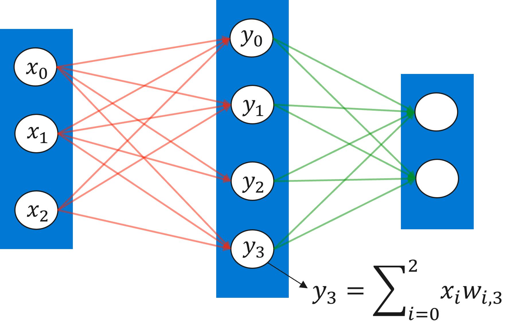
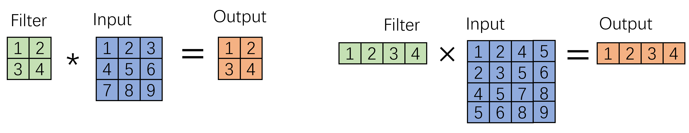
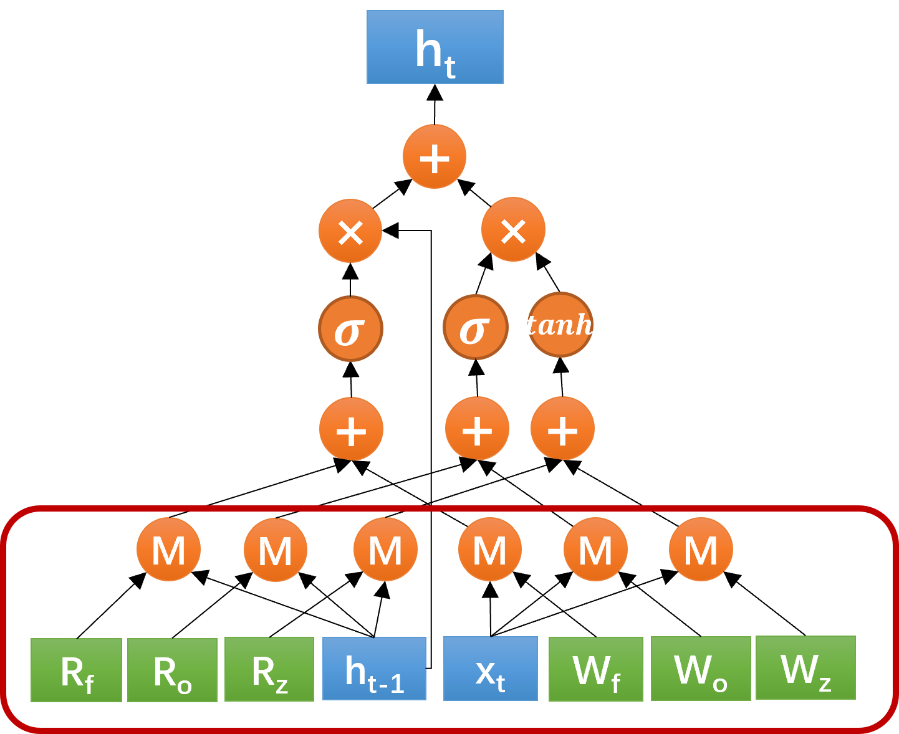
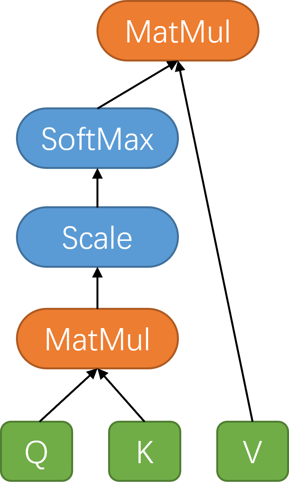

<!--Copyright © Microsoft Corporation. All rights reserved.
  适用于[License](https://github.com/microsoft/AI-System/blob/main/LICENSE)版权许可-->

# 4.1 深度学习的计算模式

在理解深度学习体系结构之前，分析深度学习计算中常见的计算模式或模型结构至关重要。目前，深度学习已经广泛应用在计算机视觉、自然语言处理、语音处理等应用领域中，尽管模型结构在不断的演进，我们仍可以粗略的将大部分深度学习模型归纳为几大类常见的结构，如全连接层（Fully-connected layer）、卷积层（Convolution layer）、循环网络层（Recurrent neral network layer）和注意力层（Attention layer）等。在本节中，我们针对每一类模型结构去分析和总结一下其核心的运算模式。

## 4.1.1 全连接层
全连接层是深度学习模型中最简单也是最常见的一种网络结构，每一层中的一个值就等于前一层所有值的加权求和，权值就是每条对应边上的权值，也是神经网络中需要学习的参数，如图4-1-1所示，第二层中的每一个$y_j$的值就等于

$y_j = \sum_{i=0}^{2}x_iw_{ij}$

因此，一层所有值的计算就可以表示为一个矩阵运算

$Y=W^TX$

其中

$X=
\begin{bmatrix}
x_0\\
x_1\\
x_2\\
\end{bmatrix},
W=
\begin{bmatrix}
w_{0,0} & ... & w_{0,3}\\
w_{1,0} & ... & w_{1,3}\\
w_{2,0} & ... & w_{2,3}\\
\end{bmatrix},
Y=
\begin{bmatrix}
y_0\\
y_1\\
y_2\\
\end{bmatrix}
$.

<center> </center>
<center>图4-1-1. 全连接层示意图</center>

这时，一层全连接层的计算就变成一个矩阵乘以向量的运算，在深度学习的训练或离线推理中，输入层还可以是多个样本的批量输入，这时候一层的计算就可以转化成一个矩阵乘以矩阵的运算。由于矩阵乘法是一个经典的计算，无论是在CPU还是GPU中等有非常成熟的软件库，如MKL，CUBLAS等，因此其可以直接高效的被各种硬件支持。

## 4.1.2 卷积层
卷积神经网络层是在计算机视觉应用中最常见也是各类视觉神经网络中最主要的计算部分。其计算逻辑是将一个滤波器（Filter）在输入矩阵上通过滑动窗口的方式作用整个输入矩阵，在每一个窗口内计算输入数据和滤波器的加权和。如下图左半部分示意的一个简单卷积层计算过程，其中转出举证的元素1是由滤波器中的每个元素和输入矩阵中的元素1、2、4、5所相乘并求和计算所得。

<center> </center>
<center>图4-1-2. 卷积神经网络层（左）和对应的矩阵乘法（右）示意图</center>

为了高效的计算上述过程，卷积层的计算可以通过对输入矩阵的重组而等价变化成一个矩阵相乘的形式，即通过将滤波器滑动窗口对应的每一个输入子矩阵作为新的矩阵的一列，也就是img2col的方法。图4-1-2的右图所示就是对应左图的卷积层通过对输入矩阵重组后的矩阵乘的形式。通过这样的变化，卷积层的计算就可以高效的利用到不同硬件平台上的矩阵加速库了。值得注意的是，这样的矩阵实现在实际中并不一定是最高效的，因为重组的输入矩阵的元素个数比原始矩阵变多了，也就意味着计算过程中要读取更多的数据，同时重组的过程也会引入一次内存复制的开销。为了优化后者，一种隐式矩阵乘法的实现就是在计算过程中在高级存储层中重组矩阵，从而减少对低级内存的访问量。

```
思考：请计算一下通过将卷积算子变化成矩阵乘法后，需要读取的数据量和卷积算子的形状之前的关系，并思考一下，隐式矩阵乘法是如何减少数据访问量的。
```


## 4.1.3 循环网络层
循环神经网络层善于处理序列性的数据，在自然语言处理、语音识别、时序数据分析等应用中广泛采用。循环神经网络层中的主要计算就是其循环单元（Cell）的计算，如图4-1-3展示的是一个常用的GRU单元的计算流图，其中每个图形表示一个算子，M表示矩阵乘算子，其它均为一些轻量的point-wise算子。可以看到，循环神经网络层中的主要计算部分也是矩阵乘法，例如一个GRU单元里的就有6个矩阵乘算子。
<center> </center>
<center>图4-1-3. 循环神经网络层的GRU单元示意图</center>

## 4.1.4 注意力层
注意力机制（Attention）在接循环神经网络之后成为一种被广泛使用在自然语言处理中的模型结构，最近也在计算机视觉等其它应用中取得不错的效果。其核心是建模不同符号（token）之间的联系，如一句话中不同词之间的联系。图4-1-4为注意力机制中最基本的单元的数据流图，可以看到与其它算子的计算量相比，其核心的算子也是矩阵乘算子。
<center> </center>
<center>图4-1-4. 注意力机制层的示意图</center>

## 4.1.5 小结与讨论
通过上述小节对不同的主流模型结构的分类分析，我们发现一个深度学习模型的共同特点，就是大部分模型结构的核心计算模式都可以直接或间接的表示为矩阵乘法。这样的结果虽然有些巧合，但其背后却蕴含着深度学习模型的发展和支持其计算的软硬件发展之间相辅相成的关系。一方面，能够被广泛应用的模型结构必然要能够在现有体系结构中得到比较好的支持，矩阵乘作为经典计算已经被不同平台良好的支持，因此模型的设计者会倾向于尽可能利用这样的软硬件优势。另一方面，模型一旦取得比较好的结果，新的体系结构也会朝着能更好的支持主流模型的方向上发展，这也进一步强化了现有硬件在支持诸如矩阵乘法上的力度，如近年来在GPU上出现的用来加速矩阵乘法的张量核（Tensor Core）就是一个这样的例子。当然，这也不能完全成为深度学习甚至更广泛的机器学习的唯一发展方向，针对其它计算模式的模型设计和体系结构支持都是非常有必要的。为了简单起见，本章节后续内容会以矩阵乘在不同体系结构中的实现和优化作为例子来分析体系结构的变化趋势。

请读者思考，除了矩阵乘法之外，还有哪些你认为深度学习模型中常用到的计算模式或算子呢？ 这些算子在不同的硬件平台上是否有较好的软件库支持呢？

## 参考文献

1. https://www.intel.com/content/www/us/en/develop/documentation/get-started-with-mkl-for-dpcpp/top.html

2. https://developer.nvidia.com/cublas

3. https://en.wikipedia.org/wiki/Toeplitz_matrix#Discrete_convolution

4. https://docs.nvidia.com/deeplearning/performance/dl-performance-convolutional/index.html

5. https://en.wikipedia.org/wiki/Recurrent_neural_network

6. [BERT: Pre-training of Deep Bidirectional Transformers for Language Understanding](https://arxiv.org/abs/1810.04805)

7. [Attention Is All You Need](https://arxiv.org/abs/1706.03762)
