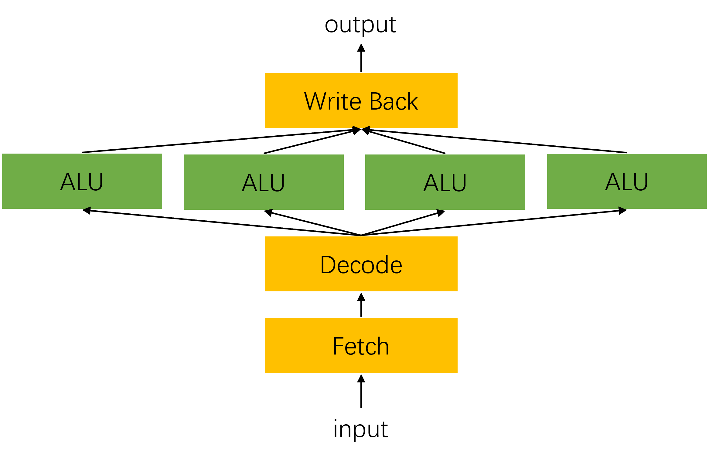
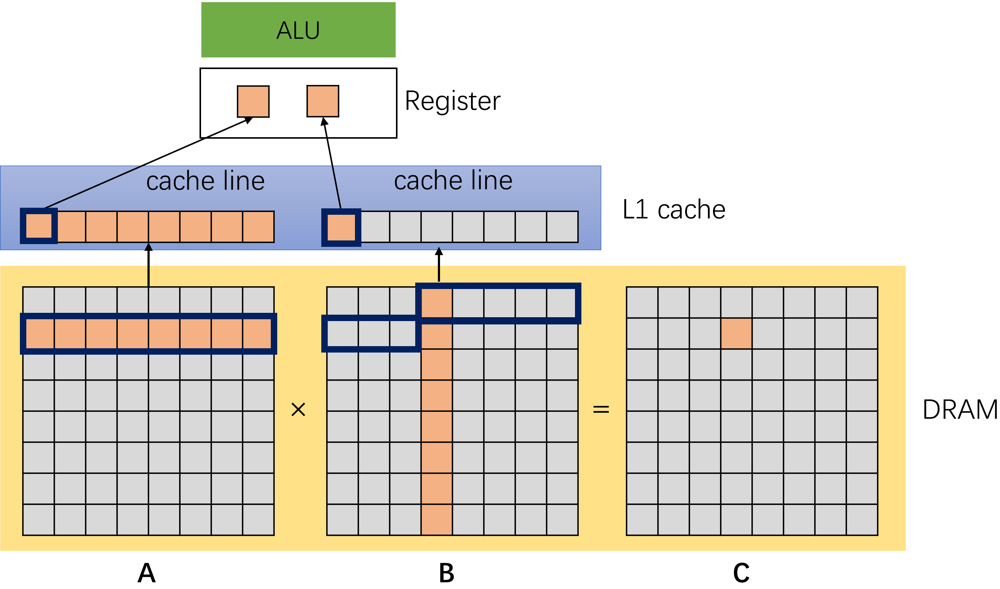
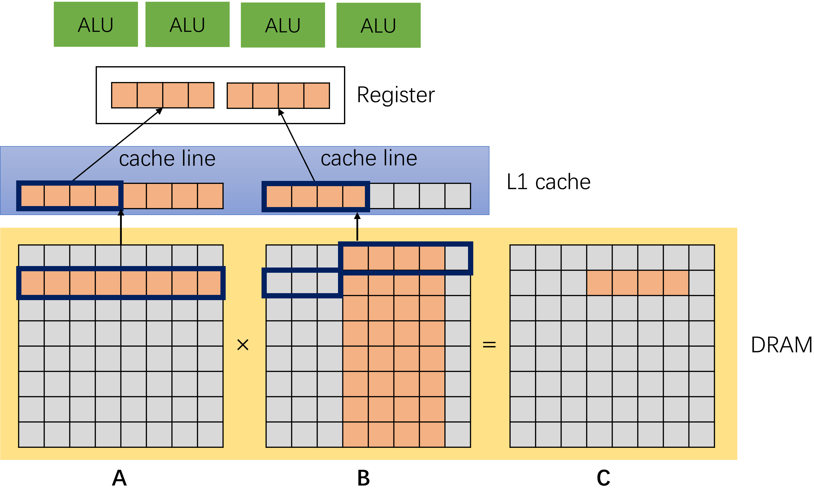
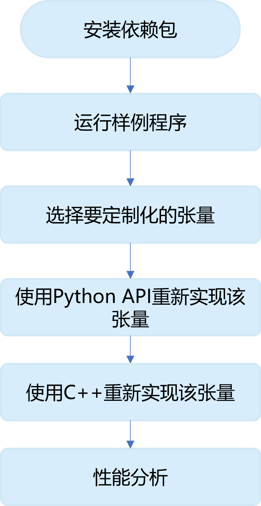

<!--Copyright © Microsoft Corporation. All rights reserved.
  适用于[License](https://github.com/microsoft/AI-System/blob/main/LICENSE)版权许可-->

# 4.2 计算机体系结构与矩阵运算

前面一节我们了解到现在主流深度学习的一个核心计算模式就是矩阵运算，高效地支持矩阵运算便成了深度学习时代体系结构和性能优化的一个重要课题。我们知道，硬件的设计需要针对主流应用的特点仔细的考虑其计算、存储、并行度、功耗等等方面的配比，才能发挥其了优的性能。在本节中，我们以CPU为主来理解其基本体系结构、发展趋势和在支持深度学习上的优势及不足。

## 4.2.1 CPU体系结构
CPU体系结构并不是针对计算密集型任务而设计的，其主要支持的计算是如何高效地执行通用程序，为了能够灵活地支持不用类型的计算任务，一个CPU核上需要引入较为复杂的控制单元来优化针对动态程序的调度，由于一般的计算程序的计算密度低，因此，CPU核上只有较少量的算术逻辑单元（ALU）来处理数值类型的计算，如图4-2-1左部分所示。在CPU核上执行一条计算执行需要经过一个完整的执行流水线，包括读取指令、译码、在ALU上计算结果、和写回，如图图4-2-1右半部分所示，在整个流水线上，大量的时间和功耗都花在了ALU之外的非计算逻辑上。由于需要计算的数据一般存储在主存中，其访存延时往往和计算延时有数量级的差距，直接从主存中访问数据并计算会导致计算单元利用率极低，因此，为了加快访存速度，一般会在主存和寄存器之间加上多层缓存层。

<center> </center>
<center>图4-2-1. CPU体系结构和指令执行流程示意图</center>

这样的结构针对通用的计算机程序有较高的灵活性，但是处理深度学习中的大部分运算时，性能和单位功耗的算力都相对较低。为了提升CPU的性能，新的CPU主要从以下几个方面提升性能：
  * 在单核上增加指令并发执行能力：通过乱序执行互不依赖的指令，重叠不同指令的流水线，从而增加指令发射吞吐；
  * 增加多核并发处理能力：通过多核并发执行增加并行处理能力，这需要依赖操作系统将应用程序调度到多核上，或者依赖用户的程序中显式使用多线程进行计算；
  * 在单核上增加向量化处理能力：允许CPU在向量数据上执行相同的指令，也就是针对一条指令的取指和译码可以对多个数据同时执行，如图4-2-2所示，从而大大增加CPU的计算效率。向量化计算需要用户程序中显示使用向量化指令来实现。

<center> </center>
<center>图4-2-2. CPU中的向量化指令执行示意图</center>

## 4.2.2 CPU实现高效计算矩阵乘
现在，我们通过新自实现一个简单的矩阵乘法，来理解体系结构中的设计特点和优化方法。假设我们在CPU上计算一个矩阵乘法

$C=A\times B$

，其中$A=[M,K], B=[K,N]$。一种最简单直接的实现方法就是通过三重循环计算每一个$C$中的元素，如下述代码所示：
```
for (int i = 0; i < M; i++) {
  for (int j = 0; j < N; j++) {
    C[i, j] = 0;
    for (int k = 0; k < K; k++>) {
      C[i, j] += A[i, k] * B[k, j];
    }
  }
}
```
然而，这样的实现方式往往不能发挥CPU的最佳性能，我们通过下面的示意图来了解在计算过程中的内存访问情况，并分析这里面的潜在性能欠优化的地方。图4-2-3展示了上述简单算法在各个内存层中的情况，首先，我们假设在寄存器和主存之间只有一层缓存层（L1 cache），其缓存访问宽度为8个元素（cache line）。因此，当计算C中的一个元素时，我们需要分别访问A和B中对应的一个元素，这时在L1缓存中就会访问元素相应的一个缓存线（即8个元素）。随着在K维的循环变量k的增长，对于矩阵A来说，接下的元素访问都刚好在缓存中，因此速度会非常快。然后，对于B矩阵，由于下一个元素刚好在下一个缓存线中，于是又需要从主存中访问8个新的元素，这将会成为整个计算过程的瓶颈。除此之外，每次循环只访问计算C中的一个元素，如前面所介绍，每条计算指令都需要完整的流水线操作，花费较大的时间和功耗开销。这些都简单实现方法中存在的性能问题的原因。

<center> </center>
<center>图4-2-3. 简单方法实现的矩阵乘法访存示意图</center>


```
思考：解决上述B矩阵缓存的问题，可否通过将B矩阵转置来实现呢？
```
为了优化上述低效问题，我们需要从以下两个方面优化矩阵的性能：
 * 通过更好的利用缓存来增加访存效率
 * 通过使用向量化指令来增加计算吞吐

首先，为了更好的利用缓存，我们可以一次性计算C中的连续多个元素，如图4-2-4所示，这样每次针对B矩阵的访存就可以缓存中被多次利用。其次，为了降低每次计算的指令开销并增加计算吞吐，我们可以通过向量化指令一次同时计算多个元素。这样优化后，在一个CPU核上的计算性能就可以提到较大的提升。

<center> </center>
<center>图4-2-4. 简单方法实现的矩阵乘法访存示意图</center>

然而，在实际的实现优化中，我们还需要考虑到更多层缓存的重用，因此实际中往往需要将A和B矩阵划分成合适大小的块，使得最终的访问性能刚好达到最大硬件性能。除了块优化和向量化指令，一个高效的矩阵乘还需要进一步考虑其它与硬件相关的优化，包括如何高效的划分计算使得其能更好利用多核的并行性，如何上访存和计算做到更好的重叠，等等。所幸的是，由于CPU上的软件库的发展已经相对成熟，我们在深度学习框架里实现矩阵乘算子是可以直接调用现有的BLAS库，如Intel的Math Kernel Library （MKL)。

## 4.2.3 实验：在CPU上实现一个矩阵乘法算子

### 实验目的
1.	理解深度学习框架中的张量算子的原理
2.	基于不同的优化方法实现新的张量运算，并比较性能差异

### 实验原理

1. 深度神经网络中的张量运算原理
2. PyTorch中基于Function和Module构造张量的方法
3. 通过C++扩展编写Python函数模块

### 实验内容与具体步骤

<center> </center>
<center>图4-2-4.实验流程图</center>


1.	在MNIST的模型样例中，选择线性层（Linear）张量运算进行定制化实现

2.	理解PyTorch构造张量运算的基本单位：Function和Module

3.	基于Function和Module的Python API重新实现Linear张量运算
    1. 修改MNIST样例代码
    2. 基于PyTorch  Module编写自定义的Linear 类模块
    3. 基于PyTorch Function实现前向计算和反向传播函数
    4. 使用自定义Linear替换网络中nn.Linear() 类
    5. 运行程序，验证网络正确性
   
4.	理解PyTorch张量运算在后端执行原理

5.	实现C++版本的定制化张量运算

    1. 基于C++，实现自定义Linear层前向计算和反向传播函数，并绑定为Python模型
    2. 将代码生成python的C++扩展
    3. 使用基于C++的函数扩展，实现自定义Linear类模块的前向计算和反向传播函数
    4. 运行程序，验证网络正确性
   
6.	使用profiler比较网络性能：比较原有张量运算和两种自定义张量运算的性能

7.	【可选实验，加分】通过矩阵乘法实现卷积层（Convolutional）的自定义张量运算


### 参考代码

1.	基于Python API实现定制化张量运算Linear

    代码位置：https://github.com/microsoft/AI-System/blob/main/Labs/BasicLabs/Lab2/mnist_custom_linear.py

    运行命令：`python mnist_custom_linear.py`

2.	基于C++ API实现定制化张量运算Linear

    代码位置：https://github.com/microsoft/AI-System/blob/main/Labs/BasicLabs/Lab2/mnist_custom_linear_cpp.py

    运行命令：
    ```
    cd mylinear_cpp_extension
    python setup.py install --user
    cd ..
    python mnist_custom_linear_cpp.py
    ```

## 小结与讨论
通过本章的学习我们了解到了CPU体系结构的基本原理，以学习了如何在CPU上实现一个简单的矩阵运算，进一步根据CPU中的访存特点，我们也针对该算法进行了优化。最后，通过实验的练习我们知道如何将一个实现好的矩阵乘法最终应用到一个深度学习框架中。

思考：请列举一些你能想到的其它CPU体系结构特点，以及思考这些特点对矩阵乘法甚至其它运算带来的好处和影响。

## 参考文献

1. https://en.wikipedia.org/wiki/Computer_architecture

2. https://en.wikipedia.org/wiki/Advanced_Vector_Extensions

3. https://en.wikipedia.org/wiki/Streaming_SIMD_Extensions

4. https://www.intel.com/content/www/us/en/develop/documentation/get-started-with-mkl-for-dpcpp/top.html

5. https://developer.nvidia.com/cublas

6. https://pytorch.org/docs/master/notes/extending.html
