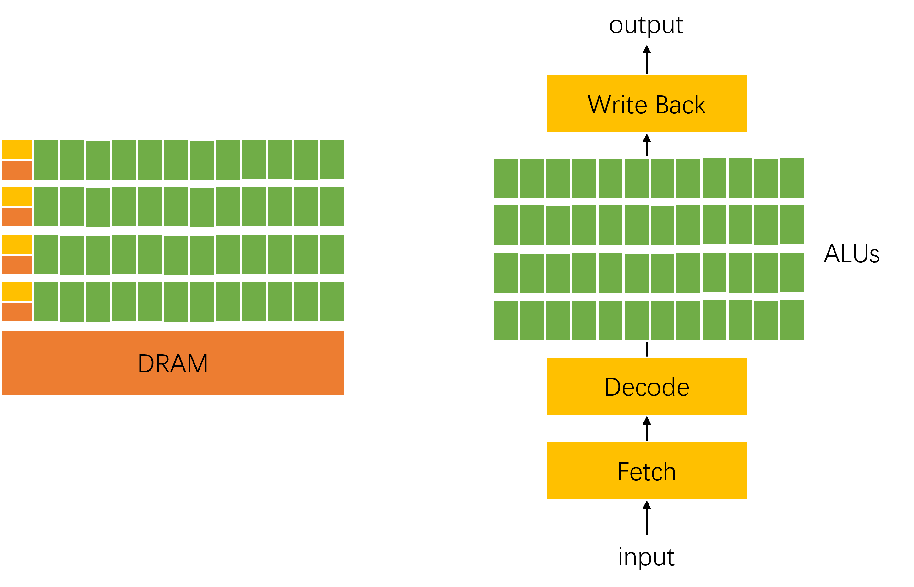
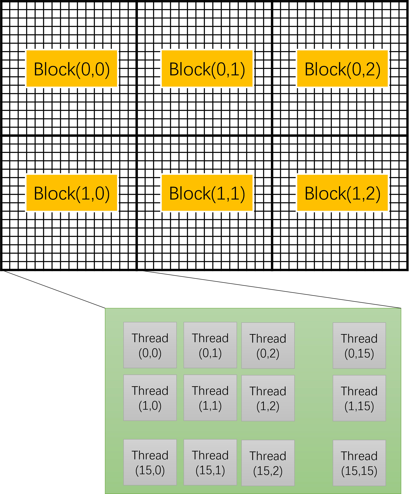
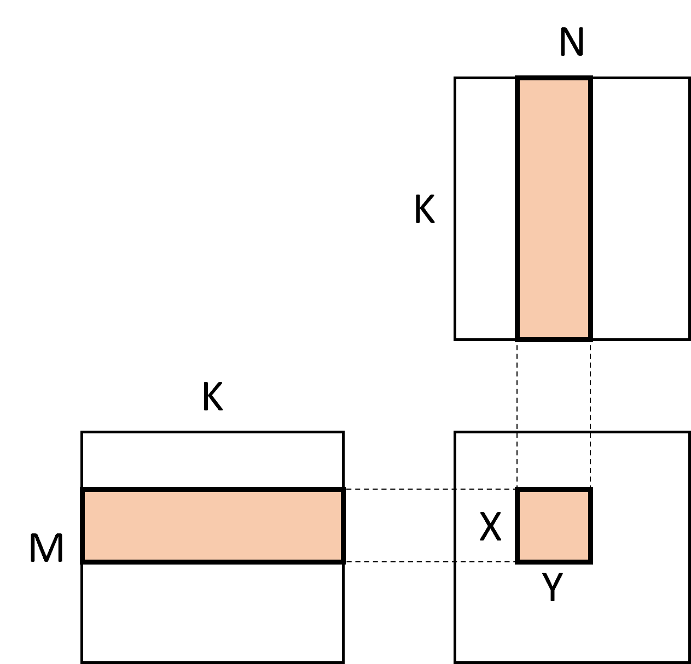

# 4.3 GPU体系结构与矩阵计算
深度学习的方法作为机器学习一个重要的分支真正的兴起离不开GPU（Graphics Processing Units）的支撑，相比于CPU，GPU可以提供更加强大的算力，从而让早期的深度学习模型能够快速取得最前沿的水平，尽管GPU的设计初衷不是为了深度学习任务。本节中，我们试图从深度学习负载的角度去理解一下GPU为什么相比于CPU更适合深度学习的计算任务，其体系结构做了哪些取舍，以及其未来发展和优化的趋势。

## 4.3.1 GPU体系结构
与CPU相比，GPU的体系架构中的一个最大特点就是增加了大量的运算单元ALU，如图4.3.1所示。通常GPU的一个处理器（也叫做流式多处理器，Streaming Multiprocessor）包括数十甚至上百个简单的计算核，整个GPU可以达到上千个核。与CPU相比，每个核的结构简单了很多，通常不支持一些CPU中使用的较为复杂的调度机制。GPU早期主要是为了做图形处理和渲染而提出的，由于图形渲染需要大量的并行计算能力，而GPU的并行度，也恰恰好给像矩阵计算这样的任务提供了较好的并行计算能力，因此，以英伟达GPU为例，很快推出了通用计算能力（如CUDA编程模型），深度学习的计算也是利用了GPU的通用计算能力。

<center> </center>
<center>图4-3-1. GPU体系结构和指令执行流程示意图</center>

在执行指令的时候，为了充分利用每一次读取指令带来的开销，GPU会以一组线程为单位同时执行相同的指令，即SIMT（单指令多线程）的方式，如图4-3-1右半部分所示。在CUDA GPU上，一组线程称为warp，一个warp有32个线程，每个线程执行相同的指令但访问不同的数据。

## 4.3.2 GPU编程模型

为了方便有效地利用GPU的多核并行性，在GPU上编写程序需要按照特有的编程模型。本节中以CUDA GPU为例介绍CUDA编程模型，但其基本概念可以无缝的映射到其它GPU上的编程模型，如ROCM的HIP模型。为了将一个并行程序映射到GPU的多级并行度上，CUDA中首先将一组线程（通常不超1024个）组成一个线程块（block），每个线程块中的线程又可以分成多个warp被调度到GPU核上执行，一个线程块可以在一个SM上运行。多个线程块又可以组成一个网格（grid）。线程块和网格分别通过一个3维整数类型描述其大小(`blockDim`和`gridDim`)，每个线程都可以通过`threadIdx`和`blockIdx`来确定其属于哪个线程块以及哪个线程，如图4-3-2展示了一个线程块为$[16\times 16]$，网格为$[2\times 3]$的CUDA程序配置。

<center> </center>
<center>图4-3-2. CUDA的线程块和网格示意图</center>


## 4.3.3 GPU实现一个简单的计算

为了更加具体的理解如何编写一个GPU程序，我们首先实现一个计算两个矩阵的加法的程序，这也是深度学习框架中经常用到的Add算子的简化版。假设我们要计算矩阵$C=A+B$，其中三个矩阵的形状均为$[512 \times 512]$。首先，我们实现一个在GPU上执行的内核，也就是一个thread要计算的逻辑，在本例中，我们让每个线程计算$C$中的一个元素，如下面代码所示。
```
// kernel definiation
__global__ void add_kernel(float *A, float *B, float *C) {
    int i = blockIdx.x * blockDim.x + threadIdx.x;
    int j = blockIdx.y * blockDim.y + threadIdx.y;
    C[i * 512 + j] = A[i * 512 + j] + B[i * 512 + j];
}
```
上述代码第一行定义了内核函数的参数，第二行和第三行分别通过计算当前线程的索引而计算出其对应处理的元素的坐标，第四行则读取对应坐标的元素、计算并写回。
有了内核函数之后，我们还需要有一个启用内核函数的代码，如下图所示：
```
int main {
    float* A = ...;
    float* B = ...;
    float* C = ...;
    dim3 blocks(16, 16);
    dim3 threads_per_block(32, 32);
    add_kernel<<<blocks, threads_per_block>>>(A, B, C);
    ...
}
```

在上述代码中，我们首先定义了对变量A、B、C赋值相应三个矩阵在GPU中的地址，这一步一般可以通过`CudaMalloc`函数GPU中申请内存并通过复制CPU中初始化后的值到相应的地址。接下来，定义网格和线程块的大小，这里我们让每个线程块使用1024个线程，也就是$32\times 32$，然后一共使用256个（即$16\times 16$）个线程块来完成这两个矩阵的加法，最后，只需要按照相应的配置调用上面实现的内核函数即可将整个计算调度到GPU上执行。

通过上述例子，我们不难理解GPU上的编程模型在处理并行计算上的简单和高效性。然而，我们现在回过头考虑深度学习中最常用的矩阵乘法算子在GPU上的实现时，除上像在CPU上的一些优化扩展到GPU上时，我们还有哪些优化可以做呢？首先，在GPU上计算矩阵乘法，我们首先也需要将整个计算划分成不同的线程块，进而并行的调度在不同的SM上，例如我们可以将C矩阵划分成相同大小的子矩阵，每个线程块负责计算一个子矩阵即可。其次，和在CPU上的计算一样，我们要充分让内存访问的宽度和访存宽度对齐，同时让计算的数据大小和线程数（如warp数）对齐，这样才能最大化发挥硬件性能。最后，和CPU不一样的是，GPU上每个SM通过有一块共享内存（Shared memory）可供所有线程共享访问和存储数据，其访问延时基本和L1缓存接近，因此，我们可以利用该内存来做进一步的计算优化。

<center> </center>
<center>图4-3-3. 矩阵乘划分块的示意图</center>

上图示意了一个矩阵乘法时，计算一个子矩阵$X\times Y$所依赖的输入数据。由于矩阵乘中每次计算都是一个乘加计算，我们不难算出，计算整个矩阵乘法所需要的总体浮点计算量（FLOPS）为$2MNK$，如果每次以$X\times Y$为单位去计算和读取相应的输入数据，那么总得内存读取量为$MNK(1/X+1/Y)$，因此，该程序的计算量和内存读取量的比为$2XY/(X+Y)$，也就是每从内存中读取一个数的就可以做$2XY/(X+Y)$次浮点运算，且$X$和$Y$越大该比例越大。因此，我们可以根据具体GPU的硬件配置选取合适的子矩阵大小，每次在共享内存中读取、存放和计算一个子矩阵，从而充分发挥整个硬件的性能。由于GPU一般每秒种的浮点计算量要远大于内存带宽，通常子矩阵越大越好。
同理，上述计算和优化方法可以应用到每一级可以控制的内存层中，包括寄存器中。除了上述优化之外，在GPU中实现一个高性能的矩阵乘还需要考虑其它优化，如bank冲突的优化、软件流水线隐藏访存延时、硬件指令（如Tensor Core）的利用等等。
