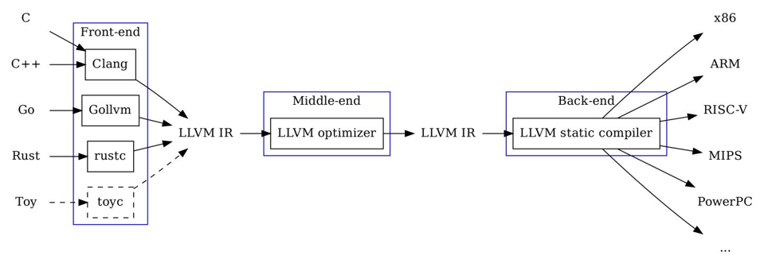
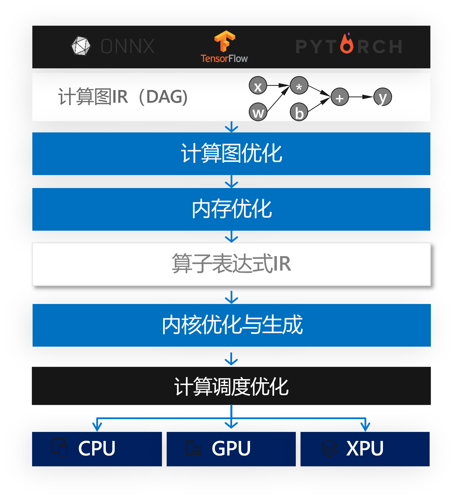
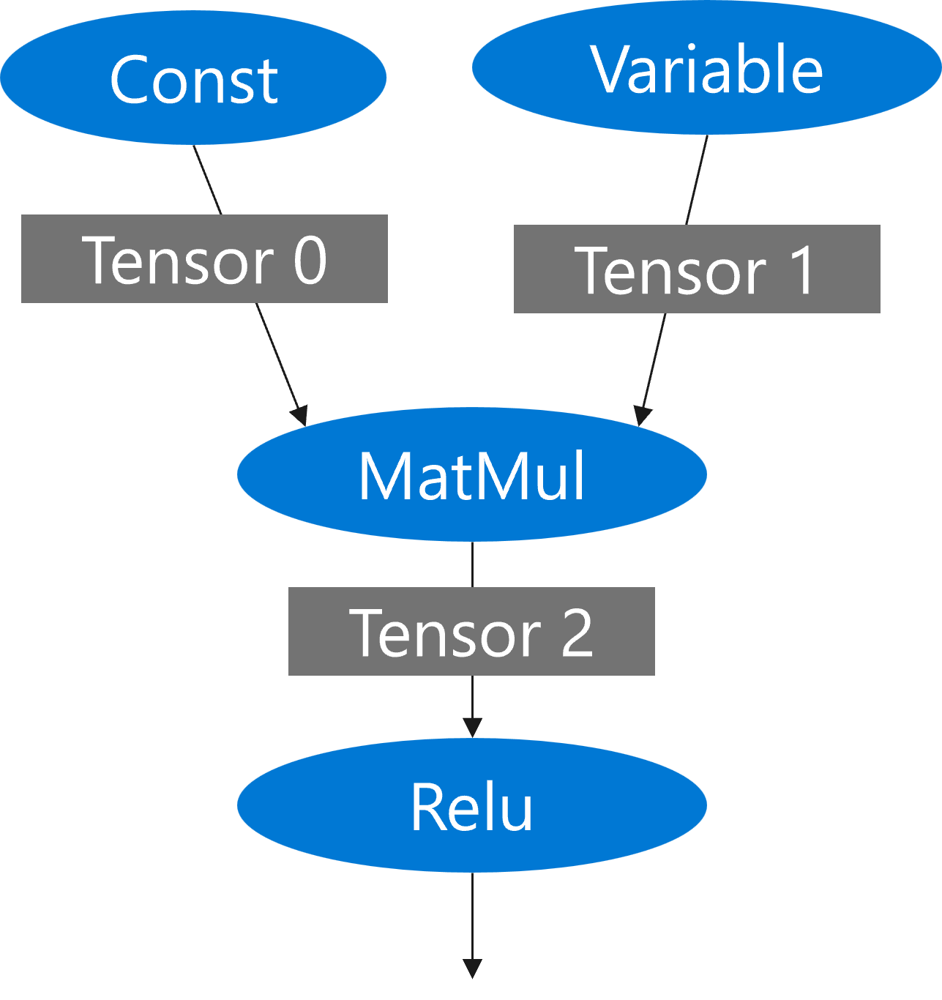
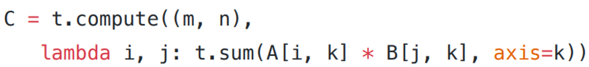

<!--Copyright © Microsoft Corporation. All rights reserved.
  适用于[License](https://github.com/microsoft/AI-System/blob/main/LICENSE)版权许可-->

# 5.1 深度神经网络编译器

- [5.1 深度神经网络编译器](#51-深度神经网络编译器)
  - [5.1.1 前端](#511-前端)
  - [5.1.2 后端](#512-后端)
  - [5.1.3 中间表达](#513-中间表达)
  - [5.1.4 优化过程](#514-优化过程)
  - [小结与讨论](#小结与讨论)
  - [参考文献](#参考文献)

编译器（compiler）在计算机语言编译中往往指一种计算机程序，它会将某种编程语言写成的源代码（原始语言）转换成另一种编程语言（目标语言），在转换的过程中进行的程序优化就是编译优化过程。图5-1-1展示了经典计算机程序语言中较成功的开源编译框架项目LLVM的编译过程示意图。


<center> </center>
<center>图5-1-1. 深度神经网络编译器架构图</center>

随着深度学习的应用场景的不断泛化，深度学习计算任务也需要部署在不同的计算设备（如服务器，个人电脑，手机，手表，机器人等）和不同的硬件架构上（如X86, ARM, RISC-V等）；同时，实际部署或训练场景对性能往往也有着更为激进的要求，例如一个大规模的上线部署的模型在计算性能上的优化可以直接转换为计算成本的节省，同时，对深度学习任务来说，性能的优化能够为算法提供更大的空间，从而能让算法开发人员在合理的时间内尝试更大或更复杂的模型。这些需求在通用的深度学习计算框架中已经难已得到满足。由于深度学习计算任务在现有的计算框架中往往以DSL（Domain Specific Language）的方式进行编程和表达，这本身使得深度学习计算任务的优化和执行天然符合传统计算机语言的编译和优化过程。因此，与传统程序语言编译器类似，深度神经网络编译器的提出主要是解决多种设备**适配性**和**性能优化**的问题。具体来说，深度神经网络编译就是将当前的深度学习计算任务通过一层或多层中间表达进行翻译和优化，最终转化成目标硬件上的可执行代码的过程。

<center> </center>
<center>图5-1-2. 深度神经网络编译器架构图</center>

图5-1-2展示了一个典型的深度神经网络编译器架构图。与传统编译器类似，深度神经网络编译器也分为前端（Frontend）、后端（Backend）、中间表达（Intermediate Representation, IR）和优化过程（Optimizaiton Pass）等。

## 5.1.1 前端
深度神经网络编译器的前端一般共享深度学习框架的前端表达，如TensorFlow和PyTorch，即一般为基本Python的DSL（Domain Specific Language）。这样的编程语言中的基本数据结构一般为张量（Tensor），用来描述由基本数据类型（如int, float, string等）元素构成的高维的数组，其元数据可以由一个元素类型和张量形状（如[128, 512]）来表示。在张量上进行的基本计算操作称作算子（Operator），通常为一些基本的线性代数计算组成，如矩阵乘法、向量加减乘除等。图5-1-3列举了一些深度学习计算中常用的算子。
<!-- 
<center> </center>
<center>图5-1-3. 深度学习计算中常用的算子</center> -->

| | | |
|---|---|---|
|Add|Log|While|
|Sub|MatMul|Merge|
|Mul|Conv|BroadCast|
|Div|BatchNorm|Reduce|
|Relu|Loss|Map|
|Tanh|Transpose|Reshape|
|Exp|Concatenate|Select|
|Floor|Sigmoid|.....|
<center>图5-1-3. 深度学习计算中常用的算子</center>


基于张量和基本算子，当前深度学习框架一般利用Python作为胶水语言，把一个深度学习的计算模型描述成一系列算子的操作。图5-1-4展示了一个简单的MNIST训练模型在PyTorch中的实现。
```
class Net(nn.Module):
  def __init__(self):
    super(Net, self).__init__()
    self.conv1 = nn.Conv2d(1, 32, 3, 1)
    self.conv2 = nn.Conv2d(32, 64, 3, 1)
    self.dropout1 = nn.Dropout2d(0.25)
    self.dropout2 = nn.Dropout2d(0.5)
    self.fc1 = nn.Linear(9216, 128)
    self.fc2 = nn.Linear(128, 10)

  def forward(self, x):
    x = self.conv1(x)
    x = F.relu(x)
    x = self.conv2(x)
    x = F.relu(x)
    x = F.max_pool2d(x, 2)
    x = self.dropout1(x)
    x = torch.flatten(x, 1)
    x = self.fc1(x)
    x = F.relu(x)
    x = self.dropout2(x)
    x = self.fc2(x)
    output = F.log_softmax(x, dim=1)
    return output
```
<center>图5-1-4. 一个简单的MNIST训练模型的PyTorch实现</center>

## 5.1.2 后端
深度神经网络编译器的后端指最终变化后的代码要执行的设备或神经网络加速器，目前常见的支持深度学习的计算设备有CPU、GPU、FPGA、TPU等其它专用加速器。不同的类型的计算设备往往采用完全不同的芯片架构，从而对应的编程模型和优化也完全不同。如CUDA GPU采用的是多个并行的流式处理器（Streaming Multiprocessor）和共享内存的架构，在GPU上执行的代码需要符合SIMT（Single Instruction Multiple Threads）的计算模型；而CPU一般采用的是多核架构，以及多线程模型（如线程池）来实现高性能的计算任务。更进一步，尽管是相同类型的设备，不同的型号都会有不同的硬件参数，如内存大小、算力、带宽等，这些参数都会极大的影响编译优化过程。

## 5.1.3 中间表达
从前端语言到后端代码的编译过程，和传统编译器类似，需要经过若干中间表达（Intermediate Representation, IR）。目前在神经网络编译器中较为常用的中间表达主要包括计算图（DAG）和算子表达式等。计算图作为连接深度学习框架和前端语言的主要格式，也是标准化深度学习计算模型的常用格式，如ONNX格式即为一种深度学习模型的标准可交换格式，目前主流框架如TensorFlow和PyTorch的大部分程序都可以被转换或导出成ONNX格式。除此之个，每个DNN编译器也会定义自己的计算图格式，一般这些计算图都可以进行等价互相转换。计算图的节点是算子，边表示张量，所有的节点和边构成一张有向无坏图，节点之间的依赖关系表示每个算子的执行顺序。图5-1-5为一个简单的计算图示例。
<center> </center>
<center>图5-1-5. 一个简单的计算图示例</center>

除计算图之外，在将算子继续向下转换到下层并生成设备代码时，算子表达式（Tensor Expression）作为另一类中间表达被广泛使用在不同的神经网络编译器中，如TVM、Ansor、Tensor Comprehension等。算子表达式的主要作用是描述算子的计算逻辑，从而可以被下层编译器进一步翻译和生成目标设备的可执行代码。图5-1-6展示了TVM中的算子表达式形式，其表达了一个矩阵乘法算子的计算逻辑。关于算子表达式的具体含义和用法将会在第5.3章中详细介绍。

<!-- <center> </center>
<center>图5-1-6. TVM中的算子表达式示例</center> -->


```python
C = t.compute((m, n),
    lambda i, j: t.sum(A[i, k] * B[j * k], axis = k)
```
<center>图5-1-6. TVM中的算子表达式示例</center>

## 5.1.4 优化过程

最后，深度神经网络编译器的优化过程（Optimization Pass）是构成整个编程器的最核心部分，是定义在每一种中间表达上的函数，其输入是某一种中间表达，经过一系统优化和变化过程，输出一个新的被优化过后的中间表达。如在计算图上就有非常多的经典优化过程，如常数传播、公共子表达式消除等，这些过程对输入的计算图经过一系列等价变化从而输出新的计算图。也有一些优化过程是将一个高层的中间表达翻译到低层的中间表达，甚至最终的可执行代码。这些优化过程又可分为设备相关和设备无关的优化。在本书中，重点介绍四个类型的优化过程，分别是：计算图优化、内存优化、内核优化和调度优化。我们将在接下来的小节中分别进行详细介绍。


## 小结与讨论

本章我们主要围绕深度神经网络编译器展开，介绍了其前端，后端，中间表达和优化过程。

请读者思考神经网络编译器和传统编译器的异同点？

## 参考文献

1. https://gcc.gnu.org/

2. The LLVM Compiler Infrastructure: https://llvm.org/

3. LLVM IR and Go: https://blog.gopheracademy.com/advent-2018/llvm-ir-and-go/

4. TVM. https://tvm.apache.org/

5. [Ansor : Generating High-Performance Tensor Programs for Deep Learning](https://arxiv.org/abs/2006.06762)

6. https://github.com/facebookresearch/TensorComprehensions

7. https://en.wikipedia.org/wiki/Graphics_processing_unit

8. https://cloud.google.com/tpu
