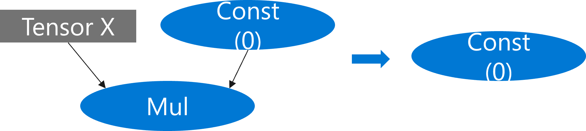
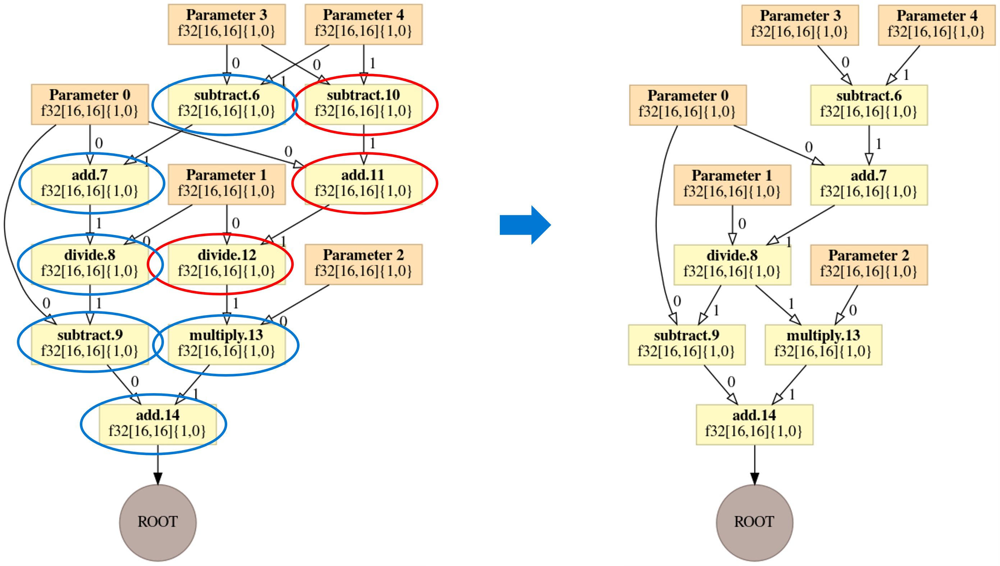
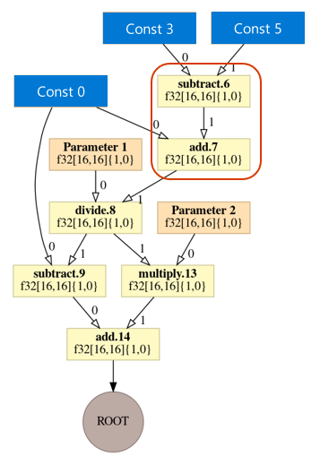
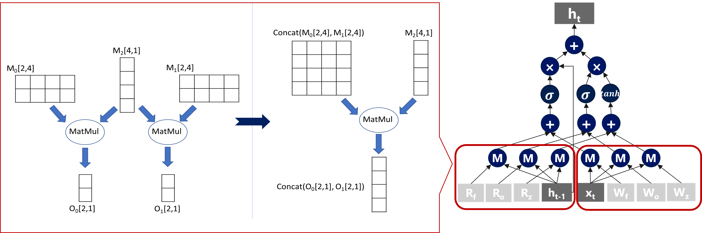
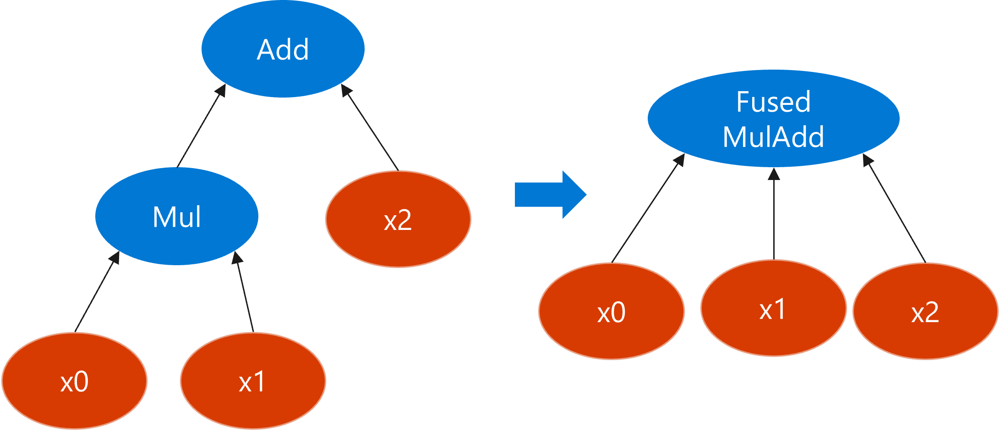
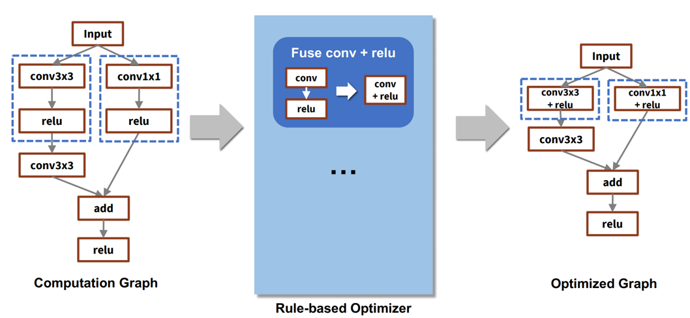

<!--Copyright © Microsoft Corporation. All rights reserved.
  适用于[License](https://github.com/microsoft/AI-System/blob/main/LICENSE)版权许可-->

# 5.2 计算图优化

- [5.2 计算图优化](#52-计算图优化)
  - [5.2.1 算术表达式化简](#521-算术表达式化简)
  - [5.2.2 公共子表达式消除](#522-公共子表达式消除)
  - [5.2.3 常数传播](#523-常数传播)
  - [5.2.4 矩阵乘自动融合](#524-矩阵乘自动融合)
  - [5.2.5 算子融合](#525-算子融合)
  - [5.2.6 子图替换和随机子图替换](#526-子图替换和随机子图替换)
  - [小结与讨论](#小结与讨论)
  - [参考文献](#参考文献)


正如上一节介绍到，计算图作为连接深度学习框架和前端语言的主要中间表达，被目前主流框架如TensorFlow和PyTorch所使用或者作为标准文件格式来导出模型。
计算图是一个有向无环图（DAG），节点表示算子，边表示张量或者控制边（control flow），节点之间的依赖关系表示每个算子的执行顺序。

计算图的优化被定义为作为在计算图上的函数，通过一系列等价或者近似的优化操作将输入的计算图变换为一个新的计算图。其目标是通过这样的图变换来化简计算图，从而降低计算复杂度或内存开销。在深度神经网络编译器中，有大量优化方法可以被表示为计算图的优化，包括一些在传统程序语言编译器中常用的优化方法。图5-2-1中列举了一些常见的图优化方法，本节会围绕这几种不同类型的优化作一个简要介绍。

<center> </center>
<center>图5-2-1. 深度神经网络编译器中常见的计算图优化方法</center>

## 5.2.1 算术表达式化简
一类最常见的计算图优化就是算术表达式化简，在计算图中的一些子图所对应的算术表达式，在数学上有等价的化简方法来简化表达式，这反应在计算图上就是将子图转化成一个更简单的子图（如更少的节点），从而降低计算量。如图5-2-2展示了一个利用算术表达式化简计算图的例子，左边的子图包含了两个算法：Const算子（返回元素值为0的常量张量）和Mul算子（计算两个相同形状的算子的元素乘积），通过表达式化简，这个子图可以直接被化简成右边的只包括Const算子的子图。表5-2-1列举了一些常见的算术表达式化简规则，其中X和Y表示张量，0和1表示常量张量，其它操作符均对应张量上的算子。

<center> </center>
<center>图5-2-2. 一个利用算术表达式化简计算图的例子</center>

<center>

| 变化前 | 变换后 | 
| :-----| ----: | 
| X * 0 | 0 | 
| X * Broadcast(0) | Broadcast(0)| 
| X * 1 | X |
| X * Broadcast(1) | X |
| X + 0 | X |
| X + Broadcast(0) | X |
| Log(Exp(X)/Y) | X - Log(Y) |
</center>
<center>表5-2-1. 一些常见的算术表达式化简规则</center>

## 5.2.2 公共子表达式消除
公共子表达式消除（Common Subexpression Elimination, CSE）也是经典编译优化中常用的优化。其目的是通过找到程序中等价的计算表达式，然后通过复用结果的方式消除其它冗余表达式的计算。同理，在计算图中，公共子表达式消除就等同于寻找并消除冗余的计算子图。一个简单的实现算法是按照图的拓扑序（保证一个访问一个节点时，其前继节点均已经访问）遍历图中节点，每个节点按照输入张量和节点类型组合作为键值进行缓存，后续如果有节点有相同的键值则可以被消除，并且将其输入边连接到缓存的节点的输入节点上。如图5-2-3为一个公共子表达式消除的示例，图左边蓝色椭圆中的节点为不在缓存中的节点，也就是必须要执行的节点，而红色椭圆中的节点的计算和前面蓝色节点的计算重复，也就是其键值可以被缓存到，因此可以安全的消除这些节点，于是最终左边的计算图可以被优化成右边的计算图。

<center> </center>
<center>图5-2-3. 公共子表达式消除的示例</center>

## 5.2.3 常数传播
常数传播（constant propagation）就叫常数折叠（constant folding），也是经典编译优化中的常用优化，其主要方法是通过在编译期计算出也是常数表达式的值，用计算出的值来替换原来的表达式，从而节省运行时的开销。在计算图中，如果一个节点的所有输入张量都是常数张量的话，那么这个节点就可以在编译期计算出输入张量，并替换为一个新的常数张量。如图5-2-4为一个常数传播的示例，其中红色方框内的两个节点都可以被提前计算出来，因皮可以在编译期优化掉。值得注意的是，常数传播需要编译器具有计算的能力，甚至对于一些较大的算子还需要能够在加速硬件上（如GPU）上计算，否则优化的过程就会非常的慢。常数传播的优化在深度学习尤其是模型推理的时候非常有用，因为在推理时，模型中的参数张量全部固定为常数张量，大量计算可以在编译期计算好，极大的化简了推理运算时的计算开销。但时，在深度学习的场景中，常数传播有时候也会带来否优化，如增加计算内存甚至计算时间，一个典型的例子就是一个标量常数张量后面跟一个Broadcast的算子时，如果做了常数传播就会增加内存占用，如果后面是访存密集型的算子的话，也会增加内存压力，从而增加计算时间。

<center> </center>
<center>图5-2-4. 常数传播的示例</center>

## 5.2.4 矩阵乘自动融合
矩阵乘在深度学习计算图中被广泛应用，如常见的神经网络的线性层、循环神经网络的单元层、注意力机制层等都有大量的矩阵乘法。在同一个网络里，经常会出现形状相同的矩阵乘法，根据一些矩阵的等价规则，如果把些矩阵乘算子融合成一个大的矩阵乘算子，可以更好的利用到GPU的算力，从而加速模型计算。图5-2-5为其中一种常见的矩阵乘自动融合的示例，其中，如果有两个矩阵乘法共享同一个输入张量（图中方框内左侧），我们就可以自动把另个的两个输入张量拼接成一个大的矩阵乘算子（图中方框内右侧），其计算的结果刚好是原算子计算结果的拼接。利用这种规则，图中最右侧的GRU网络中的两组矩阵乘算子可以分别融合成两个大的矩阵乘算子。类似的融合规则还有BatchMatMul，可以把两个相同形状的矩阵拼接成一个新的BatchMatMul算子。

<center> </center>
<center>图5-2-5. 矩阵乘自动融合的示例</center>

## 5.2.5 算子融合
上小节中介绍的算子融合方法是针对矩阵乘算子特有的，在深度学习模型中，针对大量的小算子的融合都可以提高GPU的利用率，减少内核启动开销、减少访存开销等好处。例如，Element-wise的算子（如Add，Mul，Sigmoid，Relu等）其计算量非常小，主要计算瓶颈都在内存的读取和写出上，如果前后的算子能够融合起来，前面算子的计算结果就可以直接被后面算子在寄存器中使用，避免数据在内存的读写，从而提交整体计算效率。图5-2-6展示了一个Mul算子和一个Add算子融合的示例，图5-2-7为其对应的融合前后的CUDA代码示例，在没有融合前，执行两个算子需要启动两个GPU内核，前一个计算的结果需要写出到主存中，下一个内核计算的时候需要再次读取的计算核上。然后，融合后的代码只需要启动一个内核，并且可以有效复用中间计算结果。

<center> </center>
<center>图5-2-6. 算子融合的示例</center>


```
//融合前为两个单独内核函数
 __global__ mul(float *x0, float *x1, float *y)
 {
   int idx = blockIdx.x * blockDim.x + threadIdx.x;
   y[idx] = x0[idx] * x1[idx];
 }

 __global__ add(float *x0, float *x1, float *y)
 {
   int idx = blockIdx.x * blockDim.x + threadIdx.x;
   y[idx] = x0[idx] + x1[idx];
 }
```
```
//融合后为一个单独内核函数
 __global__ fused_muladd(float *x0, float *x1, float *x2, float *y)
 {
   int idx = blockIdx.x * blockDim.x + threadIdx.x;
   y[idx] = x0[idx] * x1[idx] + x2[idx];
 }
```


<center>图5-2-7. 算子融合的CUDA代码示例</center>

## 5.2.6 子图替换和随机子图替换
鉴于算子融合在深度学习计算中能够带来较好的性能优化，然而在实际的计算图中有太多算子无法做到自动的算子融合，主要原因包括算子的内核实现逻辑不透明、算子之前无法在特有加速器上融合等等。为了在这些的情况下还能进行优化，用户经常会实现一些手工融合的算子来提升性能。那么，编译器在计算图中识别出一个子图并替换成一个等价的新的算子或子图的过程就是子图替换优化。如图5-2-7展示的是基于规则的子图替换示例，需要在系统中注册系列替换规则，如Conv和Relu的子图可以替换为Conv+Relu融合后的算子。


<center> </center>
<center>图5-2-7. 子图替换的示例</center>

## 小结与讨论

本章我们主要围绕计算图优化，算术表达式化简，公共子表达式消除，常数传播，矩阵乘自动融合，算子融合，子图替换和随机子图替换展开介绍了计算图中常见的图优化方法，这些优化方法在传统编译器也大部分有类似的实现，感兴趣的同学可以参考传统编译器的材料进行进一步学习。

请读者思考在计算图上做的这些优化和传统编译器上的优化有何不同？你还能想到哪些计算图上的优化方法？

## 参考文献

1. https://en.wikipedia.org/wiki/Optimizing_compiler

2. https://en.wikipedia.org/wiki/Common_subexpression_elimination

3. https://en.wikipedia.org/wiki/Constant_folding

4. TensorFlow Graph Optimizations:https://www.tensorflow.org/guide/graph_optimization

5. Graph Optimizations in ONNX Runtimes: https://onnxruntime.ai/docs/performance/graph-optimizations.html
