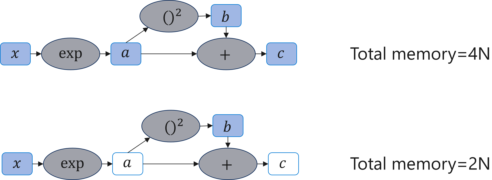
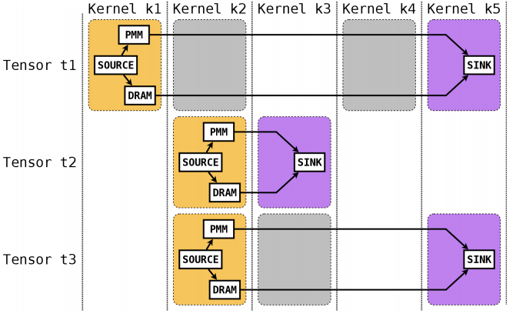

<!--Copyright © Microsoft Corporation. All rights reserved.
  适用于[License](https://github.com/microsoft/AI-System/blob/main/LICENSE)版权许可-->

# 5.3 内存优化
深度学习的计算任务大多执行在像GPU这样的加速器上，一般这样的加速器上的内存资源都比较宝贵，如几GB到几十GB的空间。随着深度学习模型的规模越来越大，从近来的BERT，到各种基于Transformer网络的模型，再到GPT-3等超大模型的出现，加速器上的内存资源变得越来越稀缺。因此，除了计算性能之外，神经网络编译器对深度学习计算任务的内存占用优化也是一个非常重要的目标。

一个深度学习计算任务中的内存占用主要包括输入数据、中间计算结果和模型参数，在模型推理的场景中，一般前面算子计算完的中间结果所占用的内存，后面的算子都可以复用，但是在训练场景中，由于反向求导计算需要使用到前向输出的中间结果，因此，前面计算出的算子需要一直保留到对应的反向计算结束后才能释放，对整个计算任务的内存占用挑战比较大。所幸的是，在计算图中，这些所有的数据都被统一建模成计算图中的张量，都可以表示成一些算子的输出。计算图可以精确的描述出所有张量之前的依赖关系以及每个张量的生命周期，因此，根据计算图对张量进行合理的分配，可以尽可能的优化计算内存的占用。

 

图5-3-1. 根据计算图优化张量分配的例子

图5-3-1展示了一个根据计算图优化内存分配的例子，在上图中，默认的执行会为每一个算子的输出张量都分配一块内存空间，假设每个张量的内存大小为N，则执行该图需要4N的内存。但是通过分析计算图可知，其中的张量a可以复用张量x，张量c可以复用a，因此，总的内存分配可以降低到2N。
基于计算图进行内存优化的方法有很多，本章中主要以三类不同的方法为例具体介绍如果介绍深度学习计算中的内存优化。

## 5.3.1 基于拓扑序的最小内存分配
计算图中的张量内存分配可以分成两个部分：张量生命期的分析和内存分配。首先，给定计算图之后，唯一决定张量生命期的就是节点（算子）的执行顺序。在计算框架中，由于执行顺序是运行时决定的，所以内存也都是运行时分配的。但在编译器中，我们可以通过生成固定顺序的代码来保证最终的节点以确定的顺序执行，因此在编译期就可以为所有张量决定内存分配的方案。一般只要以某种拓扑序要遍历计算图就可以生成一个依赖正确的节点的执行顺序，如BFS、Reverse DFS等，进而决定出每个张量的生命期，即分配和释放的时间点。

接下来，就是根据每个张量的分配和释放顺序分配对应的内存空间，使得总内存占用最小。一种常用的内存分配方法是建立一个内存池，由一个块内存分配管理器（如BFC内存分配器）管理起来，然后按照每个张量的分配和释放顺序依次向内存池申请和释放对应大小的内存空间，并记录每个张量分配的地址偏移。当一个张量被释放回内存池时，后续的张量分配就可以自动复用前面的空间。当所有张量分配完时，内存池使用到的最大内存空间即为执行该计算图所需要的最小内存。在真实的运行时，我们只需要在内存中申请一块该大小的内存空间，并按照之前的记录的地址偏移为每个张量分配内存即可。这样即可以优化总内存的占用量，也可以避免运行时的内存分配维护开销。
值得注意的是，不同拓扑序的选择会同时影响模型的计算时间和最大内存占用，同时也强制了运行时算子的执行顺序，可难会带来一定的性能损失。

## 5.3.2 张量换入换出
上面的方法中只考虑了张量放置在加速器（如GPU）的内存中，而实际上如果内存不够的话，我们还可以将一部分张量放置到外存中（如CPU的内存中），等需要的时候再移动回GPU的内存中即可。虽然从CPU的内存到GPU的内存的拷贝延时和带宽都比较受限，但是因为计算图中有些张量的产生到消费中间会经过较长的时间，我们可以合理安排内存的搬运时机使得其和其它算子的计算重叠起来。

 

图5-3-2. 利用整数线性规划优化计算图内存分配的示例

给定上述假设以及必要的数据（如每个内核的执行时间、算子的执行顺序等），关于每个张量在什么时间放在什么地方的问题就可以被形式化的描述成一个最优化问题。AutoTM[]就提出了一种把计算图中张量内在异构内存环境中规的问题划建模成一个整数线性规划的问题并进行求解。图5-3-2展示了一个利用整数线性规划优化计算图内存分配的优化空间示例，图中每一行表示一个张量，每一列表示算子的执行顺序。每一行中，黄色Source表示张量的生成时间，紫色的SINK表示张量被消费的时间，每个张量都可以选择是在内存中（DRAM）还是外存（PMM）中。那么问题优化目标为就是给定任意的计算图最小化其执行时间，约束为主存的占用空间，优化变量就是决定放在哪个存储中，在有限的节点规模下，这个问题可以通过整数线性规划模型求解。同时，该文章中还扩展该方法并考虑了更复杂的换入换出的情形。

## 5.3.3 张量重计算
深度学习计算图的大多算子都是确定性的，即给定相同的输入其计算结果也是相同的。因此，我们可以进一步利用这个特点来优化内存的使用。当我们对连续的多个张量决定换入换出的方案时，如果产生这些张量的算子都具有计算确定性的话，我们可以选择只换出其中一个或一少部分张量，并把剩下的张量直接释放，当到了这些张量使用的时机，我们可以再换入这些少量的张量，并利用确定性的特点重新计算之前被释放的张量，这样就可以一定程序上缓解CPU和GPU之前的贷款压力，也为内存优化提供了更大的空间。如果考虑上换入换出，内存优化方案需要更加仔细的考虑每个算子的执行时间，从而保证重计算出的张量在需要的时候能及时的计算完成。
