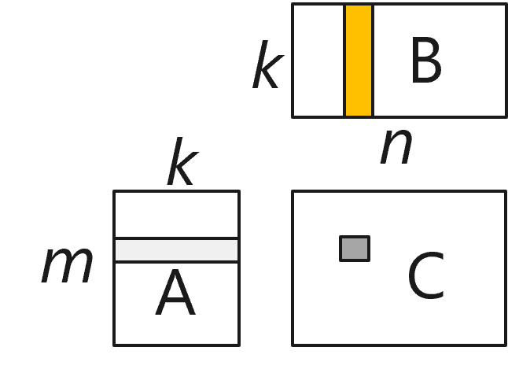
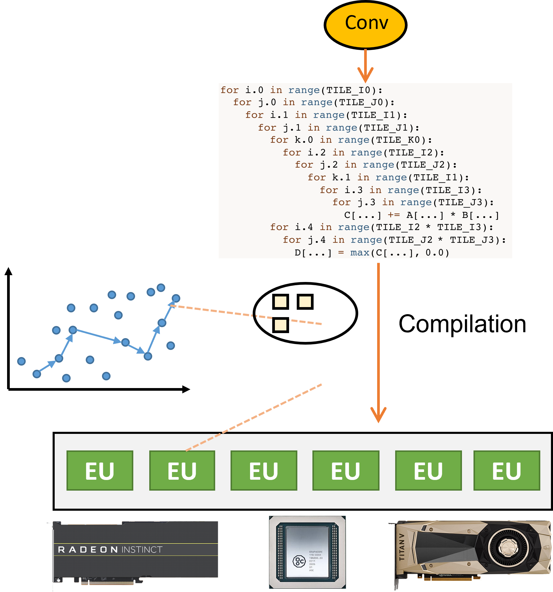

<!--Copyright © Microsoft Corporation. All rights reserved.
  适用于[License](https://github.com/microsoft/AI-System/blob/main/LICENSE)版权许可-->

# 5.4 内核优化与生成

- [5.4 内核优化与生成](#54-内核优化与生成)
  - [5.4.1 算子表达式](#541-算子表达式)
  - [5.4.2 算子表示与调度逻辑的分离](#542-算子表示与调度逻辑的分离)
  - [5.4.3 自动调度搜索与代码生成](#543-自动调度搜索与代码生成)
  - [小结与讨论](#小结与讨论)
  - [参考文献](#参考文献)

前面的编译优化基本都是在计算图的上进行的，当一个计算图被优化过后，就需要继续向下编译。其中一个最主要的问题就是如果对计算图中的每一个算子生成相应的代码。在计算框架中，每个算子都是预先实现并注册到框架中的，这样计算图在执行时只需要调用相应的代码即可。然而，计算框架的缺点是无法快速适配到一个新的硬件上，其需要为每一种硬件都实现一套算子代码，这不仅需要大量人力和时间成本，并且算子实现的性能也无法得到保证，因为，在对每个后端平台针对每个算子实现内核代码的时候都需要考虑不同的编程模型、数据排布、线程模型、缓存大小等等因素。

为了解决这个问题，就有了张量编译（或算子编译）的研究工作以及张量编译器。算子编译的核心思想是首先为通用算子找到一种能够描述算子与硬件无关的计算逻辑的表示，然后由编译器根据这种逻辑描述再结合具体的硬件生成相应的内核代码。近年来，有较多的研究工作都在围绕这个问题出现，例如TVM, Halide, TACO, Tensor Comprehension, FlexTensor等。在本书中将以TVM为例，来讲述算子编译的基本思想，更深入的技术细节可以参考相关文献。

## 5.4.1 算子表达式
对深度学习中的大多数算子，其计算逻辑都可以描述成针对输出张量中的每一个元素的独立同构计算。以矩阵乘算子为例（如图5-4-1所示），矩阵C中的每一个元素（如坐标为[i,j])的值都可以通过对应的一行（第i行）和一列（第j列）的内积来计算得出。也就是说，大多数的算子的计算逻辑都要以通过描述其中的元素的计算逻辑来表示，这就是算子表达式的作用。

<center> </center>
<center>图5-4-1. 矩阵乘算子</center>

一个算子表达式主要包括以下几个部分：1）所有输入和输出张量，2）输出张量的计算形状，3）输出张量中每一个元素的计算表达式，其中包括元素的在张量中的位置参数，一般以lambda表达式的形式描述为坐标参数的匿名函数。如下面表中每一行为上述矩阵乘算子在TVM中的算子表达式。

<center>

| 算子 | 算子表达式 | 
| :-----| ----: | 
| 矩阵乘 | ```C = t.compute((m, n), lambda i, j: t.sum(A[i, k] * B[k, j]), axis=k)``` | 
| 仿射变换 | ```C = t.compute((m, n), lambda i, j: C[i, j] + bias[i])```| 
| 卷积 | ```C = t.compute((c, h, w), lambda i, x, y: t.sum(data[kc, x+kx, y+ky] * w[i, kx, ky]), axis=[kx, ky, kc])``` |
| ReLU | ```C = t.compute((m, n), lambda i, j: t.max(0, A[i, j])``` |
</center>
<center>表5-2-1. 一些常见的算子表达式</center>


## 5.4.2 算子表示与调度逻辑的分离
有了算子表达式之后，我们就得到了一个算子的计算逻辑。为了生成硬件上的最终代码，我们需要把算子表达式的逻辑计算变化成符合硬件编程模型的代码，并考虑硬件特性进行代码优化，这个过程就叫作表达式的调度（Schedule）。
通常来说，一个最简单的调度方案就是通过生成多重循环来遍历一个算子表达式中输出张量中的每一个元素，然后调用其提供的lambda函数，即可完成一个简单的内核代码的生成。图5-4-2展示了一个简单的张量加算子的表达式，以及为其在TVM中创建一个默认调度的示例（上半部分），同时调度后产生出的内核代码（下半部分）。

```
# 在TVM中创建一个默认调度的示例
C = tvm.compute((n,), lambda i: A[i] + B[i])
s = tvm.create_schedule(C.op)
```
```
// 调度后产生出的内核代码
for (int i= 0; i < n; ++i)
{
  C[i] = A[i] + B[i];
}
```
<center>图5-4-2. 一个张量加算子的调度示例</center>

可以看到，上面生成的内核代码只是一个简单的循环，实际中这样的代码往往性能不好。我们希望对上述循环进行一系列的变化，如把一个循环拆分成两重循环、或者把两个循环合并一个循环、或者把两个循环的顺序颠倒等等。为了方便这些优化，算子编译器也提供了一些相应的调度操作接口，如下图中的split操作即可以上述循环按照32为因子进行拆分成内个两重循环，如图5-4-3所示。

```
# 在TVM中创建一个默认调度的示例
C = tvm.compute((n,), lambda i: A[i] + B[i])
s = tvm.create_schedule(C.op)

# 在TVM中按照32为因子进行拆分成内个两重循环
xo, xi = s[C].split(s[C].axis[0], factor = 32)
```

```
// 调度后产生出的内核代码
for (int xo = 0; xo < ceil(n /32); ++xo)
{
  for (int xi = 0; xi < 32; ++xi)
  {
    int i = xo * 32 + xi;
    if (i < n)
      C[i] = A[i] + B[i];
  }
}
```
<center>图5-4-3. 一个张量加算子的调度优化示例</center>

除了优化，我们还希望一个算子表达式能生成特定硬件上符合其编程模型的代码。这就需要我们能针对这些硬件提供一些调度操作。例如，当我们想让上述代码能在CUDA GPU上执行，我们就需要把一些循环绑定到CUDA编程模型中的threadIdx或blockIdx上，同样，我们可以使用算子编译器中的bind接口来完成，如图5-4-4所示，最终我们就可以得到一个简单的可以GPU执行的内核代码。

```
# 在TVM中创建一个默认调度的示例
C = tvm.compute((n,), lambda i: A[i] + B[i])
s = tvm.create_schedule(C.op)

# 在TVM中按照32为因子进行拆分成内个两重循环
xo, xi = s[C].split(s[C].axis[0], factor = 32)

# 使用bind接口来完成和threadIdx或blockIdx的绑定
S[C].reorder(xi, xo)
s[C].bind(xo, tvm.thread_axis("blockIdx.x"))
s[C].bind(xi, tvm.thread_axis("threadIdx.x"))
```

```
// 调度后产生出的内核代码
int i = threadIdx.x * 32 + blockIdx.x; 
if (i < n)
{
  C[i] = A[i] + B[i];
}
```
<center>图5-4-4. 一个张量加算子调度到GPU上的示例</center>

## 5.4.3 自动调度搜索与代码生成

有了算子表达式和对表达式的调度机制，我们就可以较容易的在一个新的硬件设备上生成一个算子的内核代码了。然而，我们可以看到，在调度的时候，有非常多种决定需要抉择，而且这些决定都会根据硬件的不同而产生不一样的性能影响，这些都需要经验非常丰富的专家才能知道一个较好的调度方案。为了进一步克复这个问题，一类利用机器学习进行自动调度搜索的方法被广泛应用。

<center> </center>
<center>图5-4-5. 自动调度搜索与代码生成</center>

如图5-4-5所示，给定一个算子表达式，我们首先需要针对该表达式自动生成出一个调度的代码模板，模板中可以预留出大量的可配置的参数。生成的模板需要能够尽可能包括各种代码的可能性，也就是保证足够大的搜索空间。给定了代码模板后，剩下的事情就是决定哪一个配置可以生成最优的代码，实际中，一个代码模板可能有成千上万种可选配置，因此，一般的编译器会采用机器学习的方法通过不断尝试，生成代码、测量性能、反馈给机器学习模型、再生成下一个（一批）代码的方式不断迭代搜索，直到搜索到一定的步数后找到一个较优的代码配置，并生成最终代码。通过机器学习的方法的好处是可以针对特别的问题输入和硬件，利用黑盒的方式找到一个较好的专用代码，但其缺点也很明显，在编译的过程中需要大量的编译和尝试，需要花费较长的编译时间和较多的算力。

## 小结与讨论

本章我们主要围绕内核优化与生成展开，包含算子表达式，算子表示与调度逻辑的分离，自动调度搜索与代码生成等内容。

在传统的编译器程序生成中，我们很少看到利用机器学习来自动生成程序的方法，请读者思考这种方法的好处与主要缺点，还有自动代码生成还能被用到哪些场景中呢？

## 参考文献
- XLA. https://www.tensorflow.org/xla
- TVM: An automated end to-end optimizing compiler for deep learn
- Learning to optimize tensor programs
- Halide: A language and compiler for optimizing parallelism, locality, and recomputation in image processing pipelines.
- Triton: An Intermediate Language and Compiler for Tiled Neural Network Computations
- Tensor comprehensions: Framework-agnostic high-performance machine learning abstractions.
- Akg: Automatic kernel generation for neural processing units using polyhedral transformations.
- Ansor: Generating high-performance tensor programs for deep learning.
- Flextensor: An automatic schedule exploration and optimization framework for tensor computation on heterogeneous system.

