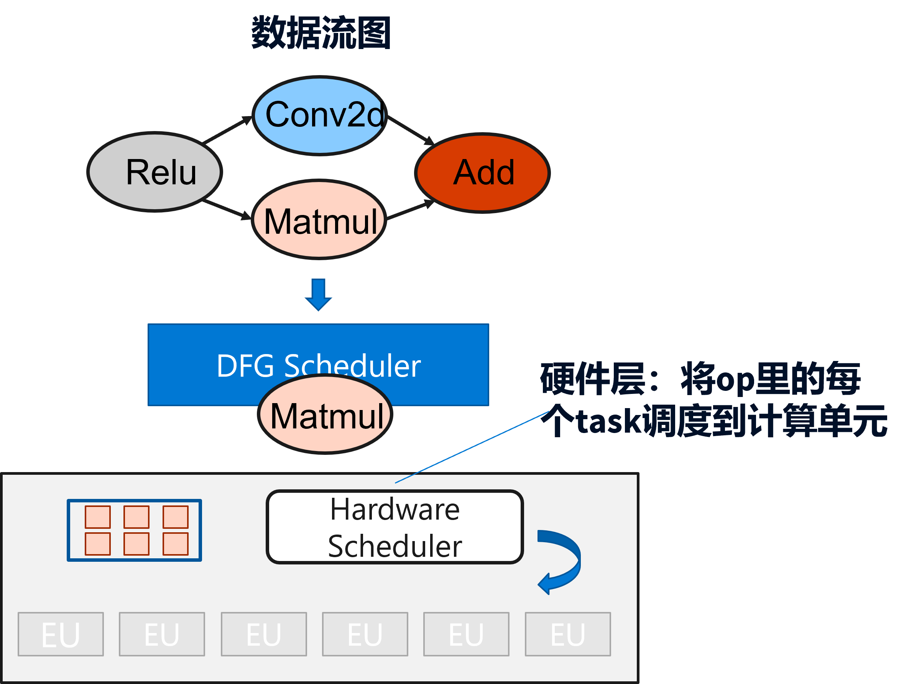
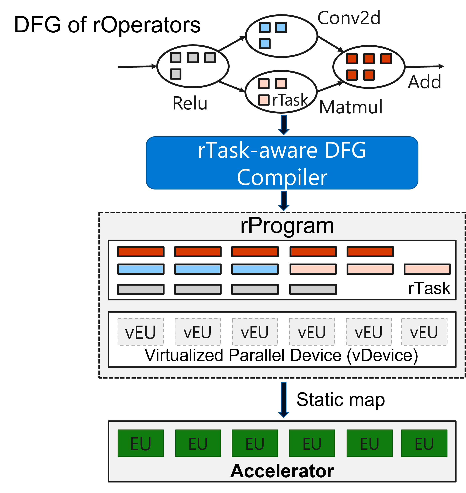

<!--Copyright © Microsoft Corporation. All rights reserved.
  适用于[License](https://github.com/microsoft/AI-System/blob/main/LICENSE)版权许可-->

# 5.5 跨算子的全局调度优化
前面的优化和算子生成分别在计算图和算子表达式两个层次完成。这种分层的优化给编译器的设计和实现带来更清楚的模块化和可维护性，但是同时也由于上下层的分离损失了一些更进一步的优化机会。
硬件利用率低，没有完全发挥硬件的计算性能
单个Op的调度时间与计算时间相比不可忽略
OP的并行度不足以占满GPU的计算核心

 

图5-4-5. 自动调度搜索与代码生成

## 5.5.1	操作符融合
一种在GPU上可以支持通用Op融合的优化方法

局限性和问题
打破了现有的模块化设计
Kernel Fusion需要对每个Op的kernel有一定要求，并需进行二次修改
需要获取额外的隐式参数：如threadBlock的个数，大小等
引入了“非标准”的GPU用法
在kernel内部做全局同步可能会引入死锁的问题
Persistent threads
和GPU有较强的绑定，无法把优化过程通用化
大量GPU相关的实现细节混在其中
问题1：现有的Op抽象成黑盒函数，没有暴露Op内部的细粒度计算任务
问题2：GPU只提供Op为单位的调度接口，无法支持细粒度任务在计算单元上的精确映射
问题3：由于上下层的抽象限制，软件调度层无法做到全局的优化

## 5.5.2	编译时调度
在计算表达层，引入rOperator来代替原有Op，打开Op的黑盒
在硬件层，引入vDevice的抽象，提供计算单元（vEU）的粒度的调度接口
rTask粒度的调度可能带来更严重的调度开销
观察：DNN计算性能有较强的确定性
Op的计算时间比较确定
数据流图往往在运行前可以确定
在编译时将整个数据流图的所有rTask静态的编排成一个确定性执行方案，通过vDevice映射到物理Device的执行单元
解耦的调度机制与优化策略
调度机制：rTask粒度的调度接口、Profiler
优化策略：基于上述接口可以设计任意的编排方案来优化整体性能

 

图5-4-5. 自动调度搜索与代码生成
