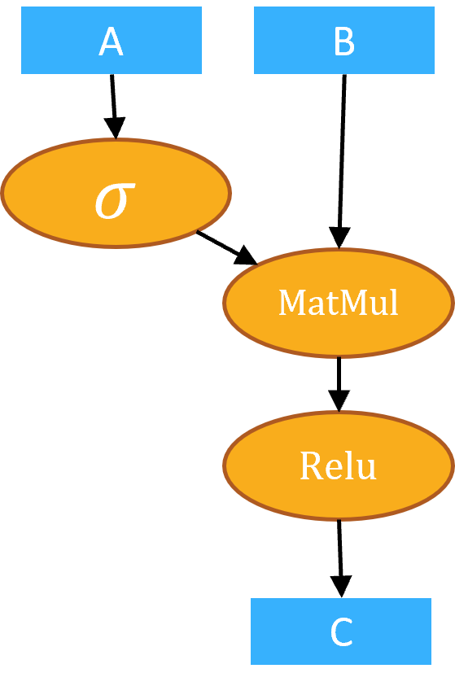

<!--Copyright © Microsoft Corporation. All rights reserved.
  适用于[License](https://github.com/microsoft/AI-System/blob/main/LICENSE)版权许可-->

# 5.5 跨算子的全局调度优化

- [5.5 跨算子的全局调度优化](#55-跨算子的全局调度优化)
  - [5.5.1 任意算子的融合](#551-任意算子的融合)
  - [5.5.2	编译时全局算子调度](#552编译时全局算子调度)
  - [小结与讨论](#小结与讨论)
  - [参考文献](#参考文献)
  
前面的优化和算子生成分别在计算图和算子表达式两个层次完成。这种分层的优化给编译器的设计和实现带来更清楚的模块化和可维护性，但是同时也由于上下层的分离损失了一些更进一步的优化机会，例如硬件利用率低，无法完全发挥硬件的计算性能。造成这些低效的主要原因包括：
 - 单个Op的调度时间与计算时间相比不可忽略，造成较大的调度开销；
 - OP的并行度不足以占满GPU的计算核心。
  
## 5.5.1 任意算子的融合

为了解决上述问题，一个很自然的想法就是：能不能对任意的算子进行融合，从而提高硬件利用率，降低算子的调度开销。一种最简单的方法就是实现更加激进的自动算子融合。如图5-5-1所示的为一个简单的计算图，与前面的算子融合不同的是，我们为了对任意算子做融合，引入了非element-wise算子，如矩阵乘法，这会给之前的融合方法增加难度。

<center> </center>
<center>图5-5-1. 一个简单的计算图</center>

为了实现任意算子融合，我们需要每一个算子的内核函数，如该例子中需要的Sigmoid、Relu和MatMul算子，下面展示的为这三个算子的内核函数：

```
__device__ float sigmoidf(float in) {
  return 1.f / (1.f + expf(-in));
}

__device__ float reluf(float in) {
  return fmaxf(0.f, in);
}

__device__ float MatMul(float *a, float *b, float *c, int m, int n, int k) {
  if (thread_ix < m && thread_iy < k) {
    float temp = 0.f;
    for (int i = 0; i < n; ++i) {
      temp += a[tix*n+i] * b[k*i+tiy];
    }
    c[k * tix + tiy] = temp;
  }
}

```
为了按照前面讲到的的方法进行这三个算子的融合，我们需要将上述三个函数生成到同一个全局核函数内，如下图示例。值得注意的是，为了保证任意算子之前有正确的数据依赖，我们有时候需要在两个算子之间插入一个全局的数据同步。
```
//融合三个算子后的全局内核函数
__global__ 
void kernel_0(float *A, float *B, float *C) {
  int idx = blockIdx.x * blockDim.x + threadIdx.x;
  // 计算Sigmoid算子
  if (idx < 1024) {    
    float temp0 = sigmoidf(A[idx]);
    buffer0[idx] = temp0;
  }
  //为保证正确的数据依赖引入的同步操作
  GlobalSync();

  //计算矩阵乘法算子
  for (int tix = bx; tix < ey; tix += offx) {
    for (int tiy = by; tiy < ey; tiy += offy) {
      MatMul(buffer0, B, buffer1, 1024, 1024, 128);
    }
  }
  //计算Relu算子
  if (idx < 1024) {        
    float temp2 = reluf(temp1);
    C[idx] = temp2;
  }
}
```

上面的实现可以看出有很大的局限性和问题，例如这种方法打破了现有的模块化设计，内核融合过程需要对每个算子的内核函数有一定要求，并需进行二次修改，还需要获取其一些额外的隐式参数：如threadBlock的个数，大小等。更进一步，这种方法也引入了一些“非标准”的GPU用法，如在kernel内部做全局同步可能会引入死锁的问题
。 尽管有学术界可以使用持久化线程（Persistent threads）的方法来实现同步，但这种方法和GPU有较强的绑定，无法把优化过程通用化到其它硬件上，有大量GPU相关的实现细节混在其中。


## 5.5.2	编译时全局算子调度

为了更好的解决这种问题，我们就是需要一种能根据计算流图中的并行度以及算子内部的并行度的整体信息来进行一个全局的任务调度方法。本章中以Rammer的技术为例，介绍一种全局算子调度的优化方法。

首先，在计算表达层，为了打开现有算子的黑盒实现，Rammer引入rOperator来代替原有算子抽象，暴露出每一个算子中的所有并行任务（rTask）。
在硬件层，引入虚拟设备（vDevice）的抽象，并提供计算单元（vEU）级别的的粒度调度接口，可以允许将一个rTask调度到任意指定的vEU上。然而，rTask粒度的调度可能带来更严重的调度开销，Rammer利用DNN计算性能有较强的确定性，即算子的计算时间在数据流图运行前就可以通过测量得到。因此，在编译时可以将整个数据流图的所有rTask静态的编排成一个确定性执行方案，通过vDevice映射到物理Device的执行单元进行执行，如图5-5-2所示。

<center> </center>
<center>图5-5-2. 全局算子调度编译</center>

这种全局调度的抽象解耦了调度机制与优化策略，通过暴露出rTask粒度的调度接口，从而可以基于该接口设计任意的编排方案来优化整体性能。


## 小结与讨论

本章我们主要通过介绍了全局算子调度层能解决的一些编译优化问题，我们首先通过扩展前面介绍过的算子融合的方法来解决该问题，并讨论了一些不足，进而介绍了以Rammer为例的全局编译时调度优化等内容。

请读者思考为何进行编译时调度而不是运行时调度？如何实现运行时调度最可行的方案是什么？

## 参考文献

1. Rammer: Enabling Holistic Deep Learning Compiler Optimizations with rTasks
 
2. Juggler: A dependence-aware task-based execution framework for gpus
 
3. Clipper: A low-latency online prediction serving system

4. A study of persistent threads style gpu programming for gpgpu workloads.

5. Enabling and exploiting flexible task assignment on gpu through sm-centric program transformations.
