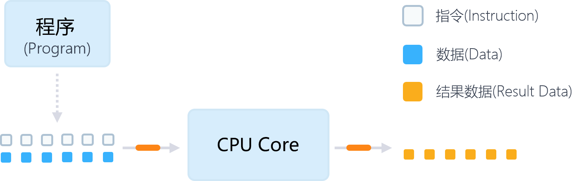
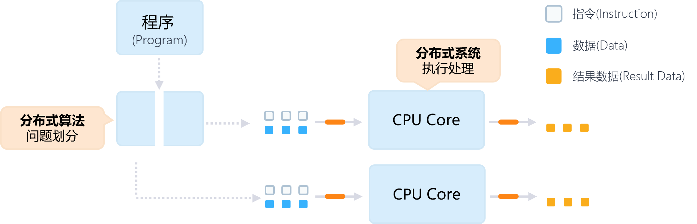
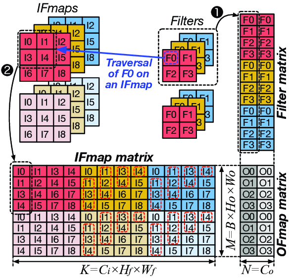

<!--Copyright © Microsoft Corporation. All rights reserved.
  适用于[License](https://github.com/microsoft/AI-System/blob/main/LICENSE)版权许可-->

# 6.1 分布式深度学习计算简介

- [6.1 分布式深度学习计算简介](#61-分布式深度学习计算简介)
  - [6.1.1 串行计算到并行计算的演进](#611-串行计算到并行计算的演进)
  - [6.1.2 并行计算加速定律](#612-并行计算加速定律)
  - [6.1.3 深度学习的并行化训练](#613-深度学习的并行化训练)
  - [小结与讨论](#小结与讨论)
  - [参考文献](#参考文献)
  
在了解具体的分布式技术之前，让我们首先简要回顾作为其基础的并行计算的一些基本概念。

## 6.1.1 串行计算到并行计算的演进

计算机最初的设计是采用单处理器串行执行的处理方式。这样的硬件结构简单，软件的编写也比较容易。例如，当给定一个具体问题时，设计串行算法求解是较为简单直接的。之后我们便可以将求解算法的过程书写成对应的计算机程序，由编译器翻译为机器能够执行的指令，发送给硬件运行。如下图所示，程序的指令依照顺序，连同输入的数据送入中央处理器核心（CPU core），经过处理计算产生计算的结果数据。

图6-1-1: 使用单处理器的程序处理过程 

正由于算法的设计较为容易、硬件结构简单成本低廉等多方面的原因，人们日常生活中接触到的计算机在其诞生后的数十年内都是单核心中央处理器(single-core CPU)，也就是单个中央处理器中仅有一个处理核心。

**从串行计算转向并行计算**

但是串行计算的处理能力受限于单处理器的运算能力。虽然单处理器的能力在不断发展，但当问题规模
(数据量+计算量)增大的速度更快，以至于单一设备处理速度无法满足时，矛盾就会显现。比如下图，包括天气预测在内的大量科学计算问题在很早的时候就遇到了这样的矛盾而转向并行计算[[1]](#IntroParallel)。而随着数字多媒体、游戏等应用的繁荣，个人计算机方面在2005年前后也遇到了类似的矛盾，而后由Intel和AMD分别推出了多核处理器予以应对。

图6-1-2: 并行计算涉及的大规模运算 (<a href=https://computing.llnl.gov/tutorials/parallel_comp>图片来源</a>)

**深度学习的计算复杂度**

相比于传统高性能计算，深度学习理论虽然已存在数十年（例如反向梯度传播早在1970已被提出
[Seppo Linnainmaa](https://en.wikipedia.org/wiki/Seppo_Linnainmaa)）[[2]](#BackwardTheory)但是在2010年后才逐渐转向实用。

一个重要的原因就是深度学习算法基于统计的高阶非线性模型拟合，计算的复杂度从原理上即高于其它算法。更严峻的问题是，为了追求更高的算法精准度，深度学习模型的规模也同步高速增长。这对于模型的计算，尤其是训练带来了极大的挑战。

**更优的模型 -&gt; 更大的计算复杂度**

下图通过近年多个模型，展示了深度学习模型中的准确度和训练计算量关系[[3]](#BenchAnalysisDNN)。图中的纵轴用模型"前5个返回结果的准确度"表示其准确性，横轴表示计算的复杂度（单位：十亿浮点数），每个圆盘代表一个模型，其半径表示参数量（单位：百万）。

图6-1-3: Top-5准确率（纵轴）与计算复杂程度（横轴：单次神经网络前向计算量）的关系，通过圆盘的尺寸表示模型参数量的大小关系 <Top-5 accuracy vs. computational complexity (single forward pass) *Benchmark Analysis of Representative Deep Neural Network Architectures*> (<a href=https://arxiv.org/pdf/1810.00736.pdf>图片来源</a>) 

从图中我们可以明显看出：整体而言，伴随着准确率的提升，模型单次迭代所需的计算量和模型的参数量是同步增加的。这说明，为了得到准确度更高的模型，我们需要花费更多的参数存储，以及更高的计算量。
考虑固定的计算能力，更高的计算量意味着更长的处理时间。
因此在这样的趋势之下，深度学习训练的耗时已经成为一个亟待解决的问题。例如，语言模型BERT-Large如果采用单个CPU训练，则需要以年为单位计算的时间。
<!-- //NOTE not real single processor -->

因此，类似于高性能计算，大规模深度学习的训练也求助于并行计算来解决单处理器算力不足与计算需求过高的矛盾。如下图所示，从原理上来讲，并行计算通过**并行算法**将问题的求解进行划分，并将编译的指令分发给**分布式系统**中的多处理器并行执行。这样一来，所有的计算量被分摊到多个计算单元之上，相比于串行计算，并行计算中的每个计算单元只需要负责部分的计算，缩短了整体的计算时间。

图6-1-4: 采用多处理器并行执行程序的过程 

在并行算法和并行处理硬件的加持下，并行的处理可以极大缩短深度学习的计算时间：
例如，在BERT-Large模型的训练中，如果用单枚包含80个并行硬件执行单元的V100
GPU训练，则可以将训练耗时降至1个月多。
而通过将1472个V100 GPU相互连结，科学家们甚至可以实现47分钟完成这个模型的训练[[6]](#BERT47min)。

我们可以清楚的看到，随着计算的并行化程度的增大，计算的时间得到了数个量级的改善。这对于探索大规模问题有着不可替代的意义。

## 6.1.2 并行计算加速定律

为了更为精确地分析并行计算的加速，有效地指导我们制定并行策略，我们需要用到一些加速定律。

-   阿姆达尔定律 (Amdahl's law)

[阿姆达尔定律](<https://en.wikipedia.org/wiki/Amdahl%27s_law>)[[4]](#Amdahl)可以表达为以下公式：

$$
S = \frac{1}{(1-p)+\frac{p}{N}}
$$

其中：

-   $S$ 是整个任务并行化后执行的理论加速比

-   $p$ 是任务中可并行化部分所占整个任务的比例

-   $N$ 是任务中可并行化部分投入的资源，亦即处理器数

阿姆达尔定律主要分析在问题规模不变的情况下，增加处理能力能够带来多大的加速率。其关于加速极限的基本结论是：存在加速的极限，为非可并行计算的占比之倒数$\frac{1}{1-p}$。该定律指导我们设计模型的时候需要尽量考虑增大可并行部分的比例。换言之，更适合并行加速的模型能够获得更高的计算效率，往往更容易提升规模以获得更好的准确率。注意力（attention）模型替代LSTM模型用于自然语言处理的过程便是这样一个例子，原本顺序执行、难以并行化的LSTM逐渐被更容易并行执行的注意力模型淘汰。

-   Gustafson定律 (Gustafson’s law)

[Gustafson定律](<https://en.wikipedia.org/wiki/Gustafson%27s_law>)[[5]](#Gustafson)可表达为如下公式：

$$
S = (1-p) + p \times N
$$

其中：

-   $S$ 是整个任务并行化后执行的理论加速比

-   $p$ 是任务中可并行化部分所占整个任务的比例

-   $N$ 是处理器数

与阿姆达尔定律悲观的加速极限相比，Gustafson定律的设定允许计算问题的规模随着处理能力的增加而相应地增长，从而避免了加速比提升受限的问题。这和机器学习的许多问题更为契合。例如，首先给定的计算力，然后处理问题的规模是可以通过模型结构、数据量、超参数等方面的调整来匹配计算力。

## 6.1.3 深度学习的并行化训练

深度学习的训练数据是给定的，单步计算量取决于模型的复杂程度和批尺寸（Batch Size），结合计算速率可以算得训练耗时（如下式）。其中前两个因素与问题相关，通常较为固定，因而我们分布式训练优化的目标就是在给定的问题下提高计算速率。

在深度学习中，由于学习率等超参数的调整与批尺寸决定的高度相关，因而依照Gustafson定律改变单步计算量更为复杂，例如
并行训练BERT[[7]](#BERT76min)
引入了全新的LARS优化器才能保证模型在设置了更大的批尺寸后依然能够收敛。

图6-1-5: 分布式深度学习的研究目标 

计算速率又可进一步被分解为但设备计算速率、设备数量和并行效率之间的乘积。受限于工艺和功耗的限制，单设备的运算速率相对有限。因此，我们的工作重点在于增加可用的设备数以及提高设备的并行效率。

深度学习的模型建立在高维张量的运算操作之上。这类的运算包含着丰富的可并行潜力。如下图所示，在一个典型的深度学习计算中，张量计算涉及可以并发的多个操作运算，而在单个张量运算子中也可并发地处理多个样本输入。

图6-1-6: 深度学习数据流图中的可并行的潜力 

因此，我们相应地将深度学习训练的并行化基本方案划分为**算子内并行**和**算子间并行**。**算子内并行**保持已有的算子的组织方式，探索将单个深度学习算子有效地映射到并行硬件设备上的执行。而**算子间并行**则更注重发掘多个算子在多个设备上并行执行的策略，甚至解耦已有的单个算子为多个等效算子的组合，进一步发掘并行性。

- 算子内并行

算子并行：并行单个张量计算子内的计算（GPU多处理单元并行）

算子内并行主要利用线性计算和卷积等操作内部的并行性。通常一个算子包含多个并行维度，常见的例如：批次（Batch）维度（不同的输入样本（Sample））、空间维度（图像的空间划分）、时间维度（RNN网络的时序展开）。在目前主流的深度学习框架中，这些并行的维度通过SIMD架构等多执行单元达到同时并行运算的目的。

在下图的的例子中，原本的卷积算法需要在整个图片数据上滑动卷积核顺序执行。而通过im2col对于图片数据和卷积核数据的重新整理，能够将计算重新组织成可并行执行的形式——结果矩阵$O_m$中的每个数值可以并行计算同时获得。
途中左上角的IFmaps代表同一张图片的红、绿、蓝三个通道。卷积Filters对应着各个通道的多个卷积核（convolution kernel），这里每个通道有**2**个卷积核，表示卷积操作的输出通道数为**2**。
通过将IFmaps和Filters中的元素重新排布为矩阵IFmap matrix和Filter matrix，原本的滑动卷积操作就可以转换为这两个矩阵的相乘计算，而计算的结果保持不变。例如，我们可以看到之前IFmaps上方的图片通过卷积应该得到输出为$O0 = I0 * F0 + I1 * F1 + I3 * F2 + I4 * F3 ...$，这与IFmap matrix矩阵的第一行乘以Filter matrix矩阵的第一列相等。

图6-1-7: 图像卷积计算的im2col并行 (<a href=https://ieeexplore.ieee.org/abstract/document/8695646>图片来源</a>) 

算子内并行的处理通常存在深度学习框架中，通过设备专有函数的形式发挥作用。比如PyTorch在运行在NVIDIA
GPU上时会调用cuDNN中的卷积函数完成在GPU上的算子并行。

- 算子间并行

算子内并行依然将思考的范围限定在单个算子上。而在深度学习训练中，并行的潜力广泛存在于多个算子之间。根据获得并行的方式，算子间并行的形式主要包含：

>   数据并行：多个样本并行执行

>   模型并行：多个算子并行执行

>   组合并行：多种并行方案组合叠加

不同的形式拥有众多的具体算法，我们会在接下来的章节具体加以介绍。

## 小结与讨论

本节通过介绍传统并行计算的发展和机器学习演进的相似点，引导读者思考分布式机器学习的必要性。又通过并行相关理论的简单介绍，希望能够启迪读者重新审视分布式机器学习的问题定义和研究目的。而后梳理了机器学习中可并行的方式，理清分布式机器学习在不同模块进行不同侧重点并行的基本情况。

## 参考文献

1. [Introduction to Parallel Computing Tutorial](https://hpc.llnl.gov/documentation/tutorials/introduction-parallel-computing-tutorial)

2. [Seppo Linnainmaa, Algoritmin kumulatiivinen pyoristysvirhe yksittaisten pyoristysvirheiden taylor-kehitelmana](https://people.idsia.ch/~juergen/linnainmaa1970thesis.pdf)

3. [Benchmark Analysis of Representative Deep Neural Network Architectures](https://arxiv.org/pdf/1810.00736.pdf)

4. [阿姆达尔定律](https://en.wikipedia.org/wiki/Amdahl%27s_law)

5. [Gustafson定律](https://en.wikipedia.org/wiki/Gustafson%27s_law)

6. [NVIDIA Tensor Core GPUs Train BERT in Less Than An Hour](https://developer.nvidia.com/blog/training-bert-with-gpus/)

7. [Large Batch Optimization for Deep Learning: Training BERT in 76 minutes (ICLR’20)]()

8. [Joseph E. Gonzalez AI-Systems Distributed Training](https://ucbrise.github.io/cs294-ai-sys-fa19/assets/lectures/lec06/06_distributed_training.pdf)
