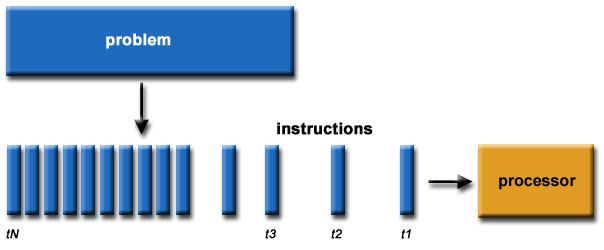
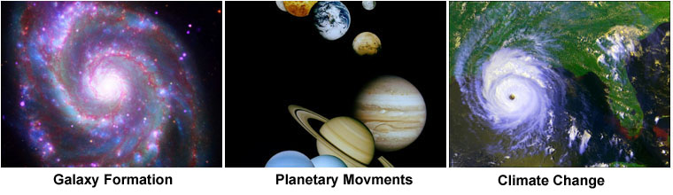
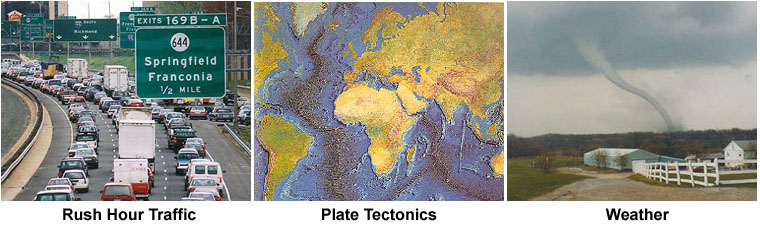
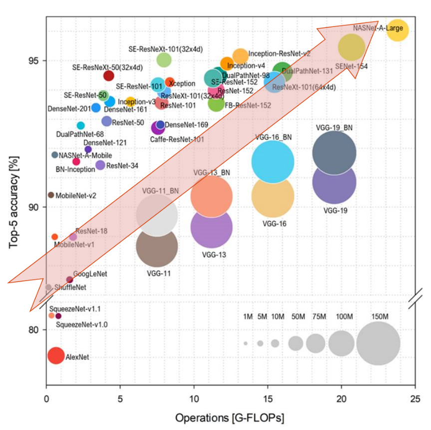
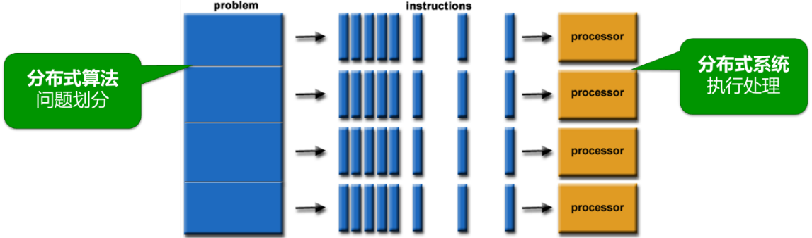

<!--Copyright © Microsoft Corporation. All rights reserved.
  适用于[License](https://github.com/microsoft/AI-System/blob/main/LICENSE)版权许可-->

# 6.1 分布式计算简介

在了解具体的分布式技术之前，我们先来简要回顾一下作为其基础的并行计算的基本概念。

## 6.1.1 串行计算到并行计算的演进

计算机最初的设计是采用单处理器串行执行的处理方式。这样的硬件结构简单，软件的编写也比较容易。例如，当求解一个问题时，设计串行算法是较为简单直接的。之后我们便可以将求解的过程书写成计算机程序，由编译器翻译为机器能够执行的指令，发送给硬件运行，如下图所示：

图: 使用单处理器的程序处理过程 (<a href=https://computing.llnl.gov/tutorials/parallel_comp>图片来源</a>)

正因为以上的原因，人们日常生活中接触到的计算机在诞生后的数十年内都是单核心中央处理器(single-core
CPU)的。

**从串行计算转向并行计算**

但是串行计算的处理能力受限于单处理器的运算能力。虽然单处理器的能力在不断发展，但当问题规模
(数据量+计算量)增大的速度更大，以至于单一设备处理速度无法满足时，矛盾就会显现。比如下图，包括天气预测在内的大量科学计算问题在很早的时候就遇到了这样的矛盾而转向并行计算。个人电脑也遇到了类似的矛盾，在2005年由Intel和AMD分别推出了多核处理器予以应对。

图: 并行计算涉及的大规模运算 (<a href=https://computing.llnl.gov/tutorials/parallel_comp>图片来源</a>)>

**深度学习的计算复杂度**

相比于传统高性能计算，深度学习理论虽然已存在数十年（例如反向梯度传播早在1970已被提出
[Seppo Linnainmaa](https://en.wikipedia.org/wiki/Seppo_Linnainmaa)）但是在2010年后才逐渐转向实用。

一个重要的原因就是深度学习算法基于统计的高阶非线性模型拟合，计算的复杂度从原理上即高于其它算法。更严峻的问题是，为了追求更高的算法精准度，深度学习模型的规模也同步高速增长。这对于模型的训练带来了极大的挑战。

**更优的模型 -&gt; 更大的计算复杂度**

下图通过近年多个模型，展示了深度学习模型中的准确度和训练计算量关系 ([Benchmark Analysis of Representative Deep Neural Network Architectures](<https://arxiv.org/pdf/1810.00736.pdf>))。图中的纵轴用模型"前5个返回结果的准确度"表示其准确性，横轴表示计算的复杂度（单位：十亿浮点数），每个圆形代表一个模型，其半径表示参数量（单位：百万）。

图: Top-5准确率（纵轴）与计算复杂程度（纵轴：单次神经网络前向计算量）的关系 <Top-5 accuracy vs. computational complexity (single forward pass) *Benchmark Analysis of Representative Deep Neural Network Architectures*> (<a href=https://arxiv.org/pdf/1810.00736.pdf>图片来源</a>) 

在这样的趋势之下，深度学习训练的耗时已经成为一个亟待解决的问题。例如，语言模型BERT-Large如果采用单个CPU训练，则需要以年为单位计算的时间。
<!-- //NOTE not real single processor -->

因此，类似于高性能计算，大规模深度学习的训练也求助于并行计算来解决单处理器算力不足与计算需求过高的矛盾。如下图所示，并行计算通过**并行算法**将问题的求解进行划分，并将编译的指令分发给**分布式系统**中的多处理器并行执行。

图: 采用多处理器并行执行程序的过程 (<a href=https://computing.llnl.gov/tutorials/parallel_comp>图片来源</a>) 

并行的处理可以极大缩短计算时间：
例如，在BERT-Large的训练中，如果用单枚包含80个并行硬件执行单元的V100
GPU训练，则可以将训练耗时降至1个月多。

## 6.1.2 并行计算加速定律

为了更为精确地分析并行计算的加速，有效地指导我们制定并行策略，我们需要用到一些加速定律。

-   阿姆达尔定律 (Amdahl's law)

[阿姆达尔定律](<https://en.wikipedia.org/wiki/Amdahl%27s_law>)可以表达为以下公式：

$$
S_{latency} (s) = \frac{1}{(1-p)+\frac{p}{s}}
$$

其中：

-   $S_{latency}$ 是整个任务执行的理论加速比

-   $p$ 是任务中可并行化部分所占整个任务的比例

-   $s$ 是任务中可并行化部分由于资源增多获得的加速比

阿姆达尔定律主要分析在问题规模不变的情况下，成倍地增加处理能力能够带来的加速率。其基本结论是加速的极限在于非可并行部分的占比的倒数。该定律知道我们设计模型的时候需要尽量考虑增大可并行部分的比例。换言之，更适合并行加速的模型能够获得更高的计算效率，往往更容易提升规模以获得更好的准确率。注意力（attention）模型替代LSTM模型的过程便是这样一个例子。

-   Gustafson定律 (Gustafson’s law)

[Gustafson定律](<https://en.wikipedia.org/wiki/Gustafson%27s_law>)可表达为如下公式：

$$
S = (1-p) + p \times N
$$

其中：

-   $S$ 是任务并行化后的理论加速比

-   $N$ 是处理器数

-   $p$ 是任务中可并行化部分所占整个任务的比例

与阿姆达尔定律悲观的加速极限相比，Gustafson定律的设定允许计算问题的规模随着处理能力的增加而相应地增长，从而避免了加速比提升受限的问题。这和机器学习的许多问题更为契合。例如，问题的规模是可以通过模型结构、数据量、超参数等方面的调整来匹配给定的计算力。

## 小结与讨论

本节通过介绍传统并行计算的发展和机器学习演进的相似点，引导读者思考分布式机器学习的必要性。又通过并行相关理论的简单介绍，希望能够启迪读者重新审视分布式机器学习的问题定义和研究目的。

## 参考文献

Introduction to Parallel Computing Tutorial https://hpc.llnl.gov/documentation/tutorials/introduction-parallel-computing-tutorial

https://en.wikipedia.org/wiki/Seppo_Linnainmaa

The representation of the cumulative rounding error of an algorithm as a Taylor expansion of the local rounding errors. Master's Thesis (in Finnish), Univ. Helsinki, 6–7

Benchmark Analysis of Representative Deep Neural Network Architectures https://arxiv.org/pdf/1810.00736.pdf

阿姆达尔定律 https://en.wikipedia.org/wiki/Amdahl%27s_law

Gustafson定律 https://en.wikipedia.org/wiki/Gustafson%27s_law