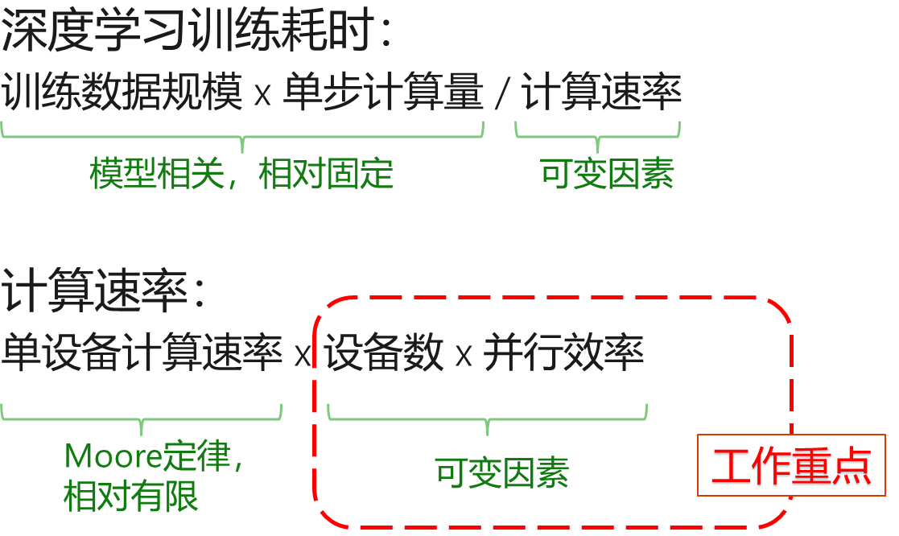
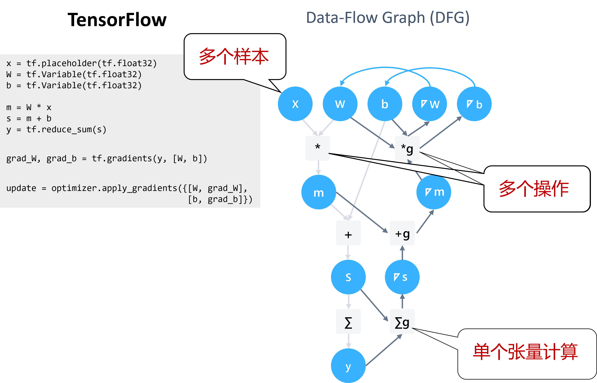
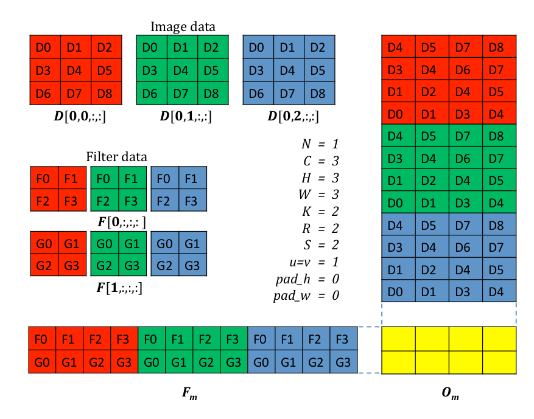

<!--Copyright © Microsoft Corporation. All rights reserved.
  适用于[License](https://github.com/microsoft/AI-System/blob/main/LICENSE)版权许可-->

# 6.2 分布式深度学习的意义

- [6.2 分布式深度学习的意义](#62-分布式深度学习的意义)
  - [深度学习并行训练简介](#深度学习并行训练简介)
  - [6.2.1 算子内并行](#621-算子内并行)
  - [6.2.2  算子间并行](#622--算子间并行)
  - [小结与讨论](#小结与讨论)
  - [参考文献](#参考文献)

深度学习的训练数据是给定的，单步计算量取决于模型的复杂程度和批尺寸（batch size），结合计算速率可以算得训练耗时（如下式）。其中前两个因素与问题相关，通常较为固定，因而我们分布式训练优化的目标就是在给定的问题下提高计算速率。

在深度学习中，由于学习率等超参数的调整与批尺寸决定的高度相关，因而依照Gustafson定律改变单步计算量更为复杂，例如\[Large
Batch Optimization for Deep Learning: Training BERT in 76 minutes (ICLR’20)\]引入了全新的LARS优化器才能保证模型在设置了更大的批尺寸后依然能够收敛。

图6-2-1: 分布式深度学习的研究目标 

计算速率又可进一步被分解为但设备计算速率、设备数量和并行效率之间的乘积。受限于工艺和功耗的限制，单设备的运算速率相对有限。因此，我们的工作重点在于增加可用的设备数以及提高设备的并行效率。

深度学习并行训练简介
--------------------

深度学习的模型建立在高维张量的运算操作之上。这类的运算包含着丰富的可并行潜力。如下图所示，在一个典型的深度学习计算中，张量计算涉及可以并发的多个操作运算，而在单个张量运算子中也可并发地处理多个样本输入。

图6-2-1: 深度学习数据流图中的可并行的潜力 

因此，我们相应地将深度学习训练的并行化基本方案划分为**算子内并行**和**算子间并行**。**算子内并行**保持已有的算子的组织方式，探索将单个深度学习算子有效地映射到并行硬件设备上的执行。而**算子间并行**则更注重发掘多个算子在多个设备上并行执行的策略，甚至解耦已有的单个算子为多个等效算子的组合，进一步发掘并行性。

## 6.2.1 算子内并行

算子并行：并行单个张量计算子内的计算（GPU多处理单元并行）

算子内并行主要利用线性计算和卷积等操作内部的并行性。通常一个算子包含多个并行维度，常见的例如：批次（batch）维度（不同的输入样本（sample））、空间维度（图像的空间划分）、时间维度（RNN网络的时序展开）。在目前主流的深度学习框架中，这些并行的维度通过SIMD架构等多执行单元达到同时并行运算的目的。

在下图的的例子中，原本的卷积算法需要在整个图片数据上滑动卷积核顺序执行。而通过im2col对于图片数据和卷积核数据的重新整理，能够将计算重新组织成可并行执行的形式——结果矩阵$O_m$中的每个数值可以并行计算同时获得。

图6-2-3: 图像卷积计算的im2col并行 (<a href=https://ucbrise.github.io/cs294-ai-sys-fa19/assets/lectures/lec06/06_distributed_training.pdf>图片来源</a>) 

算子内并行的处理通常存在深度学习框架中，通过设备专有函数的形式发挥作用。比如PyTorch在运行在NVIDIA
GPU上时会调用cuDNN中的卷积函数完成在GPU上的算子并行。

## 6.2.2  算子间并行

算子内并行依然将思考的范围限定在单个算子上。而在深度学习训练中，并行的潜力广泛存在于多个算子之间。根据获得并行的方式，算子间并行的形式主要包含：

-   数据并行：多个样本并行执行

-   模型并行：多个算子并行执行

-   组合并行：多种并行方案组合叠加

不同的形式拥有众多的具体算法，我们会在接下来的章节具体加以介绍。

## 小结与讨论

本节通过梳理机器学习中可并行的方式，理清分布式机器学习在不同模块进行不同侧重点并行的基本情况。

## 参考文献

- Large Batch Optimization for Deep Learning: Training BERT in 76 minutes (ICLR’20)
- [Joseph E. Gonzalez AI-Systems Distributed Training](https://ucbrise.github.io/cs294-ai-sys-fa19/assets/lectures/lec06/06_distributed_training.pdf)

