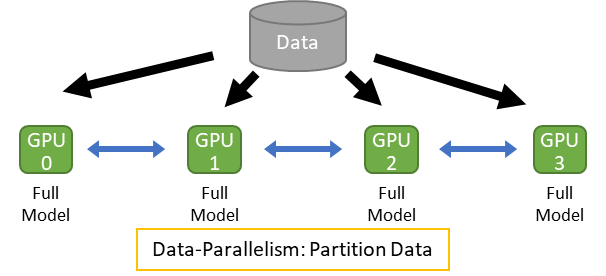
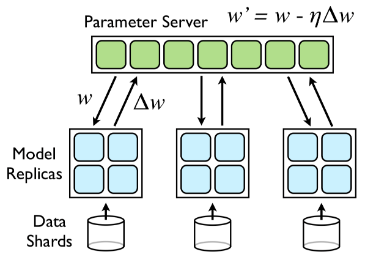
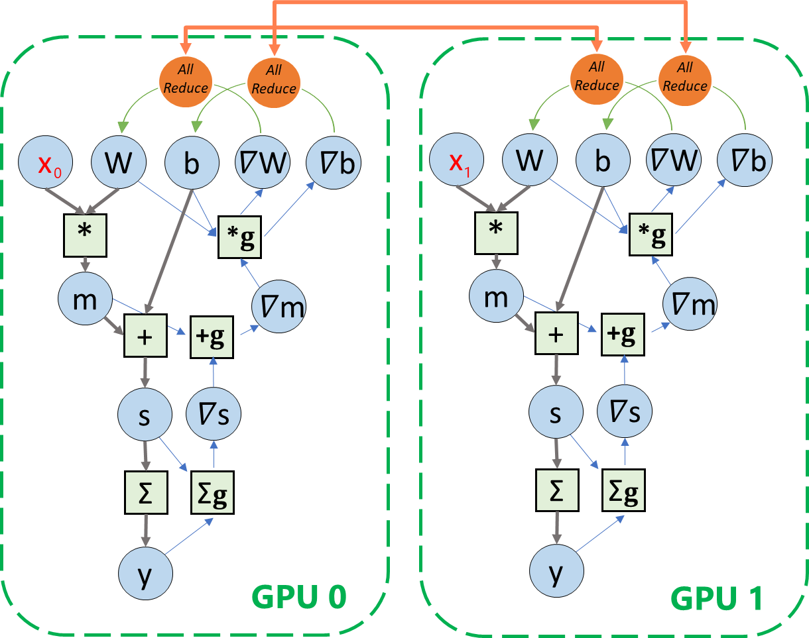
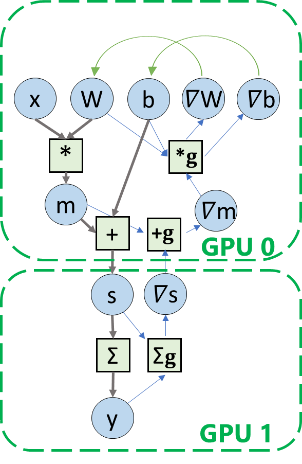
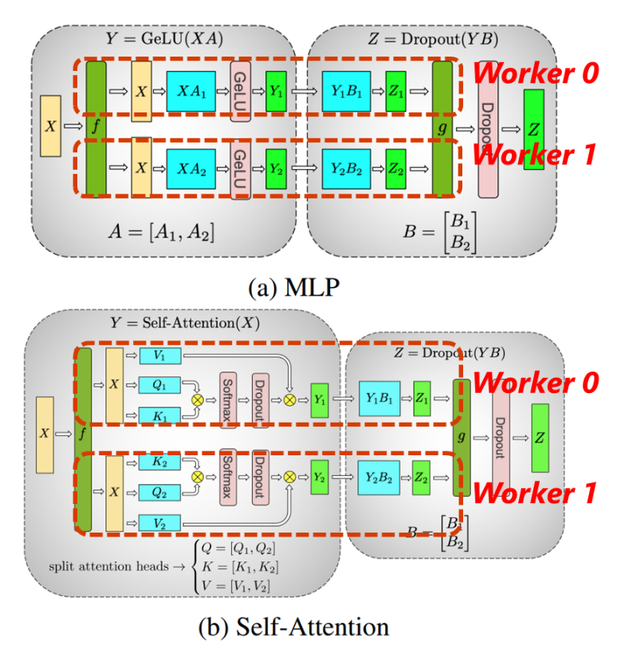
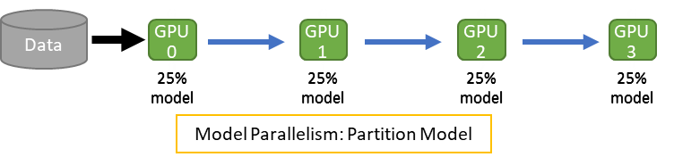
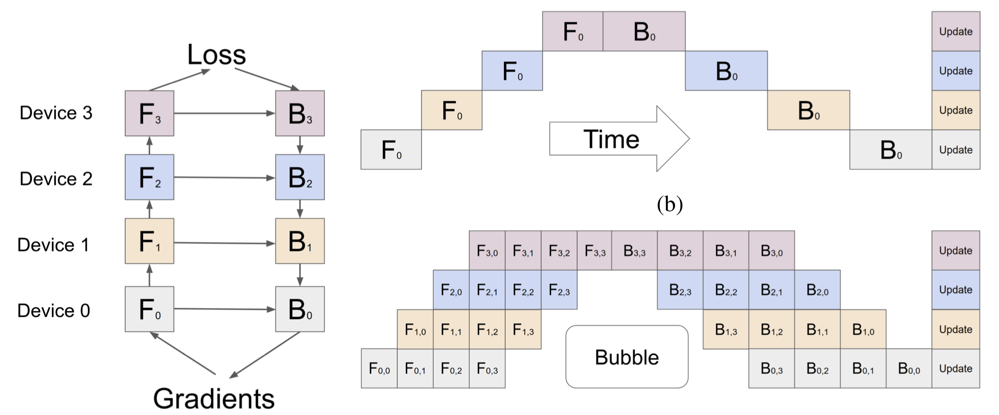
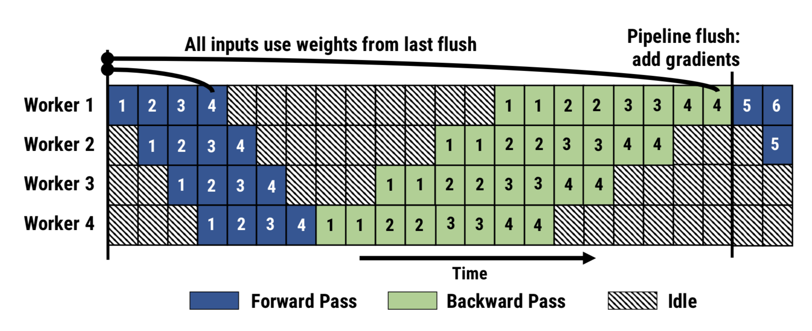
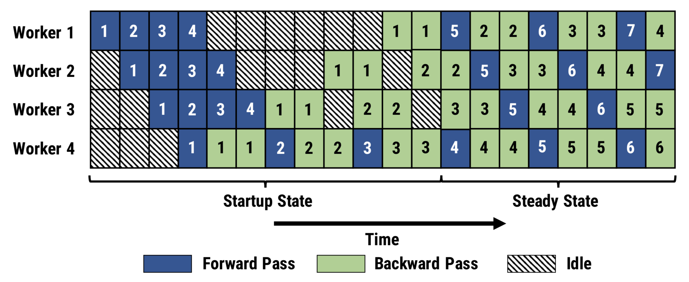

<!--Copyright © Microsoft Corporation. All rights reserved.
  适用于[License](https://github.com/microsoft/AI-System/blob/main/LICENSE)版权许可-->

# 6.3 分布式训练算法分类
------------------

## 6.3.1 数据并行

顾名思义，数据并行是指在数据维度上进行任务划分的并行方式。通过将读取的数据分发给多个设备，减少单个设备的负载，获得更大的整体吞吐率。由于每个设备分别拥有完整的模型副本，是相对而言更容易实现的方式。

图6-3-1: 数据并行示意图 

如图所示，数据并行的步骤如下：

1.  不同设备上读取不同数据

2.  执行相同计算图

3.  跨设备聚合梯度

4.  利用聚合后梯度更新模型

不同设备读取数据的总和相当于一个逻辑全局mini-batch。其中单个设备本地的计算处理mini-batch的一个子集。步骤 1 和 2 能视作可并行部分。而步骤3的跨设备梯度聚合是将多个设备分别计算的梯度进行平均，保证设备在步骤4中用于更新模型的梯度相互一致，且数学上符合非并行执行的结果。需要注意的是，有些模型的操作，例如batchnorm，理论上需要额外的处理才能保持并行化的训练数学性质完全不变。

从并行的效果上分析：如果我们固定全局的batch
size，增加设备的数目，数据并行下的训练相当于strong
scaling。而如果我们固定单个设备batchsize，通过增加设备数目，数据并行下的训练的相当于weak
scaling。

我们可以注意到，实现数据并行的关键在于跨设备聚合梯度。而根据跨设备聚合梯度的实现方式，数据并行的设计可分为两大类：基于参数服务器（parameter-server）的实现和基于all-reduce的实现。

基于参数服务器的数据并行在机器学习领域中被大量采用，甚至早于深度学习的流行，例如click-through prediction中的logistic regression。

我们以([**Downpour SGD (NIPS’12)**](<https://papers.nips.cc/paper/2012/file/6aca97005c68f1206823815f66102863-Paper.pdf>))为例，它基于基于参数服务器的设计。如图所示，其设计相当于把参数安放于全局可见的服务器之中，每个计算设备在每个minibatch之前通过通信接口拉取最新模型，反向传播计算完成后再通过通信接口推送本轮梯度至参数服务器上。作为中心化的参数服务器能够将所有计算设备的梯度加以聚合，更新模型，用于服务下一轮minibatch的计算。

图6-3-2: 通过参数服务器实现的数据并行 （图源：Downpour SGD (NIPS’12)）

参数服务器的设计易用的接口，长期以来占据着巨大的采用率。并且可以支持同步、异步、半同步并行（详见6.5）。
由于更为高效的all-reduce通信实现（例如NVIDIA的NCCL通信库），基于all-reduce的设计是目前的主流。

图6-3-3: 通过All-Reduce实现数据并行的流图 

数据并行以其简单的实现和优越的性能，长期以来占据着巨大的采用率。但是它的缺陷在于每个设备需要保留一份完整的模型副本，在模型参数量急剧增长的深度学习领域，能够轻松地超过单设备的存储容量，甚至一个operator也有可能超过单设备有限的存储，造成无法执行的境况。因此，模型并行应运而生。

## 6.3.2 模型并行

对应于数据并行切分数据的操作，模型并行将模型参数进行划分并分配到多个设备上。这样一来，系统就能支持更大参数量的深度学习模型。

在一个简单的模型并行划分中，计算图中不同的operator被划分至不同设备上执行。跨设备通过传递激活（activation）的方式建立连接，协作执行完整的模型训练处理。每个设备分别利用反向传播计算中获得的梯度更新模型的本地部分。

根据划分模型参数的方式不同，模型并行的常见的形式包含张量并行和流水并行。

图6-3-4: 模型并行的数据流图 

**张量并行**

张量并行是通过拆分算子，并把拆分出的多个算子分配到不同设备上并行执行。下图以实现transformer模型中的MLP及self-attention模块的张量并行为例。

图6-3-5: Transformer中切分张量的模型并行 （Megatron)

[Megatron-LM: Training Multi-Billion Parameter Language Models Using Model Parallelism](<https://arxiv.org/pdf/1909.08053.pdf>)

在MLP中，其中原本XA和YB的矩阵乘法，通过分割矩阵A和B得到对应的子矩阵Ai、Bi，使得原有的运算可以分配到两个设备worker0/1上执行，其间通过通信函数f/g相连。我们可以看到，张量并行可以使得每个设备只存储和计算原有模型的一部分达到分配负载，实现并行的目的。

更为灵活可变的张量并行方法可以在**FlexFlow**和**GSPMD**这些工作中找到。

## 6.3.3 流水并行

图6-3-6: 流水并行示意图 

流水并行是另一类特殊的模型并行。如图，其主要依照模型的运算符的操作将模型的上下游算子分配为不同的阶段（stage），每个设备负责其中的一个阶段模型的存储和计算。然而，在常见的线性结构的深度学习模型中，如果采用这种简易的流水并行，无论在正向计算还是反向计算中，只有一个设备是执行处理工作的，而其余的设备处于空闲状态，这是非常不高效的。因此，更为复杂的多流水并行被提出。

**GPipe**

如下图所示，GPipe通过利用数据并行的思想，对minibatch进行拆分，使得设备处理的单位从原本的minibatch（F0）变为更细化的microbatch(F0,1、F0,2…)，以便下游设备更早地获得可计算的数据，从而减少设备空闲(Bubble)，改善效率。

图6-3-7: GPipe流水并行 

[GPipe: Easy Scaling with Micro-Batch Pipeline
Parallelism](<https://arxiv.org/pdf/1811.06965.pdf>)

**PipeDream**

相比于GPipe遵从原有的同步机制，PipeDream从效率的角度考虑采用非同步机制，在放宽数学一致性的前提下进一步减少设备空闲，提高整体收敛速度。

图6-3-8: 以GPipe为例的同步化的流水并行

图6-3-9: 以PipeDream为例的异步化的流水并行 

<https://arxiv.org/pdf/1806.03377.pdf>

如图所示，GPipe的前后两个minibatch具有明确的分界线。而PipeDream允许前后两个minibatch的microbatch相互交错，使得设备空闲的时段进一步缩减。

## 6.3.4 并行方式的对比分析

不同的并行方式具有其各自独特的性质，适应于不同的场景。

|              | **非并行** |  **数据并行** |  **模型并行** |
| ------------ |------------ | --------------- | --------------- |
|  设备输入数据量   |  1         |   1/N        |    1|
|  传输数据量  | 0           | 模型大小   |    激活大小|
|  总存储占用  | 1           | \~N         |   1|
|  负载平衡度  | -          |  强          |   弱|
|  并行限制    | -         |   单步样本量  |   算子数量 |

(设备数量：N)

如下表所示，相较而言，数据并行会增加模型的存储开销，而模型张量并行会增加数据的重复读取。而从通信角度而言，数据并行的通信量是梯度的大小（相等于模型大小），而模型并行传输的是激活的大小。因此，在batch size较大时应尽量选用数据并行，而在模型较大时应选用模型并行。

**组合式并行** 
在实际中，更普遍的做法是同时结合多种并行方式来进行整个模型训练的并行划分。例如FlexFlow、tofu、GSPMD采用了数据和张量并行，PipeDream同时采用了数据并行和流水并行，Megatron-LM针对于包含BERT, GPT的Transformer模型家族同时启用了数据并行、模型并行和流水并行，综合发挥各个方式的优势。
