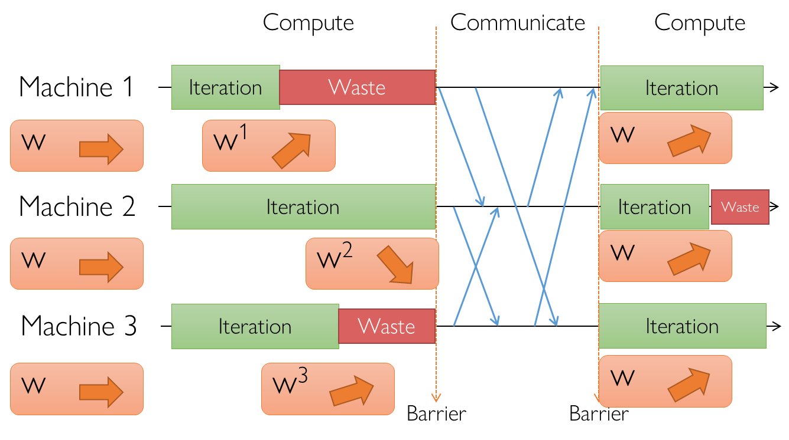
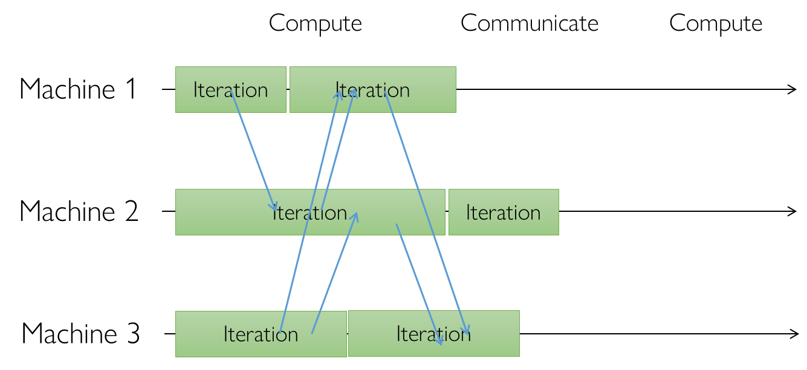

<!--Copyright © Microsoft Corporation. All rights reserved.
  适用于[License](https://github.com/microsoft/AI-System/blob/main/LICENSE)版权许可-->

# 6.3 深度学习并行训练同步方式

- [6.3 深度学习并行训练同步方式](#63-深度学习并行训练同步方式)
  - [6.3.1 同步并行](#631-同步并行)
  - [6.3.2 异步并行](#632-异步并行)
  - [6.3.2 半同步并行](#632-半同步并行)
  - [小结与讨论](#小结与讨论)
  - [参考文献](#参考文献)
  
在多设备进行并行训练时，可以采用不同的一致性模型，对应其间不同的通信协调方式，大致可分为：同步并行、异步并行、半同步并行。

## 6.3.1 同步并行

图6-3-1: 同步并行示意图 (<a href=https://ucbrise.github.io/cs294-ai-sys-fa19/assets/lectures/lec06/06_distributed_training.pdf>图片来源</a>)

同步并行是采用具有同步障的通信协调并行。例如在下图中，每个工作节点(Worker)的在进行了一些本地计算之后需要与其它工作节点通信协调。在通信协调的过程中，所有的工作节点都必须等全部工作节点完成了本次通信之后才能继续下一轮本地计算。阻止工作节点在全部通信完成之前继续下一轮计算是同步障。这样的同步方式也称BSP，其优点是本地计算和通信同步严格顺序化，能够容易地保证并行的执行逻辑于串行相同。但完成本地计算更早的工作节点需要等待其它工作节点处理，造成了计算硬件的浪费。

## 6.3.2 异步并行

采用不含同步障的通信协调并行。相比于同步并行执行，异步并行执行下各个工作节点完全采用灵活的方式协调。如下图所示，时间轴上并没有统一的时刻用于通信或者本地计算，而是工作节点各自分别随时处理自己收到的消息，并且随时发出所需的消息，以此完成节点间的协调。这样做的好处是没有全局同步障带来的相互等待开销。

图6-3-2: 异步并行示意图 (<a href=https://ucbrise.github.io/cs294-ai-sys-fa19/assets/lectures/lec06/06_distributed_training.pdf>图片来源</a>)

## 6.3.2 半同步并行

采用具有限定的宽松同步障的通信协调并行。半同步的基本思路是在严格同步和完全不受限制的异步并行之间取一个这种方案——受到限制的宽松同步。例如,
在 Stale Synchronous Parallel (SSP)中，系统跟踪各个工作节点的进度并维护最慢进度，通过动态限制进度推进的范围，保证最快进度和最慢进度的差距在一个预定的范围内。这个范围就称为“新旧差阈值”staleness threshold如下图所示，在新旧差阈值为3时，最快进度的工作节点会停下来等待最慢的工作节点。

 图6-3-3: 半同步SSP示意图 (<a href=https://ieeexplore.ieee.org/abstract/document/8885215>图片来源</a>) 

半同步并行通过对于更新的不一致程度的限制，以达到收敛性居于同步并行和异步并行之间的效果。除了同步时机的区别，目前并行同步方式的理论也涉及同步对象的选择上。例如相比于全局所有工作节点参与的同步，亦有研究只与部分工作节点同步的方式（Ce Zhang et.al.）。

## 小结与讨论

本节通过介绍机器学习中不同的同步、异步、半同步等并行通信方式，以比较的方式解释其性能和收敛性的区别。

## 参考文献

1. [Zhao, Xing, et al. Dynamic Stale Synchronous Parallel Distributed Training for Deep Learning (ICDCS’19)](https://ieeexplore.ieee.org/abstract/document/8885215)

2. [Joseph E. Gonzalez AI-Systems Distributed Training](https://ucbrise.github.io/cs294-ai-sys-fa19/assets/lectures/lec06/06_distributed_training.pdf)

