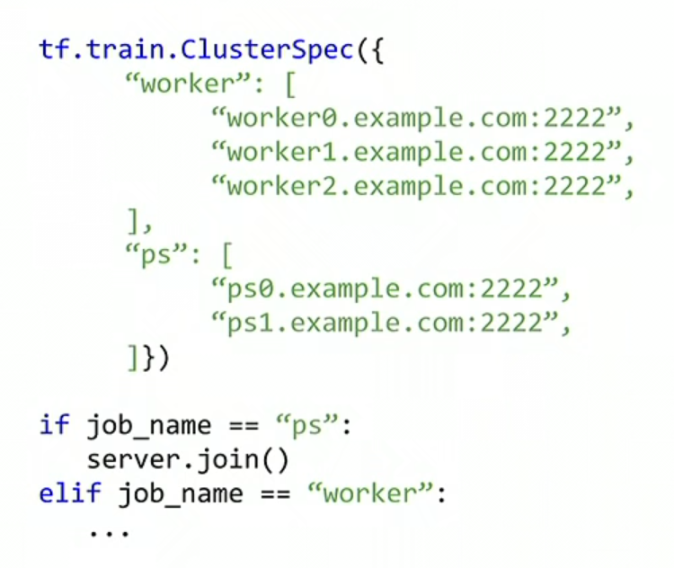
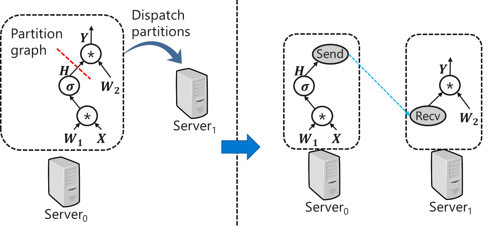
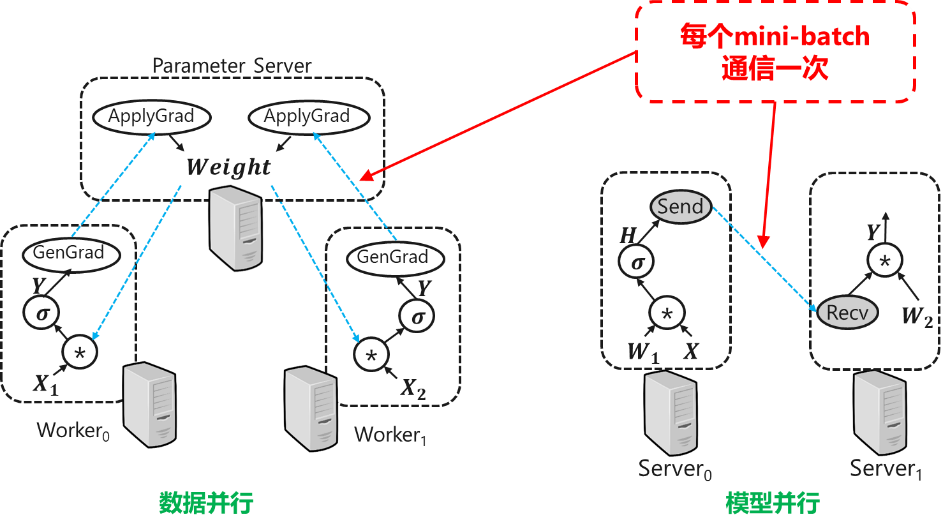
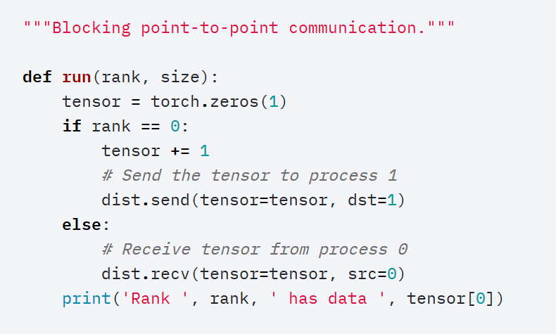
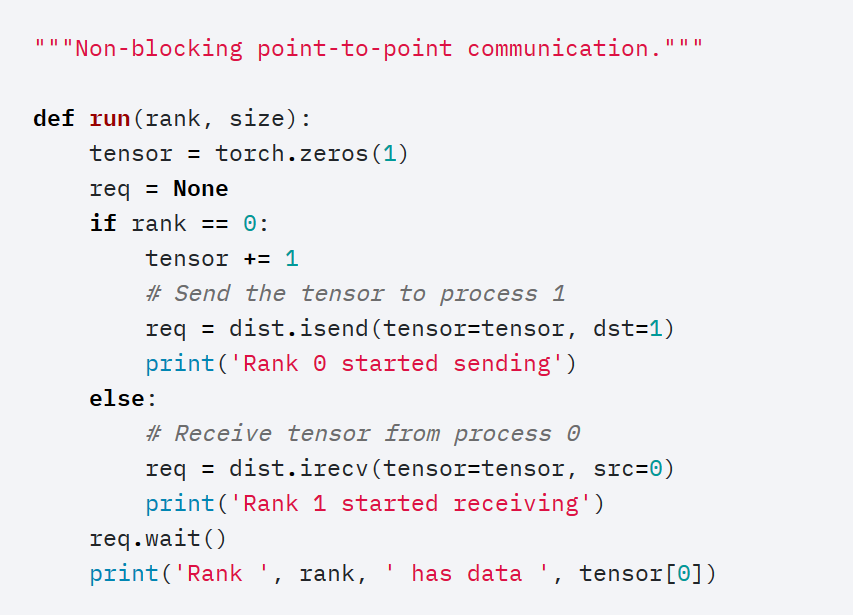
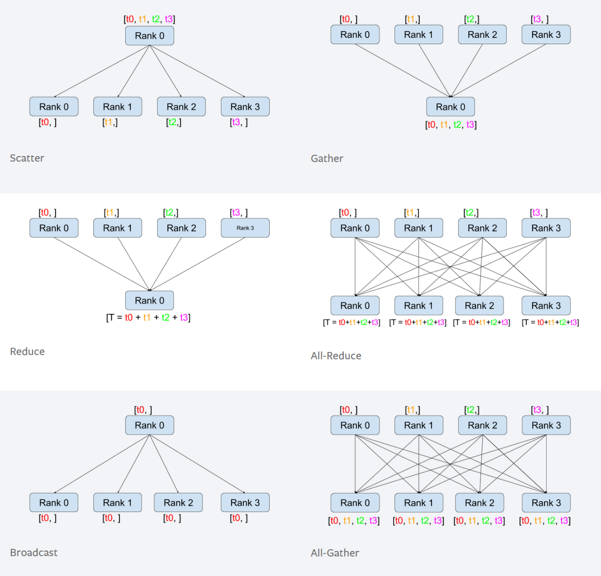
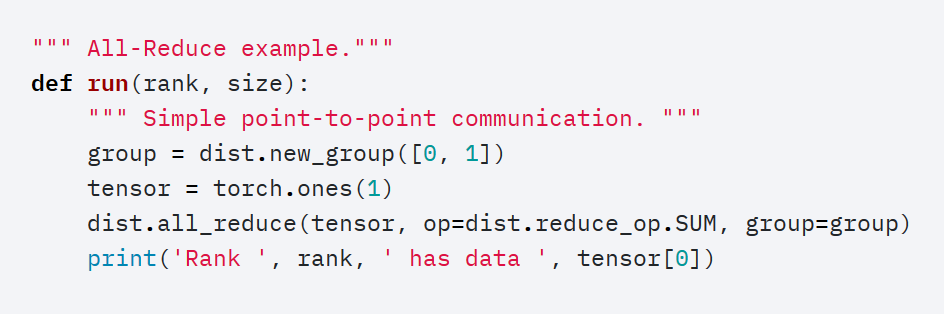
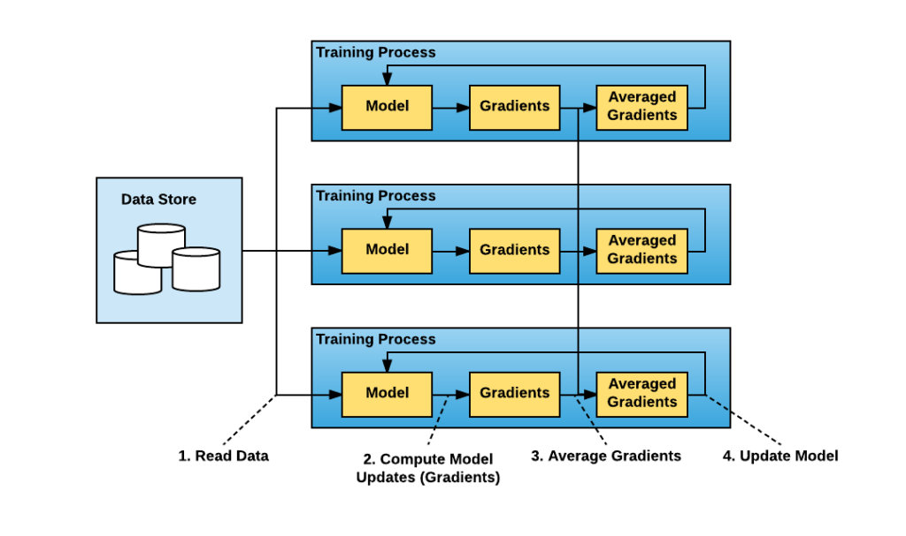

<!--Copyright © Microsoft Corporation. All rights reserved.
  适用于[License](https://github.com/microsoft/AI-System/blob/main/LICENSE)版权许可-->


# 6.4 分布式训练系统简介

- [6.4 分布式训练系统简介](#64-分布式训练系统简介)
  - [6.4.1 TensorFlow 中的分布式支持](#641-tensorflow-中的分布式支持)
  - [6.4.2 PyTorch 中的分布式支持](#642-pytorch-中的分布式支持)
  - [6.4.3 通用的数据并行系统Horovod](#643-通用的数据并行系统horovod)
  - [小结与讨论](#小结与讨论)
    - [课后实验 分布式训练任务练习](#课后实验-分布式训练任务练习)
  - [参考文献](#参考文献)

模型的分布式训练依靠相应的分布式训练系统协助完成。这样的系统通常分为：分布式用户接口、单节点训练执行模块、通信协调三个组成部分。用户通过接口表述采用何种模型的分布化策略，单节点训练执行模块产生本地执行的逻辑，通信协调模块实现多节点之间的通信协调。系统的设计目的是提供易于使用，高效率的分布式训练。

目前广泛使用的深度学习训练框架例如Tensor
Flow和PyTorch已经内嵌了分布式训练的功能并逐步提供了多种分布式的算法。除此之外，也有单独的系统库针对多个训练框架提供分布训练功能，例如Horovod等。

目前分布式训练系统的理论和系统实现都处于不断的发展当中。我们仅以TensorFlow、PyTorch和Horovod为例，从用户接口等方面分别介绍他们的设计思想和技术要点。

## 6.4.1 TensorFlow 中的分布式支持

经过长期的迭代发展，目前TensorFlow通过不同的API支持多种分布式策略(distributed
strategies)[<sup>[1]</sup>](#ref1)，如下表所示。其中最为经典的基于参数服务器“Parameter
Server”的分布式训练，TensorFlow早在版本(v0.8)中就加入了。其思路为多工作节点（Worker）独立进行本地计算，分布式共享参数。

<style>table{margin: auto;}</style>
  
 | 训练接口\策略名称     | Mirrored <br>（镜像策略）       | TPU <br>（TPU策略）  | MultiWorker-Mirrored  <br>（多机镜像策略） | CentralStorage <br>（中心化存储策略）  | ParameterServer <br>（参数服务器策略）   | OneDevice <br>（单设备策略） | 
 | -- |:--:|:--:|:--:|:--:|:--:|:--:|
 |**Keras 接口**  |     支持  |    实验性支持 |  实验性支持  |    实验性支持  |  支持 （规划2.0之后） |  支持 |
 |**自定义训练循环** | 实验性支持 | 实验性支持 | 支持 （规划2.0之后）  |  支持 （规划2.0之后） | 尚不支持  | 支持 |
 |**Estimator 接口**  |   部分支持  |  不支持  |   部分支持  |  部分支持  |    部分支持  |     部分支持 |

<center>表6-5-1: TensorFlow 中多种并行化方式在不同接口下的支持 (<a href=https://www.tensorflow.org/guide/distributed\_training>表格来源</a>)</center>


TensorFlow参数服务器用户接口包含定义模型和执行模型两部分。如下图所示，其中定义模型需要完成指定节点信息以及将
“原模型”逻辑包含于工作节点；而执行模型需要指定角色 job\_name是ps参数服务器还是worker工作节点，以及通过index指定自己是第几个参数服务器或工作节点[<sup>[2]</sup>](#ref2)。


```python
cluster = tf.train.ClusterSpec({
    "worker": [
      {1:"worker1.example.com:2222"},
    ]
    "ps": [
      "ps0.example.com:2222",
      "ps1.example.com:2222"
    ]})

if job\_name == “ps”:
    server.join()
elif job\_name == “worker”:
    …
```

<!-- <center></center> -->
<center>图6-4-1: TensorFlow 定义节点信息和参数服务器方式并行化模型 (<a href=https://www.tensorflow.org/api_docs/python/tf/train/ClusterSpec>参考来源</a>)</center>


在TensorFlow的用户接口之下，系统在底层实现了数据流图的分布式切分。如下图所示的基本数据流图切分中，TensorFlow根据不同operator的设备分配信息，将整个数据流图图划分为每个设备的子图，并将跨越设备的边替换为“发送”和“接收”的通信原语。

<center></center>
<center>图6-4-2：数据流图的跨节点切分</center>

<center></center>
<center>图6-4-3: 采用参数服务器并行的数据流图</center>

在参数服务器这样的数据并行中，参数以及更新参数的操作被放置于参数服务器之上，而每个工作节点负责读取训练数据并根据最新的模型参数产生对应的梯度并上传参数服务器。而在其它涉及模型并行的情况下，每个工作节点负责整个模型的一部分，相互传递激活数据进行沟通协调，完成整个模型的训练。

我们可以注意到每条跨设备的边在每个mini-batch中通信一次，频率较高。而传统的实现方式会调用通信库将数据拷贝给通信库的存储区域用于发送，而接收端还会将收到通信库存储区域的数据再次拷贝给计算区域。多次的拷贝会浪费存储的空间和带宽。

而且由于深度模型训练的迭代特性，每次通信都是完全一样的。因此，我们可以通过“预分配+RDMA+零拷贝”的方式对这样的通信进行优化。其基本思想是将GPU中需要发送的计算结果直接存储于RDMA网卡可见的连续显存区域，并在计算完成后通知接收端直接读取，避免拷贝[<sup>[3]</sup>](#ref3)
。

通过这样的介绍我们可以看到，在TensorFlow训练框架的系统设计思想是将用户接口用于定义并行的基本策略，而将策略到并行化的执行等复杂操作隐藏于系统内部。这样的做法好处是用户接口较为简洁，无需显示地调用通信原语。但随之而来的缺陷是用户无法灵活地定义自己希望的并行及协调通信方式。

## 6.4.2 PyTorch 中的分布式支持

与TensorFlow相对的，PyTorch
的用户接口更倾向于暴露底层的通信原语用于搭建更为灵活的并行方式。PyTorch的通信原语包含**点对点通信**和**集体式通信**。
点对点（P2P)式的通信是指每次通信只涉及两个设备，期间采用基础的发送（send）和接受（receive）原语进行数据交换。而集体式通信，则在单次通信中有多个设备参与，例如广播操作（broadcast）就是一个设备将数据发送给多个设备的通信[<sup>[4]</sup>](#ref4)
。
分布式机器学习中使用的集体式通信大多沿袭自MPI标准的集体式通信接口。


PyTorch 点对点通信可以实现用户指定的同步 send/recv，例如下图表达了：rank 0 *send* rank 1 *recv* 的操作。


```python
"""Blocking point-to-point communication."""

def run(rank, size):
  tensor = torch.zeros(1)
  if rank == 0:
    tensor += 1
    # Send the tensor to process 1
    dist.send(tensor=tensor, dst=1)
  else:
    # Receive tensor from process 0
    dist.recv(tensor=tensor, src=0)
  print('Rank ', rank, ' has data ', tensor\[0\])
```
<!-- <center></center> -->
<center>图6-4-4: PyTorch中采用点对点同步通信 (<a href=https://pytorch.org/tutorials/intermediate/dist_tuto.html>参考来源</a>)</center>


除了同步通信，PyTorch还提供了对应的异步发送接收操作。

```python
"""Non-blocking point-to-point communication."""

def run(rank, size):
  tensor = torch.zeros(1)
  req = None
  if rank == 0:
    tensor += 1
    # Send the tensor to process 1
    req = dist.isend(tensor=tensor, dst=1)
    print('Rank 0 started sending')
  else:
    # Receive tensor from process 0
    req = dist.irecv(tensor=tensor, src=0)
    print('Rank 1 started receiving')
  
  req.wait()
  print('Rank ', rank, ' has data ', tensor\[0\])
```
<!-- <center></center> -->
<center>图6-4-5: PyTorch中采用点对点异步通信 (<a href=https://pytorch.org/tutorials/intermediate/dist_tuto.html>参考来源</a>)</center>


PyTorch 集体式通信包含了一对多的 Scatter / Broadcast， 多对一的 Gather / Reduce 以及多对多的 *All-Reduce* / *AllGather*。

<center></center>
<center>图6-4-6: PyTorch中的集体式通信 (<a href=https://pytorch.org/tutorials/intermediate/dist_tuto.html>图片来源</a>)</center>

下图以常用的调用All-Reduce为例，它默认的参与者是全体成员，也可以在调用中以列表的形式指定集体式通信的参与者。比如这里的参与者就是rank 0 和 1。

```python
""" All-Reduce example."""
def run(rank, size):
  """ Simple collective communication. """
  group = dist.new\_group(\[0, 1\])
  tensor = torch.ones(1)
  dist.all\_reduce(tensor, op=dist.ReduceOp.SUM, group=group)
  print('Rank ', rank, ' has data ', tensor\[0\])
```
<!-- <center></center> -->
<center>图6-4-7: 指定参与成员的集体式通信 (<a href=https://pytorch.org/tutorials/intermediate/dist_tuto.html>图片来源</a>) </center>


通过这样的通信原语，PyTorch也可以构建数据并行等算法，且以功能函数的方式提供给用户调用。但是这样的设计思想并不包含TensorFlow中系统下层的数据流图抽象上的各种操作，而将整个过程在用户可见的层级加以实现，相比之下更为灵活，但在深度优化上欠缺全局信息。

## 6.4.3 通用的数据并行系统Horovod 

*“Horovod is a distributed deep learning training framework for
**TensorFlow, Keras, PyTorch**, and **Apache MXNet**. The goal of
Horovod is to make distributed deep learning fast and easy to use.”*

在各个深度框架针对自身加强分布式功能的同时，Horovod[<sup>[5]</sup>](#ref5)专注于数据并行的优化，并广泛支持多训练平台且强调易用性，依然获得了很多使用者的青睐。

<center></center>
<center>图6-4-8: Horovod 实现数据并行的原理 (<a href=https://arxiv.org/pdf/1802.05799.pdf>图片来源</a>) </center>

如果需要并行化一个已有的模型，Horovod在用户接口方面需要的模型代码修改非常少，其主要是增加一行利用Horovod的DistributedOptimizer分布式优化子嵌套原模型中优化子：

```python
opt = DistributedOptimizer(opt)
```

而模型的执行只需调用MPI命令:
```
mpirun –n <worker number>; train.py
```
即可方便实现并行启动。

```python
import torch
import horovod.torch as hvd

# Initialize Horovod
hvd.init()

# Pin GPU to be used to process local rank (one GPU per process)
torch.cuda.set_device(hvd.local_rank())

# Define dataset...
train_dataset = ...

# Partition dataset among workers using DistributedSampler
train_sampler = torch.utils.data.distributed.DistributedSampler(
  train_dataset, num_replicas=hvd.size(), rank=hvd.rank())

train_loader = torch.utils.data.DataLoader(train_dataset,
               batch_size=..., sampler=train_sampler)

# Build model...
model = ...
model.cuda()
optimizer = optim.SGD(model.parameters())

# Add Horovod Distributed Optimizer
optimizer = hvd.DistributedOptimizer(optimizer,
            named_parameters=model.named_parameters())

# Broadcast parameters from rank 0 to all other processes.
hvd.broadcast_parameters(model.state_dict(), root_rank=0)

for epoch in range(100):
  for batch_idx, (data, target) in enumerate(train_loader):
    optimizer.zero_grad()
    output = model(data)
    loss = F.nll_loss(output, target)
    loss.backward()
    optimizer.step()
    
    if batch_idx % args.log_interval == 0:
      print('Train Epoch: {} [{}/{}]tLoss: {}'.format(
        epoch, batch_idx * len(data), len(train_sampler), loss.item()))
```

<!-- <center></center> -->
<center>图6-4-9: 调用 Horovod 需要的代码修改 (<a href=https://github.com/horovod/horovod>参考来源</a>) </center>


Horovod通过DistributedOptimizer 插入针对梯度数据的 Allreduce 逻辑实现数据并行。对于TensorFlow，插入通信 Allreduce 算子，而在PyTorch中插入通信 Allreduce 函数。二者插入的操作都会调用底层统一的Allreduce功能模块。

为了保证性能的高效性，Horovod实现了专用的**协调机制算法**：

目标：确保 Allreduce 的执行全局统一进行

-   每个工作节点拥有 Allreduce 执行队列，初始为空

-   全局协调节点（Coordinator），维护每个工作节点各个 梯度张量 状态

执行：

-   工作节点\_i产生梯度g\_j后会调用Allreduce(g\_j)，通知协调节点 “g\_j\[i\]
    ready”

-   当协调节点收集到所有”g\_j\[\*\] ready”,
    通知所有工作节点将g\_i加入Allreduce执行队列

-   工作节点背景线程不断pop Allreduce队列并执行

这里需要确保Allreduce全局统一执行主要为了：确保相同执行顺序，保证Allreduce针对同一个梯度进行操作；Allreduce通常是同步调用，为了防止提前执行的成员会空等，导致资源浪费。

Horovod通过一系列优化的设计实现，以独特的角度推进了分布式训练系统的发展。其中的设计被很多其它系统借鉴吸收，持续发挥更为广泛的作用。


## 小结与讨论

本节通过实际分布式机器学习功能的介绍，提供给读者实际实现的参考。同时通过不同系统的比较与讨论，提出系统设计的理念与反思。

### 课后实验 分布式训练任务练习
<!-- 本章的内容学习之后可以参考[实验4](../../Labs/BasicLabs/Lab4/README.md)以及[实验7](../../Labs/BasicLabs/Lab7/README.md)进行对应的部署练习以加深理解分布式通信算法以及实际的训练性能。 -->

**实验目的**

1.	学习使用Horovod库。
2.	通过调用不同的通信后端实现数据并行的并行/分布式训练，了解各种后端的基本原理和适用范围。
3.	通过实际操作，灵活掌握安装部署。

实验环境（参考）

* Ubuntu 18.04
* CUDA 10.0
* PyTorch==1.5.0
* Horovod==0.19.4

实验原理：通过测试MPI、NCCL、Gloo、oneCCL后端完成相同的allreduce通信，通过不同的链路实现数据传输。

**实验内容**

实验流程图

<!--  -->

<center></center>
<center>图6-4-10: 分布式训练任务练习 实验流程图 </center>

具体步骤

1.	安装依赖支持：OpenMPI[<sup>[10]</sup>](#ref10), Horovod[<sup>[6]</sup>](#ref6)。

2.	运行Horovod MNIST测试用例 `pytorch_mnist_horovod.py`[<sup>[7]</sup>](#ref7) ，验证Horovod正确安装。
<!-- (`Lab7/pytorch_mnist_horovod.py`) -->

3.	按照MPI/Gloo/NCCL的顺序，选用不同的通信后端，测试不同GPU数、不同机器数时，MNIST样例下iteration耗时和吞吐率，记录GPU和机器数目，以及测试结果，并完成表格绘制。

    3.1. 安装MPI，并测试多卡、多机并行训练耗时和吞吐率。可参考如下命令：
        ```
        //单机多CPU
        $horovodrun -np 2 python pytorch_mnist_horovod.py --no-cuda

        //多机单GPU
        $horovodrun -np 4 -H server1:1,server2:1,server3:1,server4:1 python pytorch_mnist_horovod_basic.py
        ```

    3.2. 测试Gloo下的多卡、多机并行训练耗时。

    3.3. 安装NCCL2[<sup>[9]</sup>](#ref9)后重新安装horovod并测试多卡、多机并行训练耗时和吞吐率。


4.	（可选）安装支持GPU通信的MPI后重新安装horovod[<sup>[8]</sup>](#ref8)并测试多卡、多机并行训练耗时和吞吐率。

    ```
    $ HOROVOD_GPU_ALLREDUCE=MPI pip install --no-cache-dir horovod
    ```

5.	（可选）若机器有Tesla/Quadro GPU + RDMA环境，尝试设置GPUDirect RDMA 以达到更高的通信性能

6.	统计数据，绘制系统的scalability曲线H

7.	（可选）选取任意RNN网络进行并行训练，测试horovod并行训练耗时和吞吐率。


**实验报告**

实验环境

||||
|--------|--------------|--------------------------|
|硬件环境|服务器数目|&nbsp; &nbsp; &nbsp; &nbsp; &nbsp; &nbsp; &nbsp; &nbsp; &nbsp; &nbsp; &nbsp; &nbsp; &nbsp; &nbsp; &nbsp; &nbsp; &nbsp; &nbsp; &nbsp; &nbsp; |
||网卡型号、数目||
||GPU型号、数目||
||GPU连接方式||
|软件环境|OS版本||
||GPU driver、(opt. NIC driver)||
||深度学习框架<br>python包名称及版本||
||CUDA版本||
||NCCL版本||
||||

<center>表6-5-2: 实验环境记录</center>

实验结果
1.	测试服务器内多显卡加速比

    |||||||
    |-----|-----|-----|-----|------|------|
    | 通信后端 | 服务器数量 | 每台服务器显卡数量 | 平均每步耗时 | 平均吞吐率 | 加速比 |
    | MPI / Gloo / NCCL | 1/2/4/8 | (固定) | | | |
    |||||||

<center>表6-5-3: 单节点内加速比实验记录</center>

2.	测试服务器间加速比

    |||||||
    |-----|-----|-----|-----|------|------|
    | 通信后端 | 服务器数量 | 每台服务器显卡数量 | 平均每步耗时 | 平均吞吐率 | 加速比 |
    | MPI / Gloo / NCCL | (固定) | 1/2/4/8 ||||
    |||||||

<center>表6-5-4: 跨机加速比实验记录</center>


3.	总结加速比的图表、比较不同通信后端的性能差异、分析可能的原因

4.	（可选）比较不同模型的并行加速差异、分析可能的原因（提示：计算/通信比）


**参考代码**

1. 安装依赖支持

    安装OpenMPI：`sudo apt install openmpi-bin`

    安装Horovod：`python3 -m pip install horovod==0.19.4 --user`

2. 验证Horovod正确安装

    运行mnist样例程序
    ```
    python pytorch_mnist_horovod_basic.py
    ```
3. 选用不同的通信后端测试命令

    1.	安装MPI，并测试多卡、多机并行训练耗时和吞吐率。
        ```
        //单机多CPU
        $horovodrun -np 2 python pytorch_mnist_horovod.py --no-cuda

        //单机多GPU
        $horovodrun -np 2 python pytorch_mnist_horovod.py

        //多机单GPU
        $horovodrun -np 4 -H server1:1,server2:1,server3:1,server4:1 python pytorch_mnist_horovod_basic.py

        //多机多CPU
        $horovodrun -np 16 -H server1:4,server2:4,server3:4,server4:4 python pytorch_mnist_horovod_basic.py --no-cuda

        //多机多GPU
        $horovodrun -np 16 -H server1:4,server2:4,server3:4,server4:4 python pytorch_mnist_horovod_basic.py

        ```
    2.	测试Gloo下的多卡、多机并行训练耗时。
        ```
        $horovodrun --gloo -np 2 python pytorch_mnist_horovod.py --no-cuda

        $horovodrun -np 4 -H server1:1,server2:1,server3:1,server4:1 python pytorch_mnist_horovod_basic.py

        $horovodrun –gloo -np 16 -H server1:4,server2:4,server3:4,server4:4 python pytorch_mnist_horovod_basic.py --no-cuda

        ```
    3.	安装NCCL2后重新安装horovod并测试多卡、多机并行训练耗时和吞吐率。
        ```
        $HOROVOD_GPU_OPERATIONS=NCCL pip install --no-cache-dir horovod

        $horovodrun -np 2 -H server1:1,server2:1 python pytorch_mnist_horovod.py
        ```
    4.	安装支持GPU通信的MPI后重新安装horovod并测试多卡、多机并行训练耗时和吞吐率。
        ```
        HOROVOD_GPU_ALLREDUCE=MPI pip install --no-cache-dir horovod
        ```


## 参考文献

<div id="ref1"></div>

1. [TensorFlow Distributed Training](https://www.tensorflow.org/guide/distributed\_training)

<div id="ref2"></div>

2. [TensorFlow ClusterSpec](https://www.tensorflow.org/api_docs/python/tf/train/ClusterSpec)

<div id="ref3"></div>

3. [Fast Distributed Deep Learning over RDMA. (EuroSys'19)](https://dl.acm.org/doi/10.1145/3302424.3303975)

<div id="ref4"></div>

4. [PyTorch Distributed Tutorial](https://pytorch.org/tutorials/intermediate/dist_tuto.html)

<div id="ref5"></div>

5. [Horovod: fast and easy distributed deep learning in TensorFlow](https://arxiv.org/pdf/1802.05799.pdf)

<div id="ref6"></div>

6. [Horovod on Github](https://github.com/horovod/horovod)

<div id="ref7"></div>

7. [PyTorch MNIST 测试用例](https://github.com/horovod/horovod/blob/master/examples/pytorch/pytorch_mnist.py)

<div id="ref8"></div>

8. [Horovod on GPU](https://github.com/horovod/horovod/blob/master/docs/gpus.rst)

<div id="ref9"></div>

9. [NCCL2 download](https://developer.nvidia.com/nccl/nccl-download)

<div id="ref10"></div>

10. [OpenMPI](https://www.open-mpi.org/software/ompi/v4.0/)