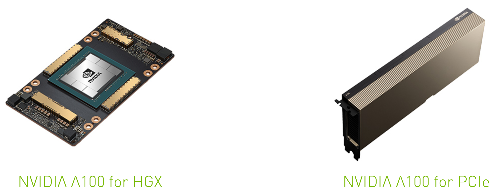
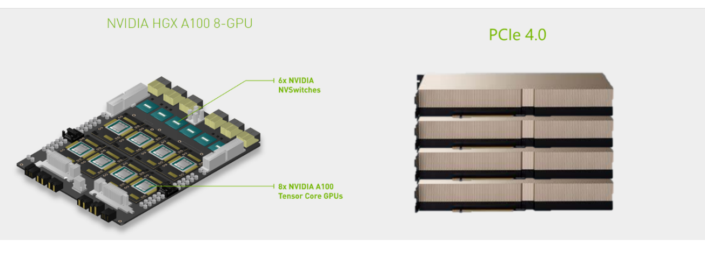
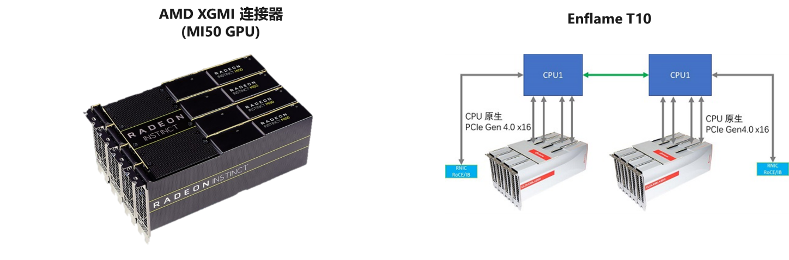
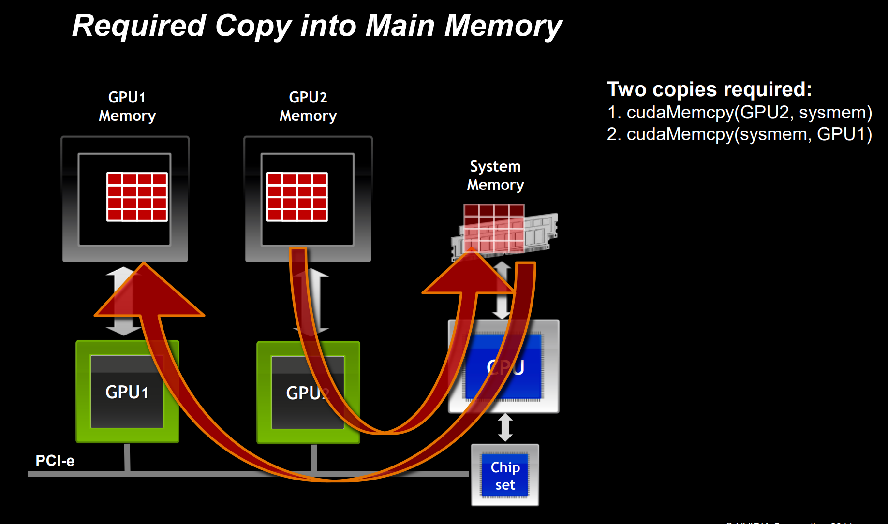
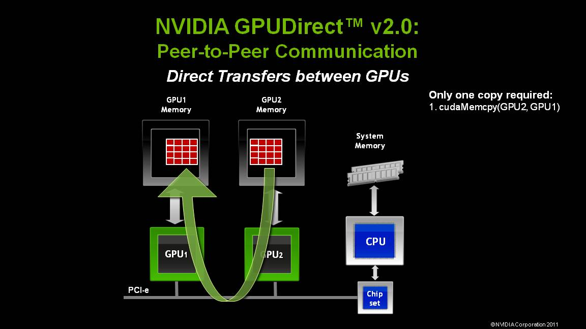
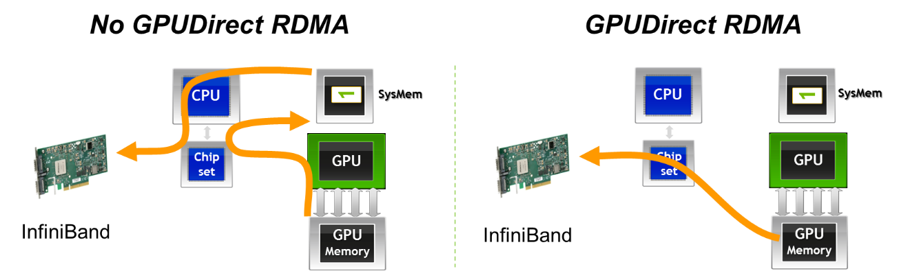
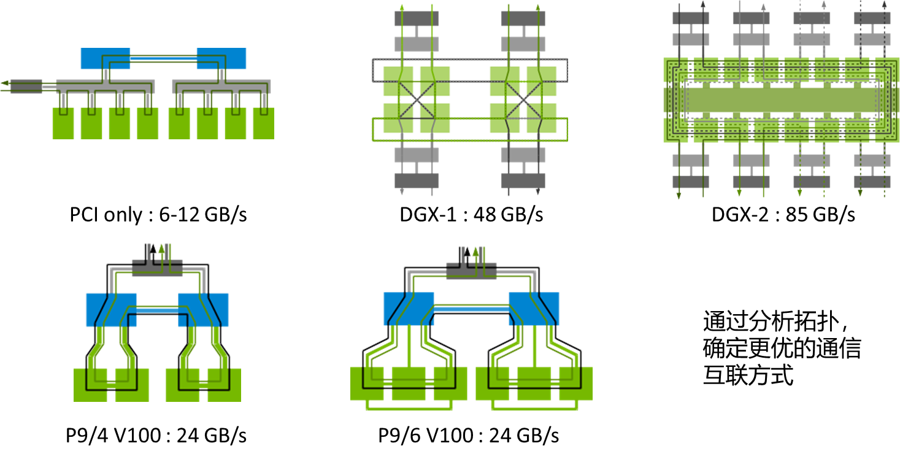

<!--Copyright © Microsoft Corporation. All rights reserved.
  适用于[License](https://github.com/microsoft/AI-System/blob/main/LICENSE)版权许可-->

# 6.6 分布式训练的通信协调

通信协调在分布式训练的整体性能中起到了举足轻重的作用。众多软硬件技术在深度学的发展过程中被提出和应用。本节以
GPU为例，介绍目前深度学习中所采用的主流通信技术。

按照方式，通信可分为：机器内通信和机器间通信。前者包含：共享内存、GPUDirect
P2P over PCIe、GPUDirect P2P over NVLink，而后者包含：TCP/IP网络、
RDMA网络和GPUDirect RDMA网络。

## 6.6.1 通信协调的硬件

<!-- {width="6.0in"
height="2.3534722222222224in"} -->

图6-6-1: 常见的加速设备形式 

Figure: <https://www.nvidia.com/en-us/data-center/a100/>

<!-- {width="5.930555555555555in"
height="2.1974562554680666in"} -->

图6-6-2: 多设备通过不同的方式互联 

Figure: nvidia.com

图示了两种常见的GPU硬件形式（上）以及连接方式（下）：NVLink (300GB/s) vs. PCIe 4.0 (32GB/s)。二者的链路带宽差距高达约10倍。众多实际训练表明，高带宽链路极大地提高了并行训练的总体性能。因此，我们可以看到无论是节点内的多设备以及节点间的网络，链路带宽近些年都取得了大幅提升。

<!-- {width="6.522334864391951in"
height="3.0293722659667544in"} -->

图6-6-3: 常见设备互联的带宽 

Figure: Sylvain Jeaugey, NVIDIA, DISTRIBUTED DEEP NEURAL NETWORK
TRAINING: NCCL ON SUMMIT <https://www.olcf.ornl.gov/wp-content/uploads/2019/12/Summit-NCCL.pdf>

A100 NVLink perf from: <https://www.microway.com/hpc-tech-tips/dgx-a100-review-throughput-and-hardware-summary/>

A100 network perf on all\_reduce bandwidth 4 nodes via <https://techcommunity.microsoft.com/t5/azure-global/performance-considerations-for-large-scale-deep-learning/ba-p/2693834>
(187 GB/s)

除了NVIDIA之外，其它加速器硬件厂商也提出了类似的高速数据链路。下图分别是AMD和隧原科技设计的加速器互联硬件。

<!-- {width="6.5605118110236225in"
height="2.166078302712161in"}

{width="5.545833333333333in"
height="2.8048611111111112in"} -->

图6-6-4: 常见的一些PCIe设备互联硬件背板 

Figure: [(Left) OCP Summit](<https://146a55aca6f00848c565-a7635525d40ac1c70300198708936b4e.ssl.cf1.rackcdn.com/images/442f418201b7eb32089aa12895ee78977d03bea1.pdf>)；
[(Right) Enflame T10 Manual](<https://www.enflame-tech.com/support>) 

而依据GPU的硬件互联结构，可以绘制出互联拓扑。目前的互联结构存在多种不同的拓扑，如下图所示。

图6-6-5: 常见的加速设备硬件互联拓扑 

[Figure：Sylvain Jeaugey, NVIDIA, DISTRIBUTED DEEP NEURAL NETWORK TRAINING: NCCL ON SUMMIT](<https://www.olcf.ornl.gov/wp-content/uploads/2019/12/Summit-NCCL.pdf>)

除了通信拓扑，通信的协议也在不断迭代。如下图的**GPUDirect
P2P**，GPU可以直接访问另一GPU的显存，无需CPU介入或系统内存中转，从而实现“零拷贝（zero-copy）。

> 条件：Tesla / Quadra GPUs + NVLink / 同一PCIe root

<!-- {width="4.05788823272091in"
height="2.3958333333333335in"}

{width="4.027777777777778in"
height="2.6401377952755904in"} -->

图6-6-6: 传统通过PCIe和CPU内存进行的设备间通信 

图6-6-7: 通过PCIe直接进行设备间通信 

Figure: <http://developer.download.nvidia.com/compute/cuda/4_0/CUDA_Toolkit_4.0_Overview.pdf>

而在跨节点网络中也有类似的协议**GPUDirect
RDMA**，实现了GPU中的数据通过网络直接发送，无需系统内存中转，也实现了“零拷贝（zero-copy）”。但这里网络操作仍需CPU发起，因此与GPUDirect
P2P的纯GPU操作有所区别。

> 条件：Tesla / Quadra GPUs + RDMA NIC + GPU NIC同一PCIe root

<!-- {width="6.0in"
height="1.7965277777777777in"} -->

图6-6-8: GPUDirect RDMA 通信

Figure: <https://developer.nvidia.com/gpudirect>

## 6.6.2 通信协调的软件

**分布式训练系统 通信库**

为了更好地服务深度学习等GPU任务，NVIDIA提出了针对其GPU等硬件产品的通信库**NCCL
: NVIDIA Collective Communication Library**。

<!-- {width="4.833333333333333in"
height="2.2977876202974628in"} -->

图6-6-9: GPU通信库的系统定位 

NCCL提供类似MPI的通信接口，包含集合式通信（collective communication）all-gather、 all-reduce、 broadcast、 reduce、reduce-scatter 以及点对点(point-to-point)通信send 和receive。

**拓扑感知的通信**NCCL这样的通信库中目前能够提供的通信算法主要针对已有的标准硬件，相对比较有限的，而有研究工作(例如 [SCCL](<https://github.com/microsoft/sccl>）)根据连接拓扑和带宽延迟等信息，可以综合设计性能更为优化的通信算法。

<!-- {width="6.931071741032371in"
height="3.5575634295713034in"} -->

图6-6-10: 常见的GPU互联结构下的通信拓扑 

[Figure: Sylvain Jeaugey, NVIDIA, DISTRIBUTED DEEP NEURAL NETWORK TRAINING: NCCL ON SUMMIT](<https://www.olcf.ornl.gov/wp-content/uploads/2019/12/Summit-NCCL.pdf>)

除了NVIDIA之外，其它的厂商也发布了针对自身产品的高效通信库，例如AMD的RCCL以及intel的OneCCL。

随着硬件的快速发展，带来了更高的性能和更大的优化机遇，因此软件研究方面的迭代，尤其是支持分布式深度学习训练的算法硬件协同设计的研究，依然存在这巨大的潜力。

---------------------

### 思考题：为什么模型训练通常需要分布式进行，而分布式模型预测并不常见？

* 计算模式不同：预测任务占用存储更小，更容易放在单个设备中

* 训练需要各个worker保持通信，从而协调统一地**更新**模型参数；

* 预测中的模型参数是**固定**的，各个worker分别使用只读副本，无需相互通信协调
