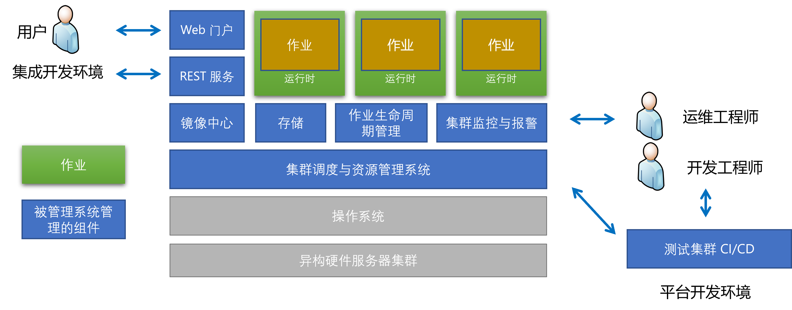
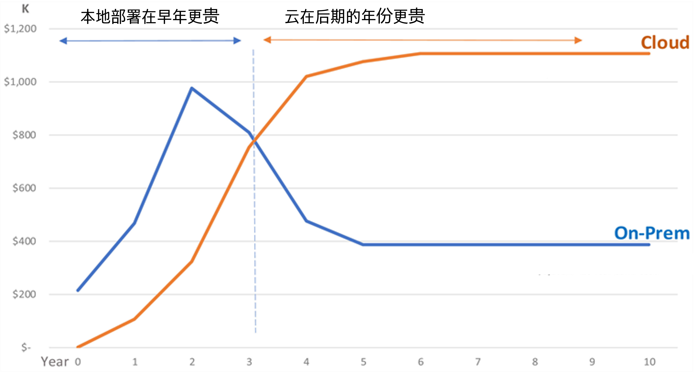

<!--Copyright © Microsoft Corporation. All rights reserved.
  适用于[License](https://github.com/microsoft/AI-System/blob/main/LICENSE)版权许可-->

# 7.1 异构计算集群管理系统简介

本章介绍异构集群管理系统的设计初衷，需要解决的问题及挑战，并通过启发式实例以更为具象的方式展开介绍。之后我们会交替使用集群管理系统与平台代表当前的异构计算集群管理系统。

在展开前，我们回顾一下操作系统是什么？[操作系统](https://en.wikipedia.org/wiki/Operating_system)是管理计算机硬件、软件资源并为计算机程序提供通用服务的系统软件。那么我们也可以认为，异构计算集群管理系统是管理计算机集群内的多节点硬件（GPU，CPU，内存，磁盘等）、软件资源（框架，作业，镜像等）并为计算机程序（通常为深度学习训练作业程序）提供通用作业开发服务（提交，调试，监控，克隆等）的系统软件。

- [7.1 异构计算集群管理系统简介](#71-异构计算集群管理系统简介)
  - [7.1.1 多租环境运行的训练作业](#711-多租环境运行的训练作业)
  - [7.1.2 作业生命周期](#712-作业生命周期)
  - [7.1.3 集群管理系统架构](#713-集群管理系统架构)
  - [小结与讨论](#小结与讨论)
  - [参考文献](#参考文献)

## 7.1.1 多租环境运行的训练作业

图 7.1.1 多租环境提交运行作业

在企业级深度学习场景下，大型企业有很多机器学习科学家与工程师，组织有大量的 GPU 服务器，为了组织效率的提升与资源共享，就诞生了针对深度学习场景下设计的多租户的平台系统。
如图 7.1.1 所示，企业级环境下，不同用户会提交不同框架（例如， PyTorch，TensorFlow等）的深度学习作业，有不同作业的资源需求（例如，单 GPU 卡，多 GPU 卡），共享一个物理集群才能让组织减少硬件资源浪费。
多租户（Multi-Tenancy）技术是一种软件架构技术，它实现如何于多用户多作业的环境下，共用使用系统或程序组件，并且仍可确保各用户间资源和数据保持隔离性。又由于当前深度学习场景下，平台系统管理的资源是异构（例如, CPU，GPU 等）的。所以本章主要介绍的是管理“异构资源”，调度“深度学习作业”的，“多租户”的平台系统（Platform System）。

多用户共享多 GPU 服务器相比原来深度学习开发者独占使用服务器进行模型训练，有很大的不同，如图 7.1.1 所示。这也为异构计算集群管理系统（简称，平台，深度学习平台）的设计产生了相应的需求。主要体现在以下几点:

- 多作业（Job），多用户
  - 每个用户需要不断改进模型，超参数调优，调试与优化作业，这样会提交大量的作业到平台。
  - 不同业务与应用场景（例如，计算机视觉，自然语言处理，语音识别等任务）的人工智能团队在使用平台。不同的团队有多名人工智能工程师，他们会在同一时段向平台申请资源执行作业。
- 作业环境需求多样
  - 目前深度学习的技术栈并不统一，有的用户使用 TensorFlow，有的用户使用 PyTorch，还有些可能是用 Hugging Face 等上层库。由于用户可能使用开源的项目，有些项目已经较为陈旧，有些项目又使用了最新框架，用户不想再每次都做版本适配，而原作者开源的框架版本也可能不一样，造成底层依赖，例如 NVIDIA CUDA 等也可能版本不同。同时用户如果共享机器，需要对依赖的环境互不干扰，不希望其他用户安装的 Python，PyTorch 等版本影响自己的作业需要的环境。
- 作业资源需求多样
  - 用户提交的作业有些是分布式训练作业，对资源需求较多，有些是单机的训练或者调试任务，对资源的需求较少，有些是大规模分布式训练任务用到几百甚至上千块 GPU。同时由于不同作业的模型不同，超参数不同，造成即使申请的 GPU 数量一致的情况下，资源利用率也不同。平台需要按需求做好资源的分配，减少资源碎片。
  对用户来说，不希望作业本身受到其他作业的硬件资源与命名空间冲突的干扰，理想是像使用独占资源一样运行自己的作业。因为有些用户可能是在赶某个截止任务，希望尽可能快的执行完成模型训练。平台需要做好运行期资源隔离，保证好服务质量。
- 服务器软件环境单一
  - 平台方在采购资源，安装底层操作系统和驱动时，很难规划和指定未来用户的软件和版本，同时为了运维和部署减少软件兼容性问题，一般将服务器安装统一的操作系统，驱动，并让其版本保持一致，减少运维负担。这与之前用户的多样环境需求产生了矛盾。同时即使安装不同的操作系统和环境，由于用户的作业类型环境需求动态变化且很难提前规划，也无法做到精准适配，所以集群都是底层统一软件和操作系统版本，以期通过类似云的方式，通过镜像等手段对每个用户提供个性化的环境，但是云平台的镜像加载与制作开销较大，对专有场景用户也没有那么高的安全与隔离需求，似乎也不是效率最高的解决方法。
- 服务器空闲资源多样
  - 虽然平台一般批量购买同型号大量机器。但由于用户的作业申请资源多样，作业生命周期多样，造成资源释放后，平台上的空闲资源的组合比较多样，需要设计好调度策略，尽可能提升资源的利用率。

从以上的问题，我们可以看到调度与资源管理问题需要一个统一的平台系统来支撑。它底层抽象并管理计算资源，对上层应用提供隔离并且易用的作业运行时环境，整理来说我们可以理解其为支持深度学习应用的管理分布式 GPU 服务器集群的操作系统。我们可以总结以下几点来概括平台的使命和重要性：

- 提供人工智能开发与模型生产的基础架构支持：
  - 高效地深度学习作业调度与管理：根据作业资源需求，分配和回收计算资源，提升利用率的同时，保持一定的公平性等。对组织来说，本身希望更高的投入产出比，希望购买的硬件本身能够被高效的利用。
  - 稳定地异构硬件管理：高效运维，动态扩容，节点问题修复等运维功能的支持。管理员和用户可以监控节点及硬件资源状态和利用率等。当服务器扩展到更多的节点之后，造成集群内有更高的概率在同一段时间内有一台节点故障，而且这个概率会随着服务器的增加而增加，所以做好平台本身的容错，重试机制，是在设计之初就需要提前规划和考量的。
- 提升用户的研发生产力：
  - 用户专注于模型创新，无需关注系统部署，管理。通过镜像等技术，让用户打包软件依赖，简化部署与安装。同时如果能提供很多通用模板，加速库，最佳实践文档等，都会在一定程度上提升整体的生产力。
  - 运行时资源与软件依赖隔离，让用户像独占服务器一样使用运行时资源，执行作业，保持良好的用户体验。
  - 模型，代码和数据共享，加速研究与创新。组织内共享与提供模块化可复用的代码，模型，镜像与工作流支持，加速创新。当前人工智能社区中新的研究工作层出不穷，如何高效的支持新想法新实验的验证，减少在部署和环境方面投入的时间，也是平台本身需要为用户提供的基本保障。

但是我们也可以看到用户追求独占使用资源的体验需求与组织平台希望共享资源提升利用率的需求是需要取舍与平衡的，这其中需要底层技术的支持，也需要管理机制策略，用户培训等其他手段的协同作用才能取得双方的平衡。

请读者思考，如果你是用户，你希望平台提供什么样的资源和服务？换个角度，如果你是平台管理员，你希望你的平台是被如何管理的，给用户提供以什么样的系统使用体验？这其中是否会有相应的矛盾的地方？

## 7.1.2 作业生命周期

在展开平台组件与功能前，让我们先了解一下，一个深度学习作业，在平台上是如何提交并执行的，也就是作业的生命周期。

图 7.1.2 GPU 集群

平台上作业生命周期：

1. 作业提交与排队：用户先将作业的依赖环境在本地测试成功后，打包为镜像，并上传到公共镜像中心（例如，Docker Hub，Azure Container Registry 等）。之后用户将代码，数据等运行作业需要的输入，上传到平台的文件系统（例如，NFS，HDFS，Azure Blob 等）。之后用户可以通过作业提交工具（例如，Web，命令行，API 等），填写资源申请（例如，几块 GPU，内存等需求规格），作业启动命令，部署方式，以及镜像，代码和数据的路径。之后点击提交即可。作业提交时，用户需要权衡资源需求和排队时间，一般资源需求越高，排队时间越长，同时需要权衡作业的成本，减少无用作业提交造成的配额与资源浪费。
2. 作业资源分配与调度：平台收到用户的资源申请后，先进行排队，调度器轮询到作业时，根据目前集群中空闲资源状况，根据一定的调度算法（例如，7.3，7.4 章节中介绍的调度算法），决定作业是在哪些拥有空闲资源的服务器节点启动，如果不满足条件，则继续排队等待。如果提交失败或超时，用户需要调整作业重新提交。
3. 作业执行完成与释放：当作业被调度器调度启动，平台会在有空闲资源的节点启动作业，下载镜像，挂载代码和数据所在的文件系统到节点本地，运行时做好资源限制与隔离，启动作业，执行作业。在作业运行中，平台监控系统不断收集运行时性能指标和日志，方便用户调试。作业执行完成后，平台会释放申请的资源，并继续分配给其他作业使用。

我们可以将作业状态抽象为以下的状态机（State Machine）：

1. 作业准备与提交：触发作业提交动作
   1. 提交成功
   2. 提交失败：重新开始 1
2. 作业排队：触发作业调度动作 
   1. 调度成功
   2. 调度失败：重新开始 1
3. 作业部署运行: 触发作业执行动作 
   1. 执行成功
   2. 作业失败，小于等于重试次数 N：重新开始 1
   3. 作业失败，大于重试次数 N：作业失败退出

用户的整个操作实际上是在以上状态中不断切换，最终达到将作业成功执行或失败。如果执行成功，用户在作业执行完成后可以获取需要的结果和深度学习模型。

在这样一个生命周期中，请大家思考集群环境下的模型训练遇到的新问题与挑战可以通过什么技术解决？

1. 如何提交作业与解决环境依赖问题？
2. 如何高效调度作业并分配资源？
3. 如何将启动的作业运行时环境，资源与命名空间隔离？ 
4. 如何面向深度学习作业和异构资源设计集群管理系统？
5. 如何高效存取数据？
6. 如何不断开发平台新功能与运维平台并保证稳定性？

## 7.1.3 集群管理系统架构

图 7.1.3. 异构集群管理系统架构

如图 7.1.3 所示，异构集群管理中通常包含很多组件，有进行资源与作业管理的调度器，有监控健康状态和报警的监控系统，有用户交互的 Web界面，也有存储数据，模型与代码的存储系统等。接下来我们看一下平台中的主要组件及功能：

***平台中的主要组件***：

1. 集群调度与资源管理模块：其统一管理集群资源，调度作业到集群空闲资源，回收运行完作业的资源。一般控制平面（Control Plane）可以选择使用 Kubernetes[[1]](#k8s)，YARN[[2]](#yarn)，Mesos[[3]](#mesos) 等系统。也可以针对深度学习作业和异构硬件特点，定制化调度策略或者使用开源深度学习调度器，例如 HiveD[[4]](#hived) 等。
   
2. 镜像中心：存储 Docker 镜像，供用户提交与共享镜像，作业下载加载镜像。一般可以选用 Docker Hub，或者处于安全和合规要求，构建私有的镜像中心，或者云上镜像中心 Azure Containter Registry 等。
   
3. 存储模块：在平台中扮演数据平面（Data Plane）角色，存储数据，模型与代码。用户上传数据，作业下载数据和上传结果与模型。存储系统一般根据性能，扩展性，稳定性等需求权衡，可以选用：NFS，Lustre，HDFS 等，或者选用云存储 AWS S3，Azure Blob 等。
   
4. 作业生命周期管理器：部署作业，监控作业，重试作业，作业错误诊断。类型属于单作业的控制平面，一般不涉及其他作业情况，自动化机器学习系统也可以构建在平台接口之上进行作业编排。生命周期管理一般可以选择使用 K8s Operator，Framework Controller，YARN AppMaster 等。
   
5. 集群监控与报警：负责集群硬件，服务与作业的状态监控与报警。监控系统一般可以选择使用 Promethus + Grafana + Alert Manager 等开源系统搭建，针对特殊需求开发监控指标收集脚本（例如，Promethus node exporter）。

6. 集成开发环境：平台也会对用户提供 Web 门户，REST服务与集成开发环境 IDE（例如，VS Code 和 Jupyter Notebook）。用户使用这些工具进行作业与数据资源提交与，作业管理监控与调试。

7. 测试集群：为了和生产环境隔离，平台开发工程师可以部署小规模的测试集群，在测试平台进行开发测试，之后再上线到生产环境集群。

***经典回顾***

从以上的平台架构图中我们可以观察到其设计也采用了关注点分离（[Separation of Concerns](https://en.wikipedia.org/wiki/Separation_of_concerns)）简称 (SoC)原则，也就是模块化的设计。SoC “是将计算机系统分成不同部分的设计原则。每个部分都解决了一个单独的问题（Concern），即一组影响计算机程序代码的信息。能够很好地体现 SoC 的系统称为模块化（Modular）系统。”例如，平台中的关注点有：调度，监控，存储，运行时等，这些部分可以剥离，以及独立演化。

除了系统本身的组件，由于系统是整体人工智能开发的基石，其被使用的用户也较为多样，那么接下来我们看一下平台中到底有哪些角色和分工：

***平台中的角色***：
1. 用户：用户打包作业镜像，上传数据和代码到存储，并书写作业规格（Specification），进而提交作业，观察作业性能和错误，如果有问题重新修改提交，如果成功则获取训练完成的模型或者处理完的数据。
2. 运维工程师：运维工程师负责监控运维和管理集群健康状况和错误，处理和应对突发事件，进行错误修复，处理和配置租户资源请求等。
3. 平台开发工程师：平台工程师负责不断开发平台服务的新组件与功能，持续集成，持续部署。

总结起来，相比以 CPU，以太网和 SSD 磁盘等硬件为代表的传统数据中心的大数据平台基础架构，面向深度学习的以 GPU，InfiniBand 等异构硬件为核心资源的基础架构有以下 ***特点*** ：
（1）硬件更新换代较快：以英伟达为代表的 GPU 厂商每个 1~2 年就有新一代 GPU 推出，提供更大的算力和内存。同时由于深度学习模型本身不断朝着参数量越大效果越好发展，对算力的需求也在不断增长，旧的硬件逐渐无法满足新作业的需求，驱动平台不断购买新的硬件。硬件的更新也意味着驱动库等基础库的频繁迭代。
（2）硬件稳定性和可观测性不如传统基础架构成熟：GPU 目前本身的稳定性，隔离性，可观测性的支持不如传统 CPU 生态成熟，造成系统运维需要投入更多的精力与自动化方式与工具。
（3）硬件成本高。GPU 等异构硬件逐渐占据服务器中的主要成本。如何更高效的使用这些昂贵的硬件资源是每个组织都需要面临的问题。
（4）计算密集型负载为主：其中的任务以深度学习，科学计算等任务为主，其本身更多为计算密集型任务，其一般使用 GPU 加速器进行加速，通过 InfiniBand 等高速网卡进行节点间互联与通信。

除了以上特点，当前平台的部署模型也比较多样，
组织一般可以根据，成本，数据合规与安全，弹性资源需求等多个维度衡量和考虑是本地还是采用云平台进行部署。平台的部署模式当前一般支持以下几种 ***部署模式*** ：

1. 本地（On-Premises）部署方式：有些公司出于数据合规，性能等需求选择使用开源（例如，OpenPAI[[5]](#pai)，Kubeflow[[6]](#kubeflow) 等）或者自研平台（例如，基于 Kuberenetes，YARN 等二次开发）进行平台本地部署，保证数据，镜像等在自有数据中心维护，这种方式对运维与开发工程师要求较高。用户需要自建数据中心或基于已有数据中心基础架构之上部署，初期需要较大投资且做好资源规划。平台层软件，监控，报警与运维等需要全职的运维团队进行维护，且需要一定的平台服务软件的定制开发能力。尤其当前以 GPU 为代表的异构芯片与硬件更新迭代较快，经历一段时间使用后，硬件容易淘汰过时，硬件规格的更新又需要面临较高的成本。
   
2. 公有云部署方式：有些公司可以采购公有云的 IaaS（虚拟机） 或者 PaaS（已有的云平台）服务进行平台搭建，好处是减轻运维压力并可以利用公有云平台最先进的技术，能够弹性伸缩资源，但是数据和代码需要上云，且长期使用成本一般会更高。此类方式初期不需要用户大量的投资与资源规划，按序付费，且平台层软件的大部分运维工作交给公有云平台进行维护，适合初期中期应用。但是出于一些数据与合规等需求，一些厂商可能无法将基础架构完全托管于公有云。也有随着基础架构规模增长造成成本与日俱增，最终入无法负担的案例出现，例如，“[NASA因存储数据过大，支付不起亚马逊 AWS 的费用的新闻](https://www.theregister.com/2020/03/19/nasa_cloud_data_migration_mess/)”[[7]](#nasa)，NASA计划新增在 AWS 数据存储空间，但迁移云端后，下载数据的成本激增，但之前并没有意识到与规划这部分高昂的预算。
   
3. 混合云：目前有些公司采用敏感数据放在本地数据中心，非敏感数据或弹性资源需求上公有云的方案，一些公有云提供商也提供了混合云机器学习平台，例如，微软提供 [Azure Arc-enabled machine learning](https://docs.microsoft.com/en-us/azure/machine-learning/how-to-attach-arc-kubernetes?tabs=studio) 服务，在一套集群管理系统中管理混合云深度学习平台资源。
   
4. 多云方式：目前有些公司出于防止锁死一家公司或者综合选取性价比最高的方案会选择多云方案，例如有些公司如 [HashiCorp](https://www.hashicorp.com/) 等提供多云运维工具与服务。在 Hotos '21 上 UCB 的 Ion Stoica 和 Scott Shenker 发表“[From Cloud Computing to Sky Computing](https://sigops.org/s/conferences/hotos/2021/papers/hotos21-s02-stoica.pdf)”[[8]](#sky)，这篇文章简而言之，它应该很容易让开发人员构建多云应用程序，不同的基础设施模块和服务可以来源不同的云服务提供商，也称此为天空计算（Sky Computing）。但是当前商业化的提供商受限于性能安全等因素。常用的资源服务组合更多是在同一家云服务供应商，多云更多的是在供应商间提供无缝切换整体基础设施，例如，[HashiCorp](https://www.hashicorp.com/) 等。

如图 7.1.4 所示，横轴是时间，纵轴是基础设施成本。一般本地部署初始一次性投入较大，在初始的几年成本高于云计算按需付费的方式，云计算一般在一定年份之后，成本会逐渐超过本地部署。所以云适合公司规模较小和发展初期，等业务稳定和体量大后，机构可以选择自建本地集群或者采用混合云方式，降本增效。

图 7.1.4 本地与云部署成本趋势 (<a href="https://www.scirp.org/journal/paperinformation.aspx?paperid=87661">图片引用 Cameron Fisher 文章</a>) 

对是否将基础架构部署于云上的讨论，其实在 2009 年 UCB RAD Lab 的 Armando Fox 教授曾有一段对比“[Above the Clouds:
A Berkeley View of Cloud Computing](https://www.cs.purdue.edu/homes/bb/BerkeleyCloud.pdf)”[[9]](#aboveclouds)。在今天看来也可以用来作为衡量面向深度学习的异构资源管理系统更为底层的部署模式的选型条件。

 
表 7-1-1 公有云与私有云对比 (<a href="https://www.cs.purdue.edu/homes/bb/BerkeleyCloud.pdf">表格引用 Armando Fox 演讲 '09</a>) 

|好处|公有云|私有云|
|---|---|---|
|规模经济（Economy of Scale）|&check;|&cross;|
|近乎无限按序使用资源|&check;|&cross;|
|细粒度按需付费（Pay-as-You-Go）|&check;|&cross;|
|更高利用率和简化运维|&check;|&cross;|
|不需要用户预先承诺（Up-front Commitment）使用量|&check;|&cross;|

综上所述，如果对初期验证阶段且资源使用规模较小的团队，云未尝不是一种好的选择。当已经技术积累深入，资源规模需求较大，定制化需求高，且有数据合规等需求的团队，可以考虑自建基础设施。

## 小结与讨论

本章我们主要介绍异构计算集群管理系统的应用场景和其中的面对的问题与挑战，启发读者展开后续章节的阅读，并从中理解为何会涉及到相关技术点。

请读者思考，多租的场景相比独占使用资源的场景让系统面临何种问题和挑战？

## 参考文献

1.   [Kubernetes](https://kubernetes.io/)
    

2.   [Apache Hadoop YARN](https://hadoop.apache.org/docs/stable/hadoop-yarn/hadoop-yarn-site/YARN.html)

3.   [Apache Mesos](https://mesos.apache.org/)

4.   [Hanyu Zhao, Zhenhua Han, Zhi Yang, Quanlu Zhang, Fan Yang, Lidong Zhou, Mao Yang, Francis C.M. Lau, Yuqi Wang, Yifan Xiong, and Bin Wang. 2020. HiveD: sharing a GPU cluster for deep learning with guarantees. Proceedings of the 14th USENIX Conference on Operating Systems Design and Implementation. USENIX Association, USA, Article 29, 515–532.
](https://dl.acm.org/doi/abs/10.5555/3488766.3488795)

5.   [Microsoft Open Platform for AI (OpenPAI)](https://github.com/microsoft/pai)

6.   [Kubeflow: The Machine Learning Toolkit for Kubernetes](https://www.kubeflow.org/)

7.   [NASA to launch 247 petabytes of data into AWS – but forgot about eye-watering cloudy egress costs before lift-off](https://www.theregister.com/2020/03/19/nasa_cloud_data_migration_mess/)

8.   [Ion Stoica and Scott Shenker. 2021. From cloud computing to sky computing. In Proceedings of the Workshop on Hot Topics in Operating Systems (HotOS '21). Association for Computing Machinery, New York, NY, USA, 26–32. https://doi.org/10.1145/3458336.3465301](https://dl.acm.org/doi/10.1145/3458336.3465301)

9.   [Armbrust, Michael et al. “Above the Clouds: A Berkeley View of Cloud Computing.” Science 53 (2009): 07-013.](https://www2.eecs.berkeley.edu/Pubs/TechRpts/2009/EECS-2009-28.pdf)
