<!--Copyright © Microsoft Corporation. All rights reserved.
  适用于[License](https://github.com/microsoft/AI-System/blob/main/LICENSE)版权许可-->
# 7.2训练作业，镜像与容器

<center> 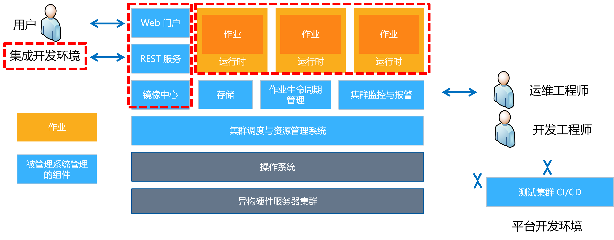</center>
<center>图 7.2.1 平台作业与开发体验</center>

集群管理系统由于面对多个用户作业运行在共享的服务器上，对环境依赖和资源隔离问题，需要通过镜像和运行期资源隔离等机制解决。如图 7.2.1 所示，本章将围绕集群管理系统上运行作业的依赖与运行期资源隔离，以及人工智能作业开发体验进行介绍。

- [7.2训练作业，镜像与容器](#72训练作业镜像与容器)
  - [7.2.1 深度学习作业](#721-深度学习作业)
  - [7.2.2 环境依赖：镜像（Image）](#722-环境依赖镜像image)
  - [7.2.3 运行时资源隔离：容器](#723-运行时资源隔离容器)
    - [实例：从头构建容器理解"进程级虚拟化"](#实例从头构建容器理解进程级虚拟化)
  - [7.2.4 从操作系统视角看 GPU 技术栈](#724-从操作系统视角看-gpu-技术栈)
    - [**GPU技术栈的操作系统抽象**](#gpu技术栈的操作系统抽象)
    - [**观测深度学习作业系统调用（System Call）**](#观测深度学习作业系统调用system-call)
    - [**GPU虚拟化**](#gpu虚拟化)
  - [7.2.5 人工智能作业开发体验（Development Experience）](#725-人工智能作业开发体验development-experience)
  - [小结与讨论](#小结与讨论)
  - [参考文献](#参考文献)

 
## 7.2.1 深度学习作业

当深度学习开发者在本地机器或者独占服务器进行模型的开发与训练时，环境问题较少，还没有暴露更多问题和挑战。例如，下面罗列的条目是单机独占环境下的配置与情况：

- 独占环境，无需考虑软件依赖环境，资源隔离问题
- 环境依赖路径: 
  - 本地 /.../anaconda3
  - 用户通过 Python 层的包管理软件或环境变量配置路径，即可完成 Python 库这层的依赖软件的隔离
- GPU 环境依赖: 
  - 本地 /usr/local/cuda
  - 用户本地 NVIDIA CUDA 等底层库较为固定，也可以通过环境变量较为方便的进行切换
- 数据路径: 
  - 本地 /data
  - 用户数据直接上传到服务器本地磁盘，带宽较高。
- 直接执行启动脚本: 存储在服务器磁盘，修改，调试监控等较为方便

如果以上环境已经准备好，开发者通过以下脚本实例启动训练程序：

```
# 作业启动脚本
python train.py --batch_size=256  --model_name=resnet50
```

当深度学习作业准备提交到平台，用户需要提供什么信息呢？如图 7.2.1 和如下程序实例，我们可以参考以下实例提交作业样本模板（实例来源于 [OpenPAI](https://github.com/microsoft/pai)）[<sup>[1]</sup>](#pai)，了解相比单机提交有哪些变化，需要特殊处理哪些部分。

```json
{
    // 作业名
    "jobName": "restnet",
    // 镜像名
    "image": "example.tensorflow:stable",
    // 输入数据存储路径
    "dataDir": "/tmp/data",
    // 数据结果存储路径
    "outputDir": "/tmp/output",
    ...
    // 任务规格：资源需求，启动脚本等
    "taskRoles": [
        {
            ...
            "taskNumber": 1,
            "cpuNumber": 8,
            "memoryMB": 32768,
            "gpuNumber": 1,
            "command": "python train.py --batch_size=256 \ 
		--model_name=resnet50"
        }
    ]
}
```

<center>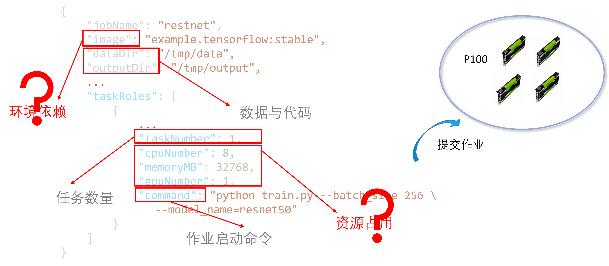</center>
<center>图 7.2.2 用户提交的作业规格（Specification）实例，将作业提交到拥有 4 块 GPU 的服务器</center>

从以上作业提交规格实例中，我们思考平台需要提供怎样的支持：

- 环境依赖：
  - 问题：平台集群中的机器都是相同的操作系统与环境，如何支持用户使用不同的深度学习框架（例如，TensorFlow 和 PyTorch），库和版本？
  - 解决方法：通过 "image" 填写的 Docker 镜像名，解决环境依赖问题。用户需要提前将打包好的依赖构建为 Docker 镜像，并提交到指定的镜像中心，供作业下载。 
- 数据与代码：
  - 问题：平台上一般运行的是深度学习训练作业，每个作业都需要一定的数据作为输入，同时执行相应的代码，如果将数据和代码直接上传会造成接受用户请求的服务器负载过大，同时不能复用已经上传的数据和代码。
  - 解决方法：通过 "dataDir" 和 "outputDir" 填写作业依赖的数据和输出路径。用户上传数据和代码到平台指定的文件系统中的相应路径下，未来平台将网络文件系统中的数据和代码挂载到相应的作业进程所在机器。
- 资源申请量：
  - 问题：用户可能会提交运行使用单 GPU 的作业，多块 GPU 的作业和分布式的作业，面对多样的用户需求，因为平台无法静态分析用户作业的资源需求，平台需要用户明确告知和配置其资源需求，否则容易提供过多资源浪费，或过少资源造成作业无法启动。
  - 解决方法：用户明确声明需要使用的计算资源（例如，GPU 和 CPU）和内存，这样让平台根据指定调度策略将匹配的空闲资源进行分配。
- 资源隔离：
  - 问题：用户作业被分配指定资源后，可能多个作业在一台服务器执行，如何保证作业之间尽量不互相干扰？
  - 解决方法：平台可以通过[容器](https://www.docker.com/resources/what-container)/控制组（[cgroup](https://en.wikipedia.org/wiki/Cgroups)）[<sup>[2]</sup>](#cgroups)等技术，将进程进行轻量的资源限定和隔离。
- 任务部署模式：
  - 问题：对于分布式的作业，如果用户不说明，平台无法知道并行化的策略，进而无法确认需要启动的任务数量。需要用户显式的声明。
  - 解决方法：对于分布式的作业，用户要明确告知需要启动的任务数量，进而平台能够启动多个任务副本进行训练。
- 作业启动命令：
  - 问题：当平台给作业分配资源，需要用户告知作业的启动命令，进而平台启动作业，执行相应的代码。
  - 解决方法：用户需要明确在作业中描述相应的代码启动入口命令，进而让作业主程序能够启动并执行。

通过以上问题和解决方法，相信读者已经了解在平台中执行的作业和本地执行的作业差异和需要考虑的新问题，我们将在后面章节的内容中，逐步展开其中的重要技术点和介绍相应原理。

## 7.2.2 环境依赖：镜像（Image）

当用户在平台上执行作业，第一个棘手的问题就是本地开发环境和平台集群环境差异：
- 服务器上没有预装好所需要的个性化环境
- 不同作业需要的框架，依赖和版本不同，安装繁琐且重复
- 部署服务器上可能会有大量重复安装的库，占用空间
- 深度学习特有问题：深度学习作业需要安装 CUDA 依赖和深度学习框架等
  
平台针对以上问题一般选用以下的技术方案解决问题：

首先，针对环境问题，复用整体安装环境并创建新环境，层级构建依赖，复用每一层级的依赖。这样既保证能有个性化环境的同时，也能保证性能和，资源消耗更小。目前在主流的平台系统中，通过 [Docker 镜像](https://docs.docker.com/get-started/overview/#docker-objects)来解决这个问题。而 Docker 镜像的本质是底层通过[ Union 文件系统（Unionfs）](https://en.wikipedia.org/wiki/UnionFS)[<sup>[3]</sup>](#unionfs)等机制而实现，它使得 Docker 能够高效地存储镜像各层。

***经典回顾***
Unionfs 是 Linux、FreeBSD 和 NetBSD 的文件系统服务，其实现了[联合挂载（Union Mount）](https://en.wikipedia.org/wiki/Union_mount)。在计算机操作系统中，联合挂载（Union Mount）是一种将多个目录组合成一个似乎包含其组合内容的方法。它允许独立文件系统的文件和目录透明覆盖，形成一个单一的文件系统。具有相同路径的目录的内容将在新的虚拟文件系统内的单个合并目录中一起看到。利用这个机制使得Docker 能够更加高效的存储文件和包。Docker 支持多种 Unionfs，例如，AUFS，OverlayFS 等。

接下来我们看一个实例去理解镜像的构建与使用。

首先，用户需要书写 Dockerfile，然后通过 Dockerfile 中的依赖安装命令，构建和打包镜像文件。构建成功后，用户可以将镜像文件上传到指定的镜像中心（Docker Hub）。未来平台启动用户提交的作业后，会下载相应镜像到指定服务器，为作业配置好相应的环境依赖。

下面就是一个构建 PyTorch 环境的 Dockfile 实例，我们可以通过其中的注释看到，其每一步就是在执行在服务器中的安装命令的 shell 脚本，完成相关库和依赖的安装。

```dockerfile
# 配置镜像使用的基础镜像
FROM nvidia/cuda:10.0-cudnn7-devel-ubuntu16.04
# 配置构建镜像时使用的环境变量
ARG PYTHON_VERSION=3.6
…
# 执行的脚本命令
RUN apt-get update && apt-get install -y --no-install-recommends \
…
RUN curl -o ~/miniconda.sh 
…
 /opt/conda/bin/conda install -y -c pytorch magma-cuda100 && \
…
# 设置指令的工作目录
WORKDIR /opt/pytorch
# 复制文件到镜像中
COPY . .
…
WORKDIR /workspace
RUN chmod -R a+w .
```

通过 docker build 命令，按照上面的 Dockfile 中的命令进行镜像构建后，如图 7.2.3，会打包如下的镜像。我们从镜像文件中可以看到，其中的文件就是 Dockerfile 中所下载和安装的文件。

<center>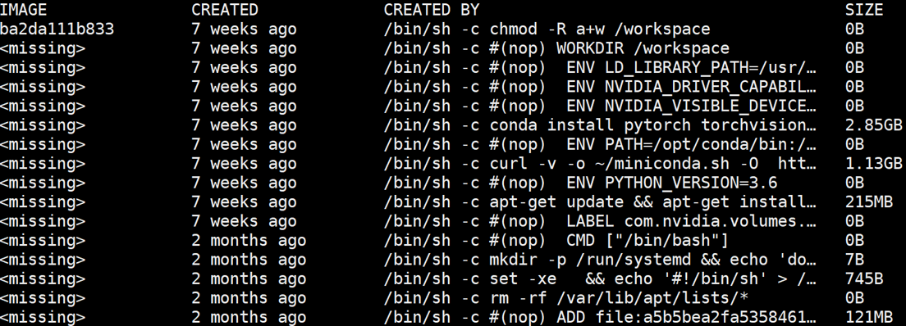</center>
<center>图 7.2.3 PyTorch 镜像文件中包含的依赖</center>

## 7.2.3 运行时资源隔离：容器

当用户在平台上执行作业，第二个比较大的问题就是用户想独占资源，在执行过程中不受其他作业对资源争用产生的干扰：
- 集群资源被共享，如何保证作业进程互相之间不干扰和多占用资源？
- 如何能够让不同作业进程在同一台机器可以运行在不同的命名空间防止冲突？
- 如何保证隔离的同时，作业启动的越快越好？
- 深度学习特有问题：GPU 的核和内存如何隔离？

为解决以上的问题和需求，平台一般朝着以下目标去选用相应的技术方案解决问题：
能够尽可能细粒度的进行资源隔离，同时减少由于资源隔离（虚拟化）技术造成的性能开销。

对运行时的资源隔离问题，目前平台一般通过容器解决，而容器解决资源隔离问题时主要通过控制组（Cgroups）机制解决资源隔离，通过命名空间（Namespace）解决命名空间隔离。首先我们先介绍一下容器的定义: Linux 容器（LXC）是一组 1 个或多个与系统其余部分隔离的进程。Linux Containers 是一种操作系统级别的虚拟化方法，用于使用单个 Linux 内核在控制主机上运行多个隔离的 Linux 系统（容器）。 
支撑容器隔离技术：	
- 控制组 [Cgroups](https://man7.org/linux/man-pages/man7/cgroups.7.html)(缩写自Control Groups)：是一种 Linux 内核特性，它能够控制（Control），计数（Accounting）和隔离（Isolation）一组进程的资源（例如，CPU，内存，磁盘 I/O，网络等）及使用。
- 命名空间 [Namespaces](https://man7.org/linux/man-pages/man7/namespaces.7.html)[<sup>[4]</sup>](#namespaces): 命名空间将全局系统资源包装在一个抽象中，使命名空间内的进程看起来他们拥有自己独立的全局资源实例。命名空间可以实现如，pid，net，mnt，ipc，user 等的包装和隔离。

如图 7.2.4 所示，用户可以通过创建控制组（Cgroups）进行资源的限制，之后启动进程时，通过控制组（Cgroups）约束资源使用量，并在运行时进行隔离。

<center>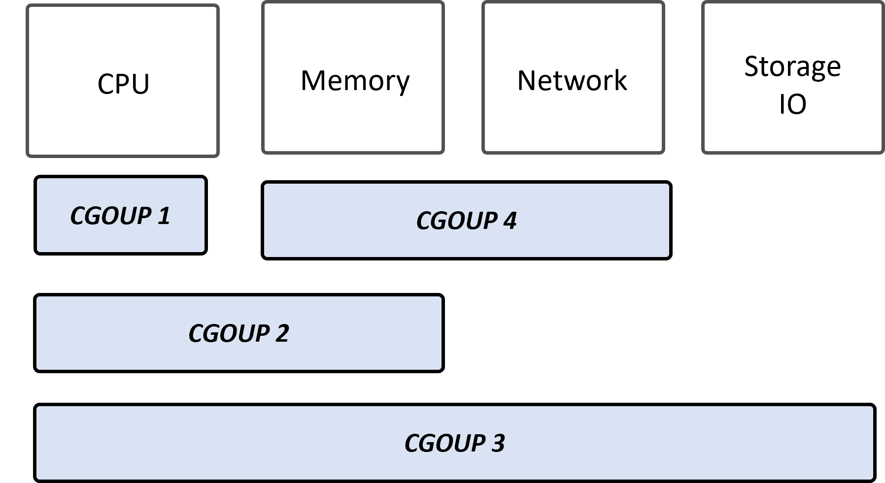</center>
<center>图 7.2.4 控制组实例</center>

如图 7.2.5 所示，用户可以通过创建命名空间（Namespaces）进行资源的包装，之后启动进程时，进程内只能看到命名空间内的资源，无法感知其进程外主机其他的资源。

<center>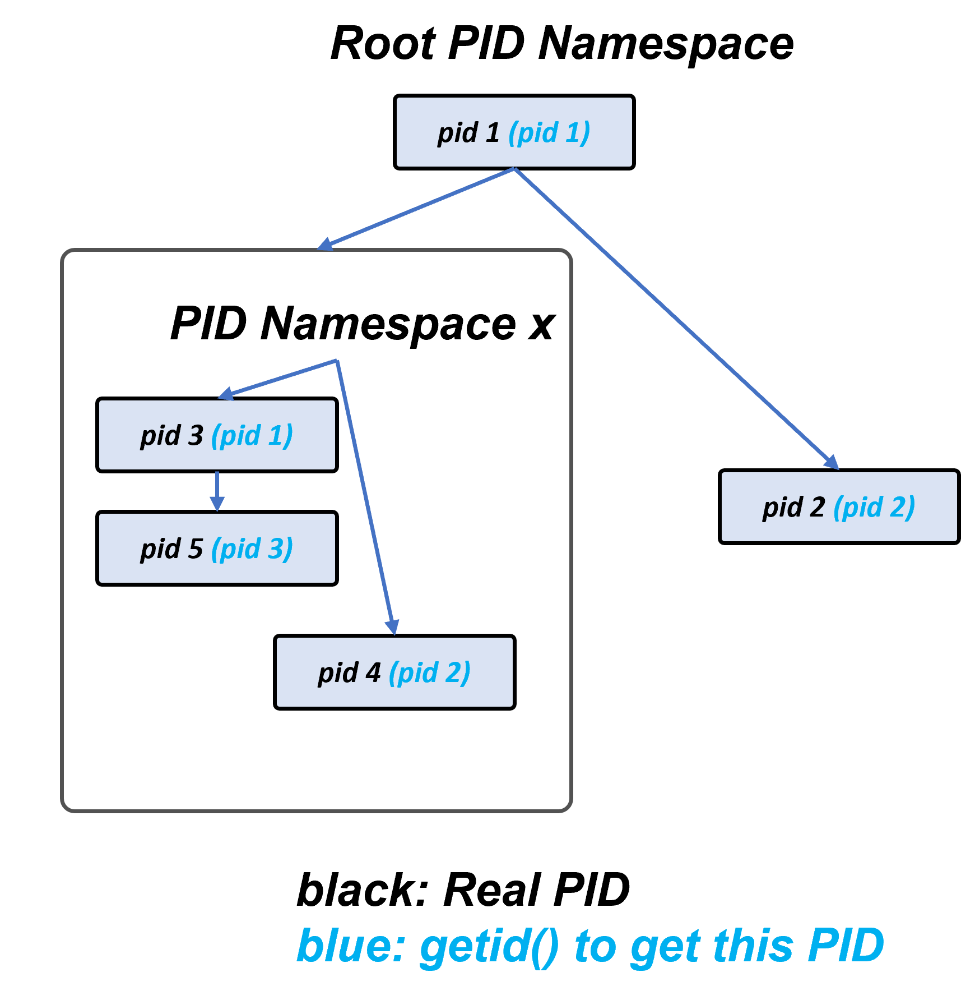</center>
<center>图 7.2.5 命名空间实例</center>

由于深度学习目前依赖 GPU 进行训练，为了让容器能支持挂载 GPU，一般 GPU 的厂商都会提供对 Docker 的特定支持来提供相应的功能。例如，NVIDIA 提供了针对 NVDIA GPU 的支持，用户可以参考官方 [nvidia-docker 文档](https://github.com/NVIDIA/nvidia-docker)[<sup>[5]</sup>](#nvdocker)进行环境配置。但是由于加速器（例如，GPU，TPU 等）的软硬件的虚拟化支持不像传统 CPU 充分，所以目前主流方式还是加速器粒度的挂载和隔离，无法原生像传统操作系统对 CPU 进行细粒度的时分复用、内存隔离和动态迁移。
当完成环境配置之后，用户可以使用挂载 NVIDIA GPU 的 Docker 容器实例。读者可以通过以下命令（引用自 NVIDIA Docker 官方实例）理解平台是如何运行时启动挂载特定 GPU 数量的容器。

```
# 通过官方 CUDA 镜像测试 nvidia-smi 命令，并挂载所有 GPU
$ docker run --gpus all nvidia/cuda:9.0-base nvidia-smi

# 启动一个可以访问 GPU 的容器，并挂载 2 块 GPU
$ docker run --gpus 2 nvidia/cuda:9.0-base nvidia-smi

# 启动一个可以访问 GPU 的容器，并挂载 1 号和 2 号 GPU
$ docker run --gpus '"device=1,2"' nvidia/cuda:9.0-base nvidia-smi
```

### 实例：从头构建容器理解"进程级虚拟化"

Docker 本身是一个技术泛称，同时是一家公司，其本身更多是提供工具链，镜像中心，标准。容器和镜像我们可以通过 Linux 系统调用（System Call）和命令从头构建。
接下来，我们通过实例，构建一个容器，这样让读者从抽象的概念中跳出，由具体的实例感知，为何容器被称作“进程级虚拟化”，同时读者就可以思考相比于基于 Hypervisor 的虚拟机其优劣势。通过实例，读者可以了解容器的底层是通过哪些系统调用所构建出来，同时用户可以构建自己的个性化容器。

这个实例对理解 Docker 镜像和容器的底层机制有较好的帮助。读者可以参考（以下步骤根据 [Containers from Scratch](https://ericchiang.github.io/post/containers-from-scratch/)[<sup>[6]</sup>](#containerexample) 翻译）以下步骤进行构建练习：

1. 设置容器文件系统
   
    容器镜像，本实例中被打包为 tar 文件。我们可以从网上下载一个简单的 tar 文件，文件中使用 Debian 文件系统。
    ```shell
    $ wget https://github.com/ericchiang/containers-from-scratch/releases/download/v0.1.0/rootfs.tar.gz
    2022-06-07 04:57:28 (5.65 MB/s) - ‘rootfs.tar.gz’ saved [265734209/265734209]
    $ sha256sum rootfs.tar.gz 
    c79bfb46b9cf842055761a49161831aee8f4e667ad9e84ab57ab324a49bc828c  rootfs.tar.gz
    ```
    解压并观察压缩文件内容，解压后的文件夹是一个 Linux 操作系统结构。对如何构建这个 tar 文件，读者可以参考其他实例和资料，当前暂不在此实例介绍。
    ```shell
    $ sudo tar -zxf rootfs.tar.gz
    $ ls rootfs
    bin  boot  dev  etc  home  lib  lib64  media  mnt  opt  proc  root  run  sbin  srv  sys  tmp  usr  var
    ```
2. [chroot](https://man7.org/linux/man-pages/man2/chroot.2.html) 构建进程文件夹系统视图
   
    我们将使用的第一个工具是 chroot。其底层调用 chroot系统调用，它允许我们限制文件系统的进程视图。下面命令将进程限制在“rootfs”目录，然后执行一个 shell（/bin/bash）。
    ```shell
    $ sudo chroot rootfs /bin/bash
    root@localhost:/# ls /
    bin  boot  dev  etc  home  lib  lib64  media  mnt  opt  proc  root  run  sbin  srv  sys  tmp  usr  var
    ```
    1，2步骤等价于平台执行拉取和挂载 Docker 镜像命令。
3. [unshare](https://man7.org/linux/man-pages/man1/unshare.1.html) 创建命名空间
    
    [挂载proc文件系统在/proc路径](http://www.iitk.ac.in/LDP/LDP/lfs/5.0/html/chapter06/proc.html)。proc文件系统是内核用来提供有关系统状态信息的进程信息伪文件系统。
    ```shell
    root@localhost:/# mount proc /proc -t proc
    ```
    通过 unshare 让这个 chroot 进程命名空间隔离，让我们在 ***另一个终端的主机*** 上运行命令。命名空间允许我们创建系统的受限视图（例如进程树、网络接口和挂载）。unshare 命令行工具为我们提供了 unshare 系统调用包装器，让我们手动设置命名空间。如下脚本所示，我们将为 shell 创建一个 PID 命名空间，然后像上一个示例一样执行 chroot。
    ```
    # 切换到另一个shell
    $ sudo unshare -p -f --mount-proc=$PWD/rootfs/proc \
    chroot rootfs /bin/bash
    root@localhost:/# ps aux
    USER       PID %CPU %MEM    VSZ   RSS TTY      STAT START   TIME COMMAND
    root         1  0.0  0.0  21956  3688 ?        S    06:22   0:00 /bin/bash
    root         2  0.0  0.0  19184  2348 ?        R+   06:25   0:00 ps -aux
   ```
   在创建了一个新的进程命名空间之后，shell 认为它的 PID 是 1，更重要的是，通过以上操作，容器内看不到主机的进程树了。
4. [nsenter](https://man7.org/linux/man-pages/man1/nsenter.1.html) 进入命名空间
   
   此步骤等价于我们查询 Docker 容器 ID 后，通过 Docker exec 进入容器。类似的我们需要先找到进程 ID 和命名空间，之后再进入这个命名空间。通过下面命令找到刚才我们通过 chroot 运行的 shell 进程。
   ```shell
    $ # 从主机的 Shell, 并不是 chroot 后的 Shell
    $ ps aux | grep /bin/bash | grep root
    ...
    root     29840  0.0  0.0  20272  3064 pts/5    S+   17:25   0:00 /bin/bash
   ```
   内核将 /proc/(PID)/ns 下的命名空间公开为文件。 在这种情况下 /proc/29840/ns/pid 是我们希望加入的进程命名空间。
   ```shell
    $ sudo ls -l /proc/29840/ns
    total 0
    lrwxrwxrwx. 1 root root 0 Oct 15 17:31 ipc -> 'ipc:[4026531839]'
    lrwxrwxrwx. 1 root root 0 Oct 15 17:31 mnt -> 'mnt:[4026532434]'
    lrwxrwxrwx. 1 root root 0 Oct 15 17:31 net -> 'net:[4026531969]'
    ...
   ```
   nsenter 命令提供了一个围绕 setns 的包装器以进入命名空间。 我们将提供命名空间文件，然后运行 unshare 以重新挂载 /proc 和 chroot 以设置 chroot。 这一次，我们的 shell 将加入现有的命名空间，而不是创建一个新的命名空间。
   ```shell
    $ sudo nsenter --pid=/proc/29840/ns/pid \
    unshare -f --mount-proc=$PWD/rootfs/proc \
    chroot rootfs /bin/bash
    root@localhost:/# ps aux
    USER       PID %CPU %MEM    VSZ   RSS TTY      STAT START   TIME COMMAND
    root         1  0.0  0.0  20272  3064 ?        S+   00:25   0:00 /bin/bash
    root         5  0.0  0.0  20276  3248 ?        S    00:29   0:00 /bin/bash
    root         6  0.0  0.0  17504  1984 ?        R+   00:30   0:00 ps aux
   ```
5. [cgroups](https://man7.org/linux/man-pages/man7/cgroups.7.html) 进行资源约束
   
    对于这个例子，我们将创建一个 cgroup 来限制进程的内存。 创建 cgroup 很简单，只需创建一个目录即可。 在这种情况下，我们将创建一个名为“demo”的内存组。 创建后，内核将使用可用于配置 cgroup 的文件填充目录。
    ```shell
    $ sudo su
    $ mkdir /sys/fs/cgroup/memory/demo
    $ ls /sys/fs/cgroup/memory/demo/
    cgroup.clone_children               memory.memsw.failcnt
    ...
    memory.limit_in_bytes               tasks
    memory.max_usage_in_bytes
    ```
    要调整一个值，我们只需写入相应的文件。 让我们将 cgroup 限制为 200MB 内存并关闭交换。
    ```shell
    $ echo "200000000" > /sys/fs/cgroup/memory/demo/memory.imit_in_bytes
    $ echo "0" > /sys/fs/cgroup/memory/demo/memory.swappiness
    ```
    任务文件很特殊，它包含分配给 cgroup 的进程列表。 要加入 cgroup，我们可以编写自己的 PID。读者可以替换为上面程序的 PID 29840即可。
    ```shell
    $ echo 29840 > /sys/fs/cgroup/memory/demo/tasks
    ```
    此步骤相当于平台中容器对进程资源进行约束。

通过以上实例，相信读者已经理解容器和镜像的工作原理，我们忽略很多其他安全，优化和功能，以期读者了解核心问题。

如果大家对容器底层是如何构建的有更深入的了解感兴趣，可以参考实例[通过 Go 语言从头构建容器](https://medium.com/swlh/build-containers-from-scratch-in-go-part-1-namespaces-c07d2291038b)，[Containers from Scratch](https://ericchiang.github.io/post/containers-from-scratch/)[<sup>[6]</sup>](#containerexample)。

## 7.2.4 从操作系统视角看 GPU 技术栈

操作系统一般为进程提供资源管理，多租任务调度的功能支持。GPU 在当前计算机中被抽象为设备，操作系统通过 ioctl 系统调用进行设备控制，如图 7.2.6 所示。在以往的工作中，有两个方向的思路尝试去将 GPU 技术栈纳入到操作系统的管理中并提供多租，虚拟化等的支持。

<center> 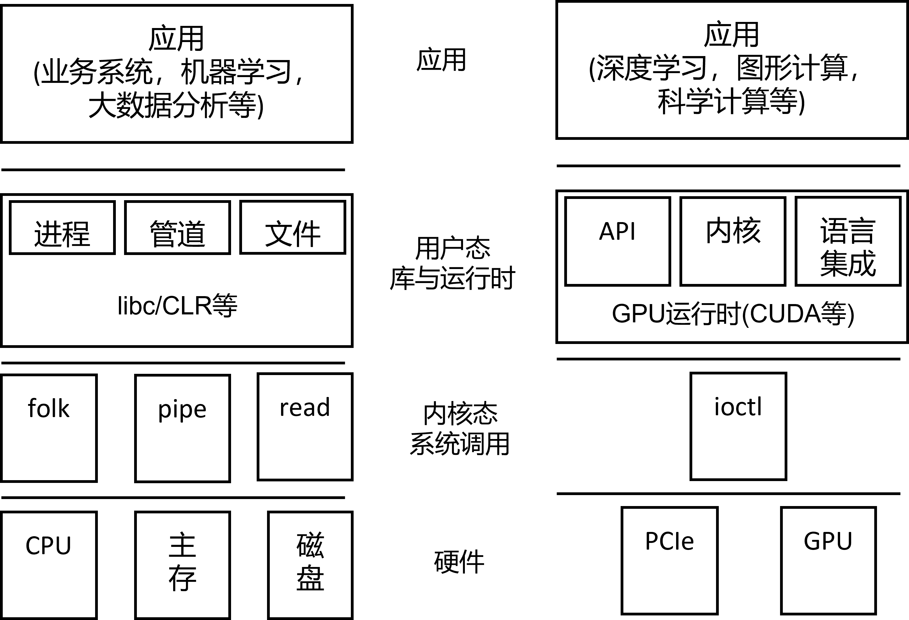</center>

图 7.2.6 CPU 和 GPU 技术栈与操作系统抽象(<a href="https://www.microsoft.com/en-us/research/wp-content/uploads/2011/05/hotos11-final.pdf">图片来源[<sup>[7]</sup>](#gpuos)</a>)

从图 7.2.6 中可以看到，CPU 程序中有大量的系统调用支持，操作系统提供对各种硬件抽象管理与用户多进程多租的支持。但是对 GPU 程序，当前模式更像是 Client/Server 抽象，GPU 是设备，CPU 程序提交作业到 GPU 并获取响应结果，但是对操作系统 GPU 本身是一个黑盒，一般通过 [ioctl](https://man7.org/linux/man-pages/man2/ioctl.2.html) 进行有限的交互与控制。

### **GPU技术栈的操作系统抽象**

1. 思路1：已有操作系统中纳入 GPU 管理原语。让 GPU 能被 ioctl 以外的系统调用所管理，或者操作系统理解 ioctl 语义对其能做细粒度资源管理。

- 当前思路依赖设备供应商在驱动层暴露更多信息被操作系统管理，但是之前一些厂商（例如，英伟达）提供的驱动常常为闭源，且只能通过 ioctl 控制设备，很难分析语义。2011 年 HotOS 上，Christopher J. Rossbach 等人在 [Operating Systems must support GPU abstractions](https://www.microsoft.com/en-us/research/wp-content/uploads/2011/05/hotos11-final.pdf)[<sup>[7]</sup>](#gpuos) 曾有相关工作提出在操作系统层面抽象 GPU 管理，但是这篇工作只提出构想，并受限于设备供应商的设备驱动的支持，从之后的发展状况来看，受限于设备供应商的配合和支持，当前道路并不没有走通。在 ATC '13，Konstantinos Menychtas 等人提出 [Enabling OS Research by Inferring Interactions in the Black-Box GPU Stack](https://www.usenix.org/system/files/conference/atc13/atc13-menychtas.pdf)[<sup>[8]</sup>](#enableos) 当前 GPU 资源是黑盒，不能被操作系统所管理，所以对系统调用进行拦截和刻画抽象出程序状态机，启发后续操作系统对 GPU 设备的研究。之后的工作也层尝试设计从 GPU 调用操作系统系统调用（[ISCA '18 Generic System Calls for GPUs](http://www.cs.yale.edu/homes/abhishek/jvesely-isca18.pdf)）[<sup>[9]</sup>](#syscallgpu)。但是以上的工作由于实用性，部署难度和受限于厂商支持，在后续的业界平台或研究工作中没有过多的跟随工作。2022年5月，[NVIDIA 开源了其 GPU 内核模块（GPU Kernel Modules）](https://developer.nvidia.com/blog/nvidia-releases-open-source-gpu-kernel-modules/)，一定程度上会让当前此方向研究有新的进展。
  
2. 思路2：GPU 已有编程接口上抽象操作系统管理功能。此类工作以设备 API 作为系统调用的视角抽象设备管理，在设备 API 层以下进行拦截和管理达到多租或虚拟化的效果。

- 厂商官方工作：[MPS](https://docs.nvidia.com/deploy/mps/index.html)，[Unified Memory](https://developer.nvidia.com/blog/unified-memory-cuda-beginners/) 等工作是 NVIDIA 将传统操作系统的多进程调度、虚拟内存等经典设计思路在CUDA上进行的实现，进而能够实现复用 GPU，打破 GPU 显存瓶颈的效果。Unified Memory （UVM）类似 [mmap](https://man7.org/linux/man-pages/man2/mmap.2.html) 的设计思想，提供主存和 GPU 显存的统一地址抽象，精简用户主动维护内存数据拷贝（替代，malloc，cudaMalloc，cudaMemcpy 接口的一组调用），当 GPU 访问 GPU 显存的 UVM 数据，如果不在 GPU 显存，将触发缺页异常（Page Fault），系统透明的将数据由主存拷贝到 GPU 显存。   
- 研究工作：以 [rCUDA](http://www.rcuda.net/)，[Singularity](https://arxiv.org/abs/2202.07848)为代表的工作在 [NVIDIA Runtime API](https://docs.nvidia.com/cuda/cuda-runtime-api/index.html)，[Driver API](https://docs.nvidia.com/cuda/cuda-driver-api/index.html) 上进行拦截，提供时分复用，内存隔离，和动态迁移的功能。其中，rCUDA 通过类似[远程过程调用（Remote Procedure Call）](https://en.wikipedia.org/wiki/Remote_procedure_call)的方式，通过将函数输入参数传递给远端 GPU，并在远端 GPU 加载二进制库进行函数调用，给用户以本地挂载 GPU 体验的同时，多路复用远端 GPU，但是实现其受限于只支持原生 CUDA 内核函数。
- 第三方公司的工作：以 [OrionX 猎户座](https://blog.csdn.net/m0_49711991/article/details/107979798) 为代表的产品，设计类似传统操作系统的内核态抽象，在大规模集群上提供资源池化，并通过内核态抽象让系统更安全和稳定。

如果我们将 CUDA 等接口抽象为 “GPU 为中心的系统调用，其内部逻辑为 GPU 的操作系统资源管理”，其本质是通过[微内核（Microkernel）](https://en.wikipedia.org/wiki/Microkernel)的思想，将原生的不同的资源管理组件抽象与替代（例如，内核调度，内存管理等），让资源管理不受限于已有的设备提供商提供的管理逻辑。

### **观测深度学习作业系统调用（System Call）**

[strace](https://strace.io/) 是用于 Linux 的诊断、调试和指导性用户空间实用程序。它用于监视进程与 Linux 内核之间的交互，包括系统调用、信号传递和进程状态的变化。本小节我们可以通过 strace 观测深度学习程序如何在操作系统的系统调用层和GPU打交道，以另一个抽象层次和视角深入理解深度学习程序的底层原理。

1. 例如在Ubuntu操作系统中，执行一下安装命令：
```
apt-get install strace
```
2. 假设用户有一个训练程序（train.py），里面是 PyTorch 训练卷积神经网络。

```
strace python train.py
```
3. 观测系统调用日志。

我们可以观察主要调用的是 ioctl 和 mmap 等系统调用，但是从 ioctl 很难获取到可读和可解释信息。在之前 ATC '13 研究工作 [Enabling OS Research by Inferring Interactions
in the Black-Box GPU Stack](https://www.usenix.org/system/files/conference/atc13/atc13-menychtas.pdf)[<sup>[8]</sup>](#enableos) 中也有对 ioctl 进行收集分析并抽象出状态机的研究。

### **GPU虚拟化**

目前与深度学习相关的代表性的 GPU 虚拟化资源隔离技术有以下几种：

- 应用程序编程接口远程处理（API Remoting）技术：
  - 包装 GPU APIs 作为客户前端，通过一个转发层作为后端，协调所有对 GPU 的访问。挑战之一在于要最小化前端和后端的通信代价，同时 API 转发面临着充分支持的挑战功能，由于侵入的复杂性修改客户软件栈。
  - 代表性工作：[GVirtuS](https://github.com/cjg/GVirtuS)，[vCUDA](https://github.com/tkestack/vcuda-controller)，[rCUDA](http://www.rcuda.net/)，[qCUDA](https://github.com/coldfunction/qCUDA)。
- 直接 GPU 直通（Direct GPU Pass-Through）技术：
  - 在 Direct GPU pass-through 技术中，GPU 被单个虚拟机独占且永久地直接访问，其实现的GPU资源隔离粒度为单块GPU，不支持热迁移。GPU 直通是一种允许 Linux 内核直接将内部 GPU 呈现给虚拟机的技术，该技术实现了 96-100% 的本地性能，但 GPU 提供的加速不能在多个虚拟机之间共享。
  - 代表性工作：例如，NIVIDIA 对公有云厂商 [Amazon AWS, Microsoft Azure, Google Cloud Platform, Alibaba Cloud](https://docs.nvidia.com/grid/cloud-service-support.html) 提供 GPU pass-through 技术等。
- [中介直通（Mediated Pass-Through）](https://www.usenix.org/system/files/conference/atc14/atc14-paper-tian.pdf)技术：
  - 直通传递性能关键型资源和访问，而在设备上中介代理（Mediating）特权操作，使用性能好，功能齐全，共享能力强。
  - 代表性工作：NIVIDIA 对公有云厂商 [Amazon AWS, Microsoft Azure, Google Cloud Platform, Alibaba Cloud](https://docs.nvidia.com/grid/cloud-service-support.html) 提供的 vGPU 技术. 
- 深度学习框架层控制的粗粒度时分复用与上下文切换：[Gandiva '18](https://dl.acm.org/doi/10.5555/3291168.3291212)[<sup>[10]</sup>](#gandiva) 观测 GPU 显存利用率，以迭代为粒度进行任务切换与调度，其上下文切换需要备份模型和内存数据，开销较大，适合粗粒度动态迁移与弹性调度场景提升利用率，其检查点的控制也需要修改 PyTorch 和 TensorFlow 以支持。[AntMan OSDI '20](https://dl.acm.org/doi/abs/10.5555/3488766.3488796) [<sup>[11]</sup>](#antman)持续分析算子（图中所示为 GPU Kernel）运行时间，显存隔离没有限制，会做一定换入换出 [Swap](https://www.linux.com/news/all-about-linux-swap-space/) ，调度的最小单元是一个迭代，但是对一个作业空闲时段放置的另一个作业的任务粒度是框架层算子，例如其修改 TensorFlow 的 GPU 操作符执行器进行控制，基于计算能力延迟其执行。[Salus MLSys '20](https://www.mosharaf.com/wp-content/uploads/salus-mlsys20.pdf)[<sup>[12]</sup>](#salus) 这篇研究工作考虑了计算和显存隔离，其以一个迭代为调度粒度，陈述因为使用 内核（Kernel）虽然可以提升利用率，但是会增加调度开销（Kernel 需要通过中心调度器控制，增加了框架层做的内核批量执行和流水线执行优化），此工作修改了框架 TensorFlow 代码来进行支持。

由于目前一般训练平台中部署的大多数 GPU 为 NVIDIA GPU，NVIDIA 原生提供的代表性 GPU 资源隔离技术有以下几种：
- [NVIDIA 多实例 GPU（Multi-Instance GPU）简称 (MIG)](https://www.nvidia.com/en-us/technologies/multi-instance-gpu/)：多实例 GPU 是 NVIDIA 在 Ampere 系列 GPU 中开始支持的，在硬件层面将 GPU 实例进行隔离与虚拟化的技术，支持缓存，内存，物理计算核的隔离，但是有隔离粒度的限制。多实例 GPU (MIG) 可扩展每个 NVIDIA A100 GPU 的共享能力和利用率。MIG 可将 A100 和 H100 GPU 划分为最多达七个实例，每个实例均与各自的高带宽显存、缓存和计算核心完全隔离。
- [NVIDIA 多进程服务（Multi-Process Service）简称（MPS）](https://docs.nvidia.com/deploy/pdf/CUDA_Multi_Process_Service_Overview.pdf)：多进程服务 (MPS) 是 NVIDIA 提供的软件层共享物理 GPU 资源并提供一定程度进程级虚拟化的技术。MPS 运行时架构旨在透明地支持多进程 CUDA 应用程序，通常是 MPI 作业。其利用 [Hyper-Q](https://developer.download.nvidia.com/compute/DevZone/C/html_x64/6_Advanced/simpleHyperQ/doc/HyperQ.pdf) 功能实现，Hyper-Q 允许 CUDA 内核在同一 GPU 上并发处理，当 GPU 计算能力未被单个应用进程充分利用时，这可以提高性能。MPS一般在一些 GPU 型号中如果使用的是软件层的实现有一定开销，如果是硬件层的实现能够减少开销。（1）计算隔离：GPU 还具有一个时间切片调度程序，用于从属于不同 CUDA 上下文的工作队列中调度工作。 从属于不同 CUDA 上下文（Context）的工作队列启动到计算引擎的工作不能同时执行。如果从单个 CUDA 上下文启动的工作不足以用完所有可用资源，这可能会导致 GPU 计算资源的利用率不足。（2）内存隔离：其内存隔离通过 CUDA API 进行限制，这种 pre-Volta MPS 行为受限于来自 CUDA 内核中的指针的内存访问。任何 CUDA API 都会限制 MPS 客户端访问该 MPS 客户端内存分区之外的任何资源。例如，无法使用 cudaMemcpy() API 覆盖另一个 MPS 客户端的内存。在 V 系列之后才提供硬件支持保证客户端有独立地址空间。研究工作 [Gandiva](https://www.usenix.org/system/files/osdi18-xiao.pdf)发现，MPS 会导致 P40/P100 的较大开销和性能损失。[由于 P 系列只提供有限隔离，且每个 GPU 只能支持 16 个客户端](https://www.olcf.ornl.gov/wp-content/uploads/2021/06/MPS_ORNL_20210817.pdf)。然而，[V100](https://docs.nvidia.com/deploy/pdf/CUDA_Multi_Process_Service_Overview.pdf) 中提供对 MPS 的硬件支持，使用MPS可能能够在 V100 减少软件层支持方式产生开销并提升利用率，在 V100 上通过硬件加速的工作提交不需要经过软件层 MPS 服务器，每个进程有私有工作队列支持并行提交且没有锁冲突，硬件的内存隔离每个客户端有自己的内存地址空间且更加安全，最多每个 GPU 可以支持 48 个客户端使用，对保证服务质量方面提供可配置的有限的执行资源供给（通过 CUDA_MPS_ACTIVE_THREAD_PERCENTAGE 配置）。


## 7.2.5 人工智能作业开发体验（Development Experience）

在使用集群管理系统时，通常人工智能算法工程师可以使用如下类似的开发环境进行人工智能作业与 Python 脚本的开发。
- 作业在提交前，可以选用之后介绍的工具进行 Python 作业的开发。
- 一般作业提交到平台前用户需要填写作业的规格（Specification），进而通过相应的作业提交工具进行提交，监控与管理。

以下工具有些只能进行作业提交，有些能进行 Python 开发，有些则两个功能都兼顾：
- 客户端集成开发环境（Integrated Development Environment）
  - [Visual Studio Code](https://code.visualstudio.com/)：Visual Studio Code，通常也称为 VS Code，是 Microsoft 为 Windows、Linux 和 macOS 开发的跨平台源代码编辑器。在人工智能场景下，算法工程师主要使用 VS Code 进行 Python 程序开发，调试（Debugging）、语法高亮（Syntax Highlighting）、智能代码完成 （Intelligent Code Completion）、预装代码片段（Code Snippet）、代码重构（Code Refactoring）和版本管理 Git 的支持。用户可以更改主题、键盘快捷键、首选项，并安装添加额外功能的扩展。使用 VS Code 等类似的客户端 IDE 进行开发的特点是，功能强大，调试，补全等功能完善。接下来介绍几个常用的针对人工智能开发的插件：
  - VS Code实用人工智能插件简介：
    - 一站式人工智能开发插件：[Tools for AI](https://github.com/microsoft/vscode-tools-for-ai) 当前已改名 Visual Studio Code Azure 机器学习扩展。可以使用 Visual Studio Code 界面中的 Azure 机器学习服务轻松构建、训练和部署机器学习模型到云或边缘。此扩展的早期版本以 Visual Studio Code Tools for AI 的名称发布。此工具提供，部署到云端或边缘的支持，常用深度学习库的支持，本地实验再部署到大规模集群，集成自动化机器学习，通过 CI/CD 工具跟踪实验，管理模型。
    - 代码完成（Code Completion）：[Kite for VS Code](https://www.kite.com/integrations/vs-code/) 适用于 VS Code 的各种语言，通过海量代码库，训练人工智能模型，提供智能代码完成服务。智能感知（Intellisense）、代码片段（Code Snippets）、光标跟随（Cursor-Following）文档的 AI 代码完成。 Kite 支持 Python 等文件类型，如图 7.2.7 对比有代码补全将大幅提升开发生产力，这也是集成开发环境的优势。同时我们也看到这类工作属于 AI for System 的一种，OpenAI 也开源 [Copilot](https://copilot.github.com/) 进行常见语言，通用程序的智能化的代码提示和程序合成（Program Synthesis）。
    <center> 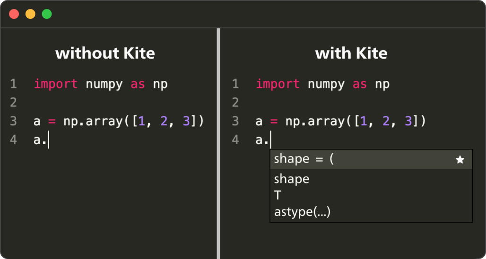</center>
    <center>图 7.2.7 Python 代码补全实例 (<a href="https://www.kite.com/">图片来源</a>)</center>

- 在线网页（Web）服务开发环境
  - 集群提供的 Web 管理界面：一般平台会提供一个 Web 页面方便用户提交作业的规格（Specification），填写好作业镜像，启动命令，资源等，如前面小节所示。网页服务开发环境适合提交与管理，监控作业。图 7.2.8 所示，用户可以通过 OpenPAI 的提交界面，填写，作业名，需要提交的虚拟集群（Virtual Cluster），打包和上传好的镜像名，资源需求和启动命令，即可完成提交。
  - [Jupyter Notebook](https://jupyter.org/)：有些平台会提供 Jupyter 服务并进行运维，但是 Jupter 特点是一般用户提交作业独占资源后使用或者是交互式作业，如果单纯是用 Jupter 做为作业提交入口，不容易做权限管理与作业运维。对用户来说是不需要安装本地环境，较为轻量。
- 命令行工具：平台一般也可以提供命令行工具。命令行的方式也是用户比较习惯使用的方式，其特点是轻量，容易批量自动化的提交作业，且方便未来复用模板。命令行只适合提交与管理作业。
- REST API：平台一般也可以提供 REST API。REST API 作为作业提交或监控作业的接口好处是，可编程，且不需要提前安装额外库，比命令行本身还要轻量，缺点是需要用户做一定的调用与结果解析编程。REST API 只适合提交与管理作业，适合通过 REST API 编排作业流水线。

<center> 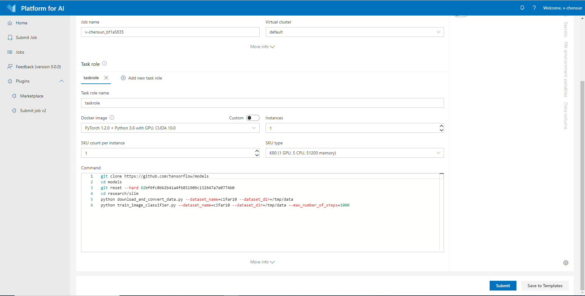</center>
<center>图 7.2.8 通过 Web 界面提交作业到集群 (<a href="https://github.com/microsoft/pai/blob/master/docs/manual/cluster-user/imgs/new-input-command.png">图片来源</a>)</center> 

如图 7.2.9 所示，开发者在提交作业到集群之前一般会经历大致三个环境的开发。因为集群资源紧张需要排队，一般开发者会先在自己的开发环境开发，测试保证程序不出错后再提交到集群平台。

1. 书写 Python 人工智能程序：用户可以本地使用 VS Code 等工具进行书写。VS Code 通过插件方便本地调试，代码静态检测，与代码完成，能比较好的提升开发效率，同时不需要平台资源排队，对快速开发初始程序非常方便，一般如果本地设备没有 GPU 可以考虑安装 CPU 版本的深度学习框架进行开发与测试。
   
2. 如果有可用的测试服务器挂载有 GPU，开发者可以在第二个阶段提交作业到测试服务器进行测试。如果是小规模作业也可以在服务器完成一定的训练，但是 GPU 不足以满足大规模多卡和分布式训练，或者搜索空间巨大的超参数搜索需求，所以调试完成的程序可以在测试服务器进行 Docker 镜像构建或者上传数据等。在这个阶段比较适合使用 VS Code配合 [Remote SSH](https://marketplace.visualstudio.com/items?itemName=ms-vscode-remote.remote-ssh) 插件进行远程开发。

3. 当用户确保程序开发完成就可以将作业提交到平台进行批处理作业的执行（用户可以选用命令行工具，Web 或者 REST API 进行作业提交），由于 GPU 是稀缺资源，可能会经历一定的排队的流程（例如，数小时），这个时候用户可以用闲暇时间继续开发新的作业或者阅读论文等找新的优化点或调试其他作业与模型。作业提交之后就可以参考如图 7.2.9 的流程，进行作业的完整执行了。这个过程就比较适合通过 Web 访问作业监控界面，SSH 登陆到作业进行调试，或者通过作业容器部署启动 Jupyter 进行交互式开发。

<center> 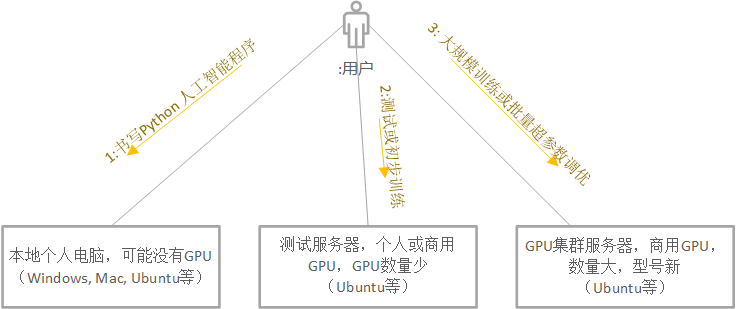</center>
<center>图 7.2.9 人工智能作业的不同开发环境 (<a href="">图片来源</a>)</center>

如图 7.2.10 所示，开发者一般经历本地开发，测试服务器开发，进而再打包程序提交到平台执行，监控执行作业状态与调试，最终程序执行完成返回状态，模型或数据。根据训练结果，开发者可以调整，优化后再开始下一次的作业提交。

<center> 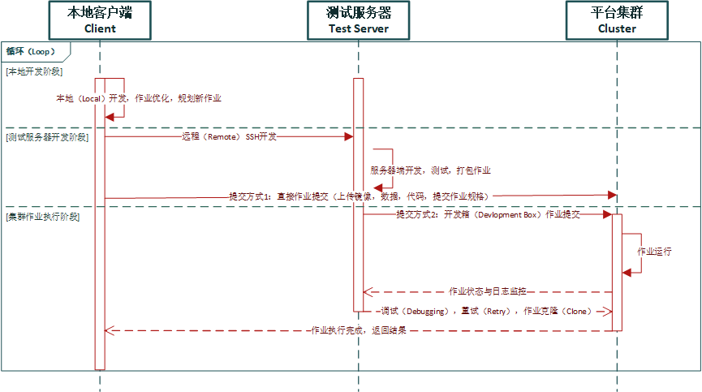</center>
<center>图 7.2.10 人工智能作业开发体验时序图 (<a href="">图片来源</a>)</center>

如图 7.2.11 所示，当作业已经调试完成，用户会经历以下的步骤与平台交互完成训练过程：
1. 用户首先上传数据到存储。
2. 上传镜像到镜像中心。
3. 提交作业规格。填写数据，镜像路径，资源需求和启动命令行。
4. 集群调度器调度作业。
5. 空闲 GPU 节点拉取（Pull）镜像。
6. 空闲 GPU 节点启动作业。
7. 挂载文件系统。
8. 作业运行启动。
9. 作业监控不断汇报性能指标和日志用于观测与调试。
10. 训练完成作业保存结果。

<center> 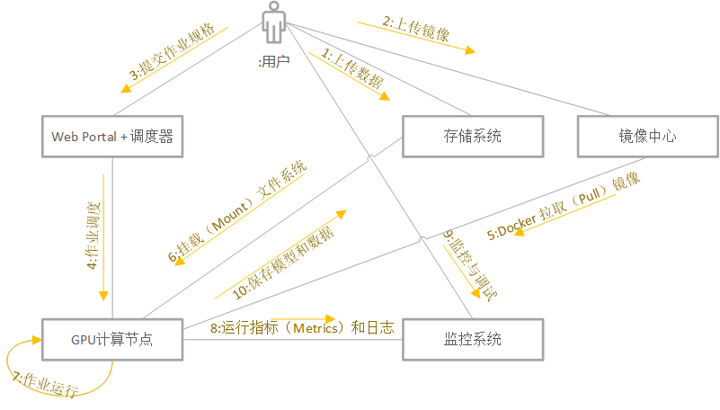</center>
<center>图 7.2.11 提交到集群的作业生命周期 (<a href="">图片来源</a>)</center>


## 小结与讨论

本章我们主要介绍异构计算集群管理系统的运行时，在运行时中，资源与环境隔离是核心问题，虽然我们看到有很多方案在视图解决相应问题，但是其更彻底的解决方案还是基于操作系统和硬件的底层原语的支持。容器与镜像解决了环境依赖，资源隔离进而奠定未来平台提供多租的基石。

请读者思考，作业运行期在 GPU 技术栈下面临了什么新的问题？
相比传统操作系统，在 GPU 技术栈还不完善的功能是？
  
## 参考文献 

<div id="pai"></div>

1.   [Microsoft Open Platform for AI (OpenPAI)](https://github.com/microsoft/pai)
    
<div id="cgroups"></div>

2.   [Wikipedia contributors. "Cgroups." Wikipedia, The Free Encyclopedia. Wikipedia, The Free Encyclopedia, 12 Jun. 2022. Web. 3 Jul. 2022.](https://en.wikipedia.org/wiki/Cgroups)

<div id="unionfs"></div>

3.   [Unionfs: A Stackable Unification File System](https://unionfs.filesystems.org/)

<div id="namespaces"></div>

4.   [Wikipedia contributors. "Linux namespaces." Wikipedia, The Free Encyclopedia. Wikipedia, The Free Encyclopedia, 27 May. 2022. Web. 3 Jul. 2022.](https://en.wikipedia.org/wiki/Linux_namespaces)

<div id="nvdocker"></div>

5.   [NVIDIA Container Toolkit](https://github.com/NVIDIA/nvidia-docker)

<div id="containerexample"></div>

6.   [Containers from Scratch](https://ericchiang.github.io/post/containers-from-scratch/)

<div id="gpuos"></div>

7.   [Christopher J. Rossbach, Jon Currey, and Emmett Witchel. 2011. Operating systems must support GPU abstractions. In Proceedings of the 13th USENIX conference on Hot topics in operating systems (HotOS'13). USENIX Association, USA, 32.](https://dl.acm.org/doi/10.5555/1991596.1991639)

<div id="enableos"></div>

8.   [Menychtas, Konstantinos, Kai Shen, and Michael L. Scott. "Enabling {OS} Research by Inferring Interactions in the {Black-Box}{GPU} Stack." 2013 USENIX Annual Technical Conference (USENIX ATC 13). 2013.](https://www.usenix.org/conference/atc13/technical-sessions/presentation/menychtas)

<div id="syscallgpu"></div>

9.   [J. Veselý, A. Basu, A. Bhattacharjee, G. H. Loh, M. Oskin and S. K. Reinhardt, "Generic System Calls for GPUs," 2018 ACM/IEEE 45th Annual International Symposium on Computer Architecture (ISCA), 2018, pp. 843-856, doi: 10.1109/ISCA.2018.00075.](http://www.cs.yale.edu/homes/abhishek/jvesely-isca18.pdf)

<div id="gandiva"></div>

10.   [Wencong Xiao, Romil Bhardwaj, Ramachandran Ramjee, Muthian Sivathanu, Nipun Kwatra, Zhenhua Han, Pratyush Patel, Xuan Peng, Hanyu Zhao, Quanlu Zhang, Fan Yang, and Lidong Zhou. 2018. Gandiva: introspective cluster scheduling for deep learning. In Proceedings of the 13th USENIX conference on Operating Systems Design and Implementation (OSDI'18). USENIX Association, USA, 595–610.](https://dl.acm.org/doi/10.5555/3291168.3291212)

<div id="antman"></div>

11.   [Wencong Xiao, Shiru Ren, Yong Li, Yang Zhang, Pengyang Hou, Zhi Li, Yihui Feng, Wei Lin, and Yangqing Jia. 2020. AntMan: dynamic scaling on GPU clusters for deep learning. Proceedings of the 14th USENIX Conference on Operating Systems Design and Implementation. USENIX Association, USA, Article 30, 533–548.](https://dl.acm.org/doi/abs/10.5555/3488766.3488796)

<div id="salus"></div>

12.   [Yu, Peifeng, and Mosharaf Chowdhury. "Salus: Fine-grained gpu sharing primitives for deep learning applications." arXiv preprint arXiv:1902.04610 (2019).](https://arxiv.org/abs/1902.04610)
