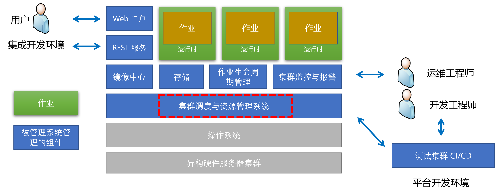
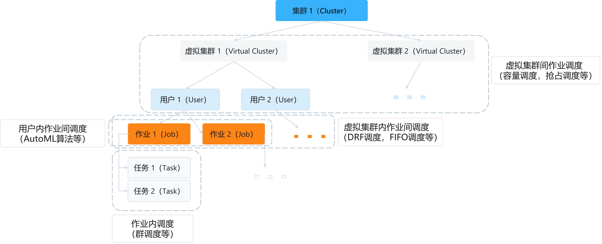
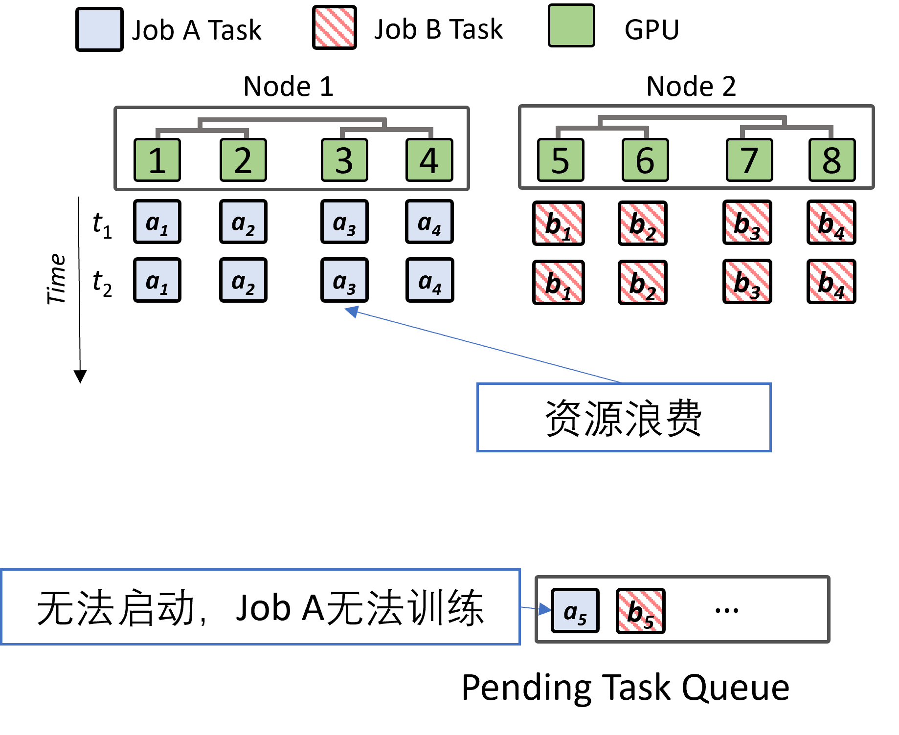
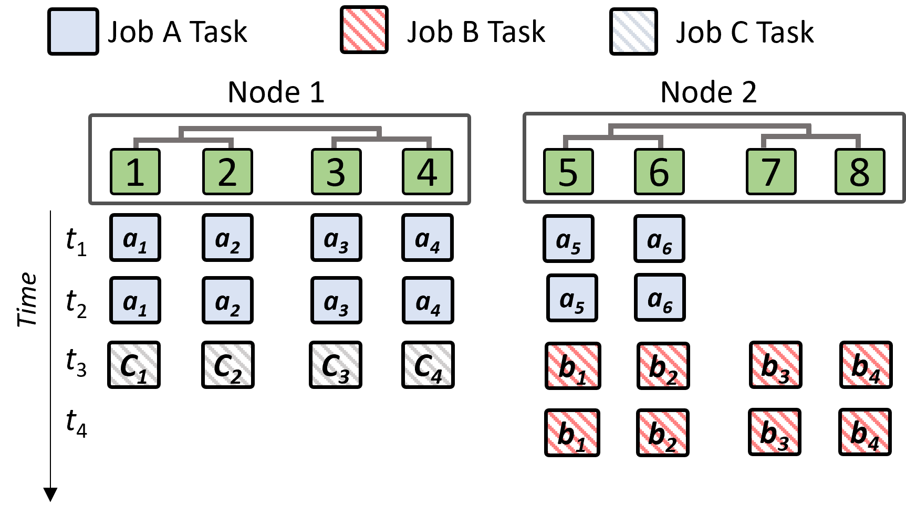
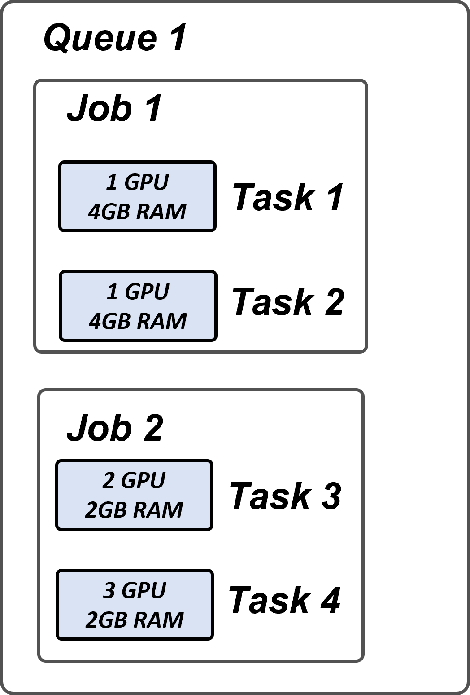
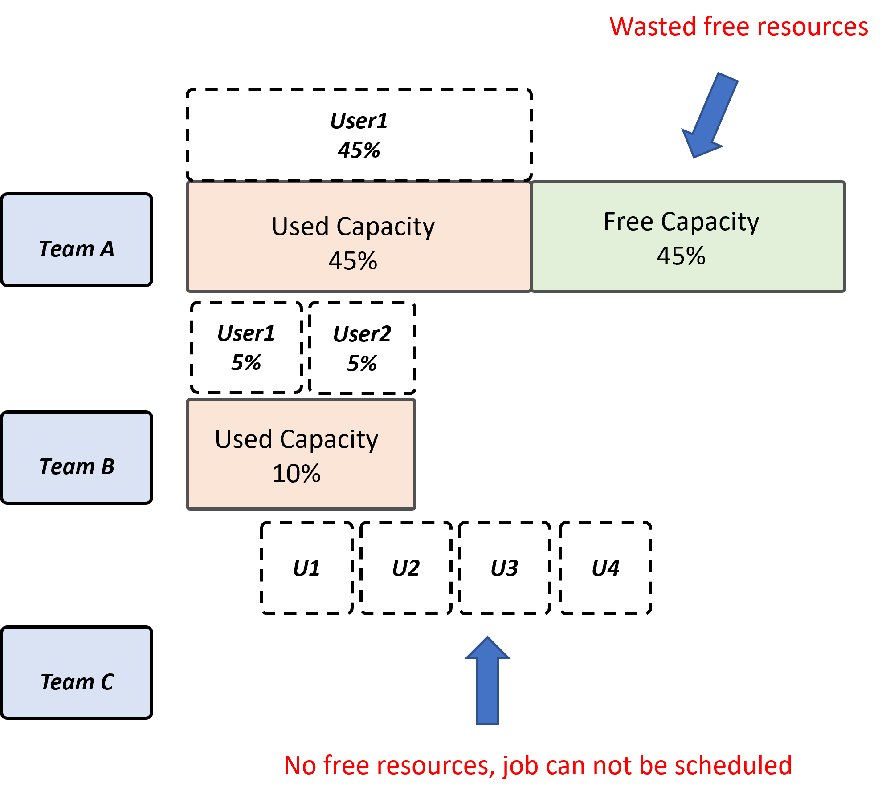
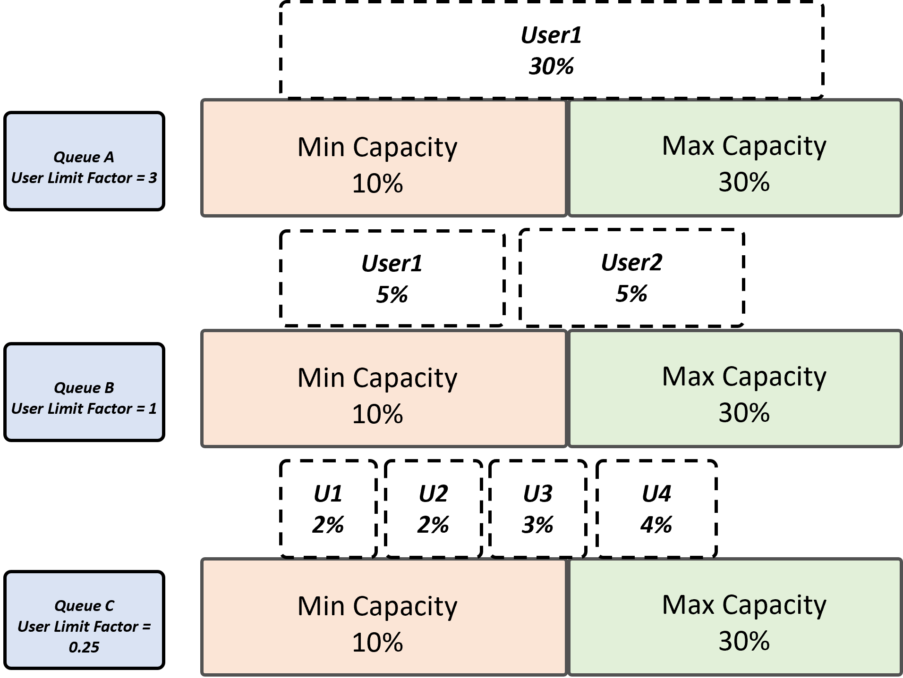
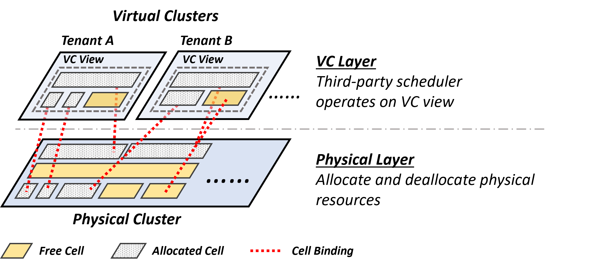
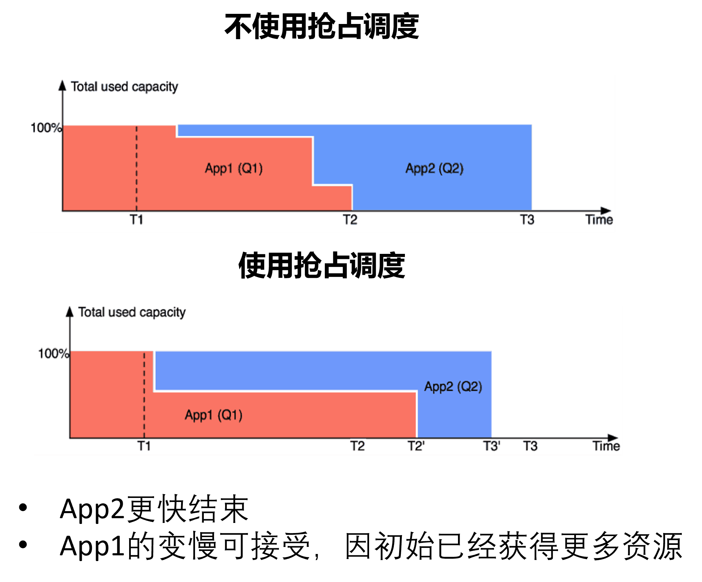
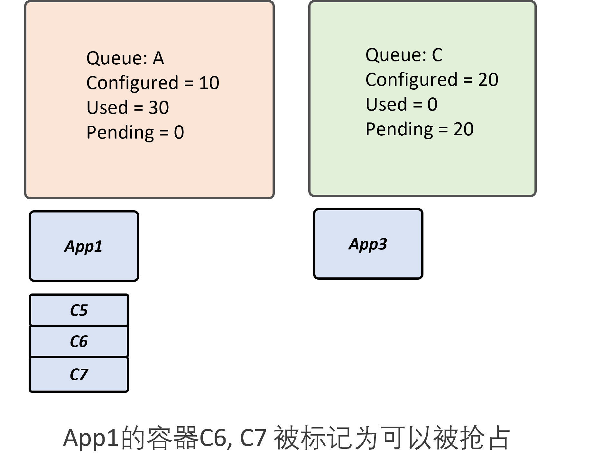

<!--Copyright © Microsoft Corporation. All rights reserved.
  适用于[License](https://github.com/microsoft/AI-System/blob/main/LICENSE)版权许可-->

# 7.3 调度（Scheduling）

 

图 7.3.1 平台调度器

在之前的章节，我们已经介绍集群管理中的运行时，但是作业进程在启动前，需要平台本身进行决策当前作业运行在哪些服务器和 GPU 上，哪个作业能优先执行，进而进行调度决策。如图中所示，本章将围绕调度问题的抽象与优化目标，以及可用于深度学习作业调度的传统调度算法进行介绍，期望让读者了解作业调度的经典问题和解决方法。

- [7.3 调度（Scheduling）](#73-调度scheduling)
  - [7.3.1 调度问题优化目标](#731-调度问题优化目标)
  - [7.3.2 单作业调度-群调度](#732-单作业调度-群调度)
  - [7.3.3 作业间调度-主导资源公平 DRF（Dominant Resource Fairness）调度](#733-作业间调度-主导资源公平-drfdominant-resource-fairness调度)
  - [7.3.4 组间作业调度-容量调度（Capacity Scheduling）](#734-组间作业调度-容量调度capacity-scheduling)
  - [7.3.5 虚拟集群（Virtual Cluster）机制](#735-虚拟集群virtual-cluster机制)
  - [7.3.6 抢占式调度（Preemptive Scheduling）](#736-抢占式调度preemptive-scheduling)
  - [7.3.7 深度学习调度算法实验与模拟研究](#737-深度学习调度算法实验与模拟研究)
    - [7.3.7.1 数据读取](#7371-数据读取)
    - [7.3.7.2 评测指标设定](#7372-评测指标设定)
    - [7.3.7.3 算法实现与评测](#7373-算法实现与评测)
  - [小结与讨论](#小结与讨论)
  - [参考文献](#参考文献)

## 7.3.1 调度问题优化目标

[调度（Scheduling）](https://en.wikipedia.org/wiki/Scheduling_(computing))是分配资源以执行任务的动作。在深度学习平台中，资源可以是处理器、GPU、内存等，任务是用户提交的作业。
调度活动（Scheduling Activity）由称为调度器的进程执行。

调度器中的调度算法通常被设计为使所有计算机资源保持忙碌，让多个用户高效地***共享***系统资源，或实现目标服务质量（Quality-of-Service）。

在运行深度学习作业的集群服务器上，会部署一个“操作系统”进行作业管理与调度，也就是异构资源管理系统，也称作深度学习平台。相比传统操作系统，其特点是，运行的“进程”一般为深度学习作业，所以是一个专有操作系统。管理的资源不仅是一台机器，而是多台服务器构成的集群资源池。每台服务器挂载了多块商用 GPU，InfiniBand 网卡等异构硬件。深度学习平台也是要对作业提供整体所管理的硬件的“一定抽象层次”上的多路复用（Multiplexing）。同时由于整个系统不仅一个用户会提交多个作业，整个资源池被多个公司内部组和用户共享，也就是我们所说的多租（Multi-Tenancy）系统。

平台常常针对一批用户提交的作业进行调度，其常常考虑以下指标 :

作业延迟与吞吐相关指标：
- 排队延迟（Queuing Delay）：描述作业在调度器队列中等待资源分配所花费的时间，排队延迟越低，代表用户作业需要等待的时间越短，越高效。主要受两个因素影响，一个是公平性，由于用户作业用完所分配的配额，另一个是局部性（Locality）和资源碎片问题造成资源无法分配和等待。
- 平均响应时间（Average Response Time）：平均响应时间是从提交请求到产生第一个响应的时间量的平均。平台希望平均响应时间越短越好。 
- 平均作业完成时间（Job Completion Time）：一批作业的平均完成时间，指标能够代表系统性能。例如，考虑分布式作业的局部性，影响通信时间，进而影响JCT。
- 完工时间（Makespan）：对一批作业，第一个作业到达到最后一个作业完成的整体时间，希望其越小越好，有些调度算法也考虑所有作业的整体完工时间作为优化目标，因为最小化完工时间（Makespan）等价于最大化资源效率（Efficiency）。
- 吞吐（Throughput）：单位时间能完成的作业数量。平台希望吞吐量越大越好。 

平台资源利用率相关指标：
- 资源利用率（Utilization) ：描述用于作业的资源占总资源的百分比。平台希望利用率越高越好。
- 资源碎片（Fragmentation）：作业分配后造成个别节点资源无法被再分配，产生碎片问题。碎片越少，代表资源浪费越少。也是和资料利用率相关的指标。

公平与服务水平相关指标：
- 公平性（Fairness）：资源使用在平台用户或组之间平均或按指定配额比例分配。
- 服务水平协议（SLA）：服务级别协议 (SLA-service-level Agreement) 是平台和用户之间的承诺。例如，平台服务的公平性，质量、可用性、责任等在平台和用户之间进行约定和达成一致。

如图 7.3.2 所示，平台中包含以下集群与作业的包含层级关系，不同层次中蕴含不同的调度问题，我们可以将之后涉及的面向深度学习调度算法也映射到其中的层级问题的解决方法。读者在之后思考下一章 7.4 中的面向深度学习作业的调度算法属于图中其中哪个层级？

- 虚拟集群间作业调度：集群间作业可以通过容量调度（Capacity Scheduling），抢占调度等方式进行调度。其关注公平性，也会为提升效率提供一定奖励资源配合作业强占，提升效率的同时保证服务等级协议。
- 虚拟集群内作业间调度：在一个虚拟集群内用户提交的作业可以根据先进先出（FIFO），主导资源公平（DRF）等算法进行调度。其较为关注防止作业饥饿，降低排队时间，提升作业的完工时间，减少资源碎片进而提升利用率等。
- 用户内作业间调度：此类问题读者可以参考第 9 章自动化机器学习系统了解。用户为了超参数调优会提交改变一定超参数的不同作业进行训练。其较为关注整体作业的完工时间，响应时间，吞吐量等。
- 作业内调度：如果是多卡或分布式作业会启动多个任务，做业内可以通过群调度（Gang Scheduling）算法进行调度。其较为关注作业语义与正确性，作业的完成时间等。
  

 

图 7.3.2 平台中的作业调度问题总览 

接下来，我们将通过经典的调度算法，看平台常用算法是如何解决遇到的问题的。

## 7.3.2 单作业调度-群调度

群调度（Gang Scheduling)[[1]](#gang) 的 Wiki 定义是：一种用于并行系统的调度算法，用于调度相关线程或进程,在不同处理器上同时启动并运行。

深度学习作业通常会持续数小时，有些甚至会持续数周。深度学习作业通常需要群调度，直到所有必需的加速设备都被授予后才能开始训练过程。 

如果不使用群调度会产生什么问题? 深度学习作业可以同时执行多个任务，如果有依赖任务没启动，已启动任务会在同步点忙于等待或者频繁上下文切换 (如下图所示)。首先会造成训练任务无法训练，由于等待不能启动的任务，如下图所示两个作业都申请了部分资源，但是还需要其他资源才能启动，产生了死锁现象。同时已启动的任务不释放资源，造成资源浪费。

 

图 7.3.3 并行启动执行作业可能产生的问题

接下来，对上面的问题实例，我们使用群调度（Gang Scheduling）同时启动深度学习任务进程。图中的 A，B，C 作业就可以交替执行，保证任务能顺利执行完。

 

图 7.3.4 并行执行作业可能产生的问题

当然群调度自身也有一定的局限性，群调度会增加资源碎片化的风险，并且在共享集群中利用率低。如图中 t1，t2 时间段，GPU 7 和 8 就是空闲浪费的。

## 7.3.3 作业间调度-主导资源公平 DRF（Dominant Resource Fairness）调度 

目前深度学习平台其实包含多种异构资源（CPU，GPU，主存等）以及被多用户使用是一个多租的环境。在调度过程中用户会细粒度的申请不同资源的用量，我们在满足用户异构资源需求的同时，也希望在多租的环境下兼顾一定的公平。

- 问题：包含异构资源类型的系统中如何进行多作业公平（Fairness）的资源调度？
- 挑战：相比传统单资源公平调度，深度学习作业也需要使用多种异构资源 (CPU，主存等)，并且需要调度 GPU 及 GPU memory
  
[主导资源公平简称DRF（Dominant Resource Fairness）](https://cs.stanford.edu/~matei/papers/2011/nsdi_drf.pdf)[[2]](#drf)调度使用优势资源的概念来比较多维（CPU，GPU，内存等）资源。这个想法是在多资源环境中，资源分配应该由作业（用户或队列）的主导份额决定，这是作业已分配的任何资源（内存或 CPU）的最大份额。其论文中介绍，与其他可能的策略不同，DRF 满足几个较为理想的属性。

首先，DRF 激励用户共享资源，进而保证公平性。

其次，DRF 是[防策略（Strategy-Proof）](https://en.wikipedia.org/wiki/Strategyproofness)的，也就是说真话的人有好结果，因为用户没有动力通过谎报需求来增加作业资源的分配。用户当前基于最大最小公平，谎报更多的资源则需要更多的排队时间。

同时，DRF 是[无嫉妒（Envy-free）](https://en.wikipedia.org/wiki/Envy-freeness)的，也就是用户不羡慕其他用户的分配，其他用户的分配即使更快但是不一定适合自己的资源需求，这样反应了公平性。

最后，DRF 分配是帕累托有效（Pareto Efficient）的，帕累托有效（Pareto Efficient）是指如果一种可行的配置不可能在不损害某些人利益的前提下使另一些人获益，则该配置便是一种帕累托效率的配置。因为不可能在不减少另一个用户的配额的情况下改善一个用户的配额。算法的作者在 Mesos 集群资源管理器中实现了 DRF。

本质上，DRF 优化目标是寻求最大化所有实体的最小主导份额（Smallest Dominant Share）。

DRF 调度策略的简要总结是：

1. 通过同类型资源在集群整体资源中的份额确定主导资源 (Dominant Resource)。
2. 基于最大最小公平（Max-Min Fairness）的针对多资源类型（例如 GPU，CPU）的调度算法。

如下图所示实例，有 Job 1 和 Job 2 都在启动多个任务并申请多个资源。第一步先计算每个 Job 的主导资源。Job 1主导资源为 Memory，Job 2 主导资源是 GPU。Job 1 的优先级高于 Job 2，因为 Job 1 份额 0.4 小于 Job 2 份额 0.5。 

 

图 7.3.5 2个作业的DRF调度实例  (<a href="https://github.com/volcano-sh/volcano/blob/master/docs/design/drf.md">图片引用 Volcano</a>)

$$Cluster \  Resources: [10 \  GPU, 20GB \ RAM] $$

以下的资源申请需求中，主导资源是内存。
$$Job \ 1:$$
$$Total \ GPU \ 1 + 1 = 2 \ GPU$$
$$GPU \ Share \ \frac{2}{10} = 0.2$$
$$Total \ Memory \ 4 + 4 = 8GB$$
$$Memory \ Share \ \frac{8}{20} = 0.4$$
$$Dominant \ resource \ is \ Memory$$

以下的资源申请需求中，主导资源是GPU。
$$Job \ 2:$$
$$Total \ GPU \ 2 + 3 = 5 \ GPU$$
$$GPU \ Share \ \frac{5}{10} = 0.5$$
$$Total \ Memory \ 2 + 2 = 4GB$$
$$Memory \ Share \ \frac{4}{20} = 0.2$$
$$Dominant \ resource \ is \ GPU$$

## 7.3.4 组间作业调度-容量调度（Capacity Scheduling）

除了多个作业能够兼顾公平的分配，平台管理员还需要考虑如果是多个组共享平台，也需要兼顾组与组之间的公平性。
如何让多个小组共享集群？
  - 能否为多个组织共享集群资源？
  - 共享集群资源的同时，如何同时为每个组织提供最小容量保证?
  - 空闲资源能否弹性为其他组织利用？

挑战：相比传统容量调度调度，深度学习作业也需要考虑调度 GPU 及 GPU 显存
  
容量调度器（Capacity Scheduler）[[3]](#yarn)在大数据平台常常作为主流调度器使用，从[作业类型角度](https://research.google/pubs/pub43438/)，大数据作业和深度学习训练作业，都可以看成是批处理作业。它允许多租户安全地共享一个大型集群，以便在分配容量的限制下及时为他们的应用程序分配资源。 

我们看下图实例，图中组（Team） A，B，C 共享集群，每个组有多个用户，每个用户都会提交作业使用集群资源。如果不考虑组间公平性，Team A 再申请了 $45\%$ 的资源后，如果没有使用造成浪费的同时，也会让 Team C 对资源无法申请，产生[饥饿（Starvation）](https://en.wikipedia.org/wiki/Starvation_(computer_science))现象。

 

图 7.3.6 资源占用过多造成其他组无法分配资源问题

所以，容量调度为了支持支持多租（Multi-Tenant）资源共享设计了以下的策略集合：
- 提升利用率（Utilization）: 
  - 虚拟集群（Virtual Cluster）：组能看到视图是虚拟资源，并不绑定具体机器，等作业启动后分配相应的资源，这样有助于提升资源利用率。
  - 层级队列（Hierarchical Queues）: 支持队列分层结构，以确保在允许其他队列使用空闲资源之前在组织的子队列之间共享资源，从而提供更多的控制和可预测性。 
  - 队列内可以正交组合其他作业间调度算法，例如，先进先出（FIFO），DRF 等。对异构计算场景，扔可以采用适合多维资源调度或其他自定义调度器。满足下面介绍的约束情况下，仍旧可以采用DRF等调度策略进行具体作业之间的调度与资源分配。
- 多租与提升公平性（Fairness）:
  - 多租与用户限制因素（User Limit Factor）：
    - 从某种意义上说，队列将分配到网格容量的一小部分，因为它们可以使用一定容量的资源。 提交到队列的所有应用程序都可以访问分配给队列的容量。管理员可以对分配给每个队列的容量配置软限制和可选的硬限制。 
    - 允许多用户多组以多租形式使用集群。控制单用户的可以消耗的最大资源，放止占用资源过多，造成其他进程无法申请资源。
- 弹性（Elasitcity）和 SLA 
  - 奖励资源（Bonus Resource）：对其他组没有使用的资源可以临时免费出让给有需要的团队，但是当资源持有者需要，则需要抢占资源归还给持有者。
  - 抢占（Preemption）：配合奖励资源使用，保证对用户提供的服务等级协议（SLA）。

如下图所示，当管理员配置了最小和最大的组使用资源限额，这样保证组与组之间都有资源可用。

 

图 7.3.7 容量调度

***经典回顾***

操作系统[公平共享调度（Fair-share Scheduling）](https://en.wikipedia.org/wiki/Fair-share_scheduling)：“是一种用于操作系统的调度算法，其中 CPU 在系统用户或组之间平均分配（或演变为类似容量调度，组之间按比例分配配额），而不是在进程之间平均分配资源。在逻辑上实现公平共享调度策略的一种常见方法是在每个抽象级别（进程、用户、组等）递归应用轮询调度（Round-Robin）策略，例如，两个公平分配的组，组内用户再根据轮训或其他调度算法进行调度。”所以我们看到有的时候调度算法具有一定的正交性，可以嵌套使用，关键是在不同抽象级别上应用不同的策略。

## 7.3.5 虚拟集群（Virtual Cluster）机制

在集群内，组和用户所看到的的资源配额一般情况下，并没有绑定到具体的物理机器，而是在调度后决定作业部署的物理机器。这背后是通过虚拟集群 (Virtual Cluster) 映射所实现的。而虚拟集群和我们之前介绍的控制组（Cgroups）的设计较为类似。我们会看到很多集群产生的问题，在传统的操作系统中都能找到类似的设计问题与原则。

如下图所示，虚拟集群会配置用户组的配额和视图，物理集群是在调度后在运行时绑定的。这样可以大幅提升资源利用率，减少资源碎片。

 

图 7.3.8 虚拟集群和物理集群映射与绑定  (<a href="https://www.usenix.org/sites/default/files/conference/protected-files/osdi20_slides_zhao.pdf">图片引用 HiveD</a>)

如图所示，针对深度学习作业调度的虚拟集群策略可以总结为：
- 虚拟集群根据小组的配额进行定义
- 每个租户（Tenant）构成了一个虚拟集群（VC）
- 资源被分配给租户（Tenant）
- 将虚拟集群绑定到物理集群

 

图 7.3.9 虚拟集群资源分配  <a href="https://dl.acm.org/doi/10.5555/3488766.3488795">图片引用 HiveD OSDI '20</a> 

***经典回顾***

虚拟集群的设计思想类似传统操作系统中的控制组（Cgroups），约束资源但是解耦物理资源的绑定。操作系统[控制组（Cgroups）](https://man7.org/linux/man-pages/man7/cgroups.7.html)，让不同组织，用户的不同进程在操作系统中有相应的资源约束，但是不于具体硬件资源绑定，而是由运行时调度分配。

## 7.3.6 抢占式调度（Preemptive Scheduling）

一些集群管理员为了减少组内空闲资源的浪费，希望通过一定的策略共享虚拟集群内的空闲资源，但是单纯出让资源但是不能保证原有用户随时能回收对应配额资源，产生相应新的问题即不能保证对原用户的 SLA （Service Level Agreement）。这种问题一般可以通过抢占调度解决，也就是当资源的原有用户需要资源时，终止使用奖励资源的作业进程，回收资源给原配额用户。

强占调度一般用于以下场景：

（1）让资源饥饿的作业，或短作业强占一定资源，降低作业的平均响应时间。由于深度学习作业的韧性（Resilience）并不完善，一般不为此类需求使用强占调度。
   
如下图所示 APP2 长时间无法得到资源，则无法执行，而其执行时间实际很短。这就需要通过抢占机制进行调度。让 APP2 获取一定资源执行，保证降低平均响应时间。

 

图 7.3.10 作业等待时间过长问题  <a href="https://www.slideshare.net/Hadoop_Summit/enabling-diverse-workload-scheduling-in-yarn">图片引用 Hortonworks Talk '15</a> 

（2）出让虚拟集群空闲资源资源形成奖励资源供其他虚拟集群中的作业使用，提升整体资源利用率。一般我们在深度学习中常常是出于这点考虑使用强占调度。
   
下图所示，我们可以看到，A 队列中配置可用为 10 资源，但是由于集群有空闲资源，多实用了 20 奖励资源给 C6 和 C7，这时C队列需要使用 20 资源，而且集群应该保证，这时会触发抢占。当 APP1 的 C6 和 C7 使用的资源被标记为可以被抢占后，其资源可以通过以下步骤被抢占：
1. 从过度使用的队列中获取需要被抢占的容器（队列 A 的 C6 和 C7）。
2. 通知作业（队列 A）控制器即将触发抢占。
3. 等待直到被抢占终止运行。

 

图 7.3.11 抢占调度 <a href="https://blog.cloudera.com/better-slas-via-resource-preemption-in-yarns-capacityscheduler/">图片引用 Cloudera YARN Capacity Scheduler '15</a>

抢占式调度对深度学习作业的挑战：在深度学习作业下，被抢占的作业当前只能失败，默认情况下无法像传统操作系统进行上下文切换。目前有些工作中会提供框架或设备驱动库层的检查点机制，配合调度器实现强占与恢复，但是由于本身不是原生支持，所以有一定开销且支持的框架与场景有限并未大范围使用。未来可以设计更好的深度学习检查点和恢复技术进行减少抢占后作业失效造成的被强占作业资源无效使用的问题。

***经典回顾***

- [操作系统抢占调度](https://en.wikipedia.org/wiki/Preemption_(computing))：“抢占（Preemption）是暂时中断正在执行的任务的行为，目的是占用执行任务的资源给其他任务。这个中断（Interrupt）是由外部调度器完成的，处理器当前执行任务的这种变化称为上下文切换（Context Switching）。”如今，几乎所有操作系统都支持[抢占式多任务处理](Preemptive Multitasking)，例如 Windows、macOS、Linux 等。读者思考深度学习作业是否能支持上下文切换，也就是恢复或迁移被强占进程？
  
## 7.3.7 深度学习调度算法实验与模拟研究

调度算法的研究如果通过真实作业进行实验执行时间过长，代价较大，一般调度算法的研究基于历史作业日志，通过模拟器验证。

读者可以通过本实例的练习，通过真实的平台上的深度学习作业日志痕迹（Traces），进行以上调度算法模型，或研究新的面向深度学习的调度算法。
此开源数据集 [philly-traces](https://github.com/msr-fiddle/philly-traces) 包含 Microsoft 内部 Philly 集群上第一方 (First-Party) 深度学习训练工作负载的代表性子集。数据是 ATC '19 中“Analysis of large-scale multi-tenant GPU clusters for DNN training workloads”[[4]](#philly)中描述的工作负载的一个脱敏数据子集。 

### 7.3.7.1 数据读取
读者可以参考库中提供的脚本读取数据并了解数据模式。

### 7.3.7.2 评测指标设定
读者可以根据本章开始介绍的指标设计优化目标。

### 7.3.7.3 算法实现与评测
读者可以选用以上介绍的经典算法作为基准测试，设计新的算法，并通过真实平台数据模拟，看能否提升当前目标，超越基准算法，并进行结果分析，形成分析报告或论文。

## 小结与讨论

本章我们主要介绍可以应用于异构计算集群管理系统的传统经典算法，这些算法在深度学习集群管理的场景依然发挥作用，我们可以看到经典理论和技术的魅力并经得起时间的考验。

请读者思考，当前调度算法，在深度学习作业场景还有哪些不足和潜在优化？

## 参考文献

1.   [Wikipedia contributors. "Gang scheduling." Wikipedia, The Free Encyclopedia. Wikipedia, The Free Encyclopedia, 11 Jan. 2021. Web. 3 Jul. 2022.](https://en.wikipedia.org/wiki/Gang_scheduling)

2.   [Ali Ghodsi, Matei Zaharia, Benjamin Hindman, Andy Konwinski, Scott Shenker, and Ion Stoica. 2011. Dominant resource fairness: fair allocation of multiple resource types. In Proceedings of the 8th USENIX conference on Networked systems design and implementation (NSDI'11). USENIX Association, USA, 323–336.](https://dl.acm.org/doi/10.5555/1972457.1972490)

3.   [Hadoop: Capacity Scheduler](https://hadoop.apache.org/docs/stable/hadoop-yarn/hadoop-yarn-site/CapacityScheduler.html)

4.   [Myeongjae Jeon, Shivaram Venkataraman, Amar Phanishayee, unjie Qian, Wencong Xiao, and Fan Yang. 2019. Analysis of large-scale multi-tenant GPU clusters for DNN training workloads. In Proceedings of the 2019 USENIX Conference on Usenix Annual Technical Conference (USENIX ATC '19). USENIX Association, USA, 947–960.](https://dl.acm.org/doi/10.5555/3358807.3358888)
