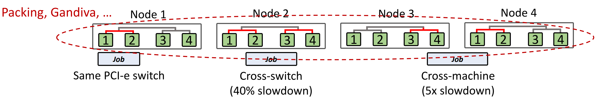
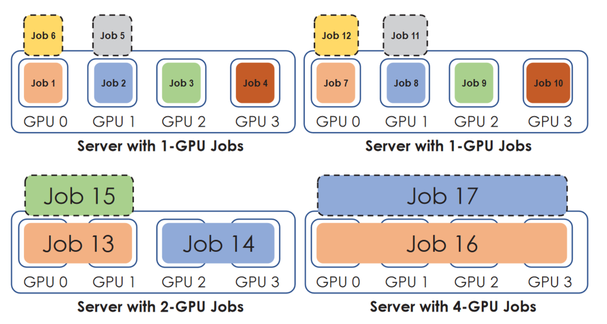
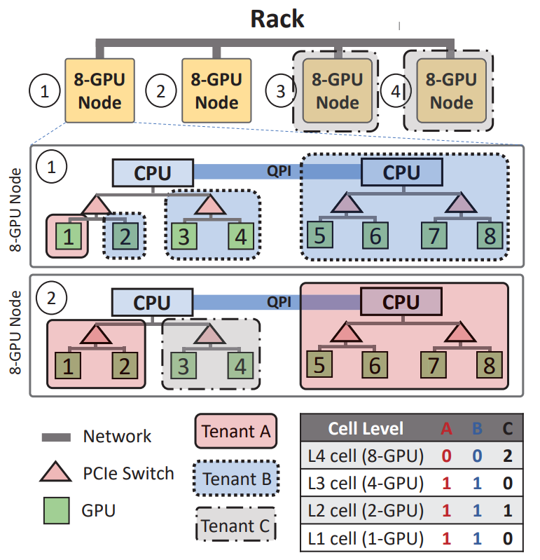
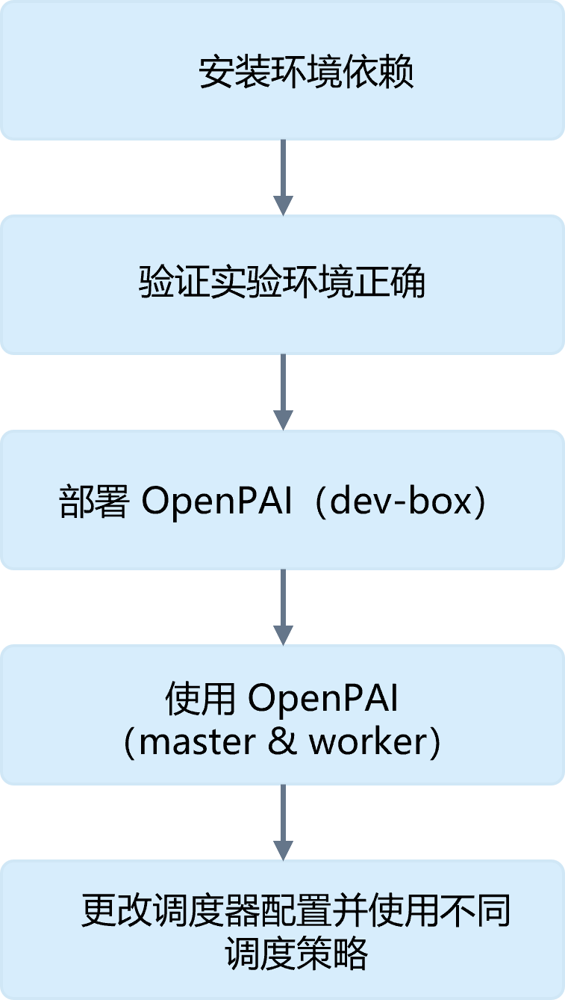

<!--Copyright © Microsoft Corporation. All rights reserved.
  适用于[License](https://github.com/microsoft/AI-System/blob/main/LICENSE)版权许可-->

# 7.4 面向深度学习的集群管理系统


之前的章节已经介绍经典的调度算法在运行深度学习作业的集群调度中的应用。但是这些算法本身没有考虑深度学习作业自身的特点，也没有利用 GPU 服务器中 GPU 的拓扑结构等硬件体系结构。
本章将围绕前沿的针对深度学习负载和 GPU 服务器特点而设计的平台调度算法进行介绍，期望让读者了解新负载和硬件的特点和调度管理需求，启发新的工作。
本章节的很多工作目前没有严格定论，还属于研究的前沿，本章内容中更重要的是总结当前负载，硬件和平台本身的新问题和设计动机（Motivation），启发读者未来可以思考新的研究和工程工作。

- [7.4 面向深度学习的集群管理系统](#74-面向深度学习的集群管理系统)
  - [7.4.1 深度学习工作负载的需求](#741-深度学习工作负载的需求)
      - [思考题](#思考题)
  - [7.4.2 异构硬件的多样性](#742-异构硬件的多样性)
  - [7.4.3 深度学习平台的管理与运维需求](#743-深度学习平台的管理与运维需求)
    - [思考与实验设计](#思考与实验设计)
  - [7.4.4 深度学习负载与异构硬件下的调度设计](#744-深度学习负载与异构硬件下的调度设计)
  - [7.4.5 开源和云异构集群管理系统简介](#745-开源和云异构集群管理系统简介)
  - [7.4.6 部署异构资源集群管理系统实验](#746-部署异构资源集群管理系统实验)
    - [7.4.6.1 实验目的](#7461-实验目的)
    - [7.4.6.2 实验环境](#7462-实验环境)
    - [7.4.6.3 实验原理](#7463-实验原理)
    - [7.4.6.4 实验内容](#7464-实验内容)
    - [7.4.6.5 实验报告](#7465-实验报告)
  - [小结与讨论](#小结与讨论)
  - [参考文献](#参考文献)

## 7.4.1 深度学习工作负载的需求

已有的深度学习作业调度工作（例如，[Gandiva OSDI '18](https://dl.acm.org/doi/10.5555/3291168.3291212) [<sup>[2]</sup>](#gandiva)）对当前深度学习作业负载的特点进行了分析与总结。我们使用的集群管理系统管理的大多数作业是深度学习的训练作业而不是推理作业。深度学习训练作业相比传统的数据中心批处理作业（例如，大数据处理和分析作业）有一些新的特点和不同：
“
- 单个深度学习训练作业特点：
  - 执行时间长：训练时间持续数小时甚至几天。
  - 迭代计算：作业主干部分是迭代的计算，每轮迭代可以切分为小时间窗口的任务。这样让作业本身有机会以更小的任务粒度触发调度和抢占策略。 
  - 内存数据量动态变化：在训练过程中不同的时间点做检查点有不同的内存数据量，这给做检查点提供了优化机会。如果有检查点的支持，可以让平台或框架本身支持更加激进的调度策略，例如，动态迁移作业，装箱作业到同一块 GPU，时分复用等。
  - 性能可预测性：资源消耗可预测性，可以通过运行时监控获取。由于其算法为迭代过程且具有一定的可预测性，让调度器有机会可以根据资源消耗做更加优化的作业放置和装箱。
- 分布式深度学习训练作业特点：
  - 对 GPU 拓扑结构敏感：数据并行策略通信传递梯度，模型并行策略通信传递中间结果张量，GPU 与 GPU 之间传输带宽容易形成瓶颈。所以考虑 GPU 亲和性（Affinity）的任务放置策略，对降低分布式训练作业的完工时间有帮助。但会引发新的问题，由于调度是一批 GPU，满足亲和性的同时，可能会产生更多资源碎片。
- 批量深度学习训练作业特点：
  - 反馈驱动探索：自动化机器学习场景下，用户会一次性提交大量的深度学习作业。自动机器学习训练作业的一个关键特征是反馈驱动探索。由于深度学习实验固有的反复试验方法，用户通常会尝试多个作业配置（多项工作），并利用这些工作的早期反馈（准确度，误差等）来决定是否优先考虑或终止其中的某些作业。这种有条件的探索，称为超参数搜索或神经网络结构搜索，可以是手动的，也可以是系统自动调度。所以我们经常可以看到集群中有大量相似作业和被提前取消的作业。  
”

根据深度学习作业特点，软件栈和硬件栈的支持，框架或平台可以协同设计面向深度学习的作业调度策略，提升资源利用率等指标。

#### 思考题

总结思考深度学习作业和传统操作系统作业以及大数据平台作业的异同点？

## 7.4.2 异构硬件的多样性

深度学习作业训练时主要的计算单元是 GPU，所使用的服务器一般会挂载多块 GPU。相比传统的大数据作业使用的服务器硬件有一些新的特点。GPU 服务器集群运行深度学习问题与挑战：
（1）通信代价：由于多块 GPU 之间的互联方式多样，造成作业的不同放置方式受到 GPU 拓扑结构影响，进而影响数据通信代价，影响性能。GPU 根据一定拓扑挂载在 PCIe 总线或交换机上，GPU 与 GPU 之间通信可能节点内跨越 PCIe，PCIe 交换机，节点之间可能跨越 InfiniBand 或以太网。“距离”最近的 GPU 之间通信代价越低。
（2）资源争用：同时，作业本身由于可能共享服务器，数据总线等资源也受到服务器上同时运行作业的争用和干扰。

拓扑结构与任务的放置会影响多卡与分布式作业的训练性能。
所以针对硬件特点可以设计启发优化策略：考虑集群和服务器节点的 GPU 拓扑结构的亲和性（Affinity）调度。这点和传统 NUMA 架构中考虑[处理器亲和性（Processor Affinity）](https://en.wikipedia.org/wiki/Processor_affinity)的问题与优化有异曲同工之处。我们可以看到，对系统问题，我们可以从传统的操作系统的经典设计中找到设计原则，对新工作形成指导和借鉴。

## 7.4.3 深度学习平台的管理与运维需求

深度学习平台对上管理深度学习模型训练作业，对下管理以 GPU，InfiniBand 为代表的异构硬件，平台管理与运维也遇到了不小的挑战。平台管理员相比机器学习工程师，数据科学家等使用平台的用户更加关注以下的设计目标：

- 效率
  - GPU集群价格昂贵，更新换代频繁，如何规划好集群，提升投入产出比，如何在现有集群中，减少资源碎片，提升利用率也有很大的挑战。调度算法在一定程度上能优化和提升集群的资源利用率。
- 公平性
  - 目前使用深度学习平台的用户既有工程目的也有很多是科研目的。在训练生产模型的同时，也有一些是研究投稿赶论文截止的需求，造成相比传统批处理调度场景，用户有了类似特定时段的峰值资源使用需求。平台需要保证各组资源使用的公平性，同时提前规划好用户的资源使用同时兼顾峰值利用需求，需要管理员设计好相应的策略。
- 稳定性
  - 由于深度学习框架的设计者在初始没有像大数据社区一样把容错当成第一要义，框架提供基础的检查点机制，但是需要用户控制，没有自动备份与恢复的支持，在之后的设计版本和社区工具中才有弹性等功能的支持。对底层平台来说造成比较大的运维负担。
  - 由于节点上的异构硬件也有一定概率产生硬件问题（例如，[GPU 故障（Failure）](https://ieeexplore.ieee.org/abstract/document/7056044)）[<sup>[1]</sup>](#failure)，造成平台稳定性的挑战。如何高效，敏捷的发现和修复故障，除了工具的支持，还需要系统化的系统设计，开发流程设计与管理策略设计共同作用。
- 可维护性
  - 平台团队同时在开发和运维平台，可维护性也是平时减少运维负担的一个重要考虑的因素。通过微服务等手段(回顾操作系统[微内核](https://en.wikipedia.org/wiki/Microkernel)的设计思想)将功能模块尽可能的拆分，能够让故障的定位与修复最小化，同时良好的 DevOps 流程搭建，敏捷的开发与项目管理也为平台的可维护性提升起到关键的作用。
- 用户体验
  - 用户体验良好并统一的作业提交，作业管理与调试工具，能大幅提升用户的开发生产力，同时也能减轻平台运维工程师的负担。

除了以上指标，平台也会关注性能（吞吐，完工时间等）指标。综上所述我们看到，平台本身模块众多，涉及的外部交互的软硬件多样，使用和维护的用户也很多，所以其面对的问题场景较为复杂，作为平台设计者和使用者需要通盘考量，性能只其中一个环节，我们还要以系统化的视角去设计和管理整个异构资源，为上层应用负载与用户提供更加透明与便捷的用户体验。

### 思考与实验设计

思考，如果需要兼顾以上指标，新一代深度学习调度与平台设计应该朝着哪个方向设计与发展？

请读者设计算法或策略，保证公平性的同时，最大限度提升集群效率，可以上一小节的日志痕迹（Trace）进行实验设计与算法验证。

## 7.4.4 深度学习负载与异构硬件下的调度设计

接下来，我们首先将从深度学习平台的调度算法入手，将介绍考虑不同设计目标和侧重点的调度算法设计。这些调度器由于设计目标不同，且基于能获取信息的 ***假设*** 也不同，同时实现和对作业的入侵性也不同，读者在选用和设计调度器时，需要考虑不同算法的优劣势并根据平台现状酌情选择。

我们总结当前有以下几类的调度器设计思路：
1. 兼顾新负载特点扩展经典调度器的设计
2. 框架与平台协同设计的调度器设计
3. 历史作业数据驱动的调度器设计
4. 面向特定场景问题（多租）的调度器设计

- ***兼顾新负载特点扩展经典调度器的设计***

本小节介绍的调度算法有以下特点：
- 基于经典集群调度算法和调度器
- 根据新负载特点（例如，GPU亲和性）进行策略扩展

深度学习系统社区有很多有大数据系统和平台背景的工程师，同时深度学习训练负载从作业性质上可以归纳为[批处理作业（Batch Job）](https://research.google/pubs/pub43438/)，那么以往成熟的大数据批处理作业集群管理系统 [YARN](https://hadoop.apache.org/docs/stable/hadoop-yarn/hadoop-yarn-site/YARN.html) 中的调度器，无疑在平台设计初期是一个较好的入手点和起点，因为起经过大规模的生产环境检验，提供容量调度，虚拟集群等机制的支持，社区活跃，应用范围广。所以有些工作 [YARN-CS](https://dl.acm.org/doi/10.5555/3358807.3358888))[<sup>[5]</sup>](#yarncs) 和开源系统 [OpenPAI](https://github.com/microsoft/pai) 的初期采用从经典调度器的基础上进行扩展深度学习负载调度特点功能支持的思路进行设计。[YARN-CS](https://dl.acm.org/doi/10.5555/3358807.3358888) 研究作业在不同 GPU 拓扑下的性能影响，进而通过分析作业调度日志，证明分布式作业尽可能考虑局部性（Locality），将作业内的任务调度到“离得近”且通信代价小的一批 GPU 和节点上，能够降低作业的完工时间。同时其还通过观察和实验发现，过于追求严格的局部性，会造成较长的排队延迟（Queuing Delay），其称为碎片延迟（Fragmentation Delay），适当放松局部性约束是有意义的，随着时间的推移，以减轻分布式作业的排队延迟。但是容量调度产生的为公平性共享（Fare-Share）产生的排队延迟（这种延迟一定程度可以通过抢占式调度降低），机器学习任务的群调度和局部性需求会产生碎片延迟（Fragmentation Delay），这些洞察也启发之后会介绍的 HiveD 等延续性工作。

- ***框架与平台协同设计的调度器设计***

本小节介绍的调度器有以下特点：
- 入侵性强，需要框架与平台协同设计
- 利用深度学习作业特点和运行时性能数据
- 以降低作业延迟和提升效率为目标

[Gandiva OSDI '18](https://dl.acm.org/doi/10.5555/3291168.3291212) [<sup>[2]</sup>](#gandiva)根据深度学习作业特点（早反馈，分布式作业对拓扑敏感等），以及硬件和操作系统对 GPU 计算的进程上下文切换支持的不足进行弥补，通过框架和平台协同设计进而提升整体集群资源利用率。但是其假设是框架提供支持基本检查点和迁移的功能原语，所以具体实现需要入侵性的进行框架的修改。

Gandiva 设计了两种模式：

一种是 ***反应模式（Reactive Mode）*** ：

类似传统调度器事件驱动的设计，根据不同事件和状态（作业到达（Arrivals）, 离开（Departures）, 失效（Failures））触发调度策略，可以抽象理解其整体策略为一个状态机（State Machine）。

<center> </center>
<center>图 7.4.1 分布式作业调度受局部性影响 (<a href="https://www.usenix.org/sites/default/files/conference/protected-files/osdi20_slides_zhao.pdf">图片引用 HiveD OSDI '20</a>)</center>

通过图中可以看到：“将同样需要 2 块 GPU 卡的作业分别调度在相同 PCIe 交换机（Switch），跨交换机和跨节点下进行部署运行，会产生 40% ~ 5x 的降速。所以对于多卡作业，考虑部署的局部性，通过亲和性调度，可以让作业执行更快，节省更多的资源执行其他作业，进而对整体完工时间受益，进而提升资源利用率。”

当触发调度时，其使用考虑亲和性（Affinity）的调度策略：
在调度过程中按以下优先级考虑和排序节点进行作业分配，这样能够更多的考虑 GPU 的亲和性和拓扑结构，让深度学习作业减少数据 I/O 的开销，提升性能。
其优先考虑的待分配节点优先级为：
“
1. 拥有相同亲和性的节点。
2. 还未标注亲和性的节点。
3. 有不同亲和性的节点。
4. 进行超额订阅（Oversubscription），在有相同亲和性的节点暂停和恢复其他作业。
5. 不满足之前条件，则作业排队等待。
”

例如，如图 7.4.2 所示：“调度器将需要 1 个 GPU 的作业放在一起，但需要 2 或 4 个 GPU 的作业放置在不同的服务器上。此外，我们可以通过选择负载最小的服务器，试图平衡每台服务器上的超额订阅（Over-Suscription）负载（例如，图中防止 1 个 GPU 需求作业的服务器中，各有 6 个 1 个 GPU 需求的作业）。”

<center> </center>
<center>图 7.4.2 16 块 GPU 集群中，Gandiva 调度实例 (<a href="https://www.usenix.org/system/files/osdi18-xiao.pdf">图片引用 Gandiva OSDI '18</a>)</center>

另一种是 ***内省模式（Introspective Mode）*** ：

这种模型应用在作业执行后，持续监控并定期优化当前作业的放置 (Placement)，同时通过扩展框架支持细粒度的检查点和恢复功能，对后续备份与迁移策略提供基础原语的支持。通过不断监控作业利用率和节点资源利用率，不断进行作业的，装箱（Bin Packing），迁移（Migration），增长收缩（Grow-Shrink），超额订阅和时间切片（Time Slicing），进而提升整体资源利用率，降低作业的完工时间（Makespan）。

- 装箱 (Bin Packing）：在保证 GPU 显存约束的情况下，根据浮点运算量，将更多的作业装箱到相同 GPU，提升资源利用率。
- 时分复用（Time Slicing）：利用框架层或底层实现的检查点和恢复机制，多个作业可以通过时分复用，共享单块GPU。我们可以类比于一种粗粒度的进程的上下文切换（Context Switching）机制。
- 迁移 (Migration）：利用框架层或底层实现的检查点和恢复机制，当有空闲资源或奖励资源，动态迁移作业使用奖励资源，加速训练。当作业需要被抢占以归还资源，迁移作业保证作业之前训练不失效。

图 7.4.3 展示了集群实验的一个示例。“当多作业调度执行的场景，其中有 4 个均需要 2 块 GPU 的作业，这些作业都已经被调度，但是其中 3 个作业都没有好的亲和性（J1，J2 和 J3），只有 J0 的 GPU 被打包分配到了相同的节点。
3 分钟后，一个使用 DeepSpeed 框架训练的作业（图中绿色圆圈表示）训练完成并释放 8 块 GPU，其中 3 块在图中以绿色圆圈表示，并分布在不同服务器，这三块 GPU 有潜力提升当前多个作业的训练效率。Gandiva 调度器因此启动了迁移流程，重新分配 J1，J2 和 J3 到放置在一起的 GPU。为了减少碎片，我们选择迁移空闲GPU最多的服务器上的作业进行迁移。之后开始迁移运行的作业从当前服务器（空闲 GPU 更多的）到另一个服务器（空闲 GPU 更少的），进而同作业的任务可以执行在相同服务器的 GPU。Gandiva 不断重复这个过程，直到非空闲服务器上的空闲GPU数量小于一定阈值（实验中使用 3/4 作为阈值），或者直到没有作业能够受益于作业迁移。”

<center> </center>
<center>图 7.4.3 共享资源集群中，Gandiva 进行作业迁移实例 (<a href="https://www.usenix.org/system/files/osdi18-xiao.pdf">图片引用 Gandiva OSDI '18</a>)</center>
  
Gandiva[<sup>[2]</sup>](#gandiva) 的设计方法能大幅度降低作业执行延迟和提升资源利用率，但需要结合其他调度策略才能兼顾公平性等目标，同时需要框架和平台提供功能支持。同时也存在很多其他挑战，例如：需要能够监控深度学习作业负载信息，同时越来越多样的资源使用状况（例如，动态性的模型训练）的深度学习作业会产生新的挑战。

Gandiva[<sup>[2]</sup>](#gandiva) 本身需要框架或硬件提供检查点（Checkpoint）和实时迁移 (Live Migrtation)的支持，这点假设对现有平台挑战较大，因为框架与平台本身是分离的软件。需要框架和平台协同设计，对一些公司或平台两者为分离团队，协同开发和维护也有新的挑战。

利用运行时信息反馈和框架与平台协同设计的调度器工作还有：
- 基于在线（Online）作业信息反馈，进行调度算法优化设计的调度器 [Optimus EuroSys '18](https://dl.acm.org/doi/10.1145/3190508.3190517)[<sup>[3]</sup>](#optimus) 等。
- 需要框架和平台协同设计提供支持的调度器还有 [AntMan OSDI '20](https://dl.acm.org/doi/abs/10.5555/3488766.3488796)[<sup>[4]</sup>](#antman) 等。

但是请读者思考，当前这类调度器本质依赖框架协同，本质属于框架与平台的协同设计（Co-Design）的产物，在很多假设或者条件不能满足的情况下，很难实现或部署。例如，当前框架多样，如果平台本身难以限定用户使用唯一的框架进行模型训练，以上的功能也就难以完全落地与应用。

***经典回顾***

同时我们也可以看到数据驱动（Data-Driven）的设计思路和检查点与迁移等经典机制再次在新的场景下的应用与创新，数据驱动的内省模式是经典的系统优化策略，和 JIT（Just-In-Time）优化利用运行时信息进行优化有异曲同工之妙，同时检查点和实时迁移是操作系统中进程，线程上下文切换的经典设计，其在提升资源复用的设计目标上是基础机制。

[处理器亲和性（Processor Affinity）](https://en.wikipedia.org/wiki/Processor_affinity)：“处理器亲和性可以将进程或线程绑定和解除绑定到中央处理单元 (CPU) 或一系列 CPU。传统的处理器亲和性更多是缓存亲和性减少缓存失效，上面介绍的工作中更多的是通过亲和性减少通信 I/O，这点更像 NUMA 中考虑的亲和性问题，也像之前介绍的数据读写的局部性（Locality）原则所要解决的问题，减少数据跨节点搬运。”

[时间片（Time Slice）](https://en.wikipedia.org/wiki/Preemption_(computing)#Time_slice)：调度中断以允许操作系统内核在它们的时间片到期时在进程之间切换，从而有效地允许处理器的时间在多个任务之间共享。在上面的工作实现中需要模拟操作系统的中断机制，通过信号控制进程。

[进程迁移（Process Migration）](https://en.wikipedia.org/wiki/Process_migration)：在计算中，进程迁移是一种特殊的操作系统进程管理形式，通过这种形式，进程从一个计算环境移动到另一个计算环境。进程迁移作为进程调度的标准部分发生，并且在给定机器内迁移进程非常容易，因为大多数资源（内存、文件、套接字）并不需要改变的只需要执行上下文（主要是程序计数器和寄存器）切换。所以在上面的工作实现中需要模拟操作系统的上下文切换，通过迁移进程“上下文”，进而在其他节点恢复进程。

- ***历史作业数据驱动的调度器设计***

本小节介绍的调度算法有以下特点和假设：
- 基于历史作业数据
- 目标：降低完工时间和提升资源利用率

[Tiresias NSDI '19](https://dl.acm.org/doi/10.5555/3323234.3323274)[<sup>[6]</sup>](#tiresias) 调度器：“对集群历史作业的资源分配和完工时间日志痕迹(Log Trace)进行统计分析，通过数据驱动的设计思路，预估作业执行时间，并利用这些信息指导调度，优先调度短时作业，降低作业的完工时间。并借鉴经典的基廷斯系数（[Gittins index](https://en.wikipedia.org/wiki/Gittins_index)）等理论进行优化问题的抽象与策略设计，优先调度大量短作业，提升整体完工时间。另外同时对分布式深度学习作业进行基准测试，启发对亲和性敏感的负载进行策略设计，提升利用率，同时也抛出亲和性影响排队时间的伏笔，为后续 HiveD 等的研究工作铺垫问题。同时其在论文中也提供了表 7.4.1 中调度器的比较。相比于基于 Apache YARN 的容量调度程序（YARN-CS）和 Gandiva，Tiresias 旨在最小化平均作业完成时间(Job Completion Times)。与 Optimus 不同，Tiresias 可以有效地安排工作利用或不利用部分先验知识（表 7.4.1）。此外，Tiresias 可以根据 Tiresias 分析器自动捕获的拓扑结构，智能放置分布式深度学习作业。”

<style>table{margin: auto;}</style>
| |YARN-CS|Gandiva|Optimus|Tiresias（Gittins index）|Tiresias（LAS）|
|------|------|------|------|------|------|
|先验知识（Prior Knowledge） |None |None| 完工时间（JCT）预测| 完工时间（JCT）分布 |None|
|调度算法（Scheduling Algorithm） |先进先出（FIFO） |分时（Time-sharing） |剩余时间驱动（Remaining-time-driven）| 吉廷斯指数（Gittins index） |最少获得服务（LAS）
|调度输入（Scheduling Input） |到达时间（Arrival time） |N/A| 剩余时间（Remaining Time） |获得服务（Attained service），例如空间和时间维度 |获得服务（Attained service）
|调度维度（Schedule Dimensions） |时间的（Temporal），执行多久| None| 时间的（Temporal） |空间的（Spatial） & 时间的（temporal）| 空间的（Spatial），需要多少GPU & 时间的（temporal）
|调度优先级（Job Priority） |连续的（Continuous） |连续的（Continuous）|连续的（Continuous）|离散队列（Discretized queues）| 离散队列（Discretized queues）
|作业强占（Job Preemption） |N/A| 上下文切换（Context switch）|模型检查点（Model checkpoint）| 模型检查点（Model checkpoint）| 模型检查点（Model checkpoint）|
|最小化平均作业完工时间（Minimizing Average JCT） |No| No| Yes| Yes |Yes
|饥饿避免（Starvation Avoidance） |N/A |N/A |动态资源（Dynamic resource） |如达到饥饿阈值，提升到最高优先级Q1 |如达到饥饿阈值，提升到最高优先级Q1|
|作业放置（Job Placement） |合并（Consolidation） |试错（Trial-and-error）|基于容量（ Capacity-based） |基于观测的（Profile-based） |基于观测的（Profile-based）

<center>表 7.4.1 Tiresias 对深度学习调度器比较总结 (<a href="https://www.usenix.org/system/files/nsdi19-gu.pdf">表格引用 Tiresias NSDI '19</a>)</center>

此类工作在实施过程中假设集群已经积累了大量的历史作业，且历史作业模式较为稳定（如果变化较快需要持续更新），不适合领启动集群或作业模型更新迭代较快的集群。其工作负载驱动的调度思想相比 Gandiva 运行时监控测试运行来说，在作业调度之前为调度器获取了更多信息，进而可以求解信息更全面的优化问题。

- ***面向特定场景问题（多租）的调度器设计***

在本小节介绍的调度算法有以下特点：
- 面向多租虚拟集群环境
- 优化目标：降低由于亲和性调度造成排队延迟问题和资源分配碎片问题

<center> </center>
<center>图 7.4.4 排队延迟问题 (<a href="https://www.usenix.org/sites/default/files/conference/protected-files/osdi20_slides_zhao.pdf">图片引用 OSDI '20</a>)</center>

如图所示：“图 7.4.4 展示 2 个月的日志数据，2232 个 GPU 的集群，11 个租户的情况下的私有（Private）集群，共享多租(Shared）集群和 HiveD 优化后的共享多租集群情况，作业的排队时间延迟问题，其中红色的线中我们观察到，平均有 7 倍的延迟由于多租环境下考虑要求作业满足节点亲和性硬约束（尽可能将作业调度到通信距离更近的节点）造成作业延迟调度。”

[HiveD OSDI '20](https://dl.acm.org/doi/10.5555/3488766.3488795)[<sup>[7]</sup>](#hived)：“提出如果假设调度深度学习作业同时考虑多租环境，不同租户（Tenants）之间会配置不同的资源配额，以配额被分配相应的资源，但是如果考虑 GPU 亲和性的调度策略，会尽可能将亲和性高的资源整体分配给作业，这就会造成集群调度容易出现排有些作业队延迟较高的异常。HiveD 通过设计多级单元格（Cell）结构，设计了伙伴单元格分配（Buddy Cell Allocation）算法去保证在之前的约束下，资源能够高效分配，降低排队时间和资源碎片。同时HiveD能够和现有的调度器进行较好的集成。”

HiveD 考虑到兼容性设计，能够与其他调度器兼容的集成使用。图 7.4.4 展示了一个示例:“其中有 4 个级别的单元格结构（Cell Structure）：GPU (Level-1)、PCIe 交换机（Switch）(Level-2)、CPU 套接字（Socket）（Level-3）和节点级别（Level-4）。当前实例集群有一个机架，由四个 8-GPU 节点组成，由三个租户 A、B 和 C 共享。每个租户的单元格资源分配和租户的虚拟集群（VC）情况总结在图 3 的表格中。租户 A 和 B 的 VC 都保留了一个 3 级（Level）单元格（4 个 GPU 在同一个 CPU 插槽），一个2级单元格（2 个 GPU 在同一个 PCIe 交换机）和一个 1 级单元格（单个 GPU）。租户 C 是一个更大的租户，它保留了两个 4 级单元格（节点级别）和一个 2 级单元格。给定图 7-4-3 中定义的 VC 视图，HiveD 可以采用第三方调度器（例如，7.3 和 7.4 中介绍的调度器）来在当前租户分配的资源视图下继续进行租户内的作业资源调度。从第三方调度器的角度来看，VC 视图和私有集群没有区别，由不同大小的节点组成（即不同级别单元格）。例如，调度程序可以将租户 C 视为具有两个 8-GPU 节点和一个 2-GPU 节点的私有集群，尽管 2-GPU 节点实际上是一个 2 级单元。请注意，第三方调度程序可以使用任何 GPU 分配的单元格。例如，它可以调度两个 2-GPU 作业到一个 4-GPU (level-3) 单元：一个单元格是资源的粒度在 VC 和物理集群中保留，但不是必须第三方调度器进行作业调度的粒度。”

“在单元层次结构中，第 k 级单元 c 由一个 S 集合其中包含一组第 k-1 级单元格构成。S 中的单元格称为伙伴单元格（Buddy Cells）。伙伴单元格可以合并到更高级别的单元格中（例如第 k 级）。我们假设单元格展示了分层统一的可组合性：(1) 在满足租户方面，所有 k 级单元都是等效的，请求第 k 级单元，并且 (2) 所有第 k 级单元可以被拆分到相同数量的第 k - 1 级单元格。”

<center> </center>
<center>图 7.4.5 HiveD机架的多级单元分配示例。 (<a href="https://www.usenix.org/system/files/osdi20-zhao_hanyu.pdf">图片引用 HiveD OSDI '20</a>)</center>

HiveD 假设平台已经提供多租虚拟集群机制，以及能在平台获取到 GPU 拓扑，同时多卡分布式作业多，有需求考虑作业的 GPU 亲和性问题。

由于篇幅所限，我们暂不列出调度算法细节，而主要介绍其相比其他算法的较大不同点，动机，和方法设计和启发实例，读者如果对 HiveD 的调度算法策略感兴趣，可以参考其[ HiveD OSDI '20 论文](https://github.com/microsoft/hivedscheduler)。或使用和测试其已[开源的HiveD调度器](https://github.com/microsoft/hivedscheduler)。

***经典回顾***

同时我们也可以看到经典的系统算法再次在新的场景下的应用与创新，伙伴系统是资源分配算法中常常使用的机制用于减少资源碎片的发生，常常用于内存分配器或资源调度器中。例如，经典的 [Buddy memory allocation](https://en.wikipedia.org/wiki/Buddy_memory_allocation)：“伙伴内存分配技术是一种内存分配算法，它将内存划分为多个分区，以尽可能地满足内存请求。该系统利用将内存不断分成两半来尝试提供最佳匹配的块尺寸，同时内存回收时有利于相邻内存块合并。伙伴系统优势是，易于实现，很容易合并相邻的孔（Holes）减少外碎片（External Fragmentation），快速分配内存和释放内存。劣势是，它要求所有的分配单元都是 2 的幂，容易导致内部碎片化（Internal Fragmentation）。”

***调度问题的约束***

通过以上调度经典算法的脉络，我们可以看到，在深度学习集群调度问题中充满了不同的设计目标的权衡和需要满足的约束，之前我们已经总结过调度算法的设计目标，接下来我们可以总结调度问题设计过程中常常可以追加和需要满足的硬约束（Hard constraint）和软约束（Soft constraint）。

- 配额（Quota）约束：虚拟集群等多租环境有严格的配额约束保证公平性。保证作业的 GPU，GPU 内存，CPU，主存等资源需要有空闲资源保证能分配给作业使用。此类约束一般可以设计为硬约束（Hard Constraint），需要必须满足。但是可以通过抢占等底层机制的支持，适当放松。
- 最小资源保证约束：容量调度等场景有虚拟集群的最小资源佩配额约束保证公平性。此类约束一般可以设计为硬约束（Hard Constraint），需要必须满足。
- 资源局部性（Locality）：GPU 亲和性约束有助于降低分布式或多卡训练作业的通信开销，降低完工时间。此类约束一般可以设计为软约束（Soft Constraint），不需要必须满足。
- 完工时间约束：例如，保证排队时间低于一定条件，对排队较久或执行时间更短的作业优先调度。此类约束一般可以认为是软约束（Soft Constraint）。

随着新技术的发展，还会有新的调度算法设计和产生，最新的深度学习集群调度算法研究工作，读者可以关注 OSDI，SOSP，ATC，NSDI，SoCC 等计算机系统与网络会议的最新进展。

总结起来，调度器的算法求解的是基于不同的可获取（例如，在线，离线获取）的作业（时间）和硬件拓扑（空间）上下文信息假设，针对优化目标（例如，完工时间，平均完工时间等），满足特定的约束（例如，局部性）的作业资源分配的多约束优化问题。在历史的长河中，涌现出非常多的经典算法设计，同时随着深度学习的发展，还会不断涌现新的调度算法设计，感兴趣的读者可以思考，应用和研究相关工作，为未来平台管理打下坚实基础。

## 7.4.5 开源和云异构集群管理系统简介

本小节我们将介绍代表性的开源和企业内部部署的大规模异构集群管理系统。基于开源系统，企业可以部署和构建自己的平台，提升资源管理能力，资源利用率和开发效率。参考已经发表的大规模异构集群管理系统文献，企业可以较早的规划和采取最佳实践策略，将未来可预见的问题较早规避。

- 开源中立人工智能平台-[OpenPAI](https://github.com/microsoft/pai)

开源的中立人工智能平台相比其他场景除公有的挑战和功能需求，其还需要保证：
（1）组件化设计，支持用户部署需求与定制二次开发，替换其中组件（类似 Micro-Kernel 的设计思想）。
（2）尽可能利用社区可用的最佳开源系统模块，不绑定特定开源系统或社区。
（3）尽可能的全面功能支持，让用户开箱即用。

<center> </center>
<center>图 7.4.6 OpenPAI架构图 (<a href="https://github.com/microsoft/pai">图片引用 OpenPAI 文档</a>)</center>

OpenPAI 是由微软亚洲研究院系统组和微软（亚洲）互联网工程院联合研发的，支持多种深度学习、机器学习及大数据任务，可提供大规模 GPU 集群调度、集群监控、任务监控、分布式存储等功能，且用户界面友好，易于操作。OpenPAI 正在转向更健壮、更强大和更轻量级的架构。OpenPAI 还提供了许多 AI 用户友好的功能，使最终用户和管理员更容易完成日常的人工智能作业。OpenPAI 通过统一的框架控制器（Framework Controller），类似 YARN 提供统一的 AppMaster，提供对各个深度学习或大数据框架的作业部署，监控，重试（Retry）的支持。同时提供丰富的运行时信息监控，服务状态监控，调试（例如，远程SSH）等功能支持，功能和组件较为丰富。同时还提供应用市场，插件化支持和扩展平台上可以运行的应用。

- 基于 Kubernetes 社区原生开源平台-[Kubeflow](https://www.kubeflow.org/)

原生的平台相比其他场景除公有的挑战和功能需求，其还需要保证：
（1）对 Kuberenetes 的兼容性支持，生态绑定和新特性的支持。
（2）尽可能利用社区的原生组件进行组合。
（3）开源系统更完善的社区支持，培训，用户培育与二次开发支持。

Kubeflow 是由 Google 开源的平台项目，该项目致力于使机器学习工作流在 Kubernetes 上的部署变得简单、便携和可扩展。由于 Kubeflow 是 Kubernetes 社区原生支持，一经推出，社区发展就非常迅速，扩展组件（例如，调度，工作流管理与可视化等）发展迅速。Kubeflow 的设计目标不是重新创建其他服务，而是提供一种直接的方法，将用于机器学习和深度学习的同类最佳开源系统部署到不同的基础设施。无论用户在何处运行 Kubernetes，都可以运行 Kubeflow。Kubeflow 通过定制化各个框架的 Operator，提供对各个深度学习或大数据框架的自动部署，监控，重试（Retry）的支持，但是区别是，没有像 YARN 一样提供统一的 AppMaster，需要各个框架依赖社区构建，为之后的维护和功能支持会增加额外负担。

- 企业内面向第一方（First-party）用户的平台-[Philly](https://dl.acm.org/doi/10.5555/3358807.3358888)

面向第一方（First-party）的平台相比第三方平台，其还需要保证：
（1）定制化团队的极致性能支持。头部公司更大规模的场景支持。
（2）较好的资源利用与多路复用（Multiplexing）需求。
（3）根据团队需求特点的硬件与规格规划，支持定制化改造与功能提供。对内部框架的更好的支撑。

Philly 是微软内部使用的大规模深度学习训练作业平台，Philly 旨在支持执行有监督式机器学习的训练工作负载。这包括培训来自开发产品的生产团队的工作，这些产品使用用于图像分类、语音识别等的模型。有相关研究工作对 Philly 上的[资源分配，深度学习作业性能特点](https://dl.acm.org/doi/10.5555/3358807.3358888)[<sup>[5]</sup>](#yarncs)和[深度学习程序缺陷](https://dl.acm.org/doi/10.1145/3377811.3380362)[<sup>[8]</sup>](#programfail)进行研究，从中我们可以观察和了解大规模生产环境中作业资源争用，资源利用率，调度策略设计和程序缺陷等问题及启发相关新的研究工作。  

- 公有云面向第三方（Third-party）人工智能平台服务-[Singularity](https://arxiv.org/abs/2202.07848)[<sup>[9]</sup>](#singularity)

公有云面向第三方（Third-party）的平台相比其他场景除公有的挑战和功能需求，其还需要保证：（1）更严格认证与权限管理。（2）更严格的隔离性保证。（3）不同地理位置的客户部署需求。（4）出于更低价格的竞争优势，底层有高效的资源利用与多路复用（Multiplexing）。（5）为满足服务等级协议的稳定性和可用性支持。

Singularity 是微软 Azure 提供的大规模云端 AI 平台服务，“Singularity 旨在支持调度并执行跨数据中心，抢占式和弹性调度的深度学习作业。Singularity 的核心是一种工作负载感知的调度程序，它可以透明地抢占和弹性扩展深度学习工作负载，以在不影响其正确性或性能的情况下在全球范围内的 AI 加速器（例如 GPU、FPGA）中提高利用率。默认情况下，Singularity 中的所有作业都是可抢占、可迁移和动态调整大小（具备弹性）。作业可以动态且透明地 (a) 抢占并迁移到一组不同的节点、集群、数据中心或区域，并准确地从执行被抢占的点，以及 (b) 在给定类型的一组不同的加速器上调整大小（即弹性地放大/缩小）。Singlularity 通过底层实现设备代理（Device Proxy）机制，通过在驱动层实现透明的检查点（Checkpointing）功能支持，进而支持作业的抢占，迁移与弹性调整。从这里我们可以看到很多高层应用的功能十分依赖底层基础机制的支持。”相较于 Gandiva 对 GPU 备份在框架层设计检查点，Singularity 在内核驱动层面设计检查点，可以做到透明模型检查点和弹性作业的支持，但是难以获取上层语义，可能潜在产生冗余备份。

同性质的公有云代表性人工智能平台还有，亚马逊 AWS SageMaker，阿里云 PAI 等。

在工业界，有大规模人工智能应用场景的公司，都需要购买并部署大规模异构资源管理平台，并进行定制化的功能开发与支持，感兴趣的读者可以关注开源和业界的公开分享，并不断设计和重构公司的平台系统，让平台更加稳定与高效。

面向深度学习的集群管理系统目前仍是学术界和工业界的前沿和重要的研究和工程实践的方向，仍在不断发展和迭代，以上内容很多经典问题场景已经有很多共识，但仍有很多问题各家机构呈现出不同的方案，解决方法仍在演化。请感兴趣的读者或者从业者密切关注社区的发展与前沿，一起推动人工智能领域的集群资源管理不断朝着更加成熟，稳定与高效发展。


## 7.4.6 部署异构资源集群管理系统实验

请大家参考 [AI-System Lab6](https://github.com/microsoft/AI-System/tree/main/Labs/AdvancedLabs/Lab6) 进行集群管理系统 OpenPAI 的部署练习。

大家通过当前实例可以练习和感受以下任务：
- 部署异构资源集群管理系统
- 监控异构资源集群管理系统
- 提交作业与监控作业
- 调整调度器配置，观察调度器的影响

### 7.4.6.1 实验目的

以 [Microsoft Open Platform for AI (OpenPAI)](https://github.com/microsoft/pai) 为例，学习搭建并使用面向深度学习的异构计算集群调度与资源管理系统。

### 7.4.6.2 实验环境

本实验为分组实验，3~4 位同学一组，实验内容略有差别， 实验流程中将以 Alice, Bob, Carol, Dan 指代（3人组请忽略 Dan），每位同学的环境均为：

* Ubuntu 18.04 LTS
* NVIDIA GPU (已装好驱动)
* Docker Engine
* nvidia-container-runtime
* ssh and sshd
* [OpenPAI v1.2.0](https://github.com/microsoft/pai/releases/tag/v1.2.0)

### 7.4.6.3 实验原理

1. 深度学习集群管理系统

    OpenPAI（如上面介绍的架构图）本身是基于 Kubernetes 的深度学习集群管理系统，在其基础上构建针对深度学习作业的调度器，作业框架控制器，监控与报警平台，运行时等。Kubernetes 是一个可移植的、可扩展的开源平台，用于管理容器化的工作负载和服务，可促进声明式配置和自动化。一个 Kubernetes 集群由一组被称作节点的机器组成。这些节点上运行 Kubernetes 所管理的容器化应用，集群具有至少一个主节点和至少一个工作节点。

    ***主节点*** 管理集群中的工作节点和 Pod，通常运行控制组件，对集群做出全局决策（比如调度），以及检测和响应集群事件，主要包括以下组件（更详细的功能介绍请参考[官方文档](https://kubernetes.io/zh/docs/concepts/overview/components/)）：

    - kube-apiserver

        主节点上负责提供 Kubernetes API 服务的组件。

    - etcd

      etcd 是兼具一致性和高可用性的键值数据库，可以作为保存 Kubernetes 所有集群数据的后台数据库。

    - kube-scheduler

      主节点上的组件，该组件监视那些新创建的未指定运行节点的 Pod，并选择节点让 Pod 在上面运行。

    - kube-controller-manager

      在主节点上运行控制器的组件。
    
    - cloud-controller-manager

      与 kube-controller-manager 类似，cloud-controller-manager 将嵌入特定云平台的控制逻辑，在主节点上运行的云服务器控制器的组件。

    ***工作节点*** 托管作为应用程序组件的 Pod，维护运行的 Pod 并提供 Kubernetes 运行环境，主要包括以下组件：
    - kubelet

        kubelet 是一个在集群中每个节点上运行的代理，保证容器都运行在 Pod 中。

    - kube-proxy

        kube-proxy 是集群中每个节点上运行的网络代理，维护节点上的网络规则。

    - Container Runtime

        容器运行环境是负责运行容器的软件，例如 Docker.
  <center> </center>
  <center>图 7.4.7 Kuberenetes控制平面组件（Control Plane Components） 
 (<a href="https://kubernetes.io/zh/docs/concepts/overview/components">图片引用 Kubernetes 文档</a>)</center>

2. [HiveD](https://www.usenix.org/system/files/osdi20-zhao_hanyu.pdf) 调度器（Scheduler）与调度算法（Scheduling Algorithm）

    HiveD 调度器（Scheduler） 是一个适用于多租户 GPU 集群的 Kubernetes 调度器扩展（Scheduler Extender）. 多租户 GPU 群集假定多个租户（团队）在单个物理集群（Physical Cluster）中共享同一 GPU 池，并为每个租户提供一些资源保证。HiveD 将每个租户创建一个虚拟集群（Virtual Cluster），以便每个租户可以像使用私有群集一样使用自己的虚拟集群 VC，同时还可以较低优先级地使用其他租户 VC 的空闲资源。

    HiveD 为 VC 提供资源保证，不仅是资源的数量保证，还提供资源拓扑结构的保证。例如，传统的调度算法可以确保 VC 使用 8 块 GPU，但是它不知道这 8 块 GPU 的拓扑结构，即使在其 VC 仍有 8 个空闲 GPU 的情况下也可能因为这些 GPU 在不同的机器上，无法分配在单个机器上运行的 8 卡训练任务。HiveD 可以为 VC 提供 GPU 拓扑结构的保证，例如保证 VC 可以使用在同一个机器上的 8 块 GPU.

    HiveD 通过 单元格（Cell） 单元来分配资源，一个 单元格（Cell） 单元包含用户自定义的资源数量和硬件的拓扑结构信息。例如用户可以定义一个包含 8 GPU 的节点，并把一个这样的 单元格（Cell） 分配给 VC，这样 HiveD 可以保证该 VC 一定有一个可分配的 8 GPU 机器，不管其它 VC 的资源分配情况怎样。HiveD 支持灵活的（单元格（Cell） 单元定义，来保证细粒度的资源分配。例如，用户可以针对不同的 AI 硬件（例如 NVIDIA V100, AMD MI50, Google Cloud TPU v3）或网络配置（例如 InfiniBand）在多个拓扑层级（例如 PCIe switch, NUMA）定义 单元格（Cell） 单元。VC 可以包含各种层级的 单元格（Cell） 单元，HiveD 可以保证所有 单元格（Cell） 单元的资源。

### 7.4.6.4 实验内容

***实验流程图***

<center> </center>
<center>图 7.4.8 实验流程图(<a href="">图片来源</a>)</center>

***具体步骤***

1. 安装环境依赖

    （以下步骤在 Alice, Bob, Carol, Dan 的机器上执行）

    1. 安装 Docker Engine

        参照 [Docker Engine 文档](https://docs.docker.com/engine/install/ubuntu/) 在 Ubuntu 上安装 Docker Engine.

    2. 安装NVIDIA容器运行时 nvidia-container-runtime

        参照 [Installation 文档](https://github.com/NVIDIA/nvidia-container-runtime#installation) 在 Ubuntu 上安装 nvidia-container-time
        
        参照[文档](https://github.com/NVIDIA/nvidia-container-runtime#daemon-configuration-file) 修改 Docker daemon 配置文件，将 `default-runtime` 设为 `nvidia`，配置文件修改后需要使用 `sudo systemctl restart docker` 重启 Docker daemon.

    3. 验证安装结果

        * 通过 `sudo docker info` 检查是否有 "Default runtime: nvidia" （默认为 runc）.
        * 通过 `sudo docker run nvidia/cuda:10.0-base nvidia-smi` 运行一个 GPU Docker 看是否能正确看到 GPU 信息。

    4. 新建 Linux 用户

        新建相同的 Linux 用户，例如 username: openpai, password: paiopen, 并将该用户加到 sudo 组里。

        ```sh
        sudo useradd openpai
        sudo usermod -a -G sudo openpai
        ```

2. 部署 OpenPAI

    在部署的集群中：Alice 的机器为 dev-box（管理员用来操作集群，不在集群中），Bob 的机器为 master（在集群中，不跑具体的任务），Carol 和 Dan 的机器为 worker（在集群中，用来跑用户的任务）。

    （以下步骤只在 Alice 的机器上执行）

    1. 准备配置文件

        * `~/master.csv`:

            ```
            hostname-bob,10.0.1.2
            ```

            "hostname-bob" 是在 Bob 的机器上执行 `hostname` 的结果，10.0.1.2 替换为 Bob 的机器的 ip 地址。

        * `~/worker.csv`:

            ```
            hostname-carol,10.0.1.3
            hostname-dan,10.0.1.4
            ```

            "hostname-carol" 是在 Carol 的机器上执行 `hostname` 的结果，10.0.1.3 替换为 Carol 的机器的 ip 地址。Dan 同理。

        * `~/config.yaml`:

            ```yaml
            user: openpai
            password: paiopen
            branch_name: v1.2.0
            docker_image_tag: v1.2.0
            ```

            "user" 和 "password" 是新建的 Linux 用户的 username 和 password.

    2. 部署 OpenPAI

        1. 克隆 OpenPAI 的代码

            ```sh
            git clone -b v1.2.0 https://github.com/microsoft/pai.git
            cd pai/contrib/kubespray
            ```

        2. 部署 Kubernetes

            ```sh
            bash quick-start-kubespray.sh -m ~/master.csv -w ~/worker.csv -c ~/config.yaml
            ```

        3. 启动 OpenPAI 服务

            ```sh
            bash quick-start-service.sh -m ~/master.csv -w ~/worker.csv -c ~/config.yaml
            ```

        如果部署成功，会看到如下信息：
        ```
        Kubernetes cluster config :     ~/pai-deploy/kube/config
        OpenPAI cluster config    :     ~/pai-deploy/cluster-cfg
        OpenPAI cluster ID        :     pai
        Default username          :     admin
        Default password          :     admin-password

        You can go to http://<your-master-ip>, then use the default username and password to log in.
        ```

        在浏览器中访问 http://bob-ip，使用 admin 和 admin-password 登陆。

    3. 运行 dev-box Docker 管理集群

        运行 dev-box Docker 容器：
        ```sh
        sudo docker run -itd \
            -v /var/run/docker.sock:/var/run/docker.sock \
            -v ${HOME}/pai-deploy/cluster-cfg:/cluster-configuration  \
            -v ${HOME}/pai-deploy/kube:/root/.kube \
            --privileged=true \
            --name=dev-box \
            openpai/dev-box:v1.2.0
        ```

        执行 dev-box Docker 容器：
        ```sh
        sudo docker exec -it dev-box bash
        ```

        列出集群中的节点：
        ```sh
        kubectl get nodes
        ```

        使用 `paictl` 管理 OpenPAI 服务：
        ```sh
        cd /pai
        python paictl.py config get-id
        ```

    > 注：详细的部署说明请参考 [Installation Guide](https://openpai.readthedocs.io/en/latest/manual/cluster-admin/installation-guide.html#installation-from-scratch)，部署过程中遇到的问题可以参考 [troubleshooting](https://openpai.readthedocs.io/en/latest/manual/cluster-admin/installation-faqs-and-troubleshooting.html#troubleshooting) 或在 [GitHub issue](https://github.com/microsoft/pai/issues) 上提问。

3. 使用 OpenPAI

    1. 新建 OpenPAI 用户

        （Bob 执行）

        Bob 访问 http://bob-ip, 在 Administration -> User Management 页面中，给 Alice, Carol, Dan 分别新建账号。

    2. 提交集群任务

        （Alice, Bob, Carol, Dan 都执行）

        在浏览器中访问 http://bob-ip, 在 Submit Job 页面提交 Single Job。观察集群中任务的等待和执行情况。

4. 更改调度器配置并使用不同调度策略

    1. 更改调度器配置

        （Alice 执行）

        将两个 GPU 机器配置成两个不同的 VC，在 dev-box Docker 容器中更改 `/cluster-configuration/service-configuration.yaml` 文件中的 `hivedscheduler`:

        ```yaml
        hivedscheduler:
          config: |
            physicalCluster:
              skuTypes:
                GPU-C:
                  gpu: 1
                  cpu: 2
                  memory: 4096Mi
                GPU-D:
                  gpu: 1
                  cpu: 2
                  memory: 4096Mi
              cellTypes:
                GPU-C-NODE:
                  childCellType: GPU-C
                  childCellNumber: 1
                  isNodeLevel: true
                GPU-C-NODE-POOL:
                  childCellType: GPU-C-NODE
                  childCellNumber: 1
                GPU-D-NODE:
                  childCellType: GPU-D
                  childCellNumber: 1
                  isNodeLevel: true
                GPU-D-NODE-POOL:
                  childCellType: GPU-D-NODE
                  childCellNumber: 1
              physicalCells:
              - cellType: GPU-C-NODE-POOL
                cellChildren:
                - cellAddress: hostname-carol #TODO change to Carol's
              - cellType: GPU-D-NODE-POOL
                cellChildren:
                - cellAddress: hostname-dan #TODO change to Dan's
            virtualClusters:
              default:
                virtualCells:
                - cellType: GPU-C-NODE-POOL.GPU-C-NODE
                  cellNumber: 1
              vc1:
                virtualCells:
                - cellType: GPU-D-NODE-POOL.GPU-D-NODE
                  cellNumber: 1
        ```

        然后使用 `paictl` 更新配置文件并重启相应的服务（提示输入的 cluster-id 为 "pai"）：

        ```sh
        python paictl.py service stop -n rest-server hivedscheduler
        python paictl.py config push -p /cluster-configuration -m service
        python paictl.py service start -n rest-server hivedscheduler
        ```

    2. 虚拟集群安全（VC） 安全 (VC Safety)

        （Alice, Bob, Carol, Dan 都执行，可同时进行）

        同时向 `vc1` 提交任务（任务配置文件可参考 `job-config-0.yaml`），观察任务的运行情况：提交的任务会在哪个机器上运行，当有多个任务在等待并且集群中的 `default` VC 空闲时任务会被怎样调度？

    3. 优先级和抢占 (Priority and Preemption)

        （Alice, Bob, Carol, Dan 按顺序依次实验，实验时确保集群中没有其它未结束的任务）

        先向 `vc1` 提交一个优先级 `jobPriorityClass` 为 `test` 的任务（任务配置文件可参考 `job-config-1.yaml`），在其运行时再向 `vc1` 提交一个优先级为 `prod` 的任务（任务配置文件可参考 `job-config-2.yaml`），观察任务的运行情况：后提交的任务是否在先提交的任务运行完成之后运行，什么时候两个任务都运行结束？

    4. 低优先级任务 ，也叫机会任务(Opportunistic Job)

        （Alice, Bob, Carol, Dan 按顺序依次实验，实验时确保集群中没有其它未结束的任务）

        先向 `vc1` 提交一个优先级 `jobPriorityClass` 为 `prod` 的任务（任务配置文件可参考 `job-config-3.yaml`），在其运行时再向 `vc1` 提交一个优先级为 `oppo`（最低优先级）的任务（任务配置文件可参考 `job-config-4.yaml`），观察任务的运行情况：后提交的任务什么时候开始运行，是否会等高优先级的任务运行完？如果在后提交的任务运行时再向 `default` VC 提交优先级为 `test` 的任务会被怎样调度？

    5. 更改调度器配置

        （Alice 执行）

        将两个 GPU 机器配置在相同 VC 里，在 dev-box Docker 容器中更改 `/cluster-configuration/service-configuration.yaml` 文件中的 `hivedscheduler`:

        ```yaml
        hivedscheduler:
          config: |
            physicalCluster:
              skuTypes:
                GPU:
                  gpu: 1
                  cpu: 2
                  memory: 4096Mi
              cellTypes:
                GPU-NODE:
                  childCellType: GPU
                  childCellNumber: 1
                  isNodeLevel: true
                GPU-NODE-POOL:
                  childCellType: GPU-NODE
                  childCellNumber: 2
              physicalCells:
              - cellType: GPU-NODE-POOL
                cellChildren:
                - cellAddress: hostname-carol #TODO change to Carol's
                - cellAddress: hostname-dan #TODO change to Dan's
            virtualClusters:
              default:
                virtualCells:
                - cellType: GPU-NODE-POOL.GPU-NODE
                  cellNumber: 2
        ```

        然后使用 `paictl` 更新配置文件并重启相应的服务（提示输入的 cluster-id 为 "pai"）：

        ```sh
        python paictl.py service stop -n rest-server hivedscheduler
        python paictl.py config push -p /cluster-configuration -m service
        python paictl.py service start -n rest-server hivedscheduler
        ```

    6. 群调度 (Gang Scheduling)

        （Alice, Bob, Carol, Dan 按顺序依次实验，实验时确保集群中没有其它未结束的任务）

        先向 `default` VC 提交一个任务占用一台机器（任务配置文件可参考 `job-config-5.yaml`），在其运行时再向 `default` VC 提交一个有 2 个子任务需要两台机器的任务（任务配置文件可参考 `job-config-6.yaml`），观察任务的运行情况：后提交的任务什么时候开始运行，2 个子任务是否会先后运行？

    7. 增量调度 (Incremental Scheduling)

        （Alice, Bob, Carol, Dan 按顺序依次实验，实验时确保集群中没有其它未结束的任务）

        先向 `default` VC 提交一个任务占用一台机器，在其运行时再向 `default` VC 提交一个有 2 个子任务需要两台机器的任务（任务配置文件可参考 `job-config-7.yaml`），观察任务的运行情况：后提交的任务什么时候开始运行，2 个子任务是否会先后运行？能否在当前只有 2 GPU 的集群中提交一个需要用超过配额（例如用 4 GPU）的任务？

### 7.4.6.5 实验报告

***实验环境***

（Alice/Bob/Carol/Dan 替换为组员姓名）
|||||||
|-------|-|-------|-----|------|------|
| Users | | &nbsp; &nbsp; &nbsp; &nbsp; Alice &nbsp; &nbsp; &nbsp; &nbsp; | &nbsp; &nbsp; &nbsp; &nbsp; Bob &nbsp; &nbsp; &nbsp; &nbsp; | &nbsp; &nbsp; &nbsp; &nbsp; Carol &nbsp; &nbsp; &nbsp; &nbsp; | &nbsp; &nbsp; &nbsp; &nbsp; Dan &nbsp; &nbsp; &nbsp; &nbsp; |
| 硬件环境 | CPU（vCPU数目）||||||
|| GPU(型号，数目) |||||
|| IP |||||
|| HostName |||||
| 软件环境 | OS版本 |||||
|| Docker Engine版本 |||||
|| CUDA版本 |||||
|| OpenPAI版本 |||||
|||||||

***实验结果***

 1. 部署 OpenPAI

     简述部署中遇到的问题以及相应的解决方案。

 2. 使用不同调度策略
     ||||
     | --- | --- | --- |
     | 实验名称 | 实验现象（任务运行情况） | 支持文件（任务配置文件, UI 截图等） |
     | 虚拟集群（VC） 安全 (VC Safety) | 提交的任务会在哪个机器上运行，当有多个任务在等待并且集群中的 `default` VC 空闲时任务会被怎样调度？其它观察到的现象 | |
     | 优先级和抢占 (Priority and Preemption) | 后提交的任务是否在先提交的任务运行完成之后运行，什么时候两个任务都运行结束？其它观察到的现象 | |
     | 机会任务 (Opportunistic Job) | 后提交的任务什么时候开始运行，是否会等高优先级的任务运行完？如果在后提交的任务运行时再向 `default` VC 提交优先级为 `test` 的任务会被怎样调度？其它观察到的现象 | |
     | 群调度 (Gang Scheduling) | 后提交的任务什么时候开始运行，2 个子任务是否会先后运行？其它观察到的现象 | |
     | 增量调度 (Incremental Scheduling) | 后提交的任务什么时候开始运行，2 个子任务是否会先后运行？能否在当前只有 2 GPU 的集群中提交一个需要用超过配额（例如用 4 GPU）的任务？其它观察到的现象 | |
     ||||

***参考代码***

代码位置：`AI-System/Labs/AdvancedLabs/Lab6/config/`

  
## 小结与讨论

本章我们主要介绍面向深度学习的异构集群管理系统，这其中会利用深度学习负载的特点，底层硬件的拓扑，从中间系统层去发掘新的问题和优化机会。

请读者思考，当前调度算法有哪些较强的假设，读者面对的环境是否能够提供？

## 参考文献

<div id="failure"></div>

1.   [D. Tiwari et al., "Understanding GPU errors on large-scale HPC systems and the implications for system design and operation," 2015 IEEE 21st International Symposium on High Performance Computer Architecture (HPCA), 2015, pp. 331-342, doi: 10.1109/HPCA.2015.7056044.](https://ieeexplore.ieee.org/abstract/document/7056044)

<div id="gandiva"></div>

2.   [Wencong Xiao, Romil Bhardwaj, Ramachandran Ramjee, Muthian Sivathanu, Nipun Kwatra, Zhenhua Han, Pratyush Patel, Xuan Peng, Hanyu Zhao, Quanlu Zhang, Fan Yang, and Lidong Zhou. 2018. Gandiva: introspective cluster scheduling for deep learning. In Proceedings of the 13th USENIX conference on Operating Systems Design and Implementation (OSDI'18). USENIX Association, USA, 595–610.](https://dl.acm.org/doi/10.5555/3291168.3291212)

<div id="optimus"></div>

3.   [Yanghua Peng, Yixin Bao, Yangrui Chen, Chuan Wu, and Chuanxiong Guo. 2018. Optimus: an efficient dynamic resource scheduler for deep learning clusters. In Proceedings of the Thirteenth EuroSys Conference (EuroSys '18). Association for Computing Machinery, New York, NY, USA, Article 3, 1–14. https://doi.org/10.1145/3190508.3190517](https://dl.acm.org/doi/10.1145/3190508.3190517)

<div id="antman"></div>

4.   [Wencong Xiao, Shiru Ren, Yong Li, Yang Zhang, Pengyang Hou, Zhi Li, Yihui Feng, Wei Lin, and Yangqing Jia. 2020. AntMan: dynamic scaling on GPU clusters for deep learning. Proceedings of the 14th USENIX Conference on Operating Systems Design and Implementation. USENIX Association, USA, Article 30, 533–548.](https://dl.acm.org/doi/abs/10.5555/3488766.3488796)

<div id="yarncs"></div>

5.   [Myeongjae Jeon, Shivaram Venkataraman, Amar Phanishayee, unjie Qian, Wencong Xiao, and Fan Yang. 2019. Analysis of large-scale multi-tenant GPU clusters for DNN training workloads. In Proceedings of the 2019 USENIX Conference on Usenix Annual Technical Conference (USENIX ATC '19). USENIX Association, USA, 947–960.](https://dl.acm.org/doi/10.5555/3358807.3358888)

<div id="tiresias"></div>

6.   [Juncheng Gu, Mosharaf Chowdhury, Kang G. Shin, Yibo Zhu, Myeongjae Jeon, Junjie Qian, Hongqiang Liu, and Chuanxiong Guo. 2019. Tiresias: a GPU cluster manager for distributed deep learning. In Proceedings of the 16th USENIX Conference on Networked Systems Design and Implementation (NSDI'19). USENIX Association, USA, 485–500.](https://dl.acm.org/doi/10.5555/3323234.3323274)

<div id="hived"></div>

7.   [Hanyu Zhao, Zhenhua Han, Zhi Yang, Quanlu Zhang, Fan Yang, Lidong Zhou, Mao Yang, Francis C.M. Lau, Yuqi Wang, Yifan Xiong, and Bin Wang. 2020. HiveD: sharing a GPU cluster for deep learning with guarantees. Proceedings of the 14th USENIX Conference on Operating Systems Design and Implementation. USENIX Association, USA, Article 29, 515–532.](https://dl.acm.org/doi/10.5555/3488766.3488795)

<div id="programfail"></div>

8.   [Ru Zhang, Wencong Xiao, Hongyu Zhang, Yu Liu, Haoxiang Lin, and Mao Yang. 2020. An empirical study on program failures of deep learning jobs. In Proceedings of the ACM/IEEE 42nd International Conference on Software Engineering (ICSE '20). Association for Computing Machinery, New York, NY, USA, 1159–1170. https://doi.org/10.1145/3377811.3380362](https://dl.acm.org/doi/10.1145/3377811.3380362)

<div id="singularity"></div>

9.   [Shukla, Dharma, et al. "Singularity: Planet-Scale, Preemptible, Elastic Scheduling of AI Workloads." arXiv preprint arXiv:2202.07848 (2022).](https://arxiv.org/abs/2202.07848)
