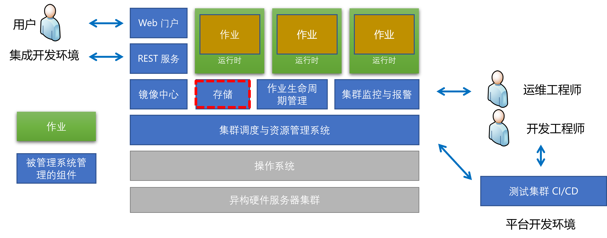
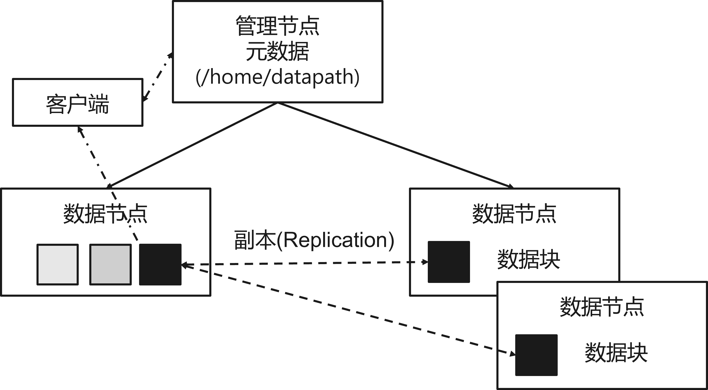
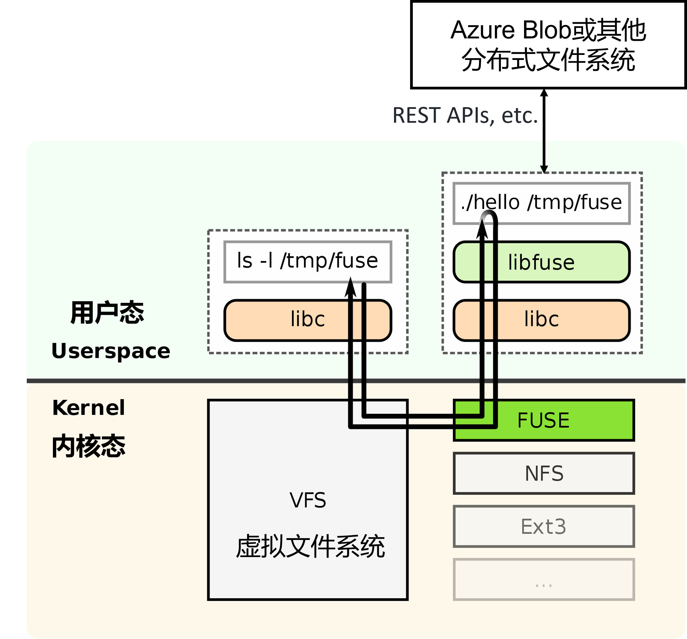
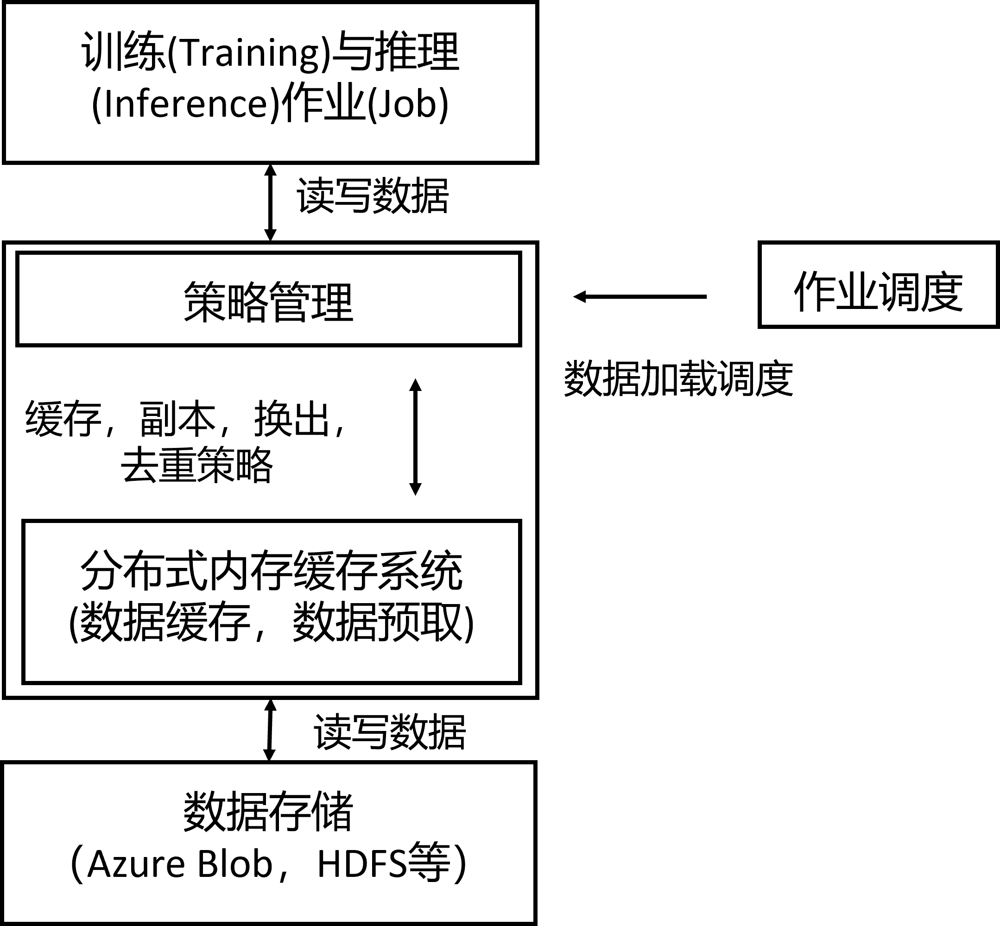
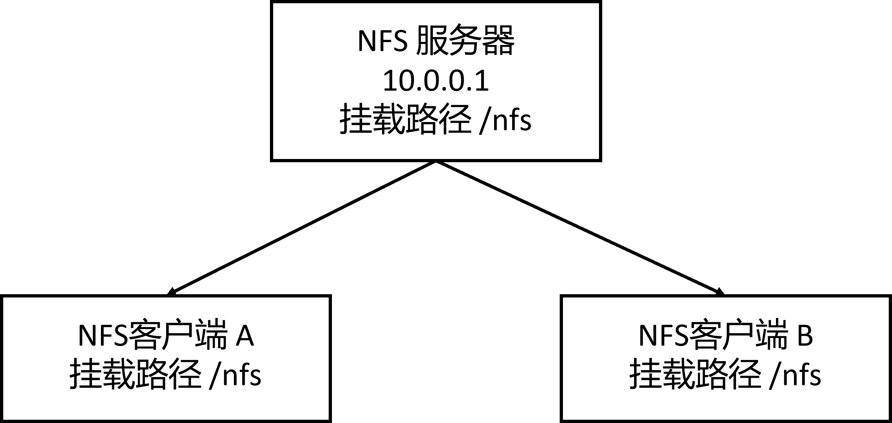
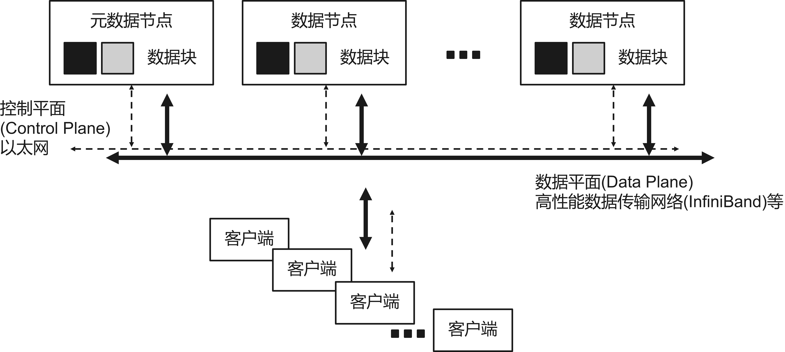
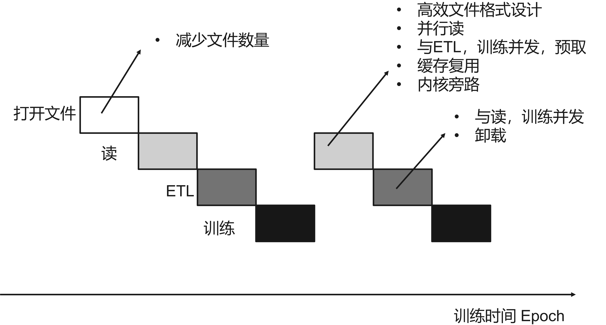
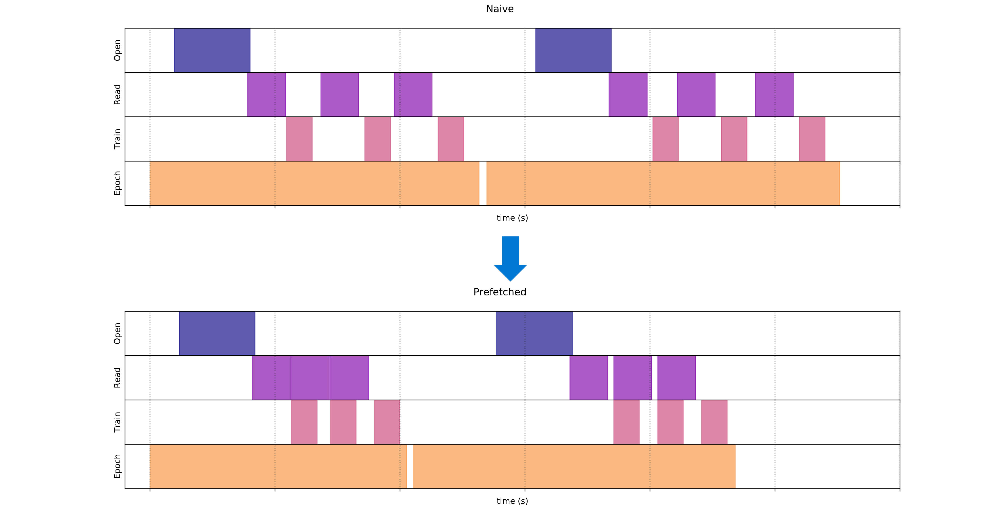
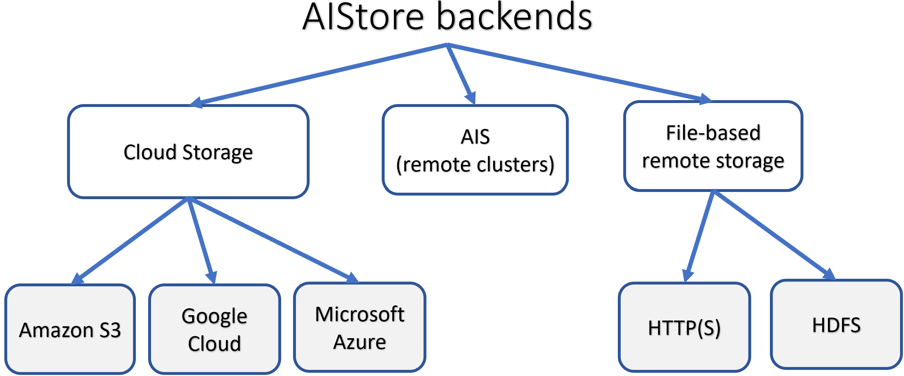
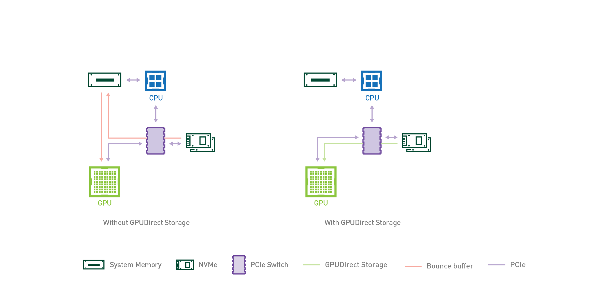

<!--Copyright © Microsoft Corporation. All rights reserved.
  适用于[License](https://github.com/microsoft/AI-System/blob/main/LICENSE)版权许可-->

# 7.5 存储

<center> </center>
<center>图 7.5.1 平台存储 </center>

在之前的章节，我们已经介绍面向深度学习的集群管理系统的运行时与调度。如图 7.5.1，本章将围绕平台中的存储，文件系统来展开。计算，存储与网络是构成平台的重要基本组件，在深度学习系统中，我们常常关注计算与网络，却忽视存储的重要性。本章将围绕平台中的存储内容展开。

- [7.5 存储](#75-存储)
- [7.5.1 沿用大数据平台存储路线](#751-沿用大数据平台存储路线)
- [7.5.2 沿用高性能计算平台存储路线](#752-沿用高性能计算平台存储路线)
- [7.5.3 面向深度学习的存储](#753-面向深度学习的存储)
  - [小结与讨论](#小结与讨论)
  - [参考文献](#参考文献)

# 7.5.1 沿用大数据平台存储路线

当前一部分人工智能平台工程师拥有大数据平台开发背景或平台本身归于或衍生于大数据平台组，所以有些平台文件系统和存储选型时沿用大数据平台的存储策略作为初始的平台存储方案。

- 分布式文件系统: 例如，开源人工智能平台 OpenPAI 中采用 [Hadoop HDFS](https://hadoop.apache.org/hdfs/)[<sup>[1]</sup>](#hdfs) 作为存储方案。HDFS 是一种分布式文件系统，最初是作为 Apache Nutch 网络搜索引擎项目的基础设施而构建的，是广泛用于大数据系统的文件系统。它与已有的分布式文件系统有很多相似之处。HDFS 通过副本机制，具有高度容错性，旨在部署在低成本硬件上。HDFS 提供对应用程序数据的高吞吐量访问，适用于拥有大量数据集的应用程序。HDFS 放宽了一些 POSIX 要求，以支持对文件系统数据的流式访问。HDFS 本身适合顺序读写，不适合随机读写，不建议对小文件访问。其主要为主存和磁盘之间数据读写而设计，没有针对 GPU 显存和主存之间的数据读写进行特定支持和优化，这些劣势会造成深度学习负载下的一些性能问题和瓶颈。
  
<center> </center>
<center>图 7.5.2 Hadoop HDFS 架构和副本机制(<a href="https://hadoop.apache.org/docs/r1.2.1/hdfs_design.html">图片引用 HDFS 文档</a>)</center>

如图所示，像 HDFS 这类分布式文件系统，一般是主（图中 Namenode）- 从（图中 Datanodes）架构，主节点负责整体资源管理，负载均衡，请求调度，从节点负责管理对应服务器的数据管理，服务数据读写请求。其中每个客户端（Client）的文件读写会通过主节点分发到从节点进行数据读写。每个文件会被拆分成数据块（Block），并通过副本（Replication）机制，在多台服务器节点留有冗余备份，当节点失效（Failure），能够恢复。这也是之前第一章介绍的冗余（Redundancy）在系统可靠性（Dependability）设计中的应用。

但是 HDFS 应用到深度学习平台扔存在一些问题需要注意。对深度学习框架来说，原生对大数据存储系统接口支持并不充分，造成有些框架需要自己定义自定义数据读取器，相比大数据框架效率低，实现容易性能差。更通用的场景是用户通过 FUSE 挂载方式将其挂载到节点上使用。以上两种方式都没有像原生大数据框架一样在读取器层就考虑数据局部性（Locality），减少数据搬运开销。同时用户使用习惯不同，使用不当也容易产生小文件读写的性能低下执行行为。从硬件角度，GPU 显存和磁盘间还有一层主存，这部分的缓存处理逻辑也抛给了用户和框架，操作不便且容易造成性能问题。

- 云存储：例如，微软 Azure 云平台中的 Azure Blob[<sup>[2]</sup>](#blob)，亚马逊云平台中的 S3[<sup>[3]</sup>](#s3) 等。对于基础架构部署于公有云平台的公司，云平台提供的文件系统不失为一个较好的选择。通过用户空间文件系统（[Filesystem in Userspace](https://en.wikipedia.org/wiki/Filesystem_in_Userspace)）简称 FUSE 或者 HDFS 兼容的访问接口和协议进行访问。云平台的存储提供冗余备份保证可靠性，并通过数据中心高速网络的支持，提供近似本地存储的高速存储访问带宽。但是其通常为通用场景所设计，其 FUSE 等接口一般定位为通用外围工具而开发设计，没有对深度学习负载和特点提供定制化的优化和支持。

<center> </center>
<center>图 7.5.3 用户空间文件系统（Filesystem in Userspace）访问云端存储（例如，Azure Blob）(<a href="https://en.wikipedia.org/wiki/Filesystem_in_Userspace">图片引用 Wikipedia</a>)</center>

图 7.5.3 描述 FUSE 工作原理，来自用户空间的列出文件的请求 (ls -l /tmp/fuse) 被内核通过虚拟文件系统([Virtual File System](https://en.wikipedia.org/wiki/Virtual_file_system)）简称 VFS 重定向到 FUSE。FUSE 然后执行注册的处理程序（./hello）并将请求传递给它（ls -l /tmp/fuse）。之后通过 REST API 或其他接口调用读写云端存储（例如 Blob Fuse)。处理程序将响应返回给 FUSE，然后将其重定向到最初发出请求的用户空间程序。例如，很多分布式文件系统都提供了 FUSE 功能方便用户使用，我们以 Azure 提供的 [BlobFuse](https://github.com/Azure/azure-storage-fuse) 为例：

用户或平台系统只需要挂载文件系统即可。例如，参考 Azure Blob FUSE 官方实例的步骤: 

```shell
# 1. 安装 blobfuse 后，配置环境变量使用帐户名和密钥进行身份验证：

export AZURE_STORAGE_ACCOUNT=myaccountname
export AZURE_STORAGE_ACCESS_KEY=myaccountkey

# 2. 建议使用高性能磁盘或 ramdisk 作为 BlobFuse 的本地缓存。

mkdir -p /mnt/blobfusetmp
chown <myuser> /mnt/blobfusetmp

# 3. 创建挂载点 
mkdir /path/to/mount 

# 4. 使用 blobfuse 挂载一个 Blob 容器（必须已经创建）：

blobfuse /path/to/mount --container-name=mycontainer --tmp-path=/mnt/blobfusetmp
```
挂载后，用户就可以像访问本地文件目录一样，访问 /path/to/mount 中的数据了。其他分布式文件系统也提供类似的功能供用户进行挂载和使用文件系统。

通过上面的实例我们了解了如何使用一些成熟的文件系统的 FUSE 挂载和使用。

***经典回顾***

用户空间文件系统（[Filesystem in Userspace](https://en.wikipedia.org/wiki/Filesystem_in_Userspace)）简称 FUSE：“用户空间文件系统 (FUSE) 是 Unix 和类 Unix 计算机操作系统的软件接口，允许非特权用户创建自己的文件系统而无需编辑内核代码。这是通过在用户空间中运行文件系统代码来实现的，而 FUSE 模块仅提供到实际内核接口的中继。”目前由于深度学习作业通常使用文件系统接口与数据，模型文件打交道，造成已有一些文件系统需要通过 FUSE 的接口进行兼容和挂载到作业执行的服务器的文件系统内，让用户透明访问和读写数据。

微内核（[Microkernel](https://en.wikipedia.org/wiki/Microkernel)）：内核功能可以在用户级组件中实现，例如，通过[微内核化（Microkernelification）的 FUSE 文件系统](https://www.usenix.org/system/files/conference/hotcloud18/hotcloud18-paper-williams.pdf)，所以我们可以看到借助于微内核设计，文件系统可以非常方便的引入创新，扩展文件系统到各种新的外部存储系统（例如，访问 Hadoop HDFS，访问 Azure Blob 等），让系统设计可以不断的迭代而不需要重新构建和部署操作系统内核。

那么通过如下实例，读者可以使用 libfuse 实现自定义的 FUSE 文件系统，读者可以参考和扩展实现供深度学习作业使用的 FUSE 文件系统。本实例参考自 FUSE 的 [Python 接口实例](https://pytorch.org/docs/stable/generated/torch.add.html)。

```python
import os
import sys
# ... 
from argparse import ArgumentParser
import stat
import logging
import errno
import pyfuse3
import trio
# ...

class TestFs(pyfuse3.Operations):
    def __init__(self):
        super(TestFs, self).__init__()
        self.hello_name = b"message"
        # 用户可以选择挂载自定义的文件元数据信息
        self.hello_inode = pyfuse3.ROOT_INODE+1
        # 此处用户可以自定义访问其他文件系统或者自己实现文件系统。例如，为了加速当前的训练，读者可以访问 Alluxio 等文件系统或自定义高效的 NVM 等存储访问进行加速。
        self.hello_data = b"hello world\n"

    # ...

    # 读取数据 
    async def read(self, fh, off, size):
        # 模拟验证 inode 信息
        assert fh == self.hello_inode
        # 返回结果，用户可以读取自定义配置的路径或者存储的数据予以返回，而用户还是根据通用文件系统接口获取的数据，没有感知底层的变化
        return self.hello_data[off:off+size]

    # ... 

def parse_args():
    '''Parse command line'''

    parser = ArgumentParser()
    # 配置挂载点
    parser.add_argument('mountpoint', type=str,
                        help='Where to mount the file system')
    # ...
    return parser.parse_args()


def main():
    options = parse_args()
    # ...
    testfs = TestFs()
    fuse_options = set(pyfuse3.default_options)
    fuse_options.add('fsname=hello')
    # ... 
    # 初始化调用
    pyfuse3.init(testfs, options.mountpoint, fuse_options)

    try:
        # 通过并行异步 I/O 库 trio 启动
        trio.run(pyfuse3.main)
    except:
        pyfuse3.close(unmount=False)
        raise

    pyfuse3.close()


if __name__ == '__main__':
    main()
```


- 分布式内存文件系统：由于磁盘到 GPU 内存之间还需要通过主存进行数据中转，所以对主存提供一定的管理和缓存也是加速深度学习训练数据读取部分有效的方式。[Alluxio](https://www.alluxio.io/)[<sup>[4]</sup>](#alluxio)是基于内存的分布式存储，可以充当分布式缓存服务。业界也有一些平台公司通过 Alluxio 管理分布式主存，并配合网络文件系统或分布式文件系统提供数据缓存和备份功能。由于存储层级上，GPU 显存和主存最为接近，提供主存层的缓存可以大幅加速 I/O。但同时我们也应该看到，平台方也需要注意持久化的支持和策略设计。

如图 7.5.4 所示，Alluxio 不是简单的将整个数据集复制到每台机器中，而是实现了共享的分布式缓存服务，其中数据可以均匀地分布在集群中。这可以大大提高存储利用率，尤其是当训练数据集远大于单个节点的存储容量时。同时也可以基于 Alluxio 在单机存储中设计和达到重复数据删除(<a href="https://en.wikipedia.org/wiki/Data_deduplication">Data  Deduplication</a>)效果。

<center> </center>
<center>图 7.5.4 通过分布式内存缓存数据，构建与其他分布式文件系统的混合存储方案 (<a href="https://www.alluxio.io/blog/machine-learning-training-with-alluxio-solution-overview/">图片来源 Alluxio 文档</a>)</center>

如图，业界有团队（例如，微软 Bing，Bilibili 等）使用 Alluxio 加速大规模机器学习和深度学习训练或离线（Offline）推理（Inference）任务。通过部署 Alluxio，他们能够加快推理工作，减少 I/O 停顿，并将性能提高。如图所示，Alluxio 作为分布式缓存，可以缓存来自不同的存储数据，例如，Azure Blob 文件系统，HDFS 文件系统等。

有时用户可能在想当前的场景下是否需要使用数据缓存，对缓存层的取舍也有相应的理论进行参考。缓存与磁盘成本性能选型经验法则（Rule Of The Thumb）- 五分钟法则 “The Five-Minute Rule”：当进行缓存系统选型，我们常常忽略成本的影响，如果当前不仅考虑性能加速本身，还综合考虑成本等因素，又该如何取舍呢？Jim Gray 和 Franco Putzolu 在 1987 年发表 “[The 5 Minute Rule for Trading Memory for Disk Accesses and The 10 Byte Rule for Trading Memory for CPU Time](https://www.hpl.hp.com/techreports/tandem/TR-86.1.pdf)”[<sup>[5]</sup>](#jim1) ，10 年后 Jim Gray 和 Goetz Graefe 1997 年发表 “[The Five-Minute Rule Ten Years Later, and Other Computer Storage Rules of Thumb](https://dl.acm.org/doi/10.1145/271074.271094)”[<sup>[6]</sup>](#jim2) 在其中论述当考虑成本性能综合因素，什么时候选择使用内存更划算，什么时候适合加磁盘更划算？但是这个原则也适合其他层级的两级存储选型，或者计算和存储权衡（例如，压缩和解压缩数据相比节省的存储空间占用哪个更划算？）。以其 1997 年工作中介绍其主要算方式为：

“对随机访问磁盘页（Randomly Accessed Pages）的场景下，五分钟法则基于权衡内存成本和磁盘的访问成本：缓存页数据在额外的内存可以节省磁盘 I/O。收支平衡（Break-Even）出现在当数据页常驻缓存于内存的成本（$Dollar/Page/Sec$）和磁盘的每秒访问成本（$Dollar/DiskAccess/Sec$）持平。通俗理解就是缓存单位页占用的内存所花的购买所需对应内存的成本，和通过访问磁盘获取这个单位页所需要购买的磁盘的成本持平是存在一个时间间隔，小于这个时间间隔相当于要更多次访问磁盘，花费更多的访问磁盘成本，那么缓存在内存更划算，如果访问间隔高于这个间隔意味着数据不常访问，访问磁盘单页的成本是低于缓存该页的成本。这个达到临界持平的时间间隔计算方式为：

$$
BreakEvenReferenceInterval (seconds) = \frac{PagesPerMBofRAM}{AccessPerSecondPerDisk} \times \frac{PricePerDiskDrive}{PricePerMBofRAM}
$$

- $BreakEvenReferenceInterval$：相同数据页（Page）在工作负载中，间隔多久（也就是 $BreakEvenReferenceInterval$）会被再次访问。公式中计算出的是临界阈值，读者可以根据负载中的统计数值和这个阈值比较，如果低于其阈值，代表访问频繁，单次访问磁盘的成本已经超出内存，用内存缓存更划算。反之理解就是，如果负载访问间隔超出阈值，数据访问不频繁，购买和放在内存中成本高于隔一段时间再次访问磁盘成本，购买内存不如放磁盘划算。

    以另一种更细节方式理解，也就是单位数据页会间隔 $BreakEvenReferenceInterval$ 被再次访问，而 $BreakEvenReferenceInterval$ 间隔内，极限情况（用满磁盘 I/O）下磁盘最多支撑 $BreakEvenReferenceInterval \times AccessPerSecondPerDisk$ 次页访问，且总购置磁盘成本为 $PricePerDiskDrive$，所以对当前页其单页访问成本（也就是用此段时间内磁盘最多支撑的页访问次数切分总成本）为 $Cost_{PageDiskAccess} = \frac{PricePerDiskDrive}{BreakEvenReferenceInterval \times AccessPerSecondPerDisk}$，而单页的内存常驻成本为 $Cost_{Mem} = \frac{PricePerMBofRAM}{PagesPerMBofRAM}$，我们通过 $min(Cost_{Mem}, Cost_{PageDiskAccess} )$ 选择成本最小的方案。

- $PagesPerMBofRAM$：$128 \quad Pages/MB (8KB pages)$ (97 年数值)

- $AccessPerSecondPerDisk$：$64 \quad Access/Sec/Disk$ (97 年数值)

- $PricePerDiskDrive$：$2000 \quad Dollar/Disk (9GB + Controller)$ (97 年数值)

$PricePerDiskDrive$ 可以综合考虑控制器（Controller）等成本，也可以建模进磁盘的寿命衰减等因素。

在 97 年 Jim Gray 等使用以下的数据计算出 $BreakEvenReferenceInterval$ 是 266 秒，接近 5 分钟。”

那么读者可以思考，在你面对的基础架构采购的场景，以上几个数值换算成当前的性能成本数值，在当前人工智能基础架构下是多少的 $BreakEvenReferenceInterval$ ？以及测试你的负载自身的 $BreakEvenReferenceInterval$ 是多少？进而从成本角度思考是否追加更大的内存进行数据缓存加速数据加载。在企业级场景成本是不可忽视的因素，请读者同时对比第 8 章推理芯片章节，TPU 的设计历史中的性能成本考量，打破唯性能论的思考系统设计的方式。

***经典回顾***

[folk](https://man7.org/linux/man-pages/man2/fork.2.html) 系统调用：“通过复制调用进程来创建一个新进程。新进程称为子进程。创建者进程称为父进程。子进程和父进程运行在不同的内存中空间。在 fork() 时，两个内存空间具有相同的内容。fork() 是使用写时复制（Copy on Write）页（Page）实现的，所以它的开销开销较小，只是去内存复制父级的页表，并创建一个新的子进程的任务结构。” folk 正是通过这种缓存和去重的思想，让进程的创建和运行内存消耗大幅减少，设计缓存层也是为了加速作业的依赖以及输入数据的加载。用户提交的作业作为“平台进程”，很多作业非常类似，或有相同的输入数据以及包依赖，是可以复用其他已经运行过的进程已有缓存数据进行去重和缓存加速的，为平台部署相应充当缓存层的文件系统将有利于加速数据读取和进程部署启动。

# 7.5.2 沿用高性能计算平台存储路线

由于深度学习平台本身硬件以 GPU 和 InfiniBand 网卡为核心硬件，其技术栈和高性能计算或超算集群高度相似，所以很自然也有很多平台团队会选择使用高性能计算平台中常用的存储方案沿用到深度学习平台中使用。以下文件系统也是通常可以选用的方案：

- 网络文件系统（Network File System）：简称 NFS[<sup>[7]</sup>](#nfs) 文件系统是由 Sun 公司研发的网络文件系统，其基本原理是将某个设备本地文件系统通过以太网的方式共享给其它计算节点使用。也就是说，计算机节点通过 NFS 存储的数据是通过网络存储在另外一个设备，而不是存储在本地磁盘。其比较适合在平台部署早期数据量不大的阶段提供文件系统支持，方便部署，技术成熟，访问接口优化，挂载到计算节点提供给算法工程师友好的体验。不足是随着数据量的增长，难以支持更大的存储空间和访问吞吐，同时权限管理需要平台层协同设计进行管理。例如，很多团队小规模平台中或者针对特定的租户部署和采用 NFS 作为存储方案。

<center> </center>
<center>图 7.5.5 NFS实例，客户端将NFS挂载到本地/nfs目录(<a href="https://advishnuprasad.com/blog/2016/03/29/setup-nfs-server-and-client-using-ansible/">图片来源</a>)</center>

如图所示，当通挂载（Mount），用户可以在本地服务器通过 NFS 客户端访问存储服务器，进而像使用本地磁盘一样进行数据访问。

- 利用高速网卡等异构硬件的 HPC 文件系统：[Lustre](https://www.lustre.org/)[<sup>[8]</sup>](#lustre)文件系统是高性能计算平台部署最为广泛的商用文件系统。Lustre 是一种并行分布式文件系统，一般用于大规模高性能集群计算场景。Lustre 这个名字是源自 Linux 和集群（Cluster）的组合词。Lustre 原生支持和利用 InfiniBand（IB）高速网卡，可以利用深度学习平台中的 IB 网络，提供更加高效的数据访问。同时支持高性能的 mmap() I/O 调用，容器化的支持与数据隔离，小文件的支持等，一系列的优化使得 Lustre 在人工智能场景也取得了不俗的性能和用户体验。在公有云场景，亚马逊 AWS 也推出了 Amazon FSx 服务，作为一项完全托管的服务，[Amazon FSx](https://docs.aws.amazon.com/fsx/latest/LustreGuide/what-is.html)让用户可以更轻松地将 Lustre 用于存储速度很重要的工作负载。FSx for Lustre 消除了设置和管理 Lustre 文件系统的传统复杂性，使用户能够在几分钟内启动并运行经过测试的高性能文件系统。

<center> </center>
<center>图 7.5.6 Lustre 架构，其使用高速网卡加速数据平面读写(<a href="https://wiki.lustre.org/Introduction_to_Lustre">图片引用 Lustre 文档</a>)</center>

如图所示，我们可以看到 Lustre 通过 InfiniBand 等高速网卡互联元数据（Metadata）服务器和对象存储（Object Storage）服务器，并能够提供高达 1~100000+ 的客户端访问量支持。


# 7.5.3 面向深度学习的存储

首先我们通过一个 PyTorch 实例分析，深度学习作业是如何读取数据以及和文件系统打交道的。[本实例抽象参考来源](https://github.com/pytorch/examples/blob/main/mnist/main.py)[<sup>[9]</sup>](#pytorchmnist)。

```python
def train(args, model, device, train_loader, optimizer, epoch):
    ...
    # （3）每次从数据加载器读取一个批次的样本
    for batch_idx, (data, target) in enumerate(train_loader):
        # （4）如果当前 device 是 GPU，下面代码将样本由主存传输到 GPU 显存
        data, target = data.to(device), target.to(device)
        ...
        # （5）模型处理输入数据进行前向传播计算
        output = model(data)
        # 训练部分代码
        ...  

def main():
    ... 
    # （1）从 ../data 文件夹读取, /data 可能是存在共享的文件系统，通过 fuse 挂载到本地，也可能是本地文件夹存储下载到本地磁盘的数据
    dataset1 = datasets.MNIST('../data', train=True,            download=True, transform=transform)
    dataset2 = datasets.MNIST('../data', train=False,
                       transform=transform)
    # （2）框架本身提供的数据加载器，一般可以支持并行读取等优化
    train_loader = torch.utils.data.DataLoader(dataset1,**train_kwargs)
    test_loader = torch.utils.data.DataLoader(dataset2, **test_kwargs)
    ... 
    for epoch in range(1, args.epochs + 1):
        train(args, model, device, train_loader, optimizer, epoch)
        test(model, device, test_loader)
    ... 
```

我们可以观察到：
- 深度学习场景下，首先从硬件来说，内存层级以 GPU 显存为传统主存的地位，硬盘和 GPU 显存之间还有主存中转数据，与 GPU 显存最近的存储并不是像之前和主存交互的块存储设备。
- 从深度学习作业访存特点是，迭代式执行不断读取一个批次（Batch）的数据，并且访存模式受每轮数据随机洗牌（Shuffle）的影响是随机读取。
- 从数据结构来看，数据大部分场景下为统一格式规整的张量。同时每次读取的数据并没有像数据库或者大数据系统的针对特定列的过滤机会。
- 从用户侧用户体验与开发水平的现状出发，用户也更倾向于使用单机文件系统一样通过 FUSE 方式进行数据访问。


**深度学习 I/O 阶段量化预估分析**：

我们可以通过如下数据读取预估练习与思考实例，思考和启发读者关于针对深度学习存储的潜在影响因素和优化动机：

```python
# (1) 基准预估读 batchsize = 1024 个样本需要多久
# seconds_per_seek: 从开始读取到读到第一个字节的寻找时间
# per_sample_size: 每个训练样本的大小，单位为字节
# bus_bandwidth: 磁盘或者网络存储等读带宽
1024 * seconds_per_seek + 1024 * per_sample_size / bus_bandwidth = per_batch_read_time

# (2) 如果我们将 1024 个样本变成一批次进行读取需要多久?
1 * seconds_per_seek + 1024 * per_sample_size / bus_bandwidth = per_batch_read_time

# 当前实例启发我们通过 (2.1）内存数据打包为一个张量和批处理进行性能提升 (2.2）设计高效的文件格式减少小文件随机读写问题

# (3) 如果我们并行使用32个线程进行读取需要多久?
1 * seconds_per_seek + (1024 / 32) * per_sample_size / bus_bandwidth = per_batch_read_time

# 当前预估启发我们思考并行的数据加载器设计

# (4) 如果我们有主存缓存需要读多久？假设PCIe带宽为磁盘或者云存储带宽的K倍。
pcie_bandwidth = bus_bandwidth / k
1 * seconds_per_seek + (1024 / 32) * per_sample_size / pcie_bandwidth = per_batch_read_time

# 当前预估启发我们思考利用主存作为磁盘缓存尽可能将数据放在内存预取以及流水线机制进行性能优化

# (5) 如果我们知道需要读取的数据位置，访问主存的缓存失效率（Cache Miss Rate）为P，那么当前的读取时间是多少？

P * (1 * seconds_per_seek + (1024 / 32) * per_sample_size / pcie_bandwidth) + (1 - P) * (1 (seek) * seconds_per_seek + (1024 / 32) * per_sample_size / bus_bandwidth) = per_batch_read_time

# 当前预估启发我们思考利用深度学习作业访存局部性进行性能优化

# (6) 其他潜在优化

# (6.1) per_sample_size部分，读者可以思考是否可以通过压缩，量化等技术降低数据大小进而提升？

# (6.2) seconds_per_seek部分，由于磁盘对顺序读取和随机读取性能不同，读者可以思考是否有更好的文件格式设计最大化顺序读最小化随机读？ 

```
以上的特点造成看似对存储优化机会不像传统的数据库或者大数据系统机会多，但是如果不根据深度学习作业特点设计面向深度学习作业的存储，也会造成和产生系统瓶颈。

**深度学习 I/O 阶段经验分析**

关于在深度学习作业中 I/O 部分影响的经验分析和实验能反映真实作业中的实际性能影响。Jayashree Mohan 等在 VLDB '21 的工作“[Analyzing and Mitigating Data Stalls in DNN Training](https://vldb.org/pvldb/vol14/p771-mohan.pdf)”[<sup>[10]</sup>](#datastall)中经验分析和介绍了关于深度学习作业数据 I/O 部分影响和迁移方法。其有几个经验性发现对后续的数据读取器设计和面向深度学习的文件系统设计有参考意义。
（1）由于抖动，操作系统页面缓存对于 DNN 训练效率低下。
（2）DNN 需要每个 GPU 3 到 24 个 CPU 内核来处理数据预处理。
（3）DNN 将高达 65% 的 epoch 时间用于数据预处理，主要是冗余解码数据。
（4）本地缓存之间缺乏协调导致跨服务器的分布式训练有冗余 I/O。
（5）超参数搜索工作负载执行产生冗余 I/O 和数据准备处理。
同时，由于 PyTorch Dataloader 等工作底层使用 mmap 系统调用进行数据读取，在 CIDR '22 中的工作“[Are You Sure You Want to Use MMAP in Your Database Management System?](https://db.cs.cmu.edu/mmap-cidr2022/)”[<sup>[11]</sup>](#mmap)对 mmap 系统调用在数据库领域使用的缺陷进行了经验分析，同样对深度学习领域对优化数据读取器有借鉴意义。

经过上面的量化分析与经验分析，读者可以朝着以下几个方向，并利用已有成熟的文件系统设计思想，与数据加载器（Data Loader）和底层硬件协同设计（Co-design）出面向深度学习的高效率块存储 I/O 技术栈，一站式加速深度学习作业的数据加载：

<center> </center>
<center>图 7.5.7 深度学习 I/O 时序图与优化策略总览</center>

图 7.5.7 描述了深度学习作业数据读取阶段的拆分，我们从不同阶段中可以分析潜在的优化点并总结如下：

- 高效文件格式（Layout）的设计：一般文件格式有几点设计思路（1）合并为大文件，减少文件数量，减少文件打开开销。（2）减少随机读写转为顺序读写。（3）高效的格式和序列化库，降低序列化与反序列化开销。例如，[TFRecord](https://www.tensorflow.org/tutorials/load_data/tfrecord)等针对深度学习负载设计的文件格式，将原来多张图片（每个都是一个文件），序列化为一个二进制文件。
- 并发执行（Concurrent Execution）和并行（Parallel）加载：I/O 和计算形成流水线协同配合，减少 I/O 成为瓶颈的几率，同时利用多核进行并行加载。如图所示，未经优化的数据加载流程，一个训练迭代含有三个阶段：文件打开（Open），迭代每个批次读取（Read）数据和训练（Train）。框架原生支持跨多种数据源并能异步与并行数据加载的高性能数据加载器模块，例如，并发执行的[TensorFlow Data API](https://www.tensorflow.org/guide/data_performance)，[tf.data](https://dl.acm.org/doi/abs/10.14778/3476311.3476374)。并行执行的PyTorch 数据加载器（Dataloader）。

<center> </center>
<center>图 7.5.8 预取优化的数据读取时序图（<a href="https://www.tensorflow.org/guide/data_performance">图片引用 TensorFlow 文档</a>）</center>

- 统一文件系统接口（Unified File System API）与多数据源管理：对用户透明，保持兼容性（例如，POSIX 标准，NFS 标准，HDFS 接口兼容），统一管理多级，多数据源异构存储。
  - [NVIDIA AIStore](https://github.com/NVIDIA/aistore)[<sup>[12]</sup>](#aistore)：AIStore（简称AIS）是一个为人工智能负载设计的轻量级存储堆栈。减少内核态切换与 CPU 中断，减少内核与用户态内存拷贝。可以部署为远程存储的基于 LRU 的快速缓存。可以按需填充预取和下载 API，适用于集群内大量用户可能会重复使用数据集的场景。自动重新平衡集群（通过类 Map Reduce 扩展），在集群成员、驱动器故障和附件、存储桶重命名发生任何变化时自动触发，因为用户不断产生新数据与模型，删除旧模型，容易造成文件系统容易变得不平衡。支持关联处理（Associative Processing），用户的 ETL 可以就近数据处理，数据中心流行计算存储分离，ETL 通过关联处理可以减少 I/O 数据搬运。工程上，兼容支持按需挂载多种云存储，Kubernetes 部署，数据保护，纠删码，高可用等分布式文件系统功能。
  
<center> </center>
<center>图 7.5.9 AIStore 支持挂载多种存储，统一管理(<a href="https://github.com/NVIDIA/aistore">图片引用 NVIDIA AIStore 文档</a>)</center>

- 可扩展性：当前云原生的趋势，让文件系统也逐渐朝着按需付费，弹性扩展发展。并且很多逐渐呈现“中间件”性质的文件系统，架设在基础文件系统之上，提供缓存，版本管理，事务与原子性，弹性等特性的支持，例如，[JuiceFS](https://juicefs.com/)。
  
- 局部性（Locality）：（1）已知访问顺序（时间局部性）的情况下的预取（Prefetch）策略的支持。例如，虽然深度学习数据读取为随机读取样本，但是一定程度上如果随机数生成如果不依赖当前 Epoch，可以考虑提前生成随机序列并由守护线程进行数据提前加载与准备。（2）利用数据中心主存不断增长的趋势，在主存或挂载高速二级存储（NVM 等）做好数据缓存和备份，并由分布式缓存文件系统纳入统一管理。例如，业界有公司利用 Alluxio 提供缓存功能。
  
- 内核旁路（Kernel Bypassing）：
  - [GPUDirect存储器](https://developer.nvidia.com/zh-cn/blog/gpudirect-storage/)：底层利用 RMDA 直接访问，RDMA 支持零拷贝，内核旁路（用户态 I/O）进而大幅提高 I/O 效率，直接访问远端高速存储（例如，NVMe），在网络和块存储 I/O 上协同优化。其避免了通过主存中的缓冲区的额外拷贝，并使网卡存储器附近的直接内存访问（DMA）引擎能够在直接路径上将数据移入或移出  GPU 内存，且这些操作不会给 CPU（不干扰 DMA）或 GPU（不干扰 GPU DMA）带来负担。
  
<center> </center>
<center>图 7.5.10 GPUDirect 存储器（<a href="https://developer.nvidia.com/zh-cn/blog/gpudirect-storage/">图片引用 NVIDIA GPUDirect 文档</a>）</center>

- 卸载（Offloading）：可以将一定的数据压缩解压缩，反序列化，甚至一定的数据预处理等计算卸载到协处理器。
  - 数据抽取，转换与加载（ETL）卸载到 GPU:（[DALI](https://docs.nvidia.com/deeplearning/dali/user-guide/docs/)） 提供了一组高度优化的构建块，用于加载和处理图像、视频和音频数据。DALI 通过将数据预处理卸载到 GPU 来解决 CPU 瓶颈问题。此外，DALI 利用预取、并行执行和批处理等功能为用户透明地加速处理数据。NVIDIA 还通过 [NVTabular 加速推荐引擎 ETL](https://resources.nvidia.com/en-us-merlin/accelerating-recsys-etl-blog?lx=97GH0Q)。
  - DMA 卸载：例如，GPUDirect 卸载 DMA 处理到 NIC 或 NVMe 内的 DMA 处理，减轻 CPU，GPU DMA 负担。
- 数据与模型隐私保护：本章暂不介绍数据和模型的隐私保护，读者可以参考第 13 章内容。

其他例如权限管理等和传统文件系统区别不太，读者可以参考传统文件系统设计进行借鉴。
  
## 小结与讨论

本章我们主要介绍异构计算集群管理系统的中的存储，我们在深度学习系统中往往开始关注计算和网络较多，但随着时间的推移会意识到存储的重要性和相应的问题。

请读者思考，当前是否有必要设计一款针对深度学习场景的文件系统？

## 参考文献

<div id="hdfs"></div>

1.   [HDFS Architecture Guide](https://hadoop.apache.org/docs/r1.2.1/hdfs_design.html)

<div id="blob"></div>

2.   [Brad Calder, et al. 2011. Windows Azure Storage: a highly available cloud storage service with strong consistency. In Proceedings of the Twenty-Third ACM Symposium on Operating Systems Principles (SOSP '11). Association for Computing Machinery, New York, NY, USA, 143–157.](https://dl.acm.org/doi/10.1145/2043556.2043571)

<div id="s3"></div>

3.   [Amazon S3: Object storage built to retrieve any amount of data from anywhere](https://aws.amazon.com/s3/)

<div id="alluxio"></div>

4.   [Alluxio - Data Orchestration for the Cloud](https://www.alluxio.io/)

<div id="jim1"></div>

5.   [Jim Gray and Franco Putzolu. 1987. The 5 minute rule for trading memory for disc accesses and the 10 byte rule for trading memory for CPU time. SIGMOD Rec. 16, 3 (Dec. 1987), 395–398. https://doi.org/10.1145/38714.38755](https://dl.acm.org/doi/10.1145/38714.38755)

<div id="jim2"></div>

6.   [Jim Gray and Goetz Graefe. 1997. The five-minute rule ten years later, and other computer storage rules of thumb. SIGMOD Rec. 26, 4 (Dec. 1997), 63–68. https://doi.org/10.1145/271074.271094](https://dl.acm.org/doi/10.1145/271074.271094)

<div id="nfs"></div>

7.   [R. Sandberg, D. Golgberg, S. Kleiman, D. Walsh, and B. Lyon. 1988. Design and implementation of the Sun network filesystem. Innovations in Internetworking. Artech House, Inc., USA, 379–390.](https://dl.acm.org/doi/10.5555/59309.59338)

<div id="lustre"></div>

8.   [“Lustre : A Scalable , High-Performance File System Cluster.” (2003).](https://cse.buffalo.edu/faculty/tkosar/cse710/papers/lustre-whitepaper.pdf)

<div id="pytorchmnist"></div>

9.   [https://github.com/pytorch/examples/blob/main/mnist/main.py](https://github.com/pytorch/examples/blob/main/mnist/main.py)

<div id="datastall"></div>

10.   [Jayashree Mohan, Amar Phanishayee, Ashish Raniwala, and Vijay Chidambaram. 2021. Analyzing and mitigating data stalls in DNN training. Proc. VLDB Endow. 14, 5 (January 2021), 771–784.](http://vldb.org/pvldb/vol14/p771-mohan.pdf)

<div id="mmap"></div>

11.   [Crotty, Andrew and Leis, Viktor and Pavlo, Andrew. Are You Sure You Want to Use MMAP in Your Database Management System? {CIDR} 2022, Conference on Innovative Data Systems Research](https://db.cs.cmu.edu/mmap-cidr2022/#:~:text=MMAP%27s%20perceived%20ease%20of,that%20are%20not%20immediately%20apparent.)

<div id="aistore"></div>

12.    [https://github.com/NVIDIA/aistore](https://github.com/NVIDIA/aistore)
