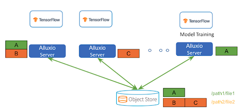
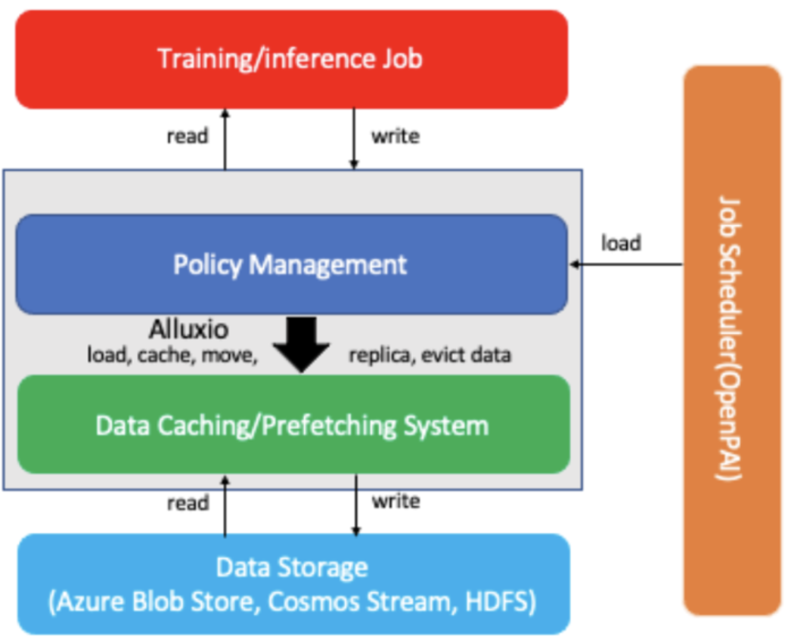

<!--Copyright © Microsoft Corporation. All rights reserved.
  适用于[License](https://github.com/microsoft/AI-System/blob/main/LICENSE)版权许可-->

# 7.5 存储

在之前的章节，我们已经介绍面向深度学习的集群管理系统的运行时与调度。本章将围绕平台中的存储，文件系统来展开。计算，存储与网络是构成平台的基本组件，在深度学习系统中，我们常常关注计算与网络，却忽视存储的重要性。本章将围绕平台中的存储内容展开。

- [7.5 存储](#75-存储)
- [7.5.1 沿用大数据平台存储路线](#751-沿用大数据平台存储路线)
- [7.5.2 沿用高性能计算平台存储路线](#752-沿用高性能计算平台存储路线)
- [7.5.3 面向深度学习的存储](#753-面向深度学习的存储)
  - [小节与讨论](#小节与讨论)
  - [参考文献](#参考文献)

# 7.5.1 沿用大数据平台存储路线

当前一部分人工智能平台工程师拥有大数据平台开发背景或衍生于大数据平台组，所以有些平台沿用大数据平台的存储策略作为初始的平台存储方案。

- Hadoop分布式文件系统 ([HDFS](https://hadoop.apache.org/hdfs/。)) 是一种分布式文件系统，最初是作为 Apache Nutch 网络搜索引擎项目的基础设施而构建的，是广泛用于大数据系统的文件系统。它与已有的分布式文件系统有很多相似之处。HDFS 具有高度容错性，旨在部署在低成本硬件上。HDFS 提供对应用程序数据的高吞吐量访问，适用于拥有大量数据集的应用程序。HDFS 放宽了一些 POSIX 要求，以支持对文件系统数据的流式访问。HDFS本身适合顺序读写，不适合随机读写，不建议对小文件访问，主要为主存访问磁盘而设计，没有针对GPU显存和主存之间的数据读写进行特定支持和优化，这些劣势会造成深度学习负载下的一些性能问题和瓶颈。例如，开源人工智能平台OpenPAI中采用HDFS作为存储方案。

<center> </center>
<center>图7-5-1. Hadoop HDFS架构和副本机制(<a href="https://hadoop.apache.org/docs/r1.2.1/hdfs_design.html">图片来源</a>)</center>
如图所示，像HDFS这类分布式文件系统，一般通过主（图中Namenode）- 从（图中Datanodes）架构，主节点负责整体资源管理，负载均衡，请求调度，从节点负责管理对应服务器的数据管理。其中每个客户端(Client)的文件读写会通过主节点分发到从节点进行数据读写。每个文件会被拆分成数据块(Block)，并通过副本(Replication)机制，在多态节点留有冗余备份，当节点失效(Failure)，能够恢复。这也是之前第一章介绍的冗余(Redundancy)在系统可靠性(Dependability)设计中的应用。

- 云平台存储，例如，微软Azure云平台中的Azure Blob，亚马逊云平台中的S3等。对于基础架构部署于公有云平台的公司，云平台提供的文件系统不失为一个较好的选择，并通过用户空间文件系统（[Filesystem in Userspace](https://en.wikipedia.org/wiki/Filesystem_in_Userspace)）简称FUSE或者HDFS兼容的访问接口和协议进行访问。云平台的存储提供冗余备份保证可靠性，并通过数据中心高速网络的支持，提供近似本地存储的高速存储访问带宽。但是其通常为通用场景所设计，其FUSE等接口一般为外围工具而开发设计，没有对深度学习负载和特点提供定制化的优化和支持。

<center> </center>
<center>图7-5-2. 用户空间文件系统（Filesystem in Userspace）(<a href="https://en.wikipedia.org/wiki/Filesystem_in_Userspace">图片来源</a>)</center>

上图显示FUSE工作原理的流程图：来自用户空间的列出文件的请求 (ls -l /tmp/fuse) 被内核通过虚拟文件系统([Virtual File System](https://en.wikipedia.org/wiki/Virtual_file_system)
)简称VFS重定向到FUSE。FUSE 然后执行注册的处理程序（./hello）并将请求传递给它（ls -l /tmp/fuse）。处理程序将响应返回给 FUSE，然后将其重定向到最初发出请求的用户空间程序。例如，很多分布式文件系统都提供了FUSE功能方便用户使用，我们以Azure提供的[BlobFuse](https://github.com/Azure/azure-storage-fuse)为例：

用户或平台系统只需要挂载文件系统即可。例如，参考官方实例的步骤: 

```shell
# 1. 安装blobfuse后，配置环境变量使用帐户名和密钥进行身份验证：

export AZURE_STORAGE_ACCOUNT=myaccountname
export AZURE_STORAGE_ACCESS_KEY=myaccountkey

# 2. 建议使用高性能磁盘或ramdisk作为BlobFuse的本地缓存。

mkdir -p /mnt/blobfusetmp
chown <myuser> /mnt/blobfusetmp

# 3. 创建挂载点 
mkdir /path/to/mount 

# 4. 使用blobfuse挂载一个Blob容器（必须已经创建）：

blobfuse /path/to/mount --container-name=mycontainer --tmp-path=/mnt/blobfusetmp
```
挂载后，用户就可以像访问本地文件目录一样，访问/path/to/mount中的数据了。其他分布式文件系统也提供类似的功能供用户进行挂载和使用文件系统。

- [Alluxio](https://www.alluxio.io/)基于内存的存储，可以充当分布式缓存服务。业界也有一些平台公司通过Alluxio管理分布式主存并提供数据缓存和备份功能。由于GPU显存和主存最为接近，提供主存层的缓存可以大幅加速I/O。但同时我们也应该看到，平台方也需要注意持久化的支持和设计。

<center> </center>
<center>图7-5-3. Alluxio可以作为分布式缓存(<a href="https://www.alluxio.io/blog/machine-learning-training-with-alluxio-solution-overview/">图片来源</a>)</center>

如图所示，Alluxio不是将整个数据集复制到每台机器中，而是实现了共享的分布式缓存服务，其中数据可以均匀地分布在集群中。这可以大大提高存储利用率，尤其是当训练数据集远大于单个节点的存储容量时。同时也可以基于Alluxio在单机存储中设计和达到重复数据删除(<a href="https://en.wikipedia.org/wiki/Data_deduplication">Data  Deduplication</a>)效果。

<center> </center>
<center>图7-5-4. Alluxio与其他分布式文件系统的混合存储方案 (<a href="https://www.alluxio.io/blog/machine-learning-training-with-alluxio-solution-overview/">图片来源</a>)</center>

如图，业界有团队（例如，微软Bing等）使用 Alluxio 加速大规模机器学习和深度学习离线(Offline)推理(Inference)任务。通过部署Alluxio，他们能够加快推理工作，减少I/O停顿，并将性能提高。如图所示，Alluxio作为分布式缓存，可以缓存来自不同的存储数据，例如，Azure Blob文件系统，HDFS文件系统等。


# 7.5.2 沿用高性能计算平台存储路线

由于深度学习平台本身硬件以GPU和InfiniBand网卡为核心硬件，其技术栈和高性能计算或超算集群高度相似，所以很自然也有很多平台团队会选择使用高性能计算平台中常用的存储方案沿用到深度学习平台中使用。以下文件系统也是通常可以选用的方案：

- 网络文件系统(Network File System )简称NFS文件系统是由Sun公司研发的网络文件系统，其基本原理是将某个设备本地文件系统通过以太网的方式共享给其它计算节点使用。也就是说，计算机节点通过NFS存储的数据是通过网络存储在另外一个设备，而不是存储在本地磁盘。其比较适合在平台部署早期提供文件系统支持，方便部署，技术成熟，访问接口优化，挂载到计算节点提供给算法工程师友好的体验。不足是随着数据量的增长，难以支持更大规模的空间和访问吞吐，同时权限管理需要平台层协同设计进行管理。例如，很多团队小规模平台中或者针对特定的租户部署和采用NFS 作为存储方案。
<center> </center>
<center>图7-5-5. NFS实例，客户端将NFS挂载到本地/nfs目录(<a href="https://advishnuprasad.com/blog/2016/03/29/setup-nfs-server-and-client-using-ansible/">图片来源</a>)</center>
如图所示，当通挂载(Mount)，用户可以在本地服务器通过NFS客户端访问存储服务器，进而像使用本地磁盘一样进行数据访问。

- [Lustre](https://www.lustre.org/)文件系统是高性能计算平台部署最为广泛的商用文件系统。Lustre 是一种并行分布式文件系统，一般用于大规模集群计算。 Lustre 这个名字是源自Linux 和集群的组合词。自 2005 年 6 月以来，Lustre 一直被前十名中的至少一半、世界上最快的 100 台超级计算机中的 60 多台使用。Lustre原生支持和利用InfiniBand高速网卡，可以利用深度学习平台中的IB网络，提供更加高效的数据访问。同时支持高性能的mmap() I/O调用，容器化的支持与数据隔离，小文件的支持等，一系列的优化使得Lustre在人工智能场景也取得了不俗的性能和用户体验。在公有云场景，亚马逊AWS也推出了Amazon FSx服务，作为一项完全托管的服务，[Amazon FSx](https://docs.aws.amazon.com/fsx/latest/LustreGuide/what-is.html)让用户可以更轻松地将 Lustre 用于存储速度很重要的工作负载。FSx for Lustre 消除了设置和管理 Lustre 文件系统的传统复杂性，使用户能够在几分钟内启动并运行经过测试的高性能文件系统。

<center> </center>
<center>图7-5-6. Lustre文件系统使用高速网卡加速数据读写(<a href="https://wiki.lustre.org/Introduction_to_Lustre">图片来源</a>)</center>

如图所示，我们可以看到Lustre通过InfiniBand等高速网卡互联元数据(Metadata)服务器和对象存储(Object Storage)服务器，并能够提供高达1~100000+的客户端访问量支持。

# 7.5.3 面向深度学习的存储

首先我们通过一个PyTorch实例来看，在深度学习作业中是如何读取数据以及和文件系统打交道的。

```python
# 本实例抽象自https://github.com/pytorch/examples/blob/main/mnist/main.py

def train(args, model, device, train_loader, optimizer, epoch):
    ...
    # 每次从数据加载器读取一个批次的样本
    for batch_idx, (data, target) in enumerate(train_loader):
        # 如果当前device是GPU，下面代码将样本由主存传输到GPU显存
        data, target = data.to(device), target.to(device)
        ...
        output = model(data)
        # 训练部分代码
        ...  

def main():
    ... 
    # 从../data文件夹读取, /data可能是存在共享的文件系统，通过fuse挂载到本地，也可能是本地文件夹存储下载到本地磁盘的数据
    dataset1 = datasets.MNIST('../data', train=True, download=True,
                       transform=transform)
    dataset2 = datasets.MNIST('../data', train=False,
                       transform=transform)
    # 框架本身提供的数据加载器，一般可以支持并行读取等优化
    train_loader = torch.utils.data.DataLoader(dataset1,**train_kwargs)
    test_loader = torch.utils.data.DataLoader(dataset2, **test_kwargs)
    ... 
    for epoch in range(1, args.epochs + 1):
        train(args, model, device, train_loader, optimizer, epoch)
        test(model, device, test_loader)
    ... 
```

通过以上实例我们可以观察到，深度学习场景下，首先从硬件来说，内存层级以GPU显存为传统主存的地位，硬盘和GPU显存之间还有主存中转数据，与GPU显存最近的存储并不是像之前和主存交互的块存储设备。从深度学习作业访存特点是，迭代式执行不断读取一个批次(Batch)的数据，并且访存模式受每轮数据洗牌(Shuffle)的影响是随机读取。从数据结构来看，数据大部分场景下为统一格式规整的张量。同时每次读取的数据并没有像数据库或者大数据系统的针对特定列的过滤需求。从用户侧用户习惯与开发水平的现状触发，用户也更倾向于使用单机文件系统一样通过fuse方式进行数据访问。

**数据读取预估练习与思考**：我们通过如下预估实例，思考和启发读者关于针对深度学习存储的优化：
```python
# 1) 基准预估读batchsize = 1024个样本需要多久
# seconds_per_seek: 从开始读取到读到第一个字节的寻找时间
# per_sample_size: 每个训练样本的大小，单位为字节
# bus_bandwidth: 磁盘或者网络存储等读带宽
1024 (seeks) * seconds_per_seek + 1024 * per_sample_size / bus_bandwidth = per_batch_read_time

# 2) 如果我们将1024个样本变成一批次进行读取需要多久?
1 (seek) * seconds_per_seek + 1024 * per_sample_size / bus_bandwidth = per_batch_read_time

# 当前实例启发我们通过1）内存数据打包为一个张量和批处理进行性能提升 2）设计高效的文件格式减少小文件随机读写问题

# 3) 如果我们并行使用32个线程进行读取需要多久?
1 (seek) * seconds_per_seek + (1024 / 32) * per_sample_size / bus_bandwidth = per_batch_read_time

# 当前预估启发我们思考并行的数据加载器设计

# 4) 如果我们有主存缓存需要读多久？假设PCIe带宽为磁盘或者云存储带宽的K倍。
pcie_bandwidth = bus_bandwidth / k
1 (seek) * seconds_per_seek + (1024 / 32) * per_sample_size / pcie_bandwidth = per_batch_read_time

# 当前预估启发我们思考利用主存作为磁盘缓存尽可能将数据放在内存预取以及流水线机制进行性能优化

# 5) 如果我们知道需要读取的数据位置，访问主存的缓存失效率(cache miss rate)为P，那么当前的读取时间是多少？

P * (1 (seek) * seconds_per_seek + (1024 / 32) * per_sample_size / pcie_bandwidth) + (1 - P) * (1 (seek) * seconds_per_seek + (1024 / 32) * per_sample_size / bus_bandwidth) = per_batch_read_time

# 当前预估启发我们思考利用深度学习作业访存局部性进行性能优化

# 6) 其他潜在优化

6.1) per_sample_size部分，读者可以思考是否可以通过压缩，量化等技术降低数据大小进而提升？
6.2) seconds_per_seek部分，由于磁盘对顺序读取和随机读取性能不同，读者可以思考是否有更好的文件格式设计最大化顺序读最小化随机读？ 

```
以上的特点造成看似对存储优化机会不像传统的数据库或者大数据系统机会多，但是如果不设计好面向深度学习的存储，也会造成和产生系统瓶颈。

所以我们可以朝着以下几个方向，并利用已有成熟的文件系统进行设计。

- 局部性：已知访问顺序的情况下的预取(Prefetch)策略的支持。
- 流水线：和计算形成流水线协同配合，减少I/O成为瓶颈的几率。框架原生支持跨多种数据源并能异步与并行数据加载的高性能数据加载器模块。
- 缓存：利用数据中心主存不断增长的趋势，在主存做好数据缓存和备份，例如，业界有公司利用Alluxio提供缓存功能。
- 文件格式的设计：减少小文件读写与序列化开销，例如，[TFRecord](https://www.tensorflow.org/tutorials/load_data/tfrecord)等针对深度学习负载设计的文件格式。

## 小节与讨论

本章我们主要介绍异构计算集群管理系统的中的存储，计算，存储和网络是基础架构中的核心，我们在深度学习系统中往往开始关注计算较多，但随着时间的推移会意识到存储的重要性和新的问题。

请读者思考，当前是否有必要设计一款针对深度学习场景的文件系统？

## 参考文献
- https://hadoop.apache.org/docs/r1.2.1/hdfs_design.html
- https://www.alluxio.io/
- https://en.wikipedia.org/wiki/Network_File_System
- https://azure.microsoft.com/en-us/services/storage/blobs/
- https://aws.amazon.com/s3/
- https://www.intel.com/content/dam/www/public/us/en/documents/white-papers/lustre-performance-superior-to-hdfs-white-paper.pdf
- https://wiki.lustre.org/Infiniband_Configuration_Howto
- https://www.hpcadvisorycouncil.com/pdf/Lustre_Best_Practice.pdf
- https://www.sc-asia.org/2018/wp-content/uploads/2018/03/1_1700_Carlos-Thomaz.pdf