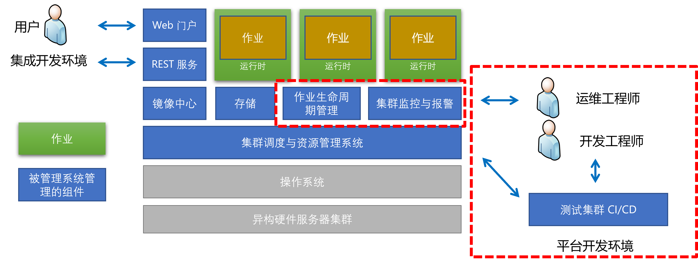
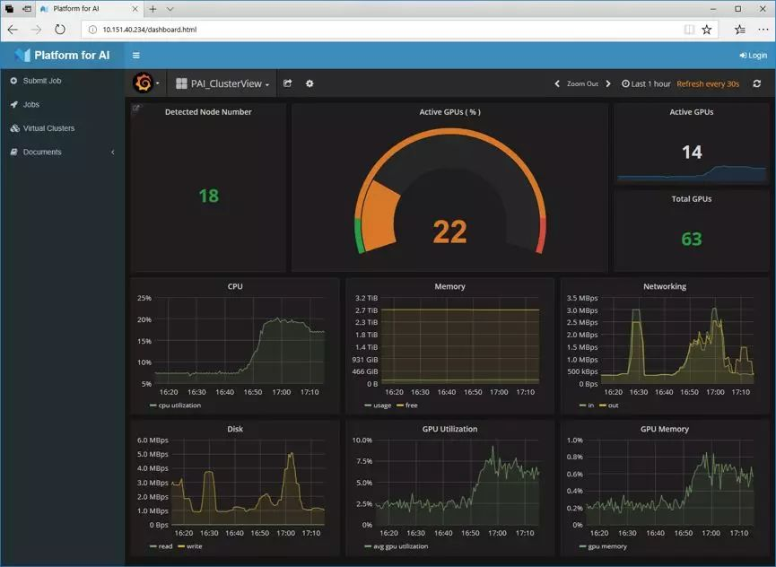
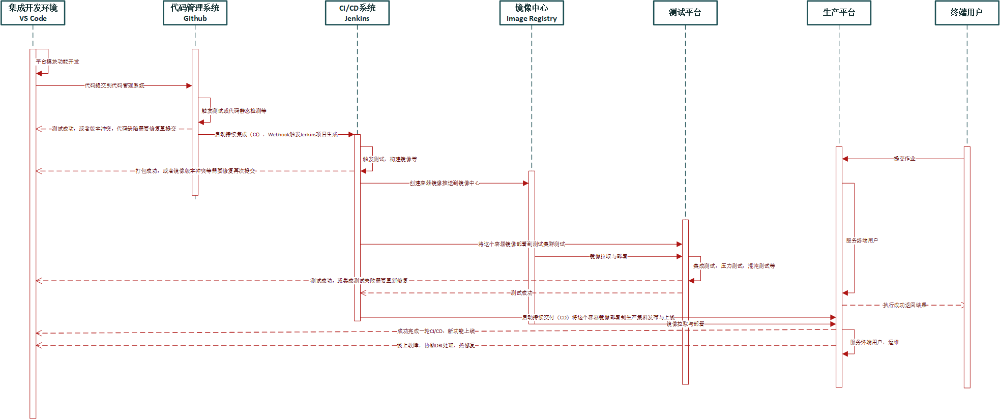
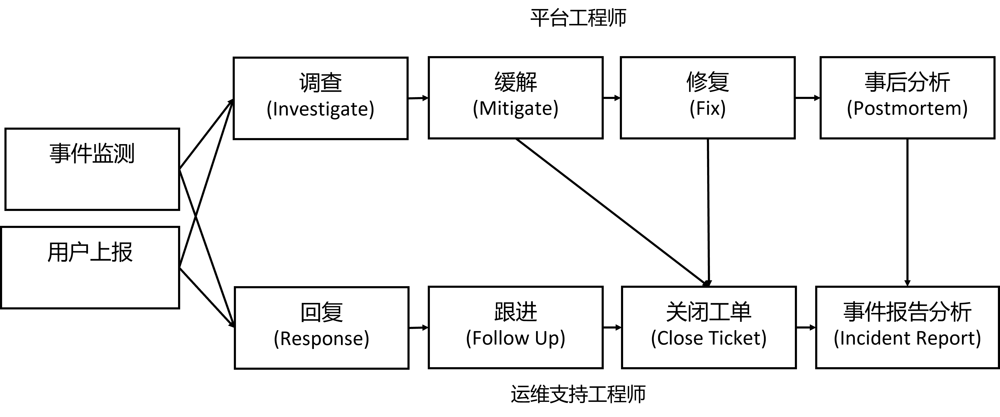

<!--Copyright © Microsoft Corporation. All rights reserved.
  适用于[License](https://github.com/microsoft/AI-System/blob/main/LICENSE)版权许可-->

# 7.6 开发与运维

<center> </center>
<center>图 7.6.1 平台 DevOps </center>

在之前的章节，我们已经介绍面向深度学习的集群管理系统的运行时，调度与存储。如图 7.6.1 所示，本章将围绕工程实践中，关于集群管理系统功能开发，运维的主题进行展开。集群管理系统，也称作平台，是 $7 \times 24$ 小时的对人工智能工程师和研究员提供训练服务的平台，其本身的开发也越来越敏捷，同时也需要有更加及时和高效的运维。

- [7.6 开发与运维](#76-开发与运维)
  - [7.6.1 平台功能模块与敏捷开发](#761-平台功能模块与敏捷开发)
  - [7.6.2 监控体系构建](#762-监控体系构建)
      - [***全局监控***](#全局监控)
      - [***性能监控***](#性能监控)
      - [***服务与硬件稳定性监控***](#服务与硬件稳定性监控)
      - [***报警***](#报警)
  - [7.6.3 测试](#763-测试)
    - [7.6.3.1 单元测试](#7631-单元测试)
    - [7.6.3.2 集成测试](#7632-集成测试)
    - [7.6.3.3 压力测试](#7633-压力测试)
    - [7.6.3.4 回归测试](#7634-回归测试)
    - [7.6.3.5 缺陷注入，模糊测试与混沌工程](#7635-缺陷注入模糊测试与混沌工程)
  - [7.6.4 平台 DevOps](#764-平台-devops)
    - [数据流](#数据流)
  - [7.6.5 平台运维](#765-平台运维)
    - [7.6.5.1 直接责任人（DRI）与候命（On-Call）机制](#7651-直接责任人dri与候命on-call机制)
    - [7.6.5.2 事件管理](#7652-事件管理)
    - [7.6.5.3 智能运维（AIOps）](#7653-智能运维aiops)
  - [小结与讨论](#小结与讨论)
  - [参考文献](#参考文献)
  
## 7.6.1 平台功能模块与敏捷开发

平台本身由于功能众多，部署后持续运行类似在线服务，业界一般通过敏捷开发的模式进行整体的开发与设计。一般平台中涉及以下重要服务和功能模块。

- 内核：调度器，运行时，管理界面，权限管理，文件管理等。
  - 调度器设计可以兼顾深度学习特点，例如，资源局部性。
  - 运行时需要支持特定设备插件，能够将 GPU，InfiniBand 等设备注册进入运行时。
  - 由于深度学习作业主要输入输出为数据和模型，一般可使用文件系统存储即可，需要选用高效（NFS 等）且容错（云存储）的文件系统提供支持。
- 监控与报警：性能监控，异常监控，报警系统等。
  - 除常见需要平台监控的性能指标，还要特别关注 GPU 等核心加速器的资源利用率等指标。
  - 报警系统也要除覆盖常见错误，还需要覆盖新服务与新硬件产生的错误与异常。
- 工具链：IDE，作业提交与调试工具，API（例如：Restful）等。
  - IDE 可以选用对 Python 和深度学习生态支持较好的开发环境。例如，基于浏览器的开发环境（例如，Jupyter）或者插件化支持较好的本地客户端环境 VS Code 等。
  - 作业提交可以通过 Web 人工提交或者 Restful API 方式方便 AutoML 工具自动化提交。
  - 可以考虑支持远程 SSH 方便用户远程登录作业现场调试。
- 应用市场：模型市场，镜像市场等。
  - 由于目前深度学习新的模型很多基于研究工作和开源模型与代码进行微调（Fine Tuning）适配和扩展，模型训练框架主流框架也都是开源的，这就让平台方可以通过提供常用和优化版本的模型与框架镜像市场进而优化，管理和提升开发生产力。

不同的功能模块可以分配不同的工程师进行开发，通过 [Scrum](https://en.wikipedia.org/wiki/Scrum_(software_development)) 敏捷开发，定期规划与执行冲刺（Sprint）计划，并通过每日的会议进行规划反思与推进。

接下来我们分别从各个模块和方向展开介绍。

## 7.6.2 监控体系构建

通过构建完整的指标体系，能够让平台管理员和开发者对平台健康状况和系统负载运行状况一目了然，同时有助于对异常与错误进行诊断与归因分析。围绕异构资源管理系统，可以从以下方面设计指标，进而通过数据驱动的方法提升运维效率。

#### ***全局监控***

可以通过围绕作业，服务，节点几个维度设计需要整体宏观监控的指标，并围绕团队的核心 KPI 设计效率，稳定性等全局指标，方便量化评估与回查。

<center> </center>
<center>图 7.6.2 平台全局监控(<a href="https://github.com/microsoft/pai">图片引用 OpenPAI 文档</a>)</center>

如图所示，平台可以通过全局监控观测硬件资源的利用率，健康状况，也可以拓展到作业，用户等其他指标。通过宏观监控让管理员和运维工程师能观测重要问题，对整体有宏观认识。

#### ***性能监控***

可以围绕作业和硬件的性能进行监控设计，其中硬件的各种指标在作业执行时，通过时间戳的连接（Join）可以推导出作业的性能指标。对深度学习系统，尤其需要关注 GPU 利用率等指标，这可以通过 [NVML](https://developer.nvidia.com/nvidia-management-library-nvml)[<sup>[1]</sup>](#nvml)，[DCGM](https://developer.nvidia.com/dcgm)[<sup>[2]</sup>](#dcgm) 等工具构建指标导出器进行监控与获取。

如下脚本所示，我们可以通过 nvidia-smi 命令获取 GPU 的利用率，显存使用状况，温度和功耗，以及是否有 ECC error 等信息，进而将这些信息暴露给监控系统收集，进而形成对系统性能和健康的持续监控。

```shell
$ nvidia-smi
...
+-----------------------------------------------------------------------------+
| NVIDIA-SMI 455.23.05    Driver Version: 455.23.05    CUDA Version: 11.1     |
|-------------------------------+----------------------+----------------------+
| GPU  Name        Persistence-M| Bus-Id        Disp.A | Volatile Uncorr. ECC |
| Fan  Temp  Perf  Pwr:Usage/Cap|         Memory-Usage | GPU-Util  Compute M. |
|                               |                      |               MIG M. |
|===============================+======================+======================|
|   0  Tesla K80           On   | 00004F2F:00:00.0 Off |                    0 |
| N/A   51C    P0    56W / 149W |   2513MiB / 11441MiB |      0%      Default |
|                               |                      |                  N/A |
+-------------------------------+----------------------+----------------------+
|   1  Tesla K80           On   | 00007C52:00:00.0 Off |                    0 |
| N/A   31C    P8    33W / 149W |      0MiB / 11441MiB |      0%      Default |
|                               |                      |                  N/A |
+-------------------------------+----------------------+----------------------+

```

#### ***服务与硬件稳定性监控***

观测和监控平台的各个模块的健康也非常重要，通过被动汇报或者主动探测的机制，监测服务的存活状况。对硬件可以周期性运行测试，或者通过监控指标的异常进行判断。服务模块在设计之初就需要考虑暴露接口或者心跳机制设计，可以被监控系统更好的遥测。

很多平台和服务提供了服务存活检测的机制，让服务开发者在服务设计之初就考虑好系统健康状况的可观测性。

例如，以 Kubernetes 为例，许多长时间运行的应用程序最终会转变为损坏状态，除非重新启动，否则无法恢复。Kubernetes 提供了存活性（Liveness）探针来检测健康状态。

在以下 Kubernetes 官方提供的实例中，创建一个运行基于 k8s.gcr.io/busybox 映像的容器的 Pod。在容器生命的前 30 秒，有一个 /tmp/healthy 文件。因此，在前 30 秒内，命令 cat /tmp/healthy 返回一个成功代码。30 秒后， cat /tmp/healthy由于执行失败，返回失败代码。此实例可以推广开来，用户可以替换要执行的反映状态的命令，也可以替换不同的监测状态的命令。

下面的 yaml 文件是 Pod 的配置文件（[文件来源 Kubernetes 文档](https://kubernetes.io/docs/tasks/configure-pod-container/configure-liveness-readiness-startup-probes/)）[<sup>[3]</sup>](#liveness)：

```yaml

apiVersion: v1
kind: Pod
metadata:
  labels:
    test: liveness
  name: liveness-exec
spec:
  containers:
  - name: liveness
    image: k8s.gcr.io/busybox
    # 服务启动时执行以下命令
    args: 
    - /bin/sh
    - -c
    - touch /tmp/healthy; sleep 30; rm -rf /tmp/healthy; sleep 600
    livenessProbe:
      exec:
        command:
        - cat
        - /tmp/healthy
      initialDelaySeconds: 5
      periodSeconds: 5
```

***经典回顾***

以上的稳定性监测实例，其实借用的是系统中的心跳机制思路。
[心跳机制（Heartbeat）](https://en.wikipedia.org/wiki/Heartbeat_(computing))：“心跳是由硬件或软件生成的周期性信号，用户证明当前系统正常运行，同时可以通过心跳传递控制平面的信息，如果监测节点定期没有收到或者监测到心跳认为被监测节点或系统出现了故障，需要修复或者使用冗余机器替代。复杂的场景下还可以设计心跳机制的协议。”

#### ***报警***

监控系统可以在节点部署监控脚本（Exporter）以及部署存储监控指标数据的时序数据库（例如，[Prometheus](https://prometheus.io/)[<sup>[4]</sup>](#prometheus)， [Ganglia](http://ganglia.sourceforge.net/)[<sup>[5]</sup>](#ganglia) 等）进行监控数据收集，并通过可视化的系统(例如，[Grafana](https://grafana.com/) [<sup>[6]</sup>](#grafana)等)进行监控报表和可视化的展示。
报警系统（例如，[Alert Manager](https://prometheus.io/docs/alerting/latest/alertmanager/)）[<sup>[7]</sup>](#alert)可以提前规划好报警规则与阈值，不断监控和分析监控系统中的指标是否违规，如果违规及时发送报警信息或者邮件。尤其对用户提交的作业，深度学习作业容易发生 OOM，GPU 容易出现阻塞或者 ECC 错误等问题，对于高频和影响较大的异常需要及时修复与处理。


我们可以通过以下实例具体理解一个报警规则是什么，本实例参考自 [Prometheus Alert Manager 文档](https://prometheus.io/docs/prometheus/latest/configuration/alerting_rules/)[<sup>[7]</sup>](#alert)。作业 myjobid 的 equest_latency_seconds 的指标，进行高请求延迟的报警，其中约定，对中值请求延迟 > 1 秒的任何实例发出警报。

```yml
groups:
- name: example
  rules:
  - alert: HighRequestLatency
    # 关键报警规则
    expr: api_http_request_latencies_second{quantile="0.5"} > 1
    for: 10m
    labels:
      severity: page
    annotations:
      summary: High request latency
```


例如，我们可以设计以下的一些报警规则，并通过系统触发报警让运维人员介入：

1. 负载和性能问题规则：例如，例如磁盘使用率超过一定阈值，网络性能低于一定阈值等
2. 服务健康规则：例如，服务失败报警等
3. 硬件健康规则：例如，节点，GPU 或磁盘出现故障的报警等

<center> </center>

图 7.6.3 监控系统(<a href="https://docs.vmware.com/en/VMware-Tanzu-Kubernetes-Grid/1.5/vmware-tanzu-kubernetes-grid-15/GUID-packages-monitoring.html">图片引用 VMWare 文档[<sup>[8]</sup>](#monitor)</a>)

如图所示，一个完整的监控系统如图所示，节点部署监控脚本（例如 node-exporter）收集各种性能指标和健康指标，监控指标被存储到时序数据库（例如 Prometheus）中，报警管理系统周期性查询时序数据库判断是否触发报警，如果触发可以通知接受者（例如通过邮件），同时可视化报表系统也可以查询数据库绘制可视化仪表盘方便管理员监测当前情况。整体的各个系统组件可以通过集群管理系统（例如，Kuberenetes）进行部署和运维。

在构建报警系统之初，需要决定以怎样的工具或者方式通知到相应的负责人进行响应和处理。目前有以下常见的多渠道通知的方式，他们各有利弊，一般生产环境可以根据工作时间与非工作时间，以及报警的严重程度综合选用通知软件：

- 电话报警通知：适合紧急处理的故障，电话通知最为直接。特别是在非工作时间发生的重大故障，电话是最快的通知到责任人的方式，所以在候命值班的工程师在责任日需要 24 小时开机待命。
- 短信报警通知：在短信中可以自行定义通知到的内容包括哪些，但是通知需要订阅短信服务，有一定的成本，但是不容易被内部系统记录做事故分析，不容易拉群讨论。
- 即时通讯工具报警通知：报警系统也可以通过直接与 IM 软件绑定，方便报警转发与讨论，消息也比较及时。例如，Teams 等协作工具，有助于创建群讨论故障，快速协同相关人进行良好协作，共同解决故障，但是不方便分析历史记录。
- 邮件报警通知：适合在工作时间进行报警通知，非工作时间容易错过消息，邮件适合事后分析，追踪与转发事故案例，方便回溯。
- 专用的报警系统：可以讨论，方便回溯历史，方便推荐相应的事故解决工单。劣势是不一定方便与手机 APP 集成。


***报警质量***

如果警报经常是假的而不是真的，那么单位就会出现一种文化，即工作人员可能会延迟对警报的响应，尤其是当工作人员从事其他患者护理活动时，可能会错过更重要的关键警报。“如果警报往往是假的而不是真的，那么单位就会出现一种文化，即工作人员可能会延迟对警报的响应，尤其是当工作人员从事其他患者护理活动时，可能会错过更重要的关键警报。[If alarms are more often false than true, a culture emerges on the unit in that staff may delay response to alarms, especially when staff are engaged in other patient care activities, and more important critical alarms may be missed.](https://fractio.nl/2014/08/26/cardiac-alarms-and-ops/)”[<sup>[9]</sup>](#alarm) -- Lindsay Holmwood。其中一些好的提升报警质量的做法包括：删除具有自我恢复能力的报警，重新设计检查，使它们无法自我恢复。我们在构建平台的报警系统中也不是一蹴而就，需要不断尝试和修复报警，防止误报警和漏报警，提升报警质量与响应速度。


## 7.6.3 测试

平台开发本身需要通过各种测试以保障质量和稳定性。通过以下几个方面进行系统测试保证平台的常见问题，早发现，早规避，主动出击保证平台软件代码和服务本身的可靠性与质量。

### 7.6.3.1 单元测试

平台的新增功能模块需要进行单元测试，保证代码功能性正确性。可以选用所使用的模块的开发语言的单元测试库进行单元测试用例的开发。在回归测试中也可以触发单元测试进行回测。单元测试库一般根据平台开发使用的语言而确定，例如，Python（常用于构建部署脚本，监控等）的 [PyUnit](https://wiki.python.org/moin/PyUnit)，Java（常用于构建服务，节点管理器等）的 [JUnit](https://junit.org/junit5/)，Golang（常用于建服务，节点管理器等）的 [testing package](https://go.dev/doc/tutorial/add-a-test)，Rust（常用于构建服务，节点管理器等）的[Unit testing](https://doc.rust-lang.org/rust-by-example/testing/unit_testing.html)。目前这些语言的选择一般是根据团队背景和组件需求，在平台与服务中常常用来构建特定类型的组件。

### 7.6.3.2 集成测试

由于开源系统的应用越来越广泛，目前很多平台系统或多或少的模块会采用开源系统进行实现和部署，这就造成平台整体模块间的互操作较多，集成测试变得尤为重要。可以在测试集群或者环境中进行集成测试。每次有一定的功能更新在开发分支需要合并到主分支之前，可以触发集成测试，将各个模块都进行打包，并在测试环境整体部署，运行一定的测试作业或者检测脚本，验证不会产生构建版本冲突，服务调用冲突等由于模块互操作产生的问题。没有问题后再进行相应的分支的合并，为之后的测试或者上线做好准备，在每次发布都需要进行集成测试。

### 7.6.3.3 压力测试

对于平台性能，可以通过经典深度学习基准测试（例如，[MLPerf](https://github.com/mlperf)[<sup>[10]</sup>](#mlperf)等）中的负载进行性能与压力测试。MLPerf 是一个由来自学术界、研究实验室和工业界的组织组成的联盟和基准测试，其使命是“建立公平和有用的基准”，为硬件、软件和服务的训练和推理性能提供公正的评估。基准套件包括一组关键的机器学习训练和推理工作负载，它们代表了重要的生产用例，从图像分类和对象检测到推荐。

对于平台稳定性，可以不间断的自动提交一些测试作业进行巡检，也可以定期进行压力测试检测服务功能的负载能力或硬件的稳定性。例如，[SuperBenchmark](https://github.com/microsoft/superbenchmark) 支持对人工智能基础平台和硬件提供 AI 工作负载基准测试和分析，提供不同现有硬件之间的综合性能比较。

***经典回顾***

科学界的人常说，如果你不能测量它，你不知道它是什么 “[If you can’t measure it, you don’t know what it is](https://www.nytimes.com/2022/03/30/technology/turing-award-jack-dongarra.html)”。

历史启示。MLPerf 的部分动力来自于[通用计算的系统性能评估合作 (System Performance Evaluation Cooperative）简称（SPEC) 基准](https://www.spec.org/benchmarks.html)：“该基准在 1980 年代开始的几十年里推动了快速、可衡量的性能改进。”

### 7.6.3.4 回归测试

一旦完成平台新功能开发或者在线热修复，需要进行回归测试保证符合之前系统假设。
回归测试是指修改了已有代码后，重新进行测试以确认修改没有引入新的错误或导致其他代码产生错误。由于当前平台属于在线服务，同时常常使用敏捷开发模式，这样十分容易产生软件缺陷，设计好回归测试的机制，对保证平台的正确性显得尤为重要。

### 7.6.3.5 缺陷注入，模糊测试与混沌工程

同时也可以考虑使用模糊测试（Fuzzing）主动注入缺陷（Fault Injection），提前修复和增强平台的稳定性，当前工业界也习惯在平台领域的这类测试称其为混沌工程（Chaos Engineering）。常用的开源混沌工程系统一般是针对通用基础平台（例如代表性的 [Chaos Monkey](https://netflix.github.io/chaosmonkey/)），对深度学习和基于 Kuberenetes 的平台（例如，[Chaos Mesh](https://chaos-mesh.org/)）可以加入新的插件以支持大规模领域特定异常和故障注入。

<center> </center>
<center>图 7.6.4 混沌工程通过模糊测试（Fuzzing）为系统主动注入故障(Failure)，增强系统稳定性。(<a href="">图片来源</a>)</center>

例如，我们通过下面程序，模拟 GPU 显存内存溢出的用户错误（Out of Memory）：

```
k = ... # 设置足够触发 GPU OOM 的尺寸
for i in range(k):
    x = torch.randn(k).cuda()
```

通过下面命令，模拟随机隔一段时间关闭 VM，模拟虚拟机故障问题。
```
# 关闭 Azure VM
MINWAIT=xx # 最小等待时间
MAXWAIT=xx # 最大等待时间
sleep $((MINWAIT+RANDOM % (MAXWAIT-MINWAIT))) && az vm stop --name {vm name} --g {resource group name}
```

如图 7.6.4 所示，针对深度学习平台，除了传统技术栈的故障依旧注入之外，还可以考虑针对 GPU 和 Infiniband 以及上层的软件栈注入领域特定的缺陷，提升缺陷覆盖度，较早且主动的发现相应的平台问题并处理与加固平台系统。

***经典回顾***

[故障注入（Fault Injection）与模糊测试（Fuzzing）](https://en.wikipedia.org/wiki/Fault_injection#:~:text=Fault%20injection%20is%20a%20testing,or%20using%20a%20hybrid%20approach.)：“故障注入是一种软件工程中的测试技术，用于了解计算系统在受到异常压力时的行为方式。这可以使用基于物理或软件的方法或使用混合方法来实现。传统硬件测试驱动的故障注入包括在计算机内存和中央处理器上应用高压、极端温度和电磁脉冲，通过将组件暴露在超出其预期操作限制的条件下，计算系统可能会被迫错误执行指令并破坏关键数据，但是一般此类故障很难实验，我们可以在操作系统或者指令层面进行模拟。在软件测试中，故障注入是一种通过将故障引入测试代码路径来提高测试覆盖率的技术。它通常与压力测试一起使用，并被广泛认为是开发健壮软件的重要组成部分。模糊测试（Fuzzing）是一种故障注入，通常用于测试协议、命令行参数，API 等接口中的漏洞，其通过更大的输入空间搜索用户较难发现的故障输入。”

## 7.6.4 平台 DevOps

平台可以通过 CI/CD 机制，持续集成（Continuous Integration 简称 CI），持续交付（Continuous Delivery 简称 CD）新的功能或者上线热修复，也就是我们通常所说的[开发运维（DevOps）](https://en.wikipedia.org/wiki/DevOps)。平台本身的各个服务组件也可以打包为 Docker 镜像，通过 Kubernetes 等工具部署和管理相应服务。可以通过相关的工具（例如：[Jenkins](https://www.jenkins.io/)），构建 CI/CD 的流水线，进而保证平台工程时开发新功能或者热修复（Hotfix）后能够自动化走完完整的测试与部署流程，大幅提升开发与部署效率。

<center> </center>
<center>图 7.6.5 深度学习平台本身开发 DevOps，一个新功能 Pull Request 的 CI/CD 流程时序图。（点击查看全图）</center>

### 数据流

如图 7.6.5 本实例涉及一个平台工程师开发一个新功能并上线到生成平台的 DevOps 管道。 数据流经方案的流程如下所示：

1. 开发人员开发或更改平台系统某模块程序源代码。
2. 所做的代码更改提交到源代码管理存储库，例如 GitHub。代码管理库触发一定测试，例如单元测试等。如果不通过，则开发人员修复，并重走刚才的流程。
3. 为了启动持续集成 (CI) 过程，Webhook 会触发一个 Jenkins 项目生成。
4. Jenkins 触发一定的测试，构建镜像，并将镜像推送到镜像中心。如果不通过，则开发人员修复，并重走刚才的流程。
5. Jenkins 通过之前定义好的流程，再触发系统到测试平台进行集成测试，压力测试等。如果不通过，则开发人员修复，并重走刚才的流程。
6. Jenkins 通过持续部署 (CD) 将这个更新的容器映像部署到生产环境集群。如果不通过，则开发人员修复，并重走刚才的流程。
7. 终端用户不断向平台提交作业，平台运维工程师进行线上运维。如果需要热修复，则开发人员修复，并重走刚才的流程。
8. 重复 1-8 的过程。


## 7.6.5 平台运维

网络和系统管理是工程的一个分支，涉及人机系统的操作运维管理 “Network and system administration is a branch of engineering that concerns the operational management of human–computer systems.”--M. Burgess，[Principles of Network and System Administration](http://citeseerx.ist.psu.edu/viewdoc/download?doi=10.1.1.174.5189&rep=rep1&type=pdf): Wiley, 1999。当集群管理系统部署后，就会涉及平台的日常运维活动，平台运维工程师需要处理线上故障，资源扩容等。

### 7.6.5.1 直接责任人（DRI）与候命（On-Call）机制

候命（On-Call）机制与之相接近的就是值班，是指平台方为了快速相应平台故障（Fault）或者重大事件（Incident），在某段时间内指定某个人，一般叫做直接责任人（Directly Responsible Individuals）或者某组人随时待命（类似值班）。在故障发生的一瞬间，通过之前的监控与报警系统捕获到问题，之后以邮件、短信、电话等形式通知到负责人，以确保第一时间的响应与处理。

当平台上线部署后，就应该建立支撑的流程和机制。如果使用的监控工具单一，那么集中化就不是最必要的，如何有序处理突发事件更为重要。随着机器越来越多，运维团队人数变多，就逐步需要设置支撑流程和响应机制了。
 - 建立多个梯度，例如，一线、二线，或者设置到第三线候命团队，一线一般为 $7 \times 24$ 小时的候命直接责任人（Directly Responsible Individuals）。$7 \times 24$ 小时的值班制度不论对于责任人还是整个团队都有较高代价，团队可以通过系统制订排班，实现日、周、月的轮流机制，能让团队责任人经验共享的同时，能够保持一定的休息和工作生活平衡。
 - 二线可以是较为资深工程师，或者是平台研发工程师，他们对系统的疑难杂症更加有经验。
 - 三线可以设置为团队主管，或者汇报线上更高级别的主管。同时可以有外部的厂家，如硬件、云服务等相关服务方。

同时针对不同的告警级别，进行不同的服务等级协议（SLA）的响应（不同的团队可以设置不停的级别和响应及缓解时间，例如，2~5 级不同的影响级别），有不同的响应和修复时间的，其中按性质有常见的两种比较大的类型：
- 警告事件：影响服务范围和严重程度较低，如作业性能慢，排队时间长等，或者服务资源消耗到一定阈值等，可以通过当天值班的 DRI 进行处理。
- 严重事件，如大范围影响平台服务，用户作业，数据的，需要及时处理，要求有一定的响应时间要求。如果一定时间内无人响应，将报警需要上升到更高线的责任人进行响应。

当前非常流行的 DevOps 文化，开发与运维的界限变得越来越模糊，这个本质原因是因为平台软件常常会部署为服务，相当于本身不是部署到客户现场的客户端软件，相当于服务本身的运行和维护责任还是在平台团队，当前很多在线服务都是这样的一种部署方式，也让整个软件工程中 DevOps 本身变得越来越重要。
平台也可以通过设置研发工程师轮班成为直接责任人（Directly Responsible Individuals）简称 [DRI](https://about.gitlab.com/handbook/people-group/directly-responsible-individuals/)。通过 DRI 机制，让开发工程师轮岗进行值班与平台问题修复运维，这样不会产生开发与运维职责脱节，责任到位，热修复（Hotfix）也会执行的更快。

### 7.6.5.2 事件管理

对平台产生的系统报警和用户提交的问题事件（Incident），可以通过一定的事件管理进行维护，并制定一定的 SLA，保证指定时间内能够介入，缓解与修复，对高优先级的问题需要引入更多人员与团队介入。

<center> </center>
<center>图 7.6.6 平台事件（Incident）管理 </center>

如上图所示，平台会通过指定事件（Incident）监测，响应，处理与事后分析的机制，进行事件管理，维护平台的稳定性，应对突发事件，通过事件本身不断沉淀与改进系统，让平台不断演进。

事件处理通常可以通过以下的方法：
- 人工处理：人工处理从平台设立之初就作为主要方法，同时也是后面基于规则和基于机器学习的处理方法的先验经验与人工数据标注的前提。一般运维人员通过告警日志，性能监控指标和用户直接报警的文字描述，进行初步调查，进一步做一些缓解（例如，封锁服务器），进一步再进行修复（例如，重启机器），进而分析完成后可以关闭工单，之后也可以进行事后分析，整理出其他 DRI 可以使用的问题修复经验总结报告，或者整理为自动化规则或者标注数据，下一次可以自动处理重复类型事件。

- 基于规则处理：需要知识经验积累，根据业务逻辑沉淀出诊断和应对的自动化规则。例如，出现服务器的告警 A，则机器上的服务 K 会级联出现故障，那么就可以归纳为一条规则。同时需要开发针对告警的过滤条件脚本或者服务，根据告警字段自动抽取和匹配，同时还可以应用关联分析，相关性分析等统计方法进一步进行分析，甚至做到因果分析。

- 基于机器学习处理：需要沉淀出一定的有标签数据，或者使用基于无监督的异常检测模型，通常可以互补于基于规则的处理方式。基于机器学习的方式可以定期根据规则的变化进行模型的重新训练，自动更新，比规则方式更加自动化，但是前提是有一定的数据积累，甚至是有标签的数据，对平台要求较高，同时需要运维工程师掌握一定的人工智能知识。

### 7.6.5.3 智能运维（AIOps）

目前对于过于复杂问题，非结构化运维数据，以及希望数据驱动解决的运维问题，也可以考虑智能运维（AIOps）技术进行智能运维，主动介入与预测，互补于常规运维方法。例如，针对云平台上的磁盘损坏历史信息，MSRA 的研究工作 [NTAM WWW '21](https://www.microsoft.com/en-us/research/publication/ntam-neighborhood-temporal-attention-model-for-disk-failure-prediction-in-cloud-platforms/)[<sup>[11]</sup>](#ntam) 通过机器学习方式预测磁盘故障，进而让故障较早的发现，让服务进行迁移。智能运维技术适合平台规模较大，且运行过一段时间有数据沉淀的团队使用，这样平台本身积累了大量的数据，有条件通过数据驱动（Data Driven）的方法，在一些场景下解放运维人员的工作。目前智能运维在传统大规模云服务和平台有以下场景的应用：
- 故障预测：例如，对服务故障预测与预警，硬件故障预测等。
- 异常检测：例如，对当前的异常进程，异常事件进行检测。
- 故障诊断：例如，对当前事件进行相关性和归因分析。
- 优化系统算法：例如，优化调度算法等。

这类工作本身可以属于 AI for System 的方向，在之后的章节，还会展开介绍 AI for System 的内容。

## 小结与讨论

本章我们主要介绍异构计算集群管理系统的中的开发与运维，当前软件工程逐渐由客户端开发演化到服务开发，平台本身即服务，我们会面临开发测试以外，部署，运维，诊断等更为棘手的问题，希望读者在读完本章后意识到人工智能基础架构的挑战与复杂性。

## 参考文献

<div id="nvml"></div>

1.   [NVIDIA Management Library (NVML)](https://developer.nvidia.com/nvidia-management-library-nvml)

<div id="dcgm"></div>

2.   [NVIDIA DCGM](https://developer.nvidia.com/dcgm)

<div id="liveness"></div>

3.   [Configure Liveness, Readiness and Startup Probes](https://kubernetes.io/docs/tasks/configure-pod-container/configure-liveness-readiness-startup-probes/)

<div id="prometheus"></div>

4.   [Prometheus](https://prometheus.io/)

<div id="ganglia"></div>

5.   [Ganglia Monitoring System](http://ganglia.sourceforge.net/)

<div id="grafana"></div>

6.   [Grafana](https://grafana.com/)

<div id="alert"></div>

7.   [Alert Manager](https://prometheus.io/docs/alerting/latest/alertmanager/)

<div id="monitor"></div>

8.   [Implement Monitoring with Prometheus and Grafana](https://docs.vmware.com/en/VMware-Tanzu-Kubernetes-Grid/1.5/vmware-tanzu-kubernetes-grid-15/GUID-packages-monitoring.html)

<div id="alarm"></div>

9.   [Applying cardiac alarm management techniques to your on-call](https://fractio.nl/2014/08/26/cardiac-alarms-and-ops/)
   
<div id="mlperf"></div>

10.  [P. Mattson et al., "MLPerf: An Industry Standard Benchmark Suite for Machine Learning Performance," in IEEE Micro, vol. 40, no. 2, pp. 8-16, 1 March-April 2020, doi: 10.1109/MM.2020.2974843.](https://ieeexplore.ieee.org/document/9001257)

<div id="ntam"></div>

11. [Chuan Luo, Pu Zhao, Bo Qiao, Youjiang Wu, Hongyu Zhang, Wei Wu, Weihai Lu, Yingnong Dang, Saravanakumar Rajmohan, Qingwei Lin, and Dongmei Zhang. 2021. NTAM: Neighborhood-Temporal Attention Model for Disk Failure Prediction in Cloud Platforms. In Proceedings of the Web Conference 2021 (WWW '21). Association for Computing Machinery, New York, NY, USA, 1181–1191. https://doi.org/10.1145/3442381.3449867](https://dl.acm.org/doi/10.1145/3442381.3449867)
 