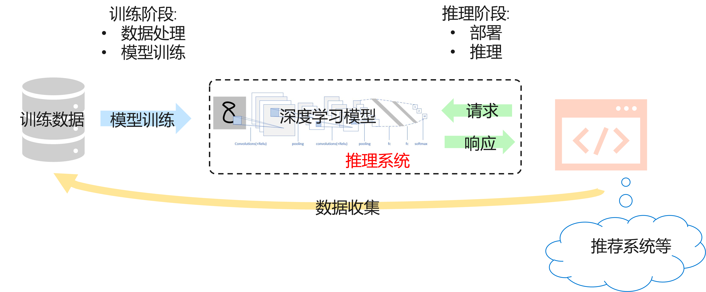
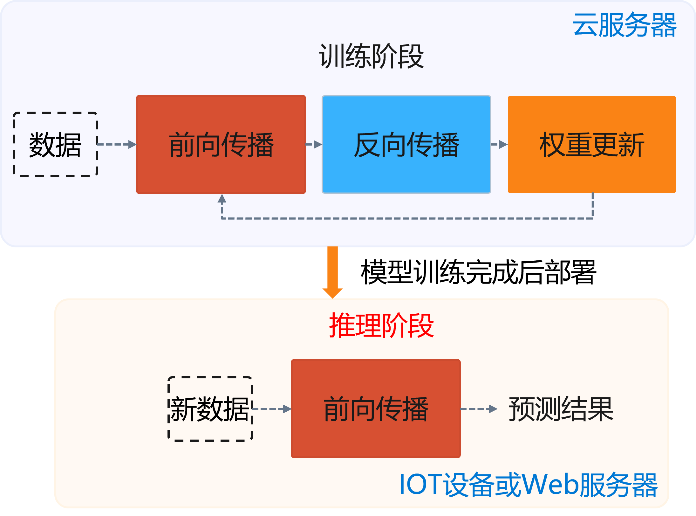
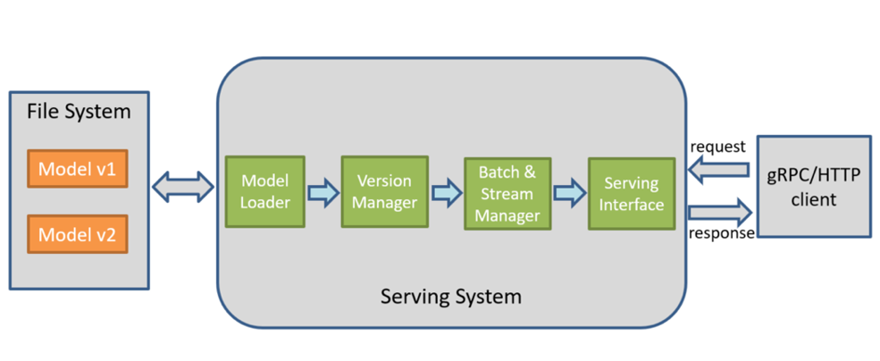
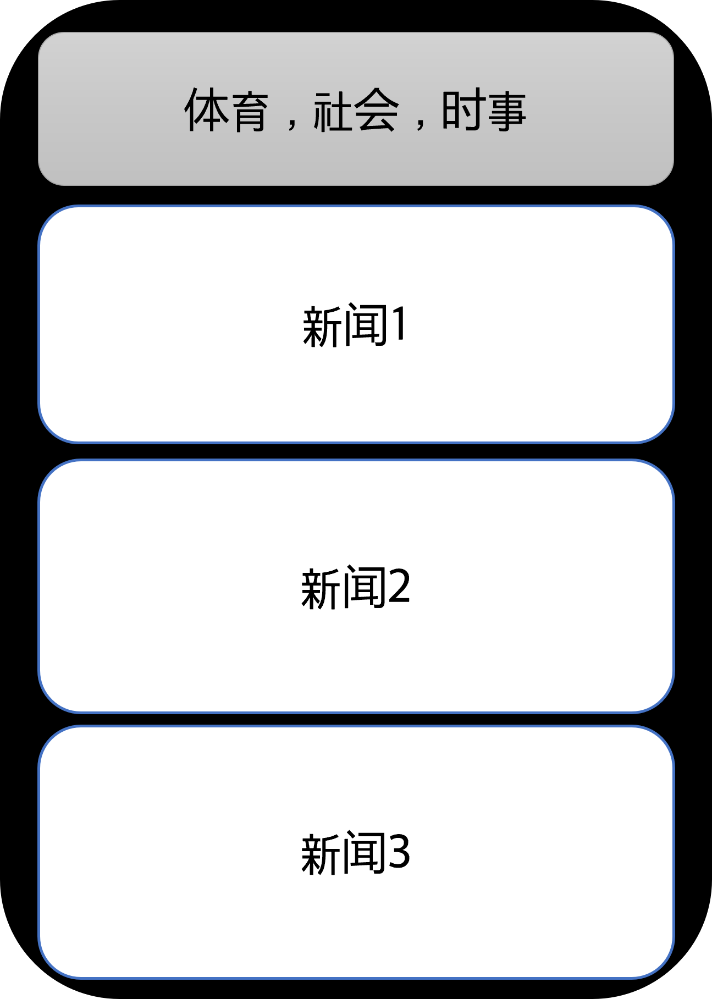
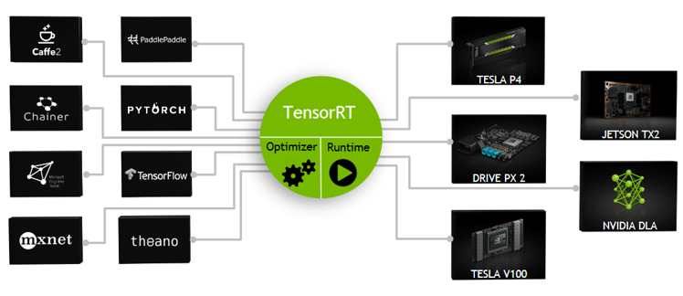
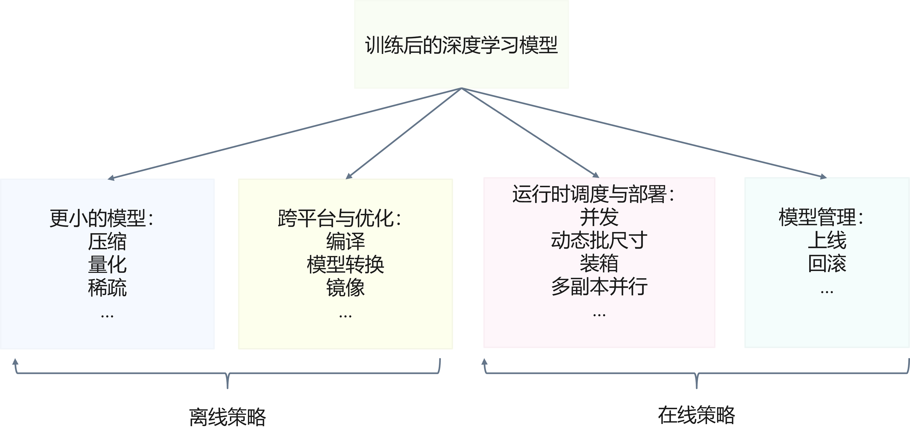

<!--Copyright © Microsoft Corporation. All rights reserved.
  适用于[License](https://github.com/microsoft/AI-System/blob/main/LICENSE)版权许可-->

# 8.1 推理系统简介

本章将围绕推理系统的应用场景，对比推理和训练场景的不同点，进而介绍推理系统的设计目标与约束，为后面章节内容的展开做好铺垫。

- [8.1 推理系统简介](#81-推理系统简介)
  - [8.1.1 对比推理与训练过程](#811-对比推理与训练过程)
  - [8.1.2 推理系统的优化目标与约束](#812-推理系统的优化目标与约束)
  - [小结与讨论](#小结与讨论)
  - [参考文献](#参考文献)


## 8.1.1 对比推理与训练过程

深度学习模型已经广泛的部署在各类应用中，充斥在我们生活的周边。例如，对话机器人，新闻推荐系统，物体检测器等。这些应用中，部署深度学习模型。以对话机器人为例，其输入是一句话作为问题，输出也是一句话作为回答，其中可以通过 Seq2Seq，BERT 等语言深度学习模型进行输入到输出的映射与处理。物体检测器的输入为一张图片，输出为图片中可以被检测的物体类别和位置，中间可以通过 Faster R-CNN，YOLO 等模型进行输入到输出的映射与转换，图中的展示结果是通过其他工具（OpenCV）等绘制在图像上，而绘制的坐标及类别是深度学习模型的输出信息。

我们生活中所接触到的应用人工智能模型的应用，其深度学习模型可以部署在数据中心，接受用户的 APP 或者 网页服务的请求，也可以部署在边缘侧移动端的 APP 或者 IOT 设备中实时响应请求。

在后面介绍的推理系统中，我们以数据中心的服务端推理系统为主，兼顾边缘侧移动端推理的场景，但是这些策略本身大部分是数据中心与边缘侧都适用的。

<center> </center>
<center>图 8.1.1 典型深度学习推理应用</center>

互联网公司的数据中心中（以 Facebook 2018 年[论文中披露的数据为例](https://research.facebook.com/publications/deep-learning-inference-in-facebook-data-centers-characterization-performance-optimizations-and-hardware-implications/)）[<sup>[1]</sup>](#facebook)常常通过推理系统部署视觉模型（图像分类，物体检测，视频理解等应用），语言模型（翻译，内容理解等应用），排序与推荐模型（广告，信息流，搜索等应用）等深度学习模型。从当时的数据来看，模型尺寸有大有小，范围大致为 1M 到 10B 参数，推理批尺寸为 1 到 100（相比训练批尺寸小很多），延迟要求保证一般为 10 毫秒量级（其中对视觉任务并没有严格延迟要求），同时其大量使用量化方式加速推理。

如图 8.1.1 所示，对话机器人接收一句问题作为输入，通过深度学习模型（例如，Seq2Seq 模型）预测出回答并返回给用户。在这个过程中，推理系统需要考虑和提供以下的功能：
- 提供可以被用户调用的接口
- 能够完成一定的数据处理将输入处理为输出
- 能够在指定低延迟要求下返回用户响应
- 能够利用多样的加速器进行一定的加速
- 能够随着用户的增长保持高吞吐的服务响应和动态进行扩容
- 能够可靠的提供服务，应对软硬件的失效
- 能够支持算法工程师不断更新迭代模型，应对不断变化的新框架
- ...

我们通过上面可以看到，单纯复用原有的 Web 服务器或者移动端应用软件，只能解决其中一部分问题，在深度学习模型推理的场景下，产生了新的系统设计需求与挑战。

接下来，我们先从深度学习训练过程和推理过程对比两者的相同点和不同点，以及在生命周期所处的环节，进而便于理解深度学习推理系统所侧重的目标。

如图 8.1.2，深度学习模型的生命周期（Life Cycle）包含以下几个阶段：首先，需要从存储系统或其他数据源收集和准备训练数据。之后进入训练阶段，开始训练模型，一旦模型满足一定的学习性能（例如，准确度超过 $K\%$，或者错误率降低到 $M\%$ 以下），则终止训练，并保存模型文件。完成训练之后，模型文件会被优化（例如，压缩，量化等），编译（例如，内核调优与代码生成），加载部署在推理系统中。推理系统对外暴露接口（例如，Http 或 gRPC 等），接收用户请求或系统调用，模型通过推理（Inference）处理完请求后，返回给用户相应的响应结果，完成推理任务。

一般训练任务在数据中心中更像是传统的批处理任务，需要执行数小时，数天才能完成，其一般配置较大的批尺寸追求较大的吞吐，将模型训练达到指定的准确度或错误率。而推理任务更像是执行 $7 \times 24$ 的服务，其常常受到响应延迟的约束，配置的批尺寸更小，模型已经稳定一般不再被训练。

<center> </center>
<center>图 8.1.2 深度学习模型的生命周期</center>

如图 8.1.3，如果我们将训练阶段和推理阶段模型的执行过程进行抽象，我们可以总结出两者的共性和不同。

训练阶段，深度学习模型常常采用梯度下降算法或类似的优化算法进行模型训练，我们可以将其拆解为三个阶段:
- 前向传播（Forward Propagation）过程将输入样本（Sample）计算为输出标签（Label）。
- 反向传播（Back Propagation）过程求解权重的梯度。
- 梯度更新（Weight Update）阶段将模型权重通过一定的步长和梯度进行更新。

在推理阶段，则只需要执行前向传播过程，将输入样本计算为输出标签。如图 8.1.3，相比训练阶段，推理阶段则只需要执行前向传播（Forward Propagation）一个过程，将输入样本通过深度学习模型计算输出标签（Label）。

<center> </center>
<center>图 8.1.3 模型训练与推理阶段</center>

训练作业常常在之前章节中所介绍的异构集群管理系统中进行执行，通常执行，几个小时，天，或周，是类似传统的批处理作业（Batch Job）。而推理作业需要 $ 7 \times 24 $ 小时运行，类似传统的在线服务（Online Service）。具体来说，深度学习模型推理相比训练的新特点与挑战主要有以下几点：

- 模型被部署为长期运行的服务
  - 服务有明确对请求的低延迟（Low Latency）和高吞吐（High Throughput）需求。例如，互联网服务一般都有明确的响应时间延迟约束，保证用户体验，同时需要应对爆发增长的用户产生的高吞吐请求的响应需求。
- 推理有更苛刻的资源约束
  - 更小的内存，更低的功耗等。例如，手机的资源要远小于数据中心的商用服务器。
- 推理不需要反向传播梯度下降
  - 可以牺牲一定的数据精度。例如，模型本身不再被更新，可以通过量化，稀疏性等手段牺牲一定精度换取一定的性能提升。
- 部署的设备型号更加多样
  - 需要多样的定制化的优化。例如，相比服务器端可以通过 Docker 等手段解决环境问题。移动端显得更为棘手，手机有多种多样的平台与操作系统，IOT 设备有不同的芯片和上层软件栈，需要工具与系统提供编译以减少用户适配代价。

如图 8.1.3，深度学习训练与推理相比。在训练中，需要许多输入，通常是更大的批尺寸（Batch Size），用于训练深度学习模型。在推理中，数据经过训练的网络用于发现和预测新输入中的信息，这些输入通过更小的批尺寸输入网络，且由于有延迟的约束，大批尺寸需要所有批内样本都处理完才能响应，容易造成延迟超出约束（例如，每个用户请求要求 100ms 内进行响应）。

对于推理，相比训练的性能目标是不同的。 为了最大限度地减少网络的端到端响应时间（End to End Response Time），推理通常比训练批量输入更少的输入样本，也就是更小的批尺寸，因为依赖推理工作的服务（例如，基于云的图像处理管道）需要尽可能的更快响应，因此用户不必要让系统累积样本成更大批尺寸，进而不必等待几秒钟的响应时间。高吞吐量是训练期间追求的性能指标，但低延迟对于推理更加重要。

本章后面展开的内容中，大部分就是围绕以上总结的新问题和挑战展开。

接下来我们通过 MMdnn[<sup>[2]</sup>](#mmdnn) 中自带的一个模型在 TensorRT 的推理过程实例来了解模型推理的常见步骤。

```python
# (1) 将框架(本实例中为 TensorFlow 模型文件)的模型文件转换为推理系统的模型格式(本实例中为UFF格式).
…
uff_model = uff.from_tensorflow(tf_model, OUTPUT_NAMES)
# (2) 部署模型文件到推理系统TensorRT.
…
engine = trt.utils.uff_to_trt_engine(G_LOGGER, uff_model, parser, 1, 1 << 20)
# (3) 读取测试输入. 
…
img = Image.open(path)
…
# (4) 初始化推理引擎上下文(Context).
context = engine.create_execution_context()
...
# (5) 将输入数据拷贝到设备(例如，GPU)并执行模型进行推理
… 
bindings = [int(d_input), int(d_output)]
…
cuda.memcpy_htod_async(d_input, img, stream)
# (6) 模型推理
context.enqueue(1, bindings, stream.handle, None)
…
# (7) 最后，获取推理结果，并将结果拷贝到主存
cuda.memcpy_dtoh_async(output, d_output, stream)
…
print("Prediction: ", LABELS[np.argmax(output)])
# 打印结果
>>> Prediction:  n01608432 kite 
```

类似其他的推理系统也是有类似的步骤。也有很多场景下是通过 CPU 进行推理，这样就不需要进行主存与设备内存之前的数据拷贝，同时操作系统对不同模型有更成熟的隔离与任务调度管理支持。通过以上代码实例我们可以了解主干流程，那么当把模型部署之后，我们可以通过下图观察到常见推理系统的模块，与推理系统交互的系统和推理任务的流水线。

从下图 8.1.4，我们可以看到，模型首先经过训练后会保存在文件系统中，随着训练的模型效果不断提升，可能会产生新版本的模型，并存储在文件系统中并由一定的模型版本管理协议进行管理。之后模型会通过服务系统部署上线，推理系统首先会加载模型到内存，同时会对模型进行一定的版本管理，支持新版本上线和旧版本回滚，对输入数据进行批尺寸（Batch Size）动态优化，并提供服务接口（例如，HTTP，gRPC等），供客户端调用。用户不断向推理服务系统发起请求并接受响应。除了被用户直接访问，推理系统也可以作为一个微服务，被数据中心中其他微服务所调用，完成整个请求处理中一个环节的功能与职责。

<center> </center>
<center>图 8.1.4 推理服务系统 </center>


## 8.1.2 推理系统的优化目标与约束

我们以在线推荐系统的服务需求为例，去了解应用场景层面对推理系统产生的需求。例如，某在线新闻 APP 公司希望部署内容个性化推荐服务并期望该服务能满足以下需求：

- 低延迟：
  - 互联网上响应请求延迟常常期望小于 100 毫秒
- 高吞吐：
  - 突发事件驱动的暴增人群的吞吐量需求
- 扩展性：
  - 扩展到不断增长的庞大的用户群体
- 准确度：
  - 随着新闻和读者兴趣的变化提供准确的预测 

<center> </center>
<center>图 8.1.5 推荐系统</center>

如图 8.1.6 所示，除了应用场景的需求，推理系统也需要应对不同训练框架和多样性的推理硬件所产生的部署环境多样性，部署优化和维护困难且容易出错的挑战：

- 框架多样：
  - 大多数框架都是为训练设计和优化：例如，批尺寸（Batch Size），批处理作业对延迟不敏感，分布式训练的支持，需要更高的数据精度支持等。	
  - 开发人员需要将必要的软件组件拼凑在一起：需要兼容数据读取，客户端请求，模型推理等多个阶段的处理。
  - 跨多个不断发展的框架集成和推理需求：PyTorch 和 TensorFlow 等框架，以及不同的框架版本的支持。
- 硬件多样：
  - 多种部署硬件的支持：移动端部署场景和约束多样（例如，自动驾驶，智能家居等），造成多样化的空间限制，功耗约束。同时孕育了大量专有场景的芯片厂，提供的芯片体系结构多样，软件栈多样。
  
<center> </center>
<center>图 8.1.6 推理系统部署需要支持多种框架和硬件</center>

综上所述，我们可以总结出设计推理系统的主要的优化目标：

- 低延迟（Low Latency）:
  - 满足服务等级协议的延迟。更低的延迟会有更好的用户体验和商业竞争力。
- 高吞吐量（High Throughputs）:
  - 能够支持高吞吐量的服务请求。更高的吞吐量能服务更多的请求和更多的用户。
- 高效率（High Efficiency）: 
  - 高效率，低功耗使用 GPU，CPU。高效率执行能够降低推理服务的成本，让推理系统本身降本增效。
- 灵活性（Flexibility）: 
  - 支持多种框架, 提供构建不同应用的灵活性。提升深度学习模型的部署覆盖的场景，提升部署的生产力。
- 可靠性（Reliability）:
  - 需要对不一致的数据，软件、用户配置和底层执行环境故障等造成的中断有弹性（Resilient）。保障推理服务的用户体验与服务等级协议。
- 可扩展性（Scalability）:
  - 扩展支持不断增长的用户或设备。更好的能应对突发和不断增长的用户请求。

除了以上的优化目标，设计推理系统时，相比训练系统，需要满足更多的约束：

<center> </center>
<center>图 8.1.7 推理系统部署需要支持多种框架和硬件</center>

- 服务等级协议（SLA）对延迟的约束
  - 模型返回请求在指定时间以内。
  - ...
- 资源约束
  - 设备端功耗约束：IOT 设备一般为电池供电，提供的电池电量有限（例如，手机，汽车等），无法承受计算量过大产生过大能耗的模型部署。
  - 设备与服务端内存约束：移动端设备的内存相比服务端的服务器内存要小很多。
  - 云端资源的预算约束：云端部署应用是资源和使用时长付费，一般公司有指定的预算限制。
  - ...
- 准确度（Accuracy）约束
  - 使用近似模型产生的一些误差可以接受：可以通过模型压缩，量化，低精度推理等手段进行推理加速，以精度换速度。
  - ...

如图 8.1.8 所示，推理系统中常常涉及相应模块并完成相应功能，我们将在后面章节中逐步展开。
通过下图我们可以看到推理系统的全貌。首先从流程上来看，推理系统完成以下处理并涉及以下系统设计问题:

<center> </center>
<center>图 8.1.8 推理系统组件与架构</a></center> 

1. 请求与响应处理：系统需要序列化与反序列化请求，并通过后端高效执行，满足一定的响应延迟。相比传统的 Web 服务，推理系统常常需要接受图像，文本，音频等非结构化数据，单请求或响应数据量一般更大，这就需要对这类数据有高效的传输，序列化，压缩与解压缩机制。
2. 请求调度：系统可以根据后端资源利用率，动态调整批尺寸，模型的资源分配，进而提升资源利用率，吞吐量。同时如果是通过加速器进行的加速推理，还要考虑主存与加速器内存之间的数据拷贝，通过调度或预取等策略在计算的间歇做好数据的准备。
3. 后端框架执行：框架将请求映射到模型作为输入，并在运行时调度深度学习模型的内核进行多阶段的处理。如果是部署在异构硬件或多样化的环境，还可以利用编译器进行代码生成与内核算子优化，让模型自动化转换为高效的特定平台的可执行的机器码。
4. 模型版本管理：在云端算法工程师不断验证和开发新的版本模型，需要有一定的协议保证版本更新与回滚。定期或满足一定条件的新模型不断上线替换线上模型，以提升推理服务的效果，但是由于有些指标只能线上测试，有可能线上测试效果较差还需要支持回滚机制，让模型能回滚到稳定的旧版本模型。
5. 健康汇报：云端的服务系统应该是可观测的，才能让服务端工程师监控，报警和修复服务，保证服务的稳定性和 SLA。例如，一段时间内响应变慢，通过可观测的日志，运维工程师能诊断是哪个环节成为瓶颈，进而可以快速定位，应用策略，防止整个服务突发性无法响应（例如，OOM 造成服务程序崩溃）。
6. 推理芯片与代码编译：在边缘端等场景会面对更多样的硬件，驱动和开发库，需要通过编译器进行一定代码生成让模型可以跨设备高效运行，并通过编译器实现性能优化。
7. 推理系统和训练系统间可以通过模型库与上线的协议建立起联系，一般训练系统有一套完整的 DevOps 流水线，也被称作 MLOps，在 8.5 章节我们将进行介绍。算法工程师不断在训练流水线中提交模型设计与算法调优的实验，待满足一定的精度需求后，模型进入模型库并触发上线动作。之后就是模型被压缩优化或加载进推理系统了。

推理系统一般可以部署在云或者边缘。云端部署的推理系统更像传统 Web 服务，在边缘侧部署的模型更像手机应用和 IOT 应用系统。两者有以下特点：
1. 云（Cloud）端：云端有更大的算力，内存，且电更加充足满足模型的功耗需求，同时与训练平台连接更加紧密，更容易使用最新版本模型，同时安全和隐私更容易保证。相比边缘侧可以达到更高的推理吞吐量。但是用户的请求需要经过网络传输到数据中心并进行返回，同时使用的是服务提供商的软硬件资源。
2. 边缘（Edge）端：边缘侧设备资源更紧张（例如，手机和 IOT 设备），且功耗受电池约束，需要更加在意资源的使用和执行的效率。用户的响应只需要在自身设备完成，且不需消耗服务提供商的资源。

推理系统中应用了大量的策略与工具进而让模型可以部署在多样的环境中达到更好的性能和满足资源约束。图 8.1.9 中所示，一般我们可以将引入的策略分为在线和离线策略。

离线策略是在模型还没有加载到推理系统内存部署的阶段，对模型本身进行的转换，优化与打包，核心是让模型变得更“小”（运算量小，内存消耗小等），进而精简模型，更像传统编译器所解决的静态分析与优化的问题。

在线部分是推理系统加载模型后，运行时对请求和模型的执行进行的管理和优化。其更多与运行时资源分配与回收，任务调度，扩容与恢复，模型管理协议等相关，更像传统操作系统与 Web 服务系统中所解决的运行时动态管理与优化的问题。

我们将在后面的章节中介绍相应的策略，让读者对推理系统也形成系统化（Systematic）的感知。

<center> </center>
<center>图 8.1.9 推理系统中涉及到的策略与优化</center>

 ## 小结与讨论

本小节主要围绕深度学习推理系统设计需要考虑的目标和约束展开介绍，希望读者在深入了解推理系统之前，能对推理系统本身有一个更加全面的认识，之后的各种优化策略也是围绕这些需求进行权衡和设计。

最后大家可以进而思考以下问题，巩固之前的内容：
推理系统相比传统服务系统有哪些新的挑战？
云和端的服务系统有何不同的侧重和挑战？

## 参考文献


<div id="facebook"></div>

1.   [Park, Jongsoo et al. “Deep Learning Inference in Facebook Data Centers: Characterization, Performance Optimizations and Hardware Implications.” ArXiv abs/1811.09886 (2018): n. pag.](https://arxiv.org/abs/1811.09886)

<div id="mmdnn"></div>

2.   [Yu Liu, Cheng Chen, Ru Zhang, Tingting Qin, Xiang Ji, Haoxiang Lin, and Mao Yang. 2020. Enhancing the interoperability between deep learning frameworks by model conversion. Proceedings of the 28th ACM Joint Meeting on European Software Engineering Conference and Symposium on the Foundations of Software Engineering. Association for Computing Machinery, New York, NY, USA, 1320–1330. https://doi.org/10.1145/3368089.3417051](https://github.com/microsoft/MMdnn)

<div id=""></div>

3.   [CSE 599W: System for ML - Model Serving](https://dlsys.cs.washington.edu/)

<div id="clipper"></div>

4. [Crankshaw, Daniel et al. “Clipper: A Low-Latency Online Prediction Serving System.” NSDI (2017).](https://www.usenix.org/system/files/conference/nsdi17/nsdi17-crankshaw.pdf)

<div id="tfx"></div>

1. [Denis Baylor, et al. 2017. TFX: A TensorFlow-Based Production-Scale Machine Learning Platform. In Proceedings of the 23rd ACM SIGKDD International Conference on Knowledge Discovery and Data Mining (KDD '17). Association for Computing Machinery, New York, NY, USA, 1387–1395.](https://research.google/pubs/pub46484/)

<div id="tfserve"></div>


6. [Olston, Christopher et al. “TensorFlow-Serving: Flexible, High-Performance ML Serving.” ArXiv abs/1712.06139 (2017): n. pag.](https://arxiv.org/abs/1712.06139)

<div id="tensorrt"></div>

7. [DEEP LEARNING DEPLOYMENT WITH NVIDIA TENSORRT](https://developer.nvidia.com/blog/deploying-deep-learning-nvidia-tensorrt/)