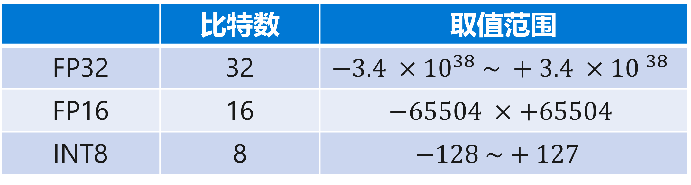
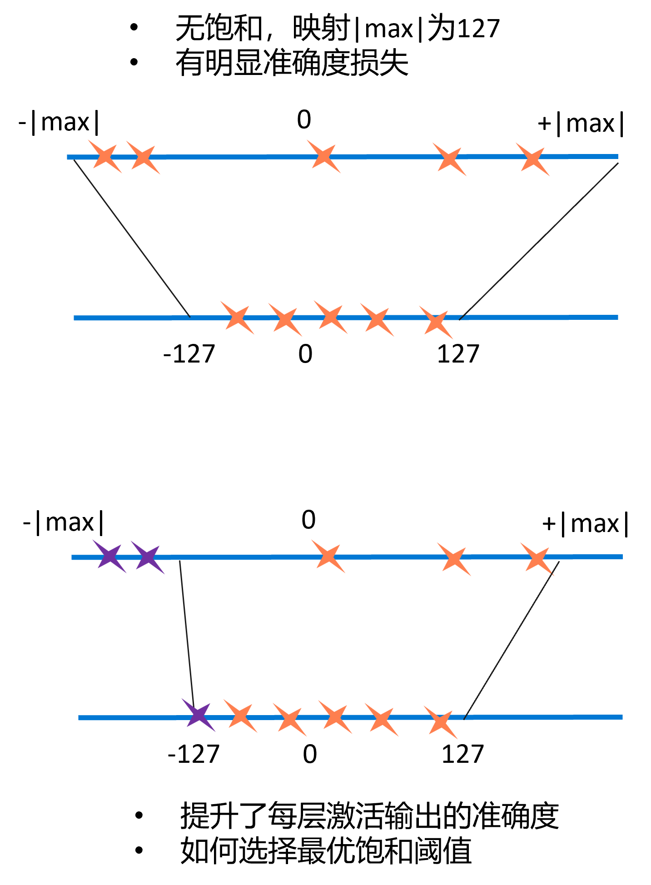
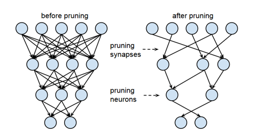

<!--Copyright © Microsoft Corporation. All rights reserved.
  适用于[License](https://github.com/microsoft/AI-System/blob/main/LICENSE)版权许可-->

# 8.2 推理系统的低延迟优化

- [8.2 推理系统的低延迟优化](#82-推理系统的低延迟优化)
  - [8.2.1 层间与张量融合](#821-层间与张量融合)
  - [8.2.2 目标后端自动调优](#822-目标后端自动调优)
  - [8.2.3 内存分配策略调优](#823-内存分配策略调优)
  - [8.2.4 低精度推理与精度校准](#824-低精度推理与精度校准)
  - [8.2.5 模型压缩](#825-模型压缩)
  - [参考文献](#参考文献)

- 推理(inference)延迟：
  - 延迟是在给出查询后呈现推理结果所花费的时间。 
  - 推理服务通常位于关键路径上，因此预测必须既快速同时满足有限的尾部延迟(Tail Latency)才能满足服务水平协议(SLA)
- 需要低延迟的原因：
  - SLA: 次秒(Sub-second)级别延迟服务水平协议
- 低延迟的挑战：
  - 交互式应用程序的低延迟需求通常与离线批处理训练框架设计的目标不一致
  - 简单的模型速度快，复杂的模型更加准确，但是浮点运算量更大
  - 次秒(Sub-second)级别延迟约束制了批尺寸(Batch Size)
  - 模型融合或多租容易引起长尾延迟(Long Tail Traffic)现象

- 模型优化
  - 层间融合或张量融合(Layer & Tensor Fusion)
  - 目标后端自动调优
  - 内存分配策略调优
- 降低一定的准确度
  - 低精度推理与精度校准(Precision Calibration)
  - 模型压缩(Model Compression)
- 自适应批尺寸(Batch Size)
- 缓存(Caching)结果

## 8.2.1 层间与张量融合

- 融合的原因：
  - 相对于内核启动开销和每个层的张量数据读写成本，内核(Kernel)计算通常非常快
  - 导致内存带宽瓶颈和可用GPU资源的利用不足
- 目标：最小化GPU访存和最大化GPU资源利用率
- 搜索计算图的最优融合策略

 

图8-2-1. 内核执行时间线

 

图8-2-2. TensorRT使用内核融合进行模型执行优化

## 8.2.2 目标后端自动调优

- Halide
- TVM
- Ansor

## 8.2.3 内存分配策略调优

- 设备或服务端内存是紧缺资源
- 目标：最小化内存占用和内存分配调用开销
  - 仅在每个张量为其分配内存
- 约束：保证延迟SLA
- 策略：
  - 缓存分配器(Cached Allocator)
  - 预取(Pre-fetching)和卸载(Off-loading)
  - 算子融合(Operator Fusion)

## 8.2.4 低精度推理与精度校准

- 推理阶段可以适当降低精度
  - 大多数深度学习框架都以完整的32位精度（FP32）训练神经网络
  - 对模型进行充分训练后，由于不需要进行梯度反向传播，因此推理计算可以使用半精度FP16甚至INT8张量运算
  - 使用较低的精度会导致较小的模型大小，较低的内存利用率和延迟以及较高的吞吐量
- 目标：最小化数据精度
- 约束：准确度损失  

 

图8-2-3. 精度取值范围

- INT8编码FP32同样信息:
  - Tensor Values = FP32 scale factor * int8 array
  - 添加饱和阈值准确度损失更低 
- 目标：最小化信息损失
- KL散度度量
  - P, Q - two discrete probability distributions.
  - KL_divergence(P,Q):= SUM(P[i] * log(P[i] / Q[i] ), i)
- 策略：
  - 校准数据集运行FP32推理
  - 对每层数据收集激活输出直方图
  - 生成使用不同饱和阈值产生的量化输出分布
  - 选择最小化激活输出分布与量化后的激活输出分布之间KL散度阈值

 

图8-2-4. 精度校准

## 8.2.5 模型压缩

- 模型压缩的收益：
  - 减少浮点运算量，降低延迟
  - 减少内存占用，提升利用率
- 定义模型压缩问题
  
$$min_{policy_i}\{Model\_Size(Policy_i)\}$$
- 约束
$$accuracy(Policy_i) \geq accuracy\_SLA$$

- 参数裁剪和共享（Parameter Pruning and Sharing）
  - 剪枝(Pruning)
  - 量化(Quantization)
  - 编码(Encoding)
- 低秩分解（Low-rank Factorization）
- 知识精炼（Knowledge Distillation）
- …

剪枝算法

- Train Connectivity
  - 通过正常的网络训练来学习连通性
  - 但是，与常规训练不同，不是为了学习权重的最- 终值，而是在学习哪些连接重要
- Prune Connections
  - 所有权重低于阈值的连接都将删除，从而将稠密- 网络转换为稀疏网络
- Train Weights
  - 对剩余网络权重进行重新训练
  - 如果使用修剪后的网络而不进行重新训练，则准确性会受到很大影响

优化延迟的目标，受到空间与准确度的约束
层间与张量融合受到哪些约束?
推理和训练优化内存分配策略的侧重点是否有不同？

 

图8-2-4. 精度校准

<!-- ## 8.2.6 自适应批尺寸

## 8.2.7 缓存结果 -->

## 参考文献 

- [Deep Learning Inference in Facebook Data Centers: Characterization, Performance Optimizations and Hardware Implications](https://arxiv.org/abs/1811.09886)
- [Clipper: A Low-Latency Online Prediction Serving System](https://www.usenix.org/system/files/conference/nsdi17/nsdi17-crankshaw.pdf)
- [TFX: A TensorFlow-Based Production-Scale Machine Learning Platform](https://research.google/pubs/pub46484/)
- [TensorFlow-Serving: Flexible, High-Performance ML Serving](https://arxiv.org/abs/1712.06139)
- [Optimal Aggregation Policy for Reducing Tail Latency of Web Search](https://www.microsoft.com/en-us/research/wp-content/uploads/2016/02/samehe-2015sigir.optimalaggregation.pdf)
- [A Survey of Model Compression and Acceleration for Deep Neural Networks](https://arxiv.org/abs/1710.09282)
- [CSE 599W: System for ML - Model Serving](https://dlsys.cs.washington.edu/)
- https://developer.nvidia.com/deep-learning-performance-training-inference 
- [DEEP COMPRESSION:   COMPRESSING DEEP NEURAL NETWORKS WITH PRUNING, TRAINED QUANTIZATION AND HUFFMAN CODING](https://arxiv.org/abs/1510.00149) 
- [Learning both Weights and Connections for Efficient Neural Networks](https://arxiv.org/abs/1506.02626)
- [DEEP LEARNING DEPLOYMENT WITH NVIDIA TENSORRT](https://developer.nvidia.com/blog/deploying-deep-learning-nvidia-tensorrt/)
- [Halide: A Language and Compiler for Optimizing Parallelism,Locality, and Recomputation in Image Processing Pipelines](https://people.csail.mit.edu/jrk/halide-pldi13.pdf)
- [TVM: An Automated End-to-End Optimizing Compiler for Deep Learning](https://arxiv.org/abs/1802.04799)
- [8-bit Inference with TensorRT](https://on-demand.gputechconf.com/gtc/2017/presentation/s7310-8-bit-inference-with-tensorrt.pdf)