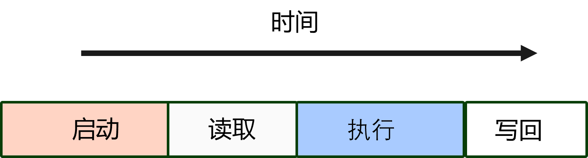
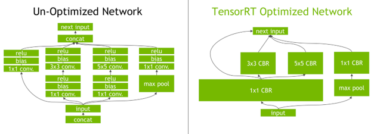
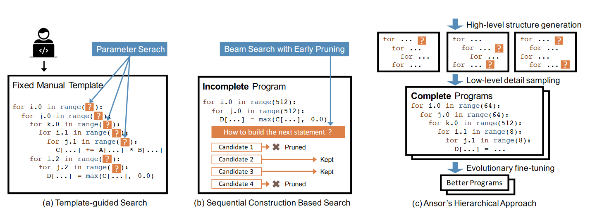
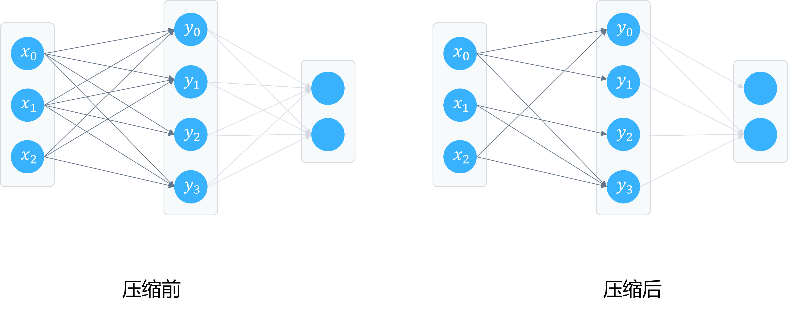

<!--Copyright © Microsoft Corporation. All rights reserved.
  适用于[License](https://github.com/microsoft/AI-System/blob/main/LICENSE)版权许可-->

# 8.2 模型推理的离线优化

<center> </center>
<center>图 8.2.1 模型的离线优化 </center>

本章将围绕推理系统或库针对模型的离线优化策略展开相应的介绍，如图所示，此阶段一般介于工程师训练完模型后与运行期推理之间的环节。

- [8.2 模型推理的离线优化](#82-模型推理的离线优化)
  - [8.2.1 通过程序理解推理优化动机](#821-通过程序理解推理优化动机)
  - [8.2.2 推理（Inference）延迟（Latency）](#822-推理inference延迟latency)
  - [8.2.3 层（Layer）间与张量（Tensor）融合](#823-层layer间与张量tensor融合)
  - [8.2.4 目标后端自动调优](#824-目标后端自动调优)
  - [8.2.5 模型压缩](#825-模型压缩)
  - [8.2.6 低精度推理](#826-低精度推理)
  - [小结与讨论](#小结与讨论)
  - [参考文献](#参考文献)

推理系统类似传统的 Web 服务，需要响应用户请求，并保证一定的服务等级协议（例如，响应时间低于 100ms），进而需要通过一定的策略和优化。 
总体来说，本章节的优化都在朝着下面的思路设计：

（1）更小的模型：更小的模型意味着更少的浮点运算量和访存开销。例如，低精度推理，模型压缩等。
（2）更小的访存开销：层间与张量融合，目标后端自动调优等。
（3）更大的并行度：目标后端自动调优等。
同时本章的优化属于 ***离线优化*** ，也就是属于部署推理模型之前做的优化，对这段优化处理本身的开销没有严格约束。

## 8.2.1 通过程序理解推理优化动机

我们通过一个矩阵乘法实例进行介绍，下面的代码段中，A 和 B 进行矩阵乘计算，结果存储到 result 矩阵中。

```python
# 本程序通过循环实现矩阵乘 

# 3x3 矩阵
A = [[0.0,0.0,0.0],
    [4.0,5.0,6.0],
    [7.0,8.0,9.0]]

# 3x4 矩阵
B = [[5.0,8.0,1.0,2.0],
    [6.0,0.0,3.0,0.0],
    [4.0,0.0,0.0,1.0]]

# 3x4 结果矩阵 
result = [[0.0,0.0,0.0,0.0],
         [0.0,0.0,0.0,0.0],
         [0.0,0.0,0.0,0.0]]

# 通过 X 矩阵的行进行迭代 
for i in range(len(A)):
   # 通过 Y 矩阵的列进行迭代
   for j in range(len(B[0])):
       # 通过 Y 矩阵的行进行迭代
       for k in range(len(B)):
           result[i][j] += A[i][k] * B[k][j]
```

请读者在开始后面的内容前，通过以下实例思考相应问题：

1. 程序基准运算量预估：预估整体的 [MAC](https://en.wikipedia.org/wiki/Multiply%E2%80%93accumulate_operation) 运算量。
2. 程序基准内存消耗预估：假设A,B,Result的元素数据类型为 Float32（32 比特浮点数），预估程序整体的内存占用(Byte 字节为单位)。
3. 思考如果元素数据类型换为 Int8（8 比特整数），内存占用会为多少？MAC 会降低为多少？
   - 本问题启示大家思考模型量化的作用和价值
4. 如果底层系统支持元素为 0 的部分不需要计算直接得到结果为 0，那么预估整体的 MAC 为多少？相比 1 有多少倍的加速？
   - 本问题启示大家思考模型压缩的作用和价值
5. 如果矩阵乘的循环在函数（func）中如下代码实例所示，设备执行完成后，缓存失效，再执行下一个函数（func）时仍需要加载 result 和 B 一次。思考和预估内存到缓存的额外加载代价?
   - 本例启发大家思考内核融合技术优化的作用

```python 
# 模拟未内核融合
def func1(A, B, result1):
    for i in range(len(A)):
        for j in range(len(B[0])):
            for k in range(len(B)):
                result1[i][j] += A[i][k] * B[k][j]
    return result1

def func2(result1, B, result2):
    for i in range(len(B)):
        for j in range(len(B[0])):
                result2[i][j] += result1[i][j] + B[i][j]
    return result2
```

```python 
# 模拟内核融合
def func1(A, B, result1):
    for i in range(len(A)):
        for j in range(len(B[0])):
            for k in range(len(B)):
                result1[i][j] += A[i][k] * B[k][j]

    for i in range(len(B)):
        for j in range(len(B[0])):
                result2[i][j] += result1[i][j] + B[i][j]
    return result2
```
6. 请思考，如果执行此程序的设备缓存线（[Cache Line](https://stackoverflow.com/questions/3928995/how-do-cache-lines-work)）为 3 Byte，有 2 个缓存线，预估缓存未命中率 （[Cache Misses Rate](https://en.wikipedia.org/wiki/Cache_performance_measurement_and_metric#Introduction_to_types_of_cache_misses))?思考设计缓存失效率最低的访问方式?如果有两个 core 可以同时启动两个线程计算，之后会如何设计并行计算的策略？
   - 本问题启发读者思考后端代码生成等编译优化策略的作用。

我们对 5 中 func2 进行两种访问方式的模拟。
   
```python
# 方式1：列访问 result1, B
for i in range(len(B)):
    for j in range(len(B[0])):
        result2[i][j] += result1[i][j] + B[i][j]
# 方式2：行访问 result1，B
for j in range(len(B[0])):
    for i in range(len(B)):
        result2[i][j] += result1[i][j] + B[i][j]
``` 
7. 由于移动端常常使用电池供电，如果我们的功耗和 MAC 运算量以及访存正相关，思考有什么策略可以减少移动端模型的功耗？
   
通过以上问题，相信读者已经对接下来的离线优化动机有了初步的认识，下面内容将围绕代表性的离线优化策略进行展开。

## 8.2.2 推理（Inference）延迟（Latency）

延迟（Latency）是在客户端发出查询到推理系统呈现给客户端推理结果，所花费的时间。推理服务通常位于关键路径上，因此预测必须既快速同时满足有限的[尾部延迟(Tail Latency)](https://www.cs.utexas.edu/users/mckinley/talks/ds-strangeloop-2017.pdf)[<sup>[1]</sup>](#tail)约束才能满足服务水平协议(Service Level Agreement)。例如：某互联网公司的在线服务等级要求（Service Level Agreement）: 次秒（Sub-Second）级别延迟服务水平协议。

为了满足低延迟，推理系统面临以下的挑战：
- 交互式应用程序的低延迟需求通常与离线批处理训练框架设计的目标（例如，大规模，高吞吐，大批次等）不一致
- 简单的模型速度快，复杂的模型更加准确，但是浮点运算量更大
- 次秒（Sub-Second）级别延迟约束制了批尺寸（Batch Size）
- 模型融合或多租容易引起长尾延迟（Long Tail Traffic）现象

推理系统常常可以通过以下几个方向进行模型推理的延迟优化：

- 模型优化，降低访存开销：
  - 层（Layer）间融合（Fusion）或张量（Tensor）融合
  - 目标后端自动调优
  - 内存分配策略调优
- 降低一定的准确度，进而降低计算量，最终降低延迟：
  - 低精度推理与精度校准（Precision Calibration）
  - 模型压缩（Model Compression）
- 自适应批尺寸（Batch Size）：动态调整需要进行推理的输入数据数量
- 缓存（Caching）结果：复用已推理的结果或特征数据

## 8.2.3 层（Layer）间与张量（Tensor）融合

我们将模型抽象为数据流图（Data-Flow Graph)，其中在设备执行的层（Layer）在一些框架内也称作内核（Kernel）或算子（Operator）。我们可以从下图中看到，设备中执行一个内核，一般需要以下几个步骤和时间开销，启动内核，读取数据到设备，执行内核，结果数据写回主存。

<center> </center>
<center>图 8.2.2 内核执行时间线</center>

我们从上面的实例可以观察到需要对模型的层间和张量融合的原因：
- 相对于内核启动开销和每个层的张量数据读写成本，内核（Kernel）计算通常非常快
- 导致内存带宽瓶颈和可用设备（Device）资源的利用不足

我们可以将内核融合问题抽象为一个优化问题：
- 目标：最小化设备（Device）访存和最大化设备利用率
- 策略：搜索计算图的最优融合策略，降低内核启动，数据访存读写和内存分配与释放开销。

如下图所示，左图为未进行融合的深度学习模型网络结构，右图为经过 TensorRT[<sup>[2]</sup>](#tensorrt) 优化和融合之后的深度学习模型网络结构。优化后将很多小的层融合为大的层，这样减少了大量的内核启动与数据读写和内存分配释放的开销，提升性能。

<center> </center>
<center>图 8.2.3 使用内核融合进行模型执行优化 <a href="">图片引用 TensorRT</a></center>

代表性的开源应用内核融合优化的系统还有很多，例如，微软开源的 [NNFusion](https://github.com/microsoft/nnfusion)。

***经典回顾***

- [内联函数（Inline Function）](https://en.wikipedia.org/wiki/Inline_functiong)：“C/C++ 编程语言中，编译器通过执行内联扩展来替换内联函数的主体，即通过在每个函数调用的地址处插入函数代码，从而节省函数的调用开销。”

- [循环融合（Loop Fusion）](https://en.wikipedia.org/wiki/Loop_fission_and_fusion)：“循环融合是一种编译器优化和循环转换，它用一个循环替换多个循环。循环融合并不总能提高运行速度。在某些架构上，两个循环实际上可能比一个循环执行得更好，例如，因为每个循环内的数据局部性增加。循环融合的主要好处之一是它可以避免临时内存分配。”

- 大数据系统中也有类似的优化思路：Apache Spark 中将两个洗牌（Shuffle）阶段之间的用户自定义函数（UDF）自动融合（Fusion）为一个[阶段（Stage）](https://data-flair.training/blogs/spark-stage/)，并根据数据分区（Partition）转换为具体任务（Task）执行，减少 UDF 之间的数据访存开销。

## 8.2.4 目标后端自动调优

由于深度学习模型中的层的计算逻辑可以转为矩阵运算，而矩阵计算又可以通过循环进行实现。对于循环的实现，由于在不同的推理 CPU 和硬件设备中，有不同的缓存和内存大小以及访存带宽，进而如何针对不同的设备进行循环的并行化和考虑数据的局部性降低访存开销，可以抽象为一个搜索空间巨大的优化问题。目前有很多深度学习编译器的工作在围绕这个问题展开，它们分别从不同角度入手，有的通过基于专家经验的规则，有的构建代价模型，有的抽象问题为约束优化问题或者通过机器学习自动化学习和预测是常用的方式。由于在编译优化章节对此有较为详细的介绍，本章不再展开相应的内容，读者可以参考编译优化章节内容理解。

代表性的开源后端自动调优编译器或工具有：[TVM](https://tvm.apache.org/)[<sup>[3]</sup>](#tvm)，[NNFusion](https://github.com/microsoft/nnfusion)[<sup>[4]</sup>](#nnfusion)，[Halide](https://dl.acm.org/doi/10.1145/2491956.2462176)[<sup>[5]</sup>](#halide)，[Ansor](https://tvm.apache.org/2021/03/03/intro-auto-scheduler)[<sup>[6]</sup>](#ansor)等。

<center> </center>
<center>图 8.2.4 对比不同后端自动调优搜索策略 <a href="https://arxiv.org/pdf/2006.06762.pdf">图片引用自 Ansor OSDI '20</a></center>

如图 8.2.4 所示，当前深度学习算子大多会转换为矩阵计算，而矩阵计算又会转换为多级 for 循环在特定设备执行。[Ansor](https://arxiv.org/pdf/2006.06762.pdf) 工作中总结当前目标后端自动调优通常有以下几种方案：

“1. 模板引导搜索（Templated-guided Search）： 如图 a 所示，在模板引导搜索中，搜索空间由手动模板定义。编译器（例如，TVM）需要用户手动为计算定义编写模板。模板用一些可调参数定义张量程序的结构参数（例如，平铺大小和展开因子）。编译器然后针对输入形状配置和特定的硬件目标搜索这些参数的最佳值。该方法在常见问题上取得了良好的性能，例如，深度学习算子。然而，开发模板更新与构建需要较大的工作量。
2. 基于顺序构建的搜索（Sequential Construction Based Search）：如图 b 所示，这种方法通过分解程序结构来细化搜索空间转化为固定的决策序列。然后编译器使用诸如束搜索（Beam Search）之类的算法来搜索好的决策（例如，[Halide](https://dl.acm.org/doi/10.1145/3150211) 自动调度器采用这种方式）。在这种方法中，编译器通过逐步展开计算图中的所有节点顺序构造一个张量程序（Tensor Program）。
3. 分层方法（Hierarchical Approach）：如图 c 所示，[Ansor](https://arxiv.org/pdf/2006.06762.pdf)由一个分层的搜索空间支持，该空间解耦高级结构和低级细节。Ansor 构造自动搜索计算图的空间，无需手动开发模板。然后从空间中采样完整的程序并执行对完整程序进行微调，避免不完整程序不准确的预估。”

如下面的矩阵乘代码所示，原始程序中有三个数组，但是当前没有将数组分区到更小的大小。例如，NVIDIA GPU 中的[共享内存（Shared Memory）](https://developer.nvidia.com/blog/using-shared-memory-cuda-cc/)是高速可字节寻址的片上内存，但是其一般和 L1 缓存共享一块片上内存，其大小常常为 16KB 或者 48KB，那么我们思考当前如果 a，b，c 的大小不足以放进共享内存加速，就需要一定循环优化解决当前问题了。
```c++
// 数组声明
int i, j, a[1000][1000], b[1000], c[1000];
int n = 1000;
// 矩阵乘
for (i = 0; i < n; i++) {
 c[i] = 0;
 for (j = 0; j < n; j++) {
   c[i] = c[i] + a[i][j] * b[j];
 }
}
```

使用循环分块进行优化，例如，如下块大小为 k。这样当前一块的计算就尽可能的能利用缓存或共享内存等更小的偏上内存，增加如第一章 1.5 所介绍的程序局部性，加速程序。

```c++
// 块优化矩阵乘
int k = ... ; // K 设置多少合适？
for (i = 0; i < n; i += k) {
  c[i] = 0;
  c[i + 1] = 0;
  for (j = 0; j < n; j += k) {
    // 块内子矩阵矩阵乘  
    for (x = i; x < min(i + k, n); x++) {
      for (y = j; y < min(j + k, n); y++) {
        c[x] = c[x] + a[x][y] * b[y];
      }
    }
  }
}
```

但是我们发现上面给定给定数组大小，特定型号设备片上内存的大小配置情况下，块大小的 k 的选取就需要我们本小节介绍的优化技术进行内核自动调优选取 k。

***经典回顾***

程序分析（Program Analysis）与编译器（Compiler）领域在过去的几十年中，对循环做了大量的研究与优化，读者可以参考[循环优化（Loop Optimization）](https://en.wikipedia.org/wiki/Loop_optimization)了解。例如：循环分块（Tiling），循环展开（Unrolling），循环交换（Interchange），循环分解（Fission），循环融合（Fusion）等。而面对如此大的优化空间，当前的工作更多的入手点并不是再找到新的优化点，而是从如何通盘考虑已有循环优化机会，通过更高效的算法搜索或通过机器学习的方法，近似或超过专家手工优化的效果，以及通过编译器工程上适配更多类型设备。

## 8.2.5 模型压缩

模型压缩（Model Compression）是通过一定的算法和策略，在保证模型预测效果满足一定要求的前提下，尽可能地降低模型权重的大小，进而降低模型的推理计算量，内存开销和模型文件的空间占用，最终降低模型推理延迟。因为其可观的收益和一定的预测效果保证，在模型部署和推理之前，通过模型压缩进行模型精简是常常使用的技术。

我们可以将模型压缩抽象为有约束的优化问题：

优化目标：在所选择的策略下，最小化模型大小

$$min_{policy_{i}}\{ModelSize(Policy_{i})\}$$

$$policy_{i}: 模型压缩策略。例如，剪枝。$$
$$ModelSize: 模型尺寸。例如，100MB。$$


约束：在所选择的策略进行模型压缩后，保证预测精度满足约束

$$Accuracy(Policy_{i}) \geq AccuracySLA$$

$$AccuracySLA: 准确度服务等级协议。例如，accuracy > 97\% 。$$


常常使用的模型压缩技术有如下几种：

- 参数裁剪（Parameter Pruning）和共享（Sharing）
  - 剪枝（Pruning）
  - 量化（Quantization）
  - 编码（Encoding）
- 低秩分解（Low-Rank Factorization）
- 知识精炼（Knowledge Distillation）
- …

例如，在 [Deep Compression ICLR '16](https://arxiv.org/abs/1510.00149)[<sup>[8]</sup>](#compression) 的工作中，将模型压缩抽象为以下几个步骤。

“1. 剪枝阶段：此阶段从 1989 年 [Optimal Brain Damage NIPS 1989](https://proceedings.neurips.cc/paper/1989/file/6c9882bbac1c7093bd25041881277658-Paper.pdf) 即开始通过减少模型网络复杂度的方式进行剪枝。此工作也是基于原有工作之上构建。此步骤需要再微调训练以还原预测精度。
如图 8.2.5 所示剪枝后网络中的边也就是权重减少。
<center> </center>
<center>图 8.2.5 模型剪枝前后对比</center>

2. 量化阶段：网络量化和权重共享进一步压缩减少网络权重比特。读者可以参考 8.2.5 理解量化机制，此工作中会对权重进行聚类，生成并利用统计出的代码书（Code Book）进一步量化权重。权重共享策略，读者可以参考 [HashNet CVPR '17](https://openaccess.thecvf.com/content_ICCV_2017/papers/Cao_HashNet_Deep_Learning_ICCV_2017_paper.pdf) 理解，对输入数据通过一个哈希函数决定选择哪些权重。此步骤需要再微调训练以还原预测精度。
   
3. 霍夫曼编码（Huffman Encoding）阶段：霍夫曼编码是一种优化的前缀编码，通常用于数据压缩，在 Van Leeuwen, Jan 1979 年工作中有介绍。此工作根据霍夫曼编码进行量化后的权重进一步进行编码减少空间占用。” 

综上我们可以看到，模型压缩综合使用传统的模型剪枝，量化，数据压缩与编码算法，并不断结合重新训练调整精度，最终达到极致的压缩效果。

由于目前有很多手段可以达到模型压缩与量化，那么我们也可以考虑通过集成性工具一站式做好模型压缩（例如，Level，AGP，L1Filter，L2Filter，Slim 等剪枝器）与量化（例如，Naive，QAT，BNN等量化器）。例如，通过 NNI 提供的模型压缩与量化接口实例，我们可以自动化使用多种算法进行尝试和剪枝。下面使用一个简单的 [NNI 官方示例](https://nni.readthedocs.io/en/v1.6/Compressor/Overview.html)[<sup>[9]</sup>](#nni) 来展示如何修改试用代码以应用压缩算法。假设想使用 Level Pruner 将所有权重修剪为 $80\%$ 的稀疏度，可以在训练模型之前将以下三行添加到代码中（这里是[完整的代码](https://github.com/microsoft/nni/tree/master/examples/model_compress)）。函数调用 pruner.compress() 修改用户定义的模型（在 Tensorflow 中，模型可以通过 tf.get_default_graph() 获得，而在 PyTorch 中，模型是定义的模型类），并通过插入遮罩（Masks）修改模型。然后当用户运行模型时，遮罩就会生效。也可以通过算法在运行时调整遮罩。这样当我们面对种类繁多的算法时，可以在框架内一站式解决压缩与量化问题。

通过 NNI 进行 PyTorch 模型压缩实例（实例引用自 NNI 文档）。
- PyTorch 实例
```python
from nni.compression.torch import LevelPruner
config_list = [{ 'sparsity': 0.8, 'op_types': ['default'] }]
pruner = LevelPruner(model, config_list)
pruner.compress()
Tensorflow code
```
- TensorFlow 实例
```python
from nni.compression.tensorflow import LevelPruner
config_list = [{ 'sparsity': 0.8, 'op_types': ['default'] }]
pruner = LevelPruner(tf.get_default_graph(), config_list)
pruner.compress()
```

在后面章节中我们将有更为细节的模型压缩内容叙述，本小节只介绍与推理相关的模型压缩技术和问题。

## 8.2.6 低精度推理

作为模型压缩的一种手段，低精度推理也常常用于推理系统中用于模型精简与推理加速。

推理阶段相比训练阶段可以适当降低精度[<sup>[10]</sup>](#8bit)，进而降低推理延迟:
- 大多数深度学习框架都以完整的 32 位精度（FP32）训练神经网络。
- 使用较低的精度会导致较小的模型大小，较低的内存利用率和延迟以及较高的吞吐量。
- 对模型进行充分训练后，由于不需要进行反向传播求梯度，因此推理计算相比训练常常使用的 FP32，推理可以使用半精度 FP16 甚至 INT8 张量运算降低计算量和内存占用。

如图所示，不同的精度对应的比特数和取值范围不同，进而产生了不同学习性能和系统性能的权衡。此小节内容将在后续稀疏性章节有更详细的的介绍。

$$
\begin{array}{|c|c|c|}
    \hline
    & 比特数 & 取值范围 \\
    \hline 
    FP32& 32 & -3.4 \times 10^{38} \sim + 3.4 \times 10^{38} \\
    \hline
    FP16& 16 & -65504 \sim +65504 \\
    \hline 
    INT8 & 8 & -128 \sim +127 \\
    \hline
\end{array}
$$

<center>表 8.2.1 精度取值范围</center>

接下下我们以一个参考[开源实例](https://gist.github.com/aleju/eb75fa01a1d5d5a785cf)[<sup>[7]</sup>](#quantize) 实现的基于 PyTorch 的量化简易实例说明如何实现一个简单的量化函数并应用在张量中。此实例对张量每个元素应用用户自定义函数，在函数中，将每个输入元素值转换为 to_values 数组中最接近的值，to_values 向量可以由用户设计的算法计算出来，根据最大最小取值约束和数据的数值分布获得。以下实例只是说明一种简单情况，量化算法多种多样，读者可以参考相关论文实现与理解。

```python
import torch

def quantize(val):
    """
    将元素值转换为 to_values 中最接近的值。
    
    实例:
        to_values = [0, 45, 90]
        quantize(49.513) -> 45

        to_values = [0, 10, 20, 30]
        quantize(43) -> 30
    """
    # to_values 需要通过算法统计计算出来，本实例省略此过程
    to_values = [0.01, 0.02, 0.03]
    best_match = None
    best_match_diff = None
    for other_val in to_values:
        diff = abs(other_val - val)
        if best_match is None or diff < best_match_diff:
            best_match = other_val
            best_match_diff = diff
    return best_match

tensor = torch.Tensor(2, 2)
print(tensor)
print(tensor.type())
# 数值量化
tensor.apply_(quantize)
print(tensor)
# 类型转换，转换后内存与计算量会相比原始 torch.float32 大幅减少。如果不做上面的量化直接类型转换，会直接丢失较多信息。
tensor = tensor.to(dtype = torch.float16)
print(tensor)
print(tensor.type())
```

执行结果为
```bash
tensor([[7.3154e+34, 3.4596e-12],
        [7.3162e+28, 1.1839e+22]])
torch.FloatTensor
tensor([[0.0100, 0.0100],
        [0.0100, 0.0100]])
tensor([[0.0100, 0.0100],
        [0.0100, 0.0100]], dtype=torch.float16)
torch.HalfTensor
```

读者思考，torch.float32 到 torch.float16 转换后，对 Tensor(4, 5) 计算量和内存优化了多少倍？ 


## 小结与讨论

本小节主要围绕推理系统的延迟展开讨论，我们总结了低延迟的推理需求，以及围绕这个设计目标，推理系统常常使用的优化策略。优化延迟的目标，受到空间与准确度的约束，深度学习的推理过程相比训练过程在适当情况下可以牺牲一定准确度进而提升延迟。

看完本章内容后，我们可以思考以下几点问题：
层间与张量融合受到哪些约束？
推理和训练优化内存分配策略的侧重点是否有不同？

## 参考文献 

<div id="tail"></div>

1.   [Kathryn S McKinley, Google. Measuring and Optimizing Tail Latency](https://cra.org/cra-wp/wp-content/uploads/sites/8/2018/04/VUTH-14-combined-slides.compressed.pdf)

<div id="tensorrt"></div>

2.   [DEEP LEARNING DEPLOYMENT WITH NVIDIA TENSORRT](https://developer.nvidia.com/blog/deploying-deep-learning-nvidia-tensorrt/)

<div id="tvm"></div>

3.   [Tianqi Chen, Thierry Moreau, Ziheng Jiang, Lianmin Zheng, Eddie Yan, Meghan Cowan, Haichen Shen, Leyuan Wang, Yuwei Hu, Luis Ceze, Carlos Guestrin, and Arvind Krishnamurthy. 2018. TVM: an automated end-to-end optimizing compiler for deep learning. In Proceedings of the 13th USENIX conference on Operating Systems Design and Implementation (OSDI'18). USENIX Association, USA, 579–594.](https://dl.acm.org/doi/10.5555/3291168.3291211)


<div id="nnfusion"></div>

4.   [Lingxiao Ma, Zhiqiang Xie, Zhi Yang, Jilong Xue, Youshan Miao, Wei Cui, Wenxiang Hu, Fan Yang, Lintao Zhang, and Lidong Zhou. 2020. RAMMER: enabling holistic deep learning compiler optimizations with rtasks. Proceedings of the 14th USENIX Conference on Operating Systems Design and Implementation. USENIX Association, USA, Article 50, 881–897.](https://dl.acm.org/doi/abs/10.5555/3488766.3488816)


<div id="halide"></div>

5.   [Jonathan Ragan-Kelley, Connelly Barnes, Andrew Adams, Sylvain Paris, Frédo Durand, and Saman Amarasinghe. 2013. Halide: a language and compiler for optimizing parallelism, locality, and recomputation in image processing pipelines. SIGPLAN Not. 48, 6 (June 2013), 519–530. ](https://dl.acm.org/doi/10.1145/2491956.2462176)


<div id="ansor"></div>

6.   [Lianmin Zheng, Chengfan Jia, Minmin Sun, Zhao Wu, Cody Hao Yu, Ameer Haj-Ali, Yida Wang, Jun Yang, Danyang Zhuo, Koushik Sen, Joseph E. Gonzalez, and Ion Stoica. 2020. Ansor: generating high-performance tensor programs for deep learning. Proceedings of the 14th USENIX Conference on Operating Systems Design and Implementation. USENIX Association, USA, Article 49, 863–879.](https://dl.acm.org/doi/abs/10.5555/3488766.3488815)

<div id="quantize"></div>

7.   [quantize Python example](https://gist.github.com/aleju/eb75fa01a1d5d5a785cf)

<div id="compression"></div>

8.   [Han, Song et al. “Deep Compression: Compressing Deep Neural Network with Pruning, Trained Quantization and Huffman Coding.” arXiv: Computer Vision and Pattern Recognition (2016): n. pag.](https://arxiv.org/abs/1510.00149) 

<div id="nni"></div>

9.   [Model Compression with NNI](https://nni.readthedocs.io/en/v1.6/Compressor/Overview.html) 

<div id="8bit"></div>

10. [Szymon Migacz, NVIDIA. May 8, 2017. 8-bit Inference with TensorRT](https://on-demand.gputechconf.com/gtc/2017/presentation/s7310-8-bit-inference-with-tensorrt.pdf)
