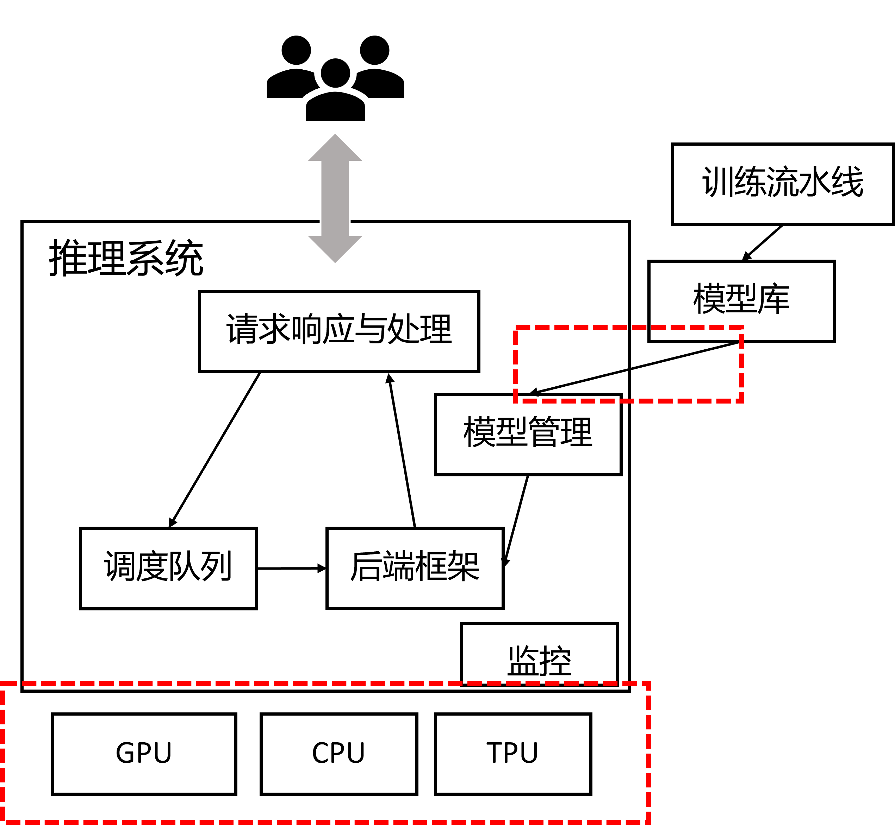
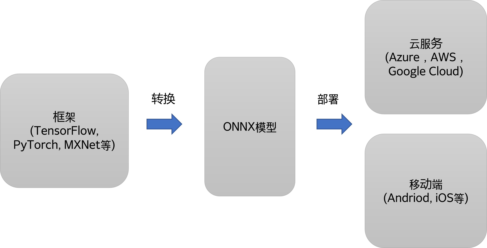
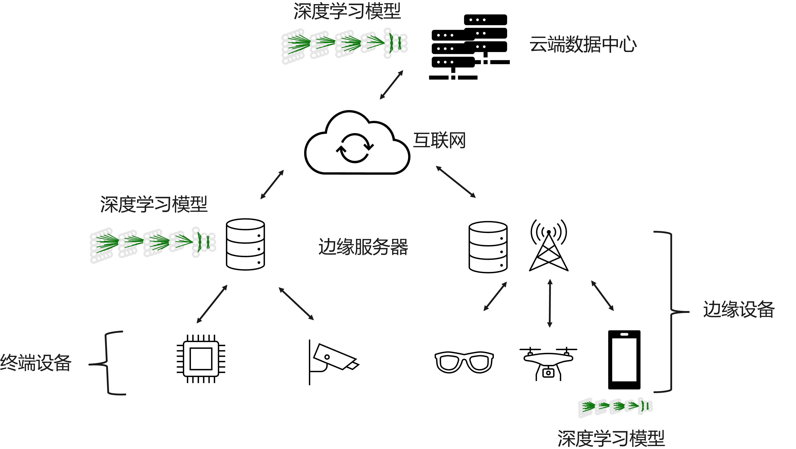
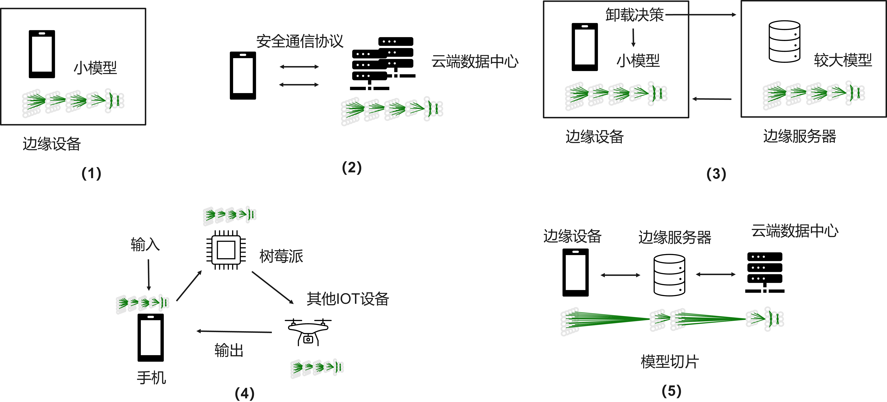
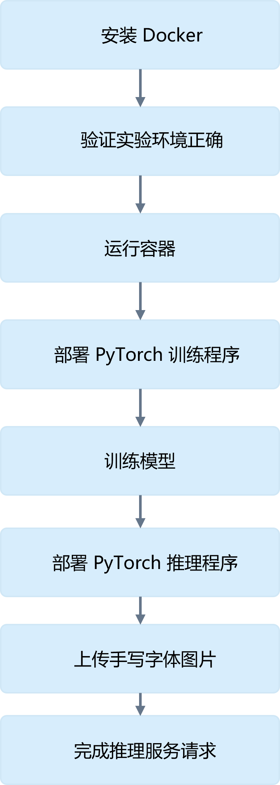

<!--Copyright © Microsoft Corporation. All rights reserved.
  适用于[License](https://github.com/microsoft/AI-System/blob/main/LICENSE)版权许可-->


# 8.3 部署

<center> </center>
<center>图 8-3-1. 推理系统与模型的部署 </center>

推理系统进行模型部署时，需要应对多样的框架，多样的部署硬件，以及持续集成和持续部署的模型上线发布等诸多的软件工程问题。如图 8-3-1 所示，本小节将围绕部署过程中涉及到的可靠性（Reliability），可扩展性（Scalability），灵活性（Flexibility）进行展开。

- [8.3 部署](#83-部署)
  - [8.3.1 可靠性（Reliability）和可扩展性（Scalability）](#831-可靠性reliability和可扩展性scalability)
  - [8.3.2 部署灵活性](#832-部署灵活性)
  - [8.3.3 模型转换与开放协议](#833-模型转换与开放协议)
  - [8.3.4 移动端部署](#834-移动端部署)
  - [8.3.5 推理系统简介](#835-推理系统简介)
  - [8.3.6 配置镜像与容器进行云上训练，推理与压测实验](#836-配置镜像与容器进行云上训练推理与压测实验)
    - [8.3.6.1 实验目的](#8361-实验目的)
    - [8.3.6.2 实验环境](#8362-实验环境)
    - [8.3.6.3 实验原理](#8363-实验原理)
    - [8.3.6.4 实验内容](#8364-实验内容)
    - [8.3.6.5 实验报告](#8365-实验报告)
  - [小结与讨论](#小结与讨论)
  - [参考文献](#参考文献)

## 8.3.1 可靠性（Reliability）和可扩展性（Scalability）

当推理系统部署到生产环境中，需要 $7 \times 24$ 小时不间断对用户提供相应的在线推理服务。在服务用户的过程中需要对不一致的数据，软件、用户配置和底层执行环境故障等造成的中断有弹性（Resilience）- 能够快速恢复服务，达到一定的可靠性，保证服务等级协议。同时推理系统也需要优雅地扩展，进而应对生产环境中流量的增加的场景。
综上，推理系统在设计之初就需要考虑提供更好的扩展性。推理系统随着请求负载增加而自动和动态的部署更多的实例，进而才可以应对更大负载，提供更高的推理吞吐和让推理系统更加可靠。

如图所示，通过底层的部署平台（例如，Kubernetes）的支持，用户可以通过配置方便地描述和自动部署多个推理服务的副本，并通过部署前端负载均衡服务达到负载均衡，进而达到高扩展性提升了吞吐量，同时更多的副本也使得推理服务有了更高的可靠性。

<center> </center>
<center>图 8.3.2 Kubernetes 部署多副本的训练和推理服务</center>

例如，通过如下实例（[参考 Kubernetes 官方文档](https://kubernetes.io/docs/concepts/workloads/controllers/replicaset/)）[<sup>[1]</sup>](#k8s)，我们可以利用Kubernetes 副本集（ReplicaSet）机制，自动部署推理系统的多个实例。用户在以下 yaml 文件中，配置副本集（ReplicaSet）选项。
```yml
apiVersion: apps/v1
kind: ReplicaSet
metadata:
  name: frontend
  labels:
    app: dlinference
    tier: frontend
spec:
  # 根据自身需求修改副本数
  replicas: 3
  selector:
    matchLabels:
      tier: frontend
  template:
    metadata:
      labels:
        tier: frontend
    spec:
      containers:
      - name: inference-service
        image: xxx/gxx/gxx:v3
```

提交 yaml 文件到 Kuberenetes

```shell
kubectl apply inference.yaml
```
之后可以查询当前部署的副本集

```shell
kubectl get rs
```

返回结果，当前看到有 3 个副本。

```shell
NAME       DESIRED   CURRENT   READY   AGE
frontend   3         3         3       6s
```

## 8.3.2 部署灵活性

由于在模型训练的过程中，人工智能研究员和工程师不断尝试业界领先模型或不断尝试新的超参数和模型结构。由于框架开源，很多新的模型使用的框架类型和版本多样。推理系统需要支持多样的深度学习框架所保存的模型文件，并和其他系统服务进行交互。同时由于框架开源，社区活跃，不断的更新版本，对推理系统对不同版本的支持也提出了挑战。从性能角度考虑，大多数深度学习框架是为训练优化，有些框架甚至不支持在线推理。最后，在部署模型后，整个推理的流水线需要做一定的数据处理或者多模型融合（Ensemble），推理系统也需要支持与不同语言接口和不同逻辑的应用结合。这些因素为推理系统提出了灵活性的挑战，通常有以下解决方法：

- 深度学习模型开放协议：通过 ONNX 等模型开放协议和工具，将不同框架的模型进行通过标准协议转换，优化和部署。
  - 跨框架模型转换。
- 接口抽象：将模型文件封装并提供特定语言的调用接口。
  - 提供构建不同应用逻辑的灵活性。
  - 提供不同框架的通用抽象。
- 远程过程调用（Remote Procedure Call）：可以将不同的模型或数据处理模块封装为微服务，通过远程过程调用（RPC）进行推理流水线构建。
  - 跨语言，远程过程调用。
- 镜像和容器技术：通过镜像技术解决多版本与部署资源隔离问题。
  - 运行时环境依赖与资源隔离。

例如，我们可以通过下面的实例练习（[参考 TorchServe 文档](https://pytorch.org/serve/grpc_api.html)[<sup>[2]</sup>](#torchserve)），将训练好的模型部署并通过 [gRPC](https://grpc.io/) 的 API 调用。这样意味着，我们可以将模型本身变为微服务，融合进当前已有的基础架构中其他的微服务中只需要客户端提供好相应的输入数据，处理好返回数据即可，模型本身当成一个软件服务被使用。

1. 首先安装好 [TorchServe](https://pytorch.org/serve/grpc_api.html)
   
2. 克隆其库到本地，使用其内置实例操作
```
git clone https://github.com/pytorch/serve
cd serve
```

3. 安装 gRPC Python 依赖

```
pip install -U grpcio protobuf grpcio-tools
```

4.  启动 TorchServe

```
mkdir model_store
torchserve --start 
```

5. 通过 protobuf 文件生成 python gRPC 客户端 stub

```bash
python -m grpc_tools.protoc --proto_path=frontend/server/src/main/resources/proto/ --python_out=ts_scripts --grpc_python_out=ts_scripts frontend/server/src/main/resources/proto/inference.proto frontend/server/src/main/resources/proto/management.proto
```

6. 注册 densenet161 模型
   
```bash
python ts_scripts/torchserve_grpc_client.py register densenet161
```

7. 通过下面命令推理
   
```bash
python ts_scripts/torchserve_grpc_client.py infer densenet161 examples/image_classifier/kitten.jpg
Unregister densenet161 model
```

以上命令在其[调用文件 torchserve_grpc_client.py](https://github.com/pytorch/serve/blob/master/ts_scripts/torchserve_grpc_client.py)中，使用的是标准 gRPC 的 Python 接口。

```python
def infer(stub, model_name, model_input):
    with open(model_input, 'rb') as f:
        data = f.read()

    input_data = {'data': data}
    # 调用推理远程过程调用 RPC
    response = stub.Predictions(
        inference_pb2.PredictionsRequest(model_name=model_name, input=input_data))

    try:
        prediction = response.prediction.decode('utf-8')
        print(prediction)
    except grpc.RpcError as e:
        exit(1)
```

***经典回顾***

在部署和设计推理系统时，我们也可以参考经典的 Web 服务架构设计方法与原则。2000 年 Roy Fielding 提出表象状态转移（[Representational State Transfer](https://en.wikipedia.org/wiki/Representational_state_transfer)简称REST）体系结构风格：“REST 的目标是提高性能、可伸缩性、可修改性、可移植性和可靠性等。其通过遵循 REST 原则来实现的：客户端-服务器架构（推理系统本身为服务器）、无状态（模型状态不用再训练，保持无状态）、可缓存性、使用分层系统、支持按需代码（Code on Demand）以及使用统一接口（Uniform Interface）。”推理系统本身为服务器接受客户端请求；模型状态不用再训练，保持无状态，更容易弹性伸缩和可靠；也可以追加负载均衡和安全策略；使用统一接口封装，被客户端调用，解耦各个模块独立演化等。

## 8.3.3 模型转换与开放协议

由于目前存在很多深度学习框架已经开源，并可以被开发者选用，同时很多公司自研深度学习框架，并通过相应的框架开源预训练模型。这样一种生态造成有人工智能业务的公司，切换，微调和部署模型的工程成本较高，频繁切换模型和需要自研模型转换工具。为了缓解这个痛点，业界有相应的两大类工作来缓解当前问题。

- 模型中间表达标准（[ONNX](https://onnx.ai/)[<sup>[3]</sup>](#onnx)）：让框架，工具和运行时有一套通用的模型标准，使得优化和工具能够被复用。
  - ONNX 是一种用于表示机器学习模型的开放格式。ONNX 定义了一组通用运算符(机器学习和深度学习模型的构建块)，以及一种通用文件格式，使 AI 开发人员能够使用被各种框架、工具、运行时和编译器所支持的深度学习模型。
  - 同时 ONNX 社区也开发了模型优化与部署的运行时框架 [ONNX Runtime](https://onnxruntime.ai/)。
 
  如下图所示，ONNX 标准成为衔接不同框架与部署环境（服务端和移动端）的桥梁，通过规范的中间表达，模型解析器，优化和后端代码生成的工具链得以复用，减少了开发与维护代价。

<center> </center>
<center>图 8.3.3 模型构建与部署</center>

- 模型转换工具（[MMdnn](https://github.com/microsoft/MMdnn)[<sup>[4]</sup>](#mmdnn)）：让模型可以打通不同框架已有工具链，实现更加方便的部署或迁移学习（Transfer Learning）。

如图 8.3.4 MMdnn 实例所示，模型可以通过中间表达（IR）和相应的对应框架的模型解析器（Parser）和对应框架的模型发射器（Emitter）实现跨框架转换。这样，例如某家机构如果开源了模型文件但是是通过 TensorFlow 训练的，而我想通过 PyTorch 对其进行迁移学习微调，则可以通过当前的方式进行模型的转换。

<center> </center>
<center>图 8.3.4 通过 MMdnn 模型转换(Model Convert) <a href="https://github.com/microsoft/MMdnn">图片引用 MMdnn 文档</a></center>

接下来，我们通过如下 [MMdnn 文档实例](https://github.com/microsoft/MMdnn/blob/master/docs/keras2cntk.md)，体验和练习模型转换。假设读者已经安装 MMdnn 环境，或者通过 Docker 启动了环境。

1. 准备 Keras 模型：首先，准备好预训练的 Keras 模型。 有一个预先训练的模型提取器供框架执行此操作，或者读者通过其他模型动物园（Model Zoo）进行下载。进而提取 Keras 模型的结构和权重。
   
```shell
$ mmdownload -f keras -n inception_v3

Keras model inception_v3 is saved in [./imagenet_inception_v3.h5]
```

2. Keras 模型转换为 CNTK 格式：
当前通过一步方式进行模型转换，利用以下命令即可。
```shell
$ mmconvert -sf keras -iw imagenet_inception_v3.h5 -df cntk -om keras_to_cntk_inception_v3.dnn
.
.
.
# 转换成功后会打印以下日志
CNTK model file is saved as [keras_to_cntk_inception_v3.dnn], generated by [2c33f7f278cb46be992f50226fcfdb5d.py] and [2c33f7f278cb46be992f50226fcfdb5d.npy].
```

***经典回顾***

中间表达（[Intermediate Representation](https://en.wikipedia.org/wiki/Intermediate_representation)）：“是编译器，虚拟机，源到源编译器内部用于表示源代码的数据结构或代码。 IR 设计目标是（1）准确，能够在不丢失信息的情况下表示源代码，在深度学习中就是模型算子（2）独立于任何特定的源语言或目标语言。”在深度学习中就是独立于深度学习框架且能可信地（Faithfully）做模型转换。

## 8.3.4 移动端部署

除了服务端的部署，深度学习模型的另一大场景就是移动端（Mobile）部署（我们也称作边缘（Edge）部署），随着越来越多的物联网设备智能化，越来越多的移动端系统中开始部署深度学习模型。移动端部署应用常常有以下场景：智能设备，智慧城市，智能工业互联网，智慧办公室等。

如图 8.3.5 所示，深度学习模型一般在云端进行训练，训练完成后，在边缘设备中，一种是通过无线方式互联的设备，这时通信带宽受限，以及不稳定，此类设备中可以直接部署模型推理，边缘服务器提供一定的数据缓存与模型缓存。
还有一类是在边缘侧可以连接电源或网线的设备，这类设备通信稳定，可以适当部署更多模型在边缘服务器，进行推理。

<center> </center>
<center>图 8.3.5 边缘部署和云端部署关系 <a href="https://ieeexplore.ieee.org/stamp/stamp.jsp?tp=&arnumber=8763885">图片引用 Jiasi, et al 论文</a></center>

如表 8.3.1 所示，我们可以对比出边缘和云端的软硬件技术栈和任务的区别。

<center>表 8.3.1. 对比边缘端和云端技术栈 <a href="https://cloud.google.com/edge-tpu">表格引用</a></center>

||边缘（设备/节点，网关，边缘服务器）|云|
|------|------|------|
|任务|推理|训练和推理|
|软件服务|Linux，Windows|AI 平台，Kubernetes，计算引擎，云 IOT 核心|
|机器学习框架|TensorFlow Lite，NN API，Core ML等|TensorFlow，PyTorch，Scikit-Learn等|
|硬件加速器|Edge TPU，GPU，CPU|Cloud TPU，GPU，CPU|

在展开移动端部署内容前，我们先总结一下，云端部署模型特点与优势，这样才能对比出移动端部署的特点：
- 对功耗（Power Consumption)、温度、模型尺寸（Model Size）没有严格限制 
- 有用于训练和推理的强大硬件支持
- 集中的数据管理有利于模型训练
- 模型更容易在云端得到保护 
- 深度学习模型的执行平台和框架统一 

虽然云端部署深度学习模型有很多的好处，但同时我们也应该看到，云端部署推理服务也存在一定的问题：
- 云上提供所有人工智能服务成本高昂
- 数据隐私（Data Privacy）问题
- 数据传输成本
- 推理服务依赖于网络的依赖
- 很难定制化模型

所以很多场景下模型推理也会考虑在端和云混合情况下提供 AI 服务。
那么在移动端部署存在哪些挑战呢？
- 严格约束功耗(Power Consumption)、热量、模型尺寸（Model Size）小于设备内存 
- 硬件算力对推理服务来说不足
- 数据分散且难以训练 
- 模型在边缘更容易受到攻击 
- 平台支持的深度学习软硬件环境多样，无通用解决方案 

移动端部署各层的工作与挑战：
- 应用层算法优化：很多模型在考虑到移动端部署的苛刻资源约束条件下，都纷纷提供小（Tiny）版本供移动端部署和使用。
- 高效率模型设计：通过模型压缩，量化，神经网络结构搜索（NAS）等技术，提升移动端的模型效率。
- 移动端代表性框架：[TensorFlow Lite](https://www.tensorflow.org/lite)，[MACE](https://github.com/XiaoMi/mace)，[ONNX Runtime](https://onnxruntime.ai/)等框架更好的支持模型转换，模型优化与后端生成。
- 移动端芯片：针对推理负载相比训练负载的不同，提供更加高效的低功耗芯片支持，例如 [Google Edge TPU](https://cloud.google.com/edge-tpu)，[NVIDIA Jetson](https://www.nvidia.com/en-us/autonomous-machines/embedded-systems/) 等。

一般我们部署移动端模型的过程中，涉及以下步骤，在每个步骤中一般有相应的工具或者优化算法所支持。

移动端模型部署实践与常见步骤：

1. 设计与选择模型
   - 模型设计之初，针对模型结构和超参数的设计，就可以考虑移动端的约束（内存，浮点运算量，功耗等），这样就可以对 [移动端资源指导的搜索空间进行剪枝](https://ieeexplore.ieee.org/document/9402095)，在模型设计与训练阶段就提前规避和减少返工流程和节省训练资源。
   - 在选择预训练好的模型时，用户可以通过模型动物园（Model Zoo）挑选合适的模型。用户一般可以选择针对移动端所训练或者压缩出的经典模型，一般以 -tiny，-mobile 和 -lite 等后缀进行命名说明
2. 模型精简
   - 可以通过[模型压缩（Model Compression）](https://pytorch.org/tutorials/intermediate/pruning_tutorial.html)减少权重，[模型量化(Model Quantization)](https://pytorch.org/docs/stable/quantization.html)减少数据精度。
3. 模型文件格式转换
   - 当前大多数框架都是为训练设计，在性能和对移动端优化的支持上没有特殊的设计，同时移动端部署的系统框架和训练侧不一致，需要有相应的工具（例如，MMdnn，ONNX 等）进行格式转换。
4. 移动端代码生成与优化
   - 同时移动端部署环境，语言与接口多样，所以需要有特定的工具，或者编译器（例如，TVM，NNfusion 等）进行模型文件格式转换和后端优化代码生成。
5. 部署
   - 运行时可以通过硬件或软件的稀疏性等机制，在运行时进行加速。
   - 运行时也可以通过针对移动端设计的内存管理策略优化内存消耗。

如图 8.4.5 Jiasi 等对边缘侧部署做过[相关综述](https://ieeexplore.ieee.org/stamp/stamp.jsp?tp=&arnumber=8763885)[<sup>[5]</sup>](#jiasi)，通过 1~5 子图可以观察到边缘部署和推理方式常见的为以下几种：
“1. 设备上计算：如图（1）所示，将模型完全部署在设备端。很多工作的方向是在这个假设下，如何优化模型执行降低延迟。例如，通过 1）模型结构设计（MobileNets）。2）通过模型压缩，量化等。3）针对神经网络的专用芯片 ASIC 设计。
2. 安全计算 + 完全卸载到云端：如图（2）所示，此部署模型将模型部署与数据中心，边缘侧通过安全通信协议将请求发送到云端，云端推理返回结果，相当于将计算卸载（Offloading）到云端，这种方式好处是利用云端安全性更有保障，适合部署端侧无法部署的大模型。完全卸载到云端有可能违背实时性的需求。过渡方法是可以将模型切片，移动端和边缘端各有部分模型切片。
3. 边缘设备 + 云端服务器：一部分的卸载方式是利用深度学习的结构特点，将一部分层切分放置在设备端进行计算，其他放置在云端，这种方式也被称作深度学习切片。这种方式一定程度上能够比 2 降低延迟，由于其利用了边缘设备的算力，但是与云端通信和计算还是会带来额外开销。这种方式的动机是，[经过前几层的计算后，中间结果变得非常少。工作](https://ieeexplore.ieee.org/document/8493499)，例如[Neurosurgeon](https://dl.acm.org/doi/10.1145/3037697.3037698)智能决策将模型切片后的放置。
4. 分布式计算：如图（5）所示，此类工作从分布式系统角度抽象问题，深度学习计算可以在多个辅助边缘设备上切片。例如，[MoDNN](https://ieeexplore.ieee.org/document/7927211) 和 [DeepThings](https://ieeexplore.ieee.org/document/8493499) 通过细粒度的切片策略，将模型切片部署在设备，例如，树莓派和安卓手机，进行执行。切片策略根据设备计算能力，内存约束。在运行期， DeepThings 输入数据通过负载均衡策略进行调度，MoDNN 抽象了一层类 MapReduce 计算模型进行调度。
5. 跨设备卸载（Offloading）：如图（4）所示，[DeepDecision](https://ieeexplore.ieee.org/document/8485905)，[Xukan, et al.](https://dl.acm.org/doi/10.1145/3097895.3097903)和 [MCDNN](https://dl.acm.org/doi/10.1145/2906388.2906396) 通过一种考虑约束（例如，网络延迟和带宽，设备功耗，成本）优化的卸载方法。这些决策是基于经验性的权衡功耗，准确度，延迟和输入尺寸等度量和参数，不同的模型可以从当前流行的模型中选择，或者通过知识蒸馏，或者通过混合和匹配的方式从多个模型中组合层。图中实例展示了一个卸载实例，较强的模型放在边缘服务器，较弱模型放置在设备。”

<center> </center>
<center>图 8.3.6 边缘部署和推理方式总览 <a href="https://ieeexplore.ieee.org/stamp/stamp.jsp?tp=&arnumber=8763885">图片引用 Jiasi, et al 论文</a></center>


## 8.3.5 推理系统简介

我们总结以下常用的推理系统与服务，读者可以根据部署场景和需求选择适合的推理系统进行部署和使用。

- 服务端推理系统
  - 本地部署（On-Premises Deployment）推理系统
    - 对 NVIDIA GPU 支持较好的 [TensorRT](https://developer.nvidia.com/tensorrt )和 [Triton推理服务器](https://github.com/triton-inference-server/server)。Triton 是一款用于高性能深度学习推理的 SDK，包括深度学习推理优化器和运行时，可为推理应用程序提供低延迟和高吞吐量。对 NVIDIA 系列 GPU 加速器原生支持较好，性能较高。深度学习模型需要做一定的模型转换才能部署到 TensorRT 中。之后 NVIDIA 又推出了 [Triton推理服务器](https://github.com/triton-inference-server/server)，Triton Inference Server 提供了针对 CPU 和 GPU 优化的云和边缘推理解决方案。Triton 支持 HTTP/REST 和 gRPC 协议，允许远程客户端请求对服务器管理的任何模型进行推理。对于边缘部署，Triton 可作为带有 C API 的共享库使用，允许将 Triton 的全部功能直接包含在应用程序中。其提供以下特征：主流深度学习模型和框架支持，机器学习框架支持，并行模型执行，动态批尺寸，自定义扩展后端，模型流水线，HTTP/REST/gPRC 协议支持，C/Java/Python 支持，暴露性能监控指标，模型版本管理。
    - 对 TensorFlow 模型支持较好的 [TensorFlow Serving（TFX）](https://www.tensorflow.org/tfx/guide/serving)：TensorFlow Serving 是专为生产环境而设计灵活、高性能的机器学习模型推理。TensorFlow Serving 可以轻松部署新算法和实验，同时保持相同的服务器架构和 API。对基于 TensorFlow 训练的模型原生支持较好，同时工具链完善，经过多年考验较为成熟。
    - 对 PyTorch 模型支持较好的 [TorchServe](https://pytorch.org/serve/)：对基于 PyTorch 训练的模型原生支持较好 TorchServe 是一种高性能、灵活且易于使用的工具，用于在生产中服务和扩展 PyTorch 模型。
    - [ONNX Runtime（ORT）](https://onnxruntime.ai/)：ONNX Runtime 通过对多种框架统一的中间表达支持，可以服务推理更多样的框架，更大的模型推理任务。
  - 云（Cloud）推理系统
    - Azure Machine Learning：与 Azure 各种云服务集成较好，适合基础架构部署于 Azure 的客户选用。
    - AWS SageMaker：与 Azure 各种云服务集成较好，适合基础架构部署于 Azure的客户选用。
- 边缘（Edge）端推理库: 相比云端，边缘端移动端的很多推理系统常常以库的形式内嵌到APP中被调用。
  - Android 平台：[TensorFlow Lite](https://www.tensorflow.org/lite)是一个移动库，用于在移动（Mobile）设备、微控制器（Microcontrollers）和其他边缘设备上部署模型。Google 针对 Android 平台提出的推理系统，对 Andriod 平台和生态支持较好。
  - IOS 平台：[Core ML](https://developer.apple.com/documentation/coreml)，苹果针对 IOS 平台提出的推理库，对 IOS 平台和生态支持较好。Core ML 将机器学习算法应用于一组训练数据以创建模型。用户使用模型根据新的输入数据进行预测。创建模型后，将其集成到用户的应用程序中并将其部署到用户的设备上。应用程序使用 Core ML API 和用户数据进行预测以及训练或微调模型。
  - [Triton 推理服务器](https://github.com/triton-inference-server/server)：支持以库的形式内嵌到应用程序中。

## 8.3.6 配置镜像与容器进行云上训练，推理与压测实验

配置容器（Container）进行云上训练或推理。实验目的：配置使用容器，进行自定义深度学习推理。并进行性能和压力测试。读者可以参考 Lab5 中的相应[实例](https://github.com/microsoft/AI-System/blob/main/Labs/BasicLabs/Lab5/alpine.md)，学会部署 Docker 容器。也可以根据 Lab5 中的[实例](https://github.com/microsoft/AI-System/blob/main/Labs/BasicLabs/Lab5/inference.md)，进行推理服务的容器部署。

### 8.3.6.1 实验目的

1. 理解 Container 机制
2. 使用 Container 进行自定义深度学习训练或推理

### 8.3.6.2 实验环境

* PyTorch==1.5.0
* Docker Engine

### 8.3.6.3 实验原理

计算集群调度管理，与云上训练和推理的基本知识

### 8.3.6.4 实验内容

***实验流程图***

<center> </center>
<center>图 8.3.7 实验流程图</center>


***具体步骤***

1.	安装最新版 Docker Engine，完成实验环境设置

2.	运行一个 alpine 容器

    1. Pull alpine docker image
    2. 运行docker container，并列出当前目录内容
    3. 使用交互式方式启动docker container，并查看当前目录内容
    4. 退出容器

3.	Docker 部署 PyTorch 训练程序，并完成模型训练

    1. 编写 Dockerfile：使用含有 cuda10.1 的基础镜像，编写能够运行 MNIST 样例的 Dockerfile
    2. Build 镜像
    3. 使用该镜像启动容器，并完成训练过程
    4. 获取训练结果

4.	Docker 部署 PyTorch 推理程序，并完成一个推理服务

    1. 克隆 TorchServe 源码
    2. 编写基于 GPU 的 TorchServe 镜像
    3. 使用 TorchServe 镜像启动一个容器
    4. 使用 TorchServe 进行模型推理
    5. 返回推理结果，验证正确性

5.  延迟和吞吐量实验

    1. 读者可以通过相关工具（例如，[JMeter](https://jmeter.apache.org/usermanual/curl.html)）对推理服务进行性能测试。关注响应延迟和吞吐量等性能指标。

### 8.3.6.5 实验报告

***实验环境***

||||
|--------|--------------|--------------------------|
|硬件环境|CPU（vCPU 数目）|&nbsp; &nbsp; &nbsp; &nbsp; &nbsp; &nbsp; &nbsp; &nbsp; &nbsp; &nbsp; &nbsp; &nbsp; &nbsp; &nbsp; &nbsp; &nbsp; &nbsp; &nbsp; &nbsp; &nbsp; |
||GPU(型号，数目)||
|软件环境|OS版本||
||深度学习框架<br>python包名称及版本||
||CUDA版本||
||||

***实验结果***

1.	使用 Docker 部署 PyTorch MNIST 训练程序，以交互的方式在容器中运行训练程序。提交以下内容：

    1. 创建模型训练镜像，并提交 Dockerfile
    2. 提交镜像构建成功的日志
    3. 启动训练程序，提交训练成功日志（例如：MNIST 训练日志截图）

2.	使用 Docker 部署 MNIST 模型的推理服务，并进行推理。提交以下内容：
    1. 创建模型推理镜像，并提交 Dockerfile
    2. 启动容器，访问 TorchServe API，提交返回结果日志
    3. 使用训练好的模型，启动 TorchServe，在新的终端中，使用一张图片进行推理服务。提交图片和推理程序返回结果截图。

***参考代码***

本次实验基本教程:

* [1. 实验环境设置](https://github.com/microsoft/AI-System/blob/main/Labs/BasicLabs/Lab5/setup.md)
* [2. 运行你的第一个容器 - 内容，步骤，作业](https://github.com/microsoft/AI-System/blob/main/Labs/BasicLabs/Lab5/alpine.md)
* [3. Docker部署PyTorch训练程序 - 内容，步骤，作业](https://github.com/microsoft/AI-System/blob/main/Labs/BasicLabs/Lab5/train.md)
* [4. Docker部署PyTorch推理程序 - 内容，步骤，作业](https://github.com/microsoft/AI-System/blob/main/Labs/BasicLabs/Lab5/inference.md)
* [5. 进阶学习](https://github.com/microsoft/AI-System/blob/main/Labs/BasicLabs/Lab5/extend.md)
* [6. 常见问题](https://github.com/microsoft/AI-System/blob/main/Labs/BasicLabs/Lab5/issue.md)

***参考资料***

* [Docker Tutorials and Labs](https://github.com/docker/labs/)
* [A comprehensive tutorial on getting started with Docker!](https://github.com/prakhar1989/docker-curriculum)
* [Please-Contain-Yourself](https://github.com/dylanlrrb/Please-Contain-Yourself)
* [Create TorchServe docker image](https://github.com/pytorch/serve/tree/master/docker)

## 小结与讨论

本小节主要围绕推理系统的部署展开讨论，推理系统在部署模型时，需要考虑部署的扩展性，灵活性，版本管理，移动端部署等多样的问题，我们在本章针对这些问题总结了业界相关代表性的系统和方法。未来期望读者能以全生命周期的视角看待人工智能的训练与部署，这样才能真正的做好人工智能的工程化实践。

## 参考文献

<div id="k8s"></div>

1.   [Kubernetes ReplicaSet](https://kubernetes.io/docs/concepts/workloads/controllers/replicaset/)

<div id="torchserve"></div>

2.   [TORCHSERVE GRPC API](https://pytorch.org/serve/grpc_api.html)

<div id="onnx"></div>

3.   [ONNX: Open Neural Network Exchange](https://onnx.ai/)

<div id="mmdnn"></div>

4.   [Yu Liu, Cheng Chen, Ru Zhang, Tingting Qin, Xiang Ji, Haoxiang Lin, and Mao Yang. 2020. Enhancing the interoperability between deep learning frameworks by model conversion. Proceedings of the 28th ACM Joint Meeting on European Software Engineering Conference and Symposium on the Foundations of Software Engineering. Association for Computing Machinery, New York, NY, USA, 1320–1330.](https://dl.acm.org/doi/10.1145/3368089.3417051)


<div id="jiasi"></div>

5.   [J. Chen and X. Ran, "Deep Learning With Edge Computing: A Review," in Proceedings of the IEEE, vol. 107, no. 8, pp. 1655-1674, Aug. 2019, doi: 10.1109/JPROC.2019.2921977.](https://ieeexplore.ieee.org/document/8763885)


