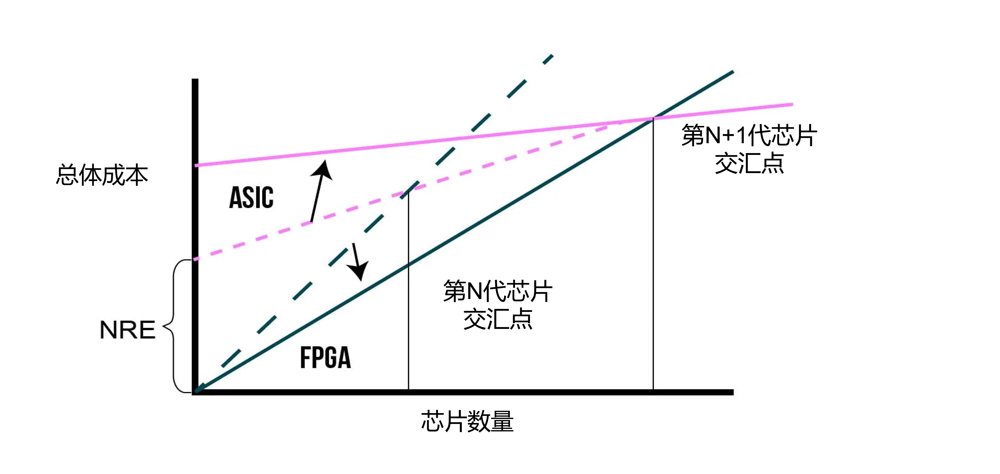
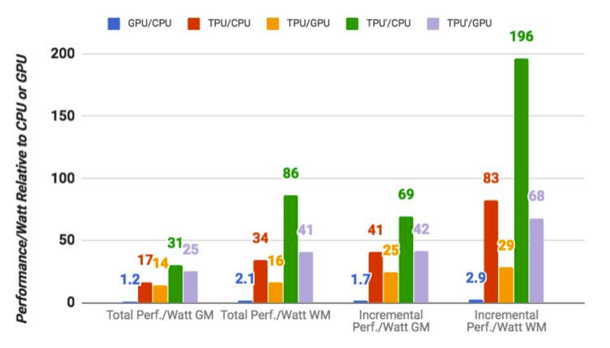
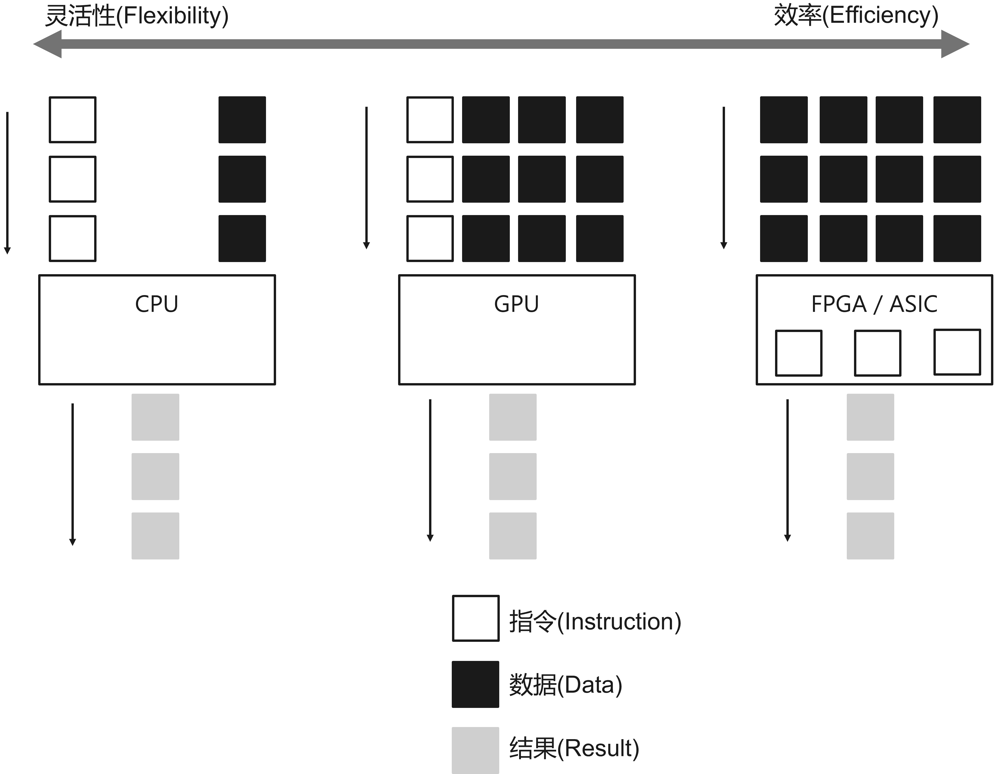

<!--Copyright © Microsoft Corporation. All rights reserved.
  适用于[License](https://github.com/microsoft/AI-System/blob/main/LICENSE)版权许可-->


# 8.3 部署


推理系统进行模型部署时，需要应对多样的框架，多样的部署硬件，以及持续集成和持续部署的模型上线发布等诸多的软件工程问题，本小节将围绕部署过程中涉及到的可靠性(Reliability)，可扩展性(Scalability)，灵活性(Flexibility)，版本 管理和移动端(Mobile)部署的挑战进行展开。

- [8.3 部署](#83-部署)
  - [8.3.1 可靠性(Reliability)和可扩展性(Scalability)](#831-可靠性reliability和可扩展性scalability)
  - [8.3.2 部署灵活性](#832-部署灵活性)
  - [8.3.3 模型转换与开放协议](#833-模型转换与开放协议)
  - [8.3.4 移动端部署](#834-移动端部署)
  - [8.3.5 推理芯片](#835-推理芯片)
    - [推理芯片架构对比](#推理芯片架构对比)
      - [神经网络推理芯片的动机和由来](#神经网络推理芯片的动机和由来)
      - [数据中心推理芯片：](#数据中心推理芯片)
      - [边缘推理芯片](#边缘推理芯片)
  - [8.3.6 配置镜像与容器进行云上训练或，推理与压测实验](#836-配置镜像与容器进行云上训练或推理与压测实验)
    - [8.3.6.1 实验目的](#8361-实验目的)
    - [8.3.6.2 实验环境](#8362-实验环境)
    - [8.3.6.3 实验原理](#8363-实验原理)
    - [8.3.6.4 实验内容](#8364-实验内容)
    - [8.3.6.5 实验报告](#8365-实验报告)
  - [8.3.7 推理系统简介](#837-推理系统简介)
  - [小结与讨论](#小结与讨论)
  - [参考文献](#参考文献)

## 8.3.1 可靠性(Reliability)和可扩展性(Scalability)

当推理系统部署到生产环境中，需要7x24小时不间断对用户提供相应的在线推理服务。在服务用户的过程中需要对不一致的数据，软件、用户配置和底层执行环境故障等造成的中断有弹性(Resilience)，能够快速恢复服务，达到一定的可靠性，保证服务等级协议。同时推理系统也需要优雅地扩展，进而应对生产环境中流量的增加的场景。
综上，推理系统在设计之初就需要考虑提供更好的扩展性。推理系统随着请求负载增加而自动和动态的部署更多的实例，进而才可以应对更大负载，提供更高的推理吞吐和让推理系统更加可靠。

如图所示，通过底层的部署平台（例如，Kubernetes）的支持，用户可以通过配置方便地描述和自动部署多个推理服务的副本，并通过部署前端负载均衡服务达到负载均衡，进而达到高扩展性，同时更多的副本也使得推理服务有了更高的可靠性。

<center> </center>
<center>图8-4-1. Kubernetes部署训练和推理服务</center>

例如，通过如下实例（[参考实例](https://kubernetes.io/docs/concepts/workloads/controllers/replicaset/)），我们可以利用Kubernetes副本集（ReplicaSet）机制，自动部署推理系统的多个实例：

先定义yaml文件，书写副本集（ReplicaSet）配置。
```yml
apiVersion: apps/v1
kind: ReplicaSet
metadata:
  name: frontend
  labels:
    app: dlinference
    tier: frontend
spec:
  # 根据自身需求修改副本数
  replicas: 3
  selector:
    matchLabels:
      tier: frontend
  template:
    metadata:
      labels:
        tier: frontend
    spec:
      containers:
      - name: inference-service
        image: xxx/gxx/gxx:v3
```

保持yaml文件，并提交到Kuberenetes
```
kubectl apply inference.yaml
```
之后可以查询当前部署的副本集
```dotnetcli
kubectl get rs
```
返回结果
```dotnetcli
NAME       DESIRED   CURRENT   READY   AGE
frontend   3         3         3       6s
```

## 8.3.2 部署灵活性

由于在模型训练的过程中，研究员和工程师不断尝试业界领先模型或不断尝试新的超参数和模型结构。由于框架开源，很多新的模型使用的框架类型和版本多样。推理系统需要支持多样的深度学习框架所保存的模型文件，并和其他系统服务进行交互。同时由于框架开源，社区活跃，不断的更新版本，对推理系统对不同版本的支持也提出了挑战。从性能角度考虑，大多数深度学习框架是为训练优化，有些框架甚至不支持在线推理。最后，在部署模型后，整个推理的流水线需要做一定的数据处理或者多模型融合(Ensemble)，推理系统也需要支持与不同语言接口和不同逻辑的应用结合。这些因素为推理系统提出了灵活性的挑战。通常有以下解决方法：

- 深度学习模型开放协议：通过ONNX等模型开放协议和工具，将不同框架的模型进行转换，优化和部署。
  - 跨框架模型转换。
- 接口抽象：将模型文件封装并提供特定语言的调用接口。
  - 提供构建不同应用逻辑的灵活性。
  - 提供不同框架的通用抽象。
- 远程过程调用(Remote Procedure Call)：可以将不同的模型或数据处理模块封装为微服务，通过远程过程调用(RPC)进行推理流水线构建。
  - 跨语言，远程过程调用。
- 镜像和容器技术：通过镜像技术解决多版本问题
  - 运行时环境依赖与资源隔离。

## 8.3.3 模型转换与开放协议

由于目前存在很多深度学习框架已经开源，并可以被开发者选用，同时很多公司自研深度学习框架，并通过相应的框架开源预训练模型。这样一种生态造成有人工智能业务的公司切换，微调和部署模型的工程成本较高，频繁切换模型和需要自研模型转换工具。为了缓解这个痛点，业界有相应的两大类工作来缓解当前问题。

- 模型中间表达标准([ONNX](https://onnx.ai/))：让框架，工具和运行时有一套通用的模型标准，使得优化和工具能够被复用。
  - ONNX是一种用于表示机器学习模型的开放格式。ONNX定义了一组通用运算符(机器学习和深度学习模型的构建块)，以及一种通用文件格式，使AI开发人员能够使用被各种框架、工具、运行时和编译器所支持的深度学习模型。
  - 同时，对ONNX支持较好的还有模型优化与部署的运行时框架[ONNX Runtime](https://onnxruntime.ai/)。
 
  如下图所示，ONNX标准成为衔接不同框架与部署环境(服务端和移动端)的桥梁，通过规范的中间表达，模型解析器，优化和后端代码生成的工具链得以复用，减少了开发与维护代价。

<center> </center>
<center>图8-4-2. 模型构建与部署</center>

- 模型转换工具([MMdnn](https://github.com/microsoft/MMdnn))：让模型可以打通不同框架已有工具链，实现更加方便的部署或迁移学习(Transfer Learning)。

如下图所示，模型可以通过中间表达(IR)和相应的对应框架的模型解析器(Parser)和对应框架的模型发射器(Emitter)实现跨框架转换。这样，例如某家机构如果开源了模型文件但是是通过TensorFlow训练的，而我想通过PyTorch对其进行迁移学习微调，则可以通过当前的方式进行模型的转换。

<center> </center>
<center>图8-4-3. 通过MMdnn模型转换(Model Convert) <a href="https://github.com/microsoft/MMdnn">图片引用</a></center>

接下来，我们通过如下[MMdnn实例](https://github.com/microsoft/MMdnn/blob/master/docs/keras2cntk.md)，体验和练习模型转换。假设读者已经安装MMdnn环境，或者通过Docker启动了环境。

1. 准备Keras模型：首先，准备好预训练的 Keras 模型。 有一个预先训练的模型提取器供框架执行此操作，或者读者通过其他模型动物园（Model Zoo）进行下载。进而提取Keras 模型的结构和权重。
   
```shell
$ mmdownload -f keras -n inception_v3

Keras model inception_v3 is saved in [./imagenet_inception_v3.h5]
```
2. Keras模型转换为CNTK格式：
当前通过一步方式进行模型转换，利用以下命令即可。
```shell
$ mmconvert -sf keras -iw imagenet_inception_v3.h5 -df cntk -om keras_to_cntk_inception_v3.dnn
.
.
.
# 转换成功后会打印以下日志
CNTK model file is saved as [keras_to_cntk_inception_v3.dnn], generated by [2c33f7f278cb46be992f50226fcfdb5d.py] and [2c33f7f278cb46be992f50226fcfdb5d.npy].
```

## 8.3.4 移动端部署

除了服务端的部署，深度学习模型的另一大场景就是移动端（Mobile）部署（我们也称作边缘（Edge）部署），随着越来越多的物联网设备智能化，越来越多的移动端系统中开始部署深度学习模型。移动端部署应用常常有以下场景：智能设备，智慧城市，智能工业互联网，智慧办公室等。

如图8-4-4所示，深度学习模型一般在云端进行训练，训练完成后，在边缘设备中，一种是通过无线方式互联的设备，这时通信带宽受限，以及不稳定，此类设备中可以直接部署模型推理，边缘服务器提供一定的数据缓存与模型缓存。还有一类是在边缘侧可以连接电源或网线的设备，这类设备通信稳定，可以适当部署更多模型在边缘服务器，进行推理。

<center> </center>
<center>图8-4-4. 边缘部署和云端部署关系 <a href="">图片引用</a></center>


如表8-3-1.所示，我们可以对比出边缘和云端的软硬件技术栈和任务的区别。

||边缘（设备/节点，网关，边缘服务器）|云|
|------|------|------|
|任务|推理|训练和推理|
|软件服务|Linux，Windows|AI平台，Kubernetes，计算引擎，云IOT核心|
|机器学习框架|TensorFlow Lite，NN API，Core ML等|TensorFlow，PyTorch，Scikit-Learn等|
|硬件加速器|Edge TPU，GPU，CPU|Cloud TPU，GPU，CPU|


<center>表8-3-1. 对比边缘端和云端技术栈 <a href="https://cloud.google.com/edge-tpu">表格引用</a></center>

在展开移动端部署内容前，我们先总结一下，云端部署模型特点与优势，这样才能对比出移动端部署的特点：
- 对功耗(Power Consumption)、温度、模型尺寸(Model Size)没有严格限制 
- 有用于训练和推理的强大硬件支持
- 集中的数据管理有利于模型训练
- 模型更容易在云端得到保护 
- 深度学习模型的执行平台和框架统一 

虽然云端部署深度学习模型有很多的好处，但同时我们也应该看到，云端部署推理服务也存在一定的问题：
- 云上提供所有人工智能服务成本高昂
- 部署严格的数据隐私(Data Privacy)问题
- 数据传输成本
- 推理服务依赖于网络的依赖
- 很难定制化模型

所以很多场景下模型推理也会考虑在端和云混合情况下提供AI服务。
那么在移动端部署存在哪些挑战呢？
- 严格约束功耗(Power Consumption)、热量、模型尺寸(Model Size)小于设备内存 
- 硬件算力对推理服务来说不足
- 数据分散且难以训练 
- 模型在边缘更容易受到攻击 
- DNN平台多样，无通用解决方案 

移动端部署各层的工作与挑战：
- 应用层算法优化：很多模型在考虑到移动端部署的苛刻资源约束条件下，都纷纷提供tiny版本供移动端部署和使用。
- 高效率模型设计：通过模型压缩，量化，神经网络结构搜索(NAS)等技术，提升移动端的模型效率。
- 移动端代表性框架：[TensorFlow Lite](https://www.tensorflow.org/lite)，[MACE](https://github.com/XiaoMi/mace)，[ONNX Runtime](https://onnxruntime.ai/)等框架更好的支持模型转换，模型优化与后端生成。
- 移动端芯片：针对推理负载相比训练负载的不同，提供更加高效的低功耗芯片支持，例如[Google Edge TPU](https://cloud.google.com/edge-tpu), [NVIDIA Jetson](https://www.nvidia.com/en-us/autonomous-machines/embedded-systems/)等。

一般我们部署移动端模型的过程中，涉及以下步骤，在每个步骤中一般有相应的工具或者优化算法所支持。

移动端模型部署实践与常见步骤：

1. 设计与选择模型
   - 模型设计之初，针对模型结构和超参数的设计，就可以考虑移动端的约束（内存，浮点运算量，功耗等），这样就可以对[移动端资源指导的搜索空间进行剪枝](https://ieeexplore.ieee.org/document/9402095)，在模型设计与训练阶段就提前规避和减少返工流程和节省训练资源。
   - 在选择预训练好的模型时，用户可以通过模型动物园(Model Zoo)挑选合适的模型。用户一般可以选择针对移动端所训练或者压缩出的经典模型，一般以-tiny,-mobile和-lite等后缀进行命名说明
2. 模型精简
   - 可以通过[模型压缩(Model Compression)](https://pytorch.org/tutorials/intermediate/pruning_tutorial.html)减少权重，[模型量化(Model Quantization)](https://pytorch.org/docs/stable/quantization.html)减少数据精度。
3. 模型文件格式转换
   - 当前大多数框架都是为训练设计，在性能和对移动端优化的支持上没有特殊的设计，同时移动端部署的系统框架和训练侧不一致，需要有相应的工具（MMdnn，ONNX等）进行格式转换。
4. 移动端代码生成与优化
   - 同时移动端部署环境，语言与接口多样，所以需要有特定的工具，或者编译器（例如，TVM，NNfusion等）进行模型文件格式转换和后端优化代码生成。
5. 部署
   - 运行时可以通过硬件或软件的稀疏性等机制，在运行时进行加速。
   - 运行时也可以通过针对移动端设计的内存管理策略优化内存消耗。

如图8-4-5.Jiasi等对边缘侧部署做过[相关综述](https://ieeexplore.ieee.org/stamp/stamp.jsp?tp=&arnumber=8763885)，通过1~5子图可以观察到边缘部署和推理方式常见的为以下几种：
1. 设备上计算：如图（1）所示，将模型完全部署在设备端。很多工作的方向是在这个假设下，如何优化模型执行降低延迟。例如，通过1）模型结构设计（MobileNets）；2）通过模型压缩，量化等；3）针对NN的ASIC设计。
2. 安全计算 + 完全卸载到云端：如图（2）所示，此部署模型将模型部署与数据中心，边缘侧通过安全通信协议将请求发送到云端，云端推理返回结果，相当于将计算卸载（Offloading）到云端，这种方式好处是利用云端安全性更有保障，适合部署端侧无法部署的大模型。完全卸载到云端有可能违背实时性的需求。过渡方法是可以将模型切片，移动端和边缘端各有部分模型切片。
3. 边缘设备+云端服务器：一部分的卸载方式是利用深度学习的结构特点，将一部分层切分放置在设备端进行计算，其他放置在云端，这种方式也被称作深度学习切片。这种方式一定程度上能够比2降低延迟，由于其利用了边缘设备的算力，但是与云端通信和计算还是会带来额外开销。这种方式的动机是，[经过前几层的计算后，中间结果变得非常。有些工作](https://ieeexplore.ieee.org/document/8493499)，例如[Neurosurgeon](https://dl.acm.org/doi/10.1145/3037697.3037698)智能决策将模型切片后的放置。
4. 分布式计算：如图（5）所示，此类工作从分布式系统角度抽象问题，深度学习计算可以在多个辅助边缘设备上切片。例如，[MoDNN](https://ieeexplore.ieee.org/document/7927211) 和[DeepThings](https://ieeexplore.ieee.org/document/8493499) 通过细粒度的切片策略，将模型切片部署在清理设备，例如树莓派和安卓手机，进行执行。切片策略根据设备计算能力，内存约束。在运行期，DeepThings输入数据通过负载均衡策略进行调度，MoDNN抽象了一层类MapReduce计算模型进行调度。
5. 跨设备卸载（Offloading）：如图（4）所示，[DeepDecision](https://ieeexplore.ieee.org/document/8485905) , [Xukan, et al.](https://dl.acm.org/doi/10.1145/3097895.3097903)和[MCDNN](https://dl.acm.org/doi/10.1145/2906388.2906396)通过一种考虑约束（例如，网络延迟和带宽，设备功耗，成本）优化的卸载方法。这些决策是基于经验性的权衡功耗，准确度，延迟和输入尺寸等度量和参数，不同的模型可以从当前流行的模型中选择，或者通过知识蒸馏，或者通过混合和匹配的方式从多个模型中组合层。图中实例展示了一个卸载实例，较强的模型放在边缘服务器，较弱模型放置在设备。

<center> </center>
<center>图8-4-5. 边缘部署和推理方式总览 <a href="https://ieeexplore.ieee.org/stamp/stamp.jsp?tp=&arnumber=8763885">图片引用</a></center>

## 8.3.5 推理芯片

[Chip Design Made Easy](https://en.wikibooks.org/wiki/Chip_Design_Made_Easy)书中曾经将[芯片架构设计和建筑架构设计类比（Analogy of Chip Design Architecture Vs Building Architecture.）](https://en.wikibooks.org/wiki/Chip_Design_Made_Easy#Analogy_of_Chip_Design_Architecture_Vs_Building_Architecture.)。为什么要类比建筑架构？ 为了更好地理解芯片设计的概念，由于我们对建筑架构非常熟悉，那么我们很容易映射芯片设计架构，如图8-4-7所示。我们首先提供建筑物的平面图，同样我们提供芯片的平面图。基于连通性/可访问性，我们放置我们的房间，同样我们有放置块的约束。就像我们用砖块、窗户和其他模块建造建筑物一样，对于芯片设计，我们有组件库，就像预先设计的砖块，用于特定功能。现在让我们尝试了解我们建筑物中的电力结构或电气连接。最初，我们为我们的建筑制定了一个电气计划，我们要求我们所有的电气设备都需要供电。与此类似，我们有芯片功率要求。所需的电源通过电源焊盘提供，通过环形拓扑在芯片的所有角落均匀分布，并且电源必须到达所有标准单元（用于芯片设计的砖），这是在芯片设计中称为电网拓扑。还有很多其他方面可以进行类比。

<center> </center>
<center>图8-4-6. 芯片架构设计和建筑架构设计类比 <a href="">图片引用</a></center>

那么以此类比，我们接下来介绍一些深度学习推理芯片，背后是基于工业界希望设计并使用每单位计算性能，功耗和成本最低的芯片的诉求。这就像建筑行业在满足居住的功能性需求（对应芯片性能），不断提升工艺，降低成本和能耗。同时我们看到由于地皮空间有限（类比芯片晶圆），厂商需要根据功能需求（是酒店，还是公寓，还是学校），取舍一些功能间（类比去掉一些不需要支持的功能，排布更多计算单元），进而达到针对特定领域（酒店，学校，住宅）的最优设计。

### 推理芯片架构对比

深度学习模型常常部署在以下几种芯片中进行推理，不同的芯片有不同的特点，如图8-4-7所示。

- CPU部署：也有很多推理场景选择使用CPU推理，其中有几点原因。（1）推理阶段批尺寸小，造成浮点运算量低，常常CPU能满足需求。(2) CPU的x86指令集架构和操作系统对软件的管理更加成熟，虚拟化也做的更好，更容易做装箱甚至数据中心混部推理负载。（3）软件站与微服务其他传统软件负载兼容性更好，减少数据序列化开销。（4）硬件层面减少跨PCIe搬运到GPU的开销。所以如果GPU推理本身延迟和吞吐指标上没能超越现有CPU，常常推理系统也会选择使用CPU进行推理
- GPU部署：如图8-4-7，相比CPU，NVIDIA的GPU采用SIMT的架构，其抽象调度单位为束（Warp），也就是一组线程按SIMD模型执行，进一步精简指令流水线让出更多面积放入计算核，同时减少指令访存。同时我们从图中可以看到，CPU面向单线程尽可能降低延迟，同时其线程上下文切换一般由软件辅助完成同时要保存寄存器造成访存开销，则其尽可能让当前线程多执行一段，则线程的访存变为了同步等待。GPU则采取另一种设计，在线程要访存的时间窗口让给其他线程，同时由硬件支持线程切换尽可能不产生访存，这样虽然会造成单线程一定拖延（Delay），但是其靠计算屏蔽IO的思想，让整体线程的完工时间减低。这种模式非常适合矩阵运算，假设每个线程完成局部运算，我们只拿一个线程结果没有意义，而是需要整体运算结果，所以我们宁愿单个线程变慢但是整体一批线程更快完成。
- ASIC部署：如图8-4-7，相比GPU，ASIC一般可以根据负载特点设计脉动阵列（Systolic Array）架构，在多数据流的基础之上，进一步降低访存，尽量在片上做更多的计算缓存中间结果，这样进一步提升芯片吞吐与降低延迟。我们可以通俗的理解为，将原来指令流水线执行完成单指令后的访存（Memory Access）步骤去掉，连接更多ALU，或通过片上缓存持续利用当前ALU，直到不得已才回写内存，这样就将之前的数据流运算尽可能在片上完成。
- FPGA部署：相比ASIC和GPU，通过FPGA部署也像一种专用芯片部署，获取更好的性能能耗比。但是相比ASIC两者主要区别，一般可以通过规模去区分和考虑，如图8-4-8中，在一定规模下FPGA更加节省成本，而超过一定规模ASIC更低的成本。所以我们会看到数据中心中，有些公司会选择FPGA，而有些公司会选择制作专有芯片。

<center> </center>
<center>图8-4-7.  对比CPU，GPU，ASIC推理芯片架构与计算模型 <a href="https://en.wikipedia.org/wiki/Flynn%27s_taxonomy">图片引用1</a>  <a href="https://arxiv.org/ftp/arxiv/papers/1704/1704.04760.pdf">，2</a>  <a href="https://dl.acm.org/doi/pdf/10.1145/3460776">，3</a>  <a href="https://developer.nvidia.com/blog/cuda-refresher-reviewing-the-origins-of-gpu-computing/">，4</a>  <a href="http://www.eecs.harvard.edu/~htk/publication/1982-kung-why-systolic-architecture.pdf">，5</a></center>


如图8-4-8所示，FPGA 与 ASIC 交叉点。该图表显示了总费用与单位数量的关系。 通常我们可以通过下面[公式](https://www.eng.auburn.edu/~nelsovp/courses/elec5250_6250/slides/Lecture%202%20-%20ASIC%20Cost.pdf)计算ASIC成本：

$Total \quad Cost = NRE + (P \times RE) \\$
$NRE = 固定成本, 非经常性工程成本$
$RE = 变化的，每个芯片的经常性成本$
$P = 芯片数量$

其中NRE成本一般有：EDA工具和培训，软硬件设计成本，模拟，测试，ASIC供应商等成本。RE成本一般有：晶元成本，晶元处理，晶元尺寸，封装成本等。

ASIC 具有极高的非经常性工程（NRE 成本），NRE 代表非经常性工程（Non-Recurring Engineering）成本，高达数百万。但是，实际的每个芯片成本可能很低。由于 FPGA，没有 NRE 成本。但是，ASIC的坡度更平。也就是说，小批量的 ASIC 原型设计是高昂的。然而，在数量巨大的情况下，ASIC相比FPGA的成本却小。 由于 FPGA，集成电路每个芯片成本明显更高，因此与 ASIC 相比，它在大量生产时显得成本过高。

<center> </center>
<center>图8-4-8.  对比ASIC与FPGA的选型 <a href="https://en.wikipedia.org/wiki/Flynn%27s_taxonomy">图片引用1</a>  <a href="">图片引用</a></center>


#### 神经网络推理芯片的动机和由来

在学术界, 神经网络芯片在2010年左右开始萌芽。The International Symposium on Computer Architecture(ISCA) 2010上，来自法国国立计算机及自动化研究院(INRIA Saclay)的Olivier Temam教授做了["The Rebirth of Neural Networks"](https://pages.saclay.inria.fr/olivier.temam/homepage/ISCA2010web.pdf)的报告。在此次报告中，Olivier Temam指出了1990s像英特尔(Intel)等公司构建硬件神经网络商用系统的应用场景局限性，提出人工神经网网络(Artificial Neural Network)的缺陷容忍(Defect Tolerance)特点，和深度神经网络(Deep Neural Network)的趋势，提出神经网络加速器设计的方向。在12年的ISCA上，Olivier Temam教授提出人工智能(AI)加速器的设计["A defect-tolerant accelerator for emerging high-performance applications"](https://dl.acm.org/doi/10.1145/2366231.2337200)，利用人工神经网网络(Artificial Neural Network)的缺陷容忍特性，提出空间扩展网络(Spatially Expanded Network)相比时分复用(Time-Multiplexed)架构提升能效的优势，并评估了缺陷容忍(Defect Tolerance)效果。在前瞻性的预判之后，Olivier Temam与中科院计算所陈天石，陈云霁的DianNao系列工作。

在工业界，以Google为代表性的工作也在较早的初期在生产环境遇到和对未来神经网络芯片较早进行布局和研发。例如，Google许多架构师认为，成本-能源-性能的重大改进现在必须来自特定领域的硬件。通过针对深度学习设计的芯片，可以加速神经网络 (NN) 的推理。相比CPU的时变([time-varying](https://www.ibm.com/docs/en/zos/2.2.0?topic=time-cpu-variation))优化，神经网络芯片提供更加确定性的模型，有助于保证低延迟，在保证延迟的同时超越之前基准的平均吞吐量，同时精简不必要的功能，让其有较小的功耗。

我们以TPU为例介绍推理芯片一般的设计思路，TPU的推理芯片基于以下的[观察和设计](http://meseec.ce.rit.edu/551-projects/fall2017/3-4.pdf)：
1. 更加简约的硬件设计用于改善空间（Space）利用和功耗（Power Consumption）:
   1. 没有支持：缓存（Caches）， 分支预测（Branch Prediction）， 乱序执行（Out-of-order Execution），多进程（Multiprocessing），推测预取（Speculative Prefetching），地址合并（Address Coalescing），多线程（Multithreading），上下文切换（Context Switching） 。
   2. 极简主义设计（通过没有支持上面提到的功能）很有用且满足需求，因为 TPU 设计之初是只需要运行神经网络推理预测。通过省出来的空间将更多的空间排布计算器件，同时减少不需要功能的能耗，整体提升性能每瓦特（Performance/Watt），进而间接提升性能每总计拥有成本（Performance/TCO）。
2. TPU 芯片的大小是同时期（2017年）其他芯片的一半：这部分是归功于简化控制逻辑得以达成。例如，2017年采用28 nm 工艺，裸片尺寸（Die Size） ≤ 331 mm。

那么为何这些公司和学术界有动力去推出推理芯片？那么我们可以通过[2017年的TPU论文](https://arxiv.org/ftp/arxiv/papers/1704/1704.04760.pdf)中披露的数据和分析中一探究竟，以及了解推理芯片大家关注的核心评测指标。

<center> </center>
<center>图8-4-9. 相对性能每瓦特（Performance/Watt (TDP)），对比NVIDIA K80 GPU服务器(蓝色)，TPU服务器(红色)相比于Intel Haswell CPU服务器。以及TPU服务器相比于GPU服务器(橘红色). <a href="https://arxiv.org/ftp/arxiv/papers/1704/1704.04760.pdf">图片引用</a></center>

接下来我们分析数据中心推理芯片的设计权衡原由，进而解释为什么当前很多公司要重新设计针对深度学习的推理芯片。通过TPU披露的信息，对数据中心来说，当购买成千上万的计算机时，成本性能（Cost-Performance）的考量胜过单纯考虑性能。对数据中心衡量成本来说，最佳的指标是总计拥有成本（Total Cost of Ownership）简称(TCO)。当前实际购买支付价格也受到公司间谈判的影响。由于商务原因，Google TPU团队没有披露当前价格信息和数据。但是，功耗（Power）和TCO相关，TPU团队可以披露每个服务器的瓦特数，所以使用性能每瓦特（Performance/Watt）做为代理指标替代性能每总计拥有成本（Performance/TCO）。
图8-4-5比较的是整个服务器，而不是单一的晶圆（Die）。图中示了 K80 GPU 和 TPU 相对于 Haswell CPU 的几何（Geometric）和加权平均（Weighted Mean）性能/瓦特。其提出了两种不同的性能/瓦特计算。第一个（“总（Total）”）当计算 GPU 和 TPU 的性能/瓦特时，包括CPU服务器主机消耗的功耗。第二个（“增量（Incremental）”）事先减去GPU 和 TPU 的服务器来CPU服务器主机。对于总性能/瓦特，K80 服务器是 1.2 - 2.1X 相比于Haswell服务器。对于增量性能/瓦特，当Haswell服务器功率省略，K80服务器为1.7-2.9X。TPU 服务器的总性能/瓦特比 Haswell 高 17 到 34 倍，这使得 TPU 服务器达到 14 到 16倍于 K80 服务器的性能/瓦特。相对增量性能/瓦特（这是Google 当时的定制 ASIC 的初衷）TPU 相比 Haswell 有41到83倍提升，这将 TPU 提升到性能/瓦特的 25 到 29 倍于K80 GPU。
从以上数据我们可以看到，对数据中心追求的TCO，每一代的新的数据中心推理芯片在不断朝着更高的TCO而演进。

推理系统最终底层还是通过编译器将深度学习模型翻译成矩阵运算，并在芯片中执行相应的[乘积累加运算(MAC)](https://en.wikipedia.org/wiki/Multiply%E2%80%93accumulate_operation)，我们可以通过以下一些代表性的芯片了解从硬件角度是如何针对推理任务的特点进行推理芯片端的计算与优化支持。

#### 数据中心推理芯片：

- [Google TPU (Tensor Processing Unit)系列ASIC(Application-specific integrated circuit)芯片](https://dl.acm.org/doi/10.1145/3079856.3080246) 
  - Google在2015年推出了针对推理场景的TPUv1，之后再2017你那针对训练场景的TPUv2，TPUv3是在TPUv2基础上做了进一步的性能提升。目前TPU在[Google Cloud](https://cloud.google.com/tpu)中作为一种定制设计的机器学习专用集成电路(Application-Specific Integrated Circuit)，并已经广泛应用于Google的产品，如翻译，照片，搜索和Gmail等。
  - [TPUv1](https://arxiv.org/ftp/arxiv/papers/1704/1704.04760.pdf)的很多特点适合推理场景：
    - 缘起于2013年Google数据中心中的工作负载需求。语音识别服务希望数据中心能提供两倍的算力满足用户需求，但是传统的CPU如果实现这个需求非常昂贵。设计初衷是提供相比GPU的10倍性价比(Cost-Performance)。
    - 确定性(Deterministic)的执行模型，有助于保持推理场景请求的P99th延迟满足SLA。因为其精简了CPU和GPU的很多影响确定性执行的优化（缓存，乱序执行，多线程，多进程，预取等）
    - 因为精简了以上优化，也同时让即使拥有大量[乘积累加运算(MAC)](https://zh.wikipedia.org/wiki/%E4%B9%98%E7%A9%8D%E7%B4%AF%E5%8A%A0%E9%81%8B%E7%AE%97)和更大片上存储器(On-Chip Memory)，TPU也能拥有较小的功耗。
    - 仅支持前向传播用于推理，矩阵乘，卷积和特定的激活函数算子。不需要考虑求导，存储中间结果用于反向传播和对多样的损失函数支持。这样使得硬件更为精简高效。
    - TPUv1作为加速器(Accelerator)通过PCIe总线(Bus)与服务器连接，同时主机可以发送指令给TPU。
- [中科院计算所 DianNao系列ASIC芯片](https://dl.acm.org/doi/10.1145/2654822.2541967#:~:text=We%20show%20that%20it%20is,accelerator%20is%20117.87x%20faster)
  - DianNao系列工作提出了一系列定制的神经网络加速器的设计方案。首先从加速器[DianNao](https://dl.acm.org/doi/10.1145/2541940.2541967)开始，其提出之前的机器学习加速器没有关注到当前卷积神经网络和深度神经网络体积大占用内存高的特点，重点关注内存对加速器设计，内存和功耗的影响。之后展开[DaDiannao](https://ieeexplore.ieee.org/document/7011421)提出多片（Multi-Chip）设计，通过多片设计，将卷积神经网网络和深度神经网络模型能够放置在片上存储(On Chip Storage)。之后的加速器[ShiDiannao](https://ieeexplore.ieee.org/document/7284058)工作将卷积神经网络加速器与传感器(CMOS或CCD传感器)相连，从而减少访存(DRAM access)开销。第四个加速器[PuDiannao](https://dl.acm.org/doi/10.1145/2775054.2694358)工作将加速器从只支持特定神经网络扩宽到支持7种常规机器学习算法。
- NVIDIA系列GPU(Graphics Processing Unit)
  - 数据中心芯片：[A100](https://www.nvidia.com/en-us/data-center/a100/)引入了适合推理的功能来优化工作负载。它加速了从FP32到INT4的全方位精度。 例如，[多实例GPU (MIG)](https://www.nvidia.com/en-us/technologies/multi-instance-gpu/)技术提供了GPU虚拟化支持，对数据中心负载混合部署，提升资源利用率有很大帮助。同时提供稀疏性优化支持以提升性能。
  - 移动端嵌入式系统：例如，[Jetson](https://www.nvidia.com/en-us/autonomous-machines/embedded-systems/)是NVIDIA推出的边缘AI硬件与软件栈。Jetson包括Jetson 模组（小巧的高性能计算机）、可加速软件的开发套间JetPack SDK，以及包含传感器、SDK、服务和产品的完整生态系统。通过Jetson进行嵌入式AI的开发能提升开发速度。Jetson具有和NVIDIA其他AI软件兼容的特点，能为提供在边缘端AI所需的性能和功耗。
- [现场可编程门阵列(Field-Programmable Gate Array)](https://www.intel.com/content/www/us/en/developer/learn/course-deep-learning-inference-fpga.html)：FPGA提供了一种极低延迟、灵活的架构，可在节能解决方案中实现深度学习加速。FPGA 包含一组可编程逻辑块和可重构互连的层次结构。与其他芯片相比，FPGA 提供了可编程性和性能的结合。FPGA可以实现实时推理请求的低延迟。不需要异步请求（批处理）。批处理可能会导致更高的延迟，因为需要处理更多数据。因此，与CPU和GPU处理器相比，延迟可以低很多倍。例如，微软Azure就提供了[FPGA推理服务](https://docs.microsoft.com/en-us/azure/machine-learning/how-to-deploy-fpga-web-service)。Azure 上的FPGA基于英特尔的 FPGA 设备，数据科学家和开发人员使用这些设备来加速实时AI推理。

<center> </center>
<center>图8-4-10. 对比CPU, GPU和FPGA/ASIC</center>

通过图中我们可以看到，相比通用计算CPU，由于在深度学习专用计算场景，指令更加确定，更多的片上空间可以节省用于放置计算，同时可以通过硬件逻辑减少指令流水线的加载代价，提升数据流处理的吞吐量。

#### 边缘推理芯片
除了数据中心的推理芯片，我们也可以观察一些边缘端的推理芯片的特点。

我们以TPU为例进行对比：
||[Edge TPU](https://cloud.google.com/edge-tpu)|[Cloud TPU](https://cloud.google.com/tpu/docs/system-architecture-tpu-vm)|
|------|------|------|
|类型|推理加速器|训练和推理加速器|
|算力|4 TOPS, 2 TOPS per watt|275 max TFLOPS TPUV4每核 * 2核|
|数值精度|Int8|bfloat16|
|IO接口|PCIe，USB|x16 PCIE gen3|
|其他|[max 16 KB Flash memory with ECC 2 KB RAM](https://us.amazon.com/Google-Coral-Accelerator-coprocessor-Raspberry/dp/B07R53D12W)|互联，虚拟机，安全模型，32GB HBM|


<center>表8-3-1. 对比边缘端和云端技术栈 <a href="https://cloud.google.com/edge-tpu">表格引用</a></center>

Edge TPU 是由 Google 设计的小型 ASIC，可为低功耗设备提供高性能推理。 例如，它可以以几乎 400 FPS 的速度执行 MobileNet V2，并且较为节能。Cloud TPU 在 Google 数据中心中运行，因此提供了非常高的计算速度如表所示算力。 当训练大型、复杂的模型时，或者模型部署于云端大规模服务，Cloud TPU 是理想的选择。然而，Edge TPU 专为小型低功耗设备而设计，主要用于模型推理。 因此，尽管 Edge TPU 的计算速度只是 Cloud TPU 速度的一小部分，但当您需要极其快速和节能的设备上推理时，Edge TPU 是理想的选择。


## 8.3.6 配置镜像与容器进行云上训练或，推理与压测实验

配置容器(Container)进行云上训练或推理。实验目的：配置使用容器，进行自定义深度学习推理。并进行性能和压力测试。读者可以参考Lab5中的相应[实例](https://github.com/microsoft/AI-System/blob/main/Labs/BasicLabs/Lab5/alpine.md)，学会部署Docker容器。也可以根据Lab5中的[实例](https://github.com/microsoft/AI-System/blob/main/Labs/BasicLabs/Lab5/inference.md)，进行推理服务的容器部署。

### 8.3.6.1 实验目的

1. 理解Container机制
2. 使用Container进行自定义深度学习训练或推理

### 8.3.6.2 实验环境

* PyTorch==1.5.0
* Docker Engine

### 8.3.6.3 实验原理

计算集群调度管理，与云上训练和推理的基本知识

### 8.3.6.4 实验内容

***实验流程图***

<center> </center>
<center>图8-4-11. 实验流程图</center>


***具体步骤***

1.	安装最新版Docker Engine，完成实验环境设置

2.	运行一个alpine容器

    1. Pull alpine docker image
    2. 运行docker container，并列出当前目录内容
    3. 使用交互式方式启动docker container，并查看当前目录内容
    4. 退出容器

3.	Docker部署PyTorch训练程序，并完成模型训练

    1. 编写Dockerfile：使用含有cuda10.1的基础镜像，编写能够运行MNIST样例的Dockerfile
    2. Build镜像
    3. 使用该镜像启动容器，并完成训练过程
    4. 获取训练结果

4.	Docker部署PyTorch推理程序，并完成一个推理服务

    1. 克隆TorchServe源码
    2. 编写基于GPU的TorchServe镜像
    3. 使用TorchServe镜像启动一个容器
    4. 使用TorchServe进行模型推理
    5. 返回推理结果，验证正确性

5.  延迟和吞吐量实验

    1. 读者可以通过相关工具（例如，[JMeter](https://jmeter.apache.org/usermanual/curl.html)）对推理服务进行性能测试。关注响应延迟和吞吐量等性能指标。

### 8.3.6.5 实验报告

***实验环境***

||||
|--------|--------------|--------------------------|
|硬件环境|CPU（vCPU数目）|&nbsp; &nbsp; &nbsp; &nbsp; &nbsp; &nbsp; &nbsp; &nbsp; &nbsp; &nbsp; &nbsp; &nbsp; &nbsp; &nbsp; &nbsp; &nbsp; &nbsp; &nbsp; &nbsp; &nbsp; |
||GPU(型号，数目)||
|软件环境|OS版本||
||深度学习框架<br>python包名称及版本||
||CUDA版本||
||||

***实验结果***

1.	使用Docker部署PyTorch MNIST 训练程序，以交互的方式在容器中运行训练程序。提交以下内容：

    1. 创建模型训练镜像，并提交Dockerfile
    2. 提交镜像构建成功的日志
    3. 启动训练程序，提交训练成功日志（例如：MNIST训练日志截图）

2.	使用Docker部署MNIST模型的推理服务，并进行推理。提交以下内容：
    1. 创建模型推理镜像，并提交Dockerfile
    2. 启动容器，访问TorchServe API，提交返回结果日志
    3. 使用训练好的模型，启动TorchServe，在新的终端中，使用一张图片进行推理服务。提交图片和推理程序返回结果截图。

***参考代码***

本次实验基本教程:

* [1. 实验环境设置](https://github.com/microsoft/AI-System/blob/main/Labs/BasicLabs/Lab5/setup.md)
* [2. 运行你的第一个容器 - 内容，步骤，作业](https://github.com/microsoft/AI-System/blob/main/Labs/BasicLabs/Lab5/alpine.md)
* [3. Docker部署PyTorch训练程序 - 内容，步骤，作业](https://github.com/microsoft/AI-System/blob/main/Labs/BasicLabs/Lab5/train.md)
* [4. Docker部署PyTorch推理程序 - 内容，步骤，作业](https://github.com/microsoft/AI-System/blob/main/Labs/BasicLabs/Lab5/inference.md)
* [5. 进阶学习](https://github.com/microsoft/AI-System/blob/main/Labs/BasicLabs/Lab5/extend.md)
* [6. 常见问题](https://github.com/microsoft/AI-System/blob/main/Labs/BasicLabs/Lab5/issue.md)

***参考资料***

* [Docker Tutorials and Labs](https://github.com/docker/labs/)
* [A comprehensive tutorial on getting started with Docker!](https://github.com/prakhar1989/docker-curriculum)
* [Please-Contain-Yourself](https://github.com/dylanlrrb/Please-Contain-Yourself)
* [Create TorchServe docker image](https://github.com/pytorch/serve/tree/master/docker)


## 8.3.7 推理系统简介

我们总结以下常用的推理系统与服务，读者可以根据部署场景和需求选择适合的推理系统进行部署和实用。

- 服务端推理系统
  - 本地部署（On-Premises Deployment）推理系统
    - 对 NVIDIA GPU支持较好的[NVIDIA TensorRT](https://developer.nvidia.com/tensorrt)和[Triton推理服务器](https://github.com/triton-inference-server/server)：是一款用于高性能深度学习推理的 SDK，包括深度学习推理优化器和运行时，可为推理应用程序提供低延迟和高吞吐量。对NVIDIA系列加速器原生支持较好，性能较高。深度学习模型需要做一定的模型转换才能部署到TensorRT中。之后NVIDIA又推出了[Triton推理服务器](https://github.com/triton-inference-server/server)，Triton Inference Server提供了针对 CPU 和 GPU 优化的云和边缘推理解决方案。Triton 支持 HTTP/REST 和 GRPC 协议，允许远程客户端请求对服务器管理的任何模型进行推理。 对于边缘部署，Triton 可作为带有 C API 的共享库使用，允许将 Triton 的全部功能直接包含在应用程序中。其提供以下特征：主流深度学习模型和框架支持，机器学习框架支持，并行模型执行，动态批尺寸，自定义扩展后端，模型流水线，HTTP/REST/GPRC协议支持，C/Java/Python支持，暴露性能监控指标，模型版本管理。
    - 对TensorFlow模型支持较好的[TensorFlow Serving（TFX）](https://www.tensorflow.org/tfx/guide/serving)：TensorFlow Serving 是专为生产环境而设计灵活、高性能的机器学习模型推理。TensorFlow Serving 可以轻松部署新算法和实验，同时保持相同的服务器架构和API。对基于TensorFlow训练的模型原生支持较好，同时工具链完善，经过多年考验较为成熟。
    - 对PyTorch模型支持较好的[TorchServe](https://pytorch.org/serve/)：对基于PyTorch训练的模型原生支持较好TorchServe 是一种高性能、灵活且易于使用的工具，用于在生产中服务和扩展 PyTorch 模型。
    - [ONNX Runtime（ORT）](https://onnxruntime.ai/)：ONNX Runtime通过对多种框架统一的中间表达支持，可以服务推理更多样的框架，更大的模型推理任务。
  - 云（Cloud）推理系统
    - Azure Machine Learning：与Azure各种云服务集成较好，适合基础架构部署于Azure的客户选用。
    - AWS SageMaker：与Azure各种云服务集成较好，适合基础架构部署于Azure的客户选用。
- 边缘（Edge）端推理库: 相比云端，边缘端移动端的很多推理系统常常以库的形式内嵌到APP中被调用。
  - Android平台：[TensorFlow Lite](https://www.tensorflow.org/lite)是一个移动库，用于在移动（Mobile）设备、微控制器（Microcontrollers）和其他边缘设备上部署模型。Google针对Android平台提出的推理系统，对Andriod平台和生态支持较好。
  - IOS平台：[Core ML](https://developer.apple.com/documentation/coreml)，苹果针对IOS平台提出的推理库，对IOS平台和生态支持较好。Core ML 将机器学习算法应用于一组训练数据以创建模型。用户使用模型根据新的输入数据进行预测。创建模型后，将其集成到用户的应用程序中并将其部署到用户的设备上。应用程序使用 Core ML API 和用户数据进行预测以及训练或微调模型。
  - [Triton推理服务器](https://github.com/triton-inference-server/server)：支持以库的形式内嵌到应用程序中。

## 小结与讨论

本小节主要围绕推理系统的部署展开讨论，推理系统在部署模型时，需要考虑部署的扩展性，灵活性，版本管理，移动端部署等多样的问题，我们在本章针对这些问题总结了业界相关代表性的系统和方法。未来期望读者能以全生命周期的视角看待人工智能的训练与部署，这样才能真正的做好人工智能的工程化实践。

## 参考文献

- [Park, Jongsoo et al. “Deep Learning Inference in Facebook Data Centers: Characterization, Performance Optimizations and Hardware Implications.” ArXiv abs/1811.09886 (2018): n. pag.](https://arxiv.org/abs/1811.09886)
- [Crankshaw, Daniel et al. “Clipper: A Low-Latency Online Prediction Serving System.” NSDI (2017).](https://www.usenix.org/system/files/conference/nsdi17/nsdi17-crankshaw.pdf)
- [Denis Baylor, Eric Breck, Heng-Tze Cheng, Noah Fiedel, Chuan Yu Foo, Zakaria Haque, Salem Haykal, Mustafa Ispir, Vihan Jain, Levent Koc, Chiu Yuen Koo, Lukasz Lew, Clemens Mewald, Akshay Naresh Modi, Neoklis Polyzotis, Sukriti Ramesh, Sudip Roy, Steven Euijong Whang, Martin Wicke, Jarek Wilkiewicz, Xin Zhang, and Martin Zinkevich. 2017. TFX: A TensorFlow-Based Production-Scale Machine Learning Platform. In Proceedings of the 23rd ACM SIGKDD International Conference on Knowledge Discovery and Data Mining (KDD '17). Association for Computing Machinery, New York, NY, USA, 1387–1395. DOI:https://doi.org/10.1145/3097983.3098021](https://research.google/pubs/pub46484/)
- [Olston, Christopher et al. “TensorFlow-Serving: Flexible, High-Performance ML Serving.” ArXiv abs/1712.06139 (2017): n. pag.](https://arxiv.org/abs/1712.06139)
- [Jeong-Min Yun, Yuxiong He, Sameh Elnikety, and Shaolei Ren. 2015. Optimal Aggregation Policy for Reducing Tail Latency of Web Search. In Proceedings of the 38th International ACM SIGIR Conference on Research and Development in Information Retrieval (SIGIR '15). Association for Computing Machinery, New York, NY, USA, 63–72. DOI:https://doi.org/10.1145/2766462.2767708](https://www.microsoft.com/en-us/research/wp-content/uploads/2016/02/samehe-2015sigir.optimalaggregation.pdf)
- [Cheng, Yu et al. “A Survey of Model Compression and Acceleration for Deep Neural Networks.” ArXiv abs/1710.09282 (2017): n. pag.](https://arxiv.org/abs/1710.09282)
- [CSE 599W: System for ML - Model Serving](https://dlsys.cs.washington.edu/)
- https://developer.nvidia.com/deep-learning-performance-training-inference 
- [Han, Song et al. “Deep Compression: Compressing Deep Neural Network with Pruning, Trained Quantization and Huffman Coding.” arXiv: Computer Vision and Pattern Recognition (2016): n. pag.](https://arxiv.org/abs/1510.00149) 
- [Song Han, Jeff Pool, John Tran, and William J. Dally. 2015. Learning both weights and connections for efficient neural networks. In Proceedings of the 28th International Conference on Neural Information Processing Systems - Volume 1 (NIPS'15). MIT Press, Cambridge, MA, USA, 1135–1143.](https://arxiv.org/abs/1506.02626)
- [DEEP LEARNING DEPLOYMENT WITH NVIDIA TENSORRT](https://developer.nvidia.com/blog/deploying-deep-learning-nvidia-tensorrt/)
- [Jonathan Ragan-Kelley, Connelly Barnes, Andrew Adams, Sylvain Paris, Frédo Durand, and Saman Amarasinghe. 2013. Halide: a language and compiler for optimizing parallelism, locality, and recomputation in image processing pipelines. SIGPLAN Not. 48, 6 (June 2013), 519–530. DOI:https://doi.org/10.1145/2499370.2462176](https://people.csail.mit.edu/jrk/halide-pldi13.pdf)
- [Tianqi Chen, Thierry Moreau, Ziheng Jiang, Lianmin Zheng, Eddie Yan, Meghan Cowan, Haichen Shen, Leyuan Wang, Yuwei Hu, Luis Ceze, Carlos Guestrin, and Arvind Krishnamurthy. 2018. TVM: an automated end-to-end optimizing compiler for deep learning. In Proceedings of the 13th USENIX conference on Operating Systems Design and Implementation (OSDI'18). USENIX Association, USA, 579–594.](https://arxiv.org/abs/1802.04799)
- [8-bit Inference with TensorRT](https://on-demand.gputechconf.com/gtc/2017/presentation/s7310-8-bit-inference-with-tensorrt.pdf)
- [ADVANCED AI EMBEDDED SYSTEMS](https://www.nvidia.com/en-us/autonomous-machines/embedded-systems/)
- [Hot Chips 33](https://hc33.hotchips.org/)
- [The 19th ACM International Conference on Mobile Systems, Applications, and Services](https://www.sigmobile.org/mobisys/2021/program.html#ml)
- [NVIDIA AI INFERENCE TECHNICAL OVERVIEW](https://www.nvidia.com/en-us/data-center/resources/inference-technical-overview/)
- [Tutorial: Deep Learning Inference Optimizations for CPU](https://hc33.hotchips.org/assets/program/tutorials/HC2021.Intel.Guokai%20Ma.V2.pdf)
- [Reuther, A. et al. “Survey of Machine Learning Accelerators.” 2020 IEEE High Performance Extreme Computing Conference (HPEC) (2020): 1-12.](https://arxiv.org/pdf/2009.00993.pdf)
- https://www.nvidia.com/en-us/data-center/a100/
- [The Rebirth of Neural Networks](https://pages.saclay.inria.fr/olivier.temam/homepage/ISCA2010web.pdf)
- https://docs.microsoft.com/en-us/azure/machine-learning/how-to-deploy-fpga-web-service
- [Inside the Microsoft FPGA based configurable cloud](https://www.youtube.com/watch?v=v_4Ap1bjwgs)
- [Deep Learning With Edge Computing: A Review](https://ieeexplore.ieee.org/document/8763885)